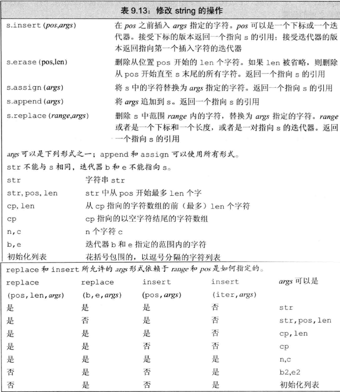

# 第一部分：C++基础

## 字符串 std::string


要想使用string，必须包含适当的头文件。并且可以进行如下的using声明。

```C++
#include <string>

using std::string;
```


### 1. 定义和初始化string对象 <a name="096683"> </a>

|        方式         |                             意义                             |
| :-----------------: | :----------------------------------------------------------: |
|      string s1      |                   默认初始化，s1是一个空串                   |
|   string s2 (s1)    |                         s2是s1的副本                         |
|   string s2 = s1    |                 等价于s2 (s1), s2是s1的副本                  |
| string s3 ("value") | s3是字面值”value"的副本， 除了字面值最后的那个空字符外 (拷贝初始化) |
| string s3 = "value" |   等价于s3("value"), s3是字面值”value"的副本 (直接初始化)    |
| string s4 (n, 'c')  |       把s4初始化为由连续n个字符c组成的串 (直接初始化)        |

`string s8 = string(lO, 'c');／／拷贝初始化． s8的内容是cccccccccc`

等价于：
`string temp (10, 'c');	// temp的内容是cccccccccc`
`string s8 = temp;	//将temp拷贝给s8`


### 2. string对象上的操作 <a name="591980"> </a>


##### 读取未知数量的string对象

```C++
while (std::cin >> word) {
    std::cout << word << std::endl;
}
/*
  在C++中，条件表达式可以是任何可以隐式转换为bool类型的表达式，
  但在Java中，条件表达式必须是一个布尔表达式。
  输入运算符>>返回一个std::istream对象，该对象可以隐式转换为bool类型。
  当输入运算符>>成功读取输入时，std::istream对象将被视为true，否则将被
  视为false。
  因此，当std::cin >> word成功读取输入时，while循环将继续执行，否则循环将终止。
*/
```


##### <a name="626379">使用getline读取一整行</a>


```C++
void readFile() {
    std::ifstream fin;
    fin.open("file.txt", std::ios::in);
    if (!fin.is_open()) {
        std::cout << "无法找到这个文件！" << std::endl;
        return;
    }
    std::string line;
    while (getline(fin, line)) {	//每次读取一行，直到文件末尾
        std::cout << line << std::endl;
    }
    fin.close();
}
```


```C++
void readFile() {
    std::ifstream fin;
    fin.open("file.txt", std::ios::in);
    if (!fin.is_open()) {
        std::cout << "无法找到这个文件！" << std::endl;
        return;
    }
    char buff[1024] = {0};  // 用于存放每行数据
    while (fin.getline(buff, sizeof(buff))) {
        std::cout << buff << std::endl;
    }
    fin.close();
}
```


##### string的empty和size操作

empty函数会根据string对象是否为空返回一个对应的布尔值。empty是string的一个成员函数。

调用该函数的方法很简单，只要使用点操作符指明是哪个对象执行了empty函数就可以了。

```C++
	std::string line;
	while (getline(fin, line)) {	//每次读入一整行，遇到空行直接跳过
	    if (!line. empty())
	    	std::cout << line << std::endl;
	}
```

size函数返回string对象的长度（即string对象中字符的个数），可以使用size函数只输出长度超过80个字符的行：

```C++
  	std::string line;
    while (getline(fin, line)) {	//每次读入一整行，输出其中超过80个字符的行
        if (line.size() > 80)
        	std::cout << line << std::endl;
    }
```


##### string::size_ type类型

对于size函数，返回的是一个string::size_type类型的值。它是一个无符号类型的值(unsigned)，而且能足够存放下任何 string对象的大小。所有用于存放string类的size函数返回值的变量，都应该是string::size_type类型的。

```C++
int main() {
    std::string str("hello world");
    auto len = str.length();	//IDE智能提示len的类型为size_t
    std::cout << len << std::endl;     //输出结果为 11
    return 0;
}
```

***注意：如果一个表达式中已经有了size()函数就不要再使用int了，这样可以避免混用int和unsigned可能带来的问题。***


##### 比较string对象

1. 相等性运算符(==和!=)分别检验两个string对象相等或不相等，string对象相等意味着它们的长度相同而且所包含的字符也全都相同。

2. 关系运算符<、<=、>、>=分别检验一个string对象是否小于、小于等于、大于、大于等于另外一个string对象。

上述这些运算符都依照（大小写敏感的）字典顺序：

- ①. 如果两个string对象的长度不同， 而且较短string对象的每个字符都与较长string对象对应位置上的字符相同，就说较短string 对象小于较长string

  对象。

- ②. 如果两个string对象在某些对应的位置上不一致， 则string对象比较的结果其实是string对象中第一对相异字符比较的结果。

下面是string对象比较的一个示例：

```c++
string str = "Hello";
string phrase = "Hello World";
string slang = "Hiya";
```

根据规则①可判断， 对象str小于对象phrase; 根据规则②可判断， 对象slang既大于str也大于phrase。


##### 为string对象赋值

对于string类而言， 允许把一个对象的值赋给另外一个对象

```c++
string st1(10, 'c'), st2;	// stl的内容是cccccccccc; st2是一个空宇符串
st1 = st2; 		//赋值： 用st2的副本替换st1的内容
		   		//此时st1和st2都是空字符串
```


##### 两个string对象相加

对string对象使用加法运算符（＋）的结果是一个新的string对象，它所包含的字符由两部分组成：前半部分是加号左侧string对象所含的字符、后半部分是加号右侧string对象所含的字符：

```C++
string s1 = "hello, ", s2 = "world\n";
string s3 = s1 + s2; 	// s3的内容是hello, world\n
s1 += s2; 				//等价于s1 = s1 + s2
```


##### 字面值和string 对象相加

标准库允许把字符字面值和字符串字面值转换成string对象， 所以在需要string对象的地方就可以使用这两种字面值来替代。

```C++
string s1= "hello", s2 = "world"; ／／在s1和s2中都没有标点符号
string s3 = s1 + ", " + s2 +'\n';
```

***注意：当把string对象和字符字面值及字符串字面值混在一条语句中使用时，必须确保每个加法运算符（＋）的两侧的运算对象至少有一个是string:***

```C++
string s4 = s1 + "," 	//正确：把一个string对象和个字面值相加
string s5 = "hello" + ", "; 	//错误： 两个运算对象都不是string
string s6 = s1 + ", " + "world";	//正确：每个加法运算符都有一个运算对象是string
string s7 = "hello" + ", " + s2; 	//错误：不能把宇面值直接相加
```

关于s6：它的工作机理和连续输入连续输出是一样的， 可以用如下的形式分组：`string s6 = (s1 + ", ") + "world";`

​				其中，子表达式s1 + "， "的结果是一个string对象，它同时作为第二个加法运算符的左侧运算对象，因此上述语句和下面的两个语句是等价的:

```C++
string tmp = s1 + ", "; //正确： 加法运算符有一个运算对象是string
s6 = tmp + "world";  //正确： 加法运算符有一个运算对象是string
```

关于s7:  s7的初始化是非法的， 根据其语义加上括号后就成了这样的形式：`string s7 = ("hello" + ", ") + s2;  //错误：不能把字面值直接相加`；括号内的			  子表达式试图把两个字符串字面值加在一起， 而编译器根本没法做到这一点， 所以这条语句是错误的。


### 3. 处理string对象中的字符


​	***关键问题是如何获取字符本身。***


##### 使用基于范围的for语句

范围for (range for) 语句。这种语句遍历给定序列中的每个元素并对序列中的每个值执行某种操作，其语法形式是:

```C++
	for (declaration : expression)
		statment
```

其中，*expression*部分是一个对象，用于表示一个序列。*declaration*部分负责定义一个变量，该变量将被用于访问序列中的基础元素。每次迭代，*declaration*部分的变量会被初始化为*expression*部分的下一个元素值。

一个string对象表示一个字符的序列，因此string对象可以作为范围for语句中的 expression部分。举一个简单的例子，我们可以使用范围for语句把string对象中的字符每行一个输出出来:

```C++
int main() {
    std::string str("hello world");
    // 每行输出str中的一个字符
    for (auto c : str) {             // 对于str中的每个字符
        std::cout << c << std::endl;      // 输出当前字符，后面紧跟一个换行符
    }
    return 0;
}
```

for循环把变量c和 str联系了起来，其中我们定义循环控制变量的方式与定义任意个普通变量是一样的。此例中，通过使用auto关键字让编译器来决定变量c的类型，这里c的类型是char。每次迭代，str的下一个字符被拷贝给c，因此该循环可以读作“对于字符串str中的每个字符c，”执行某某操作。此例中的“某某操作”即输出一个字符，然后换行。


例：使用范围for语句和ispunct函数来统计string对象中标点符号的个数

```C++
int main() {
    std::string str("hell=-o** world!!");
    decltype(str.size()) punct_cnt = 0;  // punct_cnt的类型和str.size()的返回类型一样
    for (auto item: str) {
        if (ispunct(item)) {
            ++punct_cnt;
        }
    }
    std::cout << punct_cnt << " punctuation characters in " << str << std::endl;
    // 6 punctuation characters in hell=-o** world!!
    return 0;
}
```

这里我们使用decltype关键字声明计数变量punct_cnt，它的类型是s.size函数返回值的类型，也就是string::size_type。

使用范围for语句处理string对象中的每个字符并检查其是否是标点符号。如果是，使用递增运算符给计数变量加1。最后，待范围for语句结束后输出统计结果。


##### 使用范围for语句改变字符串中的字符

如果想要改变string对象中字符的值，必须把循环变量定义成引用类型。

记住，所谓引用只是给定对象的一个别名，因此当使用引用作为循环控制变量时，这个变量实际上被依次绑定到了序列的每个元素上。使用这个引用，我们就能改变它绑定的字符。

例： 将整个string对象转化成大写

```c++
int main() {
    std::string str("hello world55");
    for (auto &item: str) {
        item = toupper(item);   // item是引用，所以改变item的值，str的值也会改变
    }
    std::cout << str << std::endl;   //输出结果为：HELLO WORLD55
}
```


##### 只处理一部分字符

访问string对象中的单个字符有两种方式:一种是使用下标，另外一种是使用迭代器。

*下标运算符*（[ ]）接收的输入参数是string ::size_type类型的值。这个参数表示要访问的字符的位置；返回值是该位置上字符的引用。

string对象的下标从0计起。如果string对象s至少包含两个字符，则s[0]是第1个字符、s[1]是第2个字符、s[s.size ()-1] 是最后一个字符。


> - string对象的下标必须大于等于0而小于s.size().
> - 在访问指定字符之前，首先检查s是否为空。
> - 不管什么时候只要对string对象使用了下标，都要确认在那个位置上确实有值。


只要字符串不是常量，就能为下标运算符返回的字符赋新值。使用下标运算符将string对象中的第一个字符修改为大写形式：

```C++
    std::string a = "hello";
    if (a.empty()) {
        std::cout << "string a is empty" << std::endl;
    } else {
        a[0] = toupper(str[0]);
    }
    std::cout << a << std::endl;    // 输出结果为Hello
```


##### 使用下标进行迭代

例： 将字符串s的第一个词改成大写形式：

```C++
int main() {
    std::string str = "Hello world!";
    int cnt = 0;
    for (decltype(str.size()) i = 0; i != str.size() && !isspace(str[i]); ++i) {
        // i的类型为string::size_type
        str[i] = toupper(str[i]);
        cnt++;
    }
    std::cout << "循环执行了 " << cnt << " 次" << std::endl;  //输出结果为：循环执行了 5 次
    std::cout << str << std::endl;  //输出结果为：HELLO world!
    return 0;
}
```


##### <a name="id1">使用下标进行随机访问</a>

通过计算得到某个下标值，然后直接获取对应位置的字符。

```C++
#include <iostream>
#include <vector>
#include <sstream>

int main() {
    const std::string hexdigits = "0123456789ABCDEF";
    std::string read_line;
    std::cout << "请输入一串0 - 15的数字，"
        << "以空格分隔，按回车结束： "
        << std::endl;
    std::getline(std::cin, read_line);

    std::stringstream ss(read_line);
    std::vector<char> result_vec;

    int num;
    while (ss >> num) {		// 非空字符
        if (num < 0 || num > 15) {
            std::cout << "输入的数字超出范围！" << std::endl;
            return 0;
        }
        result_vec.emplace_back(hexdigits[num]);
    }

    if (ss.fail() && !ss.eof()) {
        std::cout << "输入的不是数字！" << std::endl;
        return 0;
    }

    std::cout << "Your hex number is: ";
    for (const auto& item : result_vec) {
        std::cout << item;
    }
    return 0;
}
```


### 关于`string`的一些补充：

```C++
int main() {
    string s = "abcde";
    char s1[] = "abcde";
    const char *s2 = "abcde";

    cout << s[1] << endl;       // b
    cout << s1[1] << endl;      // b
    cout << s2[1] << endl;      // b

    cout << &s << endl;         // 0x7ffeeb0b4a60
    cout << &s[1] << endl;      // bcde
    cout << &s1[1] << endl;     // bcde
    cout << &s2[1] << endl;     // bcde

    return 0;
}
```

> 1. 在给定的代码中，变量 `s2` 声明为 `const char*` 类型，即指向常量字符的指针。这是因为字符串字面值在 C++ 中被视为常量。
>
>    > C++ 中的字符串字面值（例如 "abcde"）是常量，它们存储在程序的只读数据段中。因此，将一个字符串字面值赋值给一个非常量指针会导致类型不匹配的错误。
>    >
>    > 为了避免这个问题，应该使用 `const char*` 类型的指针来指向字符串字面值。通过将指针声明为 const，编译器将确保不会通过这个指针修改字符串字面值的内容。
>    >
>    > 换句话说，`const char*` 类型的指针可以用于指向字符串字面值，这样可以提供编译时的类型安全性，并且不允许对字符串进行修改。这符合了字符串字面值的只读属性。
>
> 2. 为什么`&s[1]`、`&s1[1]`、`&s2[1]`输出都是bcde？
>
>    > 在C++中，可以使用索引访问字符串中的单个字符。字符串是以零为基础的索引，也就是说第一个字符的索引是0，第二个字符的索引是1，依此类推。
>    >
>    > 在给定的代码中，变量 s 是一个字符串对象，它的值是 "abcde"。通过 `&s[1]` 这个表达式，我们取得了索引为1的字符的地址，也就是字符 'b' 的地址。
>    >
>    > `cout` 是输出流对象，通过 `<<` 操作符将输出结果发送到标准输出流。当我们打印一个指向字符的地址时，它会自动将其解释为一个以该地址开头的 C 风格字符串，并将字符串打印出来，直到遇到空字符 '\0'。
>    >
>    > 因此，`cout << &s[1]` 会将字符 'b' 后面的所有字符作为字符串输出，即 "bcde"。


## 标准库类型vector std::vector

标准库类型vector表示对象的集合，其中所有对象的类型都相同。集合中的每个对象都有一个与之对应的索引，索引用于访问对象。因为vector“容纳着”其他对象，所以它也常被称作容器(container)。

要想使用vector，必须包含适当的头文件。并且可以进行如下的using声明。

```C++
#include <vector>

using std::vector;
```

vector是一个类模板

```c++
vector<int> ivec;				 // ivec保存int类型的对象
vector<Sales_item> sales_vec;	 // 保存sales item类型的对象
vector<vector<string>> file;	 // 该向量的元素是vector对象
```

*vector 是模板而非类型，由vector生成的类型必须包含vector中元素的类型，例如 vector<int>。*


### 1. 定义和初始化vector对象


允许把一个vector对象的元素拷贝给另外一个 vector对象。此时，新vector对象的元素就是原vector对象对应元素的副本。注意两个vector对象的类型必须相同:

例：

```C++
vector<int> ivec;			// 初始状态为空
// 在此处给 ivec添加一些值
vector<int> ivec2 (ivec);	// 把ivec的元素拷贝给ivec2
vector<int> ivec3 = ivec;	// 把ivec的元素拷贝给ivec3
vector<string> svec(ivec2);	//错误:svec的元素是string对象，不是int
```


##### 列表初始化vector对象

```C++
vector<string> articles = {"a", "an", "the"};	// 正确， vector对象中包含三个元素，第一个是字符串"a"，第二个是字符												// 串"an"，最后一个是字符串"the"。
vector<string> v2("a", "an", "the");  			//错误
```


##### 创建指定数量的元素

还可以用vector对象容纳的元素数量和所有元素的统一初始值来初始化vector对象:

```C++
vector<int> ivec (10，-1); 			// 10个int类型的元素，每个都被初始化为-1
vector<string> svec (10，"hi!");		//10个string类型的元素，//每个都被初始化为"hi!"
```


##### 值初始化

通常情况下，可以只提供vector对象容纳的元素数量而不用略去初始值。此时库会创建一个值初始化的(value-initialized）元素初值，并把它赋给容器中的所有元素。这个初值由vector对象中元素的类型决定。

如果vector对象的元素是内置类型，比如 int，则元素初始值自动设为0。如果元素是某种类类型，比如 string，则元素由类默认初始化:

```C++
vector<int> ivec(10);		// 10个元素，每个都初始化为0
vector<string> svec (10);	//10个元素，每个都是空string对象
```


这种初始化方式有两个特殊限制：

①.  有些类要求必须明确地提供初始值，如果vector对象中元素的类型不支持默认初始化，我们就必须提供初始的元素值。对这种类型的对象来说,只提供元素的数量而不设定初始值无法完成初始化工作。

②. 如果只提供了元素的数量而没有设定初始值，只能使用直接初始化。

```C++
vector<int> vi = 10;	//错误:必须使用直接初始化的形式指定向量大小
```

> 这里的10是用来说明如何初始化vector对象的，我们用它的本意是想创建含有10个值初始化了的元素的vector对象，而非把数字10“拷贝”到vector中。因此，此时不宜使用拷贝初始化。


##### 列表初始值还是元素数量？

- 要注意vector在进行初始化时，传递初值使用的是圆括号()，还是花括号{} ！

例如，用一个整数来初始化`vector<int>`时，整数的含义可能是vector对象的容量也可能是元素的值。

类似的，用两个整数来初始化`vector<int>`时，这两个整数可能一个是vector对象的容量，另一个是元素的初值，也可能它们是容量为2的vector对象中两个元素的初值。通过使用花括号或圆括号可以区分上述这些含义:

```C++
vector<int> v1(10);		// v1有10个元素，每个的值都是0
vector<int> v2{10};		// v2有1个元素，该元素的值是10

vector<int> v3(10, 1);	// v3有10个元素，每个的值都是1
vector<int> v4{10, 1};	// v4有2个元素，值分别是10和1
```

在上面的代码示例中：

> - 使用的是**圆括号**，表示提供的值是用来**构造**(construct) vector对象的。
>
>   在上例中，v1的初始值说明了vector对象的容量；v3的两个初始值则分别说明了vector对象的容量和元素的初值。
>
> - 使用的是**花括号**，表示**列表初始化**（list initialize）该vector对象。
>
>   也就是说，初始化过程会尽可能地把花括号内的值当成是元素初始值的列表来处理，只有在无法执行列表初始化时才会考虑其他初始化方式。
>
>   在上例中，给 v2和v4提供的初始值都能作为元素的值，所以它们都会执行列表初始化，vector对象v2包含一个元素而vector对象v4包含两个元素。

但是，在进行初始化一个含有string对象的vector对象时（如下例）：

```C++
#include <iostream>
#include <vector>

using namespace std;

int main() {
    vector<string> v5{"hi"};        // 列表初始化
    vector<string> v6("hi");        // 错误，不能使用字符串字面值初始化vector对象
    vector<string> v7(10);          // v7有10个默认初始化的元素
    vector<string> v8{10};          // v8有10个默认初始化的元素
    vector<string> v9{10, "hi"};    // v9有10个值为"hi"的元素
    vector<string> v10(10, "hi");   // v10有10个值为"hi"的元素
}
```

尽管在上面的例子中有很多语句在初始化vector时都使用了花括号，但其实只有v5是列表初始化。

要想列表初始化 vector对象，花括号里的值必须与元素类型相同。显然不能用int初始化 string对象，所以v8和v9提供的值不能作为元素的初始值。

确认无法执行列表初始化后，编译器会尝试用默认值初始化vector对象。


### 2. 向vector对象中添加元素

利用vector的成员函数push_back可以向vector对象中添加元素。

push_back负责把一个值当成vector对象的尾元素“压到(push)” vector对象的“尾端( back)”。例如:

```C++
	std::vector <int> v1;
    for (int i = 0; i != 10; ++i) {
        v1.push_back(i);
    }
```

> C++标准要求vector应该能在运行时高效快速地添加元素。
>
> 因此既然vector对象能高效地增长，那么在定义vector对象的时候设定其大小就没有什么必要了，只有一种例外，即当所有元素的值都一样。一旦元素的值有所不同，更有效的办法是先定义一个空的vector对象，再在运行时向其中添加具体值。


***注意：范围 for 语句体内不应改变其所遍历序列的大小！！***

原因：在范围for语句中，预存了end()的值。一旦在序列中添加（删除）元素，end函数的值就可能变得无效了。

```C++
#include <vector>

using namespace std;

int main() {
    vector<int> v{1, 2, 3, 4, 5};  // 列表初始化
    for (auto &item: v) {
        item *= 2;
    }
    //这个范围for语句等价于下面的传统for语句
    for (auto begin = v.begin(), end = v.end(); begin != end; ++begin) {
        auto &item = *begin;
        item *= 2;
    }
    return 0;
}

```


##### <a name="id2">如何修改vector对象的大小	</a>

- 删除vector对象中的元素：

```C++
	// 删除vector对象中的元素：
	std::vector<int> v{1, 2, 3, 4, 5};
    for (auto it = v.begin(); it != v.end(); ) {
        if (*it % 2 == 0) {
            it = v.erase(it);	// erase返回删除元素之后的迭代器
        } else {
            ++it;
        }
    }
```

-  向vector对象中添加元素：

```C++
    // 添加vector对象中的元素：
    for (auto it = v.begin(); it != v.end(); ++it) {
        if (*it % 2 == 0) {		// 在满足*it % 2 == 0的元素前面插入本元素
            it = v.insert(it, *it);		// insert返回添加的元素的迭代器
            ++it;   // 跳过刚刚添加的元素
        }
    }
```


### 3. 其他vector操作

std::vector的其他操作与std::string相似。（下图中只是vector支持的操作中的一部分）


访问vector对象中元素的方法和访问string对象中字符的方法差不多，也是通过元素在vector对象中的位置。

例如，可以使用范围for语句处理vector对象中的所有元素:

```C++
#include <vector>
#include <iostream>

using namespace std;

int main() {
    vector<int> v{1, 2, 3, 4, 5, 6};  // 列表初始化
    for (auto &item: v) {
        item *= item;
    }
    for (auto item: v) {
        cout << item << " ";
    }
    cout << endl;   // 输出值为：1 4 9 16 25 36
    return 0;
}
```


vector的empty和size两个成员与string的同名成员功能完全一致: 

- empty检查vector对象是否包含元素然后返回一个布尔值; 
- size则返回vector对象中元素的个数,返回值的类型是由vector定义的size_type类型。

> 要使用size_type，需首先指定它是由哪种类型定义的。
>
> vector对象的类型总是包含着元素的类型：
>
> ```C++
> vector<int>::size_type		//正确
> vector::size_type			//错误
> ```


关于相等性运算符，与string的相等性运算符的功能一致。

1. 两个vector对象相等当且仅当它们所含的元素个数相同，而且对应位置的元素值也相同。

2. 关系运算符依照字典顺序进行比较:

   如果两个vector对象的容量不同，但是在相同位置上的元素值都一样，则元素较少的vector对象小于元素较多的vector对象；

   若元素的值有区别，则vector对象的大小关系由第一对相异的元素值的大小关系决定。


*只有当元素的值可比较时，vector对象才能被比较！*


##### 计算vector内对象的索引

例： 假设有一组成绩的集合，其中成绩的取值是从0到100。以10分为一个分数段，要求统计各个分数段各有多少个成绩。显然，从0到100总共有101种可能的成绩取值，这些成绩分布在11个分数段上:每10个分数构成一个分数段，这样的分数段有10个，额外还有一个分数段表示满分100分。这样第一个分数段将统计成绩在0到9之间的数量;第二个分数段将统计成绩在10到19之间的数量，以此类推。最后一个分数段统计满分100分的数量。

与string中<a href="#id1">使用下标进行随机访问</a>的代码类似：

```C++
#include <iostream>
#include <sstream>
#include <vector>

using namespace std;

int main() {
    string read_line;
    getline(cin, read_line);    // 输入值：42 65 95 100 39 67 95 76 88 76 83 92 76 93
    stringstream ss(read_line);

    vector<int> result_vec(11, 0);

    int num;
    while (ss >> num) {			// 非空字符
        if (num < 0 || num > 100) {
            cout << "Invalid score" << endl;
            return 0;
        }
        ++result_vec[num / 10];	// 将当前分数段的计数值加1
    }

    if (ss.fail() && !ss.eof()) {
        cout << "输入的不是数字！" << endl;
        return 0;
    }

    for (auto i : result_vec) {
        cout << i << " ";   // 输出为：0 0 0 1 1 0 2 3 2 4 1
    }

    return 0;
}
```

在上面的代码中：

```C++
	++result_vec[num / 10];

	// 本注释上面这一行代码，等价于本注释下面两行代码

	auto ind = num / 10;	//得到分数段索引
	result_vec[ind] = result_vec[ind] + 1	//将计数值加1
```


##### 利用`vector`和`stringstream`模拟`Java`中`String`的`split`方法

```C++
#include <iostream>
#include <string>
#include <sstream>
#include <vector>

using namespace std;

vector<string> string_split(string& str, char delimiter) {
    std::vector<std::string> result;
    std::stringstream ss(str);
    std::string item;

    while (std::getline(ss, item, delimiter)) {
        result.push_back(item);
    }

    return result;
}

int main() {
    string str = "A-AA-AAA";
    auto res = string_split(str, '-');
    for (const auto& re : res) {	//输出内容为：A AA AAA
        cout << re << endl;
    }
    return 0;
}
```


##### 不能用下标形式添加元素

正确：

```C++
	vector<int> ivec;
	for (int ix = 0; ix != 10; ++ix) {
	    ivec.push_back(ix);
	}
```

错误：

```C++
    vector<int> ivec;
    for (int ix = 0; ix != 10; ++ix) {
        ivec[ix] = ix;      // 会报错，因为ivec是空的，没有元素，不能用下标访问
    }
```


> vector对象(以及string对象)的下标运算符可用于访问已存在的元素，而不能用于添加元素。


## 迭代器

使用迭代器（iterator）是一种通用的访问容器中元素的方法。

类似于指针类型，迭代器也提供了对对象的间接访问。就迭代器而言，其对象是容器中的元素或者string对象中的字符。使用迭代器可以访问某个元素，迭代器也能从一个元素移动到另外一个元素。

迭代器有有效和无效之分。有效的迭代器指向某个元素，或指向尾元素的下一个位置，其它情况都属于无效。


> 在 C++ 中，迭代器是一种抽象的概念，它可以被看作是一种类似于指针的对象，用于遍历容器中的元素。迭代器可以被看作是一种指针，但并不是所有迭代器都是指针。
>
> C++ 中的迭代器可以分为五种类型：输入迭代器、输出迭代器、前向迭代器、双向迭代器和随机访问迭代器。其中，输入迭代器和输出迭代器是最基本的迭代器类型，它们只支持读取和写入操作，不支持算术运算。前向迭代器、双向迭代器和随机访问迭代器则支持不同程度的算术运算，例如前向迭代器只支持单向遍历，双向迭代器支持双向遍历，随机访问迭代器支持随机访问。
>
> 对于指针类型的容器，例如数组和指针，它们的迭代器就是指针。对于其他类型的容器，例如 vector、list、set 等，它们的迭代器并不一定是指针，而是一种类似于指针的对象，用于遍历容器中的元素。例如，vector 的迭代器是一种随机访问迭代器，它可以像指针一样进行算术运算，但并不是指针类型。


### 1. 使用迭代器

和指针不一样的是，获取迭代器不是使用取地址符，有迭代器的类型同时拥有返回迭代器的成员。比如，这些类型都拥有名为 begin和 end 的成员，

其中 begin 成员负责返回指向第一个元素(或第一个字符)的迭代器。如有下述语句:

```C++
	// 由编译器决定b和e的类型
	// b表示v的第一个元素，e表示v尾元素的下一位置
	auto b = v.begin(), e = v.end();	//b和e的类型相同
```

end 成员则负责返回指向容器(或string对象)“尾元素的下一位置(onc past the end)"的迭代器，也就是说，该迭代器指示的是容器的一个本不存在的“尾后(off the end)”元素。

这样的迭代器没什么实际含义，仅是个标记而已，表示我们已经处理完了容器中的所有元素。

end成员返回的迭代器常被称作尾后迭代器（off-the-end iterator）或者简称为尾迭代器(end iterator)。特殊情况下如果容器为空，则begin和 end返回的是同一个迭代器。


***一般情况下，我们不在乎迭代器准确的类型到底是什么。***


##### <a name="idde">迭代器运算符</a>


和指针类似，可以通过解引用迭代器来获取它所指示的元素。

执行解引用的迭代器必须合法并确实指示着某个元素。试图解引用一个非法迭代器或者尾后迭代器都是未被定义的行为(UB)。


例：利用迭代器将string对象的第一个字母改为大写形式：

```C++
    string str("some string");
    if (str.begin() != str.end()) {	
        auto it = str.begin();
        *it = toupper(*it);
    }
    cout << str << endl;		// 输出结果为：Some string
```


##### 将迭代器从一个元素移动到另外一个元素

迭代器使用递增（++）运算符来从一个元素移动到下一个元素。

从逻辑上来说，迭代器的递增和整数的递增类似，整数的递增是在整数值上“加1",迭代器的递增则是将迭代器“向前移动一个位置”。

> 因为 end 返回的迭代器并不实际指示某个元素,所以不能对其进行递增或角引用的操作。

例：将字符串对象中第一个单词改为大写：

```c++
    string str("some string");
    for (auto it = str.begin(); it != str.end() && !isspace(*it); ++it) {
        *it = toupper(*it);
    }
    cout << str << endl;    // 输出结果为：SOME string
```


##### 迭代器类型

就像不知道string 和 vector 的size_type 成员到底是什么类型一样，一般来说我们也不知道(其实是无须知道)迭代器的精确类型。

而实际上，那些拥有迭代器的标准库类型使用iterator和const_iterator来表示迭代器的类型:

```C++
vector<int>::iterator it;		// it能读写vector<int>的元素
string::iterator it2;			// it2能读写string对象中的字符

vector<int>::const_iterator it3;	// it3只能读元素，不能写元素
string::const_iterator it4;			// it4只能读字符，不能写字符
```

const_iterator和常量指针差不多，能读取但不能修改它所指的元素值。相反，iterator的对象可读可写。

- 如果vector对象或string对象是一个常量，只能使用const_iterator;
- 如果vector对象或string对象不是常量，那么既能使用iterator也能使用const_iterator。


##### begin 和 end 运算符

begin和end返回的具体类型由对象是否是常量决定，如果对象是常量，begin和end返回const_iterator; 如果对象不是常量，返回iterator:

```C++
	vector<int> v;
	const vector<int> cv;
	auto it1 = v.begin();	// it1的类型是vector<int>::iterator
	auto it2 = cv.begin();	// it2的类型是vector<int>::const_iterator
	auto it3 = v.cbegin();  // it3的类型是vector<int>::const_iterator
```

有时候这种默认的行为并非我们所要。如果对象只需读操作而无须写操作的话最好使用常量类型(比如 const_iterator)。为了便于专门得到const_iterator类型的返回值,C++11新标准引入了两个新函数,分别是cbegin和cend（见上例中it3）。


##### 结合解引用和成员访问操作

解引用迭代器可获得迭代器所指的对象，如果该对象的类型恰好是类，就有可能希望进一步访问它的成员。

例如，对于一个由字符串组成的vector对象来说，要想检查其元素是否为空，令it是该vector对象的迭代器，只需检查it所指字符串是否为空就可以了，其代码如下所示:

```C++
	(*it).empty
```

`(*it).empty ()`中的圆括号必不可少，该表达式的含义是先对it解引用，然后解引用的结果再执行点运算符。

如果不加圆括号，点运算符将由it来执行，而非it解引用的结果：

```C++
	(*it).empty		// 解引用it，然后调用结果对象的empty成员
    *it.empty		// 错误:试图访问it对象中的名为empty的成员，但it是个迭代器，没有empty成员
```


为了简化以上的表达式，**箭头运算符** (->) 把箭头运算符把解引用和成员访问两个操作结合在一起，也就是说，it->mem和(*it).mem表达的意思相同。


例：假设用一个名为text的字符串向量存放文本文件中的数据，其中的元素要么是一句话要么是一个用于表示段落分隔的空字符串。如果要输出text中第一段的内容，可以利用迭代器写一个循环令其遍历text，直到遇到空字符串的元素为止。完整代码如下：

```C++
#include <iostream>
#include <fstream>
#include <iostream>
#include <fstream>
#include <string>
#include <vector>

using namespace std;

void readFile(vector<string>* v) {
    ifstream fin;
    fin.open("file.txt", ios::in);
    if (!fin.is_open()) {
        cout << "无法找到这个文件！" << endl;
        return;
    }
    string line;
    while (getline(fin, line)) {    //每次读取一行，直到文件末尾
        v->push_back(line);
    }
    fin.close();
}

int main() {
    vector<string> text;
    readFile(&text);
    for (auto it = text.begin(); it != text.end() && !it->empty(); ++it) {
        cout << *it << endl;
    }

    return 0;
}
```

`file.txt`：

```
A
B

C
```

输出内容：

```
A
B
```


##### 某些对vector对象的操作会使迭代器失效

虽然vector对象可以动态地增长，但是也会有一些副作用。

已知的一个限制是不能在范围for循环中向vector对象添加元素。

另外一个限制是任何一种可能改变vector对象容量的操作，比如 push_back，都会使该vector对象的迭代器失效，我们应该更新迭代器，使其重新生效。

请见<a href="#id2">如何修改vector对象的大小</a>。


### 2. 迭代器运算

迭代器的递增运算令迭代器每次移动一个元素，所有的标准库容器都有支持递增运算的迭代器。

类似的，也能用==和!=对任意标准库类型的两个有效迭代器进行比较。


<a name="idq1">迭代器支持的运算</a>


##### 迭代器的算术运算

可以令迭代器和一个整数值相加（或相减），其返回值是向前（或向后）移动了若干个位置的迭代器。

执行这样的操作时，结果迭代器或者指示原vector对象（或string对象）内的一个元素，或者指示原vector对象（或string对象）尾元素的下一位置。

例：

```C++
#include <iostream>
#include <vector>

using namespace std;

int main()
{
	vector<int> v{1, 2, 3, 4};
    // 添加vector对象中的元素：
    for (auto it = v.begin(); it != v.end(); ++it) {
        // 将原vector偶数位置的元素的值变为原来的两倍，放到这个位置的后面
    	if (*it % 2 == 0) {
            it = v.insert(it + 1, (*it * 2));
        }
    }

    for (int i : v) {       // 输出内容：1 2 4 3 4 8 
        cout << i << " ";
    }
    cout << "\n";

    // 计算得到最接近vi中间位置的迭代器
    auto mid = v.begin() + v.size() / 2;
    cout << *mid << endl;   // 输出内容：3

    return 0;
}
```

如果vi有20个元素，vi.size() / 2得10，此例中即令mid等于vi.begin() +10。已知下标从0开始，则迭代器所指的元素是vi[10]，也就是从首元素开始向前相隔10个位置的那个元素。


对于string或vector的迭代器来说,除了判断是否相等,还能使用关系运算符(<、<=、>、>=)对其进行比较。

参与比较的两个迭代器必须合法而且指向的是同一个容器的元素（或者尾元素的下一位置)。

例如，假设it和mid是同一个vector对象的两个迭代器，可以用下面的代码来比较它们所指的位置孰前孰后:

```C++
	if (it < mid)
		// 处理vi前半部分的元素
```

只要两个迭代器指向的是同一个容器中的元素或者尾元素的下一位置，就能将其相减，所得结果是两个迭代器的距离。

所谓距离指的是右侧的迭代器向前移动多少位置就能追上左侧的迭代器，其类型是名为 **difference_type** 的带符号整型数。

string和vector都定义了 difference_type，因为这个距离可正可负，所以 difference_type 是带符号类型的。


##### 使用迭代器运算

使用迭代器进行二分查找（二分搜索）代码：

```C++
#include <iostream>
#include <vector>

using namespace std;

int binary_search(const vector<int> &nums, int target) {
    auto begin = nums.begin(), end = nums.end();
    while (true) {
        if (begin == end) {
            return -1;
        }
        auto mid = begin + (end - begin) / 2;
        if (target < *mid) {
            end = mid;
        } else if (target > *mid) {
            begin = mid + 1;
        } else {
            return mid - nums.begin();
        }
    }
}

int main() {
    vector<int> nums{1, 3, 5, 7, 9, 11, 13};

    int target = 1;
    int index = binary_search(nums, target);

    if (index != -1) {
        cout << "目标元素 " << target << " 的索引为 " << index << endl;
    } else {
        cout << "目标元素 " << target << " 不存在" << endl;
    }

    return 0;
}
```


问题：为什么在二分查找中，用的是`mid = begin + (end - begin) / 2;`，而不是 `mid = (begin + end) /2;` ?

> C++并没有定义两个迭代器的加法运算,实际上直接把两个迭代器加起来是没有意义的。
>
> 与之相反，C++定义了迭代器的减法运算，两个迭代器相减的结果是它们之间的距离，也就是说，将运算符右侧的迭代器向前移动多少个元素后可以得到左侧的迭代器，参与运算的两个迭代器必须指向同一个容器中的元素或尾后元素。
>
> 另外，C++还定义了迭代器与整数的加减法运算，用以控制迭代器在容器中左右移动。
>
> 在本题中，因为迭代器的加法不存在，所以`mid = (beg + end) / 2;`不合法`mid = beg + (end - beg) / 2`;的含义是，先计算end-beg的值得到容器中的元素个数，然后控制迭代器从开始处向右移动二分之一容器的长度，从而定位到容器正中间的元素。


## 数组

数组的大小确定不变，不能向数组中添加元素。

因为数组的大小固定，因此对某些特殊的应用来说程序的运行时候性能比较好，但也损失了一些灵活性。

如果不清楚元素的确切个数，请使用vector


### 1. 定义和初始化内置数组

编译时数组的维度（数组中的元素个数）应该是已知的。换句话说，维度必须是一个常量表达式：

```C++
	unsigned cnt = 42;              // 不是常量表达式
	constexpr unsigned sz = 42;     // 常量表达式
	int arr[10];                    // 含有10个整数的数组
	int *parr[sz];                  // 含有42个整型指针的数组
	string bad[cnt];                // 错误：cnt不是常量表达式
	string strs[get_size()];        // 当get_size是constexpr时正确
```

默认情况下，数组的元素被默认初始化。

定义数组的时候必须指定数组的类型，不允许用auto关键字由初始值的列表推断类型。另外和 vector一样，数组的元素应为对象，因此不存在引用的数组。


##### 显式初始化数组元素

可以对数组的元素进行列表初始化，此时允许忽略数组的维度。

如果在声明时没有指明维度，编译器会根据初始值的数量计算并推测出来；相反，如果指明了维度，那么初始值的总数量不应该超出指定的大小。

如果维度比提供的初始值数量大，则用提供的初始值初始化靠前的元素，剩下的元素被初始化成默认值：

```C++
    const unsigned sz = 3;
    int ial[sz] = {0, 1, 2};			// 含有3个元素的数组,元素值分别是0,1,2
    int a2[] = {0, 1, 2};				// 含有3个元素的数组,元素值分别是0,1,2
    int a3[5] = {0, 1, 2};				// 含有5个元素的数组,元素值分别是0,1,2,0,0
    string a4[3] = {"hi", "bye"};	    // 含有3个元素的数组,元素值分别是"hi","bye",""
    int a5[2] = {0, 1, 2};			    // 错误! 初始值过多
```


##### 字符数组的特殊性

字符数组有一种额外的初始化形式，我们可以用字符串字面值对此类数组初始化。

**当使用这种方式时，一定要注意字符串字面值的结尾处还有一个空字符，这个空字符也会像字符串的其他字符一样被拷贝到字符数组中去:**

```C++
    char a1[] = {'C', '+', '+'};   			// 列表初始化，没有空字符，维度为3
    char a2[] = {'C', '+', '+', '\0'}; 		// 列表初始化，有显式的空字符，维度为4
    char a3[] = "C++";  					// 自动添加空字符，维度为4
    char a4[3] = "C++"; 					// 错误，没有空间存放空字符
```


##### 不允许拷贝和赋值

不能将数组的内容拷贝给其他数组作为其初始值，也不能用数组为其他数组赋值。

```c++
    int a[] = {1, 2, 3};
    int a2 = a; 	// 错误：不允许使用一个数组初始化另一个数组
    a2 = a; 		// 错误：不允许把一个数组直接赋值给另一个数组
```


##### 理解数组的复杂声明

和vector一样，数组能存放大多数类型的对象。例如，可以定义一个存放指针的数组。又因为数组本身就是对象，所以允许定义数组的指针及数组的引用。在这几种情况中，定义存放指针的数组比较简单和直接，但是定义数组的指针或数组的引用就稍微复杂一点了:

```C++
    int arr[10];  				// arr是含有10个整数的数组
    int *ptrs[10];  			// ptrs是含有10个int*的数组
    int &refs = /* ? */;  		// 错误：不存在引用的数组
    int (*Parray)[10] = &arr;  	// Parray指向一个含有10个int*的数组
    int (&arrRef)[10] = arr;  	// arrRef引用一个含有10个int的数组
	int *(&arry)[10] = ptrs;	// arry是数组的引用，该数组中含有10个指针
```

对于ptrs：ptrs是一个大小为10的数组，数组中存放的是指向int的指针。

对于Parray：(*Parray)表示Parray是一个指针，它指向一个int数组，数组中包含10个元素。

对于arrRef：(&arrRef)表示arrRef是一个引用，它引用的对象是一个大小为10的数组，数组中元素的类型是int。

对于arry：arry是一个含有10个int型指针的数组的引用。

> 要想理解数组声明的含义,最好的办法是从数组的名字开始按照由内向外的顺序阅读。

```C++
    int arr[10] = {1, 2, 3, 4, 5, 6, 7, 8, 9, 10};
	int *ptrs[10] = {&arr[0], &arr[1], &arr[2], &arr[3], &arr[4], &arr[5], &arr[6], &arr[7], &arr[8], &arr[9]};

	cout << **Parray << endl;           // 输出结果为 1
    cout << *(*Parray + 1) << endl;     // 输出结果为 2

    cout << arrRef[0] << endl;          // 输出结果为 1
    cout << arrRef[1] << endl;          // 输出结果为 2

	cout << *arry[0] << endl;           // 输出结果为 1
    cout << *arry[1] << endl;           // 输出结果为 2
```


### 2. 访问数组元素

使用数组下标的时候，通常将其定义为size_t类型，这是一种机器相关的无符号类型。


可以使用范围for语句来遍历数组。

```c++
for (auto i : arr)
    cout << i << " ";
cout << endl;
```

使用数组重写vector中<a href="#id1">使用下标进行随机访问</a>的代码

```C++
#include <iostream>
#include <sstream>

using namespace std;

int main() {
    string read_line;
    getline(cin, read_line);    // 输入值：42 65 95 100 39 67 95 76 88 76 83 92 76 93
    stringstream ss(read_line);

    int result_arr[11] = {};

    int num;
    while (ss >> num) {       // while (ss >> num) 会一直读取，直到遇到空白符
        if (num < 0 || num > 100) {
            cout << "Invalid score" << endl;
            return 0;
        }
        ++result_arr[num / 10];
    }

    if (ss.fail() && !ss.eof()) {
        std::cout << "输入的不是数字！" << std::endl;
        return 0;
    }

    for (auto i : result_arr) {
        cout << i << " ";   // 输出为：0 0 0 1 1 0 2 3 2 4 1
    }

    return 0;
}

```


##### 检查下标的值

与string和vector一样，数组的下标是否在合理范围之内由程序员负责检查。


> 大多数常见的安全问题都源于缓冲区溢出错误。当数组或其他类似数据结构的下标越界并试图访问非法内存区域时，就会产生此类错误。


### 3. 指针和数组


在很多用到数组名字的地方，编译器都会自动地将其替换为一个**指向数组首元素的指针**。

```C++
    string strs[] = {"one", "two", "three"};
    string *p = strs;
    cout << *p << endl;     // 输出为：one
    string *p1 = &strs[0];		// 等价于 string *p = strs;
    cout << *p1 << endl;    // 输出为：one
```


**decltype**

下面得到一个含有10个整数的数组类型：

```c++
int a1[10] = {};
decltype(a1) a2 = {};
a2[2] = 5; 				// 将5复制给a2中下标为2的元素
```

**auto**

下面得到一个整型指针：

```c++
int a1[10] = {};
auto a2(a1);		// a2是一个整形指针，指向a1的第一个元素
a2 = 42; 			// 错误： ia2是一个指针，不能用int值给指针赋值
```


##### 指针也是迭代器

string和vector的迭代器支持的运算，指针都支持。

使用递增运算符既可以让指向数组元素的指针向前移动到下一个位置上。

这样可以获取数组尾元素的下一个位置的指针（其中N为数组长度）：

```c++
	int *end = &a[N];
```

利用这点，我们也可以写出一个循环来输出arr中的全部元素：

```C++
    int *end = &result_arr[11];
    for (int *i = result_arr; i != end; ++i) {
        cout << *i << " ";
    }
```


##### <a href="#idppp">标准库函数begin和end</a>

C++11提供了begin和end函数，可以获取数组首元素的指针和尾后指针：

```c++
	int ia[] = {1, 2, 3, 4, 5};
	int *beg_p = begin(a);		// 指向ia首元素的指针
	int *end_p = end(a);		// 指向ia尾元素的下一位置的指针
```

例：

```c++
    int ia[] = {1, 2, 3, -3, 4, 5};
    int *pbeg = begin(ia);
    int *pend = end(ia);
    while (*pbeg != *pend && *pbeg >= 0) {
        ++pbeg;
    }
    cout << "数组中第一个负数是" << *pbeg << endl;
```

尾后指针不能解引用和递增操作。

和迭代器一样，两个指针相减的结果是它们之间的距离。参与运算的两个指针必须指向同一个数组当中的元素。


##### 指针运算

指向数组元素的指针可以执行[表3.6](#idde) ，[表3.7](#idq1)中列出的所有迭代器运算。

这些运算，包括解引用、递增、比较、与整数相加、两个指针相减等，用在指针和用在迭代器上意义完全一致。


给（从）一个指针加上（减去）某整数值，结果仍是指针。新指针指向的元素与原来的指针相比前进了(后退了)该整数值个位置：

```C++
    constexpr size_t sz = 5;
    int arr[sz] = {1, 2, 3, 4, 5};
    int *ip = arr;          // equivalent to int *ip = &arr[0]
    int *ip2 = ip + 4;      // ip2 points to arr[4], the last element in arr
```

ip加上4所得的结果仍是一个指针，该指针所指的元素与ip原来所指的元素相比前进了4个位置。

给指针加上一个整数，得到的新指针仍需指向同一数组的其他元素，或者指向同一数组的尾元素的下一位置。但是计算所得的指针超出上述范围就会产生错误:

```C++
    int *pend = arr + sz;   // pend points just past the last element in arr
    int *p2 = arr + 10;     // error: there is no arr[10]
```


和迭代器类似，两个指针相减的结果就是它们之间的距离。参与运算的两个指针必须指向同一个数组当中的元素：

```C++
    constexpr size_t sz = 5;
    int arr[sz] = {1, 2, 3, 4, 5};
	auto n = end(arr) - begin(arr);  	// n = 5
```

两指针相减的结果是**ptrdiff_t**的标准库类型。由于差值可能为负值，所以ptrdiff_t是一种带符号的类型。


我们也可以通过这种方式来遍历数组中的元素：

```C++
int main() {
    constexpr size_t sz = 5;
    int arr[sz] = {1, 2, 3, 4, 5};
    int *p = arr;
    int *p2 = arr + sz;
    while (p != p2) {			//  括号内写成(p < p2)也可
        cout << *p << endl;
        ++p;
    }
    return 0;
}
```


但是，如果两个指针分别指向不相关的对象，则不能比较它们：

```C++
    int n = 0, m = 54;
    int *p3 = &n, *p4 = &m;
    while (p3 < p4)    	// p3和p4指向的是不同的对象，所以比较毫无意义！
```


上述指针运算同样适用于空指针和所指对象并非数组的指针。

在后一种情况下，两个指针必须指向同一个对象或该对象的下一位置。

如果p是空指针，允许给p加上或减去一个值为o的整型常量表达式(参见2.4.4节，第58页)。两个空指针也允许彼此相减，结果当然是0。


##### 解引用和指针运算的交互

给（从）一个指针加上（减去）某整数值，结果仍是指针。假设结果指针指向了一个元素，则允许解引用该结果指针:

```C++
    int arr[] = {1, 2, 3, 4, 5};
    auto last = *(arr + 4);       // 是arr[4]的值，等价于arr[4]
	
	auto cal = *arr + 4;        // 等价于arr[0] + 4
```


##### 下标和指针

对数组使用下标运算符时，编译器会自动将数组名解释为一个指向数组首元素的指针。

```C++
	int arr[5] = {1, 2, 3, 4, 5};
	int x = arr[2]; // 使用下标运算符访问数组元素

	int *p = arr;		// p指向arr的首元素
	int y = *(p + 2); 	// 等价于 int x = arr[2];
```


只要指针指向的是数组中的元素(或者数组中尾元素的下一位置)，都可以执行下标运算：


```C++
int main() {
    int ia[] = {1, 2, 3, 4, 5};
    int *p = &ia[2];    // 指向索引为2的元素
    int j = p[1];       // 指向索引为3的元素
    int k = p[-2];      // 指向索引为0的元素
    cout << "j是" << j << " " << "k是" << k << endl;

    vector<int> ivec = {1, 2, 3, 4, 5};
    int *p1 = &ivec[2]; // 指向索引为2的元素
    int l = p1[1];      // 指向索引为3的元素
    int m = p1[-2];     // 指向索引为0的元素
    cout << "l是" << l << " " << "m是" << m << endl;

    return 0;
}
```

虽然标准库类型string和 vector也能执行下标运算，但是数组与它们相比还是有所不同。标准库类型限定使用的下标必须是无符号类型，而内置的下标运算无此要求，上面的最后一个例子很好地说明了这一点。内置的下标运算符可以处理负值，当然，结果地址必须指向原来的指针所指同一数组中的元素（或是同一数组尾元素的下一位置)。


### 4. C风格字符串

> 尽管C++支持C风格字符串,但在C++程序中最好还是不要使用它们。这是因为C风格字符串不仅使用起来不太方便,而且极易引发程序漏洞,是诸多安全问题的根本原因。

C风格字符串是为了表达和使用字符串而形成的一种约定俗成的写法。

按此习惯书写的字符串存放在字符数组中并以空字符结束(null terminated)。以空字符结束的意思是在字符串最后一个字符后面跟着一个空字符('\0')。一般利用指针来操作这些字符串。


##### C标准库string函数 <a name="935779"> </a>


***传入此类函数的指针必须指向以空字符串作为结束的数组！！***

例：

```C++
int main() {
    char ca[] = {'C', '+', '+'};	// 应该写成：char ca[] = {'C', '+', '+', '\0'};，输出结果为3
    cout << strlen(ca) << endl;		// 严重错误：ca没有以空字符结束
    return 0;
}
```

此例中，ca虽然也是一个字符数组但它不是以空字符作为结束的，因此上述程序将产生未定义的结果。strlen函数将有可能沿着ca在内存中的位置不断向前寻找，直到遇到空字符才停下来。


##### 比较字符串

比较标准库string对象的时候，我们可以使用普通的关系运算符和相等性运算符：

```C++
    string s1 = "a string example";
    string s2 = "a different string";
    if (s1 < s2) {}    // false
```

但是如果把这些运算符用在两个C-Style字符串上，实际比较的是指向数组首元素的指针，而不是字符串本身：

```C++
    const char ca1[] = "A string example";
    const char ca2[] = "A different string";
    if (ca1 < ca2){}	// 未定义行为，试图比较两个无关地址
```

实际上，上面的if条件比较的是两个 `const char*` 的值。这两个指针的指向并不是同一个对象，所以这是未定义行为。


要想比较两个C风格字符串需要调用strcmp函数，此时比较的就不再是指针了。

如果两个字符串相等，strcmp返回0；

如果前面的字符串较大，返回正值；

如果后面的字符串较大，返回负值：

```C++
	if (strcmp(ca1, ca2) < 0)	// 和两个string对象的比较s1 < s2的效果一样
```


##### 目标字符串的大小由调用者指定

连接或拷贝C风格字符串也与标准库string对象的同类操作差别很大。例如，要想把刚刚定义的那两个string对象s1和 s2连接起来，可以直接写成下面的形式：

```C++
	// 将largeStr初始化成s1、一个空格和s2的连接
	string largeStr = s1 + " " + s2;
```

同样的操作如果放到ca1和ca2这两个数组身上就会产生错误了。表达式cal + ca2试图将两个指针相加，显然这样的操作没什么意义，也肯定是非法的。

正确的方法是使用strcat函数和 strcpy函数。不过要想使用这两个函数，还必须提供一个用于存放结果字符串的数组，该数组必须足够大以便容纳下结果字符串及末尾的空字符。下面的代码虽然很常见，但是充满了安全风险，极易引发严重错误：

```C++
	// 如果我们计算错了largestr的大小将引发严重错误
	strcpy(largeStr, ca1);		// 把ca1拷贝给largeStr
	strcat(largeStr, " ");		// 在largeStr的末尾加上一个空格
	strcat(largeStr, ca2);		// 把ca2连接到largeStr后面
```

一个潜在的问题是，我们在估算largeStr所需的空间时不容易估准，而且 largeStr所存的内容一旦改变，就必须重新检查其空间是否足够。


> 对大多数应用来说,使用标准库string要比使用C风格字符串更安全、更高效。


### 5. 与旧代码的接口

##### 混用string对象和C风格字符串

char[] 转化为 string:

任何出现字符串字面值的地方都可以用以空字符结束的字符数组来替代:

- 允许使用以空字符结束的字符串数组来初始化string对象或为string对象赋值。
- 在string 对象的加法运算中允许使用以空字符结束的字符数组作为其中一个运算对象（不能两个运算对象都是）；在string对象的复合赋值运算中允许使用以空字符结束的字符数组作为右侧的运算对象。


string 转化为 char[]:

```C++
	char *str = s;					// 错误：不能用string对象初始化char*
	const char *str = s.c_str();	// 正确
```

`c_str`函数的返回值是一个C风格的字符串。也就是说，函数的返回结果是一个指针，**该指针指向一个以空字符结束的字符数组**，而这个数组所存的数据恰好与那个string对象的一样。结果指针的类型是 `const char*`，从而确保我们不会改变字符数组的内容。

> 虽然`p`指向的是字符数组的首地址，但它本身并不是字符数组的数组名


##### <a name="307307">使用数组初始化vector对象</a>

不允许使用一个数组为另一个内置类型的数组赋初值，也不允许使用vector对象初始化数组。

相反的，允许使用数组来初始化vector对象。要实现这一目的，只需指明要拷贝区域的首元素地址和尾后地址就可以了:

与此同时，用于初始化vector对象的值也可能仅是数组的一部分:

```C++
    int arr[] = {1, 2, 3, 4, 5};
    vector<int> vec(begin(arr), end(arr));    // 用arr的所有元素初始化vec
    vector<int> vec1(arr + 2, arr + 5);         // 用arr[2]~arr[4]初始化vec1  内容为：3 4 5
```


### 6. 多维数组


***严格地说，C++中并没有多维数组，通常所说的多维数组其实是数组的数组！！***


##### 多维数组的初始化

```c++
	int ia[3][4] =
	{   // 有三个元素，其中每个元素都是长度为4的int型数组
	    {0, 1, 2, 3},   // initializers for the row indexed by 0
	    {4, 5, 6, 7},   // initializers for the row indexed by 1
	    {8, 9, 10, 11}  // initializers for the row indexed by 2
	};
	// 等效初始化，每行不包含可选的嵌套大括号
	int ib[3][4] = {0, 1, 2, 3, 4, 5, 6, 7, 8, 9, 10, 11};
	// explicitly initialize only element 0 in each row
	int ic[3][4] = {{ 0 }, { 4 }, { 8 }};
	// explicitly initialize row 0; the remaining elements are value initialized
	int id[3][4] = {0, 3, 6, 9};
```

注意：在声明多维数组时，如果不显式指定数组的大小，则只能省略最后一维的大小，而其他维度的大小必须显式指定。

```C++
	int a[][2] = {
            {1, 2},
            {4, 5},
            {7, 8}
    };
    // 等价于
 	int a[3][2] = {
            {1, 2},
            {4, 5},
            {7, 8}
    };
	// 更多维度的数组也与此同理
	    int arr[][3][4] = {		// arr[2][3][4]
            {{1,  2,  3,  4},  {5,  6,  7,  8},  {9,  10, 11, 12}},
            {{13, 14, 15, 16}, {17, 18, 19, 20}, {21, 22, 23, 24}}
    };
```


##### 多维数组的下标引用

可以使用下标访问多维数组的元素，数组的每个维度对应一个下标运算符。如果表达式中下标运算符的数量和数组维度一样多，则表达式的结果是给定类型的元素。如果下标运算符数量比数组维度小，则表达式的结果是给定索引处的一个内层数组。

```c++
	// 用arr的首元素为ia的最后一行的最后一个元素赋值
	ia[2][3] = arr[0][0][0];
	int (&row)[4] = ia[1];  // 把row绑定到ia的第二个4元素数组上
```

多维数组寻址公式：


##### 使用范围`for`语句处理多维数组

使用范围`for`语句处理多维数组时，为了避免数组被自动转换成指针，语句中的外层循环控制变量必须声明成引用类型。

```c++
for (const auto &row : ia)  // for every element in the outer array
    for (auto col : row)    // for every element in the inner array
        cout << col << endl;
```

如果`row`不是引用类型，编译器初始化`row`时会自动将数组形式的元素转换成指向该数组内首元素的指针，这样得到的`row`就是`int*`类型，而之后的内层循环则试图在一个`int*`内遍历，程序将无法通过编译。

```c++
for (auto row : ia)
    for (auto col : row)
```

*使用范围`for`语句处理多维数组时，除了**最内层**的循环，其他所有外层循环的控制变量都应该定义成引用类型。*


##### 指针和多维数组

因为多维数组实际上是数组的数组，所以由多维数组名称转换得到的指针指向第一个内层数组。

```c++
int ia[3][4];       // array of size 3; each element is an array of ints of size 4
int (*p)[4] = ia;   // p指向含有4个整数的数组
p = &ia[2];         // p指向ia的尾元素
```

```C++
    int arr[3][4] = {
            {1, 2,  3,  4},
            {5, 6,  7,  8},
            {9, 10, 11, 12}
    };

    int (*p)[4] = arr;  		// p指向arr的第一行
    cout << p[1][2] << endl;  	// 输出值为7
    p = &arr[2];  				// p指向arr的第三行
    cout << p[0][1] << endl;  	// 输出值为10
```

声明指向数组类型的指针时，**必须**带有圆括号。

```c++
int *ip[4];     // array of pointers to int
int (*ip)[4];   // pointer to an array of four ints
```

```C++
	int arr[3][4] = {
            {1, 2,  3,  4},
            {5, 6,  7,  8},
            {9, 10, 11, 12}
    };
	for (int (*p)[4] = arr; p != arr + 3; ++p) {
        for (int *q = *p; q != *p + 4; ++q) {
            cout << *q << " ";
        }
        cout << endl;
    }
```

如果使用auto或者decltype就能尽可能避免在数组前面加上一个指针类型了（见下面的for）

auto：

```C++
    for (auto p = arr; p != arr + 3; ++p) {
        for (auto q = *p; q != *p + 4; ++q) {
            cout << *q << " ";
        }
        cout << endl;
    }
```


用begin和end函数也能实现相同的功能：

```c++
    for (auto p = begin(arr); p != end(arr); ++p) {
        for (auto q = begin(*p); q != end(*p); ++q) {
            cout << *q << " ";
        }
        cout << endl;
    }
```


##### 类型别名简化多维数组的指针

```C++
	using int_array = int[4];
    for (int_array *p = arr; p != arr + 3; ++p) {
        for (int *q = *p; q != *p + 4; ++q) {
            cout << *q << " ";
        }
        cout << endl;
    }
```


# 表达式

## 基础

表达式（expression）由一个或多个运算对象（operand）组成，对表达式求值将得到一个结果（result）。字面值和变量是最简单的表达式，其结果就是字面值和变量的值。


### 1. 基本概念

C++定义了一元运算符（unary operator）和二元运算符（binary operator）。作用于一个运算对象的运算符是一元运算符；作用于两个运算对象的运算符是二元运算符。函数调用是一种特殊的运算符，它对运算对象的数量没有限制。

除此之外，还有一个作用于三个运算对象的三元运算符。函数调用也是一种特殊的运算符，它对运算对象的数量没有限制。

一些符号既能作为一元运算符，也能作为二元运算符。对于这类符号来说它的两种用法互不相干，完全可以当成两个不同的符号。


##### 重载运算符

C++语言定义了运算符作用于内置类型和复合类型的运算对象时所执行的操作。当运算符作用于类类型的运算对象时，用户可以自行定义其含义，称之为**重载运算符**（overloaded operator）。

我们使用重载运算符时，其包括运算对象的类型和返回值的类型，都是由该运算符定义的；但是运算对象的个数、运算符的优先级和结合律都是无法改变的。


##### 左值和右值	<a name="746339"> </a>

C++的表达式要不然是**右值**（rvalue），要不然就是**左值**（lvalue）。当一个对象被用作右值的时候，用的是对象的值（内容）；当对象被用作左值的时候，用的是对象的身份（内存中的位置）。

一个重要的原则（有例外）：在需要右值的地方可以用左值来代替，但是不能把右值当成左值（也就是位置）使用。当一个左值被当成右值使用时，实际使用的是它的内容（值）。到目前为止，已经有几种我们熟悉的运算符是要用到左值的。

- 赋值运算符需要一个(非常量)左值作为其左侧运算对象，得到的结果也仍然是一个左值。
- 取地址符作用于一个左值运算对象，返回一个指向该运算对象的指针，这个指针是一个右值。
- 内置解引用运算符、下标运算符、迭代器解引用运算符、string和 vector的下标运算符的求值结果都是左值。
- 内置类型和迭代器的递增递减运算符*作用于*左值运算对象，其前置版本（本书之前章节所用的形式）所得的结果也是左值。


在 C++ 中，左值（lvalue）是可以标识的表达式，通常具有持久的内存地址，可以被引用、修改或取址。而右值（rvalue）是暂时的、临时的表达式，通常没有持久的内存地址，并且往往只能读取其值，不能修改或取址。


使用decltype时，左值右值也有所不同。如果表达式的求值结果是左值，decltype作用于该表达式（不是变量）得到一个引用类型；如果表达式的求值结果是右值，decltype作用于该表达式（不是变量）得到的就是该右值的类型（非引用类型）。

例：p的类型是`int*` ， 由于解引用运算符生成左值，所以`decltype(*p)`的结果是`int&`;

```C++
    int a = 10;
    int *p = &a;
    decltype(*p) b = a; // b是a的引用 (*p是左值)
    cout << "b is " << b << endl;   // 输出结果：b is 10
```

另一方面，由于取地址运算符生成右值，所以`decltype(&p)`的结果是`int**`，这是一个指向整形指针的指针。


### 2. 优先级与结合律

复合表达式（compound expression）指含有两个或多个运算符的表达式。优先级与结合律决定了运算对象的组合方式。

一般来说，表达式最终的值依赖于其子表达式的组合方式。高优先级运算符的运算对象要比低优先级运算符的运算对象更为紧密地组合在一起。如果优先级相同，则其组合规则由结合律确定。例如，乘法和除法的优先级相同且都高于加法的优先级。因此，乘法和除法的运算对象会首先组合在一起，然后才能轮到加法和减法的运算对象。算术运算符满足左结合律，意味着如果运算符的优先级相同，将按照从左向右的顺序组合运算对象：

```C++
	cout << 6 + 3 * 4 / 2 + 2 << endl;	// 12
```


##### 括号无视优先级与结合律

```C++
	cout << (6 + 3) * (4 / 2 + 2) << endl;	// 36
	cout << ((6 + 3) * 4) / 2 + 2 << endl;	// 20
	cout << 6 + 3 * 4 / (2 + 2) << endl;	// 9
```


##### 优先级与结合律有何影响

优先级会影响程序的正确性，例1：

```C++
	int arr[5] = {2, 4, 6, 8, 10};
	int x = arr[2]; // 使用下标运算符访问数组元素

	int *p = arr;		// p指向arr的首元素
	int y = *(p + 2); 	// 等价于 int x = arr[2]; 	y = 6
	int m = *p + 2;		// 等价于 int m = arr[0] + 2;  m = 4
```

例2：IO相关的运算符满足左结合律，我们可以把几个IO运算组合在一条表达式当中。

```C++
	cin >> v1 >> v2;	//先读入v1，再读入v2
```


### 3. 求值顺序

优先级规定了运算对象的组合方式，但是没有说明运算对象按照什么顺序求值。在大多数情况下，不会明确求值的顺序。如：

```
int i = f1() * f2();
```

f1和f2一定在乘法之前被调用，但是谁先调用无从得知。


对于那些没有指定执行顺序的运算符来说，如果表达式指向并修改了同一个对象，将会引发错误并产生未定义的行为。

```c++
int i = 0;
cout << i << " " << ++i << endl;    // undefined
```

编译器可能先求++i的值，再求i的值，所以结果无法预知。

有4种运算符明确规定了运算对象的求值顺序：逻辑与（&&）、逻辑或（||）、条件运算符（?:）和逗号运算符（,）。


##### 求值顺序、优先级、结合律

处理复合表达式时建议遵循以下两点：

- 不确定求值顺序时，使用括号来强制让表达式的组合关系符合程序逻辑的要求。

- 如果表达式改变了某个运算对象的值，则在表达式的其他位置不要再使用这个运算对象。

第二条有一个重要例外，当改变运算对象的子表达式本身就是另外一个子表达式的运算对象时该规则无效。例如，`*++iter`，递增运算符改变iter的值，iter（已经改变）的值又是解引用运算符的运算对象。此时，求值的顺序不会成为问题。


## 算数运算符


算术运算符中，一元运算符的优先级最高，然后是乘法和除法，优先级最低的是加法和减法。此表列出的算术运算符满足左结合律，意味着当优先级相同时，按照从左向右的顺序进行组合。

算术运算符的运算对象和求值结果都是右值。在表达式求值之前，小整数类型的运算对象被提升成较大的整数类型，所有的运算对象最终会转换成同一类型。


一元正号运算符、加法运算符和减法运算符都能作用于指针。已经介绍过二元加法和减法运算符作用于指针的情况。当一元正号运算符作用于一个指针或者算术值时，返回运算对象值的一个（提升后的）副本。

```C++
	int i = 1024;
	int k = -i;		// k是-1024
	bool b = true;
	bool b2 = -b;	// b2是true
```

布尔值不应该参与运算，-b就是一个很好的例子。

原因：对大多数运算符来说，布尔类型的运算对象将被提升为int 类型。如上所示，布尔变量b的值为真，参与运算时将被提升成整数值1，对它求负后的结果是-1。将 -1再转换回布尔值并将其作为b2的初始值,显然这个初始值不等于0,转换成布尔值后应该为1。所以，b2的值是真！


> 算术表达式有可能产生未定义的结果。一部分原因是数学性质本身：例如除数是0的情况；另外一部分则源于计算机的特点：例如溢出，当计算的结果超出该类型所能表示的范围时就会产生溢出。
>
> 假设某个机器的short类型占16位,则最大的short数值是32767。
>
> 在这样一台机器上,下面的复合赋值语句将产生溢出：
>
> ```C++
> short short_value = 32767;	// 如果short类型占16位,则能表示的最大值是32767
> short_value += 1;			// 该计算导致溢出
> cout << "short value:" << short_value << endl;
> ```
>
> 给short_value赋值的语句是未定义的,这是因为表示一个带符号数32768需要17位,但是short类型只有16位。很多系统在编译和运行时都不报溢出错误，像其他未定义的行为一样，溢出的结果是不可预知的。在我们的系统中，程序的输出结果是：
>
> `short value: -32768`
>
> 该值发生了“环绕（wrapped around）”,符号位本来是0,由于溢出被改成了1,于是结果变成一个负值。在别的系统中也许会有其他结果，程序的行为可能不同甚至直接崩溃。


整数相除结果仍为整数：

```C++
	int ival1 = 21/6;	// ival1是3，余数被抛弃掉了
	int ival2 = 21/7;	// ival2是3，没有余数，结果是整数值
```

"%"是取模，计算两个整数相除所得的余数，参与取余运算的运算对象必须是整数类型：

```C++
    int ival = 42;
    double dval = 3.14;
    ival % 12;      // 结果为6
    ival % dval;    // 错误，不能对浮点数取模
```

**在除法运算中，如果两个运算对象的符号相同则商为正（如果不为0的话)，否则商为负。C++11新标准则规定商一律向0取整（即直接切除小数部分)。**

见下例：

```C++
	21 % 6;	// 结果为3
	21 / 6;	// 结果为3
	21 % 7; // 结果为0
	21 / 7; // 结果为3
	-21 % -8;	// 结果为-5
	-21 / -8;	// 结果为2
	21 % -5;	// 结果为1
	21 / -5;	// 结果为-4
```


## 逻辑和关系运算符

关系运算符作用于算术类型和指针类型，逻辑运算符作用于任意能转换成布尔值的类型。逻辑运算符和关系运算符的返回值都是布尔类型。


逻辑与（logical AND）运算符`&&`和逻辑或（logical OR）运算符`||`都是先计算左侧运算对象的值再计算右侧运算对象的值，当且仅当左侧运算对象无法确定表达式的结果时才会去计算右侧运算对象的值。这种策略称为短路求值（short-circuit evaluation）。

- 对于逻辑与运算符来说，当且仅当左侧运算对象为真时才对右侧运算对象求值。

- 对于逻辑或运算符来说，当且仅当左侧运算对象为假时才对右侧运算对象求值。


```C++
    vector<int> v{1, 2, 3, 4, 5};
    for (const auto &item: v) {
		// 在这里处理每个元素
    }
```

上面这段代码中，将item声明为`const auto &item`的效果是：

> 1.  如果item对象可能会非常大，将item声明为引用类型可以避免对元素的拷贝；
> 2.  声明为`const`，这时候我们不能对item对象作写操作。


```C++
	if (i < j < k)			// 这是拿i < j的布尔值结果和k进行比较！ 当k > 1则为真
	// 正确写法
	if (i < j && j < k)		// 当i < j并且j < k时条件为真
```


进行比较运算时，除非比较的对象是布尔类型，否则不要使用布尔字面值`true`和`false`作为运算对象。


## 赋值运算符

1. 赋值运算符的左侧运算对象必须是一个可修改的左值。如果声明并初始化以下变量后：

```C++
	int i = 0, j = 0, k = 0;	// 初始化而非赋值
	const int ci = i;			// 初始化而非赋值
```

则以下的赋值语句都是非法的：

```C++
	1024 = k;		// 错误：字面值是右值
	i + j = k;		// 错误：算术表达式是右值
	ci = k;			// 错误： ci是常量（不可修改的）左值
```

C++11新标准允许使用花括号括起来的初始值列表作为赋值语句的右侧运算对象。

```c++
	vector<int> vi;     			// initially empty
	vi = {0,1,2,3,4,5,6,7,8,9};     // vi now has ten elements, values 0 through 9
```


2. 赋值运算符满足右结合律。

```c++
	int ival, jval;
	ival = jval = 0;    // ok: each assigned 0
```


3. 因为赋值运算符的优先级低于关系运算符的优先级，所以在条件语句中，赋值部分通常应该加上括号。

例如：

```C++
	int i = get_value();		// 得到第一个值
	while (i != 42) {
		// 其他处理
		i = get_value();
	}
```

等价于

```c++
	int i;
	while ((i = get_value()) != 42) {
		// 其他处理
	}
```


4. 不要混淆相等运算符`==`和赋值运算符`=`。


5. 复合赋值运算符包括`+=`、`-=`、`*=`、`/=`、`%=`、`<<=`、`>>=`、`&=`、`^=`和`|=`。

​	任意一种复合运算都完全等价于*a = a op b*。


## 递增和递减运算符

递增和递减运算符是为对象加1或减1的简洁书写形式。很多不支持算术运算的迭代器可以使用递增和递减运算符。

递增和递减运算符分为前置版本和后置版本：

- 前置版本首先将运算对象加1（或减1），然后将改变后的对象作为求值结果。

- 后置版本也会将运算对象加1（或减1），但求值结果是运算对象改变前的值的副本。

```c++
int i = 0, j;
j = ++i;    // j = 1, i = 1: 前置版本得到递增之后的值
j = i++;    // j = 1, i = 2: 后置版本得到递增之前的值
```

除非必须，否则不应该使用递增或递减运算符的后置版本。后置版本需要将原始值存储下来以便于返回修改前的内容，如果我们不需要这个值，那么后置版本的操作就是一种浪费。


##### 在一条语句中混用解引用和递增运算符

在某些语句中混用解引用和递增运算符可以使程序更简洁。

```c++
cout << *iter++ << endl;
```


`*iter++`后置递增运算符的优先级高于解引用运算符。`*iter++`等价于 `*(iter++)`。`iter++`把`iter`的值加1，然后返回的初始值的副本作为其求值结果，此时解引用运算符的运算对象是未增加之前的值。最终，这条语句输出`iter`开始时指向的那个元素，并将指针向前移动一个位置。

这种用法完全是基于一个事实，即后置递增运算符返回初始的未加1的值。如果返回的是加1之后的值，解引用该值将产生错误的结果。不但无法输出第一个元素，而且更糟糕的是如果序列中没有负值，程序将可能试图解引用一个根本不存在的元素。

示例如下：

```C++
	vector<int> v = {1, 2, 3};
	for (auto i = v.begin(); i != v.end(); ) {
		cout << *++i << endl;
	}
```

这段代码会报错，但是下面的可以正常运行：

```C++
	vector<int> v = {1, 2, 3};
	for (auto i = v.begin(); i != v.end(); ) {
		cout << *i++ << endl;
	}
```


##### 运算对象可按任意顺序求值

如果一条子表达式改变了某个运算对象的值，另一条子表达式又要使用该值的话，运算对象的求值顺序就很关键了。因为递增运算符和递减运算符会改变运算对象的值，所以要提防在复合表达式中错用这两个运算符。


重写使用for循环将字符串中的第一个单词改写为大写的程序：

下面是正确的代码：

```C++
#include <iostream>

using namespace std;

int main() {
	string test = "hello world";
    
	for (auto it = test.begin(); it != test.end() && !isspace(*it); ++it) {
		*it = toupper(*it);
	}

	cout << test << endl;

}
```

用while使用以下方式进行改写后，会产生未定义行为：

```C++
#include <iostream>

using namespace std;

int main() {
	string test = "hello world";

	auto beg = test.begin();
	while (beg != test.end() && !isspace(*beg)) {
		*beg = toupper(*beg++);		// 错误：该赋值语句未定义
	}
    
    // 下面这样写就行了！
//	auto beg = test.begin();
//	while (beg != test.end() && !isspace(*beg)) {
//		*beg = toupper(*beg);
//		++beg;
//	}
    
	cout << test << endl;

}
```


## 成员访问运算符

点运算符和箭头运算符都可以用于访问成员，其中，点运算符获取类对象的一个成员；箭头运算符与点运算符有关，表达式`ptr->mem`等价于`(*ptr).mem`。

因为解引用运算符的优先级低于点运算符，所以要向上面那样加上括号。

```C++
	string s1 = "a string", *p = &s1;
	auto n = s1.size();  // 运行string对象s1的size成员
	n = (*p).size();    // 运行p所指对象的size成员
	n = p->size();      // 等价于 (*p).size()
```


箭头运算符作用于一个指针类型的运算对象，结果是一个左值。点运算符分成两种情况：如果成员所属的对象是左值，那么结果就是左值；反之，如果成员所属的对象是右值，那么结果是右值。


## 条件运算符

条件运算符的使用形式如下：

```c++
cond ? expr1 : expr2;
```

其中`cond`是判断条件的表达式，如果`cond`为真则对`expr1`求值并返回该值，否则对`expr2`求值并返回该值。

例：

```C++
string finalgrade = (grade < 60) ? "fail" : "pass";
```

只有当条件运算符的两个表达式都是左值或者能转换成同一种左值类型时，运算的结果才是左值，否则运算的结果就是右值。

条件运算符可以嵌套，但是考虑到代码的可读性，运算的嵌套层数最好不要超过两到三层。

条件运算符的优先级非常低，因此当一个长表达式中嵌套了条件运算子表达式时，通常需要在它两端加上括号。


##### 嵌套条件运算符

```C++
	string final_grade = (grade > 90) ? "High pass" : (grade < 60) ? "Fail" : "pass";
```

条件运算符满足右结合律，意味着运算对象（一般）按照从右向左的顺序组合。因此在上面的代码中，靠右边的条件运算（比较成绩是否小于60）构成了靠左边的条件运算的:分支。


> 随着条件运算嵌套层数的增加,代码的可读性急剧下降。因此，条件运算的嵌套最好别超过两到三层。


##### 在输出表达式中使用条件运算符

**条件运算符的优先级非常低**，因此当一条长表达式中嵌套了条件运算子表达式时，通常需要在它两端加上括号。例如，有时需要根据条件值输出两个对象中的一个，如果写这条语句时没把括号写全就有可能产生意想不到的结果:

```C++
	int mark = 60;
	cout << ((mark < 60) ? "fail" : "pass");	// 输出 pass 或者 fail
	cout << (mark < 60) ? "fail" : "pass";		// 输出 1 或者 0 (如果此语句后边加上<< endl;，本语句就无法通过编译)
	cout << mark < 60 ? "fail" : "pass" << endl;	// 编译错误，试图比较 cout 和 60
```

第二条表达式等价于：

```C++
	cout << (mark < 60);	// 输出 1 或者 0
	cout ? "fail" : "pass";	//根据cout的值是true还是false产生对应的字面值
```

第三条表达式等价于：

```C++
	cout << mark;					// 小于运算符的优先级低于移位运算符，所以先输出mark
	cout < 60 ? "fail" : "pass";	// 比较cout和60
```


## 位运算符

位运算符作用于整数类型的运算对象，并把运算对象看成是二进制位的集合。


一般来说，如果运算对象是“小整型”，则它的值会被自动提升成较大的整数类型。

运算对象可以是带符号的，也可以是无符号的。

**如果运算对象是带符号的且它的值为负，那么位运算符如何处理运算对象的“符号位”依赖于机器。而且，此时的左移操作可能会改变符号位的值，因此是一种未定义的行为。**

**在位运算中符号位如何处理并没有明确的规定，所以强烈建议仅将位运算符用于无符号类型的处理。**


##### 移位运算符


**左移运算符**(<<)在右侧插入值为0的二进制位。**右移运算符**(>>)的行为则依赖于其左侧运算对象的类型: 如果该运算对象是无符号类型,在左侧插入值为0的二进制位;如果该运算对象是带符号类型，在左侧插入符号位的副本或值为0的二进制位，如何选择要视具体环境而定。


##### 位求反运算符

位求反运算符（~）将运算对象逐位求反后生成一个新值，将1置为0、将0置为1:


char类型的运算对象首先提升成int类型，提升时运算对象原来的位保持不变，往高位（high order position）添加0即可。因此在本例中，首先将bits提升成int类型，增加24个高位0，随后将提升后的值逐位求反。


##### 位与、位或、位异或运算符


注意：|=运算符的工作原理与+=非常相似：

```C++
quiz |= 1UL << 27;
// 等价于
quiz = quiz | 1UL << 27;
```


##### 移位运算符（也叫IO运算符）满足左结合律

例1：

```C++
	cout << "hi" << "there" << endl;
	// 等同于：
	((cout << "hi") << "there") << endl;
```

例2：

移位运算符的优先级比关系运算符、赋值运算符和条件运算符的优先级高。因此，在一次使用多个运算符时，有必要在适当的地方加上括号：

```C++
	cout << 42 + 10;		// 正确：+的优先级更高，因此输出求和结果
	cout << (10 < 42);		// 正确：括号使运算对象按照我们的期望组合到一起，输出1
	cout << 10 < 42;		// 错误：试图比较cout和42
```

最后一个的含义其实是`(cout >> 10) < 42;`，也就是把数字10写到cout，然后将结果（即cout）与42进行比较。


## `sizeof`运算符 （重要）

sizeof运算符返回一条表达式或一个类型名字所占的字节数。sizeof运算符满足右结合律，其所得的值是一个`size_t`类型的常量表达式（常量表达式在编译期间就得到计算）。它有两种形式：

- sizeof (type)
- sizeof expr

第二种形式中，sizeof返回的是表达式结果类型的大小。


`sizeof`运算符并不实际计算其运算对象的值。所以在`sizeof`的运算对象中解引用一个无效指针仍然是一种安全的行为，因为指针实际上并没有被真正使用。`sizeof`不需要真的解引用指针也能知道它所指对象的类型。


***sizeof运算符的结果部分地依赖于其作用的类型***：

- 对char或者类型为char的表达式执行sizeof运算，结果得1。

- 对引用类型执行sizeof运算得到被引用对象所占空间大小。

- 对指针执行sizeof运算得到指针本身所占空间的大小。

- 对解引用指针执行sizeof运算得到指针指向对象所占空间的大小，指针不需要有效。

- 对数组执行sizeof运算得到整个数组所占空间大小，等价于对数组中所有的元素各执行一次sizeof运算并将所得结果求和。***注意，sizeof运算不会把数组转换成指针来处理。***

- 对string对象或vector执行sizeof运算只返回该类型固定部分的大小，不会计算对象中的元素占用了多少空间。

```C++
int main() {
	int arr[] = {1,2,3,4,5,6,7,8,9,10};
	vector<int> int_vec0 = {1,2,3,4,5,6,7,8,9,10};
	vector<int> int_vec1 = {1,2,3,4,5,6,7,8};
	string str0 = "123456789";
	string str1 = "123456";

	cout << "arr的长度为：" << sizeof(arr) / sizeof(*arr) << endl;	// 可以得到数组的长度
	cout << "arr的长度为：" << size(arr) << endl;					// C++ 17 中的函数，可以得到数组的长度
	cout << "sizeof(int_vec0)：" << sizeof(int_vec0) << endl;	// 但是不能得到vector的长度，因为vector是一个类，sizeof只能得到类的大小
	cout << "sizeof(int_vec1)：" << sizeof(int_vec1) << endl;
	cout << "sizeof(str0)：" << sizeof(str0) << endl;			// string 同理，sizeof只能得到类的大小
	cout << "sizeof(str1)：" << sizeof(str1) << endl;
	return 0;
}
```

以上代码的输出结果如下：

```
arr的长度为：10
arr的长度为：10
sizeof(int_vec0)：32
sizeof(int_vec1)：32
sizeof(str0)：40
sizeof(str1)：40
```


因为执行sizeof运算能得到整个数组的大小，所以可以用数组的大小除以单个元素的大小得到数组中元素的个数(就像上面代码中第一个cout语句中的那样):

```c++
	constexpr = size_t sz = sizeof(ia) / sizeof(*ia);
	int arr2[sz];		// 正确：constexpr返回一个常量表达式，所以我们可以用sizeof的结果声明数组的维度
```

> New Feature:
>
> 在C++ 17中，增加了std::size(arr); 函数，这个函数可以返回数组的大小（维度）。


## 逗号运算符

逗号运算符`,`含有两个运算对象，按照从左向右的顺序依次求值，最后返回右侧表达式的值。逗号运算符经常用在`for`循环中。

```c++
	vector<int>::size_type cnt = ivec.size();
	// 将把从size到1的值赋给ivec的元素
	for(vector<int>::size_type ix = 0; ix != ivec.size(); ++ix, --cnt)
    	ivec[ix] = cnt;
```


## <a name="368452">类型转换</a>

考虑下面这条表达式，它的目的是将ival初始化为6：

```C++
int ival = 3.541 + 3;
```

C++语言不会直接将两个不同类型的值相加，而是先根据类型转换规则设法将运算对象的类型统一后再求值。上述转换是自动进行的，它们被称作**隐式转换**（implicit conversion）。

很多时候，如果表达式中既有整数类型的运算对象也有浮点数类型的运算对象，整型会转换成浮点型。


##### 何时发生隐式转换

在下面这些情况下，编译器会自动地转换运算对象的类型：

- 在大多数表达式中，比int类型小的整型值首先提升为较大的整数类型。
- 在条件中，非布尔值转换成布尔类型。
- 初始化过程中，初始值转换成变量的类型；在赋值语句中，右侧运算对象转换成左侧运算对象的类型。
- 如果算术运算或关系运算对象有多种类型，需要转换成同一种类型。
- 函数调用时也会发生类型转换。


### 1. 算术转换

**算术转换**的含义是把一种算术类型转换成另外一种算术类型。

算术转换的规则定义了一套类型转换的层次，其中运算符的运算对象将转换成最宽的类型。例如，如果一个运算对象的类型是 `long double`，那么不论另外一个运算对象的类型是什么都会转换成`long double`。还有一种更普遍的情况，当表达式中既有浮点类型也有整数类型时，整数值将转换成相应的浮点类型。


##### 整型提升

整型提升负责把小整数转换成较大的整数类型。

对于bool、char、signed char、unsigned char、 short和unsigned short等类型来说，只要它们所有可能的值都能存在int里，它们就会提升成int类型；否则，提升成unsigned int类型。就如我们所熟知的，布尔值false提升成0、true提升成1。

较大的char类型( wchar_t、char16_t、char32_t)提升成int、unsigned int、long、unsigned long、long long和 unsigned long long中最小的一种类型，前提是转换后的类型要能容纳原类型所有可能的值。


##### 无符号类型的运算对象

1. 首先，要执行整型提升。

2. 1 之后，如果结果的类型匹配，无需进行进一步的转换。如果提升后的运算对象都是带符号的，或者都是无符号的，则小类型的运算对象转换成较大的类型。

2. 2 但是如果一个运算对象是无符号类型、另一个运算对象是带符号类型，而且其中的无符号类型不小于带符号类型，那么带符号的运算对象转换成无符号的。

​			举例：假设两个类型分别是`unsigned int`和`int`，则`int`类型会转换成`unsigned int`类型。但是，如果int型的值恰好为负值，其结果就会像下面这样转			化：

```C++
int main() {
    unsigned u = 10;
    int i = -42;
    cout << u + i << endl;      // 4294967264
    cout << i + i << endl;      // -84
    return 0;
}
```

2. 3 还有一种情况：带符号类型大于无符号类型时，此时转换的结果依赖于机器。

   - 如果无符号类型的所有值都能存在该带符号类型中，则无符号类型的运算对象转换成该带符号类型

   - 如果不能，则该带符号类型的运算对象转换成无符号类型。

     举例：如果两个运算对象的类型分别是`long`和`unsigned int`，并且`int`和`long`的大小相同，则`long`类型的运算对象转化成`unsigned int`；如果`long`类型占用的空间比int更多，则`unsigned int`类型的运算对象转换成`long`类型。

     

##### 理解算术转换

```C++
    // 理解算数转换
    bool flag;
    char cval;
    short sval;
    unsigned short usval;
    int ival;
    unsigned int uival;
    long lval;
    unsigned long ulval;
    float fval;
    double dval;

    3.14159L + 'a';     // 'a'提升为int，然后该int值转换为long double
    dval + ival;        // ival转换为double
    dval + fval;        // fval转换为double
    ival = dval;        // dval转换为（切除小数部分后）int
    flag = dval;        // 如果dval为0，flag为false；否则flag为true
    cval + fval;        // cval提升为int，然后该int值转换为float
    sval + cval;        // sval和cval都提升为int
    cval + lval;        // cval转换为long
    ival + ulval;       // ival转换为unsigned long
    usval + ival;       // 根据unsigned short和int的所占空间大小进行提升
    uival + lval;       // 根据unsigned int和long的所占空间大小进行转换
```


### <a name="986513">2. 其他隐式类型转换</a>

除了算数转换之外还有几种隐式类型转换：

- **数组转换成指针**：在大多数用到数组的表达式中,数组自动转换成指向数组首元素的指针:

```C++
	int ia[10];
	int *ip = ia;
```

当数组被用作decltype关键字的参数，或者作为取地址符(&)、sizeof 及 typeid等运算符的运算对象时，上述转换不会发生。

同样的，如果用一个引用来初始化数组，上述转换也不会发生。当在表达式中使用函数类型时会发生类似的指针转换。

- **指针的转换**：
  1. 常量整数0或者字面值`nullptr`能转换成任意指针类型；
  2. 指向任意非常量的指针能转换成`void*；`；
  3. 指向任意对象的指针能转换成`const void*；`；
  4. 有继承关系的类型间还有另外一种指针转换的方式。

- **转换成布尔类型**：

  转换成布尔类型：存在一种从算术类型或指针类型向布尔类型自动转换的机制。如果指针或算术类型的值为0，转换结果是false；否则转换结果是true：

  ```C++
  	char *cp = get_string();
  	if (cp) /*...*/			// 如果指针cp不是0，条件为真
  	while (cp) /*...*/		// 如果*cp不是空字符，条件为真
  ```

- **转换成常量**：

  允许将指向非常量类型的指针转换成指向相应的常量类型的指针，对于引用也是这样。也就是说，如果T是一种类型，我们就能将指向T的指针或引用分别转换成指向const T的指针或引用：

  ```C++
  	int i;
  	const int &j = i;		// 非常量转换成const int的引用
  	const int *p = &i;		// 非常量的地址转换成const的地址（这是一个底层const）
  	int &r = j, *q = p;		// 错误：不允许const转换成非常量
  ```

  相反的转换并不存在，因为它试图删除掉底层const。

- **类类型定义的转换**

```C++
	string s, y = "a value";	// 字符串将字面值转换成string类型
	while (cin >> s)			// while的条件部分把cin转换成布尔值
```

条件`(cin >> s)`读入cin 的内容并将cin作为其求值结果。条件部分本来需要一个布尔类型的值，但是这里实际检查的是istream类型的值。IO库定义了从istream向布尔值转换的规则，根据这一规则，cin自动地转换成布尔值。


### 3. 显式转换

显式类型转换也叫做强制类型转换（cast）。虽然有时不得不使用强制类型转换，但这种方法本质上是非常危险的。建议尽量避免强制类型转换。


##### 命名的强制类型转换

命名的强制类型转换（named cast）形式如下：

```c++
cast-name<type>(expression);
```

其中`type`是转换的目标类型，`expression`是要转换的值。如果`type`是引用类型，则转换结果是左值。`cast-name`是`static_cast`、`dynamic_cast`、`const_cast`和`reinterpret_cast`中的一种，用来指定转换的方式（dynamic_cast支持运行时识别，直到19章（p730）才会讲解）。


##### static_cast

任何具有明确定义的类型转换，只要不包含底层const，都可以使用static_cast。

```c++
	// 进行强制类型转换以便执行浮点数除法
	double slope = static_cast<double>(j) / i;
```

当需要把一个较大的算术类型赋值给较小的类型时，static_cast非常有用。此时，强制类型转换表示，我们知道并且不在乎潜在的精度损失。

static_cast对于编译器无法自动执行的类型转换也非常有用。例如，我们可以使用static_cast找回存在于void\*的指针中的值：

```c++
	void *p = &d;    // 正确，任何非常量对象的地址都能存入void*
		
	// 正确，将void*转换回初始的指针类型
	double *dp = static_cast<double*>(p);
```

必须确保转换后所得的类型就是指针所指的类型。类型一旦不符，将产生未定义的后果。


##### const_cast

const_cast只能改变运算对象的底层const：

```c++
	const char *pc;
	char *p = const_cast<char*>(pc);    // 正确，但是通过p写值是未定义的行为
```

对于将常量对象转换成非常量对象的行为，我们一般称其为“去掉const性质”。一旦我们去掉了某个对象的const性质，编译器就不再阻止我们对该对象进行写操作了。如果对象本身是一个非常量，使用强制类型转换获得写权限是合法的行为。然而如果对象是一个常量，执行写操作就会产生未定义的后果。


只有const_cast能改变表达式的常量属性，使用其他形式的命名强制类型转换改变表达式的常量属性都将引发编译器错误。同样的，也不能用const_cast改变表达式的类型，*与此同时，`const_cast<const char *>(pc);`返回的是一个右值*：

```C++
    char c = 'x';
    char c1 = 'y';
    char *pc = &c;
    const char *p = const_cast<const char *>(pc);  // 正确：const_cast可以改变常量属性，改变的是底层const
    *p = 'y';  	// 错误：p指向的是常量，不能改变
    p = &c1;  	// 正确：pc本身不是常量
```

尽管通过 `const_cast` 可以修改指针的类型，但它并不会真正改变指针所指的内存区域的属性。如果在 `pc` 指向的内存上有写操作，或者将 `p` 用于修改 `pc` 所指向的内存，将触发未定义的行为。因此，在使用 `const_cast` 进行类型转换时，仍然需要遵守对指针指向的内容进行只读操作的规则，并确保其合法和安全。


const_cast常常用于有函数重载的上下文中，这将在第6章介绍（p208）。


##### reinterpret_cast

reinterpret_cast通常为运算对象的位模式提供较低层次上的重新解释。

```c++
	int *ip;
	char *pc = reinterpret_cast<char*>(ip);
```

我们必须牢记pc所指的真实对象是一个int而非字符。如果把pc当成普通的字符指针使用就可能在运行时发生错误。例如:

```C++
	string str(pc);
```

可能会导致异常的运行时行为。


> `reinterpret_cast`是C++中的一种类型转换运算符，它可以将一个指针或引用转换为另一种类型的指针或引用，而不进行类型检查或转换。这种转换通常用于将一个指针或引用转换为一个不同类型的指针或引用，例如将一个整数指针转换为一个字符指针，或将一个对象指针转换为一个void指针。


> 需要强调的是，`reinterpret_cast` 本质上依赖于机器，这是一种非常底层的类型转换，它直接对底层的二进制数据进行重新解释。因此，在使用 `reinterpret_cast` 进行类型转换时，必须确保转换是合理且安全的，并仔细考虑其潜在的风险和副作用。在大多数情况下，应该优先考虑其他更安全和可靠的类型转换操作符，如 `static_cast` 或 `const_cast`。
>
> `reinterpret_cast`不进行类型检查或转换，因此它非常危险，容易导致未定义的行为。在使用`reinterpret_cast`时，必须非常小心，确保自己知道自己在做什么，并且代码不会导致内存错误或其他问题。通常情况下，应该尽量避免使用`reinterpret_cast`，除非确实需要进行这种类型的转换，并且已经仔细考虑了所有可能的后果。


##### 旧式的强制类型转换

在早期版本的C++语言中，显式地进行强制类型转换包含两种形式：

```C++
	type(expr);   // 函数形式的强制类型转换
	(type)expr;   // C语言风格的强制类型转换
```

根据所涉及的类型不同，旧式的强制类型转换分别具有const_cast, static_cast或reinterpret_cast相似的行为。


## 运算符优先级表


# 语句

## 简单语句

C++语言中的大多数语句都以分号结束，一个表达式，比如ival+5，末尾加上分号就变成了**表达式语句**(expression statement)，表达式语句的作用是执行表达式并丢弃掉求值结果：

```c++
ival + 5;    // 无意义的表达式语句
cout << ival;// 有意义的表达式语句
```


##### 空语句

最简单的语句是**空语句**（null statement），它只有一个分号：

```c++
; // 空语句
```

如果在程序的某个地方，语法上需要一条语句但是逻辑上不需要，此时应该使用空语句。

例如，我们想读取流的内容直到一个特定的值为止，除此之外什么也不做：

```C++
	while(cin >> s && s != sought)	// 重复读入数据直到到达文件末尾或者某次输入的值等于sought
		;							// 空语句
```

> 使用空语句应当加上注释，让人知道这是有意省略的。


不要漏写分号，也不要多写分号。多余的空语句并非总是无害的。

```C++
	ival = v1 + v2;;	// 正确，第二个分号表示一条多余的空语句
```

```c++
// 额外的分号，此时循环体时那条空语句
while (iter != svec.end()) ;    // while循环体是那条空语句
    ++iter;     				// 递增运算不属于循环的一部分
```


##### 复合语句（块）

复合语句（compound statement）是指用花括号括起来的（可能为空）语句和声明的序列。复合语句也叫做**块**（block），一个块就是一个作用域。在块中引入的名字只能在块内部以及嵌套在块中的子块里访问。通常，名字在有限的区域内可见，该区域从名字定义处开始，到名字所在（最内层）块的结尾处为止。

语句块不以分号作为结束。

空块是指内部没有任何语句的一对花括号。空块的作用等价于空语句。

```C++
	while (cin >> s && s != sought) {
		// 空块
	}
```


## 语句作用域

可以在`if`、`switch`、`while`和`for`语句的控制结构内定义变量。定义在控制结构当中的变量只在相应语句的内部可见，一旦语句结束，变量也就超出其作用范围了：

```c++
	while (int i = get_num()) // 每次迭代时创建并初始化
	    cout << i << endl;
	i = 0;    // 错误，在循环外部无法访问
```

如果其他语句也要访问控制变量，则变量必须定义在语句的外面：

```C++
	// 寻找第一个负值元素
	auto beg = v.begin();
	while (beg != v.end && *beg >= 0)
		++beg;
	if (beg == v.end())
		// 此时我们知道v中所有元素都大于等于0
```


## 条件语句

### 1. `if`语句

`if`语句的形式：

```c++
if (condition)
    statement
```

`if-else`语句的形式：

```c++
if (condition)
    statement
else
    statement2
```

其中`condition`是判断条件，可以是一个表达式或者初始化了的变量声明。`condition`必须用圆括号括起来。

- 如果`condition`为真，则执行`statement`。执行完成后，程序继续执行`if`语句后面的其他语句。
- 如果`condition`为假，则跳过`statement`。对于简单`if`语句来说，程序直接执行`if`语句后面的其他语句；对于`if-else`语句来说，程序先执行`statement2`，再执行`if`语句后面的其他语句。

```C++
int main() {
    const vector<string> v = {"F", "D", "C", "B", "A", "A++"};
    int grade;
    string letter_grade;
    cin >> grade;
    if (grade < 60)
        letter_grade = v[0];
    else
        letter_grade = v[(grade - 50) / 10];
    cout << letter_grade << endl;
    return 0;
}
```


###### `if`语句可以嵌套

```C++
int main() {
    const vector<string> v = {"F", "D", "C", "B", "A", "A++"};
    int grade;
    string letter_grade;
    cin >> grade;
    if (grade < 60) {
        letter_grade = v[0];
    }
    else {
        letter_grade = v[(grade - 50) / 10];
        if (grade != 100) {
            if (grade % 10 > 7)
                letter_grade += "+";
            else if (grade % 10 < 3)
                letter_grade += "-";
        }
    }
    cout << letter_grade << endl;
    return 0;
}
```


###### 注意使用花括号

有些编码风格要求在if或else之后必须写上花括号(对whilel for语句的循环体两端也有同样的要求)。这么做的好处是可以避免代码混乱不清，以后修改代码时如果想添加别的语句，也可以很容易地找到正确位置。


###### 悬垂else

不明确某个给定的else是和哪个if匹配的问题在那些既有if语句又有if else语句的编程语言中是个普遍存在的。

不同语言解决该问题的思路也不同，就C++而言，它规定else与离它最近的尚未匹配的if匹配，从而消除了程序的二义性。

```C++
	// 错误：实际的执行过程并非像缩进格式现实的那样；else分支匹配的是内层if语句	
	if (grade % 10 >= 3)
        if (grade % 10 > 7)
            letter_grade += '+';	// 末尾是8或9的成绩添加一个加号
	else
		letter_grade += '-';		// 末尾是3、4、5、6、7的成绩添加一个减号
```

这段代码在实际执行的时候会等价于以下形式：

```C++
	if (grade % 10 >= 3)
    	if (grade % 10 > 7)
        	letter_grade += '+';	// 末尾是8或9的成绩添加一个加号
		else
			letter_grade += '-';	// 末尾是3、4、5、6、7的成绩添加一个减号
```


###### 使用花括号控制执行路径

```C++
	// 末尾是8、9的成绩添加一个加号，末尾是0、1、2的成绩添加一个减号
	if (grade % 10 >= 3) {
    	if (grade % 10 > 7)
        	letter_grade += '+';	// 末尾是8、9的成绩添加一个加号
    }else
		letter_grade += '-';	// 末尾是0、1、2的成绩添加一个减号
```


### 2. `switch`语句

形式：


`switch`语句先对括号里的表达式求值，值转换成整数类型后再与每个`case`标签（case label）的值进行比较。如果表达式的值和某个`case`标签匹配，程序从该标签之后的第一条语句开始执行，直到到达`switch`的结尾或者遇到`break`语句为止。***`case`标签必须是整型常量表达式***。


> C++的switch语句只支持整数常量类型（如整型、字符型）作为判断条件，而且C++的switch语句并不支持Lambda表达式。
>
> 这一点与Java不同，Java的switch语句可以用于判断和选择任意类型的数值，例如整数、字符、字符串甚至枚举类型，而且Java的switch语句支持Lambda表达式。


这是一个统计输入的内容中中元音字母数量的程序：

```C++
	unsigned aCnt = 0, eCnt = 0, iCnt = 0, oCnt = 0, uCnt = 0;
	char ch;
    string read_line;
    getline(cin, read_line);
    stringstream ss(read_line);
	while (cin >> ch) {		// 非空字符
		switch (ch) {
			case 'a':
				++aCnt;
				break;
			case 'e':
				++eCnt;
				break;
			case 'i':
				++iCnt;
				break;
			case 'o':
				++oCnt;
				break;
			case 'u':
				++uCnt;
				break;
		}
	}
```

在`switch`语句中，任意两个`case`标签的值不能相同，否则就会引发错误。


###### switch内部的控制流

如果某个`case`标签匹配成功，将从该标签开始往后顺序执行所有`case`分支，除非程序显式地中断了这一过程，否则直到`switch`的结尾处才会停下来。

要想避免执行后续`case`分支的代码，我们必须显式地告诉编译器终止执行过程。大多数情况下，在下一个`case`标签之前应该有一条 `break` 语句。


然而，也有一些时候默认的`switch`行为才是程序真正需要的。每个`case`标签只能对应一个值，但是有时候我们希望两个或更多个值共享同一组操作。此时，我们就故意省略掉`break`语句，使得程序能够连续执行若干个`case`标签。


例如，这段代码统计所有元音字母出现的总次数：

```C++
	unsigned cnt = 0;
	char ch;
    string read_line;
    getline(cin, read_line);
    stringstream ss(read_line);
	while (cin >> ch) {		// 非空字符
		switch (ch) {
			case 'a':
			case 'e':
			case 'i':
			case 'o':
			case 'u':
				++cnt;
				break;
		}
	}
```

下面这样写也没问题：

```C++
	unsigned cnt = 0;
	char ch;
    string read_line;
    getline(cin, read_line);
    stringstream ss(read_line);
	while (cin >> ch) {		// 非空字符
		switch (ch) {
			case 'a': case 'e': case 'i': case 'o': case 'u':
				++cnt;
				break;
		}
	}
```

> 通常情况下每个`case`分支后都有`break`语句。如果确实不应该出现`break`语句，最好写一段注释说明程序的逻辑。


###### 漏写break容易引发缺陷

以下是一段漏写break引发的统计结果错误：

```C++
	unsigned aCnt = 0, eCnt = 0, iCnt = 0, oCnt = 0, uCnt = 0;
	char ch;
	string read_line;
	getline(cin, read_line);
	stringstream ss(read_line);
	while (cin >> ch) {		// 非空字符
		switch (ch) {
			case 'a':
				++aCnt;
			case 'e':
				++eCnt;
			case 'i':
				++iCnt;
			case 'o':
				++oCnt;
			case 'u':
				++uCnt;
		}
	}
```

此时我们不妨假设`ch`的值是`'e'`。此时，程序直接执行`case 'e'`标签后面的代码，该代码把`eCnt`的值加1。接下来，程序将跨越`case`标签的边界，接着递增`iCnt`、`oCnt`和 `uCnt`.

> 尽管`switch`语句没有强制要求在最后一个`case`标签后写上`break`，但为了安全起见，最好添加`break`。这样即使以后增加了新的`case`分支，也不用再在前面补充`break`语句了。


###### default标签

如果没有任何一个`case`标签能匹配上`switch`表达式的值，程序将执行`default`标签后的语句。

例：这是一个统计非元音字母数量的程序：

```C++
	switch (ch) {
			case 'a': case 'e': case 'i': case 'o': case 'u':
				++vowel_cnt;
				break;
			default:
				++other_cnt;
				break;
	}
```


> 即使不准备在`default`标签下做任何操作，程序中也应该定义一个`default`标签。其目的在于告诉他人我们已经考虑到了默认情况，只是目前不需要实际操作。
>
> 与此同时，标签不应该孤零零地出现，它后面必须跟上一条语句或者另外一个case标签。如果switch结构以一个空的default标签作为结束,则该default标签后面必须跟上一条空语句或一个空块。


###### switch内部的变量定义

switch 的执行流程有可能会跨过某些case标签。如果程序跳转到了某个特定的case，则switch 结构中该case标签之前的部分会被忽略掉。这种忽略掉一部分代码的行为引出了一个问题：如果被略过的代码中含有变量的定义该怎么办?

答案是：如果在某处一个带有初值的变量位于作用域之外，在另一处该变量位于作用域之内，则从前一处跳转到后一处的行为是非法行为。

```C++
	case true:
		// 因为程序的执行刘晨俄国可能绕开下面的初始化语句，所以该switch语句不合法
		string file_name;
		int ival = 0;
		int jval;
		break;
	case false:
		// 正确： jval虽然在作用域内，但是它没有被初始化
		jval = next_num();	// 正确：给jval赋值
		if (file_name.empty())	// file_name在作用域内，但是没有被初始化
            // ...
```

在switch内部定义变量，一个好的办法是：在case分支下，通过使用块把变量定义在块内，从而确保后面所有case标签都在变量的作用域之外。

```c++
case true:
    {
        // 正确：声明语句位于语句块内部
        string file_name = get_file_name();
    }
    break;
```


在switch内部定义变量，一个好的办法是：在case分支下，通过使用块把变量定义在块内，从而确保后面所有case标签都在变量的作用域之外。

```c++
case true:
    {
        // 正确：声明语句位于语句块内部
        string file_name = get_file_name();
    }
    break;
case false:
	{
    	if (file_name.empty())	// 错误：file_name不在作用域中
	}
```

> 在这个`case`语句中，声明语句被放置在了一个语句块内部，这个语句块只包含了这个声明语句。这意味着这个变量的作用域被限制在了这个语句块内部，其他分支无法访问这个变量。如果您在其他分支中访问这个变量，编译器将会报错。
>
> 当然，如果在这个`case`语句中存在其他语句，而这些语句也需要访问这个变量，那么这个`case`语句就不再是正确的了。在这种情况下，您需要将声明语句放置在`switch`语句之前，或者将这个变量声明为`switch`语句外部的变量。


## 迭代语句

迭代语句通常称为循环，它重复执行操作直到满足某个条件才停止。`while`和`for`语句在执行循环体之前检查条件，`do-while`语句先执行循环体再检查条件。

### 1. `while`语句

`while`语句的形式：

```c++
	while (condition)
 	   statement
```

只要`condition`的求值结果为`true`，就一直执行`statement`（通常是一个块）。`condition`不能为空，如果`condition`第一次求值就是`false`，`statement`一次都不会执行。

定义在`while`条件部分或者循环体内的变量每次迭代都经历从创建到销毁的过程。

在不确定迭代次数，或者想在循环结束后访问循环控制变量时，使用`while`比较合适。


### 2. 传统的`for`语句

`for`语句的形式：

```c++
	for (initializer; condition; expression)
    	statement
```

一般情况下，`initializer`负责初始化一个值，这个值会随着循环的进行而改变。`condition`作为循环控制的条件，只要`condition`的求值结果为`true`，就执行一次`statement`。执行后再由`expression`负责修改`initializer`初始化的变量，这个变量就是`condition`检查的对象。如果`condition`第一次求值就是`false`，`statement`一次都不会执行。`initializer`中也可以定义多个对象，但是只能有一条声明语句，因此所有变量的基础类型必须相同。

`for`语句头中定义的对象只在`for`循环体内可见。


- 传统for语句的执行流程：

  1. 循环开始时，首先执行一次`initializer`；

  2. 接下来判断`condition`，如果条件成立，则执行`for`循环体中的内容；否则，循环终止。如果第一次迭代时条件就为假，`for`循环体一次也不会执行；

  3. 如果条件为真，执行循环体；

  4.  最后执行`expression`。

​		这是`for`循环执行一次的过程。其中第1步只在循环开始时执行一次，第2、3、4步重复执行直到条件为假时终止。

- `initializer ` 部分可以定义多个对象，但是`initializer`只能有一条声明语句，因此，所有变量的基础类型必须相同。

- `for`语句头能省略`initializer`、`condition`、`expression`中的任何一个。


### 3. 范围`for`语句

范围`for`语句的形式：

```c++
	for (declaration : expression)
    	statement
```

其中`expression`表示一个序列，拥有能返回迭代器的`begin`和`end`成员。`declaration`定义一个变量，序列中的每个元素都应该能转换成该变量的类型（可以使用`auto`）。如果需要对序列中的元素执行写操作，循环变量必须声明成引用类型。每次迭代都会重新定义循环控制变量，并将其初始化为序列中的下一个值，之后才会执行`statement`。

举例：把vector对象中每个元素都翻倍：

```C++
	vector<int> v = {1, 2, 3};
	for (auto &value : v) {
		value = value * 2;
	}
```

等价于以下的传统`for`语句（二者同理）：

```C++
    for (auto iter = v.begin(); iter != v.end(); ++iter) {
        *iter = *iter * 2;		// 直接通过迭代器进行修改
    }
```

```C++
    for (auto iter = v.begin(); iter != v.end(); ++iter) {
        auto &value = *iter;     		// value必须是引用类型，这样才能对容器中的元素进行修改
        value = value * 2;             // 这里修改的是value的值，而不是容器中的元素
    }
```


### 4. `do-while`语句

do while语句(do while statement) 和 while语句非常相似，唯一的区别是，do while语句先执行循环体后检查条件。不管条件的值如何，我们都至少执行一次循环。

`do-while`语句的形式：

```c++
	do
 	   statement
	while (condition);
```

计算`condition`的值之前会先执行一次`statement`，`condition`不能为空。如果`condition`的值为`false`，循环终止，否则重复执行`statement`。

**注意：**

- **如果一个变量作为循环的条件，那么这个变量不能定义在do的内部！！**

- **因为`do-while`语句先执行语句或块，再判断条件，所以不允许在`condition`部分定义变量。**

  （如果允许在条件部分定义变量，则变量的使用出现在定义之前，这显然是不合常理的！）


## 跳转语句

跳转语句中断当前的执行过程。C++提供了四种跳转语句，分别是`break`, `continue`,  `goto`, `return`


### 1. `break`语句

`break`语句只能出现在迭代语句或者`switch`语句的内部，负责终止离它最近的`while`、`do-while`、`for`或者`switch`语句，并从这些语句之后的第一条语句开始执行。

```c++
string buf;
while (cin >> buf && !buf.empty())
{
    switch(buf[0])
    {
        case '-':
            // 处理到第一个空白为止
            for (auto it = buf.begin()+1; it != buf.end(); ++it)
            {
                if (*it == ' ')
                break;  // #1, 离开for循环
                // . . .
            }
            // break #1 将控制权转移到这里
            // 剩余的 '-' 处理:
            break;  // #2, 离开switch语句
        case '+':
    // . . .
    } // 结束 switch
// switch 的结束: break #2 将控制权转移到这里
} // while 的结束
```


### 2. `continue`语句

`continue`语句只能出现在迭代语句的内部，负责终止离它最近的循环的当前一次迭代并立即开始下一次迭代。和`break`语句不同的是，只有当`switch`语句嵌套在迭代语句内部时，才能在`switch`中使用`continue`。

`continue`语句中断当前迭代后，具体操作视迭代语句类型而定：

- 对于`while`和`do-while`语句来说，继续判断条件的值。

- 对于传统的`for`语句来说，继续执行`for`语句头中的第三部分，之后判断条件的值。

- 对于范围`for`语句来说，是用序列中的下一个元素初始化循环变量。


### 3. `goto`语句

***不要在程序中使用`goto`语句，它使得程序既难理解又难修改。***

`goto`语句（labeled statement）是一种特殊的语句，在它之前有一个标识符和一个冒号。

```c++
end: return; // 带标签的语句，可以错位goto的目标
```

标签标识符独立于变量和其他标识符的名字，它们之间不会相互干扰。

`goto`语句的形式：

```c++
goto label;
```

`goto`语句使程序无条件跳转到标签为`label`的语句处执行，但两者必须位于同一个函数内，同时`goto`语句也不能将程序的控制权从变量的作用域之外转移到作用域之内。


## `try`语句块和异常处理

异常是指程序运行时的反常行为，这些行为超出了函数正常功能的范围。当程序的某一部分检测到一个它无法处理的问题时，需要使用异常处理。


异常处理机制包括`throw`表达式、`try`语句块和异常类。

- 异常检测部分使用`throw`表达式表示它遇到了无法处理的问题（`throw`引发了异常）。

- 异常处理部分使用`try`语句块处理异常。`try`语句块以关键字`try`开始，并以一个或多个`catch`子句结束。`try`语句块中代码抛出的异常通常会被某个`catch`子句处理，`catch`子句也被称作异常处理代码。

- 异常类用于在`throw`表达式和相关的`catch`子句之间传递异常的具体信息。


### 1. `throw`表达式

`throw`表达式包含关键字`throw`和紧随其后的一个表达式，其中表达式的类型就是抛出的异常类型。

```C++
int main() {
    int a = 0;
    cin >> a;
    if (a == 0) {
        throw runtime_error("throw a runtime error");
    } else {
        cout << "a = " << a << endl;
    }
    return 0;
}
```

输入0后输出结果为：

```
terminate called after throwing an instance of 'std::runtime_error'
  what():  throw a runtime error
```


### 2. `try`语句块

`try`语句块的通用形式：

```c++
try
{
    program-statements
}
catch (exception-declaration)
{
    handler-statements
}
catch (exception-declaration)
{
    handler-statements
} // . . .
```

`try`语句块中的`program-statements`组成程序的正常逻辑，其内部声明的变量在块外无法访问，即使在`catch`子句中也不行。`catch`子句包含关键字`catch`、括号内一个对象的声明（异常声明，exception declaration）和一个块。当选中了某个`catch`子句处理异常后，执行与之对应的块。`catch`一旦完成，程序会跳过剩余的所有`catch`子句，继续执行后面的语句。

如果最终没能找到与异常相匹配的`catch`子句，程序会执行名为`terminate`的标准库函数。该函数的行为与系统有关，一般情况下，执行该函数将导致程序非正常退出。类似的，如果一段程序没有`try`语句块且发生了异常，系统也会调用`terminate`函数并终止当前程序的执行。

例：

```C++
    int a = 0;
    while (true) {
        cin >> a;
        if (a == 0) {
            try {
                throw runtime_error("throw a runtime error");
            } catch (runtime_error &err) {
                cout << "The program " << err.what() << endl;
                cout << "Try again? Enter y / n" << endl;
                char c;
                cin >> c;
                if (!cin || c == 'n') {
                    throw runtime_error("throw a runtime error");
                } else {
                    continue;
                }
            }
        } else {
            cout << "a = " << a << endl;
            break;
        }
    }
```

输入/输出结果如下：

```
0
The program throw a runtime error
Try again? Enter y / n
y
0
The program throw a runtime error
Try again? Enter y / n
n
terminate called after throwing an instance of 'std::runtime_error'
  what():  throw a runtime error

Process finished with exit code 3

```


### 3. 标准异常

异常类分别定义在4个头文件中：

- 头文件`exception`定义了最通用的异常类`exception`。它只报告异常的发生，不提供任何额外信息。
- 头文件`stdexcept`定义了几种常用的异常类。


- 头文件`new`定义了`bad_alloc`异常类。
- 头文件`type_info`定义了`bad_cast`异常类。


只能以默认初始化的方式初始化`exception`、`bad_alloc`和`bad_cast`对象，不允许为这些对象提供初始值。

其他异常类的对象在初始化时必须提供一个`string`或一个C风格字符串，通常表示异常信息。`what` 函数返回的C风格字符串的内容与异常对象的类型有关。如果异常类型有一个字符串初始值，则`what`返回该字符串。对于其他无初始值的异常类型来说，`what`返回的内容由编译器决定。


标准库异常类的继承体系：


# 函数

函数是一个命名了的代码块，我们通过调用函数执行相应的代码。函数可以有0个或多个参数，而且（通常）会产生一个结果。

## 1. 函数基础

一个典型的函数定义包括以下部分：返回类型）、函数名字、由0个或多个形参组成的列表以及函数体。

我们通过调用运算符来执行函数。调用运算符的形式是一对圆括号，它作用于一个表达式，该表达式是函数或者指向函数的指针；圆括号内是一个用逗号隔开的实参列表，我们用实参初始化函数的形参。调用表达式的类型就是函数的返回类型。

##### 编写函数

求阶乘：

```C++
int fact(int n) {
    int res = 1;
    for (int i = 1; i <= n; i++) {
        res *= i;
    }
    return res;
}

```


##### 调用函数

```C++
int main() {
    int target = 0;
    cin >> target;
    int j = fact(target);
    cout << target << "! = " << j << "\n";
    return 0;
}
```

函数的调用完成两项工作：一是用实参初始化函数对应的形参，二是将控制权转移给被调用函数。

此时，**主调函数**的执行暂时被中断，**被调函数**开始执行。

执行函数的第一步是（隐式地）定义并初始化它的形参。因此，当调用fact函数时,首先创建一个名为val的int变量，然后将它初始化为调用时所用的实参5。

当遇到一条return语句时函数结束执行过程。`return`语句会返回`return`语句中的值，并将控制权从被调函数转移到主调函数。


##### 形参和实参

实参是形参的初始值，两者的顺序和类型必须一一对应。

实参的类型必须与对应的形参类型匹配。实参的数量也要和形参一一匹配。

例：

```C++
    fact("hello");		// 错误：实参类型不匹配
    fact();				// 错误：实参数量不足
    fact(42, 10, 0);	// 错误：实参数量过多
    fact(3.14);			// 正确：该实参可以转化为int类型
```


##### 函数的形参列表

1. 函数的形参列表可以为空，但是不能省略。

```C++
void f1() { /* ... */ }      // 隐式地定义空参列表
void f2(void) { /* ... */ }  // 显式地定义空参列表
```


2. 形参列表中的形参通常用逗号隔开，每个形参都是含有一个声明符的声明，即使两个形参类型一样，也必须把两个类型声明都写出来。

```c++
int f3(int v1, v2) { /* ... */ }      // error
int f4(int v1, int v2) { /* ... */ }  // ok
```


3. 函数的任意两个形参不能同名，函数最外层作用域中的局部变量也不能使用与函数形参一样的名字。

   

4. 形参的名字是可选的，但是无法使用未命名的形参，所以形参一般都应该有个名字。偶尔函数中有个别形参不会被用到，此类形参通常不命名表示函数体中不会被用到。但是，即使某个形参不被函数使用，也必须为它提供一个实参。


##### 函数的返回值类型

**函数的返回类型不能是数组类型或者函数类型，但可以是指向数组或函数的指针。**


#### 1.1 局部对象

在C++中，名字有**作用域**，对象有**生命周期**

- 名字的作用域时程序文本的一部分，名字在其中可见
- 对象的生命周期时程序执行过程中该对象存在的一段时间

函数形参和函数体内部定义的变量都叫做局部变量。他们对于函数而言是局部的，仅在函数的作用域内可见。而且，函数局部变量会”隐藏“在外层作用域中同名的其他所有声明中。

在所有函数体之外定义的对象存在于程序的整个执行过程中。此类对象在程序启动时被创建，直到程序结束才会销毁。局部变量的生命周期依赖于定义的方式。


##### 自动对象

对于普通局部变量对应的对象来说，当函数的控制路径经过变量定义语句时创建该对象，当到达定义所在的块末尾时销毁它。我们把只存在于块执行期间的对象称为**自动对象**。当块的执行结束后，块中创建的自动对象的值就变成未定义的了。

形参是一种自动对象。函数开始时为形参申请存储空间，因为形参定义在函数体作用域之内，所以一旦函数终止，形参也就被销毁。

对于局部变量对应的自动对象来说，如果变量定义本身含有初始值，就用这个初始值进行初始化；否则执行默认初始化（内置类型产生未定义的值），（就像下面这样）：

```C++
#include <iostream>

void myFunction() {
    int x; // 局部变量，未初始化
    std::cout << x << std::endl; // 输出x的值，结果是未定义的
}

int main() {
    myFunction();
    return 0;
}
```


##### 局部静态变量

**局部静态对象**在程序的执行路径第一次经过对象定义语句时初始化，并且直到程序终止才被销毁。

**局部静态对象在程序运行期间只会被初始化一次，即使函数被多次调用，也只会在第一次调用时进行初始化。**

例：

```C++
string& getStr() {
    static string str = "hello";    // 静态局部变量，只初始化一次，第二次调用不会再初始化，会保持上次修改后的值
    return str;
}

int main() {
    string& str = getStr();
    str = "world";
    cout << getStr() << endl; // 输出结果为：world
    return 0;
}
```


这样使局部变量的生命周期贯穿函数调用及之后的时间，将局部变量定义成static类型即可。

```c++
size_t count_calls() {
    static size_t ctr = 0;
    return ++ctr;
}

int main() {
    for (int i = 0; i < 10; ++i) {
        cout << count_calls() << endl;
    }
    return 0;
}
//这段代码会输出1-10在内的10个数字。
```

如果局部静态对象没有显式的初始值，它将执行值初始化。


#### 1.2 函数声明

和变量类似，函数只能定义一次，但可以声明多次。如果一个函数永远不会被用到，那么它可以只有声明，没有定义。

函数的声明和定义唯一的区别是声明无须函数体，用一个分号替代即可。因为函数的声明不包含函数体，所以也就无须形参的名字（但是形参的类型还是得写）。尽管如此，最好还是要写上名字。

函数声明也叫做函数原型。


#### 1.3 分离式编译

**作用：**让代码结构更加清晰

函数分文件编写一般有4个步骤

1. 创建后缀名为.h的头文件  
2. 创建后缀名为.cpp的源文件
3. 在头文件中写函数的声明
4. 在源文件中写函数的定义

**示例：**

```C++
//swap.h文件
#include<iostream>
using namespace std;

//实现两个数字交换的函数声明
void swap(int a, int b);

```

```C++
//swap.cpp文件
#include "swap.h"

void swap(int a, int b)
{
	int temp = a;
	a = b;
	b = temp;

	cout << "a = " << a << endl;
	cout << "b = " << b << endl;
}
```

```C++
//main函数文件
#include "swap.h"
int main() {

	int a = 100;
	int b = 200;
	swap(a, b);


	return 0;
}

```


## 2. 参数传递

形参初始化的机理与变量初始化一样。

形参的类型决定了形参和实参交互的方式：

- 当形参是引用类型时，它对应的实参被引用传递（passed by reference），函数被传引用调用（called by reference）。引用形参是它对应实参的别名。

- 当形参不是引用类型时，形参和实参是两个相互独立的对象，实参的值会被拷贝给形参（值传递，passed by value），函数被传值调用（called by value）。


#### 2.1 传值参数

当初始化一个非引用类型的变量时，初始值被拷贝给变量，此时对变量的改动不会影响初始值。

传值函数对形参做的所有操作都不会影响实参。


##### 指针形参

指针的行为和其他非引用类型一样。当执行指针拷贝操作时，拷贝的是指针的值。拷贝之后，两个指针是不同的指针。因为指针使我们可以间接地访问它所指的对象，所以通过指针可以修改它所指对象的值：

见下面这段代码：

```C++
int main() {
    int n = 0, i = 42;
    int *p = &n, *q = &i;                       
    *p = 42;                                    
    p = q;                                      
    cout << "n的值为：" << n << endl;               //	n的值为：42
    cout << "i的值为：" << i << endl;               //	i的值为：42
    cout << "n所在的内存地址为：" << &n << endl;      //	n所在的内存地址为：0x61fe0c
    cout << "i所在的内存地址为：" << &i << endl;      //	i所在的内存地址为：0x61fe08
    cout << "p的值为：" << p << endl;               //	p的值为：0x61fe08
    cout << "q的值为：" << q << endl;               //	q的值为：0x61fe08
    return 0;
}
```

指针形参的行为与之类似：

```C++
void reset(int *ip) {
    *ip = 0;
    ip = 0;
}

int main() {
    int i = 42;
    cout << i << endl;        // 输出结果为：42
    cout << &i << endl;       // 输出结果为：0x61fe1c
    reset(&i);
    cout << i << endl;         // 输出结果为：0
    cout << &i << endl;        // 输出结果为：0x61fe1c
    return 0;
}
```


> 熟悉C的程序员常常使用指针类型的形参访问函数外部的对象。在C++语言中,建议使用引用类型的形参替代指针。


#### 2.2 传引用参数

对于引用的操作实际上是作用在引用所引的对象上.

```C++
int main() {
    int n = 0, i = 42;
    int &r = n;                       // r 绑定了 n（r 是 n 的别名）
    r = 42;                           // n 的值变成了 42
    r = i;                            // r 不是 i 的别名，r 仍然是 n 的别名
    i = r;                            // i 的值变成了 42
    cout << "n = " << n << endl;      // n = 42
    cout << "i = " << i << endl;      // i = 42
    cout << "r = " << r << endl;      // r = 42
    return 0;
}
```

改写2.1中的函数，使其接受的参数为引用类型而非指针

```C++
void reset(int &i) {
    i = 0;
}

int main() {
    int j = 42;
    reset(j);       // j is passed by reference; the value in j is changed
    cout << "j = " << j << endl;     // prints j = 0
}
```


##### 使用引用避免拷贝

使用引用形参可以避免拷贝操作，拷贝大的类类型对象或容器对象比较低效。另外有的类类型（如IO类型）根本就不支持拷贝操作，这时只能通过引用形参访问该类型的对象。

```c++
bool isShorter(const string &s1, const string &s2) {
    return s1.size() < s2.size();
}

int main() {
    string s1 = "hi";
    string s2 = "world";
    cout << isShorter(s1, s2) << endl;  // 1
    return 0;
}
```

> **如果函数无需改变引用形参的值，最好将其声明为常量引用。**


##### 使用引用形参返回额外信息

一个函数只能返回一个值，然而有时函数需要同时返回多个值，引用形参为我们一次返回多个结果提供了有效的途径。那就是通过引用形参并修改它（也就是修改了其引用的对象），从而作为结果传出。

```C++
string::size_type find_char(const string &s, char c, int &occurs) {
    auto ret = s.size();
    occurs = 0;
    for (decltype(ret) i = 0; i != s.size(); ++i) {
        if (s[i] == c) {
            if (ret == s.size()) {
                ret = i;
            }
            ++occurs;
        }
    }
    return ret;
}

int main() {
    int occurs = 0;
    auto index = find_char("Hello World!", 'Z', occurs);
    cout << index << " " << occurs << endl;
    return 0;
}
```

调用完成后，如果string对象中确实存在Z，那么occurs的值就是Z出现的次数，index指向Z第一次出现的位置；否则如果string对象中没有Z，index等于s.size ( )而occurs等于0。


#### 2.3 const形参和实参

当形参是const时，要注意，顶层const作用域对象本身：

```C++
	const int ci = 42;		// 不能改变ci，const是顶层的
	int i = ci;				// 正确：当拷贝ci时，忽略了它的顶层const
	int * const p = &i;		// const是顶层的，不能给p赋值
	*p = 0;					// 正确：通过p改变对象的内容是允许的，现在i变成了0
  	p = nullptr;			// 错误：p是一个顶层const，不能被赋值
```

和其他初始化过程一样，当用实参初始化形参时会**忽略**掉顶层const。

换句话说，形参的顶层const被忽略掉了。当形参有顶层const时，传给它常量对象或者非常量对象都是可以的：

```C++
	void fcn(const int i) { /*fcn能过读取i，但是不能向i写值*/ }
	void fcn(int i) { /*...*/ }		// 错误：重读定义了fcn(int)
```

在C++语言中，允许我们定义若干具有相同名字的函数，不过前提是不同函数的形参列表应该有明显的区别。

因为顶层const被忽略掉了，所以在上面的代码中传入两个fcn函数的参数可以完全一样。因此第二个 fcn是错误的，尽管形式上有差异，但实际上它的形参和第一个fcn的形参没什么不同。


##### 指针或引用形参与const

我们可以使用非常量初始化一个底层const，但是反过来不行（不能用一个常量初始化一个非底层const）；同时一个普通的引用必须用同类型的对象初始化。

例：

```C++
	int i = 42;
	const int *cp = &i;		// 正确：但是不能通过cp改变i的值
	const int &r = i;		// 正确：但是不能通过r改变i的值
	const int &r2 = 42;		// 正确：r2是一个常量引用，可以用一个字面值初始化一个常量引用
	int *p = cp;			// 错误：不能将const int*赋值给int*（p的类型和cp的类型不匹配）
	int &r3 = r;			// 错误：不能将const int&赋值给int&（r3的类型和r的类型不匹配）
	int &r4 = 42;			// 错误：不能用字面值初始化一个非常量引用（r4的类型和42的类型不匹配）
```

> 在C++中，字面值可以被认为是常量（const）。字面值是指在代码中直接使用的常量值，比如整数、浮点数、字符等。当你在代码中使用字面值时，编译器会将其视为常量，并对其进行优化和处理。
>
> 对于不同类型的字面值，它们有不同的常量属性：
>
> - 整型字面值（比如10、-5）默认被认为是const。
> - 浮点型字面值（比如3.14、-2.5）默认被认为是const。
> - 字符型字面值（比如'a'、'Z'）被认为是const char。
> - 字符串字面值（比如"Hello"、"World"）被认为是const char[]。

```C++
void reset(int &i) {
    i = 0;
}

void reset(int *i) {
    *i = 0;
}

int main() {
    int i = 0;
    const int ci = i;
    reset(&i);      // 调用形参类型是int *的函数
    reset(&ci);     // 错误：实参的类型是const int *（不能用指向const int对象的指针初始化int *形参）
    reset(i);  		// 正确：实参的类型是int，但是可以转换成int *（实参是一个左值），调用的是形参类型是int *的函数
    reset(ci);      // 错误：不能把普通引用绑定到const对象ci上
    reset(42);      // 错误：不能把普通引用绑定到字面值上
    return 0;
}
```

想要调用引用版本的`reset`，只能使用`int`类型的对象，而不能使用字面值、**求值结果为int的表达式**、需要转换的对象或者`const int`的对象。

类似，要想调用指针版本的`reset`，只能使用`int *`。


##### 尽量使用常量引用

把函数不会改变的形参定义成（普通的）引用是一种常见错误，这么做给函数的调用者一种误导，即函数可以修改它的实参的值。此外，使用引用而非常量引用也会极大地限制函数所能接受的实参类型（比如无法传入一个常量对象了）。

比如下面这个例子将导致**编译错误**：

```c++
// 不良设计，第一个形参的类型应该是const string&
string::size_type find_char(string &s, char c, string::size_type &occurs);
//...
find_char("Hello World", 'o', ctr); // 无法编译通过
```


#### 2.4 数组形参

数组的特殊性质：

- 不允许拷贝数组
- 使用数组时（通常）会将其转换成指针

因为不能拷贝数组，所以我们不能通过值传递的方式使用数组参数；

因为数组在（大部分情况下）会被转换成指针，所以当我们为函数传递一个数组时，实际上传递的是指向数组首元素的指针。


尽管我们无法以值传递的形式传递数组，但是我们依然可以把形参写成类似数组的形式：

```c++
	// 尽管形式不同，但是这三个print函数是等价的
	// 每个函数都有一个const int*类型的形参
	void print(const int*);
	void print(const int[]);    // 可以看出来，函数的意图是作用于一个数组
	void print(const int[10]);  // 这里的维度可以表示我们期望数组含有多少元素，实际不一定
```

当编译器处理对print函数的调用时，只检查传入的参数是否是`const int*`类型:

```C++
	int i = 0, j = [2] = {0, 1};
	print(&i);		// 正确：&i的类型是int*
	print(j);		// 正确：j自动转换成int*并指向j[0]
```


以数组作为形参的函数必须确保使用数组时不会越界。


因为数组是以指针的形式传递给函数的，所以一开始函数并不知道数组的确切尺寸，调用者应该为此提供一些额外的信息。管理指针形参有三种常用的技术。

##### ① 使用标记指定数组长度

要求数组本身包含一个结束标记，使用这种方法的典型示例是C风格字符串。C风格字符串存储在字符数组中，而且在最后一个字符后面跟着一个空字符。

```C++
	void print(const char *cp) {
		if (cp)						// 若cp不是一个空指针
			while (*cp)				// 只要指针所指的字符不是空字符
				cout << *cp++;		// 输出当前字符并将指针向前移动一个位置
	}
```

这种方法适用于那些有明显结束标记且该标记不会与普通数据混淆的情况，但是对于像int这样所有取值都是合法值的数据就不太有效了。

##### ② 使用标准库规范

传递指向数组首元素和尾后元素的指针。

```C++
	void print(const int *beg, const int *end) {
		// 输出beg到end之间（不含end）的所有元素
        while (beg != end)
            cout << *beg++ << endl;	// 输出当前元素并将指针向前移动一个位置
    }
```

该如何调用上方的函数？

```C++
	int j[2] = {0, 1};
	// j转化成指向它首元素的指针
	// 第二个实参是指向j元素尾后元素的指针
	print(begin(j), end(j));
```

见<a href="#idppp">标准库函数begin和end</a> 。

##### ③ 显式传递一个表示数组大小的形参

```C++
	// const int ia[] 等价于 const int* ia
	// size 表示数组的大小，将它显式地传给函数用于控制对ia元素的访问
	void print(const int ia[], size_t size) {
		for (size_t i = 0; i != size; i++) {
            cout << ia[i] << endl;
        }
	}
```

这个版本的程序通过形参size的值确定要输出多少个元素，调用print函数时必须传入这个表示数组大小的值：

```C++
	int j[] = {0, 1};	// 大小为2的整型数组
	print(j, end(j) - begin(j));
```


##### 数组形参和const

如果函数不需要对数组元素执行写操作，应该把数组形参定义成指向常量的指针。


##### 数组引用形参

形参可以是数组的引用，**但此时维度是形参类型的一部分，函数只能作用于指定大小的数组。**

```C++
void print_array(int (&arr)[5]) {
    for (int i : arr) {
        cout << i << " ";
    }
    cout << endl;
}

int main() {
    int arr[] = {0, 1, 2, 3, 4, 5, 6, 7, 8, 9};
    print_array(arr);
    return 0;
}
```


而且，`&arr`两端的括号必不可少：

```C++
	f(int &arr)			// 错误：将arr声明成了引用的数组
	f(int (&arr)[10])	// 正确：arr是具有10个整数的整型数组的引用
```


因为数组的大小是构成数组类型的一部分，所以只要不超过维度，在函数体内就可以放心地使用数组。

但是，这一用法也无形中限制了print函数的可用性，我们只能将函数作用于大小为10的数组:

```C++
	int i = 0, j[2] = {0, 1};
	int k[10] = {0, 1, 2, 3, 4, 5, 6, 7, 8, 9};
	print_array(&i);		// 错误：实参不是含有10个整数的数组
	print_array(j);			// 错误：实参不是含有10个整数的数组
	print_array(k);			// 正确：实参是含有10个整数的数组
```


##### 传递多维数组

和所有数组一样，当将多维数组传递给函数时，真正传递的是指向数组首元素的指针。因为我们处理的是数组的数组，所以首元素本身就是一个数组，指针就是一个指向数组的指针。数组第二维(以及后面所有维度)的大小都是数组类型的一部分，不能省略:

```C++
	void print(int (*matrix)[10], int rowSize) { /* ... */ }
	// 等价定义
	void print(int matrix[][10], int rowSize) { /* ... */ }
	// matrix指向数组的首元素，该元素是由10个整数构成的数组。
	// 上述语句将matrix声明成指向含有10个整形数组的指针
```

> ```C++
> 	int *matrix[10];		// 10个指针构成的数组
> 	int (*matrix)[10];		// 指向含有10个整型数组的指针
> ```


#### 2.5 main：处理命令行选项

可以在命令行中向`main`函数传递参数，形式如下：

```c++
int main(int argc, char *argv[]) { /*...*/ }
int main(int argc, char **argv) { /*...*/ }
```

第二个形参`argv`是一个数组，数组元素是指向C风格字符串的指针；第一个形参`argc`表示数组中字符串的数量。

当实参传递给`main`函数后，`argv`的第一个元素指向程序的名字或者一个空字符串，接下来的元素依次传递命令行提供的实参。最后一个指针之后的元素值保证为0。

argv[0]保存的是程序的名字，而非用户的输入。

> 值得注意的是：在 C++ 中，`main` 函数的形参可以命名为任何合法的标识符，包括 `argc` 和 `argv`。`argc` 和 `argv` 是 C++ 中常用的命名方式，它们分别表示命令行参数的数量和值。在大多数情况下，使用 `argc` 和 `argv` 作为 `main` 函数的形参名称是一个很好的习惯，因为这样可以使代码更易于阅读和理解。


- 在*Visual Studio*中设置`main`函数调试参数：


- 在*CLion*中设置`main`函数调试参数：


- 在Windows命令行中设置`main`函数调试参数

```
PS E:\Playground\Clearning\C++Learning\untitled21> g++ -o main main.cpp
PS E:\Playground\Clearning\C++Learning\untitled21> ./main A B C
argv[0] = E:\Playground\Clearning\C++Learning\untitled21\main.exe
argv[1] = A
argv[2] = B
argv[3] = C
```


#### 2.6 含有可变形参的函数

有时我们没法提前预知应该向函数传递几个实参。

C++11中提供了两种主要的方法：

- 如果实参类型相同，可以使用`initializer_list`标准库类型。
- 如果实参类型不同，可以定义可变参数模板。

C++还有一种特殊的形参类型(即省略符)，可以用它传递可变数量的实参。本节将简要介绍省略符形参，不过需要注意的是，这种功能一般只用于与C函数交互的接口程序。


##### initializer_list形参

initializer_list是一种标准库类型，用于表示某种特定类型的值的数组。


类似于vector，`initializer_list`也是一种模板类型，定义`initializer_list`：

```C++
	initializer_list<string> ls;  // initializer_list的元素类型是string
	initializer_list<int> li;	  // initializer_list的元素类型是int
```


但是`initializer_list`对象中的元素永远是**常量值**，我们无法改变`initializer_list`对象中元素的值。

```C++
void error_msg(initializer_list<string> il) {
	for (auto beg = il.begin(); beg != il.end(); ++beg)
		cout << *beg << " ";
	cout << endl;
}
```

作用于`initializer_list`对象的 `begin`和 `end`操作类似于`vector`对应的成员。`begin()`成员提供一个指向列表首元素的指针，`end()`成员提供一个指向列表尾后元素的指针。我们的函数首先初始化`beg`令其表示首元素，然后依次遍历列表中的每个元素。在循环体中，解引用`beg`以访问当前元素并输出它的值。


如果想向`initializer_list`形参中传递一个值的序列，则必须把序列放在一对花括号内：

```C++
	// 其中，expected和actual都是string对象
	if (expected != actual)
 	   error_msg({"functionX", expected, actual});
	else
    	error_msg({"functionX", "okay"});
```


含有`initializer_list`形参的函数依然也可以拥有其他形参：

```C++
void error_msg(ErrorCode e, initializer_list<string> il) {
	cout << e.msg() << ": ";
	for (const auto &elem : il)
		cout << elem << " ";
	cout << endl;
}
```

为了调用此时的`error_msg`函数：

```C++
	if (expected != actual)
 	   error_msg(ErrCode(42), {"functionX", expected, actual});
	else
    	error_msg(ErrCode(0), {"functionX", "okay"});
```


##### 省略符形参

***省略符形参应该仅仅用于C和C++通用的类型，大多数类类型的对象在传递给省略符形参时都无法正确拷贝。***

```C++
	void foo(parm_list, ...);	//　逗号可选，指定的部分形参类型会执行正常的类型检查。省略符形参所对应的实参无须类型检查。
	void foo(...);
```


## 3. 返回类型和return语句

return语句终止当前正在执行的函数并将控制权返回到调用该函数的地方。

return语句有两种形式：

```c++
return;
return expression;
```


#### 3.1 无返回值函数

没有返回值的`return`语句只能用在返回类型是`void`的函数中。返回`void`的函数不要求非得有`return`语句，因为在这类函数的最后一句后面会隐式地执行`return`。

`void`函数如果想在它的中间位置提前退出，可以使用`return`语句：

```C++
void swap (int &v1, int &v2) {
	// 如果两个值是相等的，则不需要交换，直接退出
	if (v1 == v2)
		return;
	int tmp = v2;
	v2 = v1;
	v1 = tmp;
	// 此处无需显式return
}
```

一个返回类型是`void`的函数也能使用`return`语句的第二种形式,不过此时`return`语句的`expression`必须是另一个返回`void`的函数。强行令`void`函数返回其他类型的表达式将产生编译错误。

```C++
void foo() {
    cout << "foo" << endl;
}

void bar() {
    return foo(); // 使用return语句的第二种形式，返回另一个返回void的函数
}

int main() {
    bar(); // 调用bar函数，输出结果为：foo
    return 0;
}
```


#### 3.2 有返回值函数

只要函数的返回类型不是`void`，则该函数内的每条`return`语句必须返回一个值。`return`语句返回值的类型必须与函数的返回类型相同，或者能隐式地转换成函数的返回类型。

尽管C++无法确保结果的正确性，但是可以保证每个return 语句的结果类型正确。也许无法顾及所有情况，但是编译器仍然尽量确保具有返回值的函数只能通过一条有效的return语句退出。例如:

```C++
// 因为含有不正确的返回值，这段代码无法通过编译！
bool str_subrage(const string &str1, const string &str2) {
    if (str1.size() == str2.size())
        return str1 == str2;		// 正确：==运算符返回布尔值
    
    //得到较短string对象大小
    auto size = (str1.size() < str2.size())
        ? str1.size() : str2.size();
    
    // 检查两个string对象的对应字符是否相等，以较短的字符串长度为限
    for (decltype(size) i = 0; i != size; ++i) {
        if (str1[i] != str2[i])
            return;		// 错误1：没有返回值，编译器将报告这个错误
    }
    // 错误2：控制流可能尚未返回任何值就结束了函数的执行
    // 编译器可能检查不出这一错误
}
```

for循环内的return语句是错误的，因为它没有返回值，编译器能检测到这个错误。

第二个错误是函数在for循环之后没有提供return语句。在上面的程序中，如果一个string 对象是另一个的子集，则函数在执行完for循环后还将继续其执行过程，显然应该有一条return语句专门处理这种情况。编译器也许能检测到这个错误，也许不能；如果编译器没有发现这个错误，则运行时的行为将是未定义的。

> 在含有return语句的循环后面应该也有一条return语句,如果没有的话该程序就是错误的。很多编译器都无法发现此类错误。


##### 值是如何被返回的

返回一个值的方式和初始化一个变量或形参的方式完全一样：返回的值用于初始化调用点的一个临时量，该临时量就是函数调用的结果。

例：

```C++
string make_plural (size_t str; const string &word, const string &ending) {
	return (ctr > 1) ? word + ending : word;
}
```

该函数的返回类型是string，意味着返回值将被**拷贝**到调用点。因此，该函数将返回word的副本或者一个未命名的临时string对象，该对象的内容是word和 ending 的和。


和其他引用类型一样，如果函数返回引用，则该引用只是它**所引对象的一个别名**，例：

```C++
// 挑出两个string对象中较短的那个，返回其引用
const string &shorter_string (const string &s1, const string &s2) {
    return s1.size() <= s2.size() ? s1 : s2;
}
```

其中形参和返回类型都是const string 的引用，不管是调用函数还是返回结果都不会真正拷贝string对象。


##### 不要返回局部对象的引用或指针

函数完成后，它所占用的存储空间也随之被释放掉。因此,函数终止意味着局部变量的引用将指向不再有效的内存区域:

例：

```C++
// 严重错误：这个函数试图返回局部对象的引用
const string &manip () {
	string ret;
	// 以某种方式改变一下ret
	if (!ret.empty())
		return ret;		// 错误：返回了局部对象的引用
	else
		return "Empty";	//  错误："Empty"是一个局部临时量
}
```

以上代码中两条返回语句返回的对象都是局部的。当函数结束时临时对象占用的空间也就随之释放掉了，所以两条return语句都指向了不再可用的内存空间。

如前所述，返回局部对象的引用是错误的;同样，返回局部对象的指针也是错误的。一旦函数完成，局部对象被释放，指针将指向一个不存在的对象。


##### 返回类类型的函数和调用运算符

调用运算符也有优先级和结合律。调用运算符的优先级和点运算符和箭头运算符相同，并且符合左结合律。

因此，如果函数返回指针、引用或类的对象，我们就能使用函数调用的结果访问结果对象的成员。

例：

```C++
	auto size = shorter_string(s1, s2).size();
```


##### 引用返回左值 <a name="302151"> </a>

函数的返回类型决定函数调用是否是左值。**调用一个返回引用的函数得到左值，其他返回类型得到右值**。可以像使用其他左值那样来使用返回引用的函数的调用，特别是，我们能为返回类型是非常量引用的函数的结果赋值:

```C++
char &get_val(string &str, string::size_type ix) {
    return str[ix];            // get_val假定索引是有效的
}

int main() {
    string s("a value");
    cout << s << endl;        // 输出a value
    get_val(s, 0) = 'A';    // 将s[0]的值改为A
    cout << s << endl;        // 输出A value
    return 0;
}
```

把函数调用放在赋值语句的左侧**看起来**有点奇怪，但是这是没啥特别的。返回值是引用，因此调用是个左值，和其他左值一样，它也能出现在赋值运算符的左侧。


当返回值类型是个常量引用时，我们不能给调用的结果赋值。

```C++
const string &shorter_string (const string &s1, const string &s2) {
    return s1.size() <= s2.size() ? s1 : s2;
}

int main() {
    shorter_string("hi", "bye") = "X";	// 这是错误的：返回值是个常量！！！
    return 0;
}
```


##### 列表初始化返回值

C++11新标准规定，函数可以返回花括号包围的值的列表。类似于其他返回结果，此处的列表也用来对表示函数返回的临时量进行初始化。如果列表为空，临时量执行值初始化；否则，返回的值由函数的返回类型决定。

例：

```C++
vector<string> process() {
	// ...
	// expected和actual是string对象
	if (expected.empty())
		return {};		// 返回一个空vector对象
	else if (expected == actual)
    	return {"functionX", "okay"};	// 返回列表初始化的vector对象
    else
    	return {"functionX", expected, actual};
}
```


##### 主函数`main`的返回值

我们允许`main`函数没有`return`语句直接结束。如果控制到达了`main`函数的结尾处而且没有`return`语句，编译器将隐式地插入一条返回0的`return`语句。

`main`函数的返回值可以看做是状态指示器。返回0表示执行成功，返回其他值表示执行失败，其中非0值的具体含义依机器而定。为了使返回值与机器无关，`cstdlib`头文件定义了两个预处理变量，我们可以使用这两个变量分别表示成功与失败:

```C++
int main() {
    if (some_failure)
        return EXIT_FAILURE; // defined in cstdlib
    else
        return EXIT_SUCCESS; // defined in cstdlib
}
```

建议使用预处理变量`EXIT_SUCCESS`和`EXIT_FAILURE`表示`main`函数的执行结果。因为它们是预处理变量，所以既不能在前面加上`std::`， 也不能在`using`声明中出现。


##### 递归

如果一个函数调用了它自身，不管这种调用是直接的还是间接的，都称该函数为递归函数。

例：

```C++
// 计算val的阶乘
int factorial(int val) {
	if (val > 1)
		return factorial(val - 1) * val;
	return 1;
}
```

在递归函数中，一定有某条路径是不包含递归调用的;否则，函数将“永远”递归下去，换句话说，函数将不断地调用它自身直到程序栈空间耗尽为止。我们有时候会说这种函数含有递归循环。在 factorial函数中，递归终止的条件是val等于1。


相对于循环迭代，递归的效率较低。但在某些情况下使用递归可以增加代码的可读性。循环迭代适合处理线性问题（如链表，每个节点有唯一前驱、唯一后继），而递归适合处理非线性问题（如树，每个节点的前驱、后继不唯一）。


> **`main`函数不能调用它自己。**


函数`factorial`的执行轨迹：


#### 3.3 <a name="4359">**返回数组指针**</a>

因为数组不能被拷贝，所以函数不能返回数组。不过，函数可以返回数组的指针或引用。虽然从语法上来说，要想定义一个返回数组的指针或引用的函数比较烦琐，但是有一些方法可以简化这一任务，其中最直接的方法是使用类型别名：

```C++
	typedef int arrT[10];	// arrT是一个类型别名，它表示的类型是含有10个整数的数组
	using arrT = int[10];	// arrT的等价声明
	arrT* func(int i);		// func返回一个指向含有10个整数数组的指针
```

其中 arrT是含有10个整数的数组的别名。因为我们无法返回数组，所以将返回类型定义成数组的指针。

因此，func函数接受一个int实参，返回一个指向包含10个整数的数组的指针。


##### 声明一个返回数组指针的函数

现在，声明func时不使用类型别名，我们要牢记被定义的名字后面数组的维度：

```C++
	int arr[10];		// arr是一个含有10个整数的数组
	int *p1[10];		// p1是一个含有10个指针的数组
	int (*p2)[10];		// p2是一个指针，它指向含有10个整数的数组
```

返回数组指针的函数形式如下：

```c++
	Type (*function(parameter_list))[dimension]
```

其中`Type`表示元素类型，`dimension`表示数组大小，`(*function(parameter_list))`两端的括号必须存在。

例：

下面这个func函数的声明没有使用类型别名：

```C++
	int (*func(int i))[10];
```

- `func(int i)`表明调用`func`函数时需要一个`int`类型的形参。
- `*func(int i)`表明我们可以对函数调用的结果执行解引用操作。
- `(*func(int i))[10]`表示解引用`func`的调用将得到一个大小是10的数组。
- `int (*func(int i))[10];`表示数组中的元素是`int`类型。

例：

```C++
int (*func(int i))[10] {
    static int a[10];
    for (int & j : a) {
        j = i;
        ++i;
    }
    // 返回的值是一个右值
    return &a;
}

int main() {
    // 输出的是从实参开始的10个数
    for (auto beg = *func(10); beg != *func(10) + 10; ++beg) {
        cout << *beg << " ";
    }
    return 0;
}
```


##### <a name="9870">使用尾置返回类型</a>

任何函数都能使用尾置返回，但是这种形式对于返回类型比较复杂的函数最有效，比如返回类型是数组的指针或者数组的引用。

尾置返回类型跟在形参列表后面并以一个->符号开头。为了表示函数真正的返回类型跟在形参列表之后，我们在本应该出现返回类型的地方放置一个auto:

```C++
	// func接受一个int类型的实参，返回一个指针，该指针指向含有10个整数的数组
	auto func(int i) -> int(*)[10];
```

我们把函数的返回值类型放在了形参列表之后，所以可以清楚的看到func函数返回的是一个指针，并且该指针指向一个含有10个整数的数组。


##### 使用decltype

还有一种情况，如果我们知道函数返回的指针将指向哪个数组，就可以使用decltype关键字声明返回类型。例如，下面的函数返回一个指针，该指针根据参数i的不同指向两个已知数组中的某一个:

```C++
int odd[] = {1, 3, 5, 7, 9};
int even[] = {0, 2, 4, 6, 8};

// 返回一个指针该指针指向含有5个int的数组
decltype(odd) *arrPtr(int i) {
    return (i % 2) ? &odd : &even;
}

int main() {
    for (const auto &item: *arrPtr(1)) {
        cout << item << " ";
    }
    cout << endl;
    for (const auto &item: *arrPtr(2)) {
        cout << item << " ";
    }
     /* 输出结果为：
     * 1 3 5 7 9 
     * 0 2 4 6 8 
     */
    return 0;
}
```

`arrPtr`这个函数使用`decltype`关键字表示它的返回值是个指针，并且指针所指的对象与odd的类型一致。因为odd是数组，所以arrPtr返回一个指向含有5个整数的数组的指针。`decltype`的结果是一个数组，要想表示arrPtr表示返回的是一个指针，必须要在函数声明时加一个*号。


## 4. 函数重载(Overload)

如果同一作用域内的几个函数名字相同但形参列表不同，我们称之为**重载函数**。

```C++
	void print(const char *cp);	
	void print(const int *beg, const int *end);
	void print(const int ia[], size_t size);
```

这些函数接受的形参类型不一样，但是它们执行的操作非常相似。编译器会根据传递的实参的类型推断想要的是哪个函数。

```c++
	int j[2] = {0, 1};
	print("Hello World");	// 调用print(const char *cp)
	print(j, end(j) - begin(j));	// 调用void print(const inr ia[], size_t size)
	print(begin(j), end(j));		// 调用void print(const int *beg, const int *end);
```

> **main函数不能重载**


##### 定义重载参数

重载函数的参数并不相同，但是它们都有一个相同的名字。编译器根据实参的类型去调用对应的函数。

例：

```C++
	Record lookup(const Account&);		// 根据Account查找记录
	Record lookup(const Phone&);		// 根据Phone查找记录
	Record lookup(const Name&);			// 根据Name查找记录
	Account acct;
	Phone phone;
	Record r1 = lookup(acct);			// 调用接受Account的版本
	Record r2 = lookup(phone);			// 调用接受Phone的版本
```

对于重载的函数来说，它们应该在形参数量或形参类型上有所不同。在上面的代码中，虽然每个函数都只接受一个参数，但是参数的类型不同。

**不允许两个函数除了返回类型外其他所有要素都相同！如果两个函数的形参列表相同但是返回类型不同，那么第二个函数的声明是错误的。**

例：

```C++
	Record lookup(const Account&);
	bool lookup(const Account&)
```


##### 判断两个函数的形参类型是否相异

例：

```C++
	// 每对声明的是同一个函数
	Record lookup(const Account &acct);
	Record lookup(const Account&);		// 省略了形参的名字
	
	typedef Phone Telno;
	Record lookup(const Phone&);
	Record lookup(const Telno&);		// Telno和Phone的类型相同，使用别名，本质上没有什么不同
```


##### <a name="967851">重载和const形参</a>

顶层`const`不影响传入函数的对象。一个拥有**顶层const**的形参无法和另一个没有顶层const的形参区分开来:

```C++
	Record lookup(Phone);
	Record lookup(const Phone);		// 重复声明了Record lookup(Phone)
	
	Record lookup(Phone*);
	Record lookup(Phone* const);	// 重复声明了Record lookup(Phone*)
```


另一方面，如果形参是某种类型的指针或引用，则通过区分其指向的是**常量对象**还是**非常量对象**可以实现函数重载，此时的**const是底层**的:

例：

```C++
	// 对于接受引用或指针的函数来说，对象是常量还是非常量时对应的形参不同
	Record lookup(Account&);		// 函数作用与Account的引用
	Record lookup(const Account&);	// 新函数，作用于常量引用（底层const）

	Record lookup(Account*);		// 新函数，作用于指向Accoutn的指针
	Record lookup(const Account*);	// 新函数，作用于指向常量的指针（底层const）
```

在这个例子中，编译器可以通过实参是否是常量来推断应该调用哪个函数。

因为const不能转换成其他类型，所以我们只能把const对象（或指向const的指针）传递给const形参。

相反的，因为非常量可以转换成const，所以上面的4个函数都能作用于非常量对象或者指向非常量对象的指针。不过，**当我们传递一个非常量对象或者指向非常量对象的指针（或引用）时，编译器会优先选用非常量版本的函数。**

> 原因：
>
> 这样可以更好地利用已有的代码，提高代码的重用性和效率。
>
> 假设有两个函数`foo`，一个接受一个`const`对象，另一个接受一个非`const`对象：
>
> ```C++
> 	void foo(const string& s);
> 	void foo(string& s);
> ```
>
> 如果我们传递一个`const`对象给`foo`函数，编译器会选择第一个函数，因为它可以确保不会修改传递的对象。但是，如果我们传递一个非`const`对象给`foo`函数，编译器会选择第二个函数，因为它可以修改传递的对象，从而避免了不必要的复制操作。
>
> 如果编译器总是选择`const`版本的函数，那么在需要修改对象时，就需要进行复制操作，这会降低代码的效率。因此，编译器会优先选择非`const`版本的函数，以提高代码的效率和重用性。


<a name="idhh">例：</a>

```C++
void test(int *p) {
    cout << "test(int *p)" << endl;
}

void test(const int *p) {   // 重载 底层const
    cout << "test(const int *p)" << endl;
}

void foo(const string &s) {
    cout << "foo(const string& s)" << endl;
}

void foo(string &s) {
    cout << "foo(string& s)" << endl;
}

int main() {
    int a = 1;
    // 控制台中输出test(int *p)
    test(&a);   // 编译器会优先调用非常量版本的函数
    string s1 = "hello";
    // 控制台中输出foo(string& s)
    foo(s1);    // 编译器会优先调用非常量版本的函数
    return 0;
}
```


##### const_cast和重载

`const_cast`在函数重载的情境中最有用：

```C++
const string &shorterString(const string &s1, const string &s2) {
    // 返回一个指向const string对象的引用，而不是const string &对象
    return s1.size() <= s2.size() ? s1 : s2;
}

string &shorterString(string &s1, string &s2) {
    // 将string &类型的参数转换为const string &类型的参数
    auto &r = shorterString(const_cast<const string &>(s1), const_cast<const string &>(s2));
    // 将const string &类型的返回值转换为string &类型的返回值
    return const_cast<string &>(r);
}

int main() {
    string s1 = "hello";
    string s2 = "world!";
    // 传递的参数是字符串字面量，因此调用shorterString(const char*, const char*)函数
    shorterString("hello", "world!");
    // 传递的参数是string类型，因此调用shorterString(string&, string&)函数
    shorterString(s1, s2);
    return 0;
}
```

> 在这个版本的函数中，首先将它的实参强制转换成对const 的引用，然后调用了shorterString函数的const版本。const版本返回对const string的引用，这个引用事实上绑定在了某个初始的非常量实参上。因此，我们可以再将其转换回一个普通的string&，这显然是安全的。


##### 调用重载的函数

定义了一组重载函数后，我们需要以合理的实参调用它们。**函数匹配**是指一个过程，在这个过程中我们把函数调用与一组重载函数中的某一个关联起来，函数匹配也叫做重载确定。编译器首先将调用的实参与重载集合中每一个函数的形参进行比较，然后根据比较的结果决定到底调用哪个函数。

在很多(可能是大多数)情况下，程序员很容易判断某次调用是否合法，以及当调用合法时应该调用哪个函数。通常，重载集中的函数区别明显，它们要不然是参数的数量不同，要不就是参数类型毫无关系。

此时，确定调用哪个函数比较容易。但是在另外一些情况下要想选择函数就比较困难了，比如当两个重载函数参数数量相同且参数类型可以相互转换时。


调用重载函数时有三种可能的结果：

- 编译器找到与实参**最佳匹配**的函数，并生成调用该函数的代码。
- 编译器找不到任何一个函数与实参匹配，发出**无匹配**的错误信息。
- 有一个以上的函数与实参匹配，但每一个都不是明显的最佳选择，此时编译器发出**二义性调用**的错误信息。


### 4.1 重载与作用域

**一般来说，将函数声明置于局部作用域内不是一个明智的选择。**

如果我们在内层作用域中声明名字，它将隐藏外层作用域中声明的同名实体。在不同的作用域中无法重载函数名：

```c++
string read();
void print(const string &);
void print(double);     // 重载print函数
void fooBar(int ival)
{
    bool read = false;  // 新作用域: 隐藏了外层的read
    string s = read();  // 错误：read是一个布尔值，而非函数
    // 坏习惯：通常来说，在局部作用域中声明函数不是一个好的选择
    void print(int);    // 新的作用域！隐藏了之前的print
    print("Value: ");   // error: print(const string &) is hidden
    print(ival);    // ok: print(int) is visible
    print(3.14);    // ok: calls print(int); print(double) is hidden
}
```

编译器处理调用read的请求时，找到的是定义在局部作用域中的read。这个名字是个布尔变量，而我们显然无法调用一个布尔值，因此该语句非法。

调用print函数的过程非常相似。在fooBar内声明的`print(int)`隐藏了之前两个print函数，因此只有一个`print`函数是可用的：该函数以`int`值作为参数。

当我们调用print函数时，编译器首先寻找对该函数名的声明，找到的是接受int值的那个局部声明。**一旦在当前作用域中找到了所需的名字，编译器就会忽略掉外层作用域中的同名实体。剩下的工作就是检查函数调用是否有效了。**


> 在C++中，名字查找发生在类型检查之前。


如果，将`print(int)`和其他`print`函数声明放在同一个作用域中，它将成为另一种重载形式。此时编译器可以看到所有的三个函数：

```C++
void print(const string &);
void print(double);
void print(int);

void fooBar(int ival)
{
    print("Value: ");   // 调用void print(const string &);
    print(ival);    // 调用void print(int);
    print(3.14);    // 调用void print(double);
}
```


## 5.特殊用途语言特性

### 5.1 默认实参	<a name="758210"> </a>

某些函数有这样一种形参，在函数的很多次调用中它们都被赋予一个相同的值，此时，我们把这个反复出现的值称为函数的默认实参。

调用含有默认实参的函数时，可以包含该实参，也可以省略该实参。

例如，我们使用string对象表示窗口的内容。一般情况下，我们希望该窗口的高、宽和背景字符都使用默认值。但是同时我们也应该允许用户为这几个参数自由指定与默认值不同的数值。为了使得窗口函数既能接纳默认值，也能接受用户指定的值，我们把它定义成如下的形式:

```C++
	typedef string::size_type sz;
	string screen(sz ht = 24, sz wid = 80, char backgrnd = ' ');
```

其中我们为每一个形参都提供了默认实参，默认实参作为形参的初始值出现在形参列表中。我们可以为一个或多个形参定义默认值，不过需要注意的是，一旦某个形参被赋予了默认值，它后面的所有形参都必须有默认值。


##### 使用默认实参调用函数

> 例：
>
> ```C++
> int square(int width = 10, int height = 10) {
>     return width * height;
> }
> 
> int main() {
>     cout << square() << endl;       	// 100
>     cout << square(20) << endl;  		// 200
>     cout << square(20, 15) << endl;  	// 300
>     return 0;
> }
>  ```
>
> 如何声明一个使用默认实参的调用的函数？
>
> ```C++
> int square(int width = 10, int height = 10);
> 
> int main() {
>        cout << square() << endl;       // 100
>        cout << square(20) << endl;  // 200
>        cout << square(20, 15) << endl;  // 300
>        return 0;
> }
> 
> int square(int width, int height) {
>        return width * height;
> }
> ```
>


如果我们想使用默认实参，只要在调用函数的时候省略该实参就可以了。例如，screen函数为它的所有形参都提供了默认实参，所以我们可以使用0、1、2或3个实参调用该函数:

```C++
	typedef string::size_type sz;
	string screen(sz ht = 24, sz wid = 80, char backgrnd = ' ');
```

```C++
	string window;
	window = screen();					// 等价于screen(24, 80, ' ')
	window = screen(66);				// 等价于screen(66, 80, ' ')
	window = screen(66, 256);			// 等价于screen(66, 256, ' ')
	window = screen(66, 256, '#');		// 等价于screen(66, 256, '#')
```

在这个例子中，如果要想覆盖`backgrnd`的默认值，必须为ht和wid提供实参：

```C++
	window = screen( , , '?');			// 错误：只能省略尾部的实参
	window = screen('?');				// 调用screen('?', 80, " ")
```

需要注意，第二个调用传递一个字符值，是合法的调用。然而尽管如此，它的实际效果却与书写的意图不符。该调用之所以合法是因为'?'是个 char，而函数最左侧形参的类型`string::size_type`是一种无符号整数类型，所以char类型可以转换成函数最左侧形参的类型。当该调用发生时，char类型的实参隐式地转换成`string ::size_type`，然后作为height的值传递给函数。在我们的机器上，'?'对应的十六进制数是0x3F,也就是十进制数的63,所以该调用把值63传给了形参height。

当设计含有默认实参的函数时，其中一项任务是合理设置形参的顺序，尽量让不怎么使用默认值的形参出现在前面，而让那些经常使用默认值的形参出现在后面。


##### 默认实参声明

我们习惯将函数的声明放在头文件中，并且一个函数只证明一次，但是多次声明同一个函数也是合法的。但是，**在给定的作用域中，一个形参只能被赋予一次默认实参**，而且该**形参右侧的所有形参必须都有默认值**。

例：

```C++
	// 表示高度和宽度的形参没有默认值
	string screen(sz, sz, char = ' ');
	// 我们不能修改一个已经存在的默认值
	string screen(sz, sz, char = '*');		// 错误：重复声明
	// 但是可以按照如下形式添加默认实参
	string screen(sz = 24, sz = 80, char);	// 正确：添加默认实参
```


##### 默认形参初始值

局部变量不能作为默认实参。除此之外，只要表达式的类型能转换成形参所需的类型,该表达式就能作为默认实参：

```C++
// wd, def和ht的声明必须出现在函数之外
sz wd = 80;
char def = " ";
sz ht();
string screen(sz = ht(), sz = wd, char = def);
string window = screen();	// 调用screen(ht(), 80, " ")
```


**用作默认实参的名字在函数声明所在的作用域内解析**，**而这些名字的求值过程发生在函数调用时**：

```C++
void f2() {
	def = '*';	// 改变默认实参的值
	sz wd = 100;	// 隐藏了外层定义的wd，但是没有改变默认值
	window = screen();	// 调用 screen(ht(), 80, "*") 
}
```

我们在函数f2内部改变了def的值，所以对screen的调用将会传递这个更新过的值。

另一方面，虽然我们的函数还生命了一个局部变量用于隐藏外层的wd，但是该局部变量与传递给screen的默认实参没有任何关系。

例：

```C++
int a = 10;
int b = 10;

int square(int width = a, int height = b) {
    return width * height;
}

int fun() {
    a = 5;
    int b = 30;     // 作用域不同
    cout << square() << endl;
}

int main() {
    cout << square() << endl;       	// 100
    cout << square(20) << endl;  		// 200
    cout << square(20, 15) << endl;  	// 300
    cout << "------------\n";
    fun();          // 50
    return 0;
}
```


### 5.2 内联函数和`constexpr`函数

把规模较小的操作定义成函数有很多好处，例如：

- 便于阅读和理解；
- 使用函数可以保证行为的统一，每次相关操作都能保证按照同样的方式进行；
- 便于后续的修改和维护；
- 可以重复利用。

但是，调用函数一般比求等价表达式的值要慢一些，在大多数机器上，一次函数调用其实包含着一系列工作：调用前要先保存寄存器，并在返回时恢复；可能需要拷贝实参；程序转向一个新的位置继续执行。


##### 内联函数可避免函数调用的开销

假设我们把`shorterString`函数定义成内联函数：

在`shorterString`函数的返回类型前面加上关键字`inline`，这样就能把它声明成内联函数了。

```C++
inline const string & shorterString (const string &s1, const string &s2) {
	return s1.size() <= s2.size() ? s1 : s2;
}
```

内联函数在调用时：

```C++
	cout << shorterString(s1, s2) << endl;
```

在编译过程中展开成类似于下面的形式：

```C++
	cout << (s1.size() <= s2.size() ? s1 : s2) << endl;
```

从而消除了shorterString函数的运行时开销。


> 什么时候可以使用内联函数？
>
> 1. 函数体比较短，通常不超过10行代码。
> 2. 函数被频繁调用，例如在循环中。
> 3. 函数的参数和返回值都是基本类型，而不是复杂类型。
> 4. **内联函数不能被递归调用！**（很多编译器不支持内联递归函数）


##### <a name="126745">constexpr函数</a>

是指能用于**常量表达式**的函数。

函数的**返回类型**及**所有形参**都得是字面值类型，且**函数体内必须有且只有一条r**eturn语句。


> <a name="751584">什么是字面值类型</a>？
>
> 算术类型、引用和指针还有*某些类*都是字面值类型，自定义类、IO库、string类型则不属于字面值类型


例：

```C++
	constexpr int new_sz() { return 42; }
	constexpr int foo = new_sz();	// 正确：foo是一个常量表达式
```

`constexpr`函数被隐式地指定为**内联函数**。

`constexpr`函数体内也可以包含其他语句，只要这些语句在运行时不执行任何操作就行。例如，`constexpr`函数中可以有空语句、类型别名以及using声明。


我们允许`constexpr`函数的返回值并非一个常量：

```C++
	// 如果arg是常量表达式，则scale(arg)也是常量表达式
	constexpr size_t scale(size_t cnt) { return new_sz() * cnt; }
```


当scale的实参是常量表达式时，它的返回值也是常量表达式；反之则不然：

```C++
	int arr[scale(2)];		// 正确：scale(2)是常量表达式

	int i = 2;				// i不是常量表达式
	int a2[scale(i)];		// 错误：scale(i)不是常量表达式
```


> **`constexpr`函数不一定返回常量表达式**


##### 把内联函数和constexpr函数放在头文件内

和其他函数不同，内联函数和`constexpr`函数可以在程序中多次定义。因为在编译过程中，编译器需要函数的定义来随时展开函数。对于某个给定的内联函数或`constexpr`函数，它的多个定义必须完全一致。因此内联函数和`constexpr`函数通常定义在头文件中。


### 5.3 调试帮助

程序可以包含一些用于调试的代码，但是这些代码只在开发程序时使用。当应用程序编写完成准备发布时，要先屏蔽掉调试代码。这种方法用到两项预处理功能：assert和NDEBUG。

**assert预处理宏**

assert是一种**预处理宏（preprocessor macro）**。所谓预处理宏其实是一个预处理变量，它的行为有点类似于内联函数。assert宏使用一个表达式作为它的条件：

```c++
assert(expr);
```

首先对expr求值，如果表达式为假（即0），assert输出信息并终止程序的执行。如果表达式为真（即非0），assert什么也不做。

assert宏定义在cassert头文件中。

assert宏常用于检查“不能发生”的条件。（即确实不应该发生的事情，发生了就崩溃吧）


**NDEBUG预处理变量**

assert的行为依赖于一个名为NDEBUG的预处理变量的状态。如果定义了NDEBUG，则assert什么也不做。默认状态下没有定义NDEBUG，此时assert将执行运行时检查。

我们可以使用一个#define语句定义NDEBUG，从而关闭调试状态。或者使用编译器提供的命令行选项定义预处理变量：

```c++
$ CC -D NDEBUG main.c
```

这条命令的作用等价于在main.c文件的一开始写#define NDEBUG。

我们可以把assert当成调试程序的一种辅助手段，但是不能用它代替真正的运行时逻辑检查，也不能代替程序本身应该包含的错误检查。

除了用于assert，也可以使用NDEBUG编写自己的调试代码。

比如：

```c++
void print(const int ia[], size_t size)
{
#ifndef NDEBUG
    // __func__是编译器定义的一个局部静态变量，用于存放函数的名字
    cerr << __func__ << "": array size is: " << size << endl;
#endif

// ...
}
```

编译器为每个函数都定义了`__func__`，除此之外，预处理器还定义了4个对于调试程序很有用的名字：

- `__FILE__`, 存放文件名的字符串字面值。

- `__LINE__`, 存放当前行号的整型字面值。

- `__TIME__`, 存放文件编译时间的字符串字面值。

- `__DATA__`, 存放文件编译日期的字符串字面值。


## <a name="569385">6. 函数匹配</a>

在大多数情况下，我们容易确定某次调用应该选用哪个重载函数。然而，当几个重载函数的形参数量相等以及某些形参的类型可以由其他类型转换得来时，这项工作就不那么容易了。以下面这组函数及其调用为例：

```C++
	void f();
	void f(int);
	void f(int, int);
	void f(double, double = 3.14);
	f(5.6);		// 调用void f(double, double = 3.14)
```


##### 确定候选函数和可行函数

以下的说明以上面的代码为例：

**①** 函数匹配的第一步是选定本次调用对应的重载函数集，集合中的函数称为候选函数。候选函数具备两个特征：一是与被调用的函数同名，二是其声明在调用点可见。在这个例子中,有4个名为f的候选函数。

**②** 第二步考察本次调用提供的实参，然后从候选函数中选出能被这组实参调用的函数，这些新选出的函数称为**可行函数**。可行函数也有两个特征:一是其形参数量与本次调用提供的实参数量相等，二是每个实参的类型与对应的形参类型相同，或者能转换成形参的类型。

我们能根据实参的数量从候选函数中排除掉两个。不使用形参的函数和使用两个int形参的函数显然都不适合本次调用，这是因为我们的调用只提供了一个实参，而它们分别有0个和两个形参。

使用一个 int形参的函数和使用两个double形参的函数是可行的，它们都能用一个实参调用。其中最后那个函数本应该接受两个double值，但是因为它含有一个默认实参，所以只用一个实参也能调用它。

- `f(int)`是可行的，因为实参类型`double`能转换成形参类型int
- `f(double, double)`是可行的，因为它的第二个形参提供了默认值，而第一个形参类型正好是double，与函数使用的形参类型完全一致。


> 如果没找到可行函数，编译器会报告无匹配函数的错误


##### 寻找最佳匹配（如果有的话）

**③** 函数匹配的第三步是从可行函数中选择与本次调用最匹配的函数。在这一过程中，逐一检查函数调用提供的实参，寻找形参类型与实参类型最匹配的那个可行函数。下一节将介绍“最匹配”的细节，它的基本思想是，实参类型与形参类型越接近，它们匹配得越好。

在我们的例子中，调用只提供了一个（显式的）实参，它的类型是double。如果调用f(int)，实参将不得不从double转换成int。另一个可行函数f(double, double)则与实参精确匹配。精确匹配比需要类型转换的匹配更好，因此，编译器把f(5.6)解析成对含有两个double形参的函数的调用，并使用默认值填补我们未提供的第二个实参。


##### 含有多个形参的函数匹配

当实参的数量有两个或者更多的时候，函数匹配就变得复杂了。

以以下的函数调用为例：

```C++
	f(42, 2.56);
```

选择可行函数的方法和只有一个实参时一样，编译器选择那些形参数量满足要求且实参类型和形参类型能够匹配的函数。

此例中，可行函数包括`f(int,int)`和 `f(double,double)`。

接下来，编译器依次检查每个实参以确定哪个函数是最佳匹配。如果有且只有一个函数满足下列条件，则匹配成功:

- 该函数每个实参的匹配都不劣于其他可行函数需要的匹配。
- 至少有一个实参的匹配优于其他可行函数提供的匹配。

如果在检查了所有实参之后没有任何一个函数脱颖而出，则该调用是错误的。编译器将报告二义性调用的信息。

> 在上面的调用中，**只考虑第一个实参时**我们发现函数`f(int, int)`能精确匹配；要想匹配第二个函数，int类型的实参必须转换成double类型。显然需要内置类型转换的匹配劣于精确匹配，因此仅就第一个实参来说，`f(int, int)`比 `f(double, double)`更好。
>
> 接着**考虑第二个实参**2.56，此时`f(double, double)`是精确匹配；要想调用`f(int, int)`必须将2.56从double类型转换成int类型。因此仅就第二个实参来说， `f(double,double)`更好。


编译器最终将因为这个调用具有二义性而拒绝其请求：因为每个可行函数各自在一个实参上实现了更好的匹配，从整体上无法判断孰优孰劣。看起来我们似乎可以通过强制类型转换其中的一个实参来实现函数的匹配，但是在设计良好的系统中，不应该对实参进行强制类型转换。


### 6.1 实参类型转换

为了确定最佳匹配，编译器将实参类型到形参类型的转换划分成了几个等级：

1. 精确匹配
   - 实参类型和形参类型相同。
   - 实参从数组类型或函数类型转换成对应的指针类型。
   - 向实参添加**顶层const**或者从实参中删除**顶层const**

2. 通过**const转换**实现的匹配。

3. 通过类型提升实现的匹配。
4. 通过**算数类型转换**或**指针转换**实现的匹配。
5. 通过**类类型转换**实现的匹配。


##### 需要类型提升和算术类型转换的匹配

小整形一般会提升至int类型或者更大的整数类型。

假设有两个函数，一个接受`int`，一个接受`short`，则只有调用提供的是`short`类型的值的时候才会选择`short`版本的函数。

有时，即使形参是一个很小的整数值，也会直接将它提升成`int`类型：此时使用`short`版本反而会导致类型转换：

```C++
	void ff(int);
	void ff(short);
	ff('a');			// char提升成了int；调用ff(int);
```

**所有的算术类型转换的级别都一样**，例如：

```C++
	void manip(long);
	void manip(float);
	manip(3.14);			// 错误：二义性调用
```

字面值3.14的类型是`double`，它即能转换成`long`，也能转换成float。所以该调用存在二义性。


##### 函数匹配和const实参

如果重载函数的区别在于它们的引用类型的形参是否引用了const,或者指针类型的形参是否指向const，则当调用发生时编译器通过实参是否是常量来决定选择哪个函数：

```C++
	Record lookup(Account&);		// 函数的参数是Account的引用
	Record lookup(const Account&);	// 函数的参数是Account的常量引用
	
	const Account a;
	Account b;
	lookup(a);  // 调用 lookup(const Account&)
	lookup(b);  // 调用 lookup(Account&)
```

指针类型的形参也类似。<a href="#idhh">上面的笔记中有提到</a>。


## 7. 函数指针	<a name="828175"> </a>

函数指针指向的是函数而非对象。

和其他指针一样，**函数指针指向某种特定类型**。函数的类型由它的返回类型和形参类型共同决定，与函数名无关。例如:

```C++
// 比较两个string对象的长度
bool lengthCompare(const string&, const string&);
```

该函数的类型是`bool(const string&, const string&)`。要想声明一个可以指向该函数的指针，只需要用指针替换函数名即可:

```C++
// pf指向一个函数，该函数的形参是两个const string的引用，返回值是bool类型
bool (*pf)(const string &, const string &); // 未初始化
```

pf是一个指向函数的指针，其中该函数的参数是两个const string的引用，返回值是bool类型。


> *pf两端的括号必不可少。如果不写这对括号，则pf是一个返回值为bool指针的函数:
>
> ```C++
> // 声明一个名为pf的函数,该函数返回bool*
> bool *pf(const string &, const string &);
> ```


##### 使用函数指针

将lengthCompare的地址赋给pf：

```C++
pf = lengthCompare; 		// pf指向名为lengthCompare的函数
pf = &lengthCompare; 		// 等价的赋值语句；&是可选的
```


可以直接使用指向函数的指针来调用函数，**无须**提前解引用指针。

```c++
bool b1 = pf("hello", "goodbye");       // 调用lengthCompare
bool b2 = (*pf)("hello", "goodbye");    // 等价的调用，C语言中必须这样写！
bool b3 = lengthCompare("hello", "goodbye");    // 等价的调用
```


在指向不同函数类型的指针间不存在转换规则。但是和往常一样，我们可以为函数指针赋一个nullptr或者值为0的整型常量表达式，表示该指针没有指向任何一个函数：

```C++
string::size_type sumLength(const string &, const string &);
bool cstringCompare(const char*, const char*);

pf = 0;					// 正确：pf不指向任何函数
pf = sumLength;			// 错误：返回值类型不匹配
pf = cstringCompare;	// 错误：形参类型不匹配
pf = lengthCompare;		// 正确：函数和指针的类型精确匹配
```


##### 函数指针有什么用？# 回调函数

在写调用者函数的时候，我们只约定回调函数的种类，不关心回调函数的功能。

例：表白公司的业务流程模拟：

```C++
void ls() {
    cout << "李四先翻了三个跟头再表白" << endl;
}

void zs() {
    cout << "张三拿了朵花去表白" << endl;
}

void show(void (*p)()) {
    // 表白之前的准备工作
    cout << "表白公司完成了准备工作" << endl;
    // 表白
    p();
    // 表白之后的收尾工作
    cout << "表白公司完成了收尾工作" << endl;
}

int main() {
    show(zs);
    cout << endl;
    show(ls);
    return 0;
}
```


##### 重载函数的指针

对于重载函数，编译器通过指针类型决定函数版本，指针类型必须与重载函数中的某一个**精确匹配**。

```c++
void ff(int*);
void ff(unsigned int);

void (*pf1)(unsigned int) = ff; // pf1指向ff(unsigned)
```

 


##### 函数指针形参 <a name="567694"> </a>

可以把函数的形参定义成指向函数的指针。调用时允许直接把函数名当作实参使用，它会自动转换成指针。

```c++
// 第三个形参是函数类型，他会自动地转换成指向函数的指针
void useBigger(const string &s1, const string &s2, bool pf(const string &, const string &));
// 等价的声明：显式地将形参定义成指向函数的指针
void useBigger(const string &s1, const string &s2, bool (*pf)(const string &, const string &));

// 直接把函数作为实参使用，自动将函数lengthCompare转化为指向该函数的指针
useBigger(s1, s2, lengthCompare);
```

使用类型别名和`decltype`简化使用函数指针的代码：

```C++
// Func和Func2是函数类型
typedef bool Func(const string&, const string&);
typedef decltype(lengthCompare) Func2;		// 等价的类型

// FuncP和FuncP2是指向函数的指针
typedef bool (*FuncP)(const string&, const string&);
typedef decltype(lengthCompare) *FuncP2;		// 等价的类型
```

此时，关键字`decltype`作用于函数时，返回的是函数类型，而不是函数指针类型。

重新声明`useBigger`函数：

```C++
void useBigger(const string &s1, const string &s2, Func);
void useBigger(const string &s1, const string &s2, FuncP2);
```

这两个声明语句声明的是同一个函数，在第一条语句中，编译器自动地将Func表示的函数类型转换成指针。


##### 返回指向函数的指针

和<a href="#4359">返回数组的指针</a>类似，虽然不能返回一个函数，但是可以返回指向函数类型的指针。

此时必须把返回类型写成指针形式，编译器不会自动地将函数返回类型当成对应的指针类型处理。

使用类型别名声明一个返回函数指针的函数：

```C++
	using F = int(int*, int*);		// F是函数类型，不是指针
	using PF = int(*)(int*, int*);	// PF是指针类型
```

和函数类型的形参不同，返回类型不会自动地转化成指针，我们必须显示地将返回类型指定为指针：

```C++
	PF f1(int);		// 正确：PF是指向函数的指针，f1返回指向函数的指针
	F f1(int);		// 错误：F是函数类型，f1不能返回一个函数
	F *f1(int);		// 正确：显式地指定返回类型是指向函数的指针
```


下面的形式直接声明f1：

```C++
	int (*f1(int))(int*, int*);
```


还可以使用<a href="#9870">尾置返回</a>的形式声明一个返回函数指针的函数：

```C++
	auto f1(int) -> int(*)(int*, int*);
```


##### 将auto和decltype用于函数指针类型	<a name="379821"> </a>

例如假定有两个函数，它们的返回类型都是 `string::size_type`，并且各有两个`const string&`类型的形参，此时我们可以编写第三个函数，它接受一个`string`类型的参数，返回一个指针，该指针指向前两个函数中的一个:

```C++
	string::size_type sumLength(const string &, const string &);
	string::size_type largerLength(const string &, const string &);
	// 根据其形参的取值，genFcn函数返回指向sumLength或largerLength的指针
	decltype(sumLength) *getFcn(const string &);
```

当我们将`decltype`作用于某个函数时，它返回函数类型而非指针类型。因此，我们显式地加上*以表明我们需要返回指针，而非函数本身。


# 类

类的基本思想是数据抽象（data abstraction）和封装（encapsulation）。数据抽象是一种依赖于接口（interface）和实现（implementation）分离的编程及设计技术。类的接口包括用户所能执行的操作；类的实现包括类的数据成员、负责接口实现的函数体以及其他私有函数。

## 1.定义抽象数据类型

### 1.1 设计`Sales_data`类

类的用户是程序员，而非应用程序的最终使用者。

### 1.2 定义改进的`Sales_data`类

**成员函数的声明必须在类的内部**，定义则既可以在类的内部也可以在类的外部。**定义在类内部的函数是隐式的内联函数。**

```c++
struct Sales_data
{
    // new members: 关于Sales_data对象的操作
    std::string isbn() const { return bookNo; }
    Sales_data& combine(const Sales_data&);
    double avg_price() const;

    // 数据成员
    std::string bookNo;
    unsigned units_sold = 0;
    double revenue = 0.0;
};
// Sales_data的非成员接口函数
Sales_data add(const Sales_data&, const Sales_data&);
std::ostream &print(std::ostream&, const Sales_data&);
std::istream &read(std::istream&, Sales_data&);
```

> **定义在类内部的函数**是隐式的内联(inline)函数


##### 定义成员函数，引入this

`isbn`函数定义在了类内，而`combine`, `avg_p rice`定义在了类外。

对`isbn`成员函数的调用：

```C++
	Sales_data total;
	total.isbn();
```

在这里，我们使用了点运算符来访问`total`对象的`isbn`成员，然后调用它。

在上面所示的调用中，当`isbn`返回`bookNo`时，实际上它隐式地返回`total.bookNo`。

**成员函数通过一个名为 this 的额外的隐式参数来访问调用它的那个对象。**当我们调用一个成员函数时，**用请求该函数的对象地址初始化this。**

例如，如果调用`total.isbn();`，则**编译器负责把total的地址传递给isbn的隐式形参this**，我们可以认为编译器将该调用重写成了以下的形式：

```C++
	Sales_data::isbn(&total);
```

在成员函数内部，我们可以直接使用调用该函数的对象的成员，而无须通过成员访问运算符来做到这一点，因为this所指的正是这个对象。任何对类成员的直接访问都被看作this的隐式引用，也就是说，当isbn使用bookNo时，它隐式地使用this指向的成员，就像我们书写了`this->bookNo`一样。

任何自定义名为this的参数或变量的行为都是非法的。我们可以在成员函数体内部使用this，因此尽管没有必要，但我们还是能把isbn定义成如下的形式:

```C++
	std::string isbn() const { return this->bookNo; }
```

`this`是一个常量指针，不允许改变`this`中保存的地址。


##### <a name="874251">引入const成员函数</a>

```C++
    std::string isbn() const { return bookNo; }
```

这里`const`关键字的作用是修改隐式`this`指针的类型。

默认情况下，this的类型是**指向类类型非常量版本的常量指针**。例如在Sales_data成员函数中，此的类型是`Sales_data* const`。尽管this是隐式的，但它仍然需要遵循初始化规则，意味着(在默认情况下)我们不能把绑定到一个常量对象上。这也就使得我们不能在一个常量对象上调用普通的成员函数。

> 如果`isbn`是一个普通的函数，而且`this`是一个普通的指针参数，由于在`isbn`的函数体内不会改变`this`所指的对象，我们应该将`this`声明成`const Sales_data *const`。但是`this`是隐式的，不会出现在参数列表之中。

C++为了解决上面的问题，允许把const关键字放在成员函数的参数列表之后，此时，紧跟在参数列表后面的`const`表示`this`是一个**指向常量的指针**。像这样使用const 的成员函数被称作**常量成员函数**。


**常量对象和指向常量对象的引用或指针都只能调用常量成员函数。**


为了方便理解，可以将上面的行为想象成这样：

```C++
// 伪代码，说明隐式的this指针式如何使用的
// 下面的代码是非法的：因为我们不能显式地定义自己的this指针
// 此处的this是一个指向常量的指针，因为isbn是一个常量成员
std::string Sales_data::isbn(const Sales_data *const this) {
    return this->isbn;
}
```


##### 类作用域和成员函数

类本身就是一个作用域。类的成员函数的定义嵌套在类的作用域之中。

即使`bookNo`定义在`isbn`之后，`isbn`依然可以使用`bookNo`。这是因为编译器分两步处理类：首先编译成员的声明，然后才轮到成员函数体（如果有的话）。所以成员函数体可以随意使用类中的其他成员而不用在意这些成员出现的次序。


##### 在类的外部定义成员函数

在类的外部定义成员函数时，成员函数的定义必须与它的声明相匹配。如果成员函数被声明为常量成员函数，那么它的定义也必须在参数列表后面指定`const`属性。同时，类外部定义的成员名字必须包含它所属的类名。

```c++
double Sales_data::avg_price() const {
    if (units_sold)
        return revenue / units_sold;
    else
        return 0;
}
```

函数名`Sales_data::avg_price`使用作用域运算符，说明如下的事实：我们定义了一个名为`avg _price`的函数,并且该函数被声明在类`Sales_data`的作用域内。当`avg_price`使用`revenue`和`units_sold`时，实际上隐式使用了`Sales_data`的成员。


##### 定义一个返回this对象的函数

函数`combine`的设计初衷类似于+=。调用该函数的对象作为赋值运算符左侧的运算对象，右侧运算对象则通过显式的实参被传入函数

```C++
Sales_data& Sales_data::combine(const Sales_data &rhs) {
    units_sold += rhs.units_sold;   // 将rhs的成员添加到this对象的成员上
    revenue += rhs.revenue;
    return *this;       // 返回调用该函数的的对象
}
```

当程序调用`total.combine(trans);`时，`total`的地址被绑定到隐式的this参数上，而`rhs`被绑定到`trans`上。


> 该函数的返回值和返回语句：
>
> 一般来说，当我们定义的函数类似于某个内置运算符时，应该令该函数的行为尽量模仿这个运算符。
>
> 内置的赋值运算符把它的左侧运算对象当成**左值**返回，因此为了与它保持一致，`combine` 函数必须返回引用类型。因为此时的左侧运算对象是一个`Sales_data`的对象，所以返回类型应该是`Sales_data&`。

我们将函数调用的对象当成一个整体来访问：

```C++
    return *this;       // 返回调用该函数的的对象
```

其中，`return`语句解引用`this`指针获取执行该函数的对象，返回`total`的引用。


### 1.3 定义类相关的非成员函数

类的作者通常会定义一些辅助函数（例如：add, read, print等），尽管这些函数从概念上来说属于类接口的组成部分，但实际上它们并不属于类本身。

如果非成员函数是类接口的组成部分，则这些函数的声明应该与类放在**同一个头文件**中。


##### 定义read和print函数	<a name="768490"> </a>

```C++
// 输入的交易信息包括ISBN，售出总数和售出价格
std::istream &read(std::istream &is, Sales_data &item) {
    double price = 0;
    is >> item.bookNo >> item.units_sold >> price;
    item.revenue = price * item.units_sold;
    return is;
}

std::ostream &print(std::ostream &os, const Sales_data &item) {
    os << item.isbn() << " " << item.units_sold << " "
        << item.revenue << " " << item.avg_price();
    return os;
}
```

read函数从给定流中将数据读到给定的对象里，print函数则负责将给定对象的内容打印到给定的流中。

两个注意点：

- read和print分别接受一个各自IO类型的引用作为其参数，这是因为IO类属于不能被拷贝的类型，因此我们只能通过引用来传递它们。而且，因为读取和写入的操作会改变流的内容，所以两个函数接受的都是普通引用，而非对常量的引用。
- print函数不负责换行。一般来说，执行输出任务的函数应该尽量减少对格式的控制，这样可以确保由用户代码来决定是否换行。


##### 定义add函数	<a name="859898"> </a>

```C++
Sales_data add(const Sales_data &lhs, const Sales_data &rhs) {
	Sales_data sum = lhs;		// 把lhs的数据成员拷贝给sum
	sum.combine(rhs);			// 把rhs的数据成员加到sum中
	return sum;
}
```

定义了一个新的Sales_data对象并将其命名为sum。sum将用于存放两笔交易的和，我们用lhs的副本来初始化 sum。

默认情况下，**拷贝类的对象其实拷贝的是对象的数据成员。**在拷贝工作完成之后，`sum`的`bookNo`，`units_sold`和`revenue`将和 `lhs`一致。接下来我们调用`combine` 函数，将`rhs`的`units_sold`和`revenue`添加给`sum`。最后，函数返回`sum`的副本。


### 1.4 构造函数

类通过一个或几个特殊的成员函数来控制其对象的初始化操作，这些函数被称作**构造函数**。只要类的对象被创建，就会执行构造函数。构造函数的任务是初始化类对象的数据成员，无论何时只要类的对象被创建，就会执行构造函数。

- 构造函数的名字和类名相同，没有返回类型。
- 构造函数**不能**被声明为`const`函数。
- 当我们创建一个`const`对象时，直到构造函数完成初始化过程，对象才能真正获得”常量“属性。所以，构造函数在`const`对象的构造过程中可以向其写值。


##### 合成的默认构造函数	<a name="594794"> </a>

类通过默认构造函数来控制默认初始化过程，默认构造函数无须任何实参。

如果我们的类没有显式地定义构造函数，那么编译器回为我们隐式地定义一个构造函数。

编译器创建的构造函数又被称为**合成的默认构造函数**，这个合成的默认构造函数的初始化规则如下：

1. 如果存在类内的初始值，用它来初始化成员；
2. 否则，默认初始化该成员。


##### 某些类不能依赖于合成的默认构造函数

合成的默认构造函数只适合非常简单的类。对于一个普通的类来说，必须定义自己的默认构造函数

原因：

1. 编译器只会在类**不包含任何构造函数**的情况下才会替我们生成一个默认的构造函数。

   一旦我们定义了一些其他的构造函数，那么除非我们再定义一个默认的构造函数，否则类将没有默认构造函数。

   这条规则的依据是，如果一个类在某种情况下需要控制对象初始化，那么该类很可能在所有情况下都需要控制。

2. 对于某些类来说，合成的默认构造函数可能执行错误的操作。

   回忆我们之前介绍过的，如果定义在块中的内置类型或复合类型（比如数组和指针）的对象被默认初始化，则它们的值将是未定义的。

   该准则同样适用于默认初始化的内置类型成员。因此，含有内置类型或复合类型成员的类应该在类的内部初始化这些成员，或者定义一个自己的默认构造函数。否则，用户在创建类的对象时就可能得到未定义的值。

3. 有的时候编译器不能为某些类合成默认的构造函数。

   例如，如果类中包含一个其他类类型的成员且这个成员的类型没有默认构造函数，那么编译器将无法初始化该成员。

   对于这样的类来说，我们必须自定义默认构造函数，否则该类将没有可用的默认构造函数。


##### 定义Sales_data的构造函数

对于`Sales_data`类，我们将使用下面的参数定义4个不同的构造函数：

1. 一个`istream&`，从中读取一条交易信息；
2. 一个`const string&`，表示ISBN编号；一个`unsigned`，表示售出的图书数量；以及一个`double`，表示图书的售出价格。

3. 一个`const string&`，表示ISBN编号；编译器将赋予其他成员默认值。

4. 一个空参数列表（即默认构造函数），正如刚刚介绍的，既然我们已经定义了其他构造函数，那么也必须定义一个默认构造函数。

```C++
struct Sales_data {
    // 新增的构造函数
    Sales_data() = default;
    Sales_data(const std::string &s): bookNo(s) { }
    Sales_data(const std::string &s, unsigned n, double p): bookNo(s), units_sold(n), revenue(p*n) { }
    Sales_data(std::istream &);
    
    // 之前已有的其他成员
    std::string isbn() const { return bookNo; }
    Sales_data& combine(const Sales_data&);
    double avg_price() const;

    // 数据成员
    std::string bookNo;
    unsigned units_sold = 0;
    double revenue = 0.0;
};
```


##### = default的含义

```C++
    Sales_data() = default;
```

定义这个构造函数的目的仅仅是因为我们既需要其他形式的构造函数，也需要默认的构造函数。这个函数的作用完全等同于之前使用的合成默认构造函数。

在C++11中，如果我们需要默认的行为，那么可以通过在参数列表后面写上`= default`来要求编译器生成构造函数。其中，`= default` 既可以和声明一起出现在类的内部，也可以作为定义出现在类的外部。

和其他函数一样，如果`= default`在类的内部，则默认构造函数是内联的；如果它在类的外部，则该成员默认情况下不是内联的。


##### <a name="987156">构造函数初始值列表</a>

```C++
    Sales_data(const std::string &s): bookNo(s) { }
    Sales_data(const std::string &s, unsigned n, double p): bookNo(s), units_sold(n), revenue(p*n) { }
```

构造函数初始值列表负责为新创建对象的一个或几个数据成员赋初始值。

形式是每个成员名字后面紧跟括号括起来的（或者在花括号内的）成员初始值，不同成员的初始值通过逗号分隔。

```C++
    Sales_data(const std::string &s): bookNo(s) { }
    // 等价于
    Sales_data(const std::string &s): bookNo(s), units_sold(0), revenue(0) { }
```


构造函数不应该轻易覆盖掉类内初始值，除非新值与原值不同。如果编译器不支持类内初始值，则所有构造函数都应该显式初始化每个内置类型的成员。


在类外使用初始值列表定义构造函数时，类内声明构造函数处不需要写初始值列表。


##### 在类的外部定义构造函数

与其他几个构造函数不同，以`istream`为参数的构造函数需要执行一些实际的操作。在它的函数体内，调用了read函数以给数据成员赋以初值:

```C++
Sales_data::Sales_data(std::istream &is) {
	read(is, *this);	// read函数的作用是从is中读取一条交易信息然后存入this对象中
}
```

这个构造函数对于 Sales_data来说，这意味着一旦函数开始执行，则`bookNo`将被初始化成空`string`对象，而`units_sold`和`revenue`将是0。


此时，在主函数中这样调用此构造函数：

```C++
int main() {
    // ... 
    std::istream &is = std::cin;
    Sales_data salesData0(is);
    
    std::cout << "salesData0.bookNo is " << salesData0.bookNo << std::endl;
    std::cout << "salesData0.units_sold is " << salesData0.units_sold << std::endl;
    std::cout << "salesData0.revenue is " << salesData0.revenue << std::endl;
    // ... 
    return 0;
}
```

构造函数调用read函数：

```
haoshu 25 3						# 输入值
salesData0.bookNo is haoshu		# 输出内容
salesData0.units_sold is 25
salesData0.revenue is 75
```


### 1.5 拷贝、赋值和析构	<a name="743841"> 	</a>

除了定义类的对象如何初始化之外，类还需要控制拷贝、赋值和销毁对象时发生的行为。

- 对象在几种情况下会被拷贝，如我们初始化变量以及以值的方式传递或返回一个对象等。
- 当我们使用了赋值运算符时会发生对象的赋值操作。
- 当对象不再存在时执行销毁的操作，比如一个局部对象会在创建它的块结束时被销毁，当vector对象（或者数组）销毁时存储在其中的对象也会被销毁。


如果我们不主动定义这些操作，则编译器将替我们合成它们。

一般来说，编译器生成的版本将对对象的每个成员执行拷贝、赋值和销毁操作。例如，当编译器执行如下赋值语句时，

```C++
	total = trans;		// 处理下一本书的信息
```

它的行为与下面的代码相同：

```C++
	// Sales_data的默认赋值操作等价于:
	total.bookNo = reans.bookNo;
	total.units_sold = trans.units_sold;
	total.revenue = trans.revenue;
```


##### 某些类不能依赖于合成的版本

尽管编译器能替我们合成拷贝、赋值和销毁的操作，但是对于某些类来说合成的版本**无法正常工作**。特别是**当类需要分配类对象之外的资源时**，合成的版本常常会失效。

例如，管理动态内存的类通常不能依赖于上述操作的合成版本。

不过值得注意的是，很多需要动态内存的类能（而且应该）使用vector对象或者string对象管理必要的存储空间。使用vector或者string的类能避免分配和释放内存带来的复杂性。

进一步讲，如果类包含vector或者string成员，则其拷贝、赋值和销毁的合成版本能够正常工作。当我们对含有vector成员的对象执行拷贝或者赋值操作时，vector类会设法拷贝或者赋值成员中的元素。当这样的对象被销毁时，将销毁vector对象，也就是依次销毁vector中的每一个元素。这一点与string是非常类似的。


## 2. 访问控制与封装

使用访问说明符可以加强类的封装性：

- 定义在`public`说明符之后的成员在整个程序内都可以被访问。`public`成员定义类的接口。

- 定义在`private`说明符之后的成员可以被类的成员函数访问，但是不能被使用该类的代码访问。`private`部分封装了类的实现细节。

```C++
class Sales_data {
public: // 添加了访问说明符
    Sales_data() = default;
    Sales_data(const std::string &s, unsigned n, double p):bookNo(s), units_sold(n), revenue(p*n) { }
    Sales_data(const std::string &s): bookNo(s) { }
    Sales_data(std::istream&);
    std::string isbn() const { return bookNo; }
    Sales_data &combine(const Sales_data&);

private: // 添加了访问说明符
    double avg_price() const { return units_sold ? revenue/units_sold : 0; }
    std::string bookNo;
    unsigned units_sold = 0;
    double revenue = 0.0;
};
```

一个类可以包含零或多个访问说明符，每个访问说明符能出现多少次也没有严格限定。每个访问说明符指定了接下来的成员的访问级别，其有效范围到出现下一个访问说明符或类的结尾处为止。


##### 使用class或struct关键字

`struct`和`class`的默认访问权限不太一样，这是它们的唯一区别。

类可以在它的第一个访问说明符之前定义成员，对这种成员的访问权限依赖于类定义的方式。如果我们使用`struct`关键字，则定义在第一个访问说明符之前的成员是`public`的；相反，如果我们使用`class`关键字，则这些成员是`private`的。


> 出于统一代码风格的考虑，当我们希望定义的类的所有成员是`public`的时，使用`struct`；反之，如果希望成员是`private`的，使用`class`。


##### 什么是封装

> 封装是指保护类的成员不被随意访问的能力。通过把类的实现细节设置为private，我们就能完成类的封装。封装实现了类的接口和实现的分离。
>
> 封装有两个重要的优点:一是确保用户代码不会无意间破坏封装对象的状态；二是被封装的类的具体实现细节可以随时改变，而无须调整用户级别的代码。
>
> 一旦把数据成员定义成private 的，类的作者就可以比较自由地修改数据了。当实现部分发生改变时，只需要检查类的代码本身以确认这次改变有什么影响；换句话说，只要类的接口不变，用户代码就无须改变。如果数据是public的，则所有使用了原来数据成员的代码都可能失效，这时我们必须定位并重写所有依赖于老版本实现的代码，之后才能重新使用该程序。
>
> 把数据成员的访问权限设成private还有另外一个好处，这么做能防止由于用户的原因造成数据被破坏。如果我们发现有程序缺陷破坏了对象的状态，则可以在有限的范围内定位缺陷：因为只有实现部分的代码可能产生这样的错误。因此，将错误的搜索限制在有限范围内将能极大地简化更改问题及修正程序等工作。


### 2.1 友元

既然`Sales_data`的数据成员是`private`的，我们的`read`、`print`和`add`函数也就无法正常编译了，这是因为尽管这几个函数是类的接口的一部分,但它们不是类的成员。

类可以允许其他类或者函数访问它的非公有成员，方法是令其他类或者函数成为它的友元(friend)。如果类想把一个函数作为它的友元，只需要增加一条以friend关键字开始的函数声明语句即可:

```C++
class Sales_data
{
    // 为Sales_data的非成员函数所做的友元声明
    friend Sales_data add(const Sales_data&, const Sales_data&);
    friend std::istream &read(std::istream&, Sales_data&);
    friend std::ostream &print(std::ostream&, const Sales_data&);

    // 其他成员及访问说明符与之前一致
public:
    Sales_data() = default;
    Sales_data(const std::string &s, unsigned n, double p):
    bookNo(s), units_sold(n), revenue(p*n) { }
    Sales_data(const std::string &s): bookNo(s) { }
    Sales_data(std::istream&);
    std::string isbn() const { return bookNo; }
    Sales_data &combine(const Sales_data&);

private:
    std::string bookNo;
    unsigned units_sold = 0;
    double revenue = 0.0;
};

// Sales_data接口的非成员组成部分的声明
Sales_data add(const Sales_data&, const Sales_data&);
std::istream &read(std::istream&, Sales_data&);
std::ostream &print(std::ostream&, const Sales_data&);
```

友元声明只能出现在类定义的内部，但是在类内出现的具体位置不限。**友元不是类的成员也不受它所在区域访问控制级别的约束。**

> 代码风格：一般来说在类定义开始或结束前的位置集中声明友元。


##### 友元的声明

**友元的声明仅仅指定了访问的权限，而非一个通常意义上的函数声明。**如果我们希望类的用户能够调用某个友元函数，那么我们就必须在友元声明之外再专门对函数进行一次声明，尽管有些编译器允许在尚无友元函数的初始声明的情况下就调用它。


## 3. 类的其他特性

### 3.1 类成员再探

下面会定义一对互相关联的类，分别是`Screen`和`Window_mgr`

##### <a name="986572">定义一个类型成员</a>

除了定义数据和函数成员之外，**类还可以自定义某种类型在类中的别名。由类定义的类型名字和其他成员一样存在访问限制**，可以是`public`或者`private`中的一种:

```C++
class Screen {
public:
	typedef std::string::size_type pos;
private:
	pos cursor = 0;
	pos height = 0, width = 0;
	std::string contents;
};
```

也可以使用`using`等价地使用类型别名：

```C++
class Screen
{
public:
    // alternative way to declare a type member using a type alias
    using pos = std::string::size_type;
    // other members as before
};
```

与普通成员不同，**用来定义类型的成员必须先定义后使用**。类型成员通常位于类起始处。


##### Screen类的成员函数

```C++
class Screen {
public:
    typedef std::string::size_type pos;

    Screen() = default;        // 因为Screen有另一个构造函数，所以本函数是必须的
    // cursor被其内类初始值初始化为0
    Screen(pos ht, pos wd, char c) : height(ht), width(wd), contents(ht * wd, c) { }

    char get() const { return contents[cursor]; }        // 读取光标处的字符，隐式内联(定义在了类的内部)
    inline char get(pos ht, pos wd) const;            // 显式内联
    Screen &move(pos r, pos c);                    // 能在之后被设为内联
private:
    pos cursor = 0;
    pos height = 0, width = 0;
    std::string contents;
};
```


##### 令成员作为内联函数

定义在类内部的成员函数是自动`inline`的。因此，类中的函数`char get() const { return contents[cursor]; }`默认是`inline`函数。

我们可以在类的内部把`inline`作为声明的一部分显式地声明成员函数，同样的，也能在类的外部用`inline`关键字修饰函数的定义:

```C++
inline Screen &Screen::move(pos r, pos c) {	// 可以在函数的定义处指定inline
	pos row = r * width;		// 计算行的位置
	cursor = row + c;			// 在行内将光标移动到指定的列
	return *this;				// 以左值的形式返回对象
}

char Screen::get(pos r, pos c) const {	// 在类的内部声明成inline
	pos row = r * width;				// 计算行的位置
    return contents[row + c];			// 返回给定到的字符
}

```

我们无需在声明和定义的地方同时声明inline，但这样做是合法的。

**最好只在类外部定义的时候说明inline，这样使类更容易理解。**


##### 重载成员函数

和非成员函数一样，成员函数也可以被重载，只要函数之间在参数的数量和/或类型上有所区别就行。成员函数的<a href="#569385">函数匹配</a>过程同样与非成员函数非常类似。

例，我们的Screen类定义了两个版本的get函数。一个版本返回光标当前位置的字符；另一个版本返回由行号和列号确定的位置的字符。编译器根据实参的数量来决定运行哪个版本的函数：

```C++
	Screen myscreen;
	char ch = myscreen.get();		// 调用Screen::get()
	ch = myscreen.get(0, 0);		// 调用Screen::get(pos, pos)
```


##### 可变数据成员  (mutable)

有时（但并不频繁）会发生这样一种情况，我们希望能修改类的某个数据成员，**即使是在一个`const`成员函数内。**可以通过在变量的声明中加入`mutable`关键字做到这一点。

一个可变数据成员永远不会是`const`，即使它是`const`对象的成员。因此，一个 `const`成员函数可以改变一个可变成员的值。举个例子，我们将给`screen`添加一个名为`access_ctr`的可变成员，通过它我们可以追踪每个`screen`的成员函数被调用了多少次：

```C++
class Screen
{
public:
    void some_member() const;
private:
    mutable size_t access_ctr;  // 即使在一个const对象内也能被修改
    // 其他成员与之前的版本一致
};

void Screen::some_member() const
{
    ++access_ctr;   // 保存一个计数值，用于记录成员函数被调用的次数
    // 该成员需要完成的其他工作
}
```

尽管`some_member`是一个`const`成员函数，它仍然能够改变`access_ctr`的值。该成员是个可变成员，因此任何成员函数，包括`const`函数在内都能改变它的值。


##### 类数据成员的初始值

将默认值声明称一个类内初始值：

```C++
class Window_mgr {
private:
	// 这个Window_mgr追踪的Screen
	// 默认情况下，一个Window_mgr包含一个标准尺寸的空白Screen
	std::Vector<Screen> screens{Screen(24, 80, ' ')};
};
```

如我们之前所知的，类内初始值必须使用=的初始化形式（初始化screen的数据成员时所用的）或者花括号括起来的直接初始化形式（初始化screens所用的）。


### 3.2 返回`*this`的成员函数

继续添加一些函数：

```C++
class Screen {
public:
	Screem &set(char);
	Screen &set(pos, pos, char);
	// 其他成员和之前版本的一致
};
inline Screen &Screen::set(char c) {
	contents[cursor] = c;	// 设置当前光标所在位置的新值
	return *this;			// 将this对象作为左值返回
} 

inline Screen &Screen::set(pos r, pos col, char ch) {
	contents[r*width + col] = ch;	// 设置给定位置的新值
	return *this;					// 将this对象作为左值返回
}
```

将set成员的返回值设置为调用set对象的引用。返回引用的函数是左值的，意味着这些函数返回的是对象本身而非对象的副本。

我们可以将一些操作连接在一条表达式中：

```C++
	myScreen.move(4, 0).set('#');
```

上述语句等价于：

```C++
	myScreen.move(4, 0);
	myScreen.set('#');
```

如果我们令move和set返回`Screen`而非`Screen&`，上面语句的行为将大不相同。在此例中等价于：

```C++
	// 如果令move和set返回Screen而非Screen&
	Screen temp = myScreen.move(4, 0);		// 对返回值进行拷贝
	temp.set('#');							// 不会改变myScreen的contents
```

假如当初我们定义的返回类型不是引用，则move的返回值将是*this的副本，因此调用set只能改变临时副本，而不能改变myScreen的值。


##### 从`const`成员函数返回`*this`

接下来，我们继续添加一个名为`display`的操作，它负责打印`Screen`的内容。我们希望这个函数能和`move`以及`set`出现在同一序列中,因此类似于`move`和`set`，`display`函数也应该返回执行它的对象的引用。

显示一个 `Screen`并不需要改变它的内容，因此我们令`diplay`为一个`const`成员，此时，`this`将是一个指向`const`的指针，而`*this`是`const`对象。由此推断，`display`的返回类型应该是`const sales_data&`。

然而，如果真的令 `display`返回一个`const`的引用，则我们将不能把`display`嵌入到一组动作的序列中去:

```C++
	Screen myScreen;
	// 如果display返回常量引用，则调用set将引发错误：
	myScreen.dislpay(cout).set('*');
```

即使`myScreen`是个非常量对象，对`set`的调用也无法通过编译。问题在于`display`的`const`版本返回的是常量引用，而我们显然无权`set`一个常量对象。


> 一个const成员函数如果以引用的形式返回`*this`,那么它的返回类型将是常量引用。


##### 基于const的重载（非常巧妙解决了上面的问题）

通过区分成员函数是否是const的，我们可以对其进行重载，<a href="#967851">见重载和const形参一节</a>。

由于**非常量版本的函数对于常量对象是不可用的**，所以我们只能在一个常量对象上调用`const`成员函数。

此外，虽然可以在非常量对象上调用常量版本或非常量版本，但显然此时非常量版本是一个更好的匹配。


在下面的这个例子中，我们将定义一个名为`do_display`的私有成员，由它负责打印`Screen`的实际工作。所有的`display`操作都将调用这个函数，然后返回执行操作的对象:

```c++
class Screen
{
public:
    // 根据对象是否是const重载了display函数
    Screen &display(std::ostream &os) { do_display(os); return *this; }
    const Screen &display(std::ostream &os) const { do_display(os); return *this; }

private:
    // 该函数负责显示screen的内容
    void do_display(std::ostream &os) const { os << contents; }
    // 其他成员与之前的版本一致
};
```

*仔细阅读下面的内容，理解其运行过程：*

当一个成员调用另外一个成员时，`this`指针在其中隐式地传递。因此，当`display`调用`do_display`时，它的`this`指针隐式地传递给`do_display`。而当`display`的非常量版本调用`do_display`时，它的`this`指针将隐式地从指向非常量的指针转换成指向常量的指针，<a href="#986513">见”其他隐式类型转换“一节</a>。

当`do_display`完成后，`display`函数各自返回解引用`this`所得的对象。在非常量版本中，`this`指向一个非常量对象，因此`display`返回一个普通的（非常量）引用；而`const`成员则返回一个常量引用。


当我们在某个对象上调用`display`时，该对象是否是`const`决定了应该调用`display`的哪个版本:

```C++
Screen myScreen(5,3);
const Screen blank(5, 3);
myScreen.set('#').display(cout);    // 调用非常量版本
blank.display(cout);    			// 调用常量版本
```


### 3.3 类类型

每个类定义了唯一的类型。对于两个类来说，即使它们的成员完全一样，这两个类也是两个不同的类型。例如：

``` C++
struct First {
	int memi;
	int getMem();
};

struct Second {
	int memi;
	int getMem();
};

First obj1;
Second obj2 = obj1;		// 错误：obj1和obj2的类型不同
```

即使两个类的成员列表完全一致，它们也是不同的类型。对于一个类来说,它的成员和其他任何类(或者任何其他作用域)的成员都不是一回事儿。


我们可以把类名作为类型的名字使用，从而直接指向类类型。或者，我们也可以把类名跟在关键字class或struct后面：

```C++
	Sales_data item1;			// 默认初始化Sales_data类型的对象
	class Sales_data item1;		// 一条等价的声明
```


##### <a name="523654">类的声明</a>

就像可以把函数的声明和定义分离开来一样，我们也能仅仅声明类而暂时不定义它:

```C++
	class Screen;		// Screen类的声明
```

这种声明有时被称作前向声明，它向程序中引入了名字`Screen`并且指明`Screen`是一种类类型。

对于类型Screen来说，在它声明之后定义之前是一个**不完全类型**，也就是说，此时我们已知`Screen`是一个类类型，但是**不清楚**它到底包含哪些成员。

**不完全类型**只能在非常有限的情景下使用：可以定义指向这种类型的指针或引用，也可以声明以不完全类型作为参数或者返回类型的函数。


对于一个类来说，在我们创建它的对象之前该类必须被定义过，而不能仅仅被声明。否则，编译器就无法了解这样的对象需要多少存储空间。

类似的，类也必须首先被定义，然后才能用引用或者指针访问其成员。毕竟，如果类尚未定义，编译器也就不清楚该类到底有哪些成员。


一旦一个类的名字出现后，它就被认为是声明过了（但尚未定义)，因此类允许包含指向它自身类型的引用或指针（例如链表）：

```C++
class Link_screen {
	Screen window;
	Link_screen *next;
	Link_screen *prev;
};
```


### 3.4 友元再探

我们可以把**普通的非成员函数定义成友元**，除此之外，**类还可以把其他的类定义成友元**，**也可以把其他类（之前已定义过的）的成员函数定义成友元**。此外，**友元函数能定义在类的内部，这样的函数是隐式内联的。**


##### 类之间的友元关系

例如，我们的`Window_mgr`类的某些成员可能需要访问它管理的`Screen`类的内部数据。

假设我们需要为`Window_mgr`添加一个名为`clear`的成员，它负责把一个指定的`screen`的内容都设为空白。为了完成这一任务，`clear`需要访问`screen`的私有成员;而要想令这种访问合法，`Screen`需要把`Window_mgr`类指定成它的友元：

```C++
class Screen {
	// Window_mgr的成员可以访问Screen类的私有部分
	friend class Window_mgr;
	// Screen类的剩余部分
};
```

如果一个类指定了友元类，则友元类的成员函数可以访问此类包括非公有成员在内的所有成员。

例：

```C++
class Window_mgr {
public:
	// 窗口中每个屏幕的编号
	using ScreenIndex = std::vector<Screen>::size_type;
	// 按照编号将指定的Screen重置为空白
	void clear(ScreenIndex);
private:
	std::vector<Screen> screens{Screen(24, 80, ' ')};
};

void Window_mgr::clear(ScreenIndex i) {
	// s是一个Screen的引用，只想我们想清空的那个屏幕
	Screen &s = screens[i];
	// 将那个选定的Screen重置为空白
	s.contents = string(s.height * s.width, ' ');
}
```


**友元关系不存在传递性**。也就是说，如果`window_mgr`有它自己的友元，则这些友元并不能理所当然地具有访问`Screen`的特权。


类做友元的第二个例子：

```C++
class Building;

class goodGay {
public:
    goodGay();

    void visit();

private:
    Building *building;
};


class Building {
    //告诉编译器 goodGay类是Building类的好朋友，可以访问到Building类中私有内容
    friend class goodGay;

public:
    Building();

public:
    string m_SittingRoom; //客厅
private:
    string m_BedRoom;//卧室
};

Building::Building() {
    m_SittingRoom = "客厅";
    m_BedRoom = "卧室";
}

goodGay::goodGay() {
    building = new Building;
}

void goodGay::visit() {
    cout << "好基友正在访问" << building->m_SittingRoom << endl;
    cout << "好基友正在访问" << building->m_BedRoom << endl;
}

void test01() {
    goodGay gg;
    gg.visit();
}

int main() {
    test01();
    return 0;
}

```

类作为友元的第三个例子：

```C++
// 前置声明
class Student;

// 班主任类
class ClassTeacher {
    // 友元声明：学生类作为友元类
    friend class Student;

private:
    string name;
    int age;


public:
    ClassTeacher(string teacherName, int teacherAge) {
        name = teacherName;
        age = teacherAge;
    }

    void DisplayStudentInfo(Student& student);
};

// 学生类
class Student {

    // 友元声明：班主任类作为友元类
    friend class ClassTeacher;

private:
    string name;
    int age;

public:
    Student(string studentName, int studentAge) {
        name = studentName;
        age = studentAge;
    }

    void DisplayTeacherInfo(ClassTeacher& teacher) {
        cout << "学生：" << name << endl;
        cout << "班主任姓名：" << teacher.name << endl;
        cout << "班主任年龄：" << teacher.age << endl;
    }
};

void ClassTeacher::DisplayStudentInfo(Student& student) {
    cout << "班主任：" << name << endl;
    cout << "学生姓名：" << student.name << endl;
    cout << "学生年龄：" << student.age << endl;
}

int main() {
    ClassTeacher teacher("张老师", 35);
    Student student("小明", 12);
    
    student.DisplayTeacherInfo(teacher);
    teacher.DisplayStudentInfo(student);

    return 0;
}
```

分离式编译上面的例子（文件名以注释的形式写在代码块的第一行）：

```C++
// main.cpp
#include "ClassTeacher.h"
#include "Student.h"

using namespace std;

int main() {
    ClassTeacher teacher("张老师", 35);
    Student student("小明", 12);
    teacher.DisplayStudentInfo(student);
    student.DisplayTeacherInfo(teacher);
    return 0;
}
```

```C++
// ClassTeacher.cpp
#include "ClassTeacher.h"
#include "Student.h"

void ClassTeacher::DisplayStudentInfo(Student& student) {
    std::cout << "班主任：" << name << std::endl;
    std::cout << "学生姓名：" << student.name << std::endl;
    std::cout << "学生年龄：" << student.age << std::endl;
}
```

```C++
// ClassTeacher.h
#ifndef UNTITLED35_CLASSTEACHER_H
#define UNTITLED35_CLASSTEACHER_H

#include <iostream>
#include <string>
class Student;
class ClassTeacher {

    friend class Student;

private:
    std::string name;
    int age;

public:
    ClassTeacher(std::string teacherName, int teacherAge) {
        name = teacherName;
        age = teacherAge;
    }

    void DisplayStudentInfo(Student& student);
};


#endif //UNTITLED35_CLASSTEACHER_H
```

```C++
// Student.cpp
// 注意：如果函数都已在Student.h中定义，Student.cpp可以为空，也可以被删除。但是如果Student.cpp被删除，注意也需要将CMakeList.txt中的Student.cpp删除
```

```cpp
// Student.h
#ifndef UNTITLED35_STUDENT_H
#define UNTITLED35_STUDENT_H

#include <iostream>
#include <string>

#include "ClassTeacher.h"

class ClassTeacher;

class Student {

    // 友元声明：班主任类作为友元类
    friend class ClassTeacher;

private:
    std::string name;
    int age;

public:
    Student( std::string studentName, int studentAge) {
        name = studentName;
        age = studentAge;
    }

    void DisplayTeacherInfo(ClassTeacher& teacher) {
         std::cout << "学生：" << name <<  std::endl;
         std::cout << "班主任姓名：" << teacher.name <<  std::endl;
         std::cout << "班主任年龄：" << teacher.age <<  std::endl;
    }
};


#endif //UNTITLED35_STUDENT_H
```


##### 令成员函数作为友元

除了令整个`window_mgr`作为友元之外,`Screen`还可以只为`clear`提供访问权限。当把一个成员函数声明成友元时，我们必须明确指出该成员函数属于哪个类:

```C++
class Screen {
	// Window_mgr::clear必须在Screen类之前被声明
	friend void Window_mgr::clear(ScreenIndex);
	// Screen类的剩余部分
};
```

要想令某个成员函数作为友元，我们必须仔细组织程序的结构以满足声明和定义的彼此依赖关系。在这个例子中，我们必须按照如下方式设计程序:

- 首先定义`Window_mgr`类，其中声明`clear`函数，但是不能定义它。在 `clear`使用`Screen`的成员之前必须先声明`Screen`。
- 接下来定义`Screen`，包括对于`clear`的友元声明。
- 最后定义`clear`，此时它才可以使用`screen`的成员。


成员函数做友元的另一个例子：

```C++
class Building;

class goodGay {
public:

    goodGay();

    void visit(); //只让visit函数作为Building的好朋友，可以发访问Building中私有内容
    void visit2();

private:
    Building *building;
};


class Building {
    //告诉编译器  goodGay类中的visit成员函数 是Building好朋友，可以访问私有内容
    friend void goodGay::visit();

public:
    Building();

public:
    string m_SittingRoom; //客厅
private:
    string m_BedRoom;//卧室
};

Building::Building() {
    this->m_SittingRoom = "客厅";
    this->m_BedRoom = "卧室";
}

goodGay::goodGay() {
    building = new Building;
}

void goodGay::visit() {
    cout << "好基友正在访问" << building->m_SittingRoom << endl;
    cout << "好基友正在访问" << building->m_BedRoom << endl;
}

void goodGay::visit2() {
    cout << "好基友正在访问" << building->m_SittingRoom << endl;
    //cout << "好基友正在访问" << building->m_BedRoom << endl;
}

void test01() {
    goodGay gg;
    gg.visit();

}

int main() {
    test01();
    return 0;
}

```


##### 函数重载和友元

尽管重载函数的名字相同，但它们仍然是不同的函数。

如果一个类想把一组重载函数声明成它的友元，它需要对这组函数中的每一个分别声明：

```C++
extern std::ostream& storeOn(std::ostream &, Screen &);
extern BitMap& storeOn(BitMap &, Screen &);
class Screen {
	// storeOn的ostream版本能访问Screen对象的私有部分
	friend srd::::ostream& storeOn(std::ostream &, Screen &);
	// ...
};
```

Screen类把接受`ostream&`的`storeOn`函数声明成它的友元，但是接受`BitMap&`作为参数的版本仍然不能访问`Screen`。


##### 友元声明和作用域

友元声明可以在类和非成员函数的声明之前。

即使在类的内部定义该函数，我们也必须在类的外部提供相应的声明从而使得函数可见。换句话说，即使我们仅仅是用声明友元的类的成员调用该友元函数，它也必须是被声明过的:

```C++
struct X
{
    friend void f() { /* 友元函数定义在类的内部 */  }
    X() { f(); }   // 错误：f还没有被声明
    void g();
    void h();
};

void X::g() { return f(); }     // 错误：f还没有被声明
void f();   // 声明那个定义在X中的函数e X
void X::h() { return f(); }     // 正确：现在f的声明在作用域中了
```

> 在这个例子中，如果要想使所有的函数都变得有效，则需要将函数f的声明提前至X之前即可。就像这样：
>
> ```C++
> void f();   // 声明那个定义在X中的函数e X
> struct X {
>     friend void f() { /* 友元函数定义在类的内部 */  }
> 
>     X() { f(); }
>     void g();
> 
>     void h();
> };
> 
> void X::g() { return f(); }
> void X::h() { return f(); }     // 正确：现在f的声明在作用域中了
> ```


## 4. 类的作用域

每个类都会定义它自己的作用域。

在类的作用域之外，普通的数据和函数成员只能由**对象、引用或者指针使用成员访问运算符来访问**。

对于类类型成员则使用作用域运算符访问。不论哪种情况，跟在运算符之后的名字都必须是对应类的成员。


##### 作用域和定义在类外部的成员

一个类就是一个作用域。例如：我们在类的外部定义成员函数时必须同时提供类名和函数名。在类的外部，成员的名字被隐藏起来了。

一旦遇到了类名，定义的剩余部分就在类的作用域之内了，这里的剩余部分包括参数列表和函数体。结果就是，我们可以直接使用类的其他成员而无须再次授权了。例：

```C++
void Window_mgr::clear(ScreenIndex i) {
	Screen &s = screens[i];
	s.contents = string(s.height * s.width, ' ');
}
```

因为编译器在处理参数列表之前已经明确了我们当前正位于`Window_mgr`类的作用域中，所以不必再专门说明`ScreenIndex`是 `Window_mgr`类定义的。出于同样的原因，编译器也能知道函数体中用到的`screens`也是在 `window_mgr`类中定义的。


另一方面，函数的返回类型通常出现在函数名之前。因此当成员函数定义在类的外部时，返回类型中使用的名字都位于类的作用域之外。

这时，**返回类型必须指明它是哪个类的成员**。例如，我们可能向`Window_mgr`类添加一个新的名为 addScreen的函数，它负责向显示器添加一个新的屏幕。这个成员的返回类型将是screenIndex，用户可以通过它定位到指定的Screen:

```C++
class Window_mgr{
public:
	// 向窗口内添加一个Screen，返回它的编号
	ScreenIndex addScreen(const Screen&);
	// 其他成员与之前版本的一致
};
// 首先处理返回类型，之后我们才进入Window_mgr的作用域
Window_mgr::ScreenIndex Window_mgr::addScreen(const Screen&) {
	screens.push_back(s);
	return screens.size() - 1;
}
```

因为返回类型出现在类名之前，所以事实上它是位于`Window_mgr`类的作用域之外的。在这种情况下，要想使用`ScreenIndex`作为返回类型，我们必须明确指定哪个类定义了它。


### 4.1 名字查找与类的作用域

在目前为止，我们编写的程序中，名字查找（寻找与所用名字最匹配的声明的过程）的过程比较直截了当：

- 首先，在名字所在的块中寻找其声明语句，只考虑在名字的使用之前出现的声明。
- 如果没找到，继续查找外层作用域。
- 如果最终没有找到匹配的声明，则程序报错。

对于定义在类内部的成员函数来说，解析其中名字的方式与上述的查找规则有所区别，不过在当前的这个例子中体现得不太明显。类的定义分两步处理：

- 首先，编译成员的声明。
- 直到类全部可见后才编译函数体。所以它能使用类中定义的任何的名字。

> 编译器处理完类中的全部声明后才会处理成员函数的定义。


##### 用于类成员声明的名字查找

如果某个成员的声明使用了类中尚未出现的名字，则编译器才会在定义该类的作用域中继续查找。

```C++
typedef double Money;
string bal;

class Account {
public:
	Money balance() { return bal; }
private:
    Money bal;
    // ...
};
```

当编译器看到`balance`函数的声明语句时，它将在`Account`类的范围内寻找对`Money`的声明。编译器只考虑`Account`中在使用`Money`前出现的声明 ，因为没找到匹配的成员，所以编译器会接着到`Account`的外层作用域中查找。

在这个例子中,编译器会找到`Money`的`typedef`语句，该类型被用作`balance`函数的返回类型以及数据成员`bal`的类型。另一方面，`balance`函数体在整个类可见后才被处理，**因此，该函数的`return`语句返回名为`bal`的成员，而非外层作用域的`string`对象。**


##### 类型名要特殊处理

一般来说，内层作用域可以重新定义外层作用域中的名字，即使该名字已经在内层作用域中使用过。然而在类中，如果成员使用了外层作用域中的某个名字，而该名字代表一种类型，则类不能在之后重新定义该名字：

```C++
typedef double Money;

class Account {
public:
	Money balance() { return bal; }
private:
	typedef double Money;		// 错误：不能重新定义Money
    Money bal;
    // ...
};
```

需要特别注意的是，即使`Account`中定义的`Money`类型与外层作用域一致，上述代码仍然是错误的。

> 类型名的定义通常出现在类的开始处，这样就能确保所有使用该类型的成员都出现在类名的定义之后。见<a href="#986572">定义一个类型成员</a>


##### 成员定义中普通块作用域的名字查找

成员函数中使用的名字按照如下方式解析：

- 首先，在成员函数内查找该名字的声明。和前面一样，**只有在函数使用之前出现的声明才被考虑**。
- 如果在成员函数内没有找到，则在类内继续查找，**这时类的所有成员都可以被考虑**。
- 如果类内也没找到该名字的**声明**，在成员函数定义**之前**的作用域内继续查找。


***不建议使用其他成员的名字作为某个成员函数的参数，以下代码仅为了解释名字的解析过程！***

```C++
// 这不是一段好代码！
int height;

class Screen {
public:
    typedef std::string::size_type pos;

    void dummy_fcn(pos height) {
        cursor = width * height;    // which height? the parameter
    }

private:
    pos cursor = 0;
    pos height = 0, width = 0;
};
```

当编译器处理`dummy_fcn`中的乘法表达式时，它首先在函数作用域内查找表达式中用到的名字。函数的参数位于函数作用域内，因此`dummy_fcn`函数体内用到的名字`height`指的是参数声明。

例：

```C++
int height = 50;

class Screen {

public:
    typedef std::string::size_type pos;

    friend Screen::pos get_height(Screen &screen);

    void dummy_fcn(pos height) {
        cursor = width * height;    // which height? the parameter
        std::cout << "dummy_fcn parameter height is: " << height << std::endl;
    }

private:
    pos cursor = 0;
    pos height = 0, width = 0;
};

Screen::pos get_height(Screen &screen) {
    return screen.height;
}

int main() {
    Screen myScreen;
    myScreen.dummy_fcn(4);
    std::cout << "member height is: " << get_height(myScreen) << std::endl;
    std::cout << "height is: " << height << std::endl;
    return 0;
}
```

```C++
# 输出内容为：
dummy_fcn parameter height is: 4
member height is: 0             
height is: 50          
```

在这个例子中，`height`参数隐藏了同名的成员。以下是绕开这个查找规则的方法：

```C++
    void dummy_fcn(pos height) {
        cursor = width * this->height;
        // 或者
        cursor = width * Screen::height;
    }
```

当然最好的方法是给`dummy_fcn`的参数起个别的名字：

```C++
    void dummy_fcn(pos ht) {
        cursor = width * height;
    }
```

在此例中，当编译器查找名字`height`时，显然在`dummy_fcn`函数内部是找不到的。编译器接着会在`Screen`内查找匹配的声明，即使`height`的声明出现在`dummy_fcn`使用它之后，编译器也能正确地解析函数使用的是名为`height`的成员。


##### 类作用域之后，在外围的作用域中查找

如果编译器在函数和类的作用域中都没有找到名字，它将接着在外围的作用域中查找。

在我们的例子中，名字`height`定义在外层作用域中，且位于`Screen`的定义之前。然而，外层作用域中的对象被名为`height`的成员隐藏掉了。**因此，如果我们需要的是外层作用域中的名字，可以显式地通过作用域运算符来进行请求：**

```C++
	cursor = width * ::height;
```


##### 在文件中名字出现的地方对其进行解析(# 奇妙的机制)

```C++
int height;

class Screen {

public:
    typedef std::string::size_type pos;
	void setHeight(pos);
    pos height = 0;		// 隐藏了外层作用域中的height
};
Screen::pos verify(Screen::pos);
void Screen::setHeight(pos var) {
    // var：参数
    // height：类的成员
    // verify：全局函数
    height = verify(var);
}
```

请注意，全局函数`verify`的声明在`Screen`类的定义之前是不可见的。然而，名字查找的第三步包括了成员函数出现**之前**的全局作用域。在此例中，`verify` 的声明位于`setHeight`的定义之前，因此可以被正常使用。


## 5. 构造函数再探

### 5.1 构造函数初始值列表

当我们定义变量时习惯于立即对其进行初始化，而非先定义、再赋值：

```C++
	string foo = "Hello World";		// 定义并初始化
	
	string bar;						// 默认初始化成空string对象
	bar = "Hello World";			// 为bar赋一个新值
```

如果没有在构造函数初始值列表中显式初始化成员，该成员会在构造函数体之前执行默认初始化。例：

```C++
// ①
Sales_data::Sales_data(const string &s, unsigned cnt, double price) {
	bookNo = s;
	units_sold = cnt;
	revenue = cnt * price;
}
// ② 构造函数初始值列表
Sales_data(const std::string &s, unsigned n, double p): bookNo(s), units_sold(n), revenue(p*n) { }
```

上面的代码块中①与使用<a href="#987156">构造函数初始值列表</a>②的效果相同。但是这两者之间也是有区别的：①对数据成员进行了赋值操作，而②是初始化了它的数据成员。


##### 构造函数的初始值有时必不可少

有时我们可以忽略数据成员初始化（②）和赋值（①）之间的差异，但并非总能这样。

**如果成员是`const`或者是引用的话，必须将其初始化。**类似的，**当成员属于某种类类型且该类没有定义默认构造函数时，也必须将这个成员初始化**，例：

```C++
class ConstRef
{
public:
    ConstRef(int ii);
private:
    int i;
    const int ci;
    int &ri;
};

// 正确：显式地初始化引用和const成员
ConstRef::ConstRef(int ii): i(ii), ci(ii), ri(i) { }

// 错误：ci和ri必须被初始化
ConstRef::ConstRef(int ii) {
    // 赋值：
    i = ii;			// 正确
    ci = ii;		// 错误：不能给const赋值
    ri = i;			// 错误：ri没被初始化
}
```

随着构造函数体一开始执行，初始化就完成了。我们初始化const或者引用类型的数据成员的唯一机会就是通过构造函数初始值。


##### 成员初始化的顺序

构造函数初始值列表只说明用于初始化成员的值，而不限定初始化的具体执行顺序。

**成员的初始化顺序与它们在类定义中的出现顺序一致**：第一个成员先被初始化，然后第二个，以此类推。**构造函数初始值列表中初始值的前后位置关系不会影响实际的初始化顺序。**

```C++
class X {
	int i;
	int j;
public:
	// 未定义行为：i在j之前被初始化
	X(int val) : j(val), i(j) { }
};
```

在此例中，从构造函数初始值的形式上来看仿佛是先用`val`初始化了`j`，然后再用`j`初始化`i`。实际上，`i`先被初始化，因此这个初始值的效果是试图使用未定义的值`j`初始化`i`！


##### 默认实参和构造函数

```C++
class Sales_data {
public:
	// 定义默认构造函数，令其与只接收一个string实参的构造函数功能相同
	Sales_data(std::string s = "") : bookNo(s) { }
	// 其他构造函数与之前一致
	Sales_data(std::string s, unsigned cnt, double rev) : bookNo(s), units_sold(cnt), revenue(rev * cnt) { }
	Sales_data(std::istream &is) { read(is, *this); }
	// 其他成员与之前版本一致
};
```

此时，我们不提供实参或者给定了一个`string`实参的情况下，也能调用上述的构造函数。**该构造函数为我们的类提供了*默认构造函数*。**


### 5.2 委托构造函数

**委托构造函数**使用**它所属类的其他构造函数**执行它自己的初始化过程，或者说它把它自己的一些（或者全部）职责委托给了其他构造函数。

和其他构造函数一样，一个委托构造函数也有一个成员初始值的列表和一个函数体。在委托构造函数内，成员初始值列表只有一个唯一的入口，就是类名本身。**和其他成员初始值一样，类名后面紧跟圆括号括起来的参数列表，参数列表必须与类中另外一个构造函数匹配。**

例：使用委托构造函数重写`Sales_data`类：

```C++
class Sales_data {
public:
	// 非委托构造函数使用对应的实参初始化成员
	Sales_data(std::string s, unsigned cnt, double price) : bookNo(s), units_sold(cnt), revenue(price * cnt) { }
	// 其余所有构造函数全部委托给另一个构造函数
	Sales_data() : Sales_data("", 0, 0) { }
	Sales_data(std::string s) : Sales_data(s, 0, 0) { }
	Sales_data(std::istream &is) : Sales_data() { read(is, *this); }
	// 其他成员与之前的版本一致
};
```

在这个`Sales_data`类中，除了一个构造函数外其他的都委托了它们的工作。第一个构造函数接受三个实参，使用这些实参初始化数据成员，然后结束工作。

我们定义默认构造函数令其使用三参数的构造函数完成初始化过程，它也无须执行其他任务，这一点从空的构造函数体能看得出来。接受一个`string`的构造函数同样委托给了三参数的版本。


istream&版本的构造函数执行过程：

接受`istream&`的构造函数也是委托构造函数，它委托给了默认构造函数，默认构造函数又接着委托给三参数构造函数。当这些受委托的构造函数执行完后，接着执行`istream&`构造函数体的内容。它的构造函数体调用`read`函数读取给定的`istream`。


当一个构造函数委托给另一个构造函数时，受委托的构造函数的初始值列表和函数体被依次执行。在`Sales_data`类中，受委托的构造函数体恰好是空的。**假如函数体包含有代码的话，将先执行这些代码，然后控制权才会交还给委托者的函数体。**

就像下面的例子：

```C++
class Example {
public:

    Example(int val0, int val1, int val2) : val0(val0), val1(val1), val2(val2) { std::cout << "3 args" << std::endl; }

    Example(int val0, int val1) : Example(0, 0, 0) { std::cout << "2 args" << std::endl; }

    Example(int val0) : Example(0, 0) { std::cout << "1 args" << std::endl; }

    Example() : Example(0) { std::cout << "0 args" << std::endl; }


private:
    int val0;
    int val1;
    int val2;
};

int main() {
    Example example0;
    return 0;
}
```

输出结果为：

```
3 args
2 args
1 args
0 args
```


### 5.3 默认构造函数的作用

当对象被默认初始化或值初始化时会自动执行默认构造函数。

默认初始化的发生情况：

- 在块作用域内不使用初始值定义非静态变量或数组。
- 类本身含有类类型的成员且使用合成默认构造函数。
- 类类型的成员没有在构造函数初始值列表中显式初始化。

值初始化的发生情况：

- 数组初始化时提供的初始值数量少于数组大小。

- 不使用初始值定义局部静态变量。

- 通过`T()`形式（`T`为类型名）的表达式显式地请求值初始化。

类必须包含一个默认构造函数以便在上述情况下使用，其中的大多数情况非常容易判断。

例：类的某些数据成员缺少默认构造函数：

```C++
class NoDefault {
public:
    NoDefault(const std::string &);
    // 还有其他成员，但是没有其他构造函数了
};

struct A {      // 默认情况下my_mem是public的
    NoDefault my_mem;
};

A a;            // 错误：不能为A创建默认构造函数

struct B {
    B() {}     // 错误：b_member没有初始值

    NoDefault b_member;
};
```

> 在实际中，如果定义了其他构造函数，那么最好也提供一个默认构造函数。


##### 使用默认构造函数 (如何使用空参构造创建对象)

下面的`obj`的声明可以正常编译通过：

```C++
	Sales_data obj();							// 正确，声明了一个函数
	if (obj.isbn() == Primer_5th_ed.isbn())		// 错误：obj是一个函数
```

但当我们试图使用`obj`时，编译器将报错，提示我们不能对函数使用成员访问运算符。问题在于，尽管我们想声明一个默认初始化的对象，`obj`实际的含义却是一个不接受任何参数的函数并且其返回值是`Sales_data`类型的对象。

```C++
// 进行默认初始化：
Sales_data obj;
// 声明了一个函数而非对象
Sales_data obj();
// 调用相应的构造函数
Sales_data obj(parameter);
```


### 5.4 隐式的类类型转换

C++在内置类型之间定义了几种<a href="#368452">自动转换规则</a>。同样的，我们也能为类定义隐式转换规则。

如果构造函数只接受一个实参，则它实际上定义了转换为此类类型的隐式转换机制，有时我们把这种构造函数称作**转换构造函数**。

> 能通过一个实参调用的构造函数定义了一条从构造函数的参数类型向类类型隐式转换的规则。

例：

在`Sales_data`类中，接受`string`的构造函数和接受`istream`的构造函数分别定义了从这两种类型向`Sales_data`隐式转换的规则。也就是说，在需要使用`Sales_data`的地方，我们可以使用`string`或者`istream`作为替代:

```C++
	Sales_data(std::string s = "") : bookNo(s) { }
	Sales_data(std::istream &is) { read(is, *this); }
```

```C++
	string null_book = "9-999-99999-9";
	// 构造一个临时的Sales_data对象
	// 该对象的unit_sold和revenue等于0， bookNo等于null_book
	item.combine(null_book);	// null_book和item互换位置就不行了，因为null_book是字符串类型的对象
```

在这里我们用一个`string` 实参调用了`Sales_data`的 `combine` 成员。该调用是合法的，编译器用给定的`string`自动创建了一个`Sales_data`对象。新生成的这个(临时)`Sales_data`对象被传递给`combine`。因为 `combine`的参数是一个常量引用，所以我们可以给该参数传递一个临时量。


##### 只允许一步类类型转换

编译器只会自动地执行一步类型转换。例如，因为下面的代码隐式地使用了两种转换规则，所以它是错误的：

```C++
// 错误：需要用户定义的两种转换：
// (1) 把"9-999-99999-9"转换成string
// (2) 再把这个（临时的）string转换成Sales_data
item.combine("9-999-99999-9");

// 正确：显式地转换成string，隐式的转换成Sales_data
item.combine(string("9-999-99999-9"));
// 正确：隐式地转换成string，显式的转换成Sales_data
item.combine(Sales_data("9-999-99999-9"));
```


##### 类类型转换不是总有效 ??

```C++
// 使用istream构造函数创建一个函数传递给combine
item.combine(cin);
```

这段代码隐式地把`cin`转换成`Sales_data`，这个转换执行了接受一个 `istream`的`Sales_data`构造函数。该构造函数通过读取标准输入创建了一个(临时的)`Sales_data`对象，随后将得到的对象传递给`combine`。

`Sales_data`对象是个临时量，一旦 `combine`完成我们就不能再访问它了。实际上，我们构建了一个对象，先将它的值加到`item`中，随后将其丢弃。


##### 抑制构造函数的隐式转换 # `explicit`  <a name="484364"> </a>

在要求隐式转换的程序上下文中，可以通过将构造函数声明为`explicit`的加以阻止。

```c++
class Sales_data
{
public:
    Sales_data() = default;
    Sales_data(const std::string &s, unsigned n, double p):
        bookNo(s), units_sold(n), revenue(p*n) { }
    explicit Sales_data(const std::string &s): bookNo(s) { }
    explicit Sales_data(std::istream&);
    // 其他成员与之前的版本一致
};
```

此时，没有任何构造函数能用于隐式地创建Sales_data对象，之前的两种用法都无法通过编译：

```C++
	item.combine(null_book);	// 错误：string构造函数是explicit的
	item.combine(cin);			// 错误：istream构造函数是explicit的
```


`explicit`关键字只对接受一个实参的构造函数有效。无需将需要多个实参的构造函数指定为explicit的。

只能在类内声明构造函数时使用explicit关键字，**在类外部定义时不能重复**。

```C++
// 错误：explicit关键字只允许出现在类内的构造函数声明处
explicit Sales_data::Sales_data(istream& is) {
	read(is, *this);
}
```


##### explicit构造函数只能用于直接初始化 ??

发生隐式转换的一种情况是当我们执行拷贝形式的初始化时（使用=）。此时，我们只能使用直接初始化而不能使用`explicit`构造函数：

```C++
	Sales_data item1(null_book);	// 正确：直接初始化
	Sales_data item2 = null_book;	// 错误：不能将explicit构造函数用于拷贝形式的初始化过程
```


##### 为转换显式地使用构造函数

尽管编译器不会将`explicit`的构造函数用于隐式转换过程，但是我们可以使用这样的构造函数显式地强制进行转换：

```C++
	// 正确：实参是一个显式构造的Sales_data对象
	item.combine(Sales_data(test));
    item.combine(static_cast<Sales_data>(test));
	// 正确：static_cast可以使用explicit的构造函数
	item.combine(static_cast<Sales_data>(cin));
```

在第一个调用中，我们直接使用`Sales_data`的构造函数，该调用通过接受`string`的构造函数创建了一个临时的`Sales_data`对象。在第二个调用中，我们使用`static_cast`执行了显式的而非隐式的转换。其中，`static_cast`使用`istream`构造函数创建了一个临时的`Sales_data`对象。


##### 标准库中含有显式构造函数的类

我们用过的一些标准库中的类含有单参数的构造函数:

- 接受一个单参数的const char*的string构造函数**不是explicit的**。

```C++
// 这是一个接受一个单参数的const char*的string构造函数
const char* cstr = "Hello, world!";
string myString(cstr);
```

- 接受一个容量参数的vector构造函数**是explicit的**。


### 5.5 聚合类 (感觉用这个特性写链表很方便？)	<a name="252485"> </a>

聚合类满足如下条件：

- 所有成员都是`public`的。
- 没有定义任何构造函数。
- 没有类内初始值。
- 没有基类。
- 没有虚函数。

例如，这是一个聚合类：

```C++
struct Data {
	int ival;
	string s;
};
```


我们可以提供一个**花括号括起来的成员初始值列表**，并**用它初始化聚合类的数据成员**：

```C++
	// val1.ival = 0; val1.s = string("Anna")
	Data val1 = { 0, "Anna" };
```

**初始值的顺序必须与声明的顺序一致**，也就是说，第一个成员的初始值要放在第一个，然后是第二个，以此类推。下面的例子是错误的：

```C++
	// 错误：不能用“Anna”初始化ival，也不能用1024初始化s
	Data val1 = { "Anna", 1024 };	// 错误
```


与初始化数组元素的规则一样，如果初始值**列表中的元素个数少于类的成员数量，则靠后的成员被值初始化。初始值列表的元素个数绝对不能超过类的成员数量。**


显式地初始化类的对象的成员存在三个明显的缺点：

- 要求类的所有成员都是public的。
- 将正确初始化每个对象的每个成员的重任交给了类的用户（而非类的作者）。因为用户很容易忘掉某个初始值，或者提供一个不恰当的初始值，所以这样的初始化过程冗长乏味且容易出错。
- 添加或删除一个成员之后，所有的初始化语句都需要更新。


### <a name="981736">5.6 字面值常量类</a> ??

<a href="#751584">字面值类型</a>的类可能含有<a href="#126745">constexpr函数</a>成员。这样的成员必须符合constexpr函数的所有要求，它们是<a href="#874251">隐式const的</a>。

数据成员都是字面值类型的聚合类是字面值常量类。或者一个类不是聚合类，但符合下列条件，则也是字面值常量类：

- 数据成员都是字面值类型。
- 类至少含有一个`constexpr`构造函数。
- 如果数据成员含有类内初始值，则内置类型成员的初始值必须是常量表达式。如果成员属于类类型，则初始值必须使用成员自己的`constexpr`构造函数。
- 类必须使用析构函数的默认定义。


`constexpr`构造函数可以声明成`=default`的形式(或者是删除函数的形式)。

否则，`constexpr`构造函数就必须既符合构造函数的要求(意味着不能包含返回语句)，又符合`constexpr`函数的要求(意味着它能拥有的唯一可执行语句就是返回语句)。综合这两点可知，`constexpr`构造函数体一般来说应该是空的。我们通过前置关键字`constexpr`就可以声明一个`constexpr`构造函数了:

例：

```C++
class Debug {
public:
	constexpr Debug(bool b = true) : hw(b), io(b), other(b) {}
	constexpr Debug(bool h, bool i, bool o) : hw(h), io(i), other(o) {}
	constexpr bool any() { return hw || io || other; }
	void set_io(bool b) { io = b; }
	void set_hw(bool b) { hw = b; }
	void set_other(bool b) { hw = b; }
	
private:
	bool hw;		// 硬件错误，而非IO错误
	bool io;		// IO错误
	bool other;		// 其他错误
};
```

`constexpr`构造函数必须初始化所有数据成员，初始值或者使用`constexpr`构造函数，或者是一条常量表达式。

`constexpr`构造函数用于生成`constexpr`对象以及`constexpr`函数的参数或返回类型:

```c++
constexpr Debug io_sub(false, true, false);		// 调试IO
if(io_sub.any())								// 等价于if(true)
	cerr << "print appropriate error messages" << endl;
constexpr Debug prod(false);					// 无调试
if(prod.any())									// 等价于if(false)
	cerr << "print an error message" << endl;
```


## 6. 类的静态成员

静态成员与类本身直接相关，而不是与类的各个对象保持关联。

##### 声明静态成员

我们通过在成员的声明之前加上关键字`static`使得其与类关联在一起。和其他成员一样，静态成员可以是`public`的或`private`的。静态数据成员的类型可以是常量、引用、指针、类类型等。

例：

```C++
class Account {
public:
    void calculate() { amount += amount * interestRate; }
    static double rate() { return interestRate; }
    static void rate(double);

private:
    std::string owner;
    double amount;
    static double interestRate;
    static double initRate();
};
```

类的静态成员存在于任何对象之外，对象中不包含任何与静态数据成员有关的数据。

因此，在这个例子中，每个`Account`对象将包含两个数据成员：`owner`和`amount`。**只存在一个`interestRate`对象而且它被所有`Account`对象共享。**

**静态成员函数**也不与任何对象绑定在一起，**它们不包含this指针。 作为结果，静态成员函数不能声明成`const`的，而且我们也不能在`static`函数体内使用`this`指针。**这一限制既适用于`this`的显式使用，也对调用非静态成员的隐式使用有效。


##### 使用类的静态成员

使用作用域运算符直接访问

```C++
	double r;
	r = Account::rate(); // 使用作用域运算符直接访问
```

虽然静态成员不属于类的某个对象，但是我们仍然可以使用类的对象、引用或者指针来访问静态成员:

```C++
	Account ac1;
	Account *ac2 = &ac1;
	// 调用静态成员函数rate的等价形式
	r = ac1.rate(); 	// 通过Account的对象或引用
	r = ac2->rate(); 	// 通过指向Account对象的指针
```

成员函数不用通过作用域运算符就能直接使用静态成员：

```C++
class Account {
public:
	void calculate() {
		amount += amount * interestRate;
	}
	
private:
	static double interestRate;
	// 其他成员与之前的版本一致
};
```


##### 定义静态成员

> 1. 静态成员变量不能在创建对象的时候进行初始化，必须在程序的**全局区**用代码清晰的初始化（用范围解析运算符::）。
>
> 请注意，下面的代码仅仅用作示例如何定理和使用类的静态变量，代码书写是不规范的：
>
> ```C++
> class Person {
> private:
>     static std::string name;
>     std::string address;
> public:
> 
>     Person() = default;
> 
>     Person(const std::string &name, const std::string &address){
>         this->name = name;
>         this->address = address;
>     }
> 
>     void show_name() {
>         std::cout << name << std::endl;
>     }
> 
> };
> 
> std::string Person::name = "";	// 可以指定初始值，也可以不指定，这行要放在全局区，即使放在主函数中也是不行的！
> 
> int main() {
>     Person p1("Lihua", "Beijing");
>     p1.show_name();
>     return 0;
> }
> ```
>
> 2. **在静态成员函数中，只能访问静态成员，不能访问非静态成员。**
>
> 如果在上面的代码块的其他内容都不变的情况下，在public下面添加一个函数：
>
> ```C++
>     static void show_address() {
>         std::cout << address << std::endl;
>     }
> ```
>
> 这是错误的：因为静态成员函数中，只能访问静态成员，不能访问非静态成员。
>
> 3. **非静态成员函数可以访问静态成员。**
>
> 4. **私有静态成员变量在类外无法访问。**
> 5. <a href="#658760">const成员变量可以在定义类的时候初始化。</a>


和其他的成员函数一样，我们既可以在类的内部也可以在类的外部定义静态成员函数。**当在类的外部定义静态成员时，不能重复static关键字，该关键字只出现在类内部的声明语句**：

```C++
void Account::rate(double newRate) {
	interestRate = newRate;		// 因为interestRate是private
}
```

和类的所有成员一样，当我们指向类外部的静态成员时，必须指明成员所属的类名。`static`关键字则只出现在类内部的声明语句中。


因为静态数据成员不属于类的任何一个对象，所以它们并不是在创建类的对象时被定义的。这意味着它们不是由类的构造函数初始化的。而且一般来说，**我们不能在类的内部初始化静态成员**（不能通过构造函数初始值列表初始化静态成员变量，但是可以通过为静态成员变量赋值（=），但是这样做是不被推荐的！）。相反的，**必须在类的外部定义和初始化每个静态成员**。和其他对象一样，一个静态数据成员只能定义一次。

类似于全局变量，静态数据成员定义在任何函数之外。因此一旦它被定义，就将一直存在于程序的整个生命周期中。


**我们定义静态数据成员的方式和在类的外部定义成员函数差不多。**我们需要指定对象的类型名，然后是类名、作用域运算符以及成员自己的名字:

```C++
// 定义并初始化一个静态成员
double Account::interestRate = initRate();
```

这条语句定义了名为interestRate的对象，该对象是类Account的静态成员，其类型是double。从类名开始，这条定义语句的剩余部分就都位于类的作用域之内了。因此，我们可以直接使用initRate函数。注意，虽然initRate是私有的，我们也能用它初始化interestRate。和其他成员的定义一样，interestRate的定义也可以访问类的私有成员。


##### <a name="658760">静态成员的类内初始化</a>

类的静态成员不应该在类的内部初始化。然而，我们可以为静态成员提供const整数类型的类内初始值，不过要求静态成员必须是<a href="#981736">**字面值常量类型的constexpr**</a>（例如：string就不能使用静态成员的类内初始化！）。初始值必须是常量表达式，因为这些成员本身就是常量表达式，所以它们能用在所有适合于常量表达式的地方。例如，我们可以用一个初始化了的静态数据成员指定数组成员的维度：

```C++
class Account {
public:
    static double rate() { return interestRate; }
    static void rate(double);
    
private:
    static constexpr int period = 30;	// period是常量表达式
    double daily_tbl[period];
};
```


##### 静态成员能用于某些场景，而普通成员不能

静态成员独立于任何对象。因此，在某些非静态数据成员可能非法的场合，静态成员却可以正常地使用。

例，静态数据成员可以是<a href="#523654">不完全类型</a>，静态数据成员的类型可以是它所属的类类型。而非静态数据成员则受到限制，只能声明他所属类的指针或引用：

```C++
class Bar {
    static Bar mem1;   // 正确，静态成员可以是不完全类型
    Bar *mem2;    // 正确，指针成员可以是不完全类型
    Bar mem3;   // 错误：数据成员必须是完全类型
}
```

静态成员和普通成员的另外一个区别是我们可以使用静态成员作为默认实参：

```C++
class Screen
{
public:
    // bkground 表示一个在类中稍后定义的静态成员
    Screen& clear(char = bkground);
private:
    static const char bkground;
};
```

非静态数据成员不能作为默认实参，因为它的值本身属于对象的一部分，这么做的结果是无法真正提供一个对象以便从中获取成员的值，最终将引发错误。


# 第二部分：C++标准库

# IO库

我们之前用到过的IO库设施：

- `istream`：输入流类型，提供输入操作。

- `ostream`：输出流类型，提供输出操作。

- `cin`：`istream`对象，从标准输入读取数据。

- `cout`：`ostream`对象，向标准输出写入数据。

- `cerr`：`ostream`对象，向标准错误写入数据。

- `>>`运算符：从`istream`对象读取输入数据。

- `<<`运算符：向`ostream`对象写入输出数据。

- <a href="#626379">`getline`函数</a>：从`istream`对象读取一行数据，写入`string`对象。


## 1. IO类

头文件`iostream`定义了用于读写流的基本类型，`fstream`定义了读写命名文件的类型，`sstream`定义了读写内存中`string`对象的类型。


为了支持使用宽字符的语言，标准库定义了一组类型和对象来操纵`wchar_t`类型的数据。宽字符版本的类型和函数的名字以一个w开始。例如,`wcin`、`wcout`和 `wcerr`是分别对应`cin`、`cout`和 `cerr`的宽字符版对象。宽字符版本的类型和对象与其对应的普通`char`版本的类型定义在同一个头文件中。例如，头文件`fstream`定义了`ifstream`和`wifstream`类型。


##### IO类型之间的关系

设备类型和字符大小都不会影响我们要执行的IO操作。例如，我们可以用`>>`读取数据，而不用管是从一个控制台窗口，一个磁盘文件，还是一个`string`读取。类似的，我们也不用管读取的字符能存入一个`char`对象内，还是需要一个`wchar_t`对象来存储。

这是利用**继承机制**使我们忽略不同类型的流之间的差异的。


### 1.1 IO对象无拷贝或赋值

我们不能拷贝或对IO对象赋值：

```C++
	ofstream out1, out2;
	out1 = out2;				// 错误：不能对流对象赋值
	ofstream print(ofstream);	// 错误：不能初始化ofstream参数
	out1 = print(out2);			// 错误：不能拷贝流对象
```

由于IO对象不能拷贝，因此不能将函数形参或返回类型定义为流类型。进行IO操作的函数通常**以引用方式传递和返回流**。**读写一个IO对象会改变其状态，因此传递和返回的引用不能是`const`的。**


### 1.2 条件状态	<a name="404888"> </a>

IO操作一个与生俱来的问题是可能发生错误。

一些错误是可恢复的，而其他错误则发生在系统深处，已经超出了应用程序可以修正的范围。

这是IO类所定义的一些函数和标志，可以帮助我们访问和操纵流的条件状态：


这是一个IO错误的例子：

```C++
	int ival;
	cin >> ival;
```

此时，如果我们在标准输入上键入 Boo，读操作就会失败。

代码中的输入运算符期待读取一个int，但却得到了一个字符B。这样，cin 会进入错误状态。

一个流一旦发生错误，后续的IO操作都会失败。确定一个流对象的状态的最简单的方法是将它当作一个条件来使用：

```C++
	while(cin >> word)
		// ok: 读操作成功
```

`while`循环检查`>>`表达式返回的流的状态。如果输入操作成功，流保持有效状态，则条件为真。


##### 查询流的状态 ??

将流作为条件使用，只能告诉我们流是否有效，而无法告诉我们具体发生了什么。

IO库定义了一个与机器无关的`iostate`类型，它提供了表达流状态的完整功能。

`badbit`表示系统级错误，如不可恢复的读写错误。通常情况下，一旦`badbit`被置位，流就无法继续使用了。在发生可恢复错误后，`failbit`会被置位，如期望读取数值却读出一个字符。如果到达文件结束位置，`eofbit`和`failbit`都会被置位。如果流未发生错误，则`goodbit`的值为0。如果`badbit`、`failbit`和`eofbit`任何一个被置位，检测流状态的条件都会失败。

`good`函数在所有错误均未置位时返回`true`。而`bad`、`fail`和`eof`函数在对应错误位被置位时返回`true`。此外，在`badbit`被置位时，`fail`函数也会返回`true`。因此应该使用`good`或`fail`函数确定流的总体状态，`eof`和`bad`只能检测特定错误。


##### 管理条件状态 ??

流对象的`rdstate`成员返回一个`iostate`值，表示流的当前状态。`setstate`成员用于将指定条件置位（叠加原始流状态）。`clear`成员的无参版本清除所有错误标志；含参版本接受一个`iostate`值，用于设置流的新状态（覆盖原始流状态）。

无参版本的`clear`：

```C++
	// 记住cin的当前状态
	auto old_state = cin.rdstate();		// 记住cin的当前状态
	cin.clear();    					// 使cin有效
	process_input(cin);     			// 使用cin
	cin.setstate(old_state);    		// 将cin置为原有状态
```

带参数的clear版本接受一个`iostate`值，表示流的新状态。

```C++
	// 复位failbit和badbit，保持其他标志位不变
	cin.clear(cin.rdstate() & ~cin.failbit & ~cin.badbit);
```

为了复位单一的条件状态位，我们首先用`rdstate`读出当前条件状态，然后用位操作将所需位复位来生成新的状态。例如，下面的代码将`failbit`和 `badbit`复位，但保持`eofbit`不变。


### 1.3 管理输出缓冲

每个输出流都管理一个缓冲区，用于保存程序读写的数据。例如，我们执行下面的代码：

```C++
	os << "please enter a value:";
```

这行文本可能立即打印出来，但也有可能被操作系统保存在缓冲区中，随后再打印。

有了缓冲机制，操作系统就可以将程序的多个输出操作组合成单一的系统级写操作。由于设备的写操作可能很耗时，允许操作系统将多个输出操作组合为单一的设备写操作可以带来很大的性能提升。

导致**缓冲刷新**（**即数据真正写入输出设备或文件**）的原因有很多：

- 程序正常结束，作为main函数的return操作的一部分，缓冲刷新被执行。

- 缓冲区已满。

- 使用操纵符（如`endl`）显式刷新缓冲区。

- 在每个输出操作之后，可以用`unitbuf`操纵符设置流的内部状态，从而清空缓冲区。默认情况下，对`cerr`是设置`unitbuf`的，因此写到`cerr`的内容都是立即刷新的。

- 一个输出流可以被关联到另一个流。这种情况下，当读写被关联的流时，关联到的流的缓冲区会被刷新。默认情况下，`cin`和`cerr`都关联到`cout`，因此，读`cin`或写`cerr`都会刷新`cout`的缓冲区。


##### 刷新输出缓冲区

除了`endl`, `flush`和`ends`也可以刷新缓冲区。

`flush`操纵符刷新缓冲区，但不输出任何额外字符。`ends`向缓冲区插入一个空字符，然后刷新缓冲区。

```c++
	cout << "hi!" << endl;   // 输出hi和一个换行人，然后刷新缓冲区
	cout << "hi!" << flush;  // 输出hi，然后刷新缓冲区，不附加任何额外字符
	cout << "hi!" << ends;   // 输出hi和一个空字符，然后刷新缓冲区
```


##### untibuf 操作符

如果想在每次输出操作后都刷新缓冲区，可以使用`unitbuf`操纵符。它令流在接下来的每次写操作后都进行一次`flush`操作。

而`nounitbuf`操纵符则使流恢复使用正常的缓冲区刷新机制。

```C++
	cout << unitbuf;    // 所有输出操作后都会立即刷新缓冲区
	// 任何输出都立即刷新，无缓冲
	cout << nounitbuf;  // 回到正常的缓冲方式
```


##### 关联输入和输出流

当一个输入流被关联到一个输出流时，任何试图从输入流读取数据的操作都会先刷新关联的输出流。标准库将`cout`和`cin`关联在一起，因此下面的语句会导致`cout`的缓冲区被刷新：

```c++
	cin >> ival;
```

交互式系统通常应该关联输入流和输出流。这意味着包括用户提示信息在内的所有输出，都会在读操作之前被打印出来。

使用`tie`函数可以关联两个流。它有两个重载版本：无参版本返回指向输出流的指针。如果本对象已关联到一个输出流，则返回的就是指向这个流的指针，否则返回空指针。`tie`的第二个版本接受一个指向`ostream`的指针，将本对象关联到此`ostream`。

```c++
	cin.tie(&cout);     // 仅仅用来演示：标准库将cin和cout关联在一起
	// old_tie指向当前关联到cin的流（如果有的话）
	ostream *old_tie = cin.tie(nullptr); // cin不再与其他流关联
	// 将cin与cerr关联；这不是一个好主意，因为cin应该关联到cout
	cin.tie(&cerr);     // 读取cin会刷新cerr而不是cout
	cin.tie(old_tie);   // 重建cin和cout间的正常关联
```

每个流同时最多关联一个流，但多个流可以同时关联同一个`ostream`。向`tie`传递空指针可以解开流的关联。


## 2. 文件输入输出

头文件`fstream`定义了三个类型来支持文件IO：`ifstream`从给定文件读取数据，`ofstream`向指定文件写入数据，`fstream`可以同时读写指定文件。

这些类型提供的操作与我们之前已经使用过的对象`cin`和`cout`的操作一样。我们可以用IO运算符(<<和>>)来读写文件，可以用`getline`从一个`ifstream`读取数据等等。

除了继承自`iostream`类型的行为之外，`fstream`中定义的类型还增加了一些新的成员来管理与流关联的文件。在下表中列出了这些操作，我们可以对`fstream`、`ifstream`和 `ofstream`对象调用这些操作，但不能对其他IO类型调用这些操作。


### 2.1 使用文件流对象

当我们想要读写一个文件时，可以定义一个文件流对象，并将对象与文件关联起来。

每个文件流类都定义了一个名为open的成员函数，它完成一些系统相关的操作，来定位给定的文件，并视情况打开为读或写模式。

创建文件流对象时，**我们可以提供文件名(可选的)**。**如果提供了一个文件名,则open会自动被调用**:

```C++
	ifstream in(file);	// 构造一个ifstream并打开给定文件
	ofstream out;		// 输出文件流未关联到任何文件
```

这段代码定义了一个输入流`in`，它被初始化为从文件读取数据，文件名由`string`类型的参数`ifile`指定。第二条语句定义了一个输出流`out`，未与任何文件关联。

在新C++标准中，文件名既可以是库类型`string`对象，也可以是C风格字符数组。旧版本的标准库只允许C风格字符数组。


##### 用`fstream`代替`iostream&`

在要求使用基类型对象的地方，我们可以用**继承类型**的对象来替代。

这意味着，接受一个 `iostream`类型引用(或指针)参数的函数，可以用一个对应的`fstream`(或`sstream`)类型来调用。

也就是说，如果有一个函数接受一个`ostream&`参数，我们在调用这个函数时，可以传递给它一个 `ofstream`对象，对`istream&`和 `ifstream`也是类似的。


##### 成员函数open和close

如果我们定义了一个空文件流对象，可以随后调用open来将它与文件关联起来:

```c++
	ifstream in(ifile);			// 构建一个ifstream并打开给定文件
	ofstream out;				// 输出文件流未与任何文件相关联
	out.open(ifile + ".copy");	// 打开指定文件
```

如果`open`调用失败，`failbit`会被置位。由于`open`可能失败，我们可以这样检测open操作是否成功：

```C++
	if (out)	// 检查open是否成功
		// open成功，可以使用文件
```


一旦一个文件流已经打开，它就保持与对应文件的关联。

实际上，对一个已经打开的文件流调用`open`会失败，并会导致`failbit`被置位。随后的试图使用文件流的操作都会失败。**为了将文件流关联到另外一个文件，必须首先关闭已经关联的文件。**一旦文件成功关闭，我们可以打开新的文件:

```C++
	in.close;				// 关闭文件
	in.open(ifile + "2");	// 打开另一个文件
```

如果`open`成功，则`open`会设置流的状态，使得`good()`为`true`。


##### 自动构造和析构

现有以下代码：

```C++
	for (auto p = argv + 1; p != argv + argc; ++p) {
        ifstream input(*p);    // 创建输入流并打开文件
        if (input) {
            string s;
            while (getline(input, s)) {
                cout << s << endl;
            }
        } else {
            cerr << "cannot open file " << *p << endl;
        }
    }   // 每个循环步input都会离开作用域并被销毁，文件也会随之关闭
```

因为`input`是`while`循环的局部变量，它在每个循环步中都要创建和销毁一次。当一个`fstream`对象离开其作用域时，与之关联的文件会自动关闭。在下一步循环中， `input`会再次被创建。

> 当一个fstream对象被销毁时，close会自动被调用。


### 2.2 文件模式

每个流都有一个关联的**文件模式**，用来指出如何使用文件。下表列出了文件模式和它们的含义。


无论用哪种方式打开文件，我们都可以指定文件模式。下面是指定文件模式的限制：

- 只能对`ofstream`或`fstream`对象设定`out`模式。

- 只能对`ifstream`或`fstream`对象设定`in`模式。

- 只有当`out`被设定时才能设定`trunc`模式。

- 只要`trunc`没被设定，就能设定`app`模式。在`app`模式下，即使没有设定`out`模式，文件也是以输出方式打开。

- 默认情况下，即使没有设定`trunc`，以`out`模式打开的文件也会被截断。如果想保留以`out`模式打开的文件内容，就必须同时设定`app`模式，这会将数据追加写到文件末尾；或者同时设定`in`模式，即同时进行读写操作。

- `ate`和`binary`模式可用于任何类型的文件流对象，并可以和其他任何模式组合使用。

- 与`ifstream`对象关联的文件默认以`in`模式打开，与`ofstream`对象关联的文件默认以`out`模式打开，与`fstream`对象关联的文件默认以`in`和`out`模式打开。


##### 以out模式打开文件会丢弃已有数据

**默认情况下，当我们打开一个 ofstream 时，文件的内容会被丢弃。阻止一个ofstream清空给定文件内容的方法是同时指定app模式：**

```C++
	// 在这几条语句中，file1都被截断
	ofstream out("file1");		// 隐含以输出模式打开文件并截断文件
	ofstream out2("file1", ofstream::out);	// 隐含地阶段文件
	ofstream out3("file1", ofstream::out | ofstream::trunc);
	// 为了保留文件内容，我们必须显式地指定app模式
	ofstream app("file2", ofstream::app);	// 隐含为输出模式
	ofstream app2("file2", ofstream::out | ofstream::app);
```

保留被`ofstream`打开的文件中已有数据的唯一方法是显式指定app或in模式。


##### 每次调用open时都会确定文件模式

对于一个给定流，每当打开文件时，都可以改变其文件模式。

```C++
	ofstream out;   // 未指定文件打开模式
	out.open("scratchpad");    // 模式隐含设置为输出和截断（trunc模式）
	out.close();    // 关闭out，以便我们将其用于其他文件
	out.open("precious", ofstream::app);   // 模式为输出和追加
	out.close();
```

> 在每次打开文件时,都要设置文件模式,可能是显式地设置,也可能是隐式地设置。当程序未指定模式时，就使用默认值。


## 3.  string流

头文件`sstream`定义了三个类型来支持内存IO，从`string`读取数据，就像`string`是个IO流一样：

`istringstream`从`string`读取数据，`ostringstream`向`string`写入数据，`stringstream`可以同时读写`string`的数据。

与`fstream`类型类似，头文件 `sstream`中定义的类型都继承自我们已经使用过的`iostream`头文件中定义的类型。除了继承得来的操作，`sstream`中定义的类型还增加了一些成员来管理与流相关联的`string`。

下表列出了这些操作，可以对`stringstream`对象调用这些操作，但**不能**对其他IO类型调用这些操作。


### 3.1 使用`istringstream`

当我们的某些工作是对整行文本进行处理，而其他一些工作是处理行内的单个单词时，通常可以使用`istringstream`。

例：

考虑这样一个例子，假定有一个文件，列出了一些人和他们的电话号码。某些人只有一个号码，而另一些人则有多个——家庭电话、工作电话、移动电话等。

```C++
// 成员默认为公有(public)
struct PersonInfo {
    string name;
    vector<string> phones;
};

string line, word;   // 分别保存来自输入的一行和单词
vector<PersonInfo> people;    // 保存来自输入的所有记录
// 逐行从输入读取数据，直至cin遇到文件尾（或者其他错误）
while (getline(cin, line))
{
    PersonInfo info;    // 创建一个保存此记录的对象
    istringstream record(line);    // 将记录绑定到刚读入的行
    record >> info.name;    // 读取名字
    while (record >> word)  // 读取电话号码
        info.phones.push_back(word);   // 保存它们
    people.push_back(info);    // 将此记录追加到people末尾
}
```


### 3.2 使用`ostringstream`

对于上面的例子，我们想逐个验证电话号码并改变其格式。

如果所有号码都是有效的，我们希望输出一个新的文件，包含改变格式后的号码。对于那些无效的号码，我们不会将它们输出到新文件中，而是打印一条包含人名和无效号码的错误信息：

> 由于我们不希望输出有无效电话号码的人，因此对每个人，直到验证完所有电话号码后才可以进行输出操作。但是，我们可以先将输出内容“写入”到一个内存`ostringstream` 中:

```C++
for (const auto &entry : people) { 
    // 对于people中的每一项：
    ostringstream formatted, badNums;   // 每个循环步创建的对象
    for (const auto &nums : entry.phones){ // 对于每个数
        if (!valid(nums))
        {
            badNums << " " << nums;  // 将数的字符串形式存入badNums
        }
        else
            // 将格式化的字符串“写入”formatted
            formatted << " " << format(nums);
    }

    if (badNums.str().empty())   // 没有错误的数
        os << entry.name << " "  // 打印名字
            << formatted.str() << endl;   // 和格式化的数
    else  // 否则，打印名字和错误的数
        cerr << "input error: " << entry.name
            << " invalid number(s) " << badNums.str() << endl;
}
```

> 在此程序中，我们假定已有两个函数，`valid`和`format`，分别完成电话号码验证和改变格式的功能。
>
> 程序最有趣的部分是对字符串流`formatted`和 `badNums`的使用。我们使用标准的输出运算符(<<)向这些对象写入数据,但这些“写入”操作实际上转换为`string`操作，分别向 `formatted`和 `badNums`中的`string`对象添加字符。


##### EOF

可以通过以下的方式判断是否已经达到`stringstream`的末尾：

```C++
    string line;
    while (getline(in_target, line)) {
        stringstream ss(line);
        string single_word;
        bool last_word = false;
        while (getline(ss, single_word, ' ')) {
            comparison(single_word, trans_map);
            if (ss.peek() == EOF) {
                last_word = true;
            }
            cout << single_word;
            if (!last_word) {
                cout << " ";
            }
        }
```

其中，`peek`的作用是查看下一个字符：

```C++
int main() {
    stringstream ss("hello beautiful world");
    string str;
    while (getline(ss, str, ' ')) {
        if (ss.peek() == EOF) {
            cout << "EOF" << endl;
            continue;
        }
        cout << static_cast<char>(ss.peek()) << endl;
    }
    return 0;
}
/*
	b
	w
	EOF
*/
```


# 顺序容器

一个容器就是一些特定类型对象的集合。**顺序容器**为程序员提供了控制元素存储和访问顺序的能力。这种顺序不依赖于元素的值，而是与元素加入容器时的位置相对应。


## 1. 顺序容器概述

下表列出了标准库中的顺序容器，所有顺序容器都提供了快速顺序访问元素的能力。但是，这些容器在以下方面都有不同的性能折中:

- 向容器添加或从容器中删除元素的代价
- 非顺序访问容器中元素的代价


容器保存元素的策略对于容器操作的效率有着固有的、重大的影响。在有些情况下，存储策略还会影响特定容器是否支持特定的操作。

例如：

- `string`和`vector`将元素保存在连续的内存空间中。由于元素是连续存储的，由元素的下标来计算其地址是非常快速的。但是，在这两种容器的中间位置添加或删除元素就会非常耗时：

  **在一次插入或删除操作后，需要移动插入/删除位置之后的所有元素，来保持连续存储。**

  而且，添**加一个元素有时可能还需要分配额外的存储空间。在这种情况下，每个元素都必须移动到新的存储空间中。**

- `list`和 `forward_list` 两个容器的设计目的是令容器任何位置的**添加和删除操作都很快速**。作为代价，这两个容器**不支持元素的随机访问**：为了访问一个元素，我们只能遍历整个容器。而且，与`vector`、`deque`和`array`相比，这两个容器的额外内存开销也很大。

- `deque`是一个更为复杂的数据结构。与`string`和 `vector`类似，`deque`支持快速的随机访问。与`string` 和 `vector`一样，在 `deque`的中间位置添加或删除元素的代价(可能）很高。但是，在 `deque` 的两端添加或删除元素都是很快的，与 `list`或`forward_list`添加删除元素的速度相当。

- `array`是C++11新增类型。与内置数组相比，`array`更安全易用。与内置数组类似，array对象的大小是固定的。因此，array不支持添加和删除元素以及改变容器大小的操作。
- `forward_list`的设计目标是达到与最好的手写的单向链表数据结构相当的性能。因此，**`forward_list` 没有`size`操作**，因为保存或计算其大小就会比手写链表多出额外的开销。对其他容器而言，`size`保证是一个快速的常量时间的操作。


##### 确定使用哪种顺序容器

> 通常，使用`vector`是最好的选择。除非有很好的理由选择其他容器。

选择容器的基本原则：

- 除非有合适的理由选择其他容器，否则应该使用`vector`。

- 如果程序有很多小的元素，且空间的额外开销很重要，则不要使用`list`或`forward_list`。

- 如果程序要求随机访问容器元素，则应该使用`vector`或`deque`。

- 如果程序需要在容器头尾位置插入/删除元素，但不会在中间位置操作，则应该使用`deque`。

- 如果程序只有在读取输入时才需要在容器中间位置插入元素，之后需要随机访问元素。则：

  - 先确定是否真的需要在容器中间位置插入元素。当处理输入数据时，可以先向`vector`追加数据，再调用标准库的`sort`函数重排元素，从而避免在中间位置添加元素。

  - 如果必须在中间位置插入元素，可以在输入阶段使用`list`。输入完成后将`list`中的内容拷贝到`vector`中。

- 不确定应该使用哪种容器时，可以先只使用`vector`和`list`的公共操作：使用迭代器，不使用下标操作，避免随机访问。这样在必要时选择`vector`或`list`都很方便。


## 2. 容器库概览

容器类型的操作层次：

- 某些操作是所有容器类型都提供的。
- 另外一些操作仅针对顺序容器、关联容器或无序容器。
- 还有一些操作只适用于一小部分容器。

一般来说，每个容器都定义在一个头文件中，文件名与类型名相同，例如`list`定义在头文件`list`中。容器均定义为模板类。

```C++
	list<Sales_data>		// 保存Sales_data对象的list
    deque<double>			// 保存double的deque
```


##### 对容器可以保存的元素类型的限制

顺序容器几乎可以保存任意类型的元素：

```C++
	vector<vector<string>> lines;		// vector的vector
```

此处`lines`是一个`vector`，其元素类型是`string`的`vector`。

> 较旧的编译器可能需要在两个尖括号之间键入空格，例如**`vector<vector<string> >`**。

<a name="708836"> </a>

当顺序容器构造函数的一个版本接收容器大小参数，它就使用了元素类型的默认构造函数。但是有些类没有默认构造函数。我们可以定义一个保存这种类型对象的容器，但我们**在构造这种容器时不能只传递给它一个元素数目参数**：

```C++
	// 假定<noDefault是一个没有默认构造函数的类型
	vector<noDefault> v1(10, init);		// 正确：提供了元素初始化器
	vector<noDefault> v2(10);			// 错误：必须提供一个元素初始化器
```


<a name="615819">容器操作：</a>


### 2.1 迭代器

与容器一样，迭代器有着公共的接口：如果一个迭代器提供某个操作，那么所有提供相同操作的迭代器对这个操作的实现方式都是相同的。

例如，标准容器类型上的所有迭代器都允许我们访问容器中的元素，而所有迭代器都是通过解引用运算符来实现这个操作的。类似的,标准库容器的所有迭代器都定义了递增运算符，从当前元素移动到下一个元素。

这是<a href="#idde">容器迭代器支持的所有操作</a>。但是，`forward_list`迭代器不支持递减运算符(--)。

这是<a href="#idq1">迭代器支持的算数运算</a>，这些运算只能用于`string`、`vector`、`deque`和`array`的迭代器，我们不能将它们用于其他任何容器类型的迭代器。


##### 迭代器范围	<a name="863786"> </a>

一个**迭代器范围**由一对迭代器表示。这两个迭代器通常被称为`begin`和`end`，分别指向同一个容器中的元素或尾元素之后的位置。这两个迭代器通常被称为`begin`和`end`，或者是`first`和`last`。它们标记了集合中元素的一个范围。

虽然第二个迭代器(`end`)也被称为`last`，但这种叫法有些误导，因为第二个迭代器从来都不会指向范围中的最后一个元素，而是指向尾元素之后的位置。迭代器范围中的元素包含`first`所表示的元素以及从`first`开始直至`last`（但不包含`last`）之间的所有元素。

这种元素范围被称为**左闭合区间**，这是其数学表述 `[begin, end)` 。

表示范围自`begin`开始，于`end`之前结束。迭代器`begin`和`end`必须指向相同的容器。`end`可以与`begin`指向相同的位置，但不能指向`begin`之前的位置。


> 对构成范围的迭代器的要求：
>
> 如果满足如下条件，两个迭代器begin和end构成一个迭代器范围：
>
> - 它们指向同一个容器中的元素,或者是容器最后一个元素之后的位置，且
> - 我们可以通过反复递增begin来到达end。换句话说，end不在begin之前。


##### 使用左闭合范围蕴含的编程假定

编译器采用左闭合范围是因为这种范围有三种方便的性质，

标准库使用左闭合范围是因为这种范围有三种方便的性质。假定`begin`和`end`构成一个合法的迭代器范围，则：

- 如果`begin`和`end`相等，则范围为空
- 如果`begin`与`end`不等，则范围至少包含一个元素，且`begin`指向该范围中的第一个元素
- 我们可以对`begin`递增若干次，使得`begin == end  `

例：

```C++
	while (begin != end) {
		*begin = val;		// 正确：范围非空，因此begin指向一个元素
		++begin;			// 移动迭代器，获取下一个元素
	}
```


### 2.2 容器类型成员

每个容器都定义了多个类型，如<a href="#615819">上表</a>所示。我们已经使用过其中三种；`size_type`、`iterator`和 `const_iterator`。

除此之外，大多数容器还提供反向迭代器。例如，对一个反向迭代器进行`++`操作，会得到上一个元素。


通过类型别名，我们可以在不了解容器中元素类型的情况下使用它。

- 如果需要元素类型，可以使用容器的`value_type`。
- 如果需要元素类型的一个引用，可以使用`reference`或`const_reference`。这些元素相关的类型别名在泛型编程中非常有用。

为了使用这些类型，我们必须显式使用其类名：

```C++
	// iter是通过list<string>定义的一个迭代器类型
	list<string>::iterator iter;
	
	// count是通过vector<int>定义的一个different_type类型
	vector<int>::difference_type count;
```


### 2.3 `begin`和`end`成员

`begin`和`end`操作生成指向容器中第一个元素和尾元素之后位置的迭代器。这两个迭代器最常见的用途是形成一个包含容器中所有元素的迭代器范围。

`begin`和`end`操作有多个版本：带`r`的版本返回反向迭代器。以`c`开头的版本（C++11新增）返回`const`迭代器。不以`c`开头的版本都是重载的，当对非常量对象调用这些成员时，返回普通迭代器，对`const`对象调用时，返回`const`迭代器。

```c++
list<string> a = {"Milton", "Shakespeare", "Austen"};
auto it1 = a.begin();    // list<string>::iterator
auto it2 = a.rbegin();   // list<string>::reverse_iterator
auto it3 = a.cbegin();   // list<string>::const_iterator
auto it4 = a.crbegin();  // list<string>::const_reverse_iterator
```

不以`c`开头的函数都是被重载过的。也就是说，实际上有两个名为`begin`的成员。一个是`const`成员，返回容器的`const_iterator`类型。另一个是非常量成员，返回容器的`iterator`类型。`rbegin`、`end`和 `rend`的情况类似。与const指针和引用类似，可以将一个普通的`iterator`转换为对应的`const_iterator`，但反之不行。


以`c`开头的版本是C++11引入的：

```C++
	// 显式指定类型
	list<string>::iterator it5 = a.begin();
	list<string>::const_iterator it6 = a.begin();
	
	// 是iterator还是const_iterator依赖于a的类型
	auto it7 = a.begin();		// 仅当a是const时，it7是const_iterator
	auto it8 = a.cbegin();		// it8是const_iterator
```

当`auto`与`begin`或`end`结合使用时，返回的迭代器类型依赖于容器类型。但调用以`c`开头的版本仍然可以获得`const`迭代器，与容器是否是常量无关。


> 当程序不需要写操作时，应该使用`cbegin`和`cend`。


### 2.4 容器定义和初始化 <a name="352891"> </a>

每个容器类型都定义了一个默认的构造函数。除`array`之外，其他容器的默认构造函数都会创建一个指定类型的空容器，且都可以接受指定容器大小和元素初始值的参数。


##### 将一个容器初始化为另一个容器的拷贝

将一个新容器创建为另一个容器的拷贝的方法有两种：

- 直接拷贝整个容器
- 拷贝由一个迭代器对指定的元素范围（array除外）   *(联想复习：<a href="#307307">数组通过`begin()`和`end()`函数初始化`vector`对象</a> )*


为了创建一个容器为另一个容器的拷贝，**两个容器的类型及其元素类型必须匹配**。

不过，**当传递迭代器参数来拷贝一个范围时，就不要求容器类型是相同的了。而且，新容器和原容器中的元素类型也可以不同，只要能将要拷贝的元素转换为要初始化的容器的元素类型即可。**

```C++
	// 每个容器有三个元素，用给定的初始化器进行初始化
	list<string> authors = {"Milton", "Shakespeare", "Austen"};
	vector<const char*> articles = {"a", "an", "the"};
	list<string> list2(authors);        // 正确：类型匹配
	deque<string> authList(authors);    // 错误：容器类型不匹配
	vector<string> words(articles);     // 错误：容器类型必须匹配
	// 正确：可以将const char* 元素转换为 string
	forward_list<string> words(articles.begin(), articles.end());	// 构造
```

接受两个迭代器参数的构造函数用这两个迭代器表示我们想要拷贝的一个元素范围。两个迭代器分别标记想要拷贝的第一个元素和**尾元素之后的位置**。新容器的大小与范围中元素的数目相同。新容器中的每个元素都用范围中对应元素的值进行初始化。

例：

```C++
	// 拷贝元素，直到（但不包括）it指向的元素
	deque<string> authList(authors.begin(), it);
```


##### 列表初始化

C++11以后，我们可以对一个容器进行列表初始化。

```C++
	// 每个容器有三个元素，用给定的初始化器进行初始化
	list<string> authors = {"Milton", "Shakespeare", "Austen"};
	vector<const char*> articles = {"a", "an", "the"};
```

当这样做时，我们就显式地指定了容器中每个元素的值。对于除`array`之外的容器类型，初始化列表还隐含地指定了容器的大小：容器将包含与初始值一样多的元素。


##### 与顺序容器大小相关的构造函数

除了与关联容器相同的构造函数外，顺序容器(`array`除外)还提供另一个构造函数，它接受一个容器大小和一个（可选的）元素初始值。如果我们不提供元素初始值，则标准库会创建一个值初始化器：

```C++
	vector<int> ivec(10, -1);			// 10个int元素，每个都初始化为-1
	list<string> svec(10, "hi");		// 10个strings；每个都初始化为"hi"
	forward_list<int> ivec;				// 10个元素，每个都初始化为0
	deque<int> svec(10);				// 10个元素，每个都是空string
```

> 如果元素类型是内置类型或者是<a href="#708836">具有默认构造函数</a>的类类型，可以**只为构造函数提供一个容器大小参数**。
>
> 如果元素类型没有默认构造函数，除了大小参数外，还必须指定一个显式的元素初始值。


只有顺序容器的构造函数才接受大小参数,关联容器并不支持。


##### 标准库`array`具有固定大小

和传统数组一样，标准库`array`的大小也是类型的一部分。

定义一个`array`时，要指定元素类型，也要指定容器大小：

```C++
	array<int, 42>      // 类型为：保存42个int的数组
	array<string, 10>   // 类型为：保存10个string数组
	
	array<int, 10>::size_type i;   // 数组类型包括元素类型和大小
	array<int>::size_type j;       // 错误：array<int>不是一个类型
```

`array`的一些特性：

1. 由于大小是`array`类型的一部分，`array`不支持普通的容器构造函数。
2. 由于`array`大小固定的特性，默认构造的`array`是非空的：它包含了与其大小一样多的元素。这些元素都被默认初始化（就像内置数组中的元素那样）。
3. 如果我们对`array`进行列表初始化，初始值的数目必须等于或小于`array`的大小。如果初始值数目小于`array`的大小，则它们被用来初始化array中靠前的元素，所有剩余元素都会进行值初始化。
4. 如果元素类型是一个类类型，那么该类必须有一个默认构造函数，以使值初始化能够进行。

```C++
	array<int, 10> ia1;										// 10个默认初始化的int
	array<int, 10> ia2 = {0, 1, 2, 3, 4, 5, 6, 7, 8, 9};	// 列表初始化
	array<int, 10> ia3 = {42};								// ia3[0]为42，剩余元素为0
```


**虽然我们不能对内置数组类型进行拷贝或对象赋值操作，但`array`并无此限制:**

```C++
	int digs[10] = {0, 1, 2, 3, 4, 5, 6, 7, 8, 9};
	int cpy[10] = digs;				// 错误：内置数组不支持拷贝或赋值
	array<int, 10> digits = {0, 1, 2, 3, 4, 5, 6, 7, 8, 9};
	array<int, 10> copy = digits;	// 正确：只要数组类型匹配即合法
```

与其他容器一样,`array`也要求初始值的类型必须与要创建的容器类型相同。此外，`array`还要求元素类型和大小也都一样，因为大小是`array`类型的一部分。


##### 习题

1. 对6种创建和初始化`vector`对象的方法，每一种都给出一个实例。解释每个`vector`包含什么值。

> - ```C++
>   	vector<int> ilist1;		/* 默认初始化，vector为空——size返回0，表明容器中尚未拥有元素；capacity返回0，意味着尚未分配存储空间。这种初始化方式适合于元素个数和值未知，需要在程序运行中动态添加的情况。*/
>   ```
>
> - ```C++
>   	vector<int> ilist2(ilist);	/* ilist2初始化为ilist的拷贝，ilist必须与ilist2类型相同，即也是int的vector类型，ilist2将具有与ilist相同的容量和元素。*/
>   	// 等价方式
>   	vector<int> ilist2 = ilist1;
>   ```
>
> - ```C++
>   	vector<int> ilist = {1, 2, 3.0, 4, 5, 6, 7};	/* ilist初始化为列表中元素的拷贝，列表中的元素类型必须与ilist的元素类型相容，在本例中必须是与整型相容的数值类型。对于整型，会直接拷贝其值，对于其他类型则需进行类型转换（如3.0 转换为3）。这种初始化方式适合元素数量和值预先可知的情况。*/
>   	// 等价方式
>   	vector<int> ilist{1, 2, 3.0, 4, 5, 6, 7};
>   ```
>
> - ```C++
>   	vector<int> ilist3(ilist.begin() + 2, ilist.end() - 1);		/* ilist3初始化为两个迭代器指定范围中的元素的拷贝，范围中的元素类型必须与ilist3的元素类型相容，在本例中ilist3被初始化为{3，4，5,6}。注意，由于只要求范围中元素类型与待初始化的容器的元素类型相容，因此，迭代器来自于不同类型的容器是可能的，例如，用一个 double的 list 的范围来初始化 ilist3是可行的。另外，由于构造函数只是读取范围中的元素并进行拷贝，因此使用普通迭代器还是const迭代器来指出范围并无区别。这种初始化方法特别适合于获取一个序列的子序列。*/
>   ```
>
> - ```C++
>   	vector<int> ilist4(7);	/* 默认值初始化，ilist4中将包含7个元素，每个元素进行缺省的值初始化，对于int，也就是被赋值为0，因此ilist4被初始化为包含7个0。当程序运行初期元素大致数量可预知，而元素的值需动态获取时，可采用这种初始化方式。*/
>   ```
>
> - ```C++
>   	vector<int> ilist5(7, 3);	/* 指定值初始化，ilist5被初始化为包含7个值为3的int*/
>   ```


### 2.5 赋值和`swap`	<a name="073331"> </a>

下表列出的与赋值相关的运算符可用于所有容器：


赋值运算符将其左边容器中的全部元素替换为右边容器中元素的拷贝：

```C++
	c1 = c2;			// 将c1的内容替换为c2中元素的拷贝
	c1 = {a, b, c};		// 赋值后，c1大小为3
```

第一个赋值运算后，左边容器将与右边容器相等。如果两个容器原来大小不同，赋值运算后两者的大小都与右边容器的原大小相同。第二个赋值运算后，`c1`的`size`变为3，即花括号列表中值的数目。


与内置数组不同，标准库`array`类型允许赋值。赋值号左右两边的运算对象必须具有相同的类型：

```C++
	array<int, 10> a1 = {0, 1, 2, 3, 4, 5, 6, 7, 8, 9};
	array<int, 10> a2 = {0};		// 所有元素均为10
	a1 = a2;						// 替换a1中的元素
	a2 = {0};						// 错误：不能将一个花括号列表赋予数组
```


```C++
int main() {
    std::array<int, 5> arr = {1, 2, 3, 4, 5};
    arr = {1, 2, 3, 4};
    for (auto &item: arr) {
        std::cout << item << std::endl;    // 输出内容为： 1 2 3 4 0
    }
    return 0;
}
```

**但是，由于右边运算对象的大小可能与左边运算对象的大小不同，因此`array`类型不支持`assign`，也不允许用花括号包围的值列表进行赋值。**


##### 使用`assign`（仅顺序容器） #先清空，再拷贝 <a name="726796"> </a>

赋值运算符要求左边和右边的运算对象具有相同的类型。它将右边运算对象中所有元素拷贝到左边运算对象中。

顺序容器（`array`除外）还定义了一个名为`assign`的成员，允许我们从一个不同但相容的类型赋值，或者从容器的一个子序列赋值。`assign`操作用参数所指定的元素(的拷贝）替换左边容器中的所有元素。例：

```C++
	list<string> names;
	vector<const char*> old_style;
	names = old_style;		// 错误：容器类型不匹配
	// 正确：可以将const char*转换为string
	names.assign(old_style.cbegin(), old_style.cend());		//不同于构造时使用迭代器划定位置拷贝
```

这段代码中对`assign`的调用将`names`中的元素替换为迭代器指定的范围中的元素的拷贝。`assign`的参数决定了容器中将有多少个元素以及它们的值都是什么。

> 由于其旧元素被替换,因此传递给assign的迭代器不能指向调用assign的容器。


`assign`的第二个版本接受一个整型值和一个元素值。它用指定数目且具有相同给定值的元素替换容器中原有的元素：

```C++
	// 等价于slist1.clear();
	// 后跟slist.insert(slist1.begin(), 10, "Hiya!");
	list<string> slist1(1);		// 1个元素，为空string
	slist1.assign(10, "Hiya!");	// 10个元素，每个都是"Hiya!"
```


##### 使用`swap`

`swap`操作交换**两个相同类型容器**的内容。调用`swap`之后，两个容器中的元素将会交换：

```C++
	vector<string> svec1(10);		// 10个元素的vector
	vector<string> svec2(24);		// 24个元素的vector
	swap(svec1, svec2);
```

调用`swap`后,`svec1`将包含24个`string`元素,`svec2`将包含10个`string`。

**除`array`外**，交换两个容器内容的操作保证会很快——**元素本身并未交换，`swap`只是交换了两个容器的内部数据结构**。

> **除`array`外**，`swap`不对任何元素进行拷贝、删除或插入操作，因此可以保证在常数时间内完成。


- 关于`swap`的几个要点：

1. 由于元素不会被移动，**（除string外）**，指向容器的迭代器、引用和指针在swap操作之后都不会失效。**它们仍指向swap操作之前所指向的那些元素**。

   ```C++
   int main() {
       vector<int> ivec0 = {1, 3, 5, 7, 9};
       auto iter0 = ivec0.begin();
       vector<int> ivec1 = {0, 2, 4, 6, 8};
       auto iter1 = ivec1.begin();
       swap(ivec0, ivec1);
       cout << *iter0 << endl;     // 输出结果为：1
       cout << *iter1 << endl;     // 输出结果为：0
       return 0;
   }
   ```

2. 和其他容器不同，对一个`string`调用`swap`会导致迭代器、引用和指针失效。

3. 和其他容器不同，**`swap`两个`array`会真正交换它们的元素**。因此，交换两个`array`所需的时间与`array`中元素的数目成正比。因此，对于`array`，在 `swap`操作之后，指针、引用和迭代器所绑定的元素保持不变，但元素值已经与另一个`array`中对应元素的值进行了交换。

   ```C++
       array<int, 5> arr0 = {1, 3, 5, 7, 9};
       auto arr0_iter = arr0.begin();
       array<int, 5> arr1 = {0, 2, 4, 6, 8};
       auto arr1_iter = arr1.begin();
       swap(arr0, arr1);
       cout << *arr0_iter << endl;     // 输出结果为：0
       cout << *arr1_iter << endl;     // 输出结果为：1
   ```

4. 在新标准库中，容器既提供成员函数版本的`swap`，也提供非成员版本的`swap`。**非成员版本的`swap`在泛型编程中是非常重要的**。**统一使用非成员版本的`swap`**是一个好习惯。

   ```C++
   	swap(arr0, arr1);	// 成员版本swap
   	arr0.swap(arr1);	// 非成员版本swap
   ```


### 2.6 容器大小操作

每个容器都有三个与大小相关的操作，除了一个例外：

1. `size`成员返回容器中元素的数量；
2. `empty`当`size`为0时返回`true`，否则返回`false`；
3. `max_size`返回一个大于或等于该类型容器所能容纳的最大元素数量的值。

- ***一个例外：`forward_list`支持`max_size`和`empty`，但不支持`size`。***


### 2.7 关系运算符（比较运算符）

每个容器类型都支持相等运算符（`==`、`!=`）。**除无序关联容器外**，其他容器都支持关系运算符（`>`、`>=`、`<`、`<=`）。**关系运算符两侧的容器类型和保存元素类型都必须都相同。**

两个容器的比较实际上是元素的逐对比较，其工作方式与`string`的关系运算符类似：

- 如果两个容器大小相同且所有元素对应相等，则这两个容器相等。

- 如果两个容器大小不同，但较小容器中的每个元素都等于较大容器中的对应元素，则较小容器小于较大容器。

- 如果两个容器都不是对方的前缀子序列，则两个容器的比较结果取决于第一个不等元素的比较结果。

```c++
	vector<int> v1 = { 1, 3, 5, 7, 9, 12 };
	vector<int> v2 = { 1, 3, 9 };
	vector<int> v3 = { 1, 3, 5, 7 };
	vector<int> v4 = { 1, 3, 5, 7, 9, 12 };
	v1 < v2     // true; v1和v2在元素[2]处不同: v1[2] 小于等于 v2[2]
	v1 < v3     // false; 所有元素都相等，但是v3中元素数目更少
	v1 == v4    // true; 每个元素都相等，且v1和v4大小相同
	v1 == v2    // false; v2元素数目比v1少
```


##### 容器的关系运算符使用元素的关系运算符完成比较

容器的相等运算符实际上是使用元素的`==`运算符实现的，而其他关系运算符则是使用元素的`<`运算符。

如果元素类型不支持所需运算符，则保存该元素的容器就不能使用相应的关系运算。

例：

```C++
	vector<Sales_data> storeA, storeB;
	if (storeA < storeB)	// 错误：在我们的Saless_data类中没有<运算符
```


## 3. 顺序容器操作

<a href="#615819">上一节介绍了所有容器都支持的操作</a>，下面介绍**顺序容器所特有**的操作：


### 3.1 向顺序容器添加元素

除`array`外，所有标准库容器都提供灵活的内存管理。在运行时可以动态添加或删除元素来改变容器大小。下表列出了向顺序容器（非`array`）添加元素的操作。


当我们使用这些操作时，必须记得不同容器使用不同的策略来分配元素空间，而这些策略直接影响性能。在一个`vector`或`string`的尾部之外的任何位置，或是一个deque的首尾之外的任何位置添加元素，都需要移动元素。

而且，向一个`vector`或`string`添加元素可能引起整个对象存储空间的重新分配。重新分配一个对象的存储空间需要分配新的内存，并将元素从旧的空间移动到新的空间中。


##### 使用`push_back`

`vector`、`deque`、`list`和`string`都支持`push_back`。

例：

```C++
	// 从标准输入读取数据，将每个单词放到容器末尾
	string word;
	while(cin >> word)
		container.push_back(word);
```

对`push_back`的调用在`container`尾部创建了一个新的元素，将`container`的`size`增大了1。该元素的值为`word`的一个**拷贝**。在这个例子中的`container`的类型可以是`list`、`vector`或`deque`。


`string`是一个字符容器，我们也可以用`push_back`在`string`末尾添加字符：

```C++
void pluralize(size_t cnt, string &word) {
	if (cnt > 1)
		word.push_back('s');	// 等价于word += 's'
}
```


> 当我们用一个对象来初始化容器时，或将一个对象插入到容器中时，实际上放入到容器中的是对象值的一个拷贝，而不是对象本身。
>
> 就像我们将一个对象传递给非引用参数一样，容器中的元素与提供值的对象之间没有任何关联。随后对容器中元素的任何改变都不会影响到原始对象，反之亦然。


##### 使用`push_front`

`list`、`forward_list`和`deque`支持`push_front`操作。这个操作将元素插入到容器头部：

```C++
	list<int> ilist;
	// 将元素添加到ilist开头
	for (size_t ix = 0; ix != 4; ++ix) {
		ilist.push_front(ix);
	}
```

这个循环将0、1、2、3添加到`ilist`头部，运行完毕后，`ilist`保存序列3、2、1、0。


`deque`像`vector`一样提供了随机访问元素的能力，但它提供了**`vector`所不支持的`push_front`**。

`deque`保证在容器首尾进行插入和删除元素的操作都只花费常数时间。与`vector`一样，在`deque`首尾之外的位置插入元素会很耗时。


##### 在容器中的特定位置添加元素  # insert函数 <a name="788584"> </a>

`push_back`和`push_front`提供了在尾部和头部插入单个元素的方法。

`insert`允许我们在容器中任意位置插入0个或多个元素。

`vector`、`deque`、`list`和`string`都支持`insert`成员。`forward_list`提供了特殊版本的`insert`。

每个`insert`函数都接受一个迭代器作为其第一个参数。迭代器指出了在容器中什么位置放置新元素。它可以指向容器中任何位置，包括容器尾部之后的下一个位置。由于迭代器可能指向容器尾部之后不存在的元素的位置，而且在容器开始位置插入元素是很有用的功能，所以**`insert`函数将元素插入到迭代器所指定的位置之前**。例：

```C++
	slist.insert(iter, "Hello!");		// 将“Hello!”添加到iter之前的位置
```


虽然有的容器不支持`push_front`操作（如`vector`），但是我们可以通过`insert`将元素插入到容器的开始位置：

```C++
	int main() {
    vector<string> v;
    list<string> l;
    
    // 等价于调用l.push_front("hello");
    l.insert(l.begin(), "hello");
    
    // vector不支持push_front，但是可以使用insert插入到begin()之前
    // 警告：这种操作效率很低，因为需要移动所有元素
    v.insert(v.begin(), "hello");
```

> 将元素插入到`vector`、`deque`和`string`中的任何位置都是合法的。但是这样做可能很耗时。


##### 插入范围内元素   # 继续介绍insert函数

`insert`还可以接受更多的参数。这和容器构造函数类似。

**版本①：**这个版本的`insert`函数接受一个元素数目和一个值，它将指定数量的元素添加到指定位置之前，这些元素都按给定值初始化：

```C++
	svec.insert(svec.end(), 10, "Anna");
```

这行代码将10个元素插入到`svec`的末尾，并将所有元素都初始化为`string "Anna"`。


**版本②：**这个版本接受一对迭代器或一个初始化列表，将给定范围中的元素插入到指定位置之前：

```C++
	vector<string> v = {"quasi", "simba", "frollo", "scar"};
	// 将v的最后两个元素添加到slist的开始位置
	slist.insert(slist.begin(), v.end() - 2, v.end());
	slist.insert(slist.end(), {"these", "words", "will", "go", "at", "the", "end"});
	slist.insert(slist.begin(), slist.begin(), slist.end());	// 发生运行时错误：迭代器表示要拷贝的范围，不能指向与目的位置相同的容器
```

如果我们传递给`insert`一对迭代器，它们**不能指向添加元素的目标容器**。


在新标准下,接受元素个数或范围的`insert`版本（以上的两个版本）返回**指向第一个新加入元素的迭代器**。(在旧版本的标准库中,这些操作返回`void`。)

如果范围为空,不插入任何元素,`insert`操作会将第一个参数返回。


##### 使用`insert`的返回值

通过使用`insert`的返回值（返回新添加的元素的迭代器），可以在容器中一个特定位置反复插入元素：

```C++
	list<string> lst;
	auto iter = lst.begin();
	while (cin >> word)
		iter = lst.insert(iter, word);		// 等价于调用push_front
```


##### 使用`emplace`操作

C++11引进的三个新成员：`emplace_front`、`emplace`和`emplace_back`，这些操作是**构造**而**不是拷贝**元素。

这些操作分别对应`push_front`，`insert`，和`push_back`。允许我们将元素放置在容器头部、一个指定位置之前或容器尾部。


当调用`push`或`insert`成员函数时，将元素类型的对象传递给他们，这些对象被**拷贝**到容器中。

当我们调用`emplace`成员函数时，则是将参数传递给**元素类型的构造函数**。

例：

```C++
	// 在c的末尾构造一个Sales_data对象
	// 使用三个参数的Sales_data构造函数
	c.emplace_back("978-0590353403", 25, 15.99);
	// 错误：没有接受使用三个参数的push_back版本
	c.push_back("978-0590353403", 25, 15.99);
	// 正确：创建一个临时的Sales_data对象传递给push_back
	c.push_back(Sales_data("978-0590353403", 25, 15.99));
```

> `emplace_back`和上面第二个`push_back`都创建了新的`Sales_data`对象。
>
> 在调用`emplace_back` 时，会在容器管理的内存空间中直接创建对象。而调用`push_back` 则会创建一个局部临时对象，并将其压入容器中。

`emplace`函数的参数根据元素类型而变化，参数必须与元素类型的构造函数相匹配：

```C++
	// iter指向c中一个元素，其中保存了Sales_data元素
	c.emplace_back();	// 使用Sales_data的默认构造函数
	c.emplace_back(iter, "999-9999");	// 使用Sales_data(string)
	// 使用Sales_data接受的一个ISBN、一个count和一个price的构造函数
	c.empalce_front("987-6543", 25, 15.99);
```

`emplace`函数在容器中直接构造元素。传递给`emplace`函数的参数**必须与元素类型的构造函数相匹配**。


### 3.2 访问元素

下表中是在顺序容器中访问元素的操作：<a name="668895"> </a>


注意：**如果容器中没有元素，访问操作的结果是未定义的。**


包括`array`在内的每个顺序容器都有一个`front`成员函数，而除`forward_list`之外的所有顺序容器都有一个`back`成员函数。这两个操作分别返回首元素和尾元素的引用：

```C++
	// 在解引用一个迭代器或调用front或back之前检查是否有元素
	if (!c.empty()) {	// 确保容器非空，以免发生未定义行为
		// val和val2是c中第一个元素值的拷贝
		auto cal = *c.begin(), val2 = c.front();
		// val3和val4是c中最后一个元素值的拷贝
		auto last = c.end();
		auto val3 = *(--last);	// 不能递减forward_list迭代器
		auto val4 = c.back();	// forward_list不支持
	}
```


##### 访问成员函数返回的是引用

包括`array`在内的每个顺序容器都有一个`front`成员函数，而除`forward_list`之外的所有顺序容器都有一个`back`成员函数。

这两个操作分别返回首元素和尾元素的引用：

```c++
	// 在解引用一个迭代器或调用front或back之前检查是否有元素
	if (!c.empty) {
		c.front() = 42;			// 将42赋予c中第一个元素
		auto &v = c.back();		// 获得指向最后一个元素的引用
		v = 1024;				// 改变c中的元素
		auto v2 = c.back();		// v2不是一个引用，它是c.back()的一个拷贝
		v2 = 0;					// 未改变c中的元素
	}
```


##### 下标操作和安全的随机访问

**提供快速随机访问的容器(`string`、`vector`、`deque`和 `array`)也都提供下标运算符。**

下标运算符接受一个下标参数，返回容器中该位置的元素的引用。给定下标必须“在范围内”(即，大于等于0，且小于容器的大小)。

保证下标有效是程序员的责任，编译器并不检查这种错误，下标运算符并不检查下标是否在合法范围内。

如果我们希望确保下标是合法的，可以使用`at`成员函数。`at`成员函数类似下标运算符，但如果下标越界，`at` 会抛出一个`out_of_range`异常：

```c++
	vector<string> svec;		// 空vector
	cout << svec[0];			// 运行时错误：svec中没有元素！
	cout << svec.at(0);			// 抛出一个out_of_range异常
```

```
在MinGW编译器中运行：
cout << svec[0]; 会出现：
Process finished with exit code -1073741819 (0xC0000005)
cout << svec.at(0); 会出现：
terminate called after throwing an instance of 'std::out_of_range'
  what():  vector::_M_range_check: __n (which is 0) >= this->size() (which is 0)
```


### 3.3 删除元素

与添加元素的多种方式类似，（非`array`）容器也有多种删除元素的方式。下表列出了这些成员函数。


> 删除元素的成员函数并不检查其参数。在删除元素之前，程序员**必须确保它(们)是存在的**。


##### `pop_front`和`pop_back`成员函数

`pop_front`和`pop_back`成员函数分别**删除**首元素和尾元素。

与`vector`和`string`不支持`push_front`一样，这些类型也不支持`pop_front`。类似的，`forward_list`不支持`pop_back`。

与元素访问成员函数类似，不能对一个空容器执行弹出操作。

这些操作返回`void`。如果需要弹出元素的值，就必须在弹出操作之前保存它：

```C++
	while(!ilist.empty()) {
		process(ilist.front());		// 对ilist的首元素进行一些处理
		ilist.pop_front();			// 完成处理后删除首元素
	} 
```


##### 从容器内部删除一个元素  #`erase` <a name="729553"> </a>

成员函数`erase`从容器中指定位置删除元素。

我们可以删除由一个迭代器指定的单个元素，也可以删除由一对迭代器指定的范围内的所有元素。

两种形式的`erase`都返回指向删除的(最后一个)元素之后位置的迭代器。即,若`j`是`i`之后的元素,那么`erase(i)`将返回指向`j`的迭代器。

<a name="996293">例：</a>

```C++
	list<int> lst = {0, 1, 2, 3, 4, 5, 6, 7, 8, 9};
	auto it = lst.begin();
	while (it != lst.end())
		if (*it % 2)		// 若元素为奇数
			it = lst.erase(it);
		else
			++it;
```


##### 删除多个元素

接受一对迭代器的`erase`版本允许我们删除一个范围内的元素：

```C++
	// 删除两个迭代器表示的范围内的元素
	// 返回指向最后一个被删元素之后位置的迭代器
	elem1 = slist.erase(elem1, elem2);	// 调用后，elem1 == elem2
```

迭代器`elem1`指向我们要删除的第一个元素，`elem2`指向我们要删除的最后一个元素之后的位置。

例：

```C++
    vector<int> svec = {0, 1, 2, 3, 4, 5};
    auto elem1 = svec.begin() + 3;     				// 指向第4个元素
    auto elem2 = svec.end() - 1;       				// 指向最后一个元素
    cout << *elem1 << " " << *elem2 << endl;      	// 输出：3 5
    svec.erase(elem1, elem2);           			// 删除svec中的一个范围内的元素
    print_vector(svec);                      		// 输出：[0, 1, 2, 5]
    cout << *elem1 << " " << *elem2 << endl;      	// 输出：5 5
```


为了删除一个容器中的所有元素，我们既可以调用`clear`，也可以用`begin`和`end`获得的迭代器作为参数调用`erase`:

```C++
	slist.clear();		// 删除容器中所有元素
	slist.erase(slist.begin(), slist.end());	// 等价调用
```


### 3.4 特殊的`forward_list`操作

为了理解`forward_list`为什么会有特殊版本的添加和删除操作，以在单向链表中删除一个中间元素进行举例：


在此例中，删除`elem3`会导致`elem2`发生改变（`elem2`原本指向`elem3`，但删除`elem3`后，`elem2`指向了`elem4`）。


由于`forward_list`是单向链表。在一个单向链表中，没有简单的方法来获取一个元素的前驱。所以，`forward_list`并未定义`insert`、`emplace`和`erase`，而是定义了名为`insert_after`、`emplace_after`和`erase_after`的操作。

例如，在上面的例子中，为了删除`elem3`，应该用指向`elem2`的迭代器调用`erase_after`。为了支持这些操作，`forward_list`也定义了`before_begin`，它返回一个**首前**迭代器。这个迭代器允许我们在链表首元素之前并不存在的元素“之后”添加或删除元素(亦即在链表首元素之前添加删除元素)。


当在`forward_list`中添加或删除元素时，我们必须关注两个迭代器：一个指向我们要处理的元素，另一个指向其前驱。

例如，可以改写<a href="#996293">从`list`中删除奇数元素的循环程序</a>，将其改为从`forward_list`中删除元素:

```C++
	forward_list<int> flst = {0, 1, 2, 3, 4, 5, 6, 7, 8, 9};
	auto prev = flst.before_begin();		// 表示flst的“首前元素”
	auto curr = flst.begin();				// 表示flst中的第一个元素
	while(curr != flst.end()) {				// 仍有元素要处理
        if (*curr % 2)						// 若元素为奇数
            curr = flst.erase_after(perv);	// 删除它并移动curr
        else {
            prev = curr;					// 移动迭代器curr，指向下一个元素，prev指向curr之前的元素
            ++curr;
        }
    }
```

> 当找到奇数元素后，我们将`prev`传递给`erase_after`。此调用将`prev`之后的元素删除，即，删除`curr`指向的元素。然后我们将`curr`重置为`erase_after`的返回值，使得`curr`指向序列中下一个元素，`prev`保持不变，仍指向（新）`curr`之前的元素。如果`curr`指向的元素不是奇数，在`else`中我们将两个迭代器都向前移动。


### <a name="633499">3.5 改变容器大小 #`resize`</a>

我们可以用resize来增大或缩小容器。（`array`不支持`resize`）。


如果当前大小大于所要求的大小，容器后部的元素会被删除；如果当前大小小于新大小，会将新元素添加到容器后部:

```C++
	list<int> ilist(10, 42);		// 10个int：每个的值都是42
	ilist.resize(15);				// 5个值为0的元素添加到ilist的末尾
	ilist.resize(25, -1);			// 将10个值为-1的元素添加到ilist的末尾
	ilist.resize(5);				// 从ilist末尾删除20个元素
```


### 3.6 容器操作可能使迭代器失效

**向容器中添加元素和从容器中删除元素的操作可能会使指向容器元素的指针、引用或迭代器失效。**一个失效的指针、引用或迭代器将不再表示任何元素。使用失效的指针、引用或迭代器是一种严重的程序设计错误，很可能引起与使用未初始化指针一样的问题。


- 向容器中添加元素后：

  - 如果容器是`vector`或`string`类型，且存储空间被重新分配，则指向容器的迭代器、指针和引用都会失效。

    如果存储空间未重新分配，指向插入位置之前元素的迭代器、指针和引用仍然有效，但指向插入位置之后元素的迭代器、指针和引用都会失效。

  - 如果容器是`deque`类型，添加到除首尾之外的任何位置都会使迭代器、指针和引用失效。

    如果添加到首尾位置，则迭代器会失效，而指针和引用不会失效。

  - 如果容器是`list`或`forward_list`类型，指向容器的迭代器（包括尾后迭代器和首前迭代器）、指针和引用仍然有效。

- 从容器中删除元素后，指向被删除元素的迭代器、指针和引用失效：

  - 如果容器是`list`或`forward_list`类型，指向容器其他位置的迭代器、指针和引用仍然有效。

  - 如果容器是`deque`类型，删除除首尾之外的任何元素都会使迭代器（包括尾后迭代器和首前迭代器）、指针和引用失效。

    如果删除尾元素，则尾后迭代器失效，其他迭代器、指针和引用不受影响。

    如果删除首元素，这些也不会受影响。

  - 如果容器是`vector`或`string`类型，指向删除位置之前元素的迭代器、指针和引用仍然有效。但尾后迭代器总会失效。


> 管理迭代器：
>
> 当你使用迭代器(或指向容器元素的引用或指针)时,最小化要求迭代器必须保持有效的程序片段是一个好的方法。
>
> 由于向迭代器添加元素和从迭代器删除元素的代码可能会使迭代器失效,因此必须保证每次改变容器的操作之后都**正确地重新定位迭代器**。这个建议对`vector`，`string`和`deque`尤为重要。


##### 编写改变容器的循环程序

添加/删除 `vector`、`string` 或`deque`元素的循环程序必须考虑迭代器、引用和指针可能失效的问题。程序必须保证每个循环步中都更新迭代器、引用或指针。如果循环中调用的是`insert`或`erase`，那么更新迭代器很容易。这些操作都返回迭代器，我们可以用来更新：

```C++
    // 傻瓜循环，删除偶数元素，复制每一个奇数元素
    vector<int> vi = {0, 1, 2, 3, 4, 5, 6, 7, 8, 9};
    auto iter = vi.begin();            // 调用begin而不是cbegin，因为我们要改变vi
    while (iter != vi.end()) {
        if (*iter % 2) {
            iter = vi.insert(iter, *iter);        // 复制当前元素
            iter += 2;                            // 向前移动迭代器，跳过当前元素以及插入到它之前的元素
        } else {
            iter = vi.erase(iter);                // 删除偶数元素
            // 不应该向前移动迭代器，iter指向我们删除的元素之后的元素
        }
    }

	// 输出结果为：[1, 1, 3, 3, 5, 5, 7, 7, 9, 9]
```

在上面的程序中，我们调用`insert`和`erase`更新迭代器，因为两者都会使迭代器失效。

在调用`erase`后，不必递增迭代器，因为`erase`返回的迭代器已经指向序列中下一个元素。调用`insert`后，需要递增迭代器两次。记住，`insert`在给定位置之前插入新元素，然后返回指向新插入元素的迭代器。因此，在调用`insert`后，`iter`指向新插入元素，位于我们正在处理的元素之前。我们将迭代器递增两次。恰好越过了新添加的元素和正在处理的元素，指向下一个未处理的元素。


##### 不要保存`end`返回的迭代器

当我们添加/删除`vector`或`string`的元素后，或在`deque`中首元素之外任何位置添加/删除元素后，原来`end`返回的迭代器总是会失效。

因此，添加或删除元素的循环程序必须反复调用`end`，而不能在循环之前保存`end`返回的迭代器，一直当作容器末尾使用。通常C++标准库的实现中**end()**操作都很快，部分就是因为这个原因。

下面是一个错误的演示，它展示了循环之前保存`end()`返回值的迭代器，并一直用作容器末尾的情况：

```C++
	// 灾难：此循环的行为是未定义的
	auto begin = v.begin(), end = v.end();		// 保存尾迭代器的值是一个坏主意！！
	while(begin != end) {
		// 做一些处理
		// 插入新值，对begin重新赋值，否则的话他就会失效
		++begin			// 向前移动begin，因为我们想在此元素之后插入元素
		begin = v.insert(begin, 42);		// 插入新值
		++begin;							// 向前移动begin跳过我们刚刚加入的元素
	}
```

此代码的行为是未定义的。在很多标准库实现上，此代码会导致无限循环。问题在于我们将`end`操作返回的迭代器保存在一个名为`end`的局部变量中。在循环体中，我们向容器中添加了一个元素，这个操作使保存在`end`中的迭代器失效了。这个迭代器不再指向`v`中任何元素，或是`v`中尾元素之后的位置。


## 4.`vector`对象是如何增长的	<a name="307217"> </a>

为了支持快速随机访问，`vector`将元素连续存储——每个元素紧挨着前一个元素存储，除此之外，`vector`的大小是可变的。

此时，向`vector`或`string`中添加元素，如果没有空间容纳新元素，容器不可能简单地将它添加到内存中其他位置——因为元素必须连续存储。那么，容器必须分配新的内存空间来保存已有元素和新元素，将已有元素从旧位置移动到新空间中，然后添加新元素，释放旧存储空间。如果我们每添加一个新元素，`vector`就执行一次这样的内存分配和释放操作，性能会慢到不可接受。

为了避免这种情况的发生，`vector`和`string`的实现通常会分配比新的空间需求更大的内存空间。容器预留这些空间作为备用，可用来保存更多的新元素。

这种分配策略较为高效，其扩张操作通常比`list`和`deque`更快。


##### 管理容量的成员函数

`capacity`操作告诉我们容器在不扩张内存空间的情况下可以容纳多少个元素。

`reserve`操作允许我们通知容器它应该准备保存多少个元素。


***关于`reverse`：***

> `reserve`并不改变容器中元素的数量，它仅影响`vector`预先分配多大的内存空间。

**只有当需要的内存空间超过当前容量时，`reserve`调用才会改变`vector`的容量。**如果需求大小大于当前容量，`reserve`至少分配与需求一样大的内存空间（可能更大)。

如果需求小于或等于当前容量，`reserve`什么也不做。特别是，**当需求小于当前容量时，容器不会退回内存空间。**因此，在调用`reserve`之后，`capacity`将会大于或等于传递给`reserve`的参数。

这样，调用`reserve`永远也不会减少容器占用的内存空间。类似的，<a href="#633499">`resize`成员函数</a>只改变容器中元素的数目，而不是容器的容量。我们同样不能使用`resize`来减少容器预留的内存空间。


***关于`shrink_to_fit`：***

调用`shrink_to_fit`可以来要求`deque`、`vector`或`string`退回不需要的内存空间。

此函数指出我们不再需要任何多余的内存空间。但是，具体的实现可以选择忽略此请求。也就是说，**调用`shrink_to_fit`也并不保证一定退回内存空间**。


##### `capacity`和`size`

- 容器的`size`是指它已经保存的元素的数目；
- 而`capacity`则是在不分配新的内存空间的前提下它最多可以保存多少元素。

下面的代码展示了`size`和`capacity`之间的相互作用：

```C++
int main() {
	vector<int> ivec;
    /*STEP0:*/
	// size应该为0， capacity的值依赖于具体实现
	cout << "size: " << ivec.size() << " capacity: " << ivec.capacity() << endl;    // g++: size: 0 capacity: 0
	                                                                                // MSVC: size: 0 capacity: 0
    /*STEP1:*/
	// 向ivec中添加24个元素
	for (vector<int>::size_type ix = 0; ix != 24; ++ix) {
		ivec.push_back(ix);
	}
	// size应该为24， capacity的值依赖于具体实现
	cout << "size: " << ivec.size() << " capacity: " << ivec.capacity() << endl;    // g++: size: 24 capacity: 32
	                                                                                // MSVC: size: 24 capacity: 28
    /*STEP2:*/
	ivec.reserve(50);   // 将capacity至少设定为50，可能更大
	// size应该为24， capacity的值应该为50
	cout << "size: " << ivec.size() << " capacity: " << ivec.capacity() << endl;    // size: 24 capacity: 50

    /*STEP3:*/
	// 添加元素用光多余容量
	while (ivec.size() != ivec.capacity()) {
		ivec.push_back(0);
	}
	// capacity应该为50
	cout << "size: " << ivec.size() << " capacity: " << ivec.capacity() << endl;    // size: 50 capacity: 50

	/*STEP4:*/
    // 再添加一个元素，vector会重新分配内存
	ivec.push_back(42);
	// size应该为51， capacity的值依赖于具体实现
	cout << "size: " << ivec.size() << " capacity: " << ivec.capacity() << endl;    // g++: size: 51 capacity: 100
                                                                                    // MSVC: size: 51 capacity: 75

    /*STEP5:*/
	ivec.shrink_to_fit();   // C++11，要求归还内存，将capacity减少到与size相同
	// size应该为51， capacity的值依赖于具体实现
	cout << "size: " << ivec.size() << " capacity: " << ivec.capacity() << endl;    // g++: size: 51 capacity: 51
                                                                                    // MSVC: size: 51 capacity: 51				
	return 0;
}
```

- 在上面的代码进行**STEP1**时的状态如下：


- 上面的代码在进行**STEP2**时，无论是g++编译器还是MSVC编译器（Visual Studio），输出的内容都是`size: 24 capacity: 50`，这表明`reserve`严格按照我们需求的大小分配了新的空间。

- 上面的代码在进行**STEP3**时，无论是g++编译器还是MSVC编译器（Visual Studio），输出的内容都是`size: 50 capacity: 50`，这表明此时确实用光了内存空间。由于我们只使用了预留空间，因此没有必要为`vector`分配新的空间。

  实际上，只要没有操作需求超出`vector`的容量，`vector`就不能重新分配内存空间。

- 上面的代码在进行**STEP5**（调用`shrink_to_fit()`）时，这只是一个请求，标准库并不保证退还内存。


> 每个`vector`实现都可以选择自己的内存分配策略。但是必须遵守的一条原则是：只有**当迫不得已时才可以分配新的内存空间**。


虽然不同的实现可以采用不同的分配策略，但所有实现都应遵循一个原则:确保用`push_back`向`vector`添加元素的操作有高效率。

从技术角度说，就是通过在一个初始为空的`vector`上调用`n`次 `push_back`来创建一个`n`个元素的`vector`，所花费的时间不能超过`n`的常数倍。


## 5. 额外的`string`操作

### 5.1 构造`string`的方法

在前边学习了<a href="#096683">`string`的一部分构造函数</a>，以及<a href="#352891">其他顺序容器相同的构造函数</a>外，`string`类型还支持另外三个构造函数，如下表所示：


这些构造函数接受一个`string` 或一个**const char***参数，还接受（可选的）指定拷贝多少个字符的参数。

当我们传递给它们的是一个`string`时，还可以给定一个下标来指出从哪里开始拷贝:

```c++
	const char *cp = "Hello world!!!";			// 以空字符结束的数组
	/*Tips：这里需要写const，原因是C++11标准开始，将字符串字面量视为常量字符数组，而不再允许将其隐式转换为非常量的字符指针（char*）。*/
    char noNull[] = {'H', 'i'};     // 不是以空字符结束
    string s1(cp);                  // 拷贝cp中的字符直到遇到空字符； s1 == "Hello world!!!"
    string s2(noNull, 2);           // 从noNull拷贝两个字符，s2 == "Hi"
    string s3(noNull);              // 错误：未定义行为：noNull不是以空字符结束
    string s4(cp + 6, 5);           // 从cp[6]开始拷贝5个字符，s4 == "world"
    string s5(s1, 6, 5);        	// 从s1[6]开始拷贝5个字符，s5 == "world"
    string s6(s1, 6);               // 从s1[6]开始拷贝到s1末尾，s6 == "world!!!"
    string s7(s1, 6, 20);       	// 从s1[6]开始拷贝到s1末尾，s7 == "world!!!"
    string s8(s1, 16);             	// 错误：s1中没有s1[16]，抛出out_of_range异常
```

通常当我们从一个`const char*`创建`string`时，指针指向的数组必须以空字符结尾，拷贝操作遇到空字符时停止。

如果我们还传递给构造函数一个计数值，数组就不必以空字符结尾。

如果我们未传递计数值且数组也未以空字符结尾，或者给定计数值大于数组大小，则构造函数的行为是未定义的。

当从一个`string`拷贝字符时，我们可以提供一个可选的开始位置和一个计数值。开始位置必须小于或等于给定的`string`的大小。如果位置大于`size`，则构造函数抛出一个`out_of_range`异常。如果我们传递了一个计数值，则从给定位置开始拷贝这么多个字符。不管我们要求拷贝多少个字符,标准库最多拷贝到`string`结尾，不会更多。


##### `substr`操作

`substr`操作返回一个`string`，它是原始`string`的一部分或全部的拷贝。


可以传递给`substr`一个可选的开始位置和计数值：

```C++
	string s("hello world");
	string s2 = s.substr(0, 5);		// s2 = hello
	string s3 = s.substr(6);		// s3 = world
	string s4 = s.substr(6, 11);	// s2 = world
	string s5 = s.substr(12);		// 抛出一个out_of_range异常
```

如果开始位置超过了`string`的大小,则`substr`函数抛出一个`out_of_range`异常。如果开始位置加上计数值大于`string` 的大小，则 `substr`会调整计数值，只**拷贝到`string`的末尾**。


### 5.2 改变`string`的其他方法

`string`类型支持顺序容器的赋值运算符以及<a href="#726796">`assign`</a>、<a href="#788584">`insert`</a>和<a href="#729553">`erase`</a>操作。除此之外，它还定义了额外的`insert`和`erase`版本。




- 除了接受迭代器的`insert`和`erase`版本外，`string`还提供了接受下标的版本。下标指出了开始删除的位置，或是`insert`到给定值之前的位置：

  ```C++
  	s.insert(s.size(), 5, '!');		// 在s末尾插入5个感叹号
  	s.erase(s.size - 5, 5);			// 从s删除最后5个字符
  ```

- 标准库`string`还提供接受**C风格字符串数组**的`insert`和`assign`版本。例如，我们可以将以空字符结尾的字符数组`insert`到或`assign`给一个`string`：

  ```c++
  	const char *cp = "Stately, plump Buck";
  	s.assign(cp, 7);				// s == "Stately"
  	s.insert(s.size(), sp + 7);		// s == "Stately, plump Buck"
  ```

- 也可以指定将来自其他`string`或子字符串的字符插入到当前`string`中或赋予当前`string`：

  ```c++
  	string s = "some string", s2 = "some other string";
  	s.insert(0, s2);		// 在s中位置0之前插入s2的拷贝
  	// 在s[0]之前插入s2中s2[0]开始的s2.size()个字符
  	s.insert(0, s2, 0, s2.size());
  ```


##### `append`和`replace`函数

`string`类定义了两个额外的成员函数：`append`和`replace`，上表中描述了它们的功能。

- `append`操作是在`string`末尾进行插入操作的一种简写形式：

  ```C++
  	string s("C++ Primer"), s2 = s;		// 将s和s2初始化为"C++ Primer"
  	s.insert(s.size(), " 4th ED.");		// s == "C++ Primer 4th ED."
  	s2.append(" 4th ED.");				// 等价方法：将" 4th ED."追加到s2；s == s2
  ```

- `replace`操作时调用`erase`和`insert`的一种简写形式：

  ```C++
  	// 将"4th"替换为"5th"的等价方法
  	s.erase(11, 3);						// s == "C++ Primer Ed."
  	s.insert(11, "5th");				// s == "C++ Primer 5th Ed."
  	// 从位置11开始，删除3个字符并插入"5th"
  	s2.replace(11, 3, "5th");			// 和上面的方法是等价的，此时s == s2
  ```

  此例中调用`replace`时，插入的文本恰好与删除的文本一样长。这不是必须的，可以插入一个更长或更短的`string`：

  ```C++
  	s2.replace(11, 3, "Fifth");			// s == "C++ Primer Fifth Ed."
  ```

  在此调用中，删除了3个字符，但在其位置插入了5个新字符。


##### 改变`string`的多种重载函数

上表中列出的`append`、`assign`、`insert`和`replace`函数有多个重载版本，但是这些函数有共同的接口：

- `assign`和`append`函数无须指定要替换`string`中哪个部分；
- `assign`总是替换`string`中的所有内容，`append`总是将新字符追加到`string`末尾。

- `replace`函数提供了两种指定删除元素范围的方式：

  - 可以通过一个位置和一个长度来指定范围；

  - 也可以通过一个迭代器范围来指定。

- `insert`函数允许我们用两种方式指定插入点：用一个下标或一个迭代器。在两种情况下，新元素都会插入到给定下标（或迭代器）之前的位置。

可以用好几种方式来指定要添加到`string`中的字符。新字符可以来自于另一个`string`，来自于一个字符指针（指向的字符数组），来自于一个花括号包围的字符列表，或者是一个字符和一个计数值。当字符来自于一个`string`或一个字符指针时，我们可以传递一个额外的参数来控制是拷贝部分还是全部字符。


并不是每个函数都支持所有形式的参数。例如，`insert`就不支持下标和初始化列表参数。类似的，如果我们希望用迭代器指定插入点，就不能用字符指针指定新字符的来源。


### 5.3  `string`搜索操作

`string`类提供了6个不同的搜索函数，每个函数都有4个重载版本。如下表所示：


`string`的每个搜索操作都返回一个`string::size_type`值，表示匹配位置的下标。如果搜索失败，则返回一个名为`string::npos`的`static`成员。标准库将`npos`定义为`const string::size_type`类型，并初始化为-1（`nops`是`unsigned`类型，这是任何`string`最大的可能大小）。


> 不建议用`int`或其他带符号类型来保存`string`搜索函数的返回值。


- `find`函数完成最简单的搜索。它查找参数指定的字符串，若找到，则返回第一个匹配位置的下标，否则返回`npos`：

  ```C++
  	string name("AnnaBelle");
  	auto pos1 = name.find("Anna");		// pos1 == 0;
  ```

  搜索（以及其他`string`操作）是大小写敏感的。当在`string`中查找子字符串时，要注意大小写：

  ```C++
  	string lowercase("annabelle");
  	auto pos1 = lowercase.find("Anna");		// pos1 == npos;	
  ```

- `find_first_of`函数可以搜索与给定字符串中任何一个字符匹配的位置。

  例：这是定位字符串`name`中第一个数字的位置的代码：

  ```C++
  	string numbers("0123456789"), name("r2d2");
  	// 返回1，这是name中第一个数字的下标
  	auto pos = name.find_first_of(numbers);
  ```

- `find_first_not_of`函数可以搜索第一个不在参数中的字符的位置。

  例：搜索`string`中第一个非数字字符：

  ```C++
  	string dept("03714p3");
  	// 返回5，这是字符'p'的下标
  	auto pos = dept.find_first_not_of(numbers);
  ```


##### 指定在哪里开始搜索

可以传递给find操作一个可选的开始位置。

这个可选的参数指出从哪个位置开始进行搜索。默认情况下，此位置被置为0。一种常见的程序设计模式是用这个可选参数在字符串中循环地搜索子字符串出现的所有位置:

```C++
	string::size_type pos = 0;
	// 每步循环查找name中下一个数
	while((pos = name.find_first_of(numbers, pos)) != string::npos) {
		cout << "found number at index: " << pos << " element is " << name[pos] << endl;
		++pos;		// 移动到下一个字符
	}
```


##### 逆向搜索

到现在为止，我们已经用过的`find`操作都是由左至右搜索。标准库还提供了类似的,但由右至左搜索的操作。

`rfind`成员函数搜索最后一个匹配，即子字符串最靠右的出现位置:

```C++
	string river("Mississippi");
	auto first_pos = river.find("is");		// 返回1
	auto last_pos = river.rfind("is");		// 返回4
```

与之类似，`find_last`的功能与`find_first`函数相似，只是它们返回最后一个而不是第一个匹配：

- `find_last_of`搜索与给定`string`中任何一个字符匹配的最后一个字符。
- `find_last_not_of`搜索最后一个不出现在给定`string` 中的字符。


### 5.4 `compare`函数

除了<a href="#591980">关系运算符</a>外，标准库`string`类型还提供了一组`compare`函数，这些函数与<a href="#935779">C标准库的`strcmp`函数</a>很相似。类似`strcmp`，根据s是等于、大于还是小于参数指定的字符串，`s.compare`返回0、正数或负数。

如下表所示，`compare`有6个版本。根据我们是要比较两个`string`还是一个`string`与一个字符数组，参数各有不同。在这两种情况下，都可以比较整个或一部分字符串。


### 5.5 数值转换

字符串中常常包含表示数值的字符。C++11引入了多个函数，可以实现数值数据与标准库`string`之间的转换：


- 调用`to_string`将42转换为其对应的`string`表示，然后调用`stod`将此`string`转换为浮点值：

  ```C++
  	int i = 42;
  	string s = to_string(i);		// 将整数i转换为字符表示形式
  	double d = stod(s);				// 将字符串s转换为浮点数
  ```

- 要转换为数值的`string`中第一个非空白字符必须是数值中可能出现的字符，**`stod`函数处理此参数，直到遇到不可能是数值的一部分的字符**：

  ```C++
  	string s2 = "pi = 3.14";
  	d = stod(s2.substr(s2.find_first_of("+-.0123456789")));
  ```

  ```C++
      string s3 = "pi = 3.14.aaa";
      double d0 = stod(s3.substr(s3.find_first_of("+-.0123456789")));
      cout << d0 << endl;          // 输出结果为：3.14
  ```

`string`参数中第一个非空白符必须是符号(+或-)或数字。它可以以0x或0X开头来表示十六进制数。对那些将字符串转换为浮点值的函数，`string`参数也可以以小数点(.)开头，并可以包含e或E来表示指数部分。对于那些将字符串转换为整型值的函数，根据基数不同，`string`参数可以包含字母字符，对应大于数字9的数。


> 如果`string`不能转换为一个数值，这些函数抛出一个`invalid_argument`异常。如果转换得到的数值无法用任何类型来表示，则抛出一个`out_of_range`异常。


## 6. 容器适配器	<a name="776948"> </a>

除了顺序容器外，标准库还定义了三个顺序容器适配器：`stack`、`queue` 和`priority_queue`。

适配器是标准库中的一个通用概念。容器、迭代器和函数都有适配器。本质上，一个适配器是一种机制，能使某种事物的行为看起来像另外一种事物一样。

一个容器适配器接受一种已有的容器类型，使其行为看起来像一种不同的类型。

例如，`stack`适配器接受一个顺序容器（除`array`或`forward_list`外)，并使其操作起来像一个`stack`一样。下表列出了所有容器适配器都支持的操作和类型。<a name="986709"> </a>


##### 定义一个适配器

每个适配器都定义两个构造函数：

- 默认构造函数创建一个空对象

- 接受一个容器的构造函数拷贝该容器来初始化适配器

  例如，假定`deq`是一个`deque<int>`，我们可以用`deq`来初始化一个新的`stack`，如下所示：

  ```C++
  	stack<int> stk(deq);		// 从deq拷贝元素到stk
  ```


默认情况下，`stack`和`queue`是基于`deque`实现的，`priority_queue`是在`vector`之上实现的。

我们可以在创建一个适配器时将一个命名的顺序容器作为第二个类型参数，来重载默认容器类型。

```c++
	// 在vector上实现的空栈
	stack<string, vector<String>> str_stk;
	// str_stk2在vector上实现，初始化时保存svec的拷贝
	stack<string, vector<string>> str_stk2(svec);
```


对于一个给定的适配器，可以使用哪些容器是有限制的。

所有适配器都要求容器具有添加和删除元素的能力。因此，适配器不能构造在`array`之上。

类似的，我们也不能用`forward_list`来构造适配器，因为所有适配器都要求容器具有添加、删除以及访问尾元素的能力。

- `stack`只要求`push_back`、`pop_back`和`back`操作，因此可以使用除`array`和`forward_list` 之外的任何容器类型来构造`stack`。
- `queue` 适配器要求`back`、`push_back`、`front`和 `push_front`，因此它可以构造于`list`或`deque` 之上，**但不能基于`vector`构造。**
- `priority_queue`除了`front`、`push_back`和 `pop_back`操作之外还要求随机访问能力，因此它可以构造于`vector`或 `deque` 之上，**但不能基于`list`构造。**


##### 栈适配器

`stack`类型定义在`stack`头文件中。下表列出了`stack`支持的操作。

<a href="#986709">表9.17</a>


```C++
    stack<int> intStack;        // 空栈
    // 填充栈
    for (size_t ix = 0; ix != 10; ++ix) {
        intStack.push(ix);      // intStack 包含 0...9 (10个元素)
    }
    while (!intStack.empty()) {     // 只要栈不为空就处理栈顶元素
        int value = intStack.top();
        cout << value << endl;
        intStack.pop();             // 弹出栈顶元素，继续循环
    }
```

每个容器适配器都基于底层容器类型的操作定义了自己的特殊操作。**我们只可以使用适配器操作，而不能使用底层容器类型的操作。**例如，

```C++
	intStack.push(ix);      // intStack 包含 0...9 (10个元素)
```

此语句试图在`intstack`的底层`deque`对象上调用`push_back`。

虽然`stack`是基于`deque`实现的，但我们不能直接使用`deque`操作。不能在一个`stack`上调用`push_back`，而必须使用`stack`自己的操作———`push`。


##### 队列适配器	!!!待完善

`queue`和`priority_queue`适配器定义在 `queue`头文件中。下表列出了它们所支持的操作。


标准库`queue`使用一种先进先出(first-in，first-out，FIFO)的存储和访问策略。进入队列的对象被放置到队尾，而离开队列的对象则从队首删除。

饭店按客人到达的顺序来为他们安排座位，就是一个先进先出队列的例子。


`priority_queue`允许我们为队列中的元素建立优先级。新加入的元素会排在所有优先级比它低的已有元素之前。饭店按照客人预定时间而不是到来时间的早晚来为他们安排座位，就是一个优先队列的例子。

默认情况下，标准库在元素类型上使用<运算符来确定相对优先级。我们将在后面学习如何重载这个默认设置。


##### 栈的经典练习题——逆波兰式

###### LeetCode150：计算逆波兰式

给你一个字符串数组 `tokens` ，表示一个根据逆波兰表示法表示的算术表达式。

请你计算该表达式。返回一个表示表达式值的整数。

**注意：**

- 有效的算符为 `'+'`、`'-'`、`'*'` 和 `'/'` 。
- 每个操作数（运算对象）都可以是一个整数或者另一个表达式。
- 两个整数之间的除法总是 **向零截断** 。
- 表达式中不含除零运算。
- 输入是一个根据逆波兰表示法表示的算术表达式。
- 答案及所有中间计算结果可以用 **32 位** 整数表示。

**示例 1：**

```
输入：tokens = ["2","1","+","3","*"]
输出：9
解释：该算式转化为常见的中缀算术表达式为：((2 + 1) * 3) = 9
```

**示例 2：**

```
输入：tokens = ["4","13","5","/","+"]
输出：6
解释：该算式转化为常见的中缀算术表达式为：(4 + (13 / 5)) = 6
```

**示例 3：**

```
输入：tokens = ["10","6","9","3","+","-11","*","/","*","17","+","5","+"]
输出：22
解释：该算式转化为常见的中缀算术表达式为：
  ((10 * (6 / ((9 + 3) * -11))) + 17) + 5
= ((10 * (6 / (12 * -11))) + 17) + 5
= ((10 * (6 / -132)) + 17) + 5
= ((10 * 0) + 17) + 5
= (0 + 17) + 5
= 17 + 5
= 22
```

**提示：**

- `1 <= tokens.length <= 104`
- `tokens[i]` 是一个算符（`"+"`、`"-"`、`"*"` 或 `"/"`），或是在范围 `[-200, 200]` 内的一个整数

**逆波兰表达式：**

逆波兰表达式是一种后缀表达式，所谓后缀就是指算符写在后面。

- 平常使用的算式则是一种中缀表达式，如 `( 1 + 2 ) * ( 3 + 4 )` 。
- 该算式的逆波兰表达式写法为 `( ( 1 2 + ) ( 3 4 + ) * )` 。

逆波兰表达式主要有以下两个优点：

- 去掉括号后表达式无歧义，上式即便写成 `1 2 + 3 4 + * `也可以依据次序计算出正确结果。
- 适合用栈操作运算：遇到数字则入栈；遇到算符则取出栈顶两个数字进行计算，并将结果压入栈中

**解答：**

```C++
#include <iostream>
#include <vector>
#include <stack>
#include <string>

using namespace std;

/* LeetCode 150 */

class Solution {
public:
    int evalRPN(vector<string> &tokens) {
        stack<int> stack;
        for (auto &item: tokens) {
            if (item == "+" || item == "-" || item == "*" || item == "/") {
                int num1 = stack.top();
                stack.pop();
                int num2 = stack.top();
                stack.pop();
                if (item == "+") stack.push(num2 + num1);
                else if (item == "-") stack.push(num2 - num1);
                else if (item == "*") stack.push(num2 * num1);
                else if (item == "/") stack.push(num2 / num1);
            } else {
                stack.push(stoi(item));
            }
        }
        return stack.top();
    }
};

int main() {
    vector<string> tokens = {"10", "6", "9", "3", "+", "-11", "*", "/", "*", "17", "+", "5", "+"};
    Solution solution;
    cout << solution.evalRPN(tokens) << endl;
    return 0;
}
```


###### 中缀表达式转逆波兰式

 **解题思路：**

> ```
> 思路
> 1. 遇到数字, 拼串
> 2. 遇到 + - * /
>     - 优先级高于栈顶运算符 入栈
>     - 否则将栈中高级或平级运算符出栈拼串, 本运算符入栈
> 3. 遍历完成, 栈中剩余运算符出栈拼串
>     - 先出栈,意味着优先运算
> 4. 带 ()
>     - 左括号直接入栈
>     - 右括号要将栈中直至左括号为止的运算符出栈拼串
> ```


**代码：**

```C++
#include <iostream>
#include <stack>
#include <string>

using namespace std;

/* 前缀表达式转逆波兰式 */

int priority(char cal_operator) {
    if (cal_operator == '*' || cal_operator == '/') {
        return 2;
    } else if (cal_operator == '+' || cal_operator == '-') {
        return 1;
    }
    return 0;
}

string infixToSuffix(const string &exp) {
    stack<char> stk;
    string result;
    for (decltype(exp.size()) i = 0; i < exp.size(); ++i) {
        if (exp[i] != '+' && exp[i] != '-' && exp[i] != '*' && exp[i] != '/' && exp[i] != '(' && exp[i] != ')') {
            result += exp[i];
        } else {
            if (stk.empty() || exp[i] == '(') {
                stk.push(exp[i]);
            } else if (exp[i] == ')') {
                while (!stk.empty() && stk.top() != '(') {
                    result += stk.top();
                    stk.pop();
                }
                stk.pop();
            } else {
                if (priority(stk.top()) >= priority(exp[i])) {
                    while (!stk.empty() && priority(stk.top()) >= priority(exp[i])) {
                        result += stk.top();
                        stk.pop();
                    }
                    stk.push(exp[i]);
                } else if (priority(stk.top()) < priority(exp[i])) {
                    stk.push(exp[i]);
                }
            }
        }
        if (i == exp.size() - 1) {
            while (!stk.empty()) {
                result += stk.top();
                stk.pop();
            }
        }
    }
    return result;
}

int main() {
    cout << infixToSuffix("a+b") << endl;
    cout << infixToSuffix("a+b-c") << endl;
    cout << infixToSuffix("a+b*c") << endl;
    cout << infixToSuffix("a*b-c") << endl;
    cout << infixToSuffix("a+b/c+d*e-f") << endl;
    cout << infixToSuffix("(a+b)*c") << endl;
    cout << infixToSuffix("(a+b*c-d)*e") << endl;
    cout << infixToSuffix("a*(b+c)") << endl;
    cout << infixToSuffix("a+b*c+(d*e+f)*g") << endl;
    cout << infixToSuffix("(a+b)*(c-d)+e") << endl;
    cout << infixToSuffix("a+((b+c*d)+e)-f") << endl;
    return 0;
}

/**
 * 输出结果为：
 * ab+
 * ab+c-
 * abc*+
 * ab*c-
 * abc/+de*+f-
 * ab+c*
 * abc*+d-e*
 * abc+*
 * abc*+de*f+g*+
 * ab+cd-*e+
 * abcd*+e++f-
 */
```


# 泛型算法

顺序容器只定义了很少的操作：在多数情况下，我们可以添加和删除元素、访问首尾元素、确定容器是否为空以及获得指向首元素或尾元素之后位置的迭代器。

但是，用户可能希望做其他很多有用的操作，例如：查找特定元素、替换或删除一个特定值、重排元素顺序等。

标准库并未给每个容器都定义成员函数来实现这些操作，而是定义了一组**泛型算法**：称它们为“算法”，是因为它们实现了一些经典算法的公共接口，如排序和搜索；称它们是“泛型的”，是因为它们可以用于不同类型的元素和多种容器类型(不仅包括标准库类型，如`vector`或`list`，还包括内置的数组类型)，以及我们将看到的，还能用于其他类型的序列。

## 1. 概述	<a name="119117"> </a>

大多数算法都定义在头文件`algorithm`中，此外标准库还在头文件`numeric`中定义了一组数值泛型算法。

一般情况下，这些算法并不直接操作容器，而是遍历由两个迭代器指定的元素范围进行操作。

例：假如我们有一个`int`的`vector`，希望知道`vector`中是否包含一个特定值。回答这个问题最方便的方式是调用标准库函数`find`：

```C++
	int val = 42;		// 我们将要查找的值
	auto result = find(vec.cbegin(), vec.cend(), val);
	// 报告结果
	cout << "The value " << val << (result == vec.cend() ? " is not present" : " is present") << endl;
```

> <a name="452106"> </a>传递给`find`的前两个参数是表示元素范围的迭代器，第三个参数是一个值。`find`将范围中每个元素与给定值进行比较。**它返回指向第一个等于给定值的元素的迭代器。如果范围中无匹配元素，则`find`返回第二个参数来表示搜索失败（即`vec.cend()`）。**

因为`find`操作的是迭代器，所以我们可以使用同样的`find`在一个`string`的`list`中查找一个给定值：

```c++
	string val = "a value";		// 我们要查找的值
	// 此调用在list中查找string元素
	auto result = find(lst.cbegin(), lst.cend(), val);
```

类似的，由于指针就像内置数组上的迭代器一样，我们可以用`find`在数组中查找值:

```C++
	int ia[] = {27, 210, 12, 47, 109, 83};
	int val = 83;
	int* res = find(begin(ia), end(ia), val);
```

还可以在序列的子范围中查找，只需将指向子范围首元素和尾元素之后位置的迭代器（指针）传递给find。例如，下面的语句在`ia[1]`、`ia[2]`和`ia[3]`中查找给定元素：

```C++
	// 在从ia[1]开始，直至（但不包含ia[4]）的范围内查找元素
	auto result = find(ia + 1, ia + 4, val);
```


##### 算法如何工作

上例中的`find`执行的工作：

1. 访问序列中的首元素。
2. 比较此元素与我们要查找的值。
3. 如果此元素与我们要查找的值匹配，`find`返回标识此元素的值。
4. 否则，`find`前进到下一个元素，重复执行步骤2和3。
5. 如果到达序列尾，`find`应停止。
6. 如果`find`到达序列末尾，它应该返回一个指出元素未找到的值。此值和步骤3返回的值必须具有相容的类型。

这些步骤都不依赖于容器所保存的元素类型。因此，只要有一个迭代器可用来访问元素，`find`就完全不依赖于容器类型（甚至无须理会保存元素的是不是容器)。


##### 迭代器令算法不依赖于容器，......

在上述`find`函数流程中，除了第2步外，其他步骤都可以用迭代器操作来实现：利用迭代器解引用运算符可以实现元素访问；如果发现匹配元素，`find`可以返回指向该元素的迭代器；用迭代器递增运算符可以移动到下一个元素；尾后迭代器可以用来判断find是否到达给定序列的末尾；**find可以返回尾后迭代器来表示未找到给定元素**。


##### ......，但算法依赖于元素类型的操作

虽然迭代器的使用令算法不依赖于容器类型，但大多数算法都使用了一个（或多个）元素类型上的操作。例如，在步骤2中，`find`用元素类型的`==`运算符完成每个元素与给定值的比较。其他算法可能要求元素类型支持`<`运算符。不过，我们将会看到，大多数算法提供了一种方法，允许我们使用自定义的操作来代替默认的运算符。


> **泛型算法本身不会执行容器的操作**，它们只会运行于迭代器之上，执行迭代器的操作。
>
> **算法永远不会改变底层容器的大小。算法可能改变容器中保存的元素的值，也可能在容器内移动元素,但永远不会直接添加或删除元素。**
>
> 标准库定义了一类特殊的迭代器，称为插入器(inserter)。与普通迭代器只能遍历所绑定的容器相比，插入器能做更多的事情。
>
> 当给这类迭代器赋值时，它们会在底层的容器上执行插入操作。因此，当一个算法操作一个这样的迭代器时,迭代器可以完成向容器添加元素的效果，但算法自身永远不会做这样的操作。


## 2. 初识泛型算法

标准库中大多数算法都对一个范围内的元素进行操作。我们将此元素范围称为“输入范围”。**接受输入范围的算法总是使用前两个参数来表示此范围，两个参数分别是指向要处理的第一个元素和尾元素之后位置的迭代器。**


### 2.1 只读算法

只读算法只会读取其输入范围内的元素，而从不改变元素。`find`就是这样一种算法，`count`函数也是如此(它类似`find`，接受一对迭代器和一个值作为参数。`count`返回给定值在序列中出现的次数)。


`accumulate`函数（定义在头文件`numeric`中）用于计算一个序列的和。它接受三个参数，前两个参数指定需要求和的元素范围，第三个参数是和的初值（**决定加法运算类型和返回值类型**）。

假设`vec`是一个整数序列，则：

```C++
	int sum = accumulate(vec.begin(), vec.end(), 0);
```

这条语句将`sum`设置为`vec`中元素的和，和的初值被设置为0.

> `accumulate`的第三个参数的类型决定了函数中使用哪个加法运算符以及返回值的类型。


##### 算法和元素类型

`accumulate`将第三个参数作为求和起点。所以，需要保证将元素类型加到和的类型上的操作必须是可行的（序列中的元素必须与第三个参数匹配，或者能够转换为第三个参数的类型）。

这是另外一个例子：下面是另一个例子，由于 string定义了+运算符，所以我们可以通过调用`accumulate`来将`vector`中所有`string`元素连接起来:

```C++
	string sum = accumulate(v.cbegin(), v.cend(), string(""));
```

注意：我们通过第三个参数显式地创建了一个`string`。将空串当做一个字符串字面值传递给第三个参数是不可以的，会导致一个编译错误。

```C++
	string sum = accumulate(v.cbegin(), v.cend(), "");
```

原因是：如果我们传递了一个字符串字面值，用于保存和的对象的类型将是`const char*`。如前所述，**此类型决定了使用哪个`+`运算符。**由于`const char*`并没有`+`运算符，此调用将产生编译错误。


##### 操作两个序列的算法

另一个只读算法是`equal`，用来确定两个序列是否保存相同的值。

它将第一个序列中的每个元素与第二个序列中的对应元素进行比较。如果所有对应元素都相等，则返回`true`，否则返回`false`。此算法接受三个迭代器：前两个（与以往一样）表示第一个序列中的元素范围，**第三个表示第二个序列的首元素**：

```C++
	// roster2中的元素数目至少与roster1一样多
	equal(roster1.cbegin(), roster1.cend(), roster2.cbegin());
```

由于`equal`利用迭代器完成操作，因此我们可以通过调用`equal`来比较两个不同类型的容器中的元素。而且，元素类型也不必一样，只要我们能用`==`来比较两个元素类型即可。例如，在此例中，`roster1`可以是 `vector<string>`，而`roster2`是`list<const char*>`。

但是, `equal`基于一个非常重要的假设:**它假定第二个序列至少与第一个序列一样长**（见下面的代码）。此算法要处理第一个序列中的每个元素，它假定每个元素在第二个序列中都有一个与之对应的元素。

<a name="512607"> </a>

```C++
#include <iostream>
#include <vector>

using namespace std;

int main() {
    vector<int> v1 = {1, 2, 3, 4, 5};
    vector<int> v2 = {1, 2, 3, 4, 5, 6};
    vector<int> v3 = {1, 2, 3, 4};

    bool res1 = equal(v1.begin(), v1.end(), v2.begin());
//    bool res2 = equal(v1.begin(), v1.end(), v3.begin());	// 这行代码会在MSVC编译器无法通过编译，但是在g++可以通过编译
    cout << res1 << endl;   // 1
//    cout << res2 << endl;   // 0

    return 0;
}
```


> 那些只接受一个单一迭代器来表示第二个序列的算法,都假定第二个序列至少与第一个序列一样长。


### 2.2 写容器元素的算法 <a name="552809"> </a>

一些算法将新值赋予序列中的元素。当我们使用这类算法时，必须注意确保序列原大小至少不小于我们要求算法写入的元素数目。

记住，算法不会执行容器操作，因此它们自身不可能改变容器的大小。

例：算法`fill`接受一对迭代器表示一个范围，还接受一个值作为第三个参数。`fill`将给定的这个值赋予输入序列中的每个元素。

```C++
	fill(vec.begin(), vec.end(), 0);	// 将每个元素置为0
	// 将容器的一个子序列设置为10
	fill(vec.begin(), vec.begin() + vec.size() / 2, 10);
```

由于`fill`向给定输入序列中写入数据，因此，只要我们传递了一个有效的输入序列，写入操作就是安全的。

> **迭代器参数：**
>
> 一些算法从两个序列中读取元素。构成这两个序列的元素可以来自于不同类型的容器。而且，两个序列中元素的类型也不要求严格匹配。
>
> 算法要求的只是能够比较两个序列中的元素。例如，对`equal`算法，元素类型不要求相同，但是我们必须能使用`==`来比较来自两个序列中的元素。
>
> - 操作两个序列的算法之间的区别在于我们如何传递第二个序列。一些算法，例如`equal`，接受三个迭代器：前两个表示第一个序列的范围，第三个表示第二个序列中的首元素。其他算法接受四个迭代器:前两个表示第一个序列的元素范围，后两个表示第二个序列的范围。
>
> - **<a href="#512607">用一个单一迭代器表示第二个序列的算法都假定第二个序列至少与第一个一样长</a>。**确保算法不会试图访问第二个序列中不存在的元素是程序员的责任。例如,算法`equal`会将其第一个序列中的每个元素与第二个序列中的对应元素进行比较。如果第二个序列是第一个序列的一个子集，则程序会产生一个严重错误——`equal`会试图访问第二个序列中末尾之后(不存在)的元素。


##### 算法不检查写操作

一些算法接受一个迭代器来指出一个单独的目的位置。这些算法将新值赋予一个序列中的元素，该序列从目的位置迭代器指向的元素开始。

例如，函数`fill_n`接受一个单迭代器、一个计数值和一个值。它将给定值赋予迭代器指向的元素开始的指定个元素。我们可以用`fill_n`将一个新值赋予`vector`中的元素:	<a name="653826"> </a>

```C++
    vector<int> vec;    // 空vector
    // 使用vec，赋予它不同值
    fill_n(vec.begin(), vec.size(), 0);    // 将vec中所有元素重置为0
```

函数`fill_n`假定写入指定个元素是安全的。

```C++
    fill_n(dest, n, val);
```

`fill_n`假定`dest`指向一个元素，而从`dest`开始的序列至少包含`n`个元素。

但是，以下的调用是*错误*的：

```c++
    vector<int> vec;    // 空vector
    // 修改vec中10个不存在的元素是未定义行为！
    fill_n(vec.begin(), 10, 0);
```

> 向目的位置迭代器写入数据的算法假定目的位置足够大，能容纳要写入的元素。


##### 介绍`back_inserter`	#添加元素的操作  <a name="410386"> </a>

一种保证算法有足够元素空间来容纳输出数据的方法是使用插入迭代器(insert iterator)。

插入迭代器是一种向容器中添加元素的迭代器。通常情况，当我们通过一个迭代器向容器元素赋值时，值被赋予迭代器指向的元素。而当我们通过一个插入迭代器赋值时，一个与赋值号右侧值相等的元素被添加到容器中。


`back_inserter`是定义在`iterator`中的一个函数。

`back_inserter`接受一个指向容器的引用，**返回一个与该容器绑定的插入迭代器**。当我们通过此迭代器赋值时，赋值运算符会调用`push_back`将一个具有给定值的元素添加到容器中：

```c++
	vector<int> vec;					// 空向量
	auto it = back_inserter(vec);		// 通过它赋值会将元素添加到vec中
	*it = 42;							// vec中现在有一个元素，值为42
```

我们常常使用`back_inserter`来创建一个迭代器，作为算法的目的位置来使用。例如：

```C++
	vector<int> vec;					// 空向量
	// 正确：back_inserter创建一个插入迭代器，可用来向vec添加元素
	fill_n(back_inserter(vec), 10, 0);		// 添加10个元素到vec
```

在每步迭代中，`fill_n`向给定序列的一个元素赋值。由于我们传递的参数是`back_inserter`返回的迭代器，因此每次赋值都会在`vec`上调用`push_back`。最终，这条`fill_n`调用语句向`vec`的末尾添加了10个元素，每个元素的值都是0。


##### 拷贝算法

拷贝(copy)算法是另一个向目的位置迭代器指向的输出序列中的元素写入数据的算法。

此算法接受三个迭代器，前两个表示一个输入范围，第三个表示日的序列的起始位置。此算法将输入范围中的元素拷贝到目的序列中。**传递给`copy`的目的序列至少要包含与输入序列一样多的元素，这一点很重要。**(<a href="#552809">与写容器元素的算法类似</a>)

我们可以用`copy`实现内置数组的拷贝：

```C++
    int a1[] = {0, 1, 2, 3, 4, 5, 6, 7, 8, 9};
    int a2[sizeof(a1) / sizeof(*a1)];
    // ret指向拷贝到a2的为元素之后的位置
    auto ret = copy(begin(a1), end(a1), a2);    // 把a1的内容拷贝给a2
```

此例中我们定义了一个名为`a2`的数组,并使用`sizeof`确保`a2`与数组`a1`包含同样多的元素。接下来我们调用`copy`完成从`a1`到`a2`的拷贝。在调用`copy`后，两个数组中的元素具有相同的值。

`copy`函数返回的是其目的位置迭代器（递增后）的值。即，`ret`恰好指向拷贝到`a2`的尾元素之后的位置。


多个算法都提供所谓的“拷贝”版本。这些算法计算新元素的值，但不会将它们放置在输入序列的末尾，而是创建一个新序列保存这些结果。

例，`replace` 算法读入一个序列，并将其中所有等于给定值的元素都改为另一个值。此算法接受4个参数：前两个是迭代器，表示输入序列，后两个一个是要搜索的值，另一个是新值。它将所有等于第一个值的元素替换为第二个值：

```C++
	// 将所有值为0的元素改为42
	replace(ilst.begin(), ilst.end(), 0, 42);
```

此调用将序列中所有的0都替换为42。如果我们希望保留原序列不变，可以调用`replace_copy`。此算法接受额外第三个迭代器参数，指出调整后序列的保存位置：

```C++
    // 使用back_inserter按需要增长目标序列
    replace_copy(ilst.cbegin(), ilst.cend(), back_inserter(ivec), 0, 42);
```

此调用后，`ilst`并未改变，`ivec`包含`ilst`的一份拷贝，不过原来在`ilst`中值为0的元素在`ivec`中都变为42，如下所示：

```C++
void print(const vector<int> &ivec) {
    for (auto i : ivec) {
        cout << i << " ";
    }
    cout << endl;
}

void print(const list<int> &ilst) {
    for (auto i : ilst) {
        cout << i << " ";
    }
    cout << endl;
}

int main() {
    list<int> ilst = {1, 2, 3, 4, 5, 0, 0};
    vector<int> ivec = {1, 2, 3, 0};
    // 使用back_inserter按需要增长目标序列
    replace_copy(ilst.cbegin(), ilst.cend(), back_inserter(ivec), 0, 42);
    print(ivec);    // 1 2 3 0 1 2 3 4 5 42 42
    cout << endl;
    print(ilst);    // 1 2 3 4 5 0 0
    
    return 0;
}
```


### 2.3 重排容器元素的算法 #本节示例内容为容器的去重	<a name="690675"> </a>

（这种去重方法必须先为容器排序）

某些算法会重排容器中元素的顺序，一个明显的例子是`sort`。调用`sort`会重排输入序列中的元素，使之有序，它是利用元素类型的`<`运算符来实现排序的。

例：假如有一个`vector`用来保存一系列文本。我们希望简化这个文本，使得每个单词只出现一次。以下是目前此`vector`中的内容：

**the quick red fox jumps over the slow red turtle**

给定此输入，我们的程序应该生成以下的`vector`：

**fox jumps over quick red slow the turtle**


##### STEP1: 消除重复单词

首先，需要将`vector`进行排序，使得重复的单词都相邻出现，一旦 vector排序完毕，我们就可以使用另一个称为`unique`的标准库算法来重排`vector`，使得不重复的元素出现在`vector`的开始部分。由于算法不能执行容器的操作，我们将使用`vector`的`erase`成员来完成真正的删除操作：<a name="552808"> </a>

```C++
void elimDups(vector<string> &words) {
    // 按字典序排序words，一遍查找重复单词
    sort(words.begin(), words.end());
    // unique重排输入范围，使得每个单词只出现一次
    // 排列在范围的前部，返回指向不重复区域之后的一个位置的迭代器
    auto end_unique = unique(words.begin(), words.end());
    // 使用向量操作erase删除重复单词
    words.erase(end_unique, words.end());
}
```

> `sort`算法接受两个迭代器，表示要排序的元素范围。
>
> 在这个例子中，我们排序整个`vector`。完成`sort`后，`words`的顺序如下所示：
>
> **fox, jumps, over, quick, red, red, slow, the, the, turtle**


##### STEP2: 使用`unique`

`words`排序完毕后，我们希望将每个单词都只保存一次。`unique`算法重排输入序列,将相邻的重复项“消除”，并返回一个指向不重复值范围末尾的迭代器。调用`unique`后，`vector`将变为：


`words`的大小并未改变，它仍有10个元素。但这些元素的顺序被改变了——相邻的重复元素被“删除”了。我们将删除打引号是因为`unique`并不真的删除任何元素，它只是覆盖相邻的重复元素，使得不重复元素出现在序列开始部分。`unique`返回的迭代器指向最后一个不重复元素之后的位置。此位置之后的元素仍然存在，**但我们不知道它们的值是什么。**

> 标准库算法对迭代器而不是容器进行操作。因此，算法不能(直接)添加或删除元素。


##### STEP3: 使用容器操作删除元素

为了真正删除无用的元素，我们必须采用容器操作。在这里选择了`erase`。

我们删除从`end_unique`开始直至`words`末尾的所有元素。

此时，`words`的顺序如下所示：

**fox, jumps, over, quick, red, slow, the, turtle**


> 向`erase`传递的范围为空也是安全的！
>
> 即使`words`中没有重复单词，像上面那样调用`erase`也是安全的。在此情况下，`unique`会返回`words.end()`。因此，传递给`erase`的两个参数具有相同的值：`words.end()`。迭代器相等意味着传递给`erase`的元素范围为空。删除一个空范围没有什么不良后果.


##### 算法不改变容器大小的原因是什么？

泛型算法的一大优点是“泛型”，也就是一个算法可用于多种不同的数据类型,算法与所操作的数据结构分离。这对编程效率的提高是非常巨大的。

要做到算法与数据结构分离，重要的技术手段就是**使用迭代器作为两者的桥梁**。算法从不操作具体的容器，从而也就不存在与特定容器绑定，不适用于其他容器的问题。算法只操作迭代器，由迭代器真正实现对容器的访问。不同容器实现自己特定的迭代器（但不同迭代器是相容的），算法操作不同迭代器就实现了对不同容器的访问。

因此，并不是算法应该改变或不该改变容器的问题。为了实现与数据结构的分离，为了实现通用性，**算法根本就不该知道容器的存在**。算法访问数据的唯一通道是迭代器。是否改变容器大小，完全是迭代器的选择和责任。当我们向`fill_n`传递`back_inserter`时，虽然最终效果是向容器添加了新的元素，但对`fill_n`来说，根本不知道这回事儿。它仍然像往常一样(通过迭代器）向元素赋予新值，只不过这次是通过`back_inserter`来赋值，而 `back_inserter`选择将新值添加到了容器而已。


## 3. 定制操作

很多算法都会比较输入序列中的元素。默认情况下，这类算法使用元素类型的`<`或`==`运算符完成比较。标准库还为这些算法定义了额外的版本，允许我们提供自己定义的操作来代替默认运算符。

例如，`sort`算法默认使用元素类型的`<`运算符。但可能我们希望的排序顺序与`<`所定义的顺序不同，或是我们的序列可能保存的是未定义`<`运算符的元素类型（如`Sales_data`）。在这两种情况下，都需要重载`sort`的默认行为。


### 3.1 向算法传递函数	<a name="568608"> </a>

例，假设希望在调用<a href="#552808">`elimDups`</a>后打印`vector`的内容，在此之外，还希望单词按其长度排序，大小相同的再按字典序排列。为了按长度重排`vector`，我们将使用`sort`的第二个版本，此版本是重载过的，它接受第三个参数，此参数是一个**谓词**。


##### 谓词 !!!待完善

**谓词是一个可调用的表达式，其返回结果是一个能用作*条件*的值。**标准库算法所使用的谓词分为两类：**一元谓词**（意味着它们只接受单一参数）和**二元谓词**（意味着它们有两个参数)。接受谓词参数的算法对输入序列中的元素调用谓词。因此，元素类型必须能转换为谓词的参数类型。

接受一个二元谓词参数的`sort`版本用这个谓词代替`<`来比较元素。我们提供给`sort`的谓词必须满足***将在11.2.2节（第378页）中所介绍的条件***。当前，我们只需知道，此操作必须在输入序列中所有可能的元素值上定义一个一致的序。下面定义的 `isShorter`就是一个满足这些要求的函数，因此可以将 `isShorter`传递给`sort`。这样做会将元素按大小重新排序：<a name="isShorter"> </a>

```C++
bool isShorter(const string &s1, const string &s2) {
	return s1.size() < s2.size();
}
	// 按长度由短至长排序words
	sort(words.begin(), words.end(), isShorter);
```

如果`words`包含的数据与<a href="#552808">`elimDups`</a>中一样，此调用会将`words`重排，使得所有长度为3的单词排在长度为4的单词之前，然后是长度为5的单词，依此类推。


##### 排序算法  ?? 不懂`stable_sort`的详细作用

在本例中，我们将`words`按大小重排的同时，还希望具有相同长度的元素按字典序排列。为了保持相同长度的单词按字典序排列，可以使用`stable_sort`算法。**这种稳定排序算法维持相等元素的原有顺序**，在本例中，我们定义的“相等”关系表示“具有相同的长度”。<a name="987501"> </a>

```C++
	elimDups(words);			// 将word按字典序重排，并消除重复单词
	// 按长度重新排序，长度相同的单词维持字典序
	stable_sort(words.begin(), words.end(), isShorter);
	for(const auto &s : words)	// 无需拷贝字符串
		cout << s << " ";		// 打印每个元素，以空格分隔
	cout << endl;
```

假定在此调用前`words`是按字典序排列的，则调用之后，`words`会按元素大小排序，而长度相同的单词会保持字典序。如果我们对原来的`vector`内容运行这段代码，输出为:

**fox, red, the, over, slow, jumps, quick, turtle**


##### 划分算法	#`partition`

练习题：标准库定义了名为`partition`的算法，它接受一个谓词，对容器内容进行划分，使得谓词为`true`的值会排在容器的前半部分，而使谓词为`false`的值会排在后半部分。**算法返回一个迭代器，指向最后一个使谓词为`true`的元素之后的位置。**编写函数，接受一个`string`，返回一个`bool`值，指出`string`是否有5个或更多字符。使用此函数划分`words`。打印出长度大于等于5的元素。

```C++
void print_vec_until(vector<string> &words, const vector<string>::iterator &mid) {
    cout << "[";
    for (auto it = words.begin(); it != mid; ++it) {
        cout << *it;
        if (it != mid - 1) {
            cout << ", ";
        }
    }
    cout << "]" << endl;
}

bool longerThanFive(const string &s) {
    return s.size() >= 5;
}

int main() {
    vector<string> words = {"the", "quick", "red", "fox", "jumps", "over", "the", "slow", "red", "turtle"};
    auto mid = partition(words.begin(), words.end(), longerThanFive);
    cout << "长度大于等于5的元素序列为: ";
    print_vec_until(words, mid);
    return 0;
}

/**
 * 输出内容为：
 * 长度大于等于5的元素序列为: [turtle, quick, jumps]
 */
```


### 3.2 lambda表达式

根据算法接受一元谓词还是二元谓词，我们传递给算法的谓词必须严格接受一个或两个参数。但是，有时我们希望进行的操作需要更多参数，超出了算法对谓词的限制。

例：在上面的划分算法例子中，就必须将大小5硬编码到划分序列的谓词中。如果在编写划分序列的谓词时，可以不必为每个可能的大小都编写一个独立的谓词，显然更有实际价值。

假如我们需要修改<a href="#987501">之前写过的程序</a>，求大于等于一个给定长度的单词有多少。我们还会修改输出，使程序只打印大于等于给定长度的单词。我们将此函数命名为`biggies`，下面的代码是个*框架*：

```C++
void biggies(vector<string> &words, vector<string>::size_type sz) {
	elimDups(words);		// 将words按字典序排序，删除重复单词
	// 按长度排序，长度相同的单词维持字典序
	stable_sort(words.begin(), words.end(), isShorter);
	// 获取一个迭代器，指向第一个满足size() >= sz的元素
	// 计算满足size >= sz的元素的数目
	// 打印长度大于等于给定值的单词，每个单词后面接一个空格
}
```

我们可以使用标准库`find_if`算法来查找第一个具有特定大小的元素。类似<a href="#452106">`find`</a>，`find_if`算法接受一对迭代器，表示一个范围。但与 `find`不同的是，`find_if`的第三个参数是一个**谓词**。`find_if`算法对输入序列中的每个元素调用给定的这个谓词。它返回第一个使谓词返回非0值的元素，如果不存在这样的元素，则返回尾迭代器。

按照以往的思路，我们需要编写一个函数，令其接受一个`string`和一个长度，并返回一个`bool`值表示该`string`的长度是否大于给定长度。但是，`find_if`接受***一元谓词***——我们传递给`find_if`的任何函数都必须严格接受一个参数，以便能用来自输入序列的一个元素调用它。没有任何办法能传递给它第二个参数来表示长度。为了解决此问题，需要使用另外一些语言特性。


##### 介绍Lambda	# 14.8 p506 待完善

我们可以向一个算法传递任何类别的可调用对象。对于一个对象或一个表达式，如果可以对其使用调用运算符`()`，则称它为可调用的。即，如果`e`是一个可调用的表达式，则我们可以编写代码`e(args)`，其中`args`是一个逗号分隔的一个或多个参数的列表。

到目前为止，我们使用过的仅有的两种可调用对象是函数和函数指针。还有其他两种可调用对象：重载了函数调用运算符的类，我们将在 14.8节(第506页）介绍，以及lambda表达式。

一个lambda表达式表示一个可调用的代码单元。我们可以将其理解为一个**未命名的内联函数**。与任何函数类似，一个lambda具有一个返回类型、一个参数列表和一个函数体。但与函数不同，lambda可能定义在函数内部。一个lambda表达式具有如下形式:

```c++
	[capture list] (parameter list) -> return type { function body }
```

其中，`capture list` (捕获列表)是一个lambda所在函数中定义的**局部变量的列表**(通常为空)；return type、parameter list 和 function body与任何普通函数一样，分别表示返回类型、参数列表和函数体。但是，与普通函数不同，lambda必须使用<a href="#9870">**尾置返回**</a>来指定返回类型。

我们可以忽略参数列表和返回类型，但必须永远包含捕获列表和函数体

```C++
	auto f = [] { return 42; };
```

```C++
    auto f0 = [](int a, int b) -> int { return a + b; };
    auto f1 = [](int a, int b) { return a + b; };		// 省略了返回值类型
```

此例中，我们定义了一个可调用对象`f`，它不接受参数，返回42。

**lambda的调用方式与普通函数的调用方式相同，都是使用调用运算符()：**

```C++
	cout << f() << endl;	// 打印42
```

在lambda中忽略括号和参数列表等价于指定一个空参数列表。在此例中，当调用f时，参数列表是空的。如果忽略返回类型，lambda根据函数体中的代码推断出返回类型。如果函数体只是一个`return`语句，则返回类型从返回的表达式的类型推断而来。否则，返回类型为`void`。

> 如果 lambda的函数体包含任何单一`return`语句之外的内容,且未指定返回类型,则返回`void`。


##### 向lambda传递参数

和普通函数类似，调用lambda时给定的实参用来初始化lambda的形参。但是，lambda不能有<a href="#758210">默认参数</a>。

因此，一个lambda调用的实参数目永远与形参数目相等。

例，这是一个与<a href="#isShorter">`isShorter`</a>函数完成相同功能的lambda：

```C++
	[] (const string &a, const string &b) { return a.size() < b.size(); }
```

**空捕获序列表明此lambda不使用它所在函数中的任何局部变量。**

lambda的函数体也与`isShorter`类似，比较两个参数的`size()`，并根据两者的相对大小返回一个bool值。


使用lambda来调用`stable_sort`：

```C++
	// 按照长度排序，长度相同
	stable_sort(words.begin(), words.end(), [] (const string &a, const string &b) { return a.size() < b.size(); });
```

当`stable_sort`需要比较两个元素时，他就会调用给定的这个lambda表达式。


##### 使用捕获列表

我们已经编写了一个可以传递给`find_if`的可调用表达式了。我们希望这个表达式能将输入序列中每个`string`的长度与`biggies`函数中的`sz`参数的值进行比较。

虽然一个lambda可以出现在一个函数中，使用其局部变量，但它只能使用那些明确指明的变量。一个lambda通过将局部变量包含在其捕获列表中来指出将会使用这些变量。捕获列表指引lambda在其内部包含访问局部变量所需的信息。

例：在此例中，lambda会捕获`sz`，并只有单一的`string`参数。其函数体会将`string`的大小与捕获的`sz`的值进行比较。

```C++
	[sz] (const string &a) {
        return a.size() >= sz;
    };
```

lambda以一对`[]`开始，我们可以在其中提供一个以逗号分隔的名字列表，这些名字都是它所在函数中定义的。

由于此lambda捕获`sz`，因此 lambda的函数体可以使用`sz`。lambda不捕获`words`，因此不能访问此变量。如果我们给lambda提供一个空捕获列表，则代码会编译错误:

```C++
	// 错误：sz未捕获
	[] (const string &a) {
		return a.size() >= sz;
	};
```

> 一个lambda只有在其捕获列表中捕获一个它所在函数中的局部变量,才能在函数体中使用该变量。


##### 调用`find_if`

使用lambda，我们就可以查找第一个长度大于等于sz的元素：

```C++
	// 获取一个迭代器，指向第一个满足 size() >= sz 的元素
    auto wc = find_if(woreds.begin(), words.end(), [sz](const string &a) { return a.size() >= sz; });
```

调用`find_if`返回一个迭代器，指向第一个长度不小于给定参数`sz`的元素。如果这样的元素不存在，则返回`words.end()`的一个拷贝。


##### `for_each`算法

`for_each`算法接受一个可调用对象，并对**输入序列中每个元素**调用此对象：

```c++
	// 打印长度大于等于给定值的单词，每个单词后面接一个空格
	for_each(wc, words.end(), [](const string &s) { cout << s << " "; });
	cout << endl;
```

> 捕获列表只用于局部非`static`变量，**lambda可以直接使用局部`static`变量和在它所在函数之外声明的名字。**


##### 完整的`biggies`  <a name="884933"> </a>

```C++
void elimDups(vector<string> &words) {
    sort(words.begin(), words.end());
    auto end_unique = unique(words.begin(), words.end());
    words.erase(end_unique, words.end());
}

string make_plural(size_t ctr, const string &word, const string &ending) {
    return (ctr > 1) ? word + ending : word;
}

void biggies(vector<string> &words, vector<string>::size_type sz) {
    elimDups(words);        // 将 words 按字典序排序，删除重复单词
    // 按长度排序，长度相同的单词维持字典序
    stable_sort(words.begin(), words.end(), [](const string &a, const string &b) { return a.size() < b.size(); });
    // 获取一个迭代器，指向第一个满足 size() >= sz 的元素
    auto wc = find_if(words.begin(), words.end(), [sz](const string &a) { return a.size() >= sz; });
    // 计算满足 size >= sz 的元素的数目
    auto count = words.end() - wc;
    cout << count << " " << make_plural(count, "word", "s") << " of length " << sz << " or longer" << endl;
    // 打印长度大于等于给定值的单词，每个单词后面接一个空格
    for_each(wc, words.end(), [](const string &s) { cout << s << " "; });
    cout << endl;
}

int main() {
    vector<string> words = {"the", "quick", "red", "fox", "jumps", "over", "the", "slow", "red", "turtle"};
    biggies(words, 4);
    return 0;
}

/**
 * 输出内容为：
 * 5 words of length 4 or longer
 * over slow jumps quick turtle 
 */
```


### 3.3 lambda捕获和返回 #待完善，p507 14.8.1

当定义一个lambda时，编译器生成一个与lambda对应的新的类类型。我们将在14.8.1节（第507页)介绍这种类是如何生成的。目前，可以这样理解，当向一个函数传递一个lambda时，同时定义了一个新类型和该类型的一个对象：传递的参数就是此编译器生成的类类型的未命名对象。类似的，当使用`auto`定义一个用lambda初始化的变量时，定义了一个从lambda生成的类型的对象。


##### 值捕获

类似参数传递，变量的捕获方式也可以是值或引用。下表是几种不同的构造捕获列表的方式：


值捕获的方式与传值参数类似，采用值捕获的方式的前提是变量可以拷贝。**与参数不同，被捕获的变量的值是在lambda创建时拷贝，而不是调用时拷贝**：

```C++
void fcn1() {
	size_t v1 = 42;		// 局部变量
	// 将v1拷贝到名为f的可调用对象
	auto f = [v1] { return v1; };
	v1 = 0;
	auto j = f();		// j为42；f保存了我们创建它时v1的拷贝
}
```

由于被捕获变量的值是在lambda**创建时拷贝**，因此随后对其修改不会影响到lambda内对应的值。


##### 引用捕获

我们定义lambda时可以采用引用的方式捕获变量。

例：

```C++
void fcn2() {
	size_t v1 = 42;		// 局部变量
	// 对象f2包含v1的引用
	auto f2 = [&v1] { return v1; };
	v1 = 0;
	auto j = f2();		// j为0；f2保存v1的引用，而非拷贝
}
```

一个以引用方式捕获的变量与其他任何类型的引用的行为类似。

当我们在lambda函数体内使用此变量时，实际上使用的是引用所绑定的对象。在本例中，当lambda返回`v1`时，它返回的是`v1`指向的对象的值。

引用捕获和<a href="#302151">返回引用</a>有相同的问题和限制。**采用引用方式捕获一个变量时必须确保被引用的对象在lambda执行的时候是存在的。**

lambda捕获的都是局部变量，这些变量在函数结束后就不复存在了。如果lambda可能在函数结束后执行，捕获的引用指向的局部变量已经消失。


引用捕获有时是必要的。例如：我们可能希望`biggies`函数接受一个`ostream`的引用，用来输出数据，并接受一个字符作为分隔符：

```C++
void biggies(vector<string> &words, vector<string>::size_type sz, ostream &os = cout, char c = ' ') {
	// 与之前一样重排words的代码
	// 打印count的语句改为打印到os
	for_each(words.begin(), words.end(), [&os, c](const string &s) { os << s << c; });
}
```

**我们不能拷贝`ostream`对象**，因此捕获`os`的唯一方法就是捕获其引用（或者指向`os`的指针）。

当我们向一个函数传递一个lambda时，lambda会立即执行。在上面的情况下，以引用方式捕获`os`没有问题，因为当`for_each`执行时，`biggies`中的变量是存在的。


函数可以返回lambda。函数可以直接返回一个可调用对象，或者返回一个类对象，该类含有可调用对象的数据成员。如果函数返回一个lambda，则与函数不能返回一个局部变量的引用类似，此lambda也不能包含引用捕获。

> 当以引用方式捕获一个变量时，必须保证在lambda执行时变量是存在的。


> **建议：尽量保持lambda的变量捕获简单化**


##### 隐式捕获

除了显式列出我们希望使用的来自所在函数的变量之外，还可以让编译器根据lambda体中的代码来推断我们要使用哪些变量。

为了指示编译器推断捕获列表，应在捕获列表中写一个`&`或`=`。`&`告诉编译器采用捕获引用方式，`=`则表示采用值捕获方式。

例如，我们可以重写传递给`find_if`的lambda：

```C++
	// sz为隐式捕获，值捕获方式
	wc = find_if(words.begin(), words.end(), [=](const string &s) { return s.size() >= sz; });
```


如果我们希望对一部分变量采用值捕获，对其他变量采用引用捕获，可以混合使用隐式捕获和显式捕获：

```c++
void biggies(vector<string> &words, vector<string>::size_type sz, ostream &os = cout, char c = ' ') {
	// 其他处理与前例一样
	// os隐式捕获，引用捕获方式；c显式捕获，值捕获方式
	for_each(words.begin(), words.end(), [&, c](const string &s) { os << s << c; });
	// os显式捕获，引用捕获方式；c隐式捕获，值捕获方式
	for_each(words.begin(), words.end(), [=, &os](const string &s) { os << s << c; });
}
```

**当我们混合使用隐式捕获和显式捕获时，捕获列表中的第一个元素必须是一个&或=。此符号指定了默认捕获方式为引用或值。**

当混合使用隐式捕获和显式捕获时，显式捕获的变量必须使用与隐式捕获不同的方式。即，如果隐式捕获是引用方式(使用了&)，则显式捕获命名变量必须采用值方式，因此不能在其名字前使用&。类似的，如果隐式捕获采用的是值方式(使用了=)，则显式捕获命名变量必须采用引用方式，即，在名字前使用&。**（即显式捕获的方式必须与隐式捕获的方式相互错开！）**


##### 可变lambda

默认情况下，对于一个值被拷贝的变量，lambda不会改变其值。如果我们希望能改变一个被捕获的变量的值，就必须在参数列表首加上关键字mutable。因此，可变lambda能省略参数列表：

```C++
void fcn3() {
	size_t v1 = 42;		// 局部变量
	// f可以改变它所捕获的变量的值
	auto f2 = [v1] () mutable { return ++v1; };
	v1 = 0;
	auto j = f();		// j为43
}
```


一个引用捕获的变量是否(如往常一样)可以修改依赖于此引用指向的是一个`const`类型还是一个非`const`类型:

```C++
void fcn4() {
	size_t v1 = 42;		// 局部变量
	// v1是一个非const变量的引用
	// 可以通过f2中的引用来改变它
	auto f2 = [&v1] () mutable { return ++v1; };
	v1 = 0;
	auto j = f();		// j为1
}
```


##### 指定lambda返回类型 ??

到目前为止，我们所编写的lambda都只包含单一的`return`语句。因此，我们还未遇到必须指定返回类型的情况。

默认情况下，**如果一个lambda体包含`return`之外的任何语句，则编译器假定此lambda返回`void`。与其他返回`void`的函数类似，被推断返回`void`的lambda不能返回值。**


例：我们用标准库`transform`算法和一个lambda来将一个序列中的每个负数替换为绝对值：

```c++
	transform(vi.begin(), vi.end(), vi.begin(), [](int i) { return i < 0 ? -i : i; });
```

函数`transform`接受三个迭代器和一个可调用对象。前两个迭代器表示输入序列，第三个迭代器表示目的位置。

算法对输入序列中每个元素调用可调用对象，并将结果写到目的位置。如本例所示，目的位置迭代器与表示输入序列开始位置的迭代器可以是相同的。当输入迭代器和目的迭代器相同时，`transform`将输入序列中每个元素替换为可调用对象操作该元素得到的结果。

在本例中，我们传递给`transform`一个lambda，它返回其参数的绝对值。lambda体是单一的`return`语句，返回一个条件表达式的结果。我们无须指定返回类型，因为可以根据条件运算符的类型推断出来。

但是，如果我们将程序改写为看起来是等价的if语句，就会产生编译错误:

```C++
	// 书上说下面的代码不能推断lambda的返回类型
	transform(vi.begin(), vi.end(), vi.begin(), [](int i) { if(i < 0) return -i; else return i; });
```

书上说此时必须使用尾置返回类型：

```C++
	transform(vi.begin(), vi.end(), vi.begin(), [](int i) -> int { if(i < 0) return -i; else return i; });
```

在此例中，传递给`transform`的第四个参数是一个lambda，它的捕获列表是空的，接受单一`int`参数，返回一个`int`值。它的函数体是一个返回其参数的绝对值的if语句。


***但是，在我的环境中，Window， MinGW和MSVC，C++17/C++11，上述两种方式都能正常通过编译，而且可以得到正确结果：***

```C++
#include <iostream>
#include <vector>
#include <algorithm>

using namespace std;

int main() {
    vector<int> v = {-1, 2, -3, 4, -5};
    transform(v.begin(), v.end(), v.begin(), [](int i) { return i < 0 ? -i : i; });
    transform(v.begin(), v.end(), v.begin(), [](int i) { if (i < 0) return -i; else return i; });
    for (auto i: v) {
        cout << i << " ";
    }
    return 0;
}
```


### 3.4 参数绑定

- 使用次数较少、较简单（需要较少语句）的操作，最好使用lambda表达式。
- 使用次数较多、较复杂（需要很多语句）的操作，最好定义一个函数。


**如果lambda的捕获列表为空，通常可以用函数来代替它。**但是，对于捕获局部变量的lambda，就不容易用函数替换了。

例：在上面<a href="#884933">`find_if`</a>函数中调用的lambda用来比较一个`string`和一个给定大小。编写相同功能的函数很简单：

```c++
bool check_size(const string &s, string::size_type sz) {
	return s.size() >= sz;
}
```

虽然这个函数写出来了，但是`check_size`并不能作为`find_if`的一个参数。`find_if`接受一个*一元谓词*，因此传递给`find_if`的可调用对象**必须接受单一参数**，<a href="#884933">`biggies`</a>传递给`find_if`的lambda使用捕获列表来保存`sz`。

为了使用`check_size`来代替此lambda，必须解决如何向`sz`形参传递一个参数的问题。


##### 标准库`bind`函数

解决向`check_size`传递一个长度参数的问题，方法是使用一个新的名为`bind`的标准库函数，它定义在头文件`functional`中。

可以把`bind`函数看作一个通用的函数<a href="#776948">适配器</a>，它接受一个可调用对象，生成一个新的可调用对象来“适应”原对象的参数列表。


调用`bind`的一般形式为：

```C++
	auto newCallable = bind(callable, arg_list);
```

其中，`newCallable`本身是一个可调用对象，`arg_list`是一个逗号分隔的参数列表，对应给定的`callable`的参数。即，当我们调用`newCallable`时，`newCallable`会调用`callable`，并传递给它`arg_list`中的参数。

`arg_list`中的参数可能包含形如`_n`的名字，其中`n`是一个整数。这些参数是“占位符”，表示`newCallable`的参数，它们占据了传递给`newCallable`的参数的“位置”。数值`n`表示生成的可调用对象中参数的位置：`_1`为`newCallable`的第一个参数，`_2`为第二个参数，依此类推。


##### 绑定`check_size`的`sz`参数

例：使用`bind`生成一个调用`check_size`的对象，它用一个定值作为其大小参数来调用`check_size`：

```C++
	// check6是一个可调用对象，接受一个string类型的参数
	// 并用此参数和值6来调用check_size：
	auto check6 = bind(check_size, _1, 6);
```

上面的`bind`调用只有一个占位符，表示`check6`只接受单一参数。占位符出现在`arg_list`的第一个位置，表示`check6`的此参数对应`check_size`的第一个参数。此参数是一个`const string&`。因此，调用`check6`必须传递给它一个`string`类型的参数，`check6`会将此参数传递给`check_size`。

```C++
	string s = "hello";
	bool b1 = check6(s);		// check6(s)会调用check_size(s, 6)
```

使用`bind`，我们可以将原来基于lambda的`find_if`调用：

```C++
	auto wc = find_if(words.begin(), words.end(), [sz](const string &a));
```

替换为：

```C++
	auto wc = find_if(words.begin(), words.end(), bind(check_size, _1, sz));
```

此`bind`调用生成一个可调用对象，将`check_size`的第二个参数绑定到`sz`的值。当`find_if`对`words`中的`string`调用这个对象时，这些对象会调用`check_size`，将给定的`string`和 `sz`传递给它。因此，`find_if`可以有效地对输入序列中每个`string`调用`check_size`，实现`string`的大小与`sz`的比较。


##### 使用`placeholders`名字

名字`_n`都定义在一个名为`placeholders`的命名空间中，而这个命名空间本身定义在`std`命名空间中。

在上面的例子中，对`bind`的调用代码假定之前已经恰当地使用了`using`声明。

例如，`_1`对应的`using`声明为：

```C++
using std::placeholders::_1;
```

每个占位符名字，我们都必须提供一个单独的`using`声明。

编写这样的声明很烦人，也很容易出错。可以使用另外一种不同形式的`using`语句，而不是分别声明每个占位符，如下所示:

```C++
using namespace namespace_name;
```

这种形式说明希望所有来自`namespace_name`的名字都可以在我们的程序中直接使用。例如：

```C++
using namespace std::placeholders;
```

使得由`placeholders`定义的所有名字都可用。与`bind`函数一样，`placeholders`命名空间也定义在`functional`头文件中。


##### `bind`的参数

可以用`bind`修正参数的值。可以用`bind`绑定给定可调用对象中的参数或重新安排其顺序。

例：`f`是一个可调用对象，他有5个参数，则下面对`bind`的调用：

```C++
	// g是一个由两个参数的可调用对象
	auto g = bind(f, a, b, _2, c, _1);
```

生成一个新的可调用对象，它有两个参数，分别用占位符`_2`和`_1`表示。

这个新的可调用对象将它自己的参数作为第三个和第五个参数传递给`f`。`f`的第一个、第二个和第四个参数分别被绑定到给定的值`a`、`b`和`c`上。

传递给`g`的参数按位置绑定到占位符。即，第一个参数绑定到`_1`，第二个参数绑定到`_2`。因此，当我们调用`g`时，其第一个参数将被传递给`f`作为最后一个参数，第二个参数将被传递给f作为第三个参数。实际上，这个`bind`调用会将

```C++
	g(_1, _2)
```

映射为

```C++
	f(a, b, _2, c, _1)
```

即，对`g`的调用会调用`f`，用`g`的参数代替占位符，再加上绑定的参数`a`, `b`, `c`。例如，调用`g(X, Y)`会调用`f(a, b, Y, c, X)`


##### 用`bind`重排参数顺序

例：我们可以利用`bind`颠倒`isShorter`的含义：

```C++
	// 按单词长度由短至长排序
	sort(words.begin(), words.end(), isShorter);
	// 按单词长度由长至短排序
	sort(words.begin(), words.end(), bind(isShorter, _2, _1));
```

在第一个调用中，当`sort`需要比较两个元素`A`和`B`时，它会调用`isShorter(A,B)`。在第二个对`sort`的调用中，传递给`isShorter`的参数被交换过来了。因此，当`sort`比较两个元素时，就好像调用`isShorter(B,A)`一样。


##### 绑定引用参数

默认情况下，`bind`的那些不是占位符的参数被拷贝到`bind`返回的可调用对象中。

但是，与lambda类似，有时对有些绑定的参数我们希望以引用方式传递，或是要绑定参数的类型无法拷贝。

例：替换一个引用方式捕获`ostream`的lambda：

```C++
	// os是一个局部变量，引用一个输出流
	// c是一个局部变量，类型为char
	for_each(words.begin(), words.end(), [&os, c](const string &s) { os << s << c; });
```

这是实现相同功能的函数：

```C++
	ostream &print(ostream &os, const string &s, char c) {
		return os << s << c; 
	}
```

但是，不能直接用`bind`来代替对`os`的捕获：

```C++
	// 错误：不能拷贝os
	for_each(words.begin(), words.end(), bind(print, os, _1, ' '));
```

原因在于`bind`拷贝其参数，而我们不能拷贝一个`ostream`。**如果我们希望传递给`bind`一个对象而又不拷贝它，就必须使用标准库`ref`函数**：

```C++
	for_each(words.begin(), words.end(), bind(print, ref(os), _1, ' '));
```

函数`ref`返回一个对象，包含给定的引用，此对象是可以拷贝的。标准库中还有一个`cref`函数，生成一个保存`const`引用的类。与`bind`一样，函数`ref`和`cref`也定义在头文件`functional`中。


## 4. 再探迭代器	<a name="401681"> </a>

除了为每个容器定义的迭代器之外，标准库在头文件`iterator`中还定义了另外几种迭代器，包括：

- 插入迭代器：这些迭代器被绑定到一个容器上，可用来向容器中插入元素。
- 流迭代器：这些迭代器被绑定到输入或输出流上，可用来遍历所关联的IO流。
- 反向迭代器：这些迭代器向后而不是向前移动。除了`forward_list`之外的标准库容器都有反向迭代器。
- <a href="#537381">移动迭代器</a>：这些专用的迭代器不是拷贝其中的元素，而是移动它们。


### 4.1 插入迭代器	<a name="042979"> </a>

插入迭代器（插入器）是一种迭代器<a href="#776948">适配器</a>，它接受一个容器，生成一个迭代器，能实现向给定容器添加元素。

当我们通过一个插入迭代器进行赋值时，该迭代器调用容器操作来向给定容器的指定位置插入一个元素。

下表列出了这种迭代器支持的操作：


插入器有三种类型，差异在于插入元素的位置：

- <a href="#410386">`back_inserter`</a>，创建一个使用`push_back`的迭代器。（只有容器支持`push_back`时，才能使用`back_inserter`）
- `front_inserter`，创建一个使用`push_front`的迭代器。（只有容器支持`push_front`时，才能使用`front_inserter`）
- `inserter`创建一个使用`insert`的迭代器。此函数接受第二个参数，这个参数必须是一个指向给定容器的迭代器。元素将被插入到给定迭代器所表示的元素之前。


理解插入器的工作原理：

- 调用`inserter(c, iter)`时，我们得到一个迭代器，接下来在使用它时，**会将元素插入到`iter`原来所指向的元素之前的位置**。

  

  **`std::inserter`需要两个参数：一个目标容器，和一个目标容器的插入位置迭代器。**

  

  例：如果`it`是`inserter`生成的迭代器，则下面的赋值语句

  ```C++
  	*it = val;
  ```

  其效果与下面代码一样：

  ```C++
  	it = c.insert(it, val);		// 此时it指向新加入的元素
  	++it;						// 递增it使它指向原来的元素
  ```

  例：

  ```C++
      vector<int> v = {0, 2, 4, 6, 8};
      auto ins = inserter(v, v.begin() + 1);
      *ins = 1;
      print(v);	// 0 1 2 4 6 8
  ```

- `front_inserter`生成迭代器的行为与`inserter`生成迭代器的行为完全不一样。 

  当我们使用`front_insert`时，元素总是插入到第一个元素之前。

  ```C++
  	list<int> lst = {1, 2, 3, 4};
  	list<int> lst2, lst3;		// 空list
  	// 拷贝完成之后，lst2包含4 3 2 1
  	copy(lst.cbegin(), lst.cend(), front_insert(lst2));
  	// 拷贝完成之后，lst3包含1 2 3 4
  	copy(lst.cbegin(), lst.cend(), insert(lst3, lst3.begin()));
  ```


关于`std::copy`函数：

```C++
OutputIt copy(InputIt first, InputIt last, OutputIt d_first);
```

- `InputIt first` 和 `InputIt last` 是输入范围的迭代器，表示要复制的元素范围的起始和结束位置。
- `OutputIt d_first` 是输出范围的迭代器，表示复制的元素将要放置的位置。

换句话说，`std::copy()` 函数将从输入范围 `[first, last)` 复制元素，并将它们插入到输出范围起始于 `d_first` 的位置开始。

`std::copy()` 函数本身不会自动扩容目标容器，它只会在目标容器的已有空间内复制元素。如果目标容器的大小不足以容纳复制的元素，就会导致访问越界或其他问题。

```C++
#include <iostream>
#include <vector>
#include <list>
#include <algorithm>

using namespace std;

int main() {
    vector<int> nums = {1, 2, 3, 4, 5, 6, 7, 8, 9};
    vector<int> nums0, nums1, nums3;
    list<int> nums2;
    copy(nums.begin(), nums.end(), inserter(nums0, nums0.begin()));
    copy(nums.begin(), nums.end(), back_inserter(nums1));
    copy(nums.begin(), nums.end(), front_inserter(nums2));

    nums3.resize(nums.size());		// 需要手动进行扩容！
    copy(nums.begin(), nums.end(), nums3.begin());

    for (const auto num : nums0) {
        cout << num << " ";
    }
    cout << endl;

    for (const auto num : nums1) {
        cout << num << " ";
    }
    cout << endl;

    for (const auto num : nums2) {
        cout << num << " ";
    }
    cout << endl;

    for (const auto num : nums3) {
        cout << num << " ";
    }
    cout << endl;
    
    return 0;
}
```


### 4.2 `iostream`迭代器	

尽管`iostream`不是容器，但是标准库定义了可以用于这些IO类型对象的迭代器。`istream_itreator`读取输入流，`ostream_iterator`向一个输出流写数据。

这些迭代器将它们对应的流**当作一个特定类型的元素序列来处理**。通过使用流迭代器，我们可以用泛型算法从流对象读取数据以及向其写入数据。


##### `istream_iterator`操作


创建一个流迭代器时，必须**指定迭代器将要读写的对象类型**。

`istream_iterator`使用`>>`来读取流。所以，`istream_iterator`将要读取的内容必须定义了输入运算符。

当创建一个`istream_iterator`时，我们可以将它绑定到一个流。我们也可以默认初始化迭代器，这样就创建了一个可以当作尾后值使用的迭代器。

```C++
	istream_iterator<int> int_it(cin);		// 从cin读取int
	istream_itreator<int> int_eof;			// 尾后迭代器
	istream in("afile");
	istream_itreator<string> str_it(in);	// 从"afile"读取字符串
```


下面是一个用`istream_iterator`从标准输入读取数据，存入一个`vector`的例子：

```C++
	istream_iterator<int> in_iter(cin);		// 从cin读取int
	istream_iterator<int> eof;				// istream尾后迭代器
	while(in_iter != eof)					// 当有数据可供读取时
		// 后置递增运算读取流，返回迭代器的旧值
		// 解引用迭代器，获得从流读取的前一个值
		vec.push_back(*in_iter++);
```

此循环从`cin`读取`int`值，保存在`vec`中。在每步循环中，检查`in_iter`是否等于空的`istream_iterator`，这是将其当作尾后迭代器来使用。

对于一个绑定到流的迭代器来说，一旦其关联的流遇到文件尾或遇到IO错误，迭代器的值就与尾后迭代器相等。

> 此程序最困难的部分是传递给`push_back`的参数，其中用到了解引用运算符和后置递增运算符。后置递增运算会从流中读取下一个值，向前推进，但返回的是迭代器的旧值。迭代器的旧值包含了从流中读取的前一个值，对迭代器进行解引用就能获得此值。


我们可以将程序重写成以下形式，这体现了`istream_iterator`更有用的地方：

```C++
	istream_iterator<int> in_iter(cin), eof;	// 从cin读取int
	vector<int> vec(in_iter, eof);				// 从迭代器范围构造vec
```

用一对表示元素范围的迭代器来构造`vec`。这两个迭代器是`istream_iterator`，这意味着元素范围是通过从关联的流中读取数据获得的。这个构造函数从`cin`中读取数据，直至遇到文件尾或者遇到一个不是`int`的数据为止。从流中读取的数据被用来构造`vec`


##### 使用算法操作流迭代器

算法使用迭代器操作来处理数据，而流迭代器又至少支持某些迭代器操作，所以我们至少可以用某些算法来操作流迭代器。

<a href="#771253">在这里</a>会看到如何分辨那些算法可以用于流迭代器。

例：我们可以用一对`istream_iterator`来调用`accumulate`：

```C++
	istream_iterator<int> in(cin), eof;
	cout << accumulate(in, eof, 0) << endl;
```

此调用会计算从标准输入读取的值的和：

如输入为：1 2 3 4 5，则输出为15


##### `istream_iterator`允许使用懒惰求值

当我们将一个`istream_iterator`绑定到一个流时，标准库并不保证迭代器立即从流读取数据。

具体实现可以推迟从流中读取数据，直到我们使用迭代器时才真正读取。标准库中的实现所保证的是，在我们第一次解引用迭代器之前，从流中读取数据的操作已经完成了。对于大多数程序来说，立即读取还是推迟读取没什么差别。

但是，如果我们创建了一个`istream_iterator`，没有使用就销毁了，或者我们正在从两个不同的对象同步读取同一个流，那么何时读取可能就很重要了。


##### `ostream_iterator`操作	<a name="781940"> </a>

我们可以对任何具有输出运算符(`<<`运算符)的类型定义`ostream_iterator`。当创建一个`ostream_iterator`时，我们可以提供(可选的)第二参数，它是一个字符串，在输出每个元素后都会打印此字符串。此字符串必须是一个C风格字符串(即，一个字符串字面常量或者一个指向以空字符结尾的字符数组的指针)。必须将`ostream_iterator`绑定到一个指定的流，不允许空的或表示尾后位置的`ostream_iterator`。


可以用`ostream_iterator`来输出值的序列：

```C++
int main() {
    vector<int> vec = {1, 2, 3, 4, 5};
    ostream_iterator<int> out_iter(cout, " ");
    for (auto e: vec) {
        *out_iter++ = e;    // 赋值语句实际上将元素写到cout
    }
    cout << endl;
    return 0;
}
// 输出内容为：1 2 3 4 5 
```


但是，当我们向`out_iter`赋值时，可以忽略解引用和递增运算。循环可以重写为下面的样子：

```C++
int main() {
    vector<int> vec = {1, 2, 3, 4, 5};
    ostream_iterator<int> out_iter(cout, " ");
    for (auto e: vec) {
        out_iter = e;    // 赋值语句将元素写到cout
    }
    cout << endl;
    return 0;
}
// 输出内容为：1 2 3 4 5 
```

**运算符`*`和`++`实际上对`ostream_iterator`对象不做任何事情，因此忽略它们对我们的程序没有任何影响。**

但是，推荐第一种形式。在这种写法中，流迭代器的使用与其他迭代器的使用保持一致。如果想将此循环改为操作其他迭代器类型，修改起来非常容易，这样看起来也更为清晰。


可以调用`copy`来打印`vec`中的元素，这比编写循环更简单：

```C++
	vector<int> vec = {1, 2, 3, 4, 5};
    ostream_iterator<int> out_iter(cout, " ");
    copy(vec.begin(), vec.end(), out_iter);    // 等价于上面的for循环
```


##### 使用流迭代器处理类类型

- 可以为任何定义了输入运算符(`>>`)的类型创建`istream_iterator`对象；
- 可以为任何定义了输出运算符(`<<`)的类型创建`ostream_iterator`对象。

以下是使用IO迭代器重写的书店程序：

```C++
	istream_iterator<Sales_item> item_iter(cin), eof;
	ostream_iterator<Sales_item> out_iter(cout, "\n");
	// 将第一笔交易存在sum中，并读取下一条记录
	Sales_item sum = *item_iter++;
	while(item_iter != eof) {
		// 如果当前交易记录（存在item_iter中）有着相同的ISBN号
		if(item_iter->isbn() == sum.isbn()) {
			sum += *item_iter++;	// 将其加到sum上并读取下一条记录
		} else {
			out_iter = sum;			// 输出sum当前值
			sum = *item_iter++;		// 读取下一条记录
		}
	}
	out_iter = sum;					// 记得打印最后一组记录的和
```

此程序使用`item_iter`从`cin`读取`Sales_item`交易记录，并将和写入`cout`，每个结果后面都跟一个换行符。定义了自己的迭代器后，我们就可以用`item_iter`读取第一条交易记录，用它的值来初始化`sum`:

```C++
	// 将第一笔交易存在sum中，并读取下一条记录
	Sales_item sum = *item_iter++;
```

此处，我们对`item_iter`执行后置递增操作，对结果进行解引用操作。这个表达式读取下一条交易记录，并用之前保存在`item_iter`中的值来初始化`sum`。

`while`循环会反复执行，直至在`cin`上遇到文件尾为止。在`while`循环体中，我们检查`sum`与刚刚读入的记录是否对应同一本书。如果两者的ISBN不同，我们将`sum`赋予`out_iter`，这将会打印`sum`的当前值，并接着打印一个换行符。在打印了前一本书的交易金额之和后，我们将最近读入的交易记录的副本赋予`sum`，并递增迭代器，这将读取下一条交易记录。循环会这样持续下去，直至遇到错误或文件尾。在退出之前，记住要打印输入中最后一本书的交易金额之和。


### 4.3 反向迭代器

反向迭代器就是在容器中从尾元素向首元素反向移动的迭代器。

**对于反向迭代器，递增（以及递减）操作的含义会颠倒过来。**递增一个反向迭代器（`++it`）会移动到前一个元素；递减一个迭代器（`--it`）会移动到下一个元素。

除了`forward_list`之外，其他容器都支持反向迭代器。我们可以通过调用`rbegin`、`rend`、`crbegin`和`crend`成员函数来获得反向迭代器。

这些成员函数返回指向容器尾元素和首元素之前一个位置的迭代器。与普通迭代器一样，反向迭代器也有`const`和非`const`版本。


下图展示了一个名为`vec`的`vector`对象其`cbegin`/`cend`和`crbegin`/`crend`的区别：


例：按逆序打印`vec`中的元素：

```C++
	vector<int> vec = {0, 1, 2, 3, 4, 5, 6, 7, 8, 9};
    // 从尾元素到首元素的反向迭代器
    for (auto r_iter = vec.crbegin();   // 将r_iter绑定到尾元素
         	r_iter != vec.crend();        // crend指向首元素的前一个位置
         	++r_iter) {                    // 递减r_iter访问序列中的元素
        cout << *r_iter << " ";     // 输出元素的值
    }   // 输出内容为：9 8 7 6 5 4 3 2 1 0
```

虽然颠倒递增和递减运算符的含义可能看起来令人混淆，但这样做使我们可以用算法透明地向前或向后处理容器。例如，可以通过向`sort`传递一对反向迭代器来将`vector`整理为递减序:

```C++
	sort(vec.begin(), vec.end());   // 排序
    sort(vec.rbegin(), vec.rend()); // 反向排序, 从大到小
```


##### 反向迭代器需要递减运算符

我们只能从既支持`++`也支持`--`的迭代器来定义反向迭代器。（反向迭代器的目的是在序列中反向移动）。

除了`forward_list`以外，标准容器上的其他迭代器都既支持`++`也支持`--`。

**流迭代器不支持递减运算符，因此它们不能用于定义反向迭代器。**

不可能从一个`forward_list`或一个流迭代器创建反向迭代器。


##### 反向迭代器和其他迭代器间的关系

假如有一个名为`line`的`string`，保存着一个逗号分隔的单词列表，我们希望打印`line`中的第一个单词。

使用`find`实现这一目的：

```C++
	// 在一个逗号分隔的列表中查找第一个元素
	auto comma = find(line.cbegin(), line.cend(), ',');
	cout << string(line.cbegin(), comma) << endl;
```

如果`line`中有逗号，那么`comma`将指向这个逗号；否则，它将等于`line.cend()`。当我们打印从`line.cbegin()`到`comma`之间的内容时，将打印到逗号为止的字符，或者打印整个`string`（如果其中不含逗号的话）。

如果希望打印最后一个单词，可以改用反向迭代器：

```C++
	// 在一个逗号分隔的列表中查找最后一个元素
	auto rcomma = find(line.crbegin(), line.crend(), ',');	// rcomma也是一个反向迭代器
	cout << string(line.crbegin(), rcomma) << endl;		// 输出的是顺序颠倒的最后一个单词！
```

由于我们将`crbegin()`和`crend()`传递给`find`，`find`将从`line`的最后一个字符开始向前搜索。当`find`完成后，如果`line`中有逗号，则`rcomma`指向最后一个逗号——即，它指向反向搜索中找到的第一个逗号。如果 `line`中没有逗号，则`rcomma`指向`line.crend()`。


上面的语句会逆序输出查找到的单词的字符。原因是当前我们使用的是反向迭代器，这会反向处理`string`。如果此时需要一个正常顺序的单词，则需要将`rcomma`转换回一个普通迭代器，能在`line`中正向移动。

我们通过调用`reverse_iterator`的`base`成员函数来完成这一转换，此成员函数会返回其对应的普通迭代器：

```C++
	// 正确：得到一个正向迭代器，从逗号开始读取字符直到line末尾
	cout << string(rcomma.base(), line.cend()) << endl;
```

这条输出语句会以正常的顺序打印出最后一个单词。


**下图为反向迭代器与普通迭代器之间的关系：**


上图中可以清晰的看到：`rcomma`和`rcomma.base()`指向不同的元素，`line.crbegin()`和`line.end()`也是这样。这保证了元素范围无论是正向处理还是反向处理都是相同的。

实际上，普通迭代器和反向迭代器的关系反映了**左闭合区间**的特性。关键点在于`[line.crbegin (), rcomma)`和`[rcomma.base (),line.cend())`指向 `line`中相同的元素范围。为了实现这一点，`rcomma`和`rcomma.base()`必须生成相邻位置而不是相同位置，`crbegin()`和 `cend()`也是如此。

> 反向迭代器的目的是表示元素范围，而这些范围是不对称的，这导致一个重要的结果：当我们从一个普通迭代器初始化一个反向迭代器，或是给一个反向迭代器赋值时,结果迭代器与原迭代器指向的并不是相同的元素。


##### 一道例题：

 使用`find`在一个`int`的`vector`中查找最后一个值为0的元素（得到其索引）：

```C++
    vector<int> find_last_zero{0, 1, 2, 3, 9, 0, 1, 3, 0, 1};
    auto last_zero = find(find_last_zero.rbegin(), find_last_zero.rend(), 0);
    cout << "其索引值为：" << last_zero.base() - find_last_zero.begin() - 1 << endl;
```

*为什么还要-1？*

原因：因为`base()`函数返回的是指向目标元素下一个位置的迭代器（见上图），所以需要再减去1才能得到目标元素的索引。


迭代器相减（随机访问迭代器）：

在标准库中，只有

1. `std::vector`
2. `std::deque`
3. `std::array`
4. `std::string`

这四个容器支持两个迭代器相减。这些容器被称为"序列容器"，它们的元素在内存中是连续存储的，因此可以通过对迭代器进行减法操作来计算它们之间的距离。


## 5. 泛型算法结构

算法所要求的迭代器操作可以分为5个**迭代器类别**。如下表所示，每个算法都会对它的每个迭代器参数指明必须提供哪类迭代器。


第二种算法分类的方式是按照是否读、写或是重排序列中的元素来分类。*附录A按这种分类方法列出了所有算法。*

算法还共享一组参数传递规范和一组命名规范。


### 5.1 5类迭代器

和容器类似，迭代器也定义了一组公共操作。一些操作所有迭代器都支持，另外一些只有特定的迭代器才支持。

例如，`ostream_iterator`只支持递增、解引用和赋值。`vector`、`string`和`deque`的迭代器除了这些操作外，还支持递减、关系和算数运算。

迭代器是按它们所提供的操作来分类的，而这种分类形成了一种层次。**除了输出迭代器之外，一个高层类别的迭代器支持低层类别迭代器的所有操作。**

> C++标准指明了泛型和数值算法的每个迭代器参数的最小类别：
>
> 例如，`find`算法在一个序列上进行一遍扫描，对元素进行只读操作，因此至少需要输入迭代器。`replace`函数需要一对迭代器，至少是前向迭代器。类似的，`replace_copy` 的前两个迭代器参数也要求至少是前向迭代器。其第三个迭代器表示目的位置，必须至少是输出迭代器。其他的例子类似。对每个迭代器参数来说，其能力必须与规定的最小类别至少相当。向算法传递一个能力更差的迭代器会产生错误。


**对于向一个算法传递错误类别的迭代器的问题，很多编译器不会给出任何警告或提示。**


##### 迭代器类别	<a name="771253"> </a>

1. **输入迭代器**（input iterator）：可以读取序列中的元素，一个输入迭代器必须支持以下操作：

- 用于比较两个迭代器相等性的相等`==`和不等运算符`!=`。

- 用于推进迭代器位置的前置和后置递增运算符`++`。

- 用于读取元素的解引用运算符`*`；解引用只能出现在赋值运算符右侧。

- 用于读取元素的箭头运算符`->`，等价于`(*it).member`，即解引用迭代器，并提取对象的成员。

输入迭代器只用于顺序访问。对于一个输入迭代器，`*it++`保证是有效的，但递增它可能导致所有其他指向流的迭代器失效。其结果就是，不能保证输入迭代器的状态可以保存下来并用来访问元素。因此，**输入迭代器只能用于单遍扫描算法。***算法`find`和 `accumulate`要求输入迭代器；而`istream_iterator`是一种输入迭代器。


2. **输出迭代器**（output iterator）：可以读写序列中的元素，只能用于单遍扫描算法，通常指向目的位置。必须支持以下操作：

- 用于推进迭代器位置的前置和后置递增运算符`++`。
- 用于读取元素的解引用运算符`*`；解引用只能出现在赋值运算符左侧（向已经解引用的输出迭代器赋值，等价于将值写入其指向的元素）。

只能向一个输出迭代器赋值一次。**类似输入迭代器，输出迭代器只能用于单遍扫描算法。**用作目的位置的迭代器通常都是输出迭代器。例如，`copy`函数的第三个参数就是输出迭代器。`ostream_iterator`类型也是输出迭代器。


3. **前向迭代器**（forward iterator）：可以读写元素。这类迭代器只能在序列中沿一个方向移动。**前向迭代器支持所有输入和输出迭代器的操作，而且可以多次读写同一个元素。**因此，我们可以保存前向迭代器的状态，使用前向迭代器的算法可以对序列进行多遍扫描。例：算法`replace`要求前向迭代器，`forward_list`上的迭代器是前向迭代器。


4. **双向迭代器**（bidirectional iterator）：可以正向/反向读写序列中的元素。除了支持所有前向迭代器的操作之外，双向迭代器还支持前置和后置递减运算符(`--`)。算法`reverse`要求双向迭代器，除了`forward_list`之外，其他标准库都提供符合双向迭代器要求的迭代器。


5. **随机访问迭代器**（random-access iterator）：提供在常量时间内访问序列中任意元素的能力。此类迭代器支持双向迭代器的所有功能，此外还支持下表中的操作：

   

   - 用于比较两个迭代器相对位置的关系运算符`<`、`<=`、`>`、`>=`。


   - 迭代器和一个整数值的加减法运算`+`、`+=`、`-`、`-=`，计算结果是迭代器在序列中前进或后退给定整数个元素后的位置。


   - 用于两个迭代器上的减法运算符`-`，计算得到两个迭代器的距离。


   - 下标运算符`iter[n]`，与`*iter[n]`等价。

   算法`sort`要求随机访问迭代器。`array`、`deque`、`string`和`vector`的迭代器都是随机访问迭代器，用于访问内置数组元素的指针也是。


### 5.2 算法形参模式

在任何其他算法分类之上，还有一组参数规范。

通过理解参数的含义，可以将注意力集中在算法所做的操作上。大多数算法具有如下4种形式之一：

1. `alg(beg, end, other_args);`
2. `alg(beg, end, dest, other_args);`
3. `alg(beg, end, beg2, other_args);`
4. `alg(beg, end, beg2, end2, other_args);`

其中`alg`是算法的名字，`beg`和`end`表示算法所操作的输入范围。几乎所有算法都接受一个输入范围，是否有其他参数依赖于要执行的操作。这里列出了常见的一种——`dest`、`beg2`和 `end2`，都是迭代器参数。顾名思义，如果用到了这些迭代器参数，它们分别承担指定目的位置和第二个范围的角色。除了这些迭代器参数，一些算法还接受额外的、非迭代器的特定参数。


##### 接受单个目标迭代器的算法

`dest`参数是一个表示算法可以写入目的位置的迭代器。

*算法假定：按其需要写入数据，不管写入多少个元素都是安全的。*

如果`dest`是一个直接指向容器的迭代器，那么算法将输出数据写到容器中已存在的元素内。

更常见的情况是，`dest`被绑定到一个<a href="#042979">插入迭代器</a>或是一个<a href="#781940">`ostream_iterator`</a>。插入迭代器会将新元素添加到容器中，因而保证空间是足够的。`ostream_iterator`会将数据写入到一个输出流，同样不管要写入多少个元素都没有问题。

> 向输出迭代器写入数据的算法都假定目标空间足够容纳写入的数据。


##### 接受第二个目标序列的算法

接受单独的`beg2`或是接受`beg2`和`end2`的算法用这些迭代器表示第二个输入范围。这些算法通常使用第二个范围中的元素与第一个输入范围结合来进行一些运算。

如果一个算法接受`beg2`和`end2`，这两个迭代器表示第二个范围。这类算法接受两个完整指定的范围：`[beg,end)`表示的范围和`[beg2, end2)`表示的第二个范围。

只接受单独的`beg2`(不接受`end2`)的算法将`beg2`作为第二个输入范围中的首元素。此范围的结束位置未指定，**这些算法假定从`beg2`开始的范围与`beg`和`end`所表示的范围至少一样大。**

> 接受单独`beg2`的算法假定从`beg2`开始的序列与`beg`和`end`所表示的范围至少一样大。


### 5.3 算法命名规范

除了参数规范，算法的命名和重载规范也是有迹可循的。


##### 一些算法使用重载形式传递一个谓词

接受谓词参数来代替`<`或`--`运算符的算法，以及那些不接受额外参数的算法，通常都是重载的函数。

函数的一个版本用元素类型的运算符来比较元素；另一个版本接受一个额外谓词参数，来代替`<`或`==`：

例：

```C++
	unique(beg, end);		// 使用==运算符比较元素
	unique(beg, end, comp);	// 使用comp比较元素
```

两个调用都重新整理给定序列，将相邻的重复元素删除。第一个调用使用元素类型的`==`运算符来检查重复元素；第二个则调用`comp`来确定两个元素是否相等。由于两个版本的函数在参数个数上不相等，因此具体应该调用哪个版本不会产生歧义。


##### `_if`版本的算法

接受一个元素值的算法通常有另一个不同名的(不是重载的)版本，该版本接受一个谓词代替元素值。

接受谓词参数的算法都有附加的`_if`前缀：

```C++
	find(beg, end, val);			// 查找输入范围内val第一次出现的位置
	find_if(beg, end, pred);		// 查找第一个令pred为真的元素
```

这两个算法都在输入范围中查找特定元素第一次出现的位置。算法`find`查找一个指定值；算法`find_if`查找使得`pred`返回非零值的元素。

这两个算法提供了命名上差异的版本，而非重载版本，因为两个版本的算法都接受相同数目的参数。因此可能产生重载歧义，虽然很罕见，但为了避免任何可能的歧义，标准库选择提供不同名字的版本而不是重载。


##### 区分拷贝元素的版本和不拷贝的版本

默认情况下，重排元素的算法将重排后的元素写回给定的输入序列中。这些算法还提供另一个版本，将元素写到一个指定的输出目的位置。如我们所见，写到额外目的空间的算法都在名字后面附加一个`_copy`：

```C++
	reverse(beg, end);					// 反转输入内容范围中元素的顺序
	reverse_copy(beg, end, dest);		// 将元素按逆序拷贝到dest
```


一些算法同时提供 `copy`和`_if`版本。这些版本接受一个目的位置迭代器和一个谓词：

```C++
	// 从v1中删除奇数元素
	remove_if(v1.begin(), v1.end(), [](int i) { return i % 2; });
	// 将偶数元素从v1拷贝到v2；v1不变
	remove_copy_if(v1.begin(), v1.end(), back_inserter(v2), [](int i) { return i % 2; });
```

两个算法都调用了lambda来确定元素是否为奇数。在第一个调用中，我们从输入序列中将奇数元素删除。在第二个调用中，我们将非奇数(亦即偶数)元素从输入范围拷贝到`v2`中。


## 6. 特定容器算法

与其他容器不同，链表类型`list`和 `forward_list`定义了几个成员函数形式的算法，如下表所示。


特别是，它们定义了独有的`sort`、`merge`、`remove`、`reverse`和`unique`。通用版本的`sort`要求随机访问迭代器，因此不能用于`list`和`forward_list`，因为这两个类型分别提供双向迭代器和前向迭代器。

链表类型定义的其他算法的通用版本可以用于链表，但代价太高。这些算法需要交换输入序列中的元素。一个链表可以通过改变元素间的链接而不是真的交换它们的值来快速“交换”元素。因此，这些链表版本的算法的性能比对应的通用版本好得多。


> 对于链表类型`list`和 `forward_list`，应该优先使用成员函数版本的算法，而不是通用算法


##### `splice`成员

链表类型还定义了`splice`算法，其描述见下表。此算法是链表数据结构所特有的，因此不需要通用版本。


##### 链表特有的操作会改变容器

多数链表特有的算法都与其通用版本很相似，但不完全相同。链表特有版本与通用版本间的一个至关重要的区别是链表版本会改变底层的容器。例如：`remove`的链表版本会删除指定的元素。`unique`的链表版本会删除第二个和后继的重复元素。

类似的，`merge`和`splice`会销毁其参数。例如，通用版本的`merge`将合并的序列写到一个给定的目的迭代器；两个输入序列是不变的。而链表版本的`merge`函数会销毁给定的链表——元素从参数指定的链表中删除，被合并到调用merge 的链表对象中。在`merge`之后，来自两个链表中的元素仍然存在，但它们都已在同一个链表中。


# 关联容器

关联容器支持高效的关键字查找和访问操作。2个主要的关联容器类型是`map`和`set`。

- `map`中的元素是一些键值对（key-value）：关键字起索引作用，值表示与索引相关联的数据。

- `set`中每个元素只包含一个关键字，支持高效的关键字查询操作：检查一个给定关键字是否在`set`中。


标准库提供8个关联容器，如下表所示：


这8个容器间的不同体现在三个维度上：

1. 是一个`set`，或者是一个`map`；
2. 要求不重复的关键字，或者允许重复关键字；
3. 按顺序保存元素，或无序保存。

其中：

- 允许重复关键字的容器的名字中都包含单词`multi`；
- 不保持关键字按顺序存储的容器的名字都以单词`unordered`开头。

顾名思义：`unordered_multi_set`是一个允许重复关键字，元素无序保存的集合，而一个`set`则是一个要求不重复关键字，有序存储的集合。

无序容器使用哈希函数来组织元素，<a href="#841178">这里</a>详细了介绍有关哈希函数的更多内容。


类型`map`和 `multimap`定义在头文件`map`中； `set`和`multiset`定义在头文件`set`中；无序容器则定义在头文件`unordered_map`和 `unordered_set`中。


## 1. 使用关联容器

`map`类型通常被称为关联数组。

关联数组和一般数组类似，但是器下标不必是整数。我们通过一个关键字而不是位置来查找值。给定一个名字到电话号码的`map`，我们可以使用一个人的名字作为下标来获取此人的电话号码。

与之相对，`set`就是关键字的简单集合。当只是想知道一个值是否存在时，`set`是最有用的。


##### 使用`map	`

例：使用关联数组统计单词出现次数：<a name="912651"> </a>

```C++
    string str;
    std::getline(std::cin, str);
    stringstream ss(str);
    // 统计每个单词在输入中出现的次数
    map<string, size_t> word_count;		// string到size_t的空map
    string word;
    while(ss >> word) {
        ++word_count[word];				// 提取word的计数器并将其加1
    }
    for(const auto &w : word_count)	{	// 对map中的每个元素
        // 打印结果
        cout << w.first << " occurs " << w.second << ((w.second > 1) ? " times." : " time.") << endl;
    }
```

类似于*顺序容器*，关联容器也是模板。

为了定义一个`map`，我们必须指定关键字和值的类型。

在上面的代码中，`map`保存的每个元素，关键字是`string`类型，值是`size_t`类型。当对`word_count`进行下标操作时，我们使用一个`string`作为下标，获得与此`string`相关联的`size_t`类型的计数器。

当从`map`中提取一个元素时，会得到一个<a href="#554624">`pair`类型的对象</a>。简单来说，`pair`是一个模板类型，保存两个名为`first`和`second` 的(公有)数据成员。**`map`所使用的`pair`用`first`成员保存关键字，用`second`成员保存对应的值。**因此，输出语句的效果是打印每个单词及其关联的计数器。


##### 使用`set `	<a name="673318"> </a>

扩展上面的程序：忽略常见的单词。我们可以用`set`保存想要忽略的单词，只对不在集合中的单词统计出现次数：

```C++
    string str;
    std::getline(std::cin, str);
    stringstream ss(str);
    // 统计每个单词在输入中出现的次数
    map<string, int> word_count;		// string到size_t的空map
    set<string> exclude = {"The", "But", "And", "Or", "An", "A",
                           "the", "but", "and", "or", "an", "a"};
    string word;
    while(ss >> word) {
        // 只统计不在exclude中的单词
        if (exclude.find(word) == exclude.end())
            ++word_count[word];				// 提取word的计数器并将其加1
    }
    for(const auto &w : word_count)	{	// 对map中的每个元素
        // 打印结果
        cout << w.first << " occurs " << w.second << ((w.second > 1) ? " times." : " time.") << endl;
    }
```

与其他容器类似，`set`也是模板。为了定义一个`set`，必须指定其元素类型，本例中是`string`。与顺序容器类似，可以对一个关联容器的元素进行列表初始化。集合`exclude` 中保存了12个我们想忽略的单词。

此程序与前一个程序的重要不同是，在统计每个单词出现次数之前，我们检查单词是否在忽略集合中，这是在`if`语句中完成的：

```C++
	// 只统计不在exclude中的单词
	if (exclude.find(word) == exclude.end())
```

`find`调用返回一个迭代器。如果给定关键字在`set`中，迭代器指向该关键字。否则，`find`返回尾后迭代器。在此程序中，仅当`word`不在`exclude`中时我们才更新`word`的计数器。


## 2. 关联容器概述

关联容器（包括有序的和无序的）都支持下图中的普通<a href="#615819">容器操作</a>：


关联容器**不支持**顺序容器的位置相关的操作，例如`push_front`或`push_back`。这是因为关联容器是根据关键字存储的，这些操作对关联容器没有意义。

而且，关联容器也**不支持**构造函数或插入操作这些接受一个元素值和一个数量值的操作。


除了与顺序容器相同的操作之外，关联容器还支持一些<a href="#246945">顺序容器不支持的操作</a>和<a href="#615820">类型别名</a>。此外，无序容器还提供一些用来<a href="#841178">调整哈希性能的操作</a>。

关联容器的迭代器都是<a href="#280133">双向的</a>。


### 2.1 定义关联容器	<a name="940963"> </a>

- 定义一个`map`时，必须既指明关键字类型又指明值类型；
- 定义一个`set`时，只需指明关键字类型——因为`set`中没有值。

每个关联容器都定义了一个默认构造函数，它创建一个指定类型的空容器。

**我们也可以将关联容器初始化为另一个同类型容器的拷贝，或是从一个值范围来初始化关联容器，只要这些值可以转化为容器所需类型就可以。**在新标准下，我们也可以对关联容器进行**值初始化**：

```C++
	map<string, size_t> word_count;			// 空容器
	// 列表初始化
	set<string> exclude = {"The", "But", "And", "Or", "An", "A",
                           "the", "but", "and", "or", "an", "a"};
	// 三个元素：authors将姓映射为名
	map<string, string> authors = { {"Joyce", "James"},
									{"Austen", "Jane"},
									{"Dickens", "Charles"} };
```

与以往一样，初始化器必须能转换为容器中元素的类型。对于`set`，元素类型就是关键字类型。

当初始化一个`map` 时，必须提供关键字类型和值类型。我们将每个关键字-值对包围在花括号中:

`{key, value}`

`key`和`value`一起构成了`map`中的一个元素。在每组括号中，关键字是第一个元素，值是第二个。因此，`author`将姓映射到名，初始化后它包含三个元素。


##### 初始化`multimap`或`multiset`

一个`map`或`set`中的关键字必须是唯一的，即，对于一个给定的关键字，只能有一个元素的关键字等于它。

**容器`multimap` 和`multiset`没有此限制，它们都允许多个元素具有相同的关键字。**例如，在我们用来统计单词数量的`map`中，每个单词只能有一个元素。另一方面，在一个词典中，一个特定单词则可具有多个与之关联的词义。

下面的例子展示了具有唯一关键字与允许重复关键字的容器之间的区别：

首先，我们将创建一个名为`ivec`的保存`int`的`vector`，它包含20个元素：0到9每个整数有两个拷贝。我们将使用此`vector`初始化一个`set`和一个`multiset`：

```C++
    vector<int> ivec;
    for (vector<int>::size_type i = 0; i != 10; ++i) {
        ivec.push_back(static_cast<int>(i));
        ivec.push_back(static_cast<int>(i));    // 每个数重复保存一次
    }
    // iset包含ivec的不重复的元素；miset包含所有20个元素
    set<int> iset(ivec.begin(), ivec.end());
    multiset<int> multiset(ivec.begin(), ivec.end());
    cout << ivec.size() << endl;
    cout << iset.size() << endl;
    cout << multiset.size() << endl;
```

即使我们用整个`ivec`容器来初始化`iset`，它也只含有10个元素：对应`ivec`中每个不同的元素。另一方面，`miset`有20个元素，与`ivec`中的元素数量一样多。


##### 一道例题：<a name="008620"> </a>

```C++
#include <iostream>
#include <map>
#include <vector>

using namespace std;

void add_family(map<string, vector<string>>& town, const string& family_name) {
//    if (!town.contains(family_name)) {	// New Feature in C++20!!
    if (town.find(family_name) == town.end()) {
        town[family_name] = vector<string>();
    }
}

void add_child(map<string, vector<string>>& town, const string& family_name,
               const string& child_name) {
    town[family_name].push_back(child_name);
}

int main() {

    /*
     *  现有一个小镇，其中有很多个家庭。
     *  定义一个map，关键字是家庭的姓，值是一个vector，保存家中
     *  孩子们的名。编写代码，实现添加新的家庭以及像已有家庭中添加
     *  新的孩子。
     */
    map<string, vector<string>> town;
    add_family(town, "张");
    add_child(town, "张", "三");
    add_child(town, "张", "强");
    add_child(town, "李", "刚");
    //add_family(town, "李");


    for (const auto& f : town) {
        cout << f.first << "家的孩子: ";
        for (const auto& c : f.second) {
            cout << c << " ";
        }
        cout << endl;
    }
    return 0;
}

```

> 在`add_child`函数中，如果传递进来的`family_name`在 `town`中并没有被保存过，C++会在`town`中新建一个以`family_name`为`key`的`pair`吗？
>
> 是的，C++会在 `map` 容器中新建一个以 `family_name` 为键的键值对（pair），如果该 `family_name` 在 `town` 中尚未存在。使用 `town[family_name]` 的方式将会在 `map` 中查找键为 `family_name` 的条目，如果不存在，它会创建一个新的条目并将其键设置为 `family_name`，然后将 `child_name` 添加到对应的向量中。
>
> 这是因为 `std::map` 的行为是，如果你通过一个不存在的键去访问它，它会自动创建一个新的键值对，并将键映射到一个默认构造的值（在这个例子中，就是空的 `vector`）。因此，当你调用 `town[family_name]` 时，如果 `family_name` 不存在，会自动创建一个新的条目。
>


### 2.2 关键字类型的要求	<a name="471097"> </a>

关联容器对于其关键字类型有一些限制。

对于无序容器中关键字的要求，<a href="#113197">在这里</a>介绍。

**对于有序容器——`map`，`multimap`，`set`和`multiset`关键字类型必须定义元素比较的方法。**

**默认情况下，标准库使用关键字类型的`<`运算符来比较两个关键字。**在集合类型中，关键字类型就是元素类型；**在映射类型中，关键字类型是元素的第一部分的类型。**因此，<a href="#673318">这里</a> `word_count` 的关键字类型是`string`。类似的，`exclude`的关键字类型也是`string`。

> 传递给<a href="#568608">排序算法</a>的可调用对象必须满足与关联容器中关键字一样的类型要求。


##### 有序容器的关键字类型

可以<a href="#568608">向一个算法提供我们自己定义的比较操作</a>，与之类似，也可以提供自己定义的操作来代替关键字上的`<`运算符。所提供的操作必须在关键字类型上定义一个**严格弱序**(strict weak ordering)。可以将严格弱序看作“less than”，虽然实际定义的操作可能是一个复杂的函数。无论我们怎样定义比较函数,它必须具备如下基本性质：

- 两个关键字不能同时“less than”对方；如果 k1“less than”k2，那么k2绝不能“less than”k1。
- 如果k1“less than”k2，且k2“less than”k3，那么k1必须“less than”k3。
- 如果存在两个关键字，任何一个都不“less than”另一个，那么我们称这两个关键字是“等价”的。如果k1“等价于”k2，且k2“等价于”k3，那么k1必须“等价于”k3。

如果两个关键字是等价的（即，任何一个都不“less than”另一个)，那么容器将它们视作相等来处理。当用作`map`的关键字时，只能有一个元素与这两个关键字关联，我们可以用两者中任意一个来访问对应的值。

> 在实际编程中，重要的是，如果一个类型定义了“行为正常”的<运算符，则它可以用作关键字类型。


> 严格弱序有什么用？
>
> 对于内置类型我们自然可以有<、>、=来判断两个值的大小关系，而对于自定义的类类型，为它定义三种比较操作符是没有必要的，只用一个**严格弱序**（这里就用<为例）就可以表示两个元素三种大小关系：
>
> - a小于b
>
>   > `a < b`
>
> - b小于a
>
>   > `b < a`
>
> - a等于b
>
>   > `!(a < b) && !( b < a )`


##### 使用关键字类型的比较函数	<a name="213949"> </a>

用来组织一个容器中元素的操作的类型也是该容器类型的一部分。为了指定使用自定义的操作，必须在定义关联容器类型时提供此操作的类型。

如前所述，用尖括号指出要定义哪种类型的容器，自定义的操作类型必须在尖括号中紧跟着元素类型给出。

在尖括号中出现的每个类型，就仅仅是一个类型而已。当我们创建一个容器（对象）时，才会以构造函数参数的形式提供真正的比较操作（其类型必须与在尖括号中指定的类型相吻合）。

例：我们不能直接定义一个`Sales_data`的`multiset`，因为`Sales_data`没有<运算符。

但是，可以用一个`compareIsbn`函数来定义一个`multiset`。此函数在`Sales_data`对象的ISBN成员上定义了一个严格弱序：

```C++
bool compareIsbn(const Sales_data &lhs, const Sales_data &rhs) {
    return lhs.isbn() < rhs.isbn();
}
```

接下来，为了使用自己定义的操作，在定义`multiset`时我们必须提供两个类型：关键字类型`Sales_data`，以及比较操作类型——应该是一种<a href="#828175">函数指针类型</a>，可以指向`compareIsbn`。当定义此容器类型的对象时，需要提供想要使用的操作的指针。在本例中，我们提供一个指向`compareIsbn`的指针：

```C++
	// bookstore中多条记录可以有相同的ISBN
	// bookstore中的元素以ISBN的顺序进行排列
	multiset<Sales_data, decltype(compareIsbn)*> bookstore(compareIsbn);
```

在上面的代码中，使用`decltype`来指出自定义操作的类型。

当用`decltype`来获得一个函数指针类型时，必须加上一个`*`来指出我们要使用一个<a href="#379821">给定函数类型的指针</a>。

用`compareIsbn`来初始化`bookstore`对象，这表示当我们向`bookstore`添加元素时，通过调用`compareIsbn`来为这些元素排序。即，`bookstore`中的元素将按它们的ISBN成员的值排序。

可以用`compareIsbn`代替`&compareIsbn`作为构造函数的参数，因为<a href="#567694">**当我们使用一个函数的名字时，在需要的情况下它会自动转化为一个指针。**</a>当然，使用`&compareIsbn`的效果也是一样的。


##### 思考题

1. 可以定义一个`vector<int>::iterator`到`int`的`map`吗？`list<int>::iterator`到`int`的`map`呢？

答：由于有序容器要求关键字类型必须支持比较操作<，因此`map<vector<int>::iterator, int> m1;`是可以的，因为`vector`的迭代器支持比较操作。而`map<list<int>::iterator, int> m2;`是不行的，因为`list`的元素不是连续存储，其迭代器不支持比较操作。


2. 定义一个`map`，将单词与一个行号的`list`关联，`list`中保存的是单词所出现的行号。

   ```C++
   #include <iostream>
   #include <fstream>
   #include <sstream>
   #include <map>
   #include <string>
   #include <list>
   
   using namespace std;
   
   string& trans(string& word) {
       for (int p = 0; p != word.size(); ++p) {
           if (word[p] >= 'A' && word[p] <= 'Z') {
               word[p] -= ('A' - 'a');
           } else if (word[p] == '.' || word[p] == ',') {
               word.erase(p, 1);	// erase函数第一个参数是迭代器，第二个参数是删除的个数
           }
       }
       return word;
   }
   
   void print_res_map(const map<string, list<int>>& word_lineNum) {
       for (const auto& w : word_lineNum) {
           cout << w.first << " 的所在行：";
           for (const auto n : w.second) {
               cout << n << " ";
           }
           cout << endl;
       }
   }
   
   int main() {
       ifstream ifs("read_file.txt");
       if (!ifs) {
           cout << "打开文件失败！" << endl;
           exit(1);
       }
       map<string, list<int>> word_lineNum;
       string single_line;
       int lineNum = 0;
       string word;
       while (getline(ifs, single_line)) {
           lineNum++;
           stringstream ss(single_line);
           while (ss >> word) {
               trans(word);
               word_lineNum[word].push_back(lineNum);
           }
       }
       print_res_map(word_lineNum);
       return 0;
   }
   ```


### 2.3 `pair`类型	<a name="554624"> </a>

`pair`定义在头文件`utility`中。

一个`pair`可以保存两个数据成员，`pair`是用来生成特定类型的模板。创建一个`pair`时，我们需要提供两个类型名，`pair`的数据成员将具有对应的类型。

这两个数据成员的类型可以相同，也可以不同：

```C++
	pair<stirng, string> anon;			// 保存两个string
	pair<string, vector<int>> line;		// 保存string和vector<int>
```

`pair`的默认构造函数对数据成员进行值初始化。因此，`anon`是一个包含两个空 `string`的`pair`，`line`保存一个空`string`和一个空 `vector.word`。


我们也可以为每个成员提供初始化器：

```C++
	pair<string, string> author{"James", "Joyce"};
```

这条语句创建一个名为`author`的`pair`，两个成员被初始化为`"James"`和`"Joyce"`.

与其他标准库类型不同，`pair`的数据成员是`public`的。两个成员分别命名为`first`和`second`。我们用普通的成员访问符号来访问它们：

```C++
    for(const auto &w : word_count)	{	// 对map中的每个元素
        // 打印结果
        cout << w.first << " occurs " << w.second << ((w.second > 1) ? " times." : " time.") << endl;
    }
```

此处，`w`是指向`map`中某个元素的引用。`map`的元素是`pair`。在这条语句中，我们首先打印关键字——元素的`first`成员，接着打印计数器——`second`成员。

标准库只定义了有限的几个pair操作，如下图所示：


##### 创建`pair`对象的函数

如果有一个函数需要返回一个`pair`，在现代C++中，我们可以对返回值进行列表初始化：

```C++
pair<string, int> process(vector<string> &v) {
	// 处理v
	if (!v.empty) {
		return {v.back(), v.back.size()};	// 列表初始化
	} else {
		return pair<string, int>();			// 隐式构造返回值
	}
}
```

若`v`不为空，我们返回一个由`v`中最后一个`string`及其大小组成的`pair`。否则，隐式构造一个空`pair`，并返回它。

在较早的C++版本中,不允许用花括号包围的初始化器来返回`pair`这种类型的对象，必须显式构造返回值：

```C++
	if (!v.empty) {
		return pair<string, int>(v.back(), v.back.size());
	} 
```

还可以用`make_pair`来生成`pair`对象，`pair`的两个类型来自于`make_pair`的参数：

```C++
	if (!v.empty) {
		return make_pair(v.back(), v.back.size());
	} 
```


## 3. 关联容器的操作	<a name="359091"> </a>

除了<a href="#615819">这张表中列出的类型</a>，关联容器还支持下表中列出的类型。这些类型表示容器关键字和值的类型：<a name="615820"> </a>


对于`set`类型，`key_type`和 `value_type`是一样的；`set`中保存的值就是关键字。在一个`map`中，元素是**关键字-值对**。即，每个元素是一个`pair`对象，包含一个关键字和一个关联的值。**由于我们不能改变一个元素的关键字，因此这些`pair`的关键字部分是`const`的：**

```C++
    set<string>::value_type v1;         // string
    set<string>::key_type v2;           // string
    map<string, int>::value_type v3;    // pair<const string, int>
    map<string, int>::key_type v4;      // string
    map<string, int>::mapped_type v5;   // int
```

和顺序容器一样，使用作用域运算符来提取一个类型的成员——如`map<string, int>::key_type`。

**只有`map`类型（`unordered_map`、`unordered_multimap`、`multimap`和`map`）才定义了`mapped_type`。**


### 3.1 关联容器迭代器

当解引用一个关联容器迭代器时，我们会得到一个类型为容器的`value_type`的值的引用。对`map`而言，`value_type`是一个`pair`类型，其`first`成员保存`const`的关键字，`second`成员保存值：

```C++
	// 获得指向word_count中一个元素的迭代器
	auto map_it = word_count.begin();
	// *map_it是指向一个pair<const string, size_t>对象的引用
	cout << map_it->first;				// 打印此元素的关键字
	cout << " " << map_it->second;		// 打印此元素的值
	map_it->first = "new key";			// 错误：关键字是const的
	++map_it->second;					// 正确，我们可以通过迭代器改变元素
```

> 必须记住，一个`map`的`value_type`是一个`pair`，我们可以改变`pair`的，但不能改变关键字成员的值。

```C++
    map<string, int> m{ {"A", 1},
                        {"B", 2},
                        {"C", 3} };
    cout << m.begin()->first << endl;       // A
    cout << m.begin()->second << endl;      // 1
    cout << ++m.begin()->second << endl;    // 2
//	m.begin()->first = "D";                 // error: key is const
```


##### `set`的关键字是`const`的

虽然`set`类型同时定义了`iterator`和`const_iterator`，但是两种类型都只允许访问`set`中的元素。

与不能改变一个`map`元素的关键字一样，一个`set`中的关键字也是`const`的。可以用一个`set`迭代器来读取元素的值，但是不能修改：

```C++
    set<int> iset{1, 2, 3, 4, 5, 6, 7, 8, 9};
    set<int>::iterator set_it = iset.begin();
    if (set_it != iset.end()) {
        *iset = 42;     // error: set中的关键字是只读的
        cout << *set_it << endl;    // 可以读取关键字
    }
```


##### 遍历关联容器

`map`和`set`类型都支持<a href="#615819">这个表中</a>的`begin`和`end`操作。

与往常一样，我们可以用这些函数获取迭代器，然后用迭代器来遍历容器。例如：

```C++
int main() {
    map<string, int> m{{"B", 2},
                       {"A", 1},
                       {"C", 3}};
    auto it = m.begin();
    while (it != m.end()) {
        cout << it->first << " " << it->second << endl;
        ++it;
    }
    return 0;
}

/*
	输出结果为：
	A 1
	B 2
	C 3
*/
```

`while`的循环条件和循环中的迭代器递增操作看起来很像我们之前编写的打印一个`vector`或一个`string`的程序。

我们首先初始化迭代器`it`，让它指向`m`中的首元素。只要迭代器不等于`end`，就打印当前元素并递增迭代器。

输出语句解引用`map_it`来获得`pair`的成员。

> **本程序的输出是按字典序排列的。**当使用一个迭代器遍历一个`map`、`multimap`、 `set`或`multiset`时，迭代器按关键字升序遍历元素。


##### 关联容器和算法

**我们通常不对关联容器使用泛型算法。**关键字是`const`这一特性意味着不能将关联容器传递给修改或重排容器元素的算法，因为这类算法需要向元素写入值，而`set`类型中的元素是`const`的，`map`中的元素是`pair`，其第一个成员是`const`的。

关联容器可用于只读取元素的算法。但是，很多这类算法都要搜索序列。由于关联容器中的元素不能通过它们的关键字进行（快速）查找，因此对其使用泛型搜索算法几乎总是个坏主意。

例如，我们将在<a href="#986388">这里</a>看到，关联容器定义了一个名为`find`的成员，它通过一个给定的关键字直接获取元素。我们可以用泛型`find`算法来查找一个元素，但此算法会进行顺序搜索。使用关联容器定义的专用的`find`成员会比调用泛型`find`快得多。


在实际编程中，如果我们真要对一个关联容器使用算法，要么是将它当作一个源序列，要么当作一个目的位置。

例如，可以用泛型`copy`算法将元素从一个关联容器拷贝到另一个序列。类似的，可以调用`inserter`将一个<a href="#042979">插入器</a>绑定到一个关联容器。通过使用`inserter`，我们可以将关联容器当作一个目的位置来调用另一个算法。


### 3.2 添加元素

关联容器的`insert`成员向容器中添加一个元素或一个元素范围。


由于`map`和 `set`（以及对应的无序类型）包含不重复的关键字，因此插入一个己存在的元素对容器没有任何影响：

```C++
    vector<int> ivec{2, 4, 6, 8, 2, 4, 6, 8};           // ivec有8个元素
    set<int> set2(ivec.cbegin(), ivec.cend());  		// set2有4个元素
    set2.insert({1, 3, 5, 7, 1, 3, 5, 7});       		// set2有8个元素
```

`insert`有两个版本，分别接受一对迭代器，或是一个初始化器列表，这两个版本的行为类似<a href="#940963">对应的构造函数</a>——对于一个给定的关键字，只有**第一个**带此关键字的元素才被插入到容器中。


##### 向`map`添加元素

对一个`map`进行`insert`操作时，必须记住元素类型时`pair`。通常，对于想要插入的数据，并没有一个现成的`pair`对象。可以在`insert`的参数列表中创建一个`pair`：

```C++
	// 向word_count插入word的四种方法：
	word_count.insert({word, 1});
	word_count.insert(make_pair(word, 1));
	word_count.insert(pair<string, size_t>(word, 1));
	word_count.insert(map<string, size_t>::value_type(word, 1));
```

最后一个`insert`调用中的参数：`map<string, size_t>::value_type(word, 1)`这是构造一个恰当的`pair`类型，并构造该类型的一个新对象，插入到`map`中。


##### 检测`insert`的返回值

`insert`或`emplace`返回的值依赖于容器类型和参数：

对于不包含重复关键字的容器，添加单一元素的`insert`和`emplace`版本返回一个`pair`，告诉我们插入操作是否成功。`pair`的`first`成员是一个迭代器，指向具有给定关键字的元素；`second` 成员是一个`bool`值，指出元素是插入成功还是已经存在于容器中。**如果关键字已在容器中，则`insert`什么事情也不做，且返回值中的`bool`部分为`false`。**如果关键字不存在，元素被插入容器中，且`bool`值为`true`。

例：

```C++
	// 统计每个单词在输入中出现次数的一种更繁琐的方法
	map<string, size_t> word_count;			// 从string到size_t的空map
	string word;
	while(cin >> word) {
		// 插入一个元素，关键字等于word，值为1
		// 若word已经在word_count中，insert什么都不做
		auto ret = word_count.insert({word, 1});
		if (!ret.second)			// word已在word_count中
			++ret.first->second;	// 递增计数器
	}
```

对于每个`word`，我们尝试将其插入到容器中，对应的值为1。若`word`已在`map`中，则什么都不做，特别是与`word`相关联的计数器的值不变。若`word`还未在`map`中，则此`string`对象被添加到`map`中，且其计数器的值被置为1。

`if`语句检查返回值的`bool`部分，若为`false`，则表明插入操作未发生。在此情况下，`word`已存在于`word_count`中，因此必须递增此元素所关联的计数器。


##### 展开递增语句

上面的单词计数程序中，递增计数器的语句很难理解。添加一些括号反映出运算符的优先级：

```C++
	++((ret.first)->second);		// 等价的表达式
```

进一步解释这个表达式：

- `ret`保存`insert`返回的值，是一个`pair`。
- `ret.first`是`pair`的第一个成员，是一个`map`迭代器，指向具有给定关键字的元素。
- `ret.first->`解引用此迭代器，提取`map`中的元素，元素也是一个`pair`。
- `ret.first->second` `map`中元素的值部分。
- `++ret.first->second`递增此值。


如果使用的是旧版本的编译器，或者是在阅读新标准推出之前编写的代码，`ret`的声明和初始化可能复杂些：

```C++
	pair<map<string, size_t>::iterator, bool> ret = word_count.insert({word, 1});
```


##### 向`multiset`或`mutimap`添加元素

我们的单词计数程序依赖于这样一个事实：一个给定的关键字只能出现一次。这样，任意给定的单词只有一个关联的计数器。

我们有时希望能添加具有相同关键字的多个元素。例如，可能想建立作者到他所著书籍题目的映射。在此情况下，每个作者可能有多个条目，因此我们应该使用`multimap`而不是`map`。由于一个`multi`容器中的关键字不必唯一，在这些类型上调用`insert`总会插入一个元素：

```C++
	multimap<string, string> authors;
	// 插入第一个元素，关键字为Barth, John
	authors.insert({"Barth, John", "Sot-Weed Factor"});
	// 正确：添加第二个元素，关键字也是Barth, John
	authors.insert({"Barth, John", "Lost in the Funhouse"});
```

对允许重复关键字的容器，接受单个元素的`insert`操作返回一个指向新元素的迭代器。这里无须返回一个`bool`值，因为`insert`总是向这类容器中加入一个新元素。


##### `map`的`insert`返回值总结：

```C++
#include <iostream>
#include <map>
#include <set>

using namespace std;

int main() {
    map<string, int> m{{"B", 2},
                       {"A", 1},
                       {"C", 3}};

    set<string> s{"B", "A", "C"};

    multimap<string, int> mm{{"B", 2},
                             {"A", 1},
                             {"C", 3}};

    multiset<string> ms{"B", "A", "C"};

    auto imit = m.insert({"D", 4});
    cout << imit.first->first << " " << imit.first->second << endl; // D 4
    cout << imit.second << endl;    // 1

    auto isit = s.insert("D");
    cout << *isit.first << endl;    // D
    cout << isit.second << endl;    // 1

    auto immit = mm.insert({"D", 4});
    cout << immit->first << " " << immit->second << endl;   // D 4

    auto ismit = ms.insert("D");
    cout << *ismit << endl; // D

    return 0;
}
```


### 3.3 删除元素

关联容器定义了三个版本的`erase`，如下表所示：


与顺序容器一样，我们可以通过传递给`erase`一个迭代器或一个迭代器对来删除一个元素或者一个元素范围（上图中函数2、3）。这两个版本的`erase`与对应的顺序容器的操作非常相似：指定的元素被删除，函数返回`void`。

关联容器提供一个额外的`erase`操作，它接受一个`key_type`参数（上图中函数1）。**此版本删除所有匹配给定关键字的元素（如果存在的话)，返回实际删除的元素的数量。**我们可以用此版本在打印结果之前从`word_count`中删除一个特定的单词：

```C++
	// 删除一个关键字，返回删除元素的数量
	if(word_count.erase(removal_word)) {
		cout << "ok: " << removal_word << " removed\n";
	} else cout << "Oops: " << removal_word << " not found!\n";
```

对于保存不重复关键字的容器，`erase`的返回值总是0或1。若返回值为0，则表明想要删除的元素并不在容器中。

对允许重复关键字的容器，删除元素的数量可能大于1：

```C++
	auto cnt = author.erase("Barth, John");
```


### 3.4 `map`的下标操作

`map`和`unordered_map`容器提供了下标运算符和一个对应的`at`函数，<a href="#668895">见这里</a>，如下表所示：


`set`类型不支持下标，因为`set`中没有与关键字相关联的“值”。

我们不能对一个`multimap`或一个`unordered_multimap`进行下标操作，因为这些容器中可能有多个值与一个关键字相关联。


类似我们用过的其他下标运算符，`map`下标运算符接受一个索引(即，一个关键字)，获取与此关键字相关联的值。

但是，与其他下标运算符不同的是，如果关键字并不在`map`中，会为它创建一个元素并插入到`map`中，<a href="#008620">例子见</a>，关联值将进行值初始化。

例：

```C++
	map<string, size_t> word_count;		// empty map
	// 插入一个关键字为Anna的元素，关联值进行初始化；然后将1赋予它
	word_count["Anna"] = 1;
```

这会执行以下操作：

- 在`word_count`中搜索关键字为Anna的元素，未找到。
- 将一个新的关键字-值对插入到`word_count`中。关键字是一个`const string`，保存`Anna`。值进行值初始化，在本例中意味着值为0。
- 提取出新插入的元素，并将值1赋予它。

由于下标运算符可能插入一个新元素，我们只可以对非`const`的`map`使用下标操作。

> 对一个`map`使用下标操作，其行为与数组或`vector`上的下标操作很不相同：使用一个不在容器中的关键字作为下标,会添加一个具有此关键字的元素到`map`中。

由于下标运算符可能插入一个新元素，我们只可以对非`const`的`map`使用下标操作。


##### 使用下标操作的返回值

`map`的下标运算符与我们用过的其他下标运算符的另一个不同之处是其返回类型。

通常情况下，解引用一个迭代器所返回的类型与下标运算符返回的类型是一样的。但对`map`则不然：当对一个`map`进行下标操作时，会获得一个`mapped_type`对象；但当解引用一个`map`迭代器时，会得到一个`value_type`对象。<a href="#359091">关于`mapped_type`和`value_type`见这里</a>

与其他下标运算符相同的是，`map`的下标运算符返回一个左值。由于返回的是一个左值，所以我们既可以读也可以写元素;

```C++
	cout << word_count["Anna"];			// 用Anna作为下标提取元素；会打印出1
	++word_count["Anna"];				// 提取元素，将其增1
	cout << word_count["Anna"];			// 提取元素并打印它；会打印出2
```

> 与`vector`或`string` 不同，`map`的下标运算符返回的类型与解引用`map`迭代器得到的类型不同。

如果关键字还未在`map`中，下标运算符会添加一个新元素，这一特性允许我们编写出异常简洁的程序。另一方面，有时只是想知道一个元素是否已在`map`中，但在不存在时并不想添加元素。在这种情况下，就不能使用下标运算符。


### 3.5 访问元素

关联容器提供多种**查找**一个指定元素的方法。如下表所示：<a name="246945"> </a>


如果想要知道一个特定元素是否已在容器中，`find`是最佳选择。

对于不允许重复关键字的容器，使用`find`和`count`没什么区别；但是对于允许重复关键字的容器，`count`会做更多工作：如果元素在容器中，`count`还会统计有多少个元素有相同的关键字。如果不需要计数，最好使用`find`：

```C++
	set<int> iset = {0, 1, 2, 3, 4, 5, 6, 7, 8, 9};
	iset.find(1);		// 返回一个迭代器，指向key==1的元素
	iset.find(11);		// 返回一个迭代器，其值等于iset.end()
	iset.count(1);		// 返回1
	iset.count(11);		// 返回0
```


##### 对`map`使用`find`代替下标操作	<a name="986388"> </a>

对`map`和`unordered_map`类型，下标运算符提供了最简单的提取元素的方法。

但是，如果关键字还未在`map`中，下标操作会插入一个具有给定关键字的元素。

如果只是想知道一个给定关键字是否在`map`中，而不想改变`map`，此时就不能使用下标运算符来检查一个元素是否存在，应该使用`find`:

```C++
	if(word_count.find("foobar") == word_count.end())
		cout << "foobar is not in the map" << endl;
```


##### 在`multimap`或`multiset`中查找元素

在一个不允许重复关键字的关联容器中查找一个元素是一件很简单的事情——元素要么在容器中，要么不在。

但对于允许重复关键字的容器来说，过程就更为复杂：在容器中可能有很多元素具有给定的关键字。如果一个`multimap`或`multiset`中有多个元素具有给定关键字，则这些元素在容器中会相邻存储。

例如，给定一个从作者到著作题目的映射，我们可能想打印一个特定作者的所有著作。可以用*三种*不同方法来解决这个问题。最直观的方法是使用`find`和`count`：

```C++
int main() {
    multimap<string, string> books;
    books.insert({"Barth, John", "Sot-Weed Factor"});
    books.insert({"Barth, John", "Lost in the Funhouse"});
    books.insert({"Hawking, Stephen", "A Brief History of Time"});
    books.insert({"Hawking, Stephen", "The Universe in a Nutshell"});
    books.insert({"Hawking, Stephen", "On the Shoulders of Giants"});

    string search_item("Barth, John");  // 要查找的作者
    auto entries = books.count(search_item);  // 查找元素的数量
    auto iter = books.find(search_item);  // 查找元素的第一个位置
    while (entries) {
        cout << iter->second << endl;   // 打印元素的值（书名）
        ++iter;                         // 迭代器向前移动一个位置 （前进到下一本书）
        --entries;                      // 递减剩余元素的数量
    }
    
    return 0;
}
```

首先调用`count`确定此作者共有多少本著作，并调用`find`获得一个迭代器，指向第一个关键字为此作者的元素。循环的迭代次数依赖于 `count`的返回值。特别是，如果`count`返回0，则循环一次也不执行。

> 当我们遍历一个`multimap` 或`multiset`时，保证可以得到序列中所有具有给定关键字的元素。


##### 一种不同的，面向迭代器的解决方法

使用`lower_bound`和`upper_bound`解决上面的问题：

这两个操作都接受一个关键字，返回一个迭代器。

- 如果关键字在容器中：
  - `lower_bound`返回的迭代器将指向第一个具有给定关键字的元素；
  - `upper_bound`返回的迭代器则指向最后一个匹配给定关键字的元素之后的位置。
- 如果元素不在`multimap`中：
  - `lower_bound`和`upper_bound`会返回相等的迭代器——指向一个不影响排序的关键字插入位置

因此，用相同的关键字调用`lower_bound`和`upper_bound`会得到一个<a href="#863786">迭代器范围</a>，表示所有具有该关键字的元素的范围。


> 这两个操作返回的迭代器可能是容器的尾后迭代器。如果我们查找的元素具有容器中最大的关键字，则此关键字的`upper_bound`返回尾后迭代器。如果关键字不存在，且大于容器中任何关键字，则`lower_bound`返回的也是尾后迭代器。
>
> `lower_bound`返回的迭代器可能指向一个具有给定关键字的元素，但也可能不指向。如果关键字不在容器中，则`lower_bound`会返回关键字的第一个安全插入点——不影响容器中元素顺序的插入位置。


使用这两个操作重写上面的代码：

```C++
    // books和search_item的定义和初始化与上面相同
    // begin和end表示对应此作者的元素的范围
    for (auto beg = books.lower_bound(search_item), end = books.upper_bound(search_item); 
                beg != end; ++beg)
        cout << beg->second << endl;    // 打印此作者的每一本书
```

对`lower_bound`的调用将`beg`定位到第一个与`search_item`匹配的元素（如果存在的话）。

如果容器中没有这样的元素，`beg`将指向第一个关键字大于`search_item`的元素，有可能是尾后迭代器。`upper_bound`调用将`end`指向最后一个匹配指定关键字的元素之后的元素。这两个操作并不报告关键字是否存在，重要的是它们的返回值可作为一个<a href="#863786">迭代器范围</a>。

如果没有元素与给定关键字匹配，则`lower_bound`和`upper_bound`会返回相等的迭代器——都指向给定关键字的插入点，能保持容器中元素顺序的插入位置。

> 如果`lower_bound`和`upper_bound`返回相同的迭代器，则给定关键字不在容器中。


##### `equal_range`函数

`equal_range`可以更为直接的解决这个问题。

此函数接受一个关键字，返回一个迭代器`pair`。若关键字存在，则第一个迭代器指向第一个与关键字匹配的元素，第二个迭代器指向最后一个匹配元素之后的位置。若未找到匹配元素，则两个迭代器都指向关键字可以插入的位置（这是为了保持容器的有序性。换句话说，如果你决定在这个位置插入该关键字，容器将仍然保持有序）。


使用`equal_range`修改我们的程序：

```C++
    // books和search_item的定义和初始化与上面相同
    // pos表示一个迭代器对，表示此作者的元素的范围
    for (auto pos = books.equal_range(search_item);
         pos.first != pos.second; ++pos.first)
        cout << pos.first->second << endl;  // 打印此作者的每一本书
```

此程序本质上与前一个使用`upper_bound`和 `lower_bound`的程序是一样的。不同之处就是，没有用局部变量`beg`和`end`来保存元素范围，而是使用了`equal_range`返回的`pair`。此`pair`的`first`成员保存的迭代器与`lower_bound`返回的迭代器是一样的，`second`保存的迭代器与`upper_bound`的返回值是一样的。因此，在此程序中，`pos.first`等价于`beg`，`pos.second`等价于`end`。


### 3.6 一个单词转换的`map`

下面的程序展现了`map`的创建、搜索以及遍历。

程序的功能如下：给定一个`string`，将它转换为另一个`string`。

程序的输入是两个文件。第一个文件保存的是一些规则，用来转换第二个文件中的文本。第二个输入文件包含要转换的文本。

单词转换文件的内容如下所示：

```
brb be right back
k okey?
y why
r are
u you
pic picture
thk thanks!
l8r later
```

我们希望转换的文本为：

```
where r u
y dont u send me a pic
k thk 18r
```

程序的输出应该为：

```
where are you
why dont you send me a picture
okay? thanks! later
```


##### 单词转换程序

程序将使用三个函数：

- 函数`word_transform`管理整个过程。它接受两个`ifstream`参数：第一个参数应绑定到单词转换文件，第二个参数应绑定到我们要转换的文本文件。
- 函数`buildMap`会读取转换规则文件，并创建一个`map`，用于保存每个单词到其转换内容的映射。
- 函数`transform`接受一个`string`，如果存在转换规则，返回转换后的内容。

定义`word_transform`函数，其中最重要的部分是调用`buildMap`和`transform`：

```C++
void word_transform(ifstream &map_file, ifstream &input) {
	auto trans_map = build_map(map_file);		// 保存转换规则
	string text;								// 保存输出中的每一行
	while (getline(input, text)) {				// 读取一行输入
		istringstream stream(text);				// 读取每个单词
		string word;
		bool first_word = true;					// 控制是否打印空格
		while(stream >> word) {
			if (first_word)
				first_word = false;
			else
				cout << " ";					// 在单词间打印一个空格
			// transform返回它的第一个参数或其转换之后的形式
			cout << transform(word, trans_map);	// 打印输出
		}
		cout << endl;							// 完成一行的转换
	}
}
```


##### 建立转换映射

```C++
map<string, string> build_map(ifstream &map_file) {
    map<string, string> trans_map;				// 保存转换规则
    string key;									// 要转换的单词
    string value;								// 替换后的内容
    // 读取第一个单词存入key中，行中剩余内容存入value
    while (map_file >> key && getline(map_file, value)) {
        if (value.size() > 1) {					// 检查是否有转换规则
            trans_map[key] = value.substr(1);	// 跳过前导空格
        } else {
            throw runtime_error("no rule for " + key);
        }
    }
    return trans_map;
}
```


##### 生成转换文本

```C++
const string &transform(const string &s, const map<string, string> &m) {
    // 实际的转换工作；此部分是程序的核心部分
    auto map_it = m.find(s);
    // 如果单词在转换规则map中
    if (map_it != m.cend()) {
        return map_it->second;                // 使用替换短语
    } else {
        return s;                            // 否则返回原string
    }
}
```


##### my code:

```C++
#include <fstream>
#include <iostream>
#include <map>
#include <sstream>

using namespace std;

string &comparison(string &single_word, map<string, string> &trans_map) {
    if (trans_map.find(single_word) != trans_map.end()) {
        single_word = trans_map[single_word];
    }
    return single_word;
}

void trans_target(map<string, string> &trans_map, const string &target_file) {
    ifstream in_target(target_file);
    if (!in_target) {
        cout << "Cannot open input file.\n";
        exit(1);
    }
    string line;
    while (getline(in_target, line)) {
        stringstream ss(line);
        string single_word;
        bool last_word = false;
        while (getline(ss, single_word, ' ')) {
            comparison(single_word, trans_map);

            if (ss.peek() == EOF) {
                last_word = true;
            }
            cout << single_word;
            if (!last_word) {
                cout << " ";
            }
        }
        cout << endl;
    }
}

map<string, string> read_map_file(const string& map_file) {
    ifstream in_map(map_file);
    if (!in_map) {
        cout << "Cannot open input file.\n";
        exit(1);
    }
    map<string, string> trans_map;
    string strInput;
    while (getline(in_map, strInput)) {
        auto first_space_index = strInput.find(' ');
        trans_map.insert({strInput.substr(0, first_space_index),
                          strInput.substr(first_space_index + 1)});
    }
    return trans_map;
}

int main() {
    // 1. 读取map_file文件
    string map_file("map_file.txt");
    map<string, string> trans_map = read_map_file(map_file);

    // 2. 读取待转换文件
    string target_file("target_file.txt");
    trans_target(trans_map, target_file);
    return 0;
}
```


## 4. 无序容器	<a name="841178"> </a>

新标准定义了4个无序关联容器。

这些容器**不是使用比较运算符来组织元素，而是使用一个哈希函数和关键字类型的`==`运算符。**

在关键字类型的元素没有明显的序关系的情况下，无序容器是非常有用的。在某些应用中，维护元素的序代价非常高昂，此时无序容器也很有用。

虽然理论上哈希技术能获得更好的平均性能，但在实际中想要达到很好的效果还需要进行一些性能测试和调优工作。因此，使用无序容器通常更为简单(通常也会有更好的性能)。

> 如果关键字类型固有就是无序的,或者性能测试发现问题可以用哈希技术解决，就可以使用无序容器。


##### 使用无序容器

除了哈希管理操作之外，无序容器还提供了与有序容器相同的操作(`find`、`insert`等)。这意味着我们曾用于`map`和`set`的操作也能用于`unordered_map` 和`unordered_set`。类似的，无序容器也有允许重复关键字的版本。

因此，通常可以用一个无序容器替换对应的有序容器，反之亦然。但是，由于元素未按顺序存储，一个使用无序容器的程序的输出（通常）会与使用有序容器的版本不同。

例：使用`unordered_map` 重写<a href="#912651">单词计数程序</a>：

```C++
    string str;
    std::getline(std::cin, str);
    stringstream ss(str);
    // 统计每个单词在输入中出现的次数
    unordered_map<string, size_t> word_count;		// string到size_t的空map
    string word;
    while(ss >> word) {
        ++word_count[word];				// 提取word的计数器并将其加1
    }
    for(const auto &w : word_count)	{	// 对map中的每个元素
        // 打印结果
        cout << w.first << " occurs " << w.second << ((w.second > 1) ? " times." : " time.") << endl;
    }
```

对于每个单词，会得到相同的技术结果，但是在输出时，单词不太可能像之前那样按字典序输出。


##### 管理桶

无序容器在存储上组织为一组桶，每个桶保存零个或多个元素。无序容器使用一个哈希函数将元素映射到桶。为了访问一个元素，容器首先计算元素的哈希值，它指出应该搜索哪个桶。容器将具有一个特定哈希值的所有元素都保存在相同的桶中。如果容器允许重复关键字，所有具有相同关键字的元素也都会在同一个桶中。因此，无序容器的性能依赖于哈希函数的质量和桶的数量和大小。

对于相同的参数，哈希函数必须总是产生相同的结果。理想情况下，哈希函数还能将每个特定的值映射到唯一的桶。但是，将不同关键字的元素映射到相同的桶也是允许的。当一个桶保存多个元素时，需要顺序搜索这些元素来查找我们想要的那个。计算一个元素的哈希值和在桶中搜索通常都是很快的操作。但是，如果一个桶中保存了很多元素，那么查找一个特定元素就需要大量比较操作。

无序容器提供了一组管理桶的函数，如下表所示。这些成员函数允许我们查询容器的状态以及在必要时强制容器进行重组。


##### 无序容器对于关键字类型的操作	#待完善 16.5 p626	<a name="113197"> </a>

默认情况下，无序容器使用关键字类型的`==`运算符来比较元素，它们还使用一个`hash<key_type>`类型的对象来生成每个元素的哈希值。

标准库为内置类型（包括指针）提供了`hash`模板。还为一些标准库类型，包括`string`和智能指针类型定义了`hash`。因此，我们可以直接定义关键字是内置类型（包括指针类型)、`string`或者智能指针类型的无序容器。

但是，我们不能直接定义关键字类型为自定义类类型的无序容器。与容器不同，不能直接使用哈希模板，而必须提供我们自己的`hash`模板版本。我们将在16.5节(第626页)中介绍如何做到这一点。

不使用默认的`hash`，而是使用另一种方法类似于<a href="#213949">为有序容器重载关键字类型的默认比较操作</a>。为了能将`Sale_data`用作关键字，我们需要提供函数来替代`==`运算符和哈希值计算函数。我们从定义这些重载函数开始：

```C++
size_t hasher(const Sales_data &sd) {
	return hash<string>()(sd.isbn());
}
bool eqOp(const Sales_data &lhs, const Sales_data &rhs) {
	return lhs.isbn() == rhs.isbn();
}
```

上面的`hasher`函数使用一个标准库`hash`类型对象来计算ISBN成员的哈希值，该`hash`类型建立在`string`类型之上。类似的，`eq0p`函数通过比较ISBN号来比较两个`Sales_data`。

使用这些函数来定义一个`unordered_multiset`：

```C++
	using SD_multiset = unordered_multiset<Sales_data, decltype(hasher)*, decltype(eqOp)*>;
	// 参数是桶大小、哈希函数指针和相等性运算符指针
	SD_multiset bookstore(42, hasher, eqOp);
```

如果类定义了`==`运算符，则可以只重载哈希函数：

```C++
	// 使用FooHash生成哈希值，Foo必须有==运算符
	unordered_multiset<Foo, decltype(FooHash)*> fooSet(10, FooHash);
```


# 动态内存

我们的程序到目前为止只使用过静态内存或栈内存。

静态内存用来保存局部`static`对象、类`static`数据成员以及定义在任何函数之外的变量。

栈内存用来保存定义在函数内的非`static`对象。

分配在静态或栈内存中的对象由编译器自动创建和销毁。对于栈对象，仅在其定义的程序块运行时才存在；`static`对象在使用之前分配，在程序结束时销毁。


除了静态内存和栈内存，每个程序还拥有一个内存池。这部分内存被称作自由空间(free store)或堆(heap)。

程序用堆来存储动态分配的对象——即，那些在程序运行时分配的对象。动态对象的生存期由程序来控制，也就是说，当动态对象不再使用时，我们的代码必须显式地销毁它们。


## 1. 动态内存与智能指针

C++中动态内存的管理是通过一对运算符来完成的：

- **`new`**：在动态内存中为对象分配空间并返回一个指向该对象的指针，我们可以选择对对象进行初始化；
- **`delete`**：接受一个动态对象的指针，销毁该对象，并释放与之关联的内存。

动态内存的使用很容易出问题，因为确保在正确的时间释放内存是极其困难的。有时我们会忘记释放内存，在这种情况下就会产生内存泄漏；有时在尚有指针引用内存的情况下我们就释放了它，在这种情况下就会产生引用非法内存的指针。


智能指针使动态内存的使用变得更容易和安全——智能指针的行为类似常规指针，重要的区别是它负责自动释放所指向的对象。

新标准库提供的这两种智能指针的区别在于管理底层指针的方式：

- **`shared_ptr`**允许多个指针指向同一个对象；
- **`unique_ptr`**则”独占“所指向的对象。

标准库还定义了一个名为`weak_ptr`的伴随类，它是一种弱引用，指向`shared_ptr`所管理的对象。这三种类型都定义在`memory`头文件中。


### 1.1 `shared_ptr`类	#待完善12.1.3 p412

智能指针是模板。因此，当我们创建一个智能指针时，必须提供额外的信息——指针可以指向的类型。与`vector`一样，我们在尖括号内给出类型，之后是所定义的这种智能指针的名字:

```C++
	shared_ptr<string> p1;		// shared_ptr, 可以指向string
	shared_ptr<list<int>> p2;	// shared_ptr, 可以指向int的list
```

默认初始化的智能指针中保存着一个空指针。在12.1.3节中(见第412页)，我们将介绍初始化智能指针的其他方法。

智能指针的使用方式与普通指针类似。解引用一个智能指针返回它指向的对象。如果在一个条件判断中使用智能指针，效果就是检测它是否为空：

```C++
	// 如果p1不为空，检查它是否指向一个空string
	if (p1 && p1->empty())
		*p1 = "hi";		// 如果p1指向一个空string，解引用p1，将一个新值赋予string
```


`shared_ptr`和 `unique_ptr`都支持的操作：	<a name="125300"> </a>


`shared_ptr`独有的操作：<a name="222873"> </a>


##### `make_shared`函数

最安全的分配和使用动态内存的方法是调用一个名为`make_shared`的标准库函数。**此函数在动态内存中分配一个对象并初始化它，返回指向此对象的`shared_ptr`。**与智能指针一样，`make_shared`也定义在头文件`memory`中。

当要用`make_shared`时，必须指定想要创建的对象的类型。定义方式与模板类相同,在函数名之后跟一个尖括号，在其中给出类型：

```C++
	// 指向一个值为42的int的shared_ptr
	shared_ptr<int> p3 = make_shared<int>(42);
	// p4指向一个值为“9999999999”的string
	shared_ptr<string> p4 = make_shared<string>(10, '9');
	// p5指向一个值初始化的int，即值为0
	shared_ptr<string> p5 = make_shared<int>();
```

类似顺序容器的`emplace`成员，`make_shared`用其参数来构造给定类型的对象。例如，调用`make_shared<string>`时传递的参数必须与`string`的某个构造函数相匹配，调用`make_shared<int>`时传递的参数必须能用来初始化一个`int`，依此类推。如果我们不传递任何参数，对象就会进行值初始化。

使用`auto`定义一个对象来保存`make_shared`的结果：

```C++
	auto p6 = make_shared<vector<string>>();
```


##### `shared_ptr`的拷贝和赋值	<a name="495048"> </a>

当进行拷贝或赋值操作时，每个`shared_ptr`都会记录有多少个其他`shared_ptr`指向相同的对象：

```C++
	auto p = make_shared<int>(42);		// p指向的对象只有p一个引用者
	auto q(p);							// p和q指向相同对象，此对象有两个引用者
```

我们可以认为每个`shared_ptr`都有一个关联的计数器，通常称其为**引用计数**。无论何时我们拷贝一个`shared_ptr`，计数器都会递增。

例如，当用一个`shared_ptr`初始化另一个`shared_ptr`，或将它作为参数传递给一个函数以及作为函数的返回值时，它所关联的计数器就会递增。当我们给`shared_ptr`赋予一个新值或是`shared_ptr`被销毁（例如一个局部的`shared_ptr`离开其作用域）时，计数器就会递减。

一旦一个`shared_ptr`的计数器变为0，它就会自动释放自己所管理的对象：

```C++
	auto r = make_shared<int>(42);		// 指向r的int只有一个引用者
	r = q;		// 给r赋值，令它指向另一个地址
				// 递增q指向的对象的引用计数
				// 递减r原来指向对象的引用计数
				// r原来指向的对象已经没有引用者，会自动释放
```

此例中我们分配了一个`int`，将其指针保存在`r`中。接下来，我们将一个新值赋予`r`。在此情况下，`r`是唯一指向此`int`的`shared_ptr`，在把`q`赋给`r`的过程中，此`int`被自动释放。

> 到底是用一个计数器还是其他数据结构来记录有多少指针共享对象，完全由标准库的具体实现来决定。关键是智能指针类能记录有多少个`shared_ptr`指向相同的对象，并能在恰当的时候自动释放对象。


##### `shared_ptr`自动销毁所管理的对象...

当指向一个对象的最后一个`shared_ptr`被销毁时，`shared_ptr`类会自动销毁此对象。它是通过另一个特殊的成员函数——**析构函数**完成销毁工作的。类似于构造函数，每个类都有一个析构函数。就像构造函数控制初始化一样，析构函数控制此类型的对象销毁时做什么操作。

析构函数一般用来释放对象所分配的资源，例如：

- `string`的构造函数（以及其他的`string`成员）会分配内存来保存构成`string`的字符。`string`的析构函数就负责释放这些内存。
- `vector`的若干操作都会分配内存来保存其元素。`vector`的析构函数就负责销毁这些元素，并释放它们所占用的内存。
- `shared_ptr`的析构函数会递减它所指向的对象的引用计数。如果引用计数变为0，`shared_ptr`的析构函数就会销毁对象，并释放它占用的内存。


##### ...`shared_ptr`还会自动释放相关联的内存	<a name="001475"> </a>

当动态对象不再被使用时，`shared_ptr`类会自动释放动态对象。

例：我们可能有一个函数，它返回一个`shared_ptr`，指向一个`Foo`类型的动态分配的对象，对象是通过一个类型为`T`的参数进行初始化的：

```C++
// factory返回一个shared_ptr，指向一个动态分配的对象
shared_ptr<Foo> factory(T arg) {
	// 恰当地处理arg
	// shared_ptr负责释放内存
	return make_shared<Foo>(arg);
}
```

由于`factory`返回一个`shared_ptr`，所以我们可以确保它分配的对象会在恰当的时刻被释放。例如，下面的函数将`factory`返回的`shared_ptr`保存在局部变量中：

```C++
void use_factory(T arg) {
	shared_ptr<Foo> p = factory(arg);
	// 使用p
}	// p离开了作用域，它指向的内存会被自动释放掉
```

由于`p`是`use_factory`的局部变量，在`use_factory`结束时它将被销毁。当`p`被销毁时，将递减其引用计数并检查它是否为0。在此例中，p是唯一引用`factory`返回的内存的对象。由于`p`将要销毁，`p`指向的这个对象也会被销毁，所占用的内存会被释放。


但是如果有其他`shared_ptr`也指向这块内存，它就不会被释放掉：

```C++
void use_factory(T arg) {
	shared_ptr<Foo> p = factory(args);
	// 使用p
	return p;		// 当我们返回p时，引用计数进行了递增操作
}	// p离开了作用域，但它指向的内存不会被释放掉
```

在上面的代码中，`use_factory`中的`return`语句向此函数的调用者返回一个`p`的拷贝。拷贝一个`shared_ptr`会增加所管理对象的引用计数值。现在当`p`被销毁时，它所指向的内存还有其他使用者。对于一块内存，`shared_ptr`类保证只要有任何`shared_ptr`对象引用它，它就不会被释放掉。


在最后一个`shared_ptr`销毁前内存都不会释放，保证`shared_ptr`在无用之后不再保留是非常重要的。

如果忘记了销毁程序不再需要的`shared_ptr`，程序仍会正确执行，但会浪费内存。

> `share_ptr`在无用之后仍然保留的一种可能情况是，将`shared_ptr`存放在一个容器中，随后重排了容器，从而不再需要某些元素。在这种情况下，你应该确保用`erase`删除那些不再需要的`shared_ptr`元素。


##### 使用了动态生存期的资源的类	#待完善 15章

程序使用动态内存出于以下三种原因之一：

1. 程序不知道自己需要使用多少对象；
2. 程序不知道所需对象的准确类型；
3. 程序要在多个对象间共享数据。


容器类是处于第一种原因而使用动态内存的经典例子；第二种原因在第15章会接触到。在这里，将定义一个类，它使用动态内存是为了让多个对象能共享相同的底层数据。


到目前为止，我们使用过的类中，分配的资源都与对应对象生存期一致。例如，每个`vector`“拥有”其自己的元素。当我们拷贝一个`vector`时，原`vector`和副本`vector`中的元素是相互分离的：

```C++
	vector<string> v1;	// 空vector
	{	// 新作用域
		vector<string> v2 = {"a", "an", "the"};
		v1 = v2;		// 从v2拷贝元素到v1中
	}	// v2被销毁，其中的元素也被销毁
		// v1有三个元素，是原来v2中元素的拷贝
```


但某些类分配的资源具有与原对象相独立的生存期。例如，假定我们希望定义一个名为`Blob`的类，保存一组元素。与容器不同，我们希望`Blob`对象的不同拷贝之间共享相同的元素。即，当我们拷贝一个`Blob`时，原`Blob`对象及其拷贝应该引用相同的底层元素。

一般而言，如果两个对象共享底层的数据，当某个对象被销毁时，我们不能单方面地销毁底层数据：

```c++
Blob<string> b1;		// 空Blob
{	// 新作用域
	Blob<string> b2 = {"a", "an", "the"};
	b1 = b2;	// b1和b2共享相同的元素
}	// b2被销毁了，但b2中的元素不能被销毁
	// b1指向最初由b2创建的元素
```

在这个程序中，`b1`和`b2`共享相同的元素。当`b2`离开作用域时，这些元素必须保留，因为`b1`仍然在使用它们。

> 在这里，使用动态内存的原因是程序要在多个对象间共享数据。


##### 定义`StrBlob`类	p583 16.1.2 待完善	<a name="653092"> </a>

最终，会将`Blob`类实现为一个模板。现在先定义一个管理`string`的类，将其命名为`StrBlob`。

为了实现数据共享，为每一个`StrBlob`设置一个`shared_ptr`来管理动态分配的`vector`，此 `shared_ptr`的成员将记录有多少个`StrBlob`共享相同的`vector`，并在`vector`的最后一个使用者被销毁时释放`vector`。


当前，我们将实现一个`vector`操作的小的子集。我们会修改访问元素的操作（如`front`和 `back`）：在我们的类中，如果用户试图访问不存在的元素，这些操作会抛出一个异常。

我们的类有一个默认构造函数和一个构造函数，接受单一的`initializer_list<string>`类型参数。此构造函数可以接受一个初始化器的花括号列表。

```C++
class StrBlob {
public:
    typedef std::vector<std::string>::size_type size_type;
    StrBlob();
    StrBlob(std::initializer_list<std::string> il);
    size_type size() const { return data->size(); }
    bool empty() const { return data->empty(); }
    // 添加和删除元素
    void push_back(const std::string& t) { data->push_back(t); }
    void pop_back();
    // 元素访问
    std::string& front();
    std::string& back();
private:
    std::shared_ptr<std::vector<std::string>> data;
    // 如果 data[i] 不合法，抛出一个异常
    void check(size_type i, const std::string& msg) const;
};
```

在此类中，我们实现了`size`、`empty`和`push_back` 成员。这些成员通过指向底层`vector`的`data`成员来完成它们的工作。例如，对一个`strBlob`对象调用`size()`会调用`data->size()`。


##### `StrBlob`构造函数

两个构造函数都使用初始化列表来初始化其`data`成员，令它指向一个动态分配的`vector`。默认构造函数分配一个空`vector`：

```C++
StrBlob::StrBlob() : data(make_shared<vector<string>>()) {}
StrBlob::StrBlob(initializer_list<string> il) : data(make_shared<vector<string>>(il)) {}
```

接受一个`initializer_list`的构造函数将其参数传递给对应的`vector`构造函数。此构造函数通过拷贝列表中的值来初始化`vector`的元素。


##### 元素访问成员函数

`pop_back`、`front`和`back`操作访问`vector`中的元素。

以上这些操作在试图访问元素之前必须检查元素是否存在。由于这些成员函数需要做相同的检查操作，我们为`StrBlob`定义了一个名为`check`的`private`工具函数，它检查一个给定索引是否在合法范围内。

除了索引，`check`还接受一个`string`参数，它会将此参数传递给异常处理程序，这个`string`描述了错误内容：

```C++
void StrBlob::check(size_type i, const string &msg) const {
	if (i >= data->size()) {
		throw out_of_range(msg);
	}
}
```

`pop_back`和元素访问成员函数首先调用`check`。如果`check`成功，这些成员函数继续利用底层`vector`的操作来完成自己的工作：

```C++
string &StrBlob::front() {
    check(0, "front on empty StrBlob");
    return data->front();
}

string &StrBlob::back() {
    check(0, "back on empty StrBlob");
    return data->back();
}

void StrBlob::pop_back() {
    check(0, "pop_back on empty StrBlob");
    data->pop_back();
}
```


##### `StrBlob`的拷贝、赋值和销毁

类似`Sales_data`类，`StrBlob`使用默认版本的拷贝、赋值和销毁成员函数来对此类型的对象进行这些操作。

默认情况下，这些操作拷贝、赋值和销毁类的数据成员。我们的`StrBlob`类只有一个数据成员，它是`shared_ptr`类型。因此，当我们拷贝、赋值或销毁一个`StrBlob`对象时，它的`shared_ptr`成员会被拷贝、赋值或销毁。

如前所见，拷贝一个`shared_ptr`会递增其引用计数；将一个`shared_ptr`赋予另一个`shared_ptr` 会递增赋值号右侧`shared_ptr`的引用计数，而递减左侧`shared_ptr`的引用计数。如果一个`shared_ptr`的引用计数变为0，它所指向的对象会被自动销毁。因此，对于由`StrBlob`构造函数分配的`vector`，当最后一个指向它的`StrBlob`对象被销毁时，它会随之被自动销毁。


##### 练习题：

①：`StrBlob`需要`const`版本的`push_back`和`pop_back`吗？如果需要，添加进去。否则，解释为什么不需要。

不需要：`push_back`和`pop_back`的语义分别是向`strBlob`对象共享的`vector`对象添加元素和从其删除元素。因此，我们不应为其重载`const`版本，因为常量`strBlob`对象是不应被允许修改共享`vector`对象内容的。


②：未编写接受一个`initializer_list explicit`参数的构造函数。讨论这个设计策略的优点和缺点。(<a href="#484364">explicit</a>)

未编写接受一个初始化列表参数的显式构造函数，意味着可以进行列表向StrBlob 的隐式类型转换，亦即在需要`strBlob`的地方（如函数的参数)，可以使用列表进行替代。而且，可以进行拷贝形式的初始化（如赋值)。这令程序编写更为简单方便。

但这种隐式转换并不总是好的。例如，列表中可能并非都是合法的值。再如，对于接受`strBlob`的函数,传递给它一个列表，会创建一个临时的`strBlob`对象，用列表对其初始化，然后将其传递给函数，当函数完成后，此对象将被丢弃，再也无法访问了。对于这些情况，我们可以定义显式的构造函数，禁止隐式类类型转换。


③： 编写含`const`版本的`front`和`back`：

```C++
    const std::string &front() const {
        check(0, "front on empty StrBlob");
        return data->front();
    }

    const std::string &back() const {
        check(0, "back on empty StrBlob");
        return data->back();
    }
```


### 1.2 直接管理内存	#待完善 13章 奇怪的warning

> 在学习第13章之前，除非使用智能指针来管理内存，否则不要分配动态内存。

C++定义了两个运算符来分配和释放动态内存：

- 运算符`new`分配内存；
- 运算符`delete`释放`new`分配的内存。

相对于智能指针，使用这两个运算符管理内存非常容易出错。

而且，自己直接管理内存的类与使用智能指针的类不同，它们不能依赖类对象拷贝、赋值和销毁操作的任何默认定义。因此，使用智能指针的程序更容易编写和调试。


##### 使用`new`动态分配和初始化对象

在自由空间（堆空间）分配的内存是无名的，因此`new`无法为其分配的对象命名，而是返回一个指向该对象的指针：

```C++
	int *pi = new int;
```

此`new`表达式在自由空间(堆空间)构造一个`int`型对象，并返回指向该对象的指针。

**默认情况下，动态分配的对象是默认初始化的，这意味着内置类型或组合类型的对象的值将是未定义的，而类类型对象将用默认构造函数进行初始化：**

```C++
	string *ps = new string;		// 初始化为空string
	int *pi = new int;				// pi指向一个未初始化的int
```

我们可以使用直接初始化方式来初始化一个动态分配的对象。我们可以使用传统的构造方式（使用圆括号），在新标准下，也可以使用列表初始化（使用花括号）：

```C++
	int *pi = new int(1024);				// pi指向的对象的值为1024
	string *ps = new string(10, '9');		// *ps为“999999999”

	vector<int> *pv = new vector<int>{0, 1, 2, 3, 4, 5, 6, 7, 8, 9}
```

也可以堆动态分配的对象进行值初始化，只需在类型名之后跟一对空括号即可：

```C++
	string *ps1 = new string;		// 默认初始化为空string
	string *ps2 = new string();		// 值初始化为空string
	int *pi1 = new int;				// 默认初始化; *pi1的值未定义
	int *pi2 = new int();			// 值初始化为0; *pi2为0
```

对于定义了自己的构造函数的类类型（例如`string`）来说，要求值初始化是没有意义的；不管采用什么形式，对象都会通过默认构造函数来初始化。

但对于内置类型，两种形式的差别就很大了：值初始化的内置类型对象有着良好定义的值，而默认初始化的对象的值则是未定义的。

类似的，对于类中那些依赖于编译器合成的默认构造函数的内置类型成员，如果它们未在类内被初始化，那么它们的值也是未定义的。


> 出于与变量初始化相同的原因，对动态分配的对象进行初始化通常是个好主意。


如果我们提供了一个括号包围的初始化器，就可以使用`auto`从此初始化器来推断我们想要分配的对象的类型。但是，由于编译器要用初始化器的类型来推断要分配的类型，只有当括号中仅有单一初始化器时才可以使用`auto`：

```C++
	auto p1 = new auto(obj);		// p指向一个与obj类型相同的对象
									// 该对象用obj进行初始化
	auto p2 = new auto{a, b, c};	// 错误：括号中只能有单个初始化器

	// 但是可以这样：
	auto p3 = new vector<string>{"hello", "world"};
    cout << (*p3)[0] << endl;   // hello
    cout << (*p3)[1] << endl;   // world
    // 或者
    cout << *(p3->begin()) << endl; // hello
    cout << *(p3->begin() + 1) << endl; // world
```

`p1`的类型是一个指针，指向从`obj`自动推断出的类型。若`obj`是一个`int`，那么`p1`就是`int*`；若`obj`是一个`string`，那么`p1`是一个`string*`：依此类推。新分配的对象用`obj`的值进行初始化。


##### 动态分配的`const`对象

用`new`分配`const`对象是合法的：

```C++
	// 分配并初始化一个const int
	const int *pci = new const int(1024);
	// 分配并默认初始化一个const的空string
	const string *pcs = new const string;
```

一个细节：类似与普通指针和`const`：

```C++
    const auto p4 = new vector<int>{1, 2};
    *(p4->begin()) = 10;
    cout << *(p4->begin()) << endl; // 10
//    p4 = new vector<int>{3, 4};     // error: assignment of read-only variable ‘p4’

    auto p5 = new const vector<int>{1, 2};
//  *(p5->begin()) = 10;        // error: assignment of read-only location
    p5 = new vector<int>{3, 4};
    cout << *(p5->begin()) << endl; // 3
```

类似其他任何`const`对象，一个动态分配的`const`对象必须进行初始化。对于一个定义了默认构造函数的类类型，其`const`动态对象可以隐式初始化，而其他类型的对象就必须显式初始化。由于分配的对象是`const`的，`new`返回的指针是一个指向`const`的指针（见上面的细节）。


##### 内存耗尽	# 待完善 19.1.2节(第729页）<a name="845287"> </a>

一旦一个程序用光了它所有可用的内存，`new`表达式就会失败。默认情况下，如果`new`不能分配所要求的内存空间，它会抛出一个类型为`bad_alloc`的异常。我们可以改变使用`new`的方式来阻止它抛出异常：

```C
	// 如果分配失败，new返回一个空指针
	int *p1 = new int;				// 如果分配失败，new抛出一个std::bad_alloc
	int *p2 = new (nothrow) int;	//如果分配失败，new返回一个空指针
```

我们称这种形式的`new`为**定位`new`**，其原因我们将在19.1.2节(第729页）中解释。定位`new`表达式允许我们向`new`传递额外的参数。在此例中，我们传递给它一个由标准库定义的名为`nothrow`的对象。如果将`nothrow`传递给`new`，我们的意图是告诉它不能抛出异常。如果这种形式的`new`不能分配所需内存，它会返回一个空指针。`bad_alloc`和`nothrow`都定义在头文件`new`中。


##### 释放动态内存

为了防止内存耗尽，在动态内存使用完毕后，必须将其归还给系统。我们通过`delete`表达式来将动态内存归还给系统。`delete`表达式接受一个指针，指向我们想要释放的内存：

```C++
	delete p;		// p必须指向一个动态分配的对象或者是空指针
```

与`new`类型类似，`delete`表达式也执行两个动作：销毁给定的指针指向的对象；释放对应的内存。


##### 指针值和`delete`

我们传递给`delete`的指针必须指向动态分配的内存，或者是一个空指针。释放一块并非`new`分配的内存，或者将相同的指针值释放多次，其行为是未定义的：

```C++
    int i, *pi1 = &i, *pi2 = nullptr;
    double *pd = new double(33), *pd2 = pd;
    delete i;		// 错误：i 不是指针
    delete pi1;		// 未定义：pi1 指向的对象不是 new 分配的
    delete pd;		// 正确
    delete pd2;		// 未定义：pd2 指向的对象已经被 delete 了
    delete pi2;		// 正确：删除空指针总是安全的
```

对于`delete i`的请求，编译器会生成一个错误信息，因为它知道`i`不是一个指针。

执行`delete pi1`和`pd2`所产生的错误则更具潜在危害；通常情况下，编译器不能分辨一个指针指向的是静态还是动态分配的对象。类似的，编译器也不能分辨一个指针所指向的内存是否已经被释放了。对于这些`delete`表达式，大多数编译器会编译通过，尽管它们是错误的。


虽然一个`const`对象的值不能被改变，但它本身是可以被销毁的。如同其他动态对象一样，想要释放一个`const`动态对象，只要`delete`指向它的指针即可：

```C++
	const int *pci = new const int(1024);
	delete pci;			// 正确：释放一个const对象
```


##### 动态对象的生存周期直到被释放时为止

<a href="#495048">如前面所述</a>：由`shared_ptr`管理的内存在最后一个`shared_ptr`销毁时会被自动释放。但对于通过内置指针类型来管理的内存，就不是这样了。对于一个由内置指针管理的动态对象，直到被显式释放之前它都是存在的。

返回指向动态内存的指针（而不是智能指针）的函数给其调用者增加了一个额外负担——调用者必须记得释放内存：

```C++
Foo* factory(T arg) {
	// 视情况处理arg
	return new Foo(arg);	// 调用者负责释放此内存
}
```

类似于<a href="#001475">前面的`factory`函数</a>，这个版本的`factory`分配一个对象，但是不`delete`它。`factory`的调用者负责在不需要此对象时释放它。**但是不幸的是，调用者经常忘记释放对象：**

```C++
void use_factory(T args) {
	Foo *p = factory(arg);
	// 使用p但不delete它
}	// p离开了它的作用域，但它所指的内存没有被释放！
```

此处，当`use_factory`返回时，局部变量`p`被销毁。此变量是一个内置指针，而不是一个智能指针。

与类类型不同，内置指针类型的对象被销毁时什么也不会发生。

特别是，**当一个指针离开其作用域时，它所指向的对象什么也不会发生。如果这个指针指向的是动态内存，那么内存将不会被自动释放。**

> 由内置指针（而不是智能指针）管理的动态内存在被显式释放前一直都会存在。


在本例中，`p`是指向`factory`分配的内存的唯一指针。一旦`use_factory`返回，程序就没有办法释放这块内存了。根据整个程序的逻辑，修正这个错误的正确方法是在`use_factory`中记得释放内存：

```C++
void use_factory(T args) {
	Foo *p = factory(arg);
	// 使用p
	delete p;	// 现在记得释放内存，我们已经不需要它了
}
```

还有一种可能：我们的系统中的其他代码要使用`use_factory`所分配的对象，我们就应该修改此函数，让它返回一个指针，指向它分配的内存：

```C++
void use_factory(T args) {
	Foo *p = factory(arg);
	// 使用p
	return p;	// 调用者必须释放内存，当前这种情况，堆内存并没有被释放！
}
```


> 小心：动态内存的管理非常容易出错！<a name="256195"> </a>
>
> 使用`new`和`delete`管理动态内存存在三个常见问题:
>
> 1. 忘记`delete`内存。忘记释放动态内存会导致人们常说的“内存泄漏”问题，因为这种内存永远不可能被归还给自由空间了。查找内存泄露错误是非常困难的，因为通常应用程序运行很长时间后，真正耗尽内存时,才能检测到这种错误。
> 2. 使用已经释放掉的对象。通过在释放内存后将指针置为空，有时可以检测出这种错误。
> 3. 同一块内存释放两次。当有两个指针指向相同的动态分配对象时，可能发生这种错误。如果对其中一个指针进行了`delete`操作，对象的内存就被归还给自由空间了如果我们随后又`delete`第二个指针，自由空间就可能被破坏。
>
> 相对于查找和修正这些错误来说，制造出这些错误要简单得多。
>
> 坚持只使用智能指针，就可以避免所有这些问题。对于一块内存，只有在没有任何智能指针指向它的情况下，智能指针才会自动释放它。


##### `delete`之后重置指针值...

当我们`delete`一个指针后，指针值就变为无效了。虽然指针已经无效，但在很多机器上指针仍然保存着（已经释放了的）动态内存的地址。在`delete`之后，指针就变成了人们所说的**空悬指针**，即，指向一块曾经保存数据对象但现在已经无效的内存的指针。

未初始化指针的所有缺点空悬指针也都有。

如何避免空悬指针：在指针即将要离开其作用域之前释放掉它所关联的内存。这样，在指针关联的内存被释放掉之后，就没有机会继续使用指针了。如果我们需要保留指针，可以在`delete`之后将`nullptr`赋予指针，这样就清楚地指出指针不指向任何对象。


##### ...这只是提供了有限的保护

动态内存的一个基本问题是可能有多个指针指向相同的内存。在`delete`内存之后重置指针的方法只对这个指针有效，对其他任何仍指向（已释放的）内存的指针是没有作用的。例如：

```C++
	int *p(new int(42));		// p指向动态内存
	auto q = p;					// p和q指向相同的内存
	delete p;					// p和q均变为无效
	p = nullptr;				// 指出p不再绑定到任何对象
```

本例中`p`和`q`指向相同的动态分配的对象。我们`delete`此内存，然后将`p`置为`nullptr`，指出它不再指向任何对象。但是，重置`p`对`q`没有任何作用，在我们释放`p`所指向的（同时也是`q`所指向的！）内存时，`q`也变为无效了。在实际系统中，查找指向相同内存的所有指针是异常困难的。


##### 练习题

1. 编写函数，返回一个动态分配的`int`的 `vector`。将此`vector`传递给另一个函数，这个函数读取标准输入，将读入的值保存在`vector`元素中。再将`vector`传递给另一个函数，打印读入的值。记得在恰当的时刻`delete vector`。

   **重要一点： 动态内存谁申请，谁就负责释放！！**

   ```C++
   #include <iostream>
   #include <vector>
   #include <sstream>
   #include <string>
   
   using namespace std;
   
   void output_vector(vector<int> *vec) {
       for (auto &i: *vec) {
           cout << i << " ";
       }
       cout << endl;
   }
   
   void get_input(vector<int> *vec) {
       int num;
       string line;
       getline(cin, line);
       stringstream ss(line);
       while (ss >> num) {
           vec->push_back(num);
       }
   }
   
   vector<int> *new_vector() {
       return new(nothrow) vector<int>;
   }
   
   int main() {
       auto *vec = new_vector();
       if (!vec) {
           cerr << "内存不足" << endl;
           return -1;
       }
       get_input(vec);
       output_vector(vec);
       delete vec;         // 动态内存谁申请谁释放
       vec = nullptr;
       return 0;
   }
   ```

2. 用`shared_ptr`重做上面一题：

   ```C++
   #include <iostream>
   #include <vector>
   #include <sstream>
   #include <string>
   #include <memory>
   
   using namespace std;
   
   void output_vector(const shared_ptr<vector<int>>& spv) {
       for (auto &i: *spv) {
           cout << i << " ";
       }
       cout << endl;
   }
   
   void get_input(const shared_ptr<vector<int>>& spv) {
       int num;
       string line;
       getline(cin, line);
       stringstream ss(line);
       while (ss >> num) {
           spv->push_back(num);
       }
   }
   
   shared_ptr<vector<int>> new_vector() {
       return make_shared<vector<int>>();
   }
   
   int main() {
       auto spv = new_vector();
       get_input(spv);
       output_vector(spv);
       return 0;
   }
   ```


### 1.3 `shared_ptr`和`new`结合使用		#待完善 12.1.4节（第415页）

如果我们不初始化一个智能指针，它就会被初始化为一个空指针。如下表所示，我们还可以用`new`返回的指针来初始化智能指针：

```C++
	shared_ptr<double> p1;				// shared_ptr可以指向一个double
	shared_ptr<int> p2(new int(42));	// p2指向一个值为42的int
```

 <a name="030532"> </a>


接受指针参数的智能指针构造函数是<a href="#484364">`explicit`</a>的。因此，我们不能将一个内置指针隐式转换为一个智能指针，必须使用直接初始化形式来初始化一个智能指针：

```C++
	shared_ptr<int> p1 = new int(1024);			// 错误：必须使用直接初始化形式
	shared_ptr<int> p2(new int(1024));			// 正确：使用了直接初始化形式
```

`p1`的初始化隐式地要求编译器用一个`new`返回的`int*`来创建一个`shared_ptr`。由于我们不能进行内置指针到智能指针间的隐式转换，因此这条初始化语句是错误的。

出于相同的原因，一个返回`shared_ptr`的函数不能在其返回语句中隐式转换一个普通指针：

```C++
	shared_ptr<int> clone(int p) {
		return new int(p);				// 错误：隐式转换为shared_ptr<int>
	}
```

我们必须把`shared_ptr`显式绑定到一个想要返回的指针上：

```C++
	shared_ptr<int> clone(int p) {
		// 正确：显式地使用int*创建shared_ptr<int>
		return shared_ptr<int>(new int(p));
	}
```

默认情况下，一个用来初始化智能指针的普通指针必须指向动态内存，因为智能指针默认使用`delete`释放它所关联的对象。

我们可以将智能指针绑定到一个指向其他类型的资源的指针上，但是为了这样做，必须提供自己的操作来替代`delete`。我们将在12.1.4节（第415页）介绍如何定义自己的释放操作。


##### 不要混合使用普通指针和智能指针...

`shared_ptr`可以协调对象的析构，但这仅限于其自身的拷贝（也是`shared_ptr`）之间。这也是为什么我们推荐使用`make_shared`而不是`new`的原因。这样，我们就能在分配对象的同时就将`shared_ptr`与之绑定，从而避免了无意中将同一块内存绑定到多个独立创建的`shared_ptr`上。

下面对函数`process`进行了一系列的操作：

1. ```C++
   // 在函数被调用时ptr被创建并初始化
   void process(shared_ptr<int> ptr) {
   	// 使用ptr
   }	// ptr离开作用域，被销毁
   ```

   在上面的函数中，`process`的参数是传值当时传递的。因此，实参会被拷贝到`ptr`当中。拷贝一个`shared_ptr`会递增其引用计数，因此，在`process`运行过程中，引用计数值至少为2。当`process`结束时，`ptr`的引用计数会递减，但不会变为0。因此，当局部变量`ptr`被销毁时，`ptr`指向的内存不会被释放。

2. 使用此函数：

   为了使用此函数，需要传递给它一个`shared_ptr`：

   ```C++
   	shared_ptr<int> p(new int(42));		// 其引用计数为1
   	process(p);				// 拷贝p会递增它的引用计数；在process中引用计数值为2
   	int i = *p;				// 正确：引用计数值为1
   ```

3. 虽然不能传递给`process`一个内置指针，但可以传递给它一个（临时的）`shared_ptr`，这个`shared_ptr`是用一个内置指针显式构造的。但是，这样做很可能会导致错误：

   ```C++
   	int *x(new int(1024));		// 危险：x是一个普通指针，不是一个智能指针
   	process(x);					// 错误：不能将int*转化为一个shared_ptr<int>
   	process(shared_ptr<int> x);	// 合法的，但内存会被释放
   	int j = *x;					// 未定义的：x是一个空悬指针！
   ```

   在上面的调用中，我们将一个临时`shared_ptr`传递给`process`。当这个调用所在的表达式结束时，这个临时对象就被销毁了。销毁这个临时变量会递减引用计数，此时引用计数就变为0了。**因此，当临时对象被销毁时，它所指向的内存会被释放。**

   但`x`继续指向（已经释放的）内存，从而变成一个空悬指针。如果试图使用`x`的值，其行为是未定义的。

   

   当将一个`shared_ptr`绑定到一个普通指针时，我们就将内存的管理责任交给了这个`shared_ptr`。一旦这样做了，我们就不应该再使用内置指针来访问`shared_ptr`所指向的内存了。

   

> **使用一个内置指针来访问一个智能指针所负责的对象是很危险的，因为我们无法知道对象何时会被销毁。**


##### ...也不要使用get初始化另一个智能指针或为智能指针赋值

智能指针类型定义了一个名为<a href="#125300">`get`</a>的函数，它返回一个内置指针，指向智能指针管理的对象。

此函数是为了这样一种情况而设计的：**我们需要向不能使用智能指针的代码传递一个内置指针。使用`get`返回的指针的代码不能`delete`此指针。**

**虽然编译器不会给出错误信息，但将另一个智能指针也绑定到`get`返回的指针上是错误的：**

```C++
	shared_ptr<int> p(new int(42));		// 引用计数为1
	int *q = p.get();					// 正确：但是使用q时要注意不要让它管理的指针被释放！
	{
		// 新程序块
		// 未定义：两个独立的shared_ptr指向相同的内存
		shared_ptr<int>(q);
	}	//  程序块结束，q被销毁，它指向的内存被释放
	int foo = *p;		// 未定义：p指向的内存已经被销毁了
```

在本例中，`p`和`q`指向相同的内存。由于它们是**相互独立创建**的，因此各自的引用计数都是1。当`q`所在的程序块结束时，`q`被销毁，这会导致`q`指向的内存被释放。从而`p`变成一个空悬指针，意味着当我们试图使用`p`时，将发生未定义的行为。而且，当`p`被销毁时，这块内存会被第二次`delete`。


##### 其他`share_ptr`操作

`shared_ptr`还定义了其他一些操作，参见<a href="#222873">表12.2</a>和<a href="#030532">表12.3</a>所示。我们可以用`reset`来将一个新的指针赋予一个`shared_ptr`:

```C++
	p = new int(1024);			// 错误：不能将一个指针赋予shared_ptr
	p.reset(new int(1024));		// 正确：p指向一个新对象
```

与赋值类似，`reset`会更新引用计数，如果需要的话，会释放`p`指向的对象。`reset`成员经常与`unique`一起使用，来控制多个`shared_ptr`共享的对象。在改变底层对象之前，我们检查自己是否是当前对象仅有的用户。如果不是，在改变之前要制作一份新的拷贝：

```C++
	if(!p.unique()) {
		p.reset(new string(*p));		// 我们不是唯一用户；分配新的拷贝
	}
	*p += newVal;	// 现在我们知道自己是唯一的用户，可以改变对象的值
```


##### 练习题：

- `p`和`sp`的定义如下，对于接下来的对`process`的每个调用，如果合法，解释它做了什么，如果不合法，解释错误原因：

  ```C++
  auto p = new int();
  auto sp = make_shared<int>();
  ```

  ```C++
  void process(shared_ptr<int> ptr) {
  	// 使用ptr
  }
  ```

  ```C++
  (a) process(sp);
  (b) process(new int());
  (c) process(p);
  (d) process(shared_ptr<int>(p));
  ```

  (a)	合法。`sp`是一个共享指针，指向一个`int`对象。对`process`的调用会拷贝`sp`，传递给`process`的参数`ptr`，两者都指向相同的`int`对象，引用计数变为2。当`process`执行完毕时，`ptr`被销毁，引用计数变回1。

  (b)	不合法。因为它将一个 `int*` 指针作为实参传递给函数 `process`，而 `process` 函数的形参是一个 `shared_ptr<int>` 智能指针，它不能隐式地从一个裸指针进行初始化。

  (c)	不合法。不能将`int*`转换为`shared_ ptr<int>`。

  (d)	合法，但是错误的程序。`p`是一个指向int对象的普通指针，被用来创建一个临时`shared_ptr`，传递给`process`的参数`ptr`，引用计数为1。当`process`执行完毕，ptr`被销毁`，引用计数变为0， `int`对象被销毁。`p`变为空悬指针。


### 1.4 智能指针和异常

使用异常处理的程序能在异常发生后令程序流程继续，**这种程序需要确保在异常发生后资源能被正确地释放**。一个简单的确保资源被释放的方法是使用智能指针。

如果使用智能指针，即使程序块过早结束，智能指针类也能确保在内存不再需要时将其释放：

```C++
void f() {
	shared_ptr<int> sp(new int(42));		// 动态分配一个新对象
	// 这段代码抛出一个异常，且在f中未被捕获
	// 在函数结束时，shared_ptr自动释放内存
}
```

函数的退出有两种可能，正常处理结束或者发生了异常，无论哪种情况，局部对象都会被销毁。在上面的程序中，`sp`是一个`shared_ptr`，因此`sp`销毁时会检查引用计数。在此例中，`sp`是指向这块内存的唯一指针，因此内存会被释放掉。

但是，我们直接管理的内存在发生异常时是不会自动释放的。如果使用内置指针管理内存，且在`new`之后在对应的`delete`之前发生了异常，则内存不会被释放：

```C++
void f() {
	int *ip = new int(42);		// 动态分配一个新对象
	// 这段代码抛出一个异常，且在f中未被捕获
	delete ip;					// 在退出前释放内存
}
```

如果在`new`和`delete`之间发生异常，且异常未在`f`中被捕获，则内存就永远不会被释放了。在函数`f`之外没有指针指向这块内存，因此就无法释放它了。


##### 智能指针和哑类

很多C++类都定义了析构函数，负责清理对象使用的资源。但是，不是所有的类都是这样良好定义的。这些类通常都要求用户显式地释放所使用的任何资源。

那些分配了资源，而又没有定义析构函数来释放这些资源的类，可能会遇到与使用动态内存相同的错误——程序员非常容易忘记释放资源。类似的，如果在资源分配和释放之间发生了异常，程序也会发生资源泄漏。

与管理动态内存类似，我们通常可以使用类似的技术来管理不具有良好定义的析构函数的类。例如，假定我们正在使用一个C和C++都使用的网络库，使用这个库的代码可能是这样的：

```C++
struct destination;						// 表示我们正在连接什么
struct connection;						// 使用连接所需的信息
connection connect(destination*);		// 打开链接
void disconnect(connection);			// 关闭给定的链接
void f(destination &d /* 其他参数 */) {
	// 获得一个链接；记得使用完后要关闭它
	connection c = connect(&d);
	// 使用链接
	// 如果我们在f退出前忘记调用disconnect，就无法关闭c了
}
```

如果`connection`有一个析构函数，就可以在`f`结束时由析构函数自动关闭连接。但是，`connection`没有析构函数。这个问题与我们上一个程序中使用`shared_ptr`避免内存泄漏几乎是等价的。使用`shared_ptr`来保证`connection`被正确关闭，已被证明是一种有效的方法。（见下面）


##### 使用我们自己的释放操作	<a name="712918"> </a>

默认情况下，`shared_ptr`假定它们指向的是动态内存。因此，当一个`shared_ptr`被销毁时，它默认地对它管理的指针进行`delete`操作。为了用`shared_ptr`来管理一个`connection`，我们必须首先定义一个函数来代替`delete`。这个**删除器**函数必须能够完成对`shared_ptr` 中保存的指针进行释放的操作。在本例中，我们的删除器必须接受单个类型为`connection*`的参数：

```C++
void end_connection(connection *p) { disconnect(*p); };	
```

当我们创建一个`shared_ptr`时，可以传递一个（可选的）指向删除器函数的参数：

```C++
void f(destination &d /* 其他参数 */) {
	connection c = connect(&d);
	shared_ptr<connection> p(&c, end_connection);
	// 使用链接
	// 当f退出时（即使是由于异常退出），connection会被正确关闭
}
```

当`p`被销毁时，它不会对自己保存的指针执行`delete`，而是调用`end_connection`。接下来，`end_connection`会调用`disconnect`，从而确保连接被关闭。如果`f`正常退出，那么`p`的销毁会作为结束处理的部分。如果发生了异常，`p`同样会被销毁，从而连接被关闭。


> 智能指针可以提供对动态分配的内存安全而又方便的管理,但这建立在正确使用的前提下。为了正确使用智能指针，我们必须坚持一些基本规范：
>
> - 不使用相同的内置指针值初始化(或reset)多个智能指针。
> - 不`delete get()`返回的指针。
> - 如果你使用`get()`返回的指针，记住当最后一个对应的智能指针销毁后，你的指针就变为无效了。
> - 如果你使用智能指针管理的资源不是`new`分配的内存，记住传递给它一个删除器。


### 1.5 `unique_ptr`		<a name="897089"> </a>

一个`unique_ptr`"**拥有**"它所指向的对象。

与`shared_ptr`不同，某个时刻只能有一个`unique_ptr`指向一个给定对象。当`unique_ptr`被销毁时，它所指向的对象也被销毁。下表列出了`unique_ptr`特有的操作。与 `shared_ptr`相同的操作列在<a href="#564529">这里</a>。


与`shared_ptr`不同，没有类似`make_shared`的标准库函数返回一个`unique_ptr`。当我们定义一个`unique_ptr`时，需要将其绑定到一个`new`返回的指针上。类似`shared_ptr`，初始化`unique_ptr`必须采用直接初始化形式：

```C++
	unique_ptr<double> p1; 				// 可以指向一个double的unique_ptr
	unique_ptr<int> p2(new int(42)); 	//p2指向一个值为42的int
```

由于一个`unique_ptr`**拥有**它指向的对象，因此`unique_ptr`**不支持普通的拷贝或赋值操作**：

```C++
	unique_ptr<string> p1(new string("Hello"));
	unique_ptr<string> p2(p1);	// 错误：unique_ptr不支持拷贝
	unique_ptr<string> p3;
	p3 = p2;					// 错误：unique_ptr不支持赋值
```

虽然我们不能拷贝或赋值`unique_ptr`，但可以通过调用`release`或`reset`将指针的所有权从一个（非`const`）`unique_ptr`转移给另一个`unique`：

```C++
	// 将所有权从p1（指向"Hello"）转移给p2
	unique_ptr<string> p2(p1.release());			// release将p1置为空
	unique_ptr<string> p3(new string("Trex"));
	// 将所有权从p3转移给p2
	p2.reset(p3.release());							// reset释放了原来指向p2的内存
```

`release`成员返回`unique_ptr`当前保存的指针并将其置为空。因此，`p2`被初始化为`p1`原来保存的指针，而`p1`被置为空。

`reset`成员接受一个可选的指针参数，令`unique_ptr`重新指向给定的指针。如果`unique_ptr`不为空，它原来指向的对象被释放。因此，对`p2`调用`reset`释放了用"Hello"初始化的`string`所使用的内存，将`p3`对指针的所有权转移给`p2`，并将`p3`置为空。


调用`release`会切断`unique_ptr`和它原来管理的对象间的联系。**`release`返回的指针通常被用来初始化另一个智能指针或给另一个智能指针赋值。**在本例中，管理内存的责任简单地从一个智能指针转移给另一个。但是，如果我们不用另一个智能指针来保存`release`返回的指针，我们的程序就要负责资源的释放：

```C++
	p2.release();			// 错误：p2不会释放内存，而且我们丢失了指针
	auto p = p2.release();	// 正确，但是我们必须记得delete(p)
	// 这相当于p是由new创建出来的内置指针
```


##### 传递`unique_ptr`参数和返回`unique_ptr`		#待完善  13.6.2节（第473页）

不能拷贝`unique_ptr`有个例外：**我们可以拷贝或赋值一个将要被销毁的`unique_ptr`。**

最常见的例子是从函数返回一个`unique_ptr`：

```C++
unique_ptr<int> clone(int p) {
	// 正确：从int*创建一个unique_ptr<int>
	return unique_ptr<int>(new int(p));
}
```

还可以返回一个局部对象的拷贝：

```C++
unique_ptr<int> clone(int p) {
	unique_ptr<int> ret(new int (p));
	// ...
	return ret;
}
```

对于两段代码，编译器都知道要返回的对象将要被销毁。在此情况下，编译器执行一种特殊的“拷贝”，我们将在13.6.2节（第473页）中介绍它。


> `auto_ptr`是标准库的一部分。但是在编写程序时要使用`unique_ptr`


##### 向`unique_ptr`传递删除器	#待完善 16.1.6节（第599页）

类似`shared_ptr`，`unique_ptr`默认情况下用`delete`释放它指向的对象。

与`shared_ptr`一样，我们可以<a href="#712918">重载一个`unique_ptr`中默认的删除器</a>。但是，`unique_ptr`管理删除器的方式与`shared_ptr`不同，其原因我们将在16.1.6节（第599页）中介绍。

重载一个`unique_ptr`中的删除器会影响到`unique_ptr`类型以及如何构造（或`reset`）该类型的对象。与<a href="#213949">重载关联容器的比较操作</a>类似，我们必须在尖括号中`unique_ptr`指向类型之后提供删除器类型。在创建或`reset`一个这种`unique_ptr`类型的对象时，必须提供一个指定类型的可调用对象（删除器）：

```C++
	// p指向一个类型为objT的对象，并使用一个类型为delT的对象释放objT对象
	// 它会调用一个名为fcn的delT类型对象
	unique_ptr<objT, delT> p(new objT, fcn);
```

作为一个更具体的例子，我们将重写连接程序，用`unique_ptr`来代替`shared_ptr`，如下所示：

```c++
void f(destination &d /* 其他参数 */) {
	connection c = connect(&d);		// 打开链接
	// 当p被销毁时，连接将会关闭
	unique_ptr<connection, delctype(end_connection)*> p(&c, end_connection);
	// 使用链接
	// 当f退出时(即使是由于异常而退出)，connection会被正确关闭
}
```

在本例中我们使用了`decltype`来指明函数指针类型。由于`decltype (end connection)`**返回一个函数类型**，所以我们必须添加一个*来指出我们正在使用该类型的一个指针。


##### 练习题：

下面的`unique_ptr`声明中，哪些是合法的，哪些可能导致后续的程序错误？解释每个错误的问题在哪里。

```C++
int main() {
    int ix = 1024, *pi = &ix, *pi2 = new int(2048);
    typedef std::unique_ptr<int> IntP;
    /*(a)*/ IntP p0(ix);
    /* 不合法：p0是一个unique_ptr，不能将一个int类型的ix赋值给它 */

    /*(b)*/ IntP p1(pi);
    /* 可以编译，但是会出现异常：原因是当unique_ptr p1超出范围时，将调用delete来释放对象。
     * 但是对象不是使用new分配的。这是未定义行为。*/

    /*(c)*/ IntP p2(pi2);
    /* 可以编译，但是会出现空悬指针：原因是unique_ptr将释放原始指针所指向的对象。*/

    /*(d)*/ IntP p3(&ix);
    /* 可以编译，但是会出现异常：原因是当unique_ptr p1超出范围时，将调用delete来释放对象。
     * 但是对象不是使用new分配的。这是未定义行为。*/

    /*(e)*/ IntP p4(new int(2048));
    /* 推荐的写法*/

    /*(f)*/ IntP p5(p2.get());
    /* 双重释放或损坏是在运行时发生的错误，两个unique_ptr指向同一个对象。因此，
     * 当两个unique_ptr超出其作用域时，操作系统会抛出双重释放或损坏的错误。*/
    return 0;
}
```


### 1.6 `weak_ptr`

`weak_ptr`是一种**不控制所指向对象生存期的智能指针**，它指向由一个`shared_ptr`管理的对象。

将一个`weak_ptr`绑定到一个`shared_ptr`不会改变`shared_ptr`的引用计数。一旦最后一个指向对象的`shared_ptr`被销毁，对象就会被释放。即使有`weak_ptr`指向对象，对象也还是会被释放，因此，`weak_ptr`的名字抓住了这种智能指针“弱”共享对象的特点。


创建`weak_ptr`时，要用一个`shared_ptr`来初始化它：

```C++
	auto p = make_shared<int>(42);
	weak_ptr<int> wp(p);				// wp弱共享p; p的引用计数未改变
```

本例中`wp`和`p`指向相同的对象。由于是弱共享，创建`wp`不会改变`p`的引用计数：**`wp`指向的对象可能被释放掉。**

由于对象可能不存在，我们不能使用`weak_ptr`直接访问对象，而必须调用`lock`。**此函数检查`weak_ptr`指向的对象是否仍存在。**如果存在，`lock`返回一个指向共享对象的`shared_ptr`。与任何其他`shared_ptr`类似，只要此`shared_ptr`存在，它所指向的底层对象也就会一直存在。

在下面这段代码中，只有当`lock`调用返回`true`时我们才会进入`if`语句体。在`if`中，使用`np`访问共享对象是安全的。

```C++
	if (shared_ptr<int> np = wp.lock()) {		// 如果np不为空则条件成立
		// 在if中，np与p共享对象
	}
```

例：

```C++
    auto sp = make_shared<string>("hello");
    auto sp1 = make_shared<string>("hi");
    weak_ptr<string> wp(sp);
    sp = sp1;
    if (auto p = wp.lock()) {
        cout << *p << endl;
    } else {
        cout << "wp is expired" << endl;
    }
// 结果输出 wp is expired

// 而：
	auto sp = make_shared<string>("hello");
    weak_ptr<string> wp(sp);
    if (auto p = wp.lock()) {
        cout << *p << endl;
    } else {
        cout << "wp is expired" << endl;
    }
// 结果输出 hello

// 但是：
	auto sp = make_shared<string>("hello");
    auto sp1 = make_shared<string>("hi");
    sp = sp1;
    weak_ptr<string> wp(sp);
    if (auto p = wp.lock()) {
        cout << *p << endl;
    } else {
        cout << "wp is expired" << endl;
    }
// 结果输出 hi
```


##### `shared_ptr`带来了循环引用问题

```C++
#include <memory>
#include <iostream>

class B;

class A {
public:
    std::shared_ptr<B> _a;

    ~A() {
        std::cout << "class A disconstruct " << std::endl;
    }
};

class B {
public:
    std::shared_ptr<A> _b;

    ~B() {
        std::cout << "class B disconstruct " << std::endl;
    }
};

int main() {
    std::shared_ptr<A> a_ptr = std::make_shared<A>();
    std::shared_ptr<B> b_ptr = std::make_shared<B>();
    std::cout << "a_ptr use count:" << a_ptr.use_count() << std::endl;
    std::cout << "b_ptr use count:" << b_ptr.use_count() << std::endl;

    a_ptr->_a = b_ptr;
    b_ptr->_b = a_ptr;
    std::cout << "a_ptr use count:" << a_ptr.use_count() << std::endl;
    std::cout << "b_ptr use count:" << b_ptr.use_count() << std::endl;

    return 0;
}
```

上面这段程序会输出：

```
a_ptr use count:1
b_ptr use count:1
a_ptr use count:2
b_ptr use count:2
```

由输出的内容我们可以知道，直到程序结束，类`A`和类`B`的析构函数都没有被执行。这会导致内存泄漏。


##### 使用`weak_ptr`打破循环引用

将`shared_ptr`修改为`weak_ptr`:

```C++
#include <iostream>
#include <memory>

class B;

class A {
public:
    std::weak_ptr<B> _a;

    ~A() {
        std::cout << "class A disconstruct " << std::endl;
    }
};

class B {
public:
    std::weak_ptr<A> _b;

    ~B() {
        std::cout << "class B disconstruct " << std::endl;
    }
};

int main() {
    std::shared_ptr<A> a_ptr = std::make_shared<A>();
    std::shared_ptr<B> b_ptr = std::make_shared<B>();
    std::cout << "a_ptr use count:" << a_ptr.use_count() << std::endl;
    std::cout << "b_ptr use count:" << b_ptr.use_count() << std::endl;

    a_ptr->_a = b_ptr;
    b_ptr->_b = a_ptr;
    std::cout << "a_ptr use count:" << a_ptr.use_count() << std::endl;
    std::cout << "b_ptr use count:" << b_ptr.use_count() << std::endl;

    return 0;
}
```

此时输出：

```
a_ptr use count:1
b_ptr use count:1
a_ptr use count:1
b_ptr use count:1
class B disconstruct 
class A disconstruct 
```

使用`weak_ptr`打破了A和B之间的循环引用，避免了内存泄漏。当A和B之间的关系不再需要时，它们的引用计数都会降为0，从而自动销毁。


##### 核查指针类

作为`weak_ptr`用途的一个展示，我们将为`stBlob`类定义一个伴随指针类。我们的指针类将命名为`strBlobPtr`，会保存一个`weak_ptr`，指向`StrBlob`的`data`成员，这是初始化时提供给它的。通过使用`weak_ptr`，不会影响一个给定的`StrBlob`所指向的`vector`的生存期。但是，可以阻止用户访问一个不再存在的`vector`的企图。

`strBlobPtr`会有两个数据成员：

- `wptr`，或者为空，或者指向一个`strBlob`中的`vector`；
- `curr`，保存当前对象所表示的元素的下标。

类似它的伴随类`strBlob`，我们的指针类也有一个`check`成员来检查解引用`StrBlobPtr`是否安全：

```C++
// 对于访问一个不存在元素的尝试，StrBlobPtr抛出一个异常
class StrBlobPtr {
public:
	StrBlobPtr() : curr(0) { }
	StrBlobPtr(StrBlob &a, size_t sz = 0) : wptr(a.data), curr(sz) { }
	std::string& deref() const;
	StrBlobPtr& incr();		// 前缀递增
private:
    // 若检查成功，check返回一个指向vector的shared_ptr
    std::shared_ptr<std::vector<std::string>> check(std::size_t, const std::string&) const;
    // 保存一个weak_ptr，意味着底层vector可能会被销毁
    std::weak_ptr<std::vector<std::string>> wptr;
    std::size_t curr;		// 在数组中的当前位置
}
```

默认构造函数生成一个空的`StrBlobPtr`。其构造函数初始化列表将`curr`显式初始化为0，并将`wptr`隐式初始化为一个空`weak_ptr`。

第二个构造函数接受一个`StrBlob`引用和一个可选的索引值。此构造函数初始化`wptr`，令其指向给定`strBlob`对象的`shared_ptr`中的`vector`，并将`curr`初始化为`sz`的值。

我们使用了默认参数，表示默认情况下将`curr`初始化为第一个元素的下标。我们将会看到，`StrBlob`的`end`成员将会用到参数`sz`。


注意，我们不能将`StrBlobPtr`绑定到一个`const StrBlob`对象，这是由于构造函数接受一个非`const StrBlob`对象的引用而导致的。


`StrBlobPtr`的`check`成员与`StrBlob`中的同名成员不同，它还要检查指针指向的`vector`是否还存在：

```C++
std::shared_ptr<std::vector<std::string>> StrBlobPtr::check(std::size_t i, const std::string &msg) const {
    auto ret = wptr.lock();        // vector还存在吗？
    if (!ret) {
        throw std::runtime_error("unbound StrBlobPtr");
    }
    if (i >= ret->size()) {
        throw std::out_of_range(msg);
    }
    return ret;        // 否则，返回指向vector的shared_ptr
}
```

由于一个 `weak_ptr`不参与其对应的`shared_ptr`的引用计数，`StrBlobPtr`指向的`vector`可能已经被释放了。**如果`vector`已销毁，`lock`将返回一个空指针。**在本例中，任何`vector`的引用都会失败，于是抛出一个异常。否则，`check`会检查给定索引，如果索引值合法，`check`返回从`lock`获得的`shared_ptr`。


##### 指针操作		#待完善  第十四章

我们将在第14章学习如何定义自己的运算符。现在，我们将定义名为`deref`和`incr`的函数，分别用来解引用和递增`StrBlobPtr`。

`deref`成员调用`check`，检查使用`vector`是否安全以及`curr`是否在合法范围内：

```c++
std::string &StrBlobPtr::deref() const {
    auto p = check(curr, "dereference past end");
    return (*p)[curr];        // (*p)是对象所指向的vector
}
```

如果`check`成功，`p`就是一个`shared_ptr`，指向`strBlobPtr`所指向的`vector`。表达式`(*p)[curr]`解引用`shared_ptr`来获得`vector`，然后使用下标运算符提取并返回`curr`位置上的元素。

`incr`成员也调用`check`：

```C++
// 前缀递增：返回递增后对象的引用
StrBlobPtr &StrBlobPtr::incr() {
    // 如果curr已经指向容器的尾后位置，就不能递增它
    check(curr, "increment past end of StrBlobPtr");
    ++curr;        // 推进当前位置
    return *this;
}
```

当然，为了访问`data`成员，我们的指针类必须声明为`StrBlob`的`friend`。我们还要为`strBlob`类定义`begin`和`end`操作，返回一个指向它自身的`StrBlobPtr`:

```C++
class StrBlobPtr;

class StrBlob {
    friend class StrBlobPtr;

public:
    typedef std::vector<std::string>::size_type size_type;

    StrBlob();

    StrBlob(std::initializer_list<std::string> il);

    size_type size() const { return data->size(); }

    bool empty() const { return data->empty(); }

    // 添加和删除元素
    void push_back(const std::string &t) { data->push_back(t); }

    void pop_back();

    // 元素访问
    std::string &front();

    std::string &back();

    // 提供给StrBlobPtr的接口
    StrBlob::begin() {
	    return StrBlobPtr(*this);
	}

    StrBlobPtr end() {
    	auto ret = StrBlobPtr(*this, data->size());
    	return ret;
	}

private:
    std::shared_ptr<std::vector<std::string>> data;

    // 如果data[i]不合法，抛出一个异常
    void check(size_type i, const std::string &msg) const;
};
```


##### 反思：头文件的相互引用和类的循环依赖

1. C++头文件的相互引用：

   `A.h`:

   ```C++
   #include "B.h"
   ```

   `B.h`:

   ```C++
   #include "A.h"
   ```

   如果C++头文件相互引用，编译无法通过：这是由于预处理阶段，`A.h`与`B.h`，相互嵌套，导致头文件展开无限循环。

   为了避免同一个头文件被包含（include）多次，C/C++中有两种宏实现方式：一种是`#ifndef`方式：

   ```C++
   #ifndef  __SOMEFILE_H__
   
   #define   __SOMEFILE_H__
   
    ... ... // 声明、定义语句
   
   #endif
   ```

   另一种是`#pragma once`方式：

   ```C++
   
   #pragma once
   
    ... ... // 声明、定义语句
   ```

2. 类的循环依赖：

   `#ifndef`和`#pragma once`解决了头文件循环引用的问题，但是如果存在类的相互依赖，编译会出现新的问题：

   `A.h`:

   ```C++
   #ifndef UNTITLED119_A_H
   #define UNTITLED119_A_H
   
   #include "B.h"
   
   class A {
       B b;
   };
   
   #endif //UNTITLED119_A_H
   ```

   `B.h`:

   ```C++
   #ifndef UNTITLED119_B_H
   #define UNTITLED119_B_H
   
   #include "A.h"
   
   class B {
       A a;
   };
   
   #endif //UNTITLED119_B_H
   ```

   此时编译报错：

   ```C++
   [1/3] Building CXX object CMakeFiles/untitled119.dir/A.cpp.obj
   FAILED: CMakeFiles/untitled119.dir/A.cpp.obj 
   "E:\CLion\CLion 2023.1.3\bin\mingw\bin\g++.exe"   -g -fdiagnostics-color=always -MD -MT CMakeFiles/untitled119.dir/A.cpp.obj -MF CMakeFiles\untitled119.dir\A.cpp.obj.d -o CMakeFiles/untitled119.dir/A.cpp.obj -c E:/Playground/Clearning/C++Learning/untitled119/A.cpp
   In file included from E:/Playground/Clearning/C++Learning/untitled119/A.h:4,
                    from E:/Playground/Clearning/C++Learning/untitled119/A.cpp:1:
   E:/Playground/Clearning/C++Learning/untitled119/B.h:7:5: error: 'A' does not name a type
       7 |     A a;
         |     ^
   [2/3] Building CXX object CMakeFiles/untitled119.dir/B.cpp.obj
   FAILED: CMakeFiles/untitled119.dir/B.cpp.obj 
   "E:\CLion\CLion 2023.1.3\bin\mingw\bin\g++.exe"   -g -fdiagnostics-color=always -MD -MT CMakeFiles/untitled119.dir/B.cpp.obj -MF CMakeFiles\untitled119.dir\B.cpp.obj.d -o CMakeFiles/untitled119.dir/B.cpp.obj -c E:/Playground/Clearning/C++Learning/untitled119/B.cpp
   In file included from E:/Playground/Clearning/C++Learning/untitled119/B.h:4,
                    from E:/Playground/Clearning/C++Learning/untitled119/B.cpp:1:
   E:/Playground/Clearning/C++Learning/untitled119/A.h:7:5: error: 'B' does not name a type
       7 |     B b;
         |     ^
   ninja: build stopped: subcommand failed.
   ```

   解决办法：

   1. 使用前向声明：

      `A.h`:

      ```C++
      #ifndef UNTITLED119_A_H
      #define UNTITLED119_A_H
      
      class B;
      
      class A {
          B *b;
      };
      
      #endif //UNTITLED119_A_H
      ```

      `B.h`:

      ```C++
      #ifndef UNTITLED119_B_H
      #define UNTITLED119_B_H
      
      class A;
      
      class B {
          A *a;
      };
      
      #endif //UNTITLED119_B_H
      ```

      由于前向声明而没有定义的类是不完整的，所以class A只能用于定义指针、引用、或者用于函数形参的指针和引用，不能用来定义对象，或访问类的成员。
      这是因为需要确定`class B`空间占用的大小，而类型A还没有定义不能确定大小，但`A*`是指针类型大小已知，因此`Class B`中可以使用`A*`定义成员变量。

   2. 合理安排`#include`语句的位置：

      可以将`#include`语句和使用到该头文件的函数挪到`.cpp`文件中。

      例：

      下面的写法编译会出错，出错内容和上面的一样：

      `StrBlobPtr.cpp`:

      ```C++
      #include "StrBlobPtr.h"
      
      
      std::shared_ptr<std::vector<std::string>> StrBlobPtr::check(std::size_t i, const std::string &msg) const {
          auto ret = wptr.lock();        // vector还存在吗？
          if (!ret) {
              throw std::runtime_error("unbound StrBlobPtr");
          }
          if (i >= ret->size()) {
              throw std::out_of_range(msg);
          }
          return ret;        // 否则，返回指向vector的shared_ptr
      }
      
      std::string &StrBlobPtr::deref() const {
          auto p = check(curr, "dereference past end");
          return (*p)[curr];        // (*p)是对象所指向的vector
      }
      
      // 前缀递增：返回递增后对象的引用
      StrBlobPtr &StrBlobPtr::incr() {
          // 如果curr已经指向容器的尾后位置，就不能递增它
          check(curr, "increment past end of StrBlobPtr");
          ++curr;        // 推进当前位置
          return *this;
      }
      ```

      `StrBlobPtr.h`:

      ```C++
      #ifndef UNTITLED118_STRBLOBPTR_H
      #define UNTITLED118_STRBLOBPTR_H
      
      
      #include <vector>
      #include <string>
      #include <memory>
      #include <stdexcept>
      
      #include "StrBlob.h"
      
      class StrBlob;
      
      // 对于访问一个不存在元素的尝试，StrBlobPtr抛出一个异常
      class StrBlobPtr {
      
      public:
      
          StrBlobPtr() : curr(0) { }
          StrBlobPtr(StrBlob &a, size_t sz = 0) : wptr(a.data), curr(sz) { }
      
          std::string &deref() const;
      
          StrBlobPtr &incr();        // 前缀递增
      private:
          // 若检查成功，check返回一个指向vector的shared_ptr
          std::shared_ptr<std::vector<std::string>> check(std::size_t, const std::string &) const;
      
          // 保存一个weak_ptr，意味着底层vector可能会被销毁
          std::weak_ptr<std::vector<std::string>> wptr;
          std::size_t curr;        // 在数组中的当前位置
      };
      
      
      #endif //UNTITLED118_STRBLOBPTR_H
      
      ```

      `StrBlob.cpp`:

      ```C++
      #include "StrBlob.h"
      
      using namespace std;
      
      StrBlob::StrBlob() : data(make_shared<vector<string>>()) {}
      
      StrBlob::StrBlob(initializer_list<string> il) : data(make_shared<vector<string>>(il)) {}
      
      void StrBlob::check(size_type i, const string &msg) const {
          if (i >= data->size()) {
              throw out_of_range(msg);
          }
      }
      
      string &StrBlob::front() {
          check(0, "front on empty StrBlob");
          return data->front();
      }
      
      string &StrBlob::back() {
          check(0, "back on empty StrBlob");
          return data->back();
      }
      
      void StrBlob::pop_back() {
          check(0, "pop_back on empty StrBlob");
          data->pop_back();
      }
      ```

      `StrBlob.h`:

      ```C++
      #ifndef UNTITLED107_STRBLOB_H
      #define UNTITLED107_STRBLOB_H
      
      
      #include <vector>
      #include <memory>
      #include <stdexcept>
      
      #include "StrBlobPtr.h"
      
      
      class StrBlobPtr;
      
      class StrBlob {
          friend class StrBlobPtr;
      
      public:
          typedef std::vector<std::string>::size_type size_type;
      
          StrBlob();
      
          StrBlob(std::initializer_list<std::string> il);
      
          size_type size() const { return data->size(); }
      
          bool empty() const { return data->empty(); }
      
          // 添加和删除元素
          void push_back(const std::string &t) { data->push_back(t); }
      
          void pop_back();
      
          // 元素访问
          std::string &front();
      
          std::string &back();
      
          // 提供给StrBlobPtr的接口
          StrBlobPtr StrBlob::begin() {
              return StrBlobPtr(*this);
          }
      
          StrBlobPtr StrBlob::end() {
              auto ret = StrBlobPtr(*this, data->size());
              return ret;
          }
      
      
      private:
          std::shared_ptr<std::vector<std::string>> data;
      
          // 如果data[i]不合法，抛出一个异常
          void check(size_type i, const std::string &msg) const;
      };
      
      #endif //UNTITLED107_STRBLOB_H
      ```

      改写成下面的样子即可：

      `StrBlobPtr.cpp`:

      ```C++
      #include "StrBlobPtr.h"
      #include "StrBlob.h"
      
      StrBlobPtr::StrBlobPtr(StrBlob &a, size_t sz) : wptr(a.data), curr(sz) { }
      
      std::shared_ptr<std::vector<std::string>> StrBlobPtr::check(std::size_t i, const std::string &msg) const {
          auto ret = wptr.lock();        // vector还存在吗？
          if (!ret) {
              throw std::runtime_error("unbound StrBlobPtr");
          }
          if (i >= ret->size()) {
              throw std::out_of_range(msg);
          }
          return ret;        // 否则，返回指向vector的shared_ptr
      }
      
      std::string &StrBlobPtr::deref() const {
          auto p = check(curr, "dereference past end");
          return (*p)[curr];        // (*p)是对象所指向的vector
      }
      
      // 前缀递增：返回递增后对象的引用
      StrBlobPtr &StrBlobPtr::incr() {
          // 如果curr已经指向容器的尾后位置，就不能递增它
          check(curr, "increment past end of StrBlobPtr");
          ++curr;        // 推进当前位置
          return *this;
      }
      ```

      `StrBlobPtr.h`:

      ```C++
      #ifndef UNTITLED118_STRBLOBPTR_H
      #define UNTITLED118_STRBLOBPTR_H
      
      
      #include <vector>
      #include <string>
      #include <memory>
      #include <stdexcept>
      
      class StrBlob;
      
      // 对于访问一个不存在元素的尝试，StrBlobPtr抛出一个异常
      class StrBlobPtr {
      
      public:
      
          StrBlobPtr() : curr(0) { }
          StrBlobPtr(StrBlob &a, size_t sz = 0);
      
          std::string &deref() const;
      
          StrBlobPtr &incr();        // 前缀递增
      private:
          // 若检查成功，check返回一个指向vector的shared_ptr
          std::shared_ptr<std::vector<std::string>> check(std::size_t, const std::string &) const;
      
          // 保存一个weak_ptr，意味着底层vector可能会被销毁
          std::weak_ptr<std::vector<std::string>> wptr;
          std::size_t curr;        // 在数组中的当前位置
      };
      
      
      #endif //UNTITLED118_STRBLOBPTR_H
      
      ```

      `StrBlob.cpp`:

      ```C++
      #include "StrBlob.h"
      
      #include "StrBlobPtr.h"
      
      using namespace std;
      
      StrBlob::StrBlob() : data(make_shared<vector<string>>()) {}
      
      StrBlob::StrBlob(initializer_list<string> il) : data(make_shared<vector<string>>(il)) {}
      
      void StrBlob::check(size_type i, const string &msg) const {
          if (i >= data->size()) {
              throw out_of_range(msg);
          }
      }
      
      string &StrBlob::front() {
          check(0, "front on empty StrBlob");
          return data->front();
      }
      
      string &StrBlob::back() {
          check(0, "back on empty StrBlob");
          return data->back();
      }
      
      void StrBlob::pop_back() {
          check(0, "pop_back on empty StrBlob");
          data->pop_back();
      }
      
      StrBlobPtr StrBlob::begin() {
          return StrBlobPtr(*this);
      }
      
      StrBlobPtr StrBlob::end() {
          auto ret = StrBlobPtr(*this, data->size());
          return ret;
      }
      ```

      `StrBlob.h`:

      ```C++
      #ifndef UNTITLED107_STRBLOB_H
      #define UNTITLED107_STRBLOB_H
      
      
      #include <vector>
      #include <memory>
      #include <stdexcept>
      
      class StrBlobPtr;
      
      class StrBlob {
          friend class StrBlobPtr;
      
      public:
          typedef std::vector<std::string>::size_type size_type;
      
          StrBlob();
      
          StrBlob(std::initializer_list<std::string> il);
      
          size_type size() const { return data->size(); }
      
          bool empty() const { return data->empty(); }
      
          // 添加和删除元素
          void push_back(const std::string &t) { data->push_back(t); }
      
          void pop_back();
      
          // 元素访问
          std::string &front();
      
          std::string &back();
      
          // 提供给StrBlobPtr的接口
          StrBlobPtr begin();
      
          StrBlobPtr end();
      
      
      private:
          std::shared_ptr<std::vector<std::string>> data;
      
          // 如果data[i]不合法，抛出一个异常
          void check(size_type i, const std::string &msg) const;
      };
      
      #endif //UNTITLED107_STRBLOB_H
      ```


## 2. 动态数组	#12.2.2节（第427页）待完善

`new`和`delete`运算符一次分配/释放一个对象，但某些应用需要一次为很多对象分配内存的功能。

例如，`vector`和`string`都是在连续内存中保存它们的元素，因此，当容器<a href="#307217">需要重新分配内存时</a>，必须一次性为很多元素分配内存。

为了支持这种需求，C++语言和标准库提供了两种一次分配一个对象数组的方法。

- C++语言定义了另一种`new`表达式语法，可以分配并初始化一个对象数组。
- 标准库中包含一个名为`allocator`的类，允许我们将分配和初始化分离。使用`allocator`通常会提供更好的性能和更灵活的内存管理能力，原因我们将在12.2.2节（第427页）中解释。

很多（可能是大多数）应用都没有直接访问动态数组的需求。当一个应用需要可变数量的对象时，我们在`strBlob`中所采用的方法几乎总是更简单、更快速并且更安全的——即，使用`vector`（或其他标准库容器)。使用标准库容器的优势在新标准下更为显著。在支持新标准的标准库中，容器操作比之前的版本要快速得多。

> 大多数应用应该使用标准库容器而不是动态分配的数组。使用容器更为简单、更不容易出现内存管理错误并且可能有更好的性能。

如前所述，使用容器的类可以使用默认版本的拷贝、赋值和析构操作。分配动态数组的类则必须定义自己版本的操作，在拷贝、复制以及销毁对象时管理所关联的内存。

> 直到学习完第13章，不要在类内的代码中分配动态内存。


### 2.1 `new`和数组

为了让`new`分配一个对象数组，我们要在类型名之后跟一对方括号，在其中指明要分配的对象的数目。在下例中，`new`分配要求数量的对象并（假定分配成功后）返回指向第一个对象的指针：

```C++
	// 调用get_size确定分配多少个int
	int *pia = new int[get_size()];	// pia指向第一个int
```

**方括号中的大小必须是整型，但不必是常量。**

也可以用一个表示数组类型的类型别名来分配一个数组，这样，`new`表达式中就不需要方括号了：<a name="514706"> </a>

```C++
	typedef int arrT[42];	// arrT表示42个int的数组类型
	int *p = new arrT;		// 分配一个42个int的数组，p指向第一个int
```

在本例中，`new`分配一个`int`数组，并返回指向第一个`int`的指针。即使这段代码中没有方括号，编译器执行这个表达式时还是会用`new[]`。即，编译器执行如下形式：

```C++
	int *p = new int [42];
```


##### 分配一个数组会得到一个元素类型的指针

虽然我们通常称`new T[]`分配的内存为“动态数组”，但这种叫法某种程度上有些误导。

当用`new`分配一个数组时，我们并未得到一个数组类型的对象，而是得到一个数组元素类型的指针。

即使我们使用类型别名定义了一个数组类型，`new`也不会分配一个数组类型的对象。在上例中，我们正在分配一个数组的事实甚至都是不可见的——连`[num]`都没有。`new`返回的是一个元素类型的指针。


由于分配的内存并不是一个数组类型，因此不能对动态数组调用`begin`或`end`。这些函数使用数组维度来返回指向首元素和尾后元素的指针。出于相同的原因，也不能用范围`for`语句来处理**（所谓的）**动态数组中的元素。


> 牢记，**动态数组并不是数组类型**，这是很重要的！！


##### 动态初始化分配对象的数组

默认情况下，`new`分配的对象，都是**默认初始化**的。

也可以通过在数组大小之后跟一对空括号，对数组中的元素进行**值初始化**。

```C++
	int *pia = new int[10];			// 10个未初始化的int
	int *pia2 = new int[10]();		// 10个值初始化为0的int
	string *pas = new string[10];	// 10个空string
	string *pas = new string[10]();	// 10个空string
```

新标准下，可以提供一个元素初始化器的花括号列表：

```C++
	// 10个int分别用列表中对应的初始化器初始化
	int *pia3 = new int[10]{0, 1, 2, 3, 4, 5, 6, 7, 8, 9};
	// 10个string, 前4个用给定的初始化器初始化，其余的进行值初始化
	string *psa2 = new string[10]{"a", "an", "the", string(3, 'x')};
```

与内置数组对象的列表初始化一样，初始化器会用来初始化动态数组中开始部分的元素。

- 如果初始化器数目小于元素数目，剩余元素将进行值初始化。

- 如果初始化器数目大于元素数目，则`new`表达式失败，不会分配任何内存。

  在本例中，`new`会抛出一个类型为`bad_array_new_length`的异常。类似`bad_alloc`，此类型定义在头文件`new`中。

即使我们使用**空括号**对数组中元素进行值初始化，但是不能在括号中给出初始化器。这意味着不能用`auto`分配数组：

```C++
	// 虽然可以用空括号对数组中元素的进行值初始化
	// 但是不能在括号中给出初始化器
	// 这意味着不能用auto分配数组
	int obj = 1;
	auto p = new auto[3](obj);	// 错误
```


##### 动态分配一个空数组是合法的

可以用任意表达式来确定要分配的对象的数目：

```C++
	size_t n = get_size();			// get_size返回需要的元素的数目
	int *p = new int[n];			// 分配数组保存元素
	for (int *q = p; q != p + n; ++q) {
		/* 处理数组 */
	}
```

当`get_size()`返回0时，代码依然可以正常运行。

虽然不能创建一个大小为0的静态数组对象，但是当`n`等于0时，调用`new[n]`是合法的。

```C++
	char arr[0];				// 错误：不能创建一个大小为0的静态数组对象
	char *cp = new char[0];		// 正确，但cp不能解引用
```

当我们用`new`分配一个大小为0的数组时，`new`返回一个合法的非空指针。

这个指针的一些特点：

- 此指针与`new`返回的其他任何指针都不相同。
- 对于零长度的数组来说，此指针就像尾后指针一样，我们可以像使用尾后迭代器一样使用这个指针。
- 可以用此指针进行比较操作，就像上面循环代码中那样。
- 可以向此指针加上（或从此指针减去）0，也可以从此指针减去自身从而得到0。
- 但此指针不能解引用——毕竟它不指向任何元素。

在上面的循环中，若`get_size()`返回0，则`n`为0，`new`会分配0个对象。不满足循环执行条件。


##### 释放动态数组	<a name="509275"> </a>

使用一种特殊形式的`delete`来释放动态数组——在指针前加上一对空方括号：

```C++
	delete p;			// p必须指向一个动态分配的对象或为空
	delete [] pa;		// pa必须指向一个动态分配的数组或为空
```

上面第二个语句销毁`pa`指向的数组中的元素，并释放对应的内存。数组中的元素**按逆序**销毁。即，最后一个元素首先被销毁，然后是倒数第二个，依此类推。

当释放一个指向数组的指针时，空方括号对时必须的：它指示编译器此指针指向一个对象数组的第一个元素。如果我们在`delete`一个指向数组的指针时忽略了方括号（或者在`delete`一个指向单一对象的指针时使用了方括号），其行为是**未定义**的（此时编译器很可能不会给出警告。程序可能会爱没有任何警告的情况下行为异常）。

即使<a href="#514706">使用类型别名来定义一个数组类型时</a>，在`new`表达式中没有使用`[]`，在这种情况下，释放一个数组时也必须使用方括号：

```C++
	typedef int arrT[42];			// arrT是42个int的数组的类型别名
	int *p = new arrT;				// 分配一个42个int的数组；p指向第一个元素
	delete [] p;					// 方括号是必须的，因为我们当初分配的是一个数组
```

不管外表如何，`p`指向一个对象数组的首元素，而不是一个类型为`arrT`的单一对象。因此，在释放`p`时我们必须使用`[]`。


##### 智能指针和动态数组

标准库提供了一个可以管理`new`分配的数组的`unique_ptr`版本。

使用`unique_ptr`管理动态数组：

```C++
	// up指向一个包含10个未初始化的int的数组
	unique_ptr<int[]> up(new int[10]);
	up.release();		// 自动用delete[]销毁其指针
```

类型说明符中的方括号`<int[]>`指出`up`指向一个`int`数组而不是一个`int`。

由于`up`指向一个数组，当`up`销毁它管理的指针时，会自动使用`delete[]`。


指向数组的`unique_ptr`提供的操作与<a href="#897089">之前介绍的`unique_ptr`</a>使用的操作有些不同，下标中介绍了这些操作。


当一个`unique_ptr`指向一个数组时，我们不能使用点和箭头成员运算符。毕竟`unique_ptr`指向的是一个数组而不是单个对象，因此这些运算符是无意义的。另一方面，当一个`unique_ptr`指向一个数组时，**我们可以使用下标运算符来访问数组中的元素**：

```C++
	for (size_t i = 0; i != 10; ++i)
		up[i] = i;		// 为每个元素赋一个新值
```


与`unique_ptr`不同，`shared_ptr`不直接支持管理动态数组。如果希望使用`shared_ptr`管理一个动态数组，必须提供自己定义的删除器：

```C++
	// 为了使用shared_ptr，必须提供一个删除器
	shared_ptr<int> sp(new int[10], [](int *p) { delete [] p; });
	sp.reset();		// 使用我们提供的lambda释放数组，它使用 delete []
```

```C++
int main() {
    // 为了使用shared_ptr，必须提供一个删除器
    shared_ptr<int> sp(new int[10], [](int *p) {
        delete[] p;
        cout << "delete [] p" << endl;
    });

    // 使用sp
    for (int i = 0; i < 10; ++i) {
        sp.get()[i] = i;
    }
    cout << sp.get()[5] << endl;

    sp.reset();        // 使用我们提供的lambda释放数组，它使用 delete []
    return 0;
}
/**
 *	输出为：
 *	5
 *	delete [] p
 */
```

如果没有提供删除器，这段代码将是未定义的。默认情况下， `shared_ptr`使用`delete`销毁它指向的对象。如果此对象是一个动态数组，对其使用`delete`所产生的问题与释放一个动态数组指针时忘记`[]`产生的问题一样，<a href="#509275">见这里</a>。

`shared_ptr`不直接支持动态数组管理的特性会影响我们如何访问数组中的元素：

```C++
	// shared_ptr未定义下标运算符，并且不支持指针的算术运算
	for (size_t i - 0; i != 10; ++i)
        *(sp.get() + i) = i;	// 使用get获取一个内置阵阵
```

`shared_ptr`未定义下标运算符，而且智能指针类型不支持指针算术运算。因此，为了访问数组中的元素，必须用`get`获取一个内置指针，然后用它来访问数组元素。


### 2.2 `allocator`类	<a name="160700"> </a>

`new`有一些灵活上的局限：它将内存分配和对象构造结合在了一起。类似，`delete`将对象析构和内存释放组合在了一起。

当分配单个对象时，通常希望将内存分配和对象初始化组合在一起。因为在这种情况下，我们几乎肯定知道对象应有什么值。


当分配一大块内存时，我们通常计划在这块内存上按需构造对象。在此情况下，我们希望将内存分配和对象构造分离。这意味着我们可以分配大块内存，但只在真正需要时才真正执行对象创建操作（同时付出一定开销）。


一般情况下，将内存分配和对象构造组合在一起可能会导致不必要的浪费。例如：

```C++
	string *const p = new string[n];		// 构造n个空string
	string s;
	string *q = p;							// q指向第一个string
	while (cin >> s && q != p + n) {
		*q++ = s;							// 赋予*q一个新值
	}
	const size_t size = q - p;				// 记录我们读取了多少个string
	// 使用数组
	delete [] p;							// p指向一个数组；记得用delete[]来释放
```

`new`表达式分配并初始化了`n`个 `string`。但是，我们可能不需要`n`个`string`，少量`string`可能就足够了。这样，我们就可能创建了一些永远也用不到的对象。而且，对于那些确实要使用的对象，我们也在初始化之后立即赋予了它们新值。每个使用到的元素都被赋值了两次：第一次是在默认初始化时，随后是在赋值时。

更重要的是，那些没有默认构造函数的类就不能动态分配数组了。


##### `allocator`类		#待完善	在13.5节（第464页)

标准库`allocator`类定义在头文件`memory`中，**它帮助我们将内存分配和对象构造分离开来**。

**它提供一种类型感知的内存分配方法，它分配的内存是原始的、未构造的。**下表概述了`allocator`支持的操作。我们将介绍这些`allocator`操作。在13.5节（第464页)，我们将看到如何使用这个类的典型例子。


类似于`vector`，`allocator`是一个模板。为了定义一个`allocator`对象，我们必须指明这个`allocator`可以分配的对象类型。当一个`allocator`对象分配内存时，它会根据给定的对象类型来确定恰当的内存大小和对齐位置：

```C++
	allocator<string> alloc;			// 可以分配string的allocator对象
	auto const p = alloc.allocate(n);	// 分配n个未初始化的string
```

这个`allocate`调用为`n`个`string`分配了内存。


##### `allocator`分配未构造的内存	！请注意，`construct`函数已在C++17中被标记为不推荐，在C++20及以后版本中被删除！

`allocator`分配的内存是未构造的。我们按需要在此内存中构造对象。

在新标准库中，`construct`成员函数接受一个指针和零个或多个额外参数，在给定位置构造一个元素。额外参数用来初始化构造的对象。类似`make_shared`的参数，这些额外参数必须是与构造的对象的类型相匹配的合法的初始化器：

```C++
	auto q = p;							// q指向最后构造的元素之后的位置
    alloc.construct(q++);				// *q为空字符串
    alloc.construct(q++, 10, 'c');		// *q为cccccccccc
    alloc.construct(q++, "hi");			// *q为hi
```


> 在早期版本的标准库中，`construct`只接受两个参数：指向创建对象位置的指针和一个元素类型的值。因此，我们只能将一个元素拷贝到未构造空间中，而不能用元素类型的任何其他构造函数来构造一个元素。


还未构造对象的情况下就使用原始内存是错误的：

```C++
	cout << *p << endl;		// 正确：使用string的输出运算符
	cout << *q << endl;		// 灾难：q指向未构造的内存
```


```C++
int main() {
    allocator<string> alloc;            // 可以分配string的allocator对象
    auto const p = alloc.allocate(10);    // 分配n个未初始化的string
    auto q = p;                            // q指向最后构造的元素之后的位置
    alloc.construct(q++);                // *q为空字符串
    alloc.construct(q++, 10, 'c');        // *q为cccccccccc
    alloc.construct(q++, "hi");            // *q为hi
    cout << *(--q) << endl;         // hi
}  
```


为了使用`allocate`返回的内存，我们必须用`construct`构造对象。使用未构造的内存，其行为是未定义的。


当我们用完对象后，必须对每个构造的元素调用`destroy`来销毁它们。函数`destroy`接受一个指针，对指向的对象执行析构函数：

```C++
	while(q != p)
		alloc.destroy(--q);			// 释放我们真正构造的string
```

在循环开始处，`q`指向最后构造的元素之后的位置。我们在调用`destroy`之前对`q`进行了递减操作。因此，第一次调用`destroy`时，`q`指向最后一个构造的元素。最后一步循环中我们`destroy`了第一个构造的元素，随后`q`将与`p`相等，循环结束。

**我们只能对真正构造了的元素进行`destroy`操作。**


 当元素被销毁后，就可以使用这部分内存来保存其他`string`，也可以将其归还给系统。释放内存通过调用`deallocate`来完成：

```C++
	alloc.deallocate(p, n);
```

我们传递给`deallocate`的指针不能为空，它必须指向由`allocate`分配的内存。而且，**传递给`deallocate`的大小参数必须与调用`allocated`分配内存时提供的大小参数具有一样的值**。


##### 拷贝和填充未初始化内存的算法	<a name="162432"> </a>

标准库为`allocator`类定义了两个伴随算法，可以在未初始化内存中创建对象。

下表描述了这些函数，它们都定义在头文件`memory`中：


例：有一个`int`的`vector`，希望将其内容拷贝到动态内存中。我们将分配一块比`vector`中元素所占用空间大一倍的动态内存，然后将原`vector`中的元素拷贝到前一半空间，对后一半空间用一个给定值进行填充：

```C++
	// 分配比vi中元素所占空间大一倍的动态内存
	auto p = alloc.allocate(vi.size() * 2);
	// 通过拷贝vi中的元素来构造从p开始的元素
	auto q = uninitialized_copy(vi.begin(), vi.end(), p);
	// 将剩余的元素初始化为42
	uninitialized_fill_n(q, vi.size(), 42);
```

类似<a href="#119117">`copy`</a>，`uninitialized_copy`接受三个迭代器参数。前两个表示输入序列，第三个表示这些元素将要拷贝到的目的空间。传递给`uninitialized_copy`的目的位置迭代器必须指向未构造的内存。与`copy`不同，`uninitialized_copy`在给定目的位置构造元素。

一次`uninitialized_copy`调用会返回一个指针，指向最后一个构造的元素之后的位置。在本例中，我们将此指针保存在`q`中，然后将`q`传递给`uninitialized_fill_n`。此函数类似<a href="#653826">`fill_n`</a>，接受一个指向目的位置的指针、一个计数和一个值。它会在目的位置指针指向的内存中创建给定数目个对象，用给定值对它们进行初始化。


## 3.使用标准库：文本查询程序

总结练习：

一个简单的文本查询程序。这个程序允许用户在一个给定的文件中查询单词。查询结果是单词在文件中出现的次数及其所在行的列表。如果一个单词在一行中出现多次，此行只列出一次。行会按照升序输出——即，第7行会在第9行之前显示，依此类推。


### 3.1 文本查询程序设计

分析需求，该程序需要完成以下任务：

- 当程序读取输入文件时，它必须记住单词出现的每一行。因此，程序需要逐行读取输入文件，并将每一行分解为独立的单词

- 当程序生成输出时，

  - 一它必须能提取每个单词所关联的行号
  - 行号必须按升序出现且无重复

  - —它必须能打印给定行号中的文本。

利用多种标准库设施，我们可以很漂亮地实现这些要求：

- 我们将使用一个`vector<string>`来保存整个输入文件的一份拷贝。输入文件中的每行保存为`vector`中的一个元素。当需要打印一行时，可以用行号作为下标来提取行文本。
- 我们使用一个`istringstream`来将每行分解为单词。
- 我们使用一个`set`来保存每个单词在输入文本中出现的行号。这保证了每行只出现一次且行号按升序保存。
- 我们使用一个`map`来将每个单词与它出现的行号set关联起来。这样我们就可以方便地提取任意单词的`set`。

我们的解决方案还使用了`shared_ptr`。


##### 数据结构

虽然我们可以用`vector`、`set`和`map`来直接编写文本查询程序，但如果定义一个更为抽象的解决方案，会更为有效。我们将从定义一个保存输入文件的类开始，这会令文件查询更为容易。我们将这个类命名为`TextQuery`，它包含一个`vector`和一个`map`。`vector`用来保存输入文件的文本，`map`用来关联每个单词和它出现的行号的`set`。这个类将会有一个用来读取给定输入文件的构造函数和一个执行查询的操作。

查询操作要完成的任务非常简单：查找`map`成员，检查给定单词是否出现。设计这个函数的难点是确定应该返回什么内容。一旦找到了一个单词，我们需要知道它出现了多少次、它出现的行号以及每行的文本。
返回所有这些内容的最简单的方法是定义另一个类，可以命名为`QueryResult`，来保存查询结果。这个类会有一个`print`函数，完成结果打印工作。


##### 在类之间共享数据

我们的`QueryResult`类要表达查询的结果。这些结果包括与给定单词关联的行号的`set`和这些行对应的文本。这些数据都保存在`TextQuery`类型的对象中。

由于`QueryResult`所需要的数据都保存在一个`TextQuery`对象中，我们就必须确定如何访问它们。我们可以拷贝行号的`set`，但这样做可能很耗时。而且，我们当然不希望拷贝`vector`，因为这可能会引起整个文件的拷贝，而目标只不过是为了打印文件的一小部分而已（通常会是这样）。

通过返回指向`TextQuery`对象内部的迭代器（或指针），我们可以避免拷贝操作。但是，这种方法开启了一个陷阱：如果`TextQuery`对象在对应的`QueryResult`对象之前被销毁，会发生什么?在此情况下，`QueryResult`就将引用一个不再存在的对象中的数据。

对于`QueryResult`对象和对应的`TextQuery`对象的生存期应该同步这一观察结果，其实已经暗示了问题的解决方案。考虑到这两个类概念上“共享”了数据，可以使用`shared_ptr`来反映数据结构中的这种共享关系。


##### 使用`TextQuery`类

当我们设计一个类时，在真正实现成员之前先编写程序使用这个类，是一种非常有用的方法。通过这种方法，可以看到类是否具有我们所需要的操作。例如，下面的程序使用了`TextQuery`和`QueryResult`类。这个函数接受一个指向要处理的文件的`ifstream`，并与用户交互，打印给定单词的查询结果

```C++
void runQueries(ifstream &infile) {
	// infile是一个ifstream，只想我们要处理的文件
	TextQuery tq(infile);		// 保存文件并建立查询map
	// 与用户交互：提示用户输入要查询的单词，完成查询并打印结果
	while (true) {
		cout << "enter word to look for, or q to quit: ";
		string s;
		// 若遇到文件尾或用户输入了'q'时循环停止
		if (!(cin >> s) || s == "q") break;
		// 指向查询并打印结果
		print(cout, tq.query(s)) << endl;
	}
}
```

我们首先用给定的`ifstream`初始化一个名为`tq`的`TextQuery`对象。`TextQuery`的构造函数读取输入文件，保存在 `vector`中，并建立单词到所在行号的`map`。

`while`（无限）循环提示用户输入一个要查询的单词，并打印出查询结果，如此往复。循环条件检测字面常量`true`，因此永远成功。循环的退出是通过if语句中的`break`实现的。此if语句检查输入是否成功。如果成功，它再检查用户是否输入了`q`。输入失败或用户输入了`q`都会使循环终止。一旦用户输入了要查询的单词，我们要求`tq`查找这个单词，然后调用`print`打印搜索结果。


##### my_code:

```C++
#include <iostream>
#include <fstream>
#include <string>
#include <vector>
#include <utility>
#include <sstream>
#include <map>
#include <algorithm>

/* My Exercise For 12.3 */

void IO(const std::vector<std::pair<std::string, int>> &str_vec, std::map<std::string, std::vector<int>> &word_map) {
    std::cout << "Please Enter a word to search: ";
    std::string searching_word;
    std::cin >> searching_word;
    std::cout << searching_word << " occurs " << word_map[searching_word].size() << " times." << std::endl;
    auto iter = std::unique(word_map[searching_word].begin(), word_map[searching_word].end());
    word_map[searching_word].erase(iter, word_map[searching_word].end());
    for (auto &num: word_map[searching_word]) {
        std::cout << "\t(line: " << num << ") " << str_vec[num - 1].first << std::endl;
    }
}

void remove_punctuation(std::string &s) {
    if (s == "Mr." || s == "Mrs." || s == "Ms." || s == "Dr." || s == "Jr.") {
        return;
    }
    while (s.find_first_of(",.?!") != std::string::npos) {
        s.erase(s.find_first_of(",.?!"), 1);
    }
}

int main() {
    std::ifstream in("Story.txt");
    if (!in) {
        std::cerr << "Cannot open file." << std::endl;
        return -1;
    }
    std::string line;
    std::vector<std::pair<std::string, int>> str_vec;
    std::map<std::string, std::vector<int>> word_map;
    int line_cnt = 0;
    while (getline(in, line)) {
        line_cnt++;         // line_cnt starts from 1
        str_vec.emplace_back(line, line_cnt);
        std::stringstream ss(line);
        std::string single_word;
        while (ss >> single_word) {
            remove_punctuation(single_word);
            for (auto &c: single_word) {
                c = tolower(c);
            }
            std::vector<int> line_set;
            if (word_map.find(single_word) == word_map.end()) {
                line_set.push_back(line_cnt);
                word_map[single_word] = line_set;
            } else {
                word_map[single_word].push_back(line_cnt);
            }
        }
    }
    IO(str_vec, word_map);
    return 0;
}
```


### 3.2 文本查询程序类的定义

##### 定义`TextQuery`类

```C++
class QueryResult;		// 为了定义函数query的返回类型，这个定义是必需的
class TextQuery {
public:
	using line_no = std::vector<std::string>::size_type;
    TextQuery(std::ifstream&); 
    QueryResult query(const std::string&) const;
private:
    std::shared_ptr<std::vector<std::string>> file;		// 输入文件
    // 每个单词到它所在行号的集合的映射
    std::map<std::string, std::shared_ptr<std::set<line_no>>> wm;
};
```


##### `TextQuery`构造函数

```C++
TextQuery::TextQuery(ifstream &is) : file(new vector<string>) {
    string text;
    while (getline(is, text)) {			// 对文件中的每一行
        file->push_back(text);			// 保留此行文本
        int n = file->size() - 1;		// 当前行号
        istringstream line(text);		// 将行文本分解为单词
        string word;
        while (line >> word) {			// 对行中每个单词
            // 如果单词不在wm中，以之为下标在wm中添加一项
            auto &lines = wm[word];		// lines是一个shared_ptr
            if (!lines)					// 在我们第一次遇到这个单词时，此指针为空
                lines.reset(new set<line_no>);		// 分配一个新的set
            lines->insert(n);			// 将此行号插入set中
        }
    }
}
```

- 构造函数初始化器分配一个新的`vector`来保存输入文件中的文本；
- `getline`逐行读取输入文件，并存入`vector`中；
- `file`是一个`shared_ptr`，使用`->`运算符解引用`file`来提取`file`指向的`vector`对象的`push_back`成员；
- 使用`istringstream`处理刚刚读入一行中的每个单词：
  - 内层`while`使用`istringstream`的输入运算符来从读取当前行读取每个单词，存入`word`中；
  - 在`while`循环内，我们用`map`下标运算符提取与`word`相关联的`shared_ptr<set>`，并将`lines`绑定到此指针；
  - 若`word`不在`map`中，下标运算符会将`word`添加到`wm`中，`lines`将是一个空指针；
  - 若`lines`为空，我们分配一个新的`set`，并调用`reset`更新`lines`引用的`shared_ptr`，使其指向这个新分配的`set`。

不管是否创建了一个新的`set`，我们都调用`insert`将当前行号添加到`set`中。由于`lines`是一个引用，对`insert`的调用会将新元素添加到`wm`中的`set`中。如果一个给定单词在同一行中出现多次，对`insert`的调用什么都不会做。


##### `QueryResult`类

```C++
class QueryResult {
    friend std::ostream &print(std::ostream &, const QueryResult &);
public:
    QueryResult(std::string s,
                std::shared_ptr<std::set<TextQuery::line_no>> p,
                std::shared_ptr<std::vector<std::string>> f) :
            sought(s), lines(p), file(f) {}
private:
    std::string sought;        // 查询单词
    std::shared_ptr<std::set<TextQuery::line_no>> lines;        // 出现的行号
    std::shared_ptr<std::vector<std::string>> file;        // 输入文件
};
```


##### `query`函数

```C++
QueryResult TextQuery::query(const string &sought) const {
    // 如果未找到sought，我们将返回一个指向此set的指针
    static shared_ptr<set<line_no>> nodata(new set<line_no>);
    // 使用find而不是下标运算符来查找单词，避免将单词添加到wm中
    auto loc = wm.find(sought);
    if (loc == wm.end())
        return QueryResult(sought, nodata, file);    // 未找到
    else
        return QueryResult(sought, loc->second, file);
}
```


##### 打印结果

```C++
std::ostream &print(std::ostream &os, const QueryResult &qr) {
    // 如果找到了单词，打印出现次数和所有出现的位置
    os << qr.sought << " occurs " << qr.lines->size() << " "
       << make_plural(qr.lines->size(), "time", "s") << std::endl;
    // 打印单词出现的每一行
    for (auto num : *qr.lines)        // 对set中每个单词
        // 避免行号从0开始给用户带来的困惑
        os << "\t(line " << num + 1 << ") "
           << *(qr.file->begin() + num) << std::endl;
    return os;
}
```

其中，`make_plural`的实现为：

```C++
std::string make_plural(size_t count, const std::string &word, const std::string &ending) {
    return count > 1 ? word + ending : word;
}
```


# 拷贝控制

当定义一个类时，会*显式地或隐式*地指定在**此类型的对象拷贝、移动、赋值和销毁**时做什么。

一个类通过定义五种特殊的成员函数来控制这些操作，包括：

- 拷贝构造函数
- 拷贝赋值运算符
- 移动构造函数
- 移动赋值运算符
- 析构函数


拷贝和移动构造函数定义了**当用同类型的另一个对象初始化本对象时做什么**。

拷贝和移动赋值运算符定义了**将一个对象赋予同类型的另一个对象时做什么**。

析构函数定义了**当此类型对象销毁时做什么**。

我们称这些操作为拷贝控制操作。


如果一个类没有定义所有这些拷贝控制成员，**编译器会自动为它定义缺失的操作**。因此，很多类会忽略这些拷贝控制操作，<a href="#743841">见这里</a>。

但是，对一些类来说，使用这些操作的默认定义会带来灾难。


> 在定义任何C++类时，拷贝控制操作都是必要部分。
>
> 对初学C+的程序员来说，必须定义对象拷贝、移动、赋值或销毁时做什么。
>
> 因为如果不显式定义这些操作，编译器也会为我们定义，但编译器定义的版本的行为可能并非我们所想。


## 1. 拷贝、赋值与销毁

拷贝构造函数、拷贝赋值运算符和析构函数是基本内容。


### 1.1 拷贝构造函数

如果一个构造函数的第一个参数是自身类类型的引用，且任何额外参数都有默认值，则此构造函数是拷贝构造函数。

```C++
class Foo {
public:
    Foo();              // 默认构造函数
    Foo(const Foo&);    // 拷贝构造函数
};
```

**拷贝构造函数的第一个参数必须是一个引用类型。**

虽然我们可以定义一个接受非`const`引用的拷贝构造函数，但此参数几乎总是一个`const`的引用。

拷贝构造函数在几种情况下都会被隐式地使用。因此，拷贝构造函数通常不应该是<a href="#484364">`explicit`</a>的。


##### 合成拷贝构造函数		#待完善 13.1.6 P450

如果我们没有为一个类定义拷贝构造函数，编译器会为我们定义一个。

与<a href="#594794">合成默认构造函数</a>不同，即使我们定义了其他构造函数，编译器也会为我们合成一个拷贝构造函数。


如我们将在13.1.6 P450中所见，对某些类来说，合成拷贝构造函数用来阻止我们拷贝该类类型的对象。

而一般情况，<a href="#743841">合成的拷贝构造函数</a>会将其参数的成员逐个拷贝到正在创建的对象中。编译器从给定对象中依次将每个非`static`成员拷贝到正在创建的对象中。

每个成员的类型决定了它如何拷贝：

- 对类类型的成员，会使用其拷贝构造函数来拷贝；
- 内置类型的成员则直接拷贝：
  - 虽然我们不能直接拷贝一个数组，但合成拷贝构造函数会逐元素地拷贝一个数组类型的成员。
  - 如果数组元素是类类型，则使用元素的拷贝构造函数来进行拷贝。

例：

```C++
class Sales_data {
public:
    // 其他成员和构造函数的定义，与之前一样
    // 与合成的拷贝构造函数等价的拷贝构造函数的声明
    Sales_data(const Sales_data&);
private:
    std::string bookNo;
    int units_sold = 0;
    double revenue = 0.0;
};

// 与Sales_data的合成拷贝构造函数等价
Sales_data::Sales_data(const Sales_data& orig) :
    bookNo(orig.bookNo),            // 使用string的拷贝构造函数
    units_sold(orig.units_sold),    // 拷贝orig.units_sold
    revenue(orig.revenue)           // 拷贝orig.revenue
{ }
```


##### 拷贝初始化	#待完善 13.6.2节(第P473页)

理解直接初始化和拷贝初始化：

```C++
	string dots(10, '.');				// 直接初始化
	string s(dots);						// 直接初始化
	string s2 = dots;					// 拷贝初始化
	string null_book = "9-99-999";		// 拷贝初始化
	string nines = string(100, 'p');	// 拷贝初始化
```

- 当使用直接初始化时，我们实际上是要求编译器使用普通的函数匹配来选择与我们提供的参数最匹配的构造函数。
- 当使用拷贝初始化时，我们要求编译器将右侧运算对象拷贝到正在创建的对象中，如果需要的话还要进行类型转换。


拷贝初始化**通常**使用拷贝构造函数来完成。但是，如我们将在13.6.2节(第473页)所见，**如果一个类有一个移动构造函数，则拷贝初始化有时会使用移动构造函数而非拷贝构造函数来完成。**


拷贝初始化不仅在我们用`=`定义变量时会发生，在下列情况下也会发生：

- 将一个对象作为实参传递给一个非引用类型的形参
- 从一个返回类型为非引用类型的函数返回一个对象
- 用花括号列表初始化一个数组中的元素或一个<a href="#252485">聚合类</a>中的成员

某些类类型还会对它们所分配的对象使用拷贝初始化。例如，当我们初始化标准库容器或是调用其`insert`或`push`成员时，容器会对其元素进行拷贝初始化。与之相对，用`emplace`成员创建的元素都进行直接初始化。


##### 参数和返回值

在函数调用过程中，具有非引用类型的参数要进行拷贝初始化。类似的，当一个函数具有非引用的返回类型时，返回值会被用来初始化调用方的结果。

拷贝构造函数被用来初始化非引用类类型参数，这一特性解释了为什么**拷贝构造函数自己的参数必须是引用类型**。如果其参数不是引用类型，则调用永远也不会成功——为了调用拷贝构造函数，我们必须拷贝它的实参，但为了拷贝实参，我们又需要调用拷贝构造函数，如此无限循环。


##### 拷贝初始化的限制

例：

```C++
	vector<int> v1(10);     	// 正确：直接初始化
    vector<int> v2 = 10;       	// 错误：接受大小参数的构造函数是explicit的
    void f(vector<int>);       	// f的参数进行拷贝初始化
    f(10);                     	// 错误：不能用一个explicit的构造函数拷贝一个实参
    f(vector<int>(10));     	// 正确：从一个int直接构造一个临时vector
```

直接初始化`v1`是合法的，但看起来与之等价的拷贝初始化`v2`则是错误的，因为`vector`的接受单一大小参数的构造函数是`explicit` 的。

出于同样的原因，当传递一个实参或从函数返回一个值时，我们不能隐式使用一个`explicit`构造函数。

**如果我们希望使用一个`explicit`构造函数，就必须显式地使用**，像此代码中最后一行那样。


##### 编译器可以绕过拷贝构造函数

在拷贝初始化过程中，编译器可以（但不是必须）跳过拷贝/移动构造函数，直接创建对象。即，编译器被允许将下面的代码

```C++
	string null_book = "9-999-99999-9"; //拷贝初始化
```

改写为：

```C++
	string null_book ("9-999-99999-9");//编译器略过了拷贝构造函数
```

但是，即使编译器略过了拷贝/移动构造函数，但在这个程序点上，拷贝/移动构造函数必须是存在且可访问的（例如，不能是`private`的）。


### 1.2 拷贝赋值运算符	<a name="065037"> </a>

与类控制其对象如何初始化一样，类也可以控制其对象如何赋值

```C++
	Sales_data trans, accum;
	trans = accum;		// 使用Sales_data的拷贝赋值运算符
```

与拷贝构造函数一样，如果类未定义自己的拷贝赋值运算符，编译器会为它合成一个。


##### 重载赋值运算符

重载运算符本质上是函数，其名字由`operator`关键字后接表示要定义的运算符的符号组成。因此，赋值运算符就是一个名为`operator=`的函数。类似于任何其他函数，运算符函数也有一个返回类型和一个参数列表。

重载运算符的参数表示运算符的运算对象。**某些运算符，包括赋值运算符，必须定义为成员函数。**如果一个运算符是一个成员函数，其左侧运算对象就绑定到隐式的`this`参数。对于一个二元运算符，例如赋值运算符，其右侧运算对象作为显式参数传递。

拷贝赋值运算符接受一个与其所在类相同类型的参数：

```C++
class Foo {
public:
	Foo& operator=(const Foo&);		// 赋值运算符
};
```

为了与内置类型的赋值保持一致，**赋值运算符通常返回一个指向其左侧运算对象的引用**。另外值得注意的是，标准库通常要求保存在容器中的类型要具有赋值运算符，且其返回值是左侧运算对象的引用。


> 赋值运算符通常应该返回一个指向其左侧运算对象的引用。


##### 合成拷贝赋值运算符	#待完善 (参见13.1.6节,第450页)

与处理拷贝构造函数一样，如果一个类未定义自己的拷贝赋值运算符，编译器会为它生成一个合成拷贝赋值运算符。

类似拷贝构造函数，对于某些类，合成拷贝赋值运算符用来禁止该类型对象的赋值(参见13.1.6节,第450页)。如果拷贝赋值运算符并非出于此目的，它会将右侧运算对象的每个非`static`成员赋予左侧运算对象的对应成员，这一工作是通过成员类型的拷贝赋值运算符来完成的。

对于数组类型的成员，逐个赋值数组元素。合成拷贝赋值运算符返回一个指向其左侧运算对象的引用。


作为一个例子，下面的代码等价于`Sales_data`的合成拷贝赋值运算符：

```C++
Sales_data& Sales_data::operator=(const Sales_data &rhs) {
	bookNo = rhs.bookNo;			// 调用string::opeartor=
	units_sold = rhs.units_sold;	// 使用内置的int赋值
	revenue = rhs.revenue;			// 使用内置的double赋值
	return *this;					// 返回一个此对象的引用
}
```


##### 什么时候调用拷贝构造函数，什么时候调用拷贝赋值运算符？

> 在C++中，拷贝构造函数和拷贝赋值运算符的调用时机是不同的：
>
> 1. **拷贝构造函数**：当我们创建一个新对象并以同类型的另一个对象初始化它时，会调用拷贝构造函数。以下情况会调用拷贝构造函数：
>    - 直接初始化：`T a = b;` 或 `T a(b);`，其中`b`是`T`类型的对象。
>    - 将一个对象作为实参传递给一个非引用类型的形参。
>    - 从一个返回类型为非引用类型的函数返回一个对象。
>    - 用花括号列表初始化一个数组中的元素或一个聚合类中的成员。
> 2. **拷贝赋值运算符**：当我们将一个对象赋值给同类型的另一个已经存在的对象时，会调用拷贝赋值运算符。例如：`a = b;`，其中`a`和`b`都是已经存在的`T`类型的对象。
>
> 这是C++中对象拷贝的基本规则，但请注意，如果你的类定义了移动构造函数或移动赋值运算符，那么在某些情况下，编译器可能会优先使用它们进行对象的拷贝。


### 1.3 析构函数

析构函数执行与构造函数相反的操作：

- 构造函数初始化对象的非`static`数据成员，还可能做一些其他工作；
- 析构函数释放对象使用的资源，并销毁对象的非static数据成员。

析构函数是类的一个成员函数，名字由波浪号接类名构成。**它没有返回值，也不接受参数**：

```C++
class Foo {
public:
	~Foo();		// 析构函数
	// ...
};
```

由于析构函数不接受参数，因此它不能被重载。**对一个给定类，只会有唯一一个析构函数。**


##### 析构函数完成什么工作

如同构造函数有一个初始化部分和一个函数体，析构函数也有一个函数体和一个析构部分。

- **在一个构造函数中，成员的初始化是在函数体执行之前完成的，且按照它们在类中出现的顺序进行初始化。**
- **在一个析构函数中，首先执行函数体，然后销毁成员。成员按初始化顺序的逆序销毁。**

在对象最后一次使用之后，析构函数的函数体可执行类设计者希望执行的任何收尾工作。

通常，析构函数释放对象在生存期分配的所有资源。

**在一个析构函数中，不存在类似构造函数中初始化列表的东西来控制成员如何销毁，析构部分是隐式的。**成员销毁时发生什么完全依赖于成员的类型。销毁类类型的成员需要执行成员自己的析构函数。内置类型没有析构函数，因此销毁内置类型成员什么也不需要做。


> 隐式销毁一个内置指针类型的成员不会`delete`它所指向的对象。


与普通指针不同，智能指针是类类型，所以具有析构函数。因此，与普通指针不同，**智能指针成员在析构阶段会被自动销毁**。


##### 什么时候会调用析构函数

无论何时一个对象被销毁，就会自动调用其析构函数：

- 变量在离开其作用域时被销毁。
- 当一个对象被销毁时，其成员被销毁。
- 容器（无论是标准库容器还是数组）被销毁时，其元素被销毁。
- 对于动态分配的对象，当对指向它的指针应用`delete`运算符时被销毁。
- 对于临时对象，当创建它的完整表达式结束时被销毁。

由于析构函数自动运行，我们的程序可以按需要分配资源，而（通常）无须担心何时释放这些资源。

下面的代码定义了四个`Sales_data`对象：

```C++
{
	// 新作用域
	// p和p2指向动态分配的对象
	Sales_data *p = new Sales_data;			// p是一个内置指针
	auto p2 = make_shared<Sales_data>();	// p2是一个shared_ptr
	Sales_data item(*p);					// 拷贝构造函数将*p拷贝到item中
	vector<Sales_data> vec;					// 局部对象
	vec.push_back(*p2);						// 拷贝p2指向的对象
	delete p;								// 对p指向的对象执行析构函数
}	// 退出局部作用域
	// 销毁p2会递减其引用计数；如果引用计数器变为0，对象被释放
	// 销毁vec会销毁它的元素
```

> 当指向一个对象的引用或指针离开作用域时，析构函数不会执行。


##### 合成析构函数

当一个类未定义自己的析构函数时,编译器会为它定义一个合成析构函数。类似拷贝构造函数和拷贝赋值运算符，对于某些类，合成析构函数被用来阻止该类型的对象被销毁。如果不是这种情况，合成析构函数的函数体就为空。

例如，下面的代码片段等价于`Sales_data`的合成析构函数：

```C++
Sales_data() {
public:
	// 成员会被自动销毁，除此之外不需要做其他事情
	~Sales_data() { }
	// 其他成员的定义如前
};
```

在（空）析构函数体执行完毕后，成员会被自动销毁。特别的，`string`的析构函数会被调用，它将释放`bookNo`成员所用的内存。

**认识到析构函数体自身并不直接销毁成员是非常重要的。成员是在析构函数体之后隐含的析构阶段中被销毁的。在整个对象销毁过程中，析构函数体是作为成员销毁步骤之外的另一部分而进行的。**


### 1.4 三/五法则	#待完善 在13.6节（第470页）

如前所述，有三个基本操作可以控制类的拷贝操作：

- 拷贝构造函数
- 拷贝赋值运算符
- 析构函数。

而且，在新标准下，一个类还可以定义一个移动构造函数和一个移动赋值运算符，我们将中介绍这些内容。在13.6节（第470页）

C++语言并不要求我们定义所有这些操作：可以只定义其中一个或两个，而不必定义所有**。但是，这些操作通常应该被看作一个整体。通常，只需要其中一个操作，而不需要定义所有操作的情况是很少见的。**（这就是三/五法则）


##### 需要析构函数的类也需要拷贝和赋值操作

如果一个类需要一个析构函数，我们几乎可以肯定它也需要一个拷贝构造函数和一个拷贝赋值运算符。

例：

`HasPtr`类：	<a name="029832"> </a>

```C++
class HasPtr {
public:
    HasPtr(const std::string &s = std::string()) :
    	ps(new std::string(s)), i(0) {
    }

    // 编写一个拷贝构造函数，拷贝所有成员，动态分配一个新的string，
    // 并将对象拷贝到ps指向的位置，而不是拷贝ps本身
    HasPtr(const HasPtr &p) :
        ps(new std::string(*p.ps)), i(p.i) {
    }

    // 为HasPtr定义一个赋值运算符，类似于拷贝构造函数，赋值运算符
    // 应该将对象拷贝到ps指向的位置，而不是拷贝ps本身
    HasPtr &operator=(const HasPtr &p) {
        if (&p != this) {   // 避免自我赋值，比的时地址
            auto newp = new std::string(*p.ps);
            delete ps;
            ps = newp;
            i = p.i;
        }
        return *this;
    }

private:
    std::string *ps;
    int i;
};
```

这个类在构造函数中分配动态内存。合成析构函数不会`delete`一个指针数据成员。因此，此类需要定义一个析构函数来释放构造函数分配的内存。

依据上面所说的基本原则：`HasPtr`也需要一个拷贝构造函数和一个拷贝赋值运算符。


*此时，如果我们为`HasPtr`定义一个析构函数，但是使用合成版本的拷贝构造函数和拷贝赋值运算符，会发生什么呢？就像下面那样：*

```C++
class HasPtr {
public:
	HasPtr(const std::string &s = std::string()) :
    	ps(new std::string(s)), i(0) { }
    	
    ~HasPtr() { delete ps; };
    // 错误：HasPtr需要一个拷贝构造函数和一个拷贝赋值运算符
    // 其他成员的定义如前
};
```

在这个版本的类定义中，构造函数中分配的内存将在`HasPtr`对象销毁时被释放。但是引入了一个严重的错误！这个版本的类使用了合成的拷贝构造函数和拷贝赋值运算符。这些函数简单拷贝指针成员，这意味着多个`HasPtr`对象可能指向相同的内存：

```C++
HasPtr f(HasPtr hp) {		// hasPtr是传值参数，所以将被拷贝
	HasPtr ret = hp;		// 拷贝给定的HasPtr
	// 处理ret
	return ret;				// ret和hp被销毁
}
```

当`f`返回时，`hp`和`ret`都被销毁，在两个对象上都会调用`HasPtr`的析构函数。此析构函数会`delete` `ret`和`hp`中的指针成员。但这两个对象包含相同的指针值。此代码会导致此指针被`delete`两次，<a href="#256195">这显然是一个错误</a>。将要发生什么是未定义的。


此外，`f`的调用者还会使用传递给`f`的对象：

```C++
	HasPtr p("some values");
	f(p);			// 当f结束时，p.ps指向的内存被释放
	HasPtr q(p);	// 现在p和q都指向无效内存
```

`p`（以及`q`）指向的内存不再有效，在`hp`（或`ret`）销毁时它就被归还给系统了。

> 如果一个类需要自定义析构函数，几乎可以肯定它也需要自定义拷贝赋值运算符和拷贝构造函数。


##### 需要拷贝操作的类也需要赋值操作，反之亦然

虽然很多类需要定义所有（或是不需要定义任何）拷贝控制成员，但某些类所要完成的工作，只需要拷贝或赋值操作，**不需要析构函数**。

例：考虑一个类为每个对象分配一个独有的、唯一的序号。这个类需要一个拷贝构造函数为每个新创建的对象生成一个新的、独一无二的序号。除此之外，这个拷贝构造函数从给定对象拷贝所有其他数据成员。这个类还需要自定义拷贝赋值运算符来避免将序号赋予目的对象。但是，这个类不需要自定义析构函数。

这个例子引出了第二个基本原则：如果一个类需要一个拷贝构造函数，几乎可以肯定它也需要一个拷贝赋值运算符。反之亦然——如果一个类需要一个拷贝赋值运算符，几乎可以肯定它也需要一个拷贝构造函数。**然而，无论是需要拷贝构造函数还是需要拷贝赋值运算符都不必然意味着也需要析构函数。**


### 1.5 使用`=default`

我们可以通过将拷贝控制成员定义为`=default`来显式地要求编译器生成合成的版本：

```C++
class Sales_data {
public:
	// 控制拷贝成员；使用default
	Sales_data() = default;
	Sales_data(const Sales_data &) = default;
	Sales_data &operator=(const Sales_data &);
	~Sales_data() = default;
    // 其他成员的定义，如前
};
Sales_data& Sales_data::operator=(const Sales_data &) = default;
```

当我们在类内用`=default`修饰成员的声明时，合成的函数将隐式地声明为内联的（就像任何其他类内声明的成员函数一样）。

如果我们不希望合成的成员是内联函数，应该只对成员的类外定义使用`=default`，就像上面的代码中对拷贝赋值运算符所做的那样。


> 我们只能对具有合成版本的成员函数使用`=default`（**即，默认构造函数或拷贝控制成员**）。


### 1.6 阻止拷贝

> 大多数类应该定义默认构造函数、拷贝构造函数和拷贝赋值运算符，无论是隐式地还是显式地。


虽然大多数类应该定义（而且通常也的确定义了）拷贝构造函数和拷贝赋值运算符，但对某些类来说，这些操作没有合理的意义。在此情况下，定义类时必须采用某种机制阻止拷贝或赋值：

例如，`iostream`类阻止了拷贝，以避免多个对象写入或读取相同的IO缓冲。**为了阻止拷贝，看起来可能应该不定义拷贝控制成员。但是，如果我们的类未定义这些操作，编译器为它生成合成的版本。**


##### 定义删除的函数

C++ 11后，我们可以通过将拷贝构造函数和拷贝赋值运算符定义为**删除的函数**来阻止拷贝。

删除的函数是这样一种函数：我们虽然声明了删除的函数，但不能以任何方式使用它们。在函数的参数列表后面加上`=delete`来指出我们希望将它定义为删除的：

```C++
struct NoCopy {
	NoCopy() = default;		// 使用合成的默认构造函数
	NoCopy(const NoCopy &) = delete;		// 阻止拷贝
	NoCopy &opeartor=(const NoCopy &) = delete;		// 阻止赋值
	~NoCopy() = default;		// 使用合成的析构函数
};
```

`=delete`通知编译器（以及我们代码的读者)，我们**不希望**定义这些成员。


`=delete`和`=default`有一些**不同**：

1. **与`=default`不同，`=delete`必须出现在函数第一次声明的时候**，这个差异与这些声明的含义在逻辑上是吻合的。一个默认的成员只影响为这个成员而生成的代码，因此`=default`直到编译器生成代码时才需要。而另一方面，编译器需要知道一个函数是删除的，以便禁止试图使用它的操作。
2. **我们可以对任何函数指定`=delete`（我们只能对编译器可以合成的默认构造函数或拷贝控制成员使用`=default`）**。虽然删除函数的*主要用途*是禁止拷贝控制成员，但当我们希望引导函数匹配过程时，删除函数有时也是有用的。


##### 析构函数是不能是删除的成员

**我们不能删除析构函数**。

原因：如果析构函数被删除，就无法销毁此类型的对象了。

- 对于一个删除了析构函数的类型，编译器将不允许定义该类型的变量或创建该类的临时对象。
- 如果一个类有某个成员的类型删除了析构函数，我们也不能定义该类的变量或临时对象。因为如果一个成员的析构函数是删除的，则该成员无法被销毁。而如果一个成员无法被销毁，则对象整体也就无法被销毁了。

对于删除了析构函数的类型，**虽然我们不能定义这种类型的变量或成员，但可以动态分配这种类型的对象。但是，不能释放这些对象**：

```C++
struct NoDtor {
	NoDtor = default;		// 使用合成默认构造函数
	~NoDtor = delete;		// 我们不能销毁NoDtor类型的对象
};
NoDtor nd;		// 错误：NoDtor的析构函数是删除的
NoDtor *p = new NoDtor();	// 正确，但是不能delete p
delete p;			// 错误：NoDtor的析构函数是删除的
```

> 对于析构函数已删除的类型，不能定义该类型的变量或释放指向该类型动态分配对象的指针。


##### 合成的拷贝控制成员可能是删除的	<a name="307206"> </a> #待完善15.7.2节（第553页）及19.6节（第751页）

如果我们未定义拷贝控制成员，编译器会为我们定义合成的版本。类似的，如果一个类未定义构造函数，编译器会为其合成一个默认构造函数。对某些类来说，编译器将这些合成的成员定义为删除的函数：

- 如果类的某个成员的析构函数是删除的或不可访问的（例如，是`private`的），则类的合成析构函数被定义为删除的。
- 如果类的某个成员的拷贝构造函数是删除的或不可访问的，则类的合成拷贝构造函数被定义为删除的。如果类的某个成员的析构函数是删除的或不可访问的，则类合成的拷贝构造函数也被定义为删除的。
- 如果类的某个成员的拷贝赋值运算符是删除的或不可访问的，或是类有一个`const`的或引用成员，则类的合成拷贝赋值运算符被定义为删除的。
- 如果类的某个成员的析构函数是删除的或不可访问的，或是类有一个引用成员，它没有类内初始化器，或是类有一个`const`成员，它没有类内初始化器且其类型未显式定义默认构造函数，则该类的默认构造函数被定义为删除的。

本质上，这些规则的含义是：**如果一个类有数据成员不能默认构造、拷贝、复制或销毁，则对应的成员函数将被定义为删除的。**

上面四点规则的一些解释：

1. 一个成员有**删除**的或**不可访问**的析构函数会导致合成的默认和拷贝构造函数被定义为删除的。其原因是，如果没有这条规则，我们可能会创建出无法销毁的对象。

2. 对于具有引用成员或无法默认构造的`const`成员的类，编译器不会为其合成默认构造函数。同样，如果一个类有`const`成员，则它不能使用合成的拷贝赋值运算符。因为，此运算符试图赋值所有成员，而将一个新值赋予一个`const`对象是不可能的。

3. 虽然我们可以将一个新值赋予一个引用成员，但这样做改变的是引用指向的对象的值，而不是引用本身。如果为这样的类合成拷贝赋值运算符，则赋值后，左侧运算对象仍然指向与赋值前一样的对象，而不会与右侧运算对象指向相同的对象。由于这种行为看起来并不是我们所期望的，因此对于有引用成员的类，合成拷贝赋值运算符被定义为删除的。

我们将在13.6.2节（第476页)、15.7.2节（第553页）及19.6节（第751页）中介绍导致类的拷贝控制成员被定义为删除函数的其他原因。


> 本质上，**当不可能拷贝、赋值或销毁类的成员时，类的合成拷贝控制成员就被定义为删除的。**


##### `private`拷贝控制	#待完善 在15.2.1节（第528页)中介绍

在新标准发布之前，类是通过将其拷贝构造函数和拷贝赋值运算符声明为`private`的来阻止拷贝：

```C++
class PrivateCopy {
    // 无访问控制符；接下来的成员都是私有的
    // 拷贝控制成员是private的，因此普通用户代码无法访问
    PrivateCopy(const PrivateCopy&);
    PrivateCopy& operator=(const PrivateCopy&);
    // ...其他成员
public:
    PrivateCopy() = default;    // 合成的默认构造函数是public的
    ~PrivateCopy() = default;   // 用户可以定义此类型的对象，但是无法拷贝它们
    // ...其他成员
};
```

由于析构函数是`public`的，用户可以定义`PrivateCopy`类型的对象。但是，由于拷贝构造函数和拷贝赋值运算符是`private`的，用户代码将不能拷贝这个类型的对象。但是，友元和成员函数仍旧可以拷贝对象。**为了阻止友元和成员函数进行拷贝，我们将这些拷贝控制成员声明为`private`的，但并不定义它们。**

声明但不定义一个成员函数是合法的，对此只有一个例外，我们将在15.2.1节（第528页)中介绍。试图访问一个未定义的成员将导致一个链接时错误。通过声明（但不定义）`private`的拷贝构造函数，我们可以预先阻止任何拷贝该类型对象的企图：试图拷贝对象的用户代码将在编译阶段被标记为错误；成员函数或友元函数中的拷贝操作将会导致链接时错误。


> 好习惯：
>
> 希望阻止拷贝的类应该使用`=delete`来定义它们自己的拷贝构造函数和拷贝赋值运算符，而不应该将它们声明为`private`的。


## 2. 拷贝控制和资源管理

通常，管理类外资源的类必须定义拷贝控制成员。如我们<a href="#029832">在这里</a>所见，这种类需要通过析构函数来释放对象所分配的资源。一旦一个类需要析构函数，那么它几乎肯定也需要一个拷贝构造函数和一个拷贝赋值运算符。

为了定义这些成员，我们首先必须**确定此类型对象的拷贝语义**。一般来说，有两种选择：可以定义拷贝操作，使类的行为看起来像一个值或者像一个指针。

- 类的行为像一个值，意味着它应该也有自己的状态。当我们拷贝一个像值的对象时，副本和原对象是完全独立的。改变副本不会对原对象有任何影响，反之亦然。
- 行为像指针的类则共享状态。当我们拷贝一个这种类的对象时，副本和原对象使用相同的底层数据。改变副本也会改变原对象，反之亦然。

在我们使用过的标准库类中，标准库容器和`string`类的行为像一个值。而`shared_ptr`类提供类似指针的行为，就像我们的<a href="#653092">`StrBlob`类</a>一样，IO类型和`unique_ptr`不允许拷贝或赋值，因此它们的行为既不像值也不像指针。


为了说明这两种方式，我们会为练习中的`HasPtr`类定义拷贝控制成员。首先，我们将令类的行为像一个值；然后重新实现类，使它的行为像一个指针。
我们的`HasPtr`类有两个成员，一个`int`和一个`string`指针。通常，类直接拷贝内置类型（不包括指针）成员；这些成员本身就是值，因此通常应该让它们的行为像值一样。我们如何拷贝指针成员决定了像`HasPtr`这样的类是具有类值行为还是类指针行为。


### 2.1 行为像值的类	<a name="000796"> </a>

为了提供类值的行为，对于类管理的资源，每个对象都应该拥有一份自己的拷贝。这意味着对于`ps`指向的`string`，每个`HasPtr`对象都必须有自己的拷贝。为了实现类值行为，`HasPtr`需要：

- 定义一个拷贝构造函数，完成`string`的拷贝，而不是拷贝指针；
- 定义一个析构函数来释放`string`；
- 定义一个拷贝赋值运算符来释放对象当前的`string`，并从右侧运算对象拷贝`string`

类值版本的`HasPtr`如下所示：

```C++
class HasPtr {
public:
    HasPtr(const std::string &s = std::string()) :
    	ps(new std::string(s)), i(0) { }
	// 对于指向ps的string，每个hasPtr对象都有自己的拷贝
    HasPtr(const HasPtr &p) :
        ps(new std::string(*p.ps)), i(p.i) { }
    HasPtr &operator=(const HasPtr &);
    ~HasPtr() { delete ps; }
private:
    std::string *ps;
    int i;
};
```

在这个版本中类内就已定义了除赋值运算符之外的所有成员函数。第一个构造函数接受一个（可选的）`string`参数。这个构造函数动态分配它自己的`string`副本，并将指向`string`的指针保存在`ps`中。拷贝构造函数也分配它自己的`string`副本。析构函数对指针成员`ps`执行`delete`，释放构造函数中分配的内存。


##### 类值拷贝赋值运算符

**赋值运算符通常组合了析构函数和构造函数的操作。**类似析构函数，赋值操作会***销毁左侧运算对象的资源***。类似拷贝构造函数，赋值操作会从右侧运算对象拷贝数据。但是，非常重要的一点是，这些操作是以正确的顺序执行的，**即使将一个对象赋予它自身，也保证正确。**而且，如果可能，我们编写的赋值运算符还应该是异常安全的——当异常发生时能将左侧运算对象置于一个有意义的状态。

在本例中，通过先拷贝右侧运算对象，我们可以处理自赋值情况，并能保证在异常发生时代码也是安全的。在完成拷贝后，我们释放左侧运算对象的资源，并更新指针指向新分配的`string`：

```C++
HasPtr &HasPtr::operator=(const HasPtr &rhs) {
    auto newp = new string(*rhs.ps);	// 拷贝底层string
    delete ps;							// 释放旧内存
    ps = newp;							// 从右侧运算对象拷贝数据到本对象
	i = rhs.i;
    return *this;						// 返回本对象
}
```

在这个赋值运算符中，非常清楚，我们首先进行了构造函数的工作：`newp`的初始化器等价于`HasPtr`的拷贝构造函数中`ps`的初始化器。接下来与析构函数一样，我们`delete`当前`ps`指向的`string`。然后就只剩下拷贝指向新分配的`string`的指针，以及从`rhs`拷贝`int`值到本对象了。


> 关键概念：赋值运算符
>
> 当编写赋值运算符时，有两点需要记住：
>
> - 如果将一个对象赋予它自身，赋值运算符必须能正确工作。
> - 大多数赋值运算符组合了析构函数和拷贝构造函数的工作。
>
> 当你编写一个赋值运算符时，一个好的模式是先将右侧运算对象拷贝到一个局部临时对象中。当拷贝完成后，销毁左侧运算对象的现有成员就是安全的了。一旦左侧运算对象的资源被销毁，就只剩下将数据从临时对象拷贝到左侧运算对象的成员中了。


为了说明防范自赋值操作的重要性，考虑如果赋值运算符如下编写将会发生什么

```C++
// 这样编写赋值运算符是错误的
HasPtr &HasPtr::operator=(const HasPtr &rhs) {
    delete ps;			// 释放对象指向的string
    // 如果rhs和*this是同一个对象，我们就将从已释放的内存中拷贝数据!
	ps = new string(*(rhs.ps));
	i = rhs.i;
	return *this;
}
```

如果`rhs`和本对象是同一个对象，`delete ps` 会释放`*this`和`rhs`指向的`string`。

接下来，当我们在`new`表达式中试图拷贝`* (rhs.ps)`时，就会访问一个指向无效内存的指针，其行为和结果是未定义的。


> 对于一个赋值运算符来说，正确工作是非常重要的，即使是将一个对象赋予它自身，也要能正确工作。一个好的方法是**在销毁左侧运算对象资源之前拷贝右侧运算对象。**


### 2.2 定义行为像指针的类

对于行为类似指针的类，我们需要为其定义拷贝构造函数和拷贝赋值运算符，来拷贝指针成员本身而不是它指向的`string`。我们的类仍然需要自己的析构函数来释放接受`string`参数的构造函数分配的内存，<a href="#029832">见这里</a>。但是，在本例中，析构函数不能单方面地释放关联的`string`。只有当最后一个指向`string`的`HasPtr`销毁时，它才可以释放`string`。

令一个类展现类似指针的行为的最好方法是使用`shared_ptr`来管理类中的资源。拷贝（或赋值）一个`shared_ptr`会拷贝（赋值）`shared_ptr`所指向的指针。`shared_ptr`类自己记录有多少用户共享它所指向的对象。当没有用户使用对象时，`shared_ptr`类负责释放资源。

下面，将重新定义`HasPtr`，令其行为像指针一样。不使用`shared_ptr`，而是自己实现引用计数：


##### 引用计数

引用计数的工作方式：

- 除了初始化对象外，每个构造函数（拷贝构造函数除外）还要创建一个引用计数，用来记录有多少对象与正在创建的对象共享状态。当我们创建一个对象时，只有一个对象共享状态，因此将计数器初始化为1。
- 拷贝构造函数不分配新的计数器，而是拷贝给定对象的数据成员，包括计数器。拷贝构造函数递增共享的计数器，指出给定对象的状态又被一个新用户所共享。
- 析构函数递减计数器，指出共享状态的用户少了一个。如果计数器变为0，则析构函数释放状态。
- 拷贝赋值运算符递增右侧运算对象的计数器，递减左侧运算对象的计数器。如果左侧运算对象的计数器变为0，意味着它的共享状态没有用户了，拷贝赋值运算符就必须销毁状态。

难点：哪里存放引用计数？计数器不能直接作为`HasPtr`对象的成员。原因：

```C++
	HasPtr p1("Hiya!");
	HasPtr p2(p1);		// p1和p2指向相同的string
	HasPtr p3(p1);		// p1、p2和p3都指向相同的内存
```

如果引用计数保存在每个对象中，当创建`p3`时我们应该如何正确更新它呢?可以递增`p1`中的计数器并将其拷贝到`p3`中，但如何更新`p2`中的计数器呢?

解决此问题的一种方法是将计数器保存在动态内存中。当创建一个对象时，我们也分配一个新的计数器。当拷贝或赋值对象时，我们拷贝指向计数器的指针。使用这种方法，副本和原对象都会指向相同的计数器。


##### 定义一个使用引用计数的类

通过使用引用计数，我们就可以编写类指针的`HasPtr`版本了：

```C++
class HasPtr {
public:
	// 构造函数分配新的string和新的计数器，将计数器置为1
	HasPtr(const std::string &s = std::string()) : 
		ps(new std::string(s)), i(0), use(new std::size_t(1)) {}
	// 拷贝构造函数拷贝所有三个数据成员，并递增计数器
    HasPtr(const HasPtr &p) : 
    	ps(p.ps), i(p.i), use(p.use) { ++*use; }
    HasPtr &operator=(const HasPtr &);
    ~HasPtr();
private:
    std::string *ps;
    int i;
    std::size_t *use;		// 用来记录有多少个对象共享*ps的成员
};
```

在此，我们添加了一个名为`use`的数据成员，它记录有多少对象共享相同的`string`。接受`string`参数的构造函数分配新的计数器，并将其初始化为1，指出当前有一个用户使用本对象的`string`成员。


##### 类指针的拷贝成员“篡改”引用计数

当拷贝或赋值一个`HasPtr`对象时，我们希望副本和原对象都指向相同的`string`。即，当拷贝一个`HasPtr`时，我们将拷贝`ps`本身，而不是`ps`指向的`string`。当我们进行拷贝时，还会递增该`string`关联的计数器。

(我们在类内定义的）拷贝构造函数拷贝给定`HasPtr`的所有三个数据成员。这个构造函数还递增`use`成员，指出`ps`和`p.ps`指向的`string`又有了一个新的用户。

析构函数不能无条件地`delete ps`——可能还有其他对象指向这块内存。析构函数应该递减引用计数，指出共享`string`的对象少了一个。如果计数器变为0，则析构函数释放`ps`和`use`指向的内存:

```C++
HasPtr::~HasPtr() {
	if (--*use == 0) {	// 如果引用计数变为0
		delete ps;		// 释放string内存
		delete use;		// 释放计数器内存
	}
}
```


拷贝赋值运算符与往常一样执行类似拷贝构造函数和析构函数的工作。即，它必须递增右侧运算对象的引用计数（即，拷贝构造函数的工作），并递减左侧运算对象的引用计数，在必要时释放使用的内存（即，析构函数的工作）。

而且与往常一样，赋值运算符必须处理自赋值。我们通过先递增`rhs`中的计数然后再递减左侧运算对象中的计数来实现这一点。通过这种方法，当两个对象相同时，在我们检查`ps`（及`use`）是否应该释放之前，计数器就已经被递增过了：<a name="810054"> </a>	

```C++
HasPtr &HasPtr::operator=(const HasPtr &rhs) {
    ++*rhs.use;		    // 递增右侧运算对象的引用计数
    if (--*use == 0) {	// 然后递减本对象的引用计数
        delete ps;		// 如果没有其他用户
        delete use;		// 释放本对象分配的成员
    }
    ps = rhs.ps;		// 将数据从rhs拷贝到本对象
    i = rhs.i;
    use = rhs.use;
    return *this;		// 返回本对象
}
```


## 3. 交换操作

除了定义拷贝控制成员，管理资源的类通常还定义一个<a href="#073331">名为`swap`的函数</a>。对于那些与<a href="#690675">重排元素顺序的算法</a>一起使用的类，定义`swap`是非常重要的。这类算法在需要交换两个元素时会调用`swap`。

如果一个类定义了自己的`swap`，那么算法将使用类自定义版本。否则，算法将使用标准库定义的`swap`。虽然与往常一样我们不知道`swap`是如何实现的，但理论上很容易理解，为了交换两个对象我们需要进行一次拷贝和两次赋值。例如，交换两个<a href="#000796">类值`HasPtr`对象</a>的代码可能像下面这样：

```C++
	HasPtr temp = v1;		// 创建v1的值临时副本
	v1 = v2;				// 将v2的值赋予v1
	v2 = temp;				// 将保存的v1的值赋予v2
```

这段代码将原来`v1`中的`string`拷贝了两次——第一次是`HasPtr`的拷贝构造函数将`v1`拷贝给`temp`，第二次是赋值运算符将`temp`赋予`v2`。将`v2`赋予`v1`的语句还拷贝了原来`v2`中的`string`。如我们所见，拷贝一个类值的`HasPtr`会分配一个新`string`并将其拷贝到`HasPtr`指向的位置。

理论上，这些内存分配都是不必要的。我们更希望`swap`交换指针，而不是分配`string`的新副本。即，我们希望这样交换两个`HasPtr`：

```C++
	string *temp = v1.ps;		// 为v1.ps中的指针创建一个副本
	v1.ps = v2.ps;				// 将v2.ps中的指针赋予v1.ps
	v2.ps = temp;				// 将保存的v1.ps中原来的指针赋予v2.ps
```


##### 编写我们自己的`swap`函数

可以在我们的类上定义一个自己版本的 `swap`来重载`swap`的默认行为。`swap`的典型实现如下：

```C++
class HasPtr {
	friend void swap(HasPtr &, HasPtr &);
	// 其他成员定义与本章2.1相同（行为像值的类）
};

inline void swap(HasPtr &lhs, HasPtr &rhs) {
	using std::swap;
	swap(lhs.ps, rhs.ps);		// 交换指针，而不是string数据
	swap(lhs.i, rhs.i);			// 交换int成员
}
```

- 我们首先将`swap`定义为`friend`，以便能访问`HasPtr`的（`private`的）数据成员。
- 由于`swap`的存在就是为了优化代码，我们将其声明为`inline`函数。
- `swap`的函数体对给定对象的每个数据成员调用`swap`。我们首先`swap`绑定到`rhs`和`lhs`的对象的指针成员，然后是`int`成员。

> 与拷贝控制成员不同，`swap`并不是必要的。但是，对于分配了资源的类，定义`swap`可能是一种很重要的优化手段。


##### `swap`函数应该调用`swap`，而不是`std::swap`		#待完善 16.3节（第616页）18.2.3节(第706页）

**一般情况下**，`swap`函数中调用的`swap`不是`std::swap`。在本例中，数据成员是内置类型的，而内置类型没有特定版本的`swap`，所以在上面的例子中，对`swap`的调用会调用标准库`std::sawp`。

但是，如果一个类的成员有自己类型特定的`swap`函数，调用`std::swap`就是错误的了。

例：现有另一个命名为`Foo`的类，它有一个类型为`HasPtr`的成员`h`。如果我们未定义`Foo`版本的`swap`，那么就会使用标准库版本的`swap`。如我们所见，标准库`swap`对`HasPtr`管理的`string`进行了不必要的拷贝。

此时，我们可以为`Foo`编写一个`swap`函数，来避免这些操作，但是，如果按照下面的方式编写`Foo`版本的`swap`：

```C++
void swap(Foo &lhs, Foo &rhs) {
	// 错误：这个函数使用了标准库版本的swap，而不是HasPtr版本
	std::swap(lhs.h, rhs.h);
	// 交换类型Foo的其他成员
}
```

此编码会编译通过，且正常运行。但是，使用此版本与简单使用默认版本的`swap`并没有任何性能差异。问题在于我们显式地调用了标准库版本的`swap`。但是，我们不希望使用`std`中的版本，我们希望调用为`HasPtr`对象定义的版本。

正确的`swap`函数如下所示：

```C++
void swap(Foo &lhs, Foo &rhs) {
	using std::swap;
	swap(lhs.h, rhs.h);		// 使用HasPtr版本的swap
	// 交换类型Foo的其他成员
}
```

每个`swap`调用应该都是未加限定的。即，每个调用都应该是`swap`，而不是`std::swap`。如果存在类型特定的`swap`版本，其匹配程度会优于`std`中定义的版本，原因我们将在16.3节（第616页）中进行解释。因此，如果存在类型特定的`swap`版本，`swap`调用会与之匹配。如果不存在类型特定的版本，则会使用`std`中的版本（假定作用域中有`using`声明）。

`swap`函数中的`using`声明并没有隐藏`HasPtr`版本`swap`的声明。我们将在18.2.3节(第706页）中解释为什么这段代码能正常工作。


##### 在赋值运算符中使用`swap`	<a name="152956"> </a>

定义`swap`的类通常用`swap`来定义它们的赋值运算符。这些运算符使用了名为**拷贝并交换**的技术。这种技术将左侧运算对象与右侧运算对象的一个副本进行交换：

```C++
	// 注意rhs是按值传递的，意味着HasPtr的拷贝构造函数将右侧运算对象的string拷贝到rhs
	HasPtr &HasPtr::operator=(HasPtr rhs) {
		// 交换左侧运算对象和局部变量rhs的内容
		swap(*this, rhs);		// rhs现在指向本对象曾经使用的内存
		return *this;			// rhs被销毁，从而delete了rhs中的指针
	}
```

**在这个版本的赋值运算符中，参数并不是一个引用**，我们将右侧运算对象以传值方式传递给了赋值运算符。因此，`rhs`是右侧运算对象的一个副本。参数传递时拷贝`HasPtr`的操作会分配该对象的`string`的一个新副本。

在赋值运算符的函数体中，我们调用`swap`来交换`rhs`和`*this`中的数据成员。这个调用将左侧运算对象中原来保存的指针存入`rhs`中，并将`rhs`中原来的指针存入`*this`中。因此，在`swap`调用之后，`*this`中的指针成员将指向新分配的`string`——右侧运算对象中`string`的一个副本。

当赋值运算符结束时，`rhs`被销毁，`HasPtr`的析构函数将执行。此析构函数`delete rhs`现在指向的内存，即，释放掉左侧运算对象中原来的内存。

这个技术的有趣之处是**它自动处理了自赋值情况且天然就是异常安全的**。它通过在改变左侧运算对象之前拷贝右侧运算对象保证了自赋值的正确，这与我们在<a href="#810054">原来的赋值运算符</a>中使用的方法是一致的。它保证异常安全的方法也与原来的赋值运算符实现一样。代码中唯一可能抛出异常的是拷贝构造函数中的`new`表达式。如果真发生了异常，它也会在我们改变左侧运算对象之前发生。


> 使用拷贝和交换的赋值运算符自动就是异常安全的，且能正确处理自赋值。


## 	4. 拷贝控制示例

虽然通常来说分配资源的类更需要拷贝控制，但资源管理并不是一个类需要定义自己的拷贝控制成员的唯一原因。一些类也需要拷贝控制成员的帮助来进行簿记工作或其他操作。

例：

作为类需要拷贝控制来进行簿记操作的例子，下面将概述两个类的设计，这两个类可能用于邮件处理应用中。两个类命名为`Message`和`Folder`，分别表示电子邮件（或者其他类型的）消息和消息目录。每个`Message`对象可以出现在多个`Folder`中。但是，任意给定的`Message`的内容只有一个副本。这样，如果一条`Message`的内容被改变，则我们从它所在的任何`Folder`来浏览此`Message`时，都会看到改变后的内容。

为了记录`Message`位于哪些`Folder`中，每个`Message`都会保存一个它所在`Folder`的指针的`set`，同样的，每个`Folder`都保存一个它包含的`Message`的指针的`set`。下图说明了这种设计思路。


`Message`类提供`save`和`remove`操作，来向一个给定`Folder`添加一条`Message`或者从中删除一条`Message`。

创建一个新的`Message`，要指明消息内容，但不会指出`Folder`。为了将一条`Message`放到一个特定`Folder`中，必须需要调用`save`。

当我们拷贝一个`Message`时，副本和原对象将是不同的`Message`对象，但两个`Message`都出现在相同的`Folder`中。因此，拷贝`Message`的操作包括消息内容和`Folder`指针`set`的拷贝。而且，我们必须在每个包含此消息的`Folder`中都添加一个指向新创建的 `Message`的指针。

当我们将一个`Message`对象赋予另一个`Message`对象时，左侧`Message`的内容会被右侧`Message`的内容所替代。我们还必须更新`Folder`集合，从原来包含左侧`Message`的`Folder`中将它删除，并将它添加到包含右侧`Message`的`Folder`中。

观察这些操作，我们可以看到，析构函数和拷贝赋值运算符都必须从包含一条`Message`的所有`Folder`中删除它。类似的，拷贝构造函数和拷贝赋值运算符都要将一个`Message`添加到给定的一组`Folder`中。我们将定义两个`private`的工具函数来完成这些工作。

> 拷贝赋值运算符通常执行拷贝构造函数和析构函数中也要做的工作。这种情况下，公共的工作应该放在`private`的工具函数中完成。

`Folder`类也需要类似的拷贝控制成员，来添加或删除它保存的`Message`。


##### `Message`类

```C++
class Message {
    friend class Folder;
public:
    // folders被隐式初始化为空集合
    explicit Message(const std::string &str = "") : contents(str) {}
    // 拷贝控制成员，用来管理指向本Message的指针
    Message(const Message &);            // 拷贝构造函数
    Message &operator=(const Message &); // 拷贝赋值运算符
    ~Message();                         // 析构函数
    // 从给定Folder集合中添加/删除本Message
    void save(Folder &);
    void remove(Folder &);

private:
    std::string contents;           // 实际消息文本
    std::set<Folder *> folders;     // 包含本Message的Folder
    // 拷贝构造函数、拷贝赋值运算符和析构函数所使用的工具函数
    // 将本Message添加到指向参数的Folder中
    void add_to_Folders(const Message &);
    // 从folders中的每个Folder中删除本Message
    void remove_from_Folders();
};
```

这个类定义了两个数据成员：`contents`，保存消息文本；`folders`，保存指向本`Message`所在`Folder`的指针。

接受一个`string`参数的构造函数将给定`string`拷贝给`contents`，并将`folders`（隐式）初始化为空集。由于此构造函数有一个默认参数，因此它也被当作 `Message`的默认构造函数。

> 如何将`folder`隐式初始化为空集的？
>
> *在C++中，如果一个类的成员变量是一个类类型的对象，那么这个成员变量会在构造函数执行之前被默认构造。在这个例子中，`folders`是一个`std::set<Folder *>`类型的成员变量，因此在`Message`对象被构造之前，`folders`会被默认构造为空集合。这就是`folders`被隐式初始化为空集合的原因*


##### `save`和`remove`成员

`Message`类的两个公共成员：`save`，将本`Message`存放在给定`Folder`中；`remove`，删除本`Message`：

```C++
void Message::save(Folder &f) {
    folders.insert(&f); // 将给定Folder添加到我们的Folder列表中
    f.addMsg(this);     // 将本Message添加到f的Message集合中
}

void Message::remove(Folder &f) {
    folders.erase(&f);  // 将给定Folder从我们的Folder列表中删除
    f.remMsg(this);     // 将本Message从f的Message集合中删除
}
```

为了保存（或删除）一个`Message`，需要更新本`Message`的`folders`成员。当`save`一个`Message`时，我们应保存一个指向给定`Folder`的指针；当`remove`一个`Message`时，我们要删除此指针。

这些操作还必须更新给定的`Folder`。更新一个`Folder`的任务是由`Folder`类的`addMsg`和`remMsg`成员来完成的，分别添加和删除给定`Message`的指针。


##### `Message`类的拷贝控制成员

当我们拷贝一个`Message`时，得到的副本应该与原`Message`出现在相同的`Folder`中。因此，我们必须遍历`Folder`指针的`set`，对每个指向原`Message`的`Folder`添加一个指向新`Message` 的指针。拷贝构造函数和拷贝赋值运算符都需要做这个工作，因此我们定义一个函数来完成这个公共操作：

```C++
// 将本Message添加到指向m的Folder中
void Message::add_to_Folders(const Message &m) {
    for (auto f : m.folders)    // 对每个包含m的Folder
        f->addMsg(this);        // 向该Folder添加一个指向本Message的指针
}
```

此例中我们对`m.folders`中每个`Folder`调用`addMsg`。函数`addMsg`会将本`Message`的指针添加到每个`Folder`中。

`Message`的拷贝构造函数拷贝给定对象的数据成员：

```c++
Message::Message(const Message &m) : contents(m.contents), folders(m.folders) {
    add_to_Folders(m);  // 将本消息添加到指向m的Folder中
}
```

并调用`add_to_Folders`将新创建的`Message`的指针添加到每个包含原`Message`的`Folder`中。


##### `Message`的析构函数

当一个`Message`被销毁时，我们必须从指向此`Message`的`Folder`中删除它。拷贝赋值运算符也要执行此操作，因此我们会定义一个公共函数来完成此工作：

```C++
// 从对应的Folder中删除本Message
void Message::remove_from_Folders() {
    for (auto f : folders)  // 对folders中每个指针
        f->remMsg(this);           // 从该Folder中删除本Message
}
```

函数`remove_from_Folders`的实现类似`add_to_Folders`，不同之处是它调用`remMsg`来删除当前`Message`而不是调用`addMsg`来添加`Message`。

析构函数基于函数`remove_from_Folders`：

```C++
Message::~Message() {
    remove_from_Folders();
}
```

调用`remove_from_Folders`确保没有任何`Folder`保存正在销毁的`Message`的指针。编译器自动调用`string`的析构函数来释放`contents`，并自动调用`set`的析构函数来清理集合成员使用的内存。


##### `Message`的拷贝赋值运算符

与大多数赋值运算符相同，我们的`Message`类的拷贝赋值运算符必须执行拷贝构造函数和析构函数的工作。与往常一样，最重要的是我们要组织好代码结构，使得即使左侧和右侧运算对象是同一个`Message`，拷贝赋值运算符也能正确执行。

在本例中，我们先从左侧运算对象的`folders`中删除此`Message`的指针，然后再将指针添加到右侧运算对象的`folders`中，从而实现了自赋值的正确处理：

```C++
Message &Message::operator=(const Message &rhs) {
    remove_from_Folders();      // 更新已有Folder
    contents = rhs.contents;    // 从rhs拷贝消息内容
    folders = rhs.folders;      // 从rhs拷贝Folder指针
    add_to_Folders(rhs);        // 将本Message添加到那些Folder中
    return *this;
}
```

如果左侧和右侧运算对象是相同的`Message`，则它们具有相同的地址。如果我们在`add_to_Folders`之后调用`remove_from_Folders`，就会将此`Message`从它所在的所有`Folder`中删除。


##### `Message` 的`swap`函数

标准库中定义了`string`和`set`的`swap`版本。这方便了我们定义`Message`类自己的`swap`。定义特定版本的`swap`可以避免对`contents`和`folders`成员进行不必要的拷贝。

但是，我们的`swap`函数必须管理指向被交换`Message`的`Folder`指针。在调用`swap(m1 , m2)`之后，原来指向`m1`的`Folder`现在必须指向`m2`，反之亦然。

我们通过两遍扫描`folders`中每个成员来正确处理`Folder`指针。第一遍扫描将`Message`从它们所在的`Folder`中删除。接下来我们调用`swap`来交换数据成员。最后对`folders`进行第二遍扫描来添加交换过的`Message`：

```C++
void swap(Message &lhs, Message &rhs) {
    using std::swap;    // 在本例中严格来说并不需要，但这是一个好习惯
    // 将每个消息的指针从它原来所在的Folder中删除
    for (auto f : lhs.folders)
        f->remMsg(&lhs);
    for (auto f : rhs.folders)
        f->remMsg(&rhs);
    // 交换contents和Folder指针set
    swap(lhs.folders, rhs.folders);     // 使用swap(set&, set&)
    swap(lhs.contents, rhs.contents);   // 使用swap(string&, string&)
    // 将每个Message的指针添加到它的新Folder中
    for (auto f : lhs.folders)
        f->addMsg(&lhs);
    for (auto f : rhs.folders)
        f->addMsg(&rhs);
}
```


##### 完整的代码

Folder.h:

```C++
#ifndef FOLDER_H
#define FOLDER_H

#include <set>

class Folder {
    friend class Message;
    friend void swap(Folder &, Folder &);
    friend void swap(Message &, Message &);
public:
    Folder() = default;
    Folder(const Folder &);
    Folder &operator=(const Folder &);
    ~Folder();

private:
    std::set<Message *> msgs;

    void add_to_Message(const Folder &);
    void remove_from_Message();

    void addMsg(Message *m) { msgs.insert(m); }
    void remMsg(Message *m) { msgs.erase(m); }
};

void swap(Folder &, Folder &);

#endif // FOLDER_H
```


Folder.cpp:

```c++
#include "Folder.h"
#include "Message.h"

void swap(Folder &lhs, Folder &rhs) {
    using std::swap;
    // 将每个Folder的指针从它原来所在的Message中删除
    for (auto m : lhs.msgs)
        m->remFldr(&lhs);
    for (auto m : rhs.msgs)
        m->remFldr(&rhs);
    // 交换Folder指针set
    swap(lhs.msgs, rhs.msgs);
    // 将每个Folder的指针添加到它的新Message中
    for (auto m : lhs.msgs)
        m->addFldr(&lhs);
    for (auto m : rhs.msgs)
        m->addFldr(&rhs);
}

Folder::Folder(const Folder &f) : msgs(f.msgs) {
    add_to_Message(f);
}

Folder::~Folder() {
    remove_from_Message();
}

Folder &Folder::operator=(const Folder &rhs) {
    remove_from_Message();
    msgs = rhs.msgs;
    add_to_Message(rhs);
    return *this;
}

void Folder::add_to_Message(const Folder &f) {
    for (auto m : f.msgs)
        m->addFldr(this);
}

void Folder::remove_from_Message() {
    for (auto m : msgs)
        m->remFldr(this);
}
```


Message.h:

```C++
#ifndef MESSAGE_H
#define MESSAGE_H

#include <set>
#include <string>

class Message {
    friend class Folder;
    friend void swap(Message &, Message &);
    friend void swap(Folder &, Folder &);
public:
    // folders被隐式初始化为空集合
    explicit Message(const std::string &str = "") : contents(str) {}
    // 拷贝控制成员，用来管理指向本Message的指针
    Message(const Message &);               // 拷贝构造函数
    Message &operator=(const Message &);    // 拷贝赋值运算符
    ~Message();                             // 析构函数
    // 从给定Folder集合中添加/删除本Message
    void save(Folder &);
    void remove(Folder &);

private:
    std::string contents;           // 实际消息文本
    std::set<Folder *> folders;     // 包含本Message的Folder
    // 拷贝构造函数、拷贝赋值运算符和析构函数所使用的工具函数
    // 将本Message添加到指向参数的Folder中
    void add_to_Folders(const Message &);
    // 从folders中的每个Folder中删除本Message
    void remove_from_Folders();

    void addFldr(Folder *f) { folders.insert(f); }
    void remFldr(Folder *f) { folders.erase(f); }
};

void swap(Message &, Message &);

#endif // MESSAGE_H
```


Message.cpp:

```C++
#include "Message.h"
#include "Folder.h"

void Message::save(Folder &f) {
    folders.insert(&f); // 将给定Folder添加到我们的Folder列表中
    f.addMsg(this);     // 将本Message添加到f的Message集合中
}

void Message::remove(Folder &f) {
    folders.erase(&f);  // 将给定Folder从我们的Folder列表中删除
    f.remMsg(this);     // 将本Message从f的Message集合中删除
}

// 将本Message添加到指向m的Folder中
void Message::add_to_Folders(const Message &m) {
    for (auto f : m.folders)    // 对每个包含m的Folder
        f->addMsg(this);             // 向该Folder添加一个指向本Message的指针
}

Message::Message(const Message &m) : contents(m.contents), folders(m.folders) {
    add_to_Folders(m);  // 将本消息添加到指向m的Folder中
}

// 从对应的Folder中删除本Message
void Message::remove_from_Folders() {
    for (auto f : folders)  // 对folders中每个指针
        f->remMsg(this);           // 从该Folder中删除本Message
}

Message::~Message() {
    remove_from_Folders();
}

Message &Message::operator=(const Message &rhs) {
    remove_from_Folders();      // 更新已有Folder
    contents = rhs.contents;    // 从rhs拷贝消息内容
    folders = rhs.folders;      // 从rhs拷贝Folder指针
    add_to_Folders(rhs);        // 将本Message添加到那些Folder中
    return *this;
}

void swap(Message &lhs, Message &rhs) {
    using std::swap;    // 在本例中严格来说并不需要，但这是一个好习惯
    // 将每个消息的指针从它原来所在的Folder中删除
    for (auto f : lhs.folders)
        f->remMsg(&lhs);
    for (auto f : rhs.folders)
        f->remMsg(&rhs);
    // 交换contents和Folder指针set
    swap(lhs.folders, rhs.folders);     // 使用swap(set&, set&)
    swap(lhs.contents, rhs.contents);   // 使用swap(string&, string&)
    // 将每个Message的指针添加到它的新Folder中
    for (auto f : lhs.folders)
        f->addMsg(&lhs);
    for (auto f : rhs.folders)
        f->addMsg(&rhs);
    // 注释的代码也可用
    //using std::swap;
    //lhs.remove_from_Folders(); // Use existing member function to avoid duplicate code.
    //rhs.remove_from_Folders(); // Use existing member function to avoid duplicate code.

    //swap(lhs.folders, rhs.folders);
    //swap(lhs.contents, rhs.contents);

    //lhs.add_to_Folders(lhs); // Use existing member function to avoid duplicate code.
    //rhs.add_to_Folders(rhs); // Use existing member function to avoid duplicate code.
}

```


## 5.动态内存管理类

某些类需要在运行时分配可变大小的内存空间。这种类通常可以（并且如果它们确实可以的话，一般应该）使用标准库容器来保存它们的数据。例如，我们的`StrBlob`类使用一个`vector`来管理其元素的底层内存。

但是，这一策略并不是对每个类都适用：某些类需要自己进行内存分配。这些类一般来说必须定义自己的拷贝控制成员来管理所分配的内存。

例如，我们将实现标准库`vector`类的一个简化版本。我们所做的一个简化是不使用模板，我们的类只用于`string`。因此，它被命名为`StrVec`。


##### `SteVec`类的设计

`vector`类将其元素保存在连续内存中，`vector`预先分配足够的内存来保存可能需要的更多元素。`vector`的每个添加元素的成员函数会检查是否有空间容纳更多的元素。如果有，成员函数会在下一个可用位置构造一个对象。如果没有可用空间，`vector`就会重新分配空间：它获得新的空间，将已有元素移动到新空间中，释放旧空间，并添加新元素。

我们在`StrVec`类中使用类似的策略。我们将使用一个<a href="#160700">`allocator`</a>来获得原始内存。由于`allocator`分配的内存是未构造的，我们将在需要添加新元素时用`allocator`的`construct`成员在原始内存中创建对象。类似的，当我们需要删除一个元素时，我们将使用`destroy`成员来销毁元素。

每个`StrVec`有三个指针成员指向其元素所使用的内存：

- `elements`，指向分配的内存中的首元素
- `first_free`，指向最后一个实际元素之后的位置
- `cap`，指向分配的内存末尾之后的位置

下面是这些指针的含义：


除了这些指针以外，`StrVec`还有一个名为`alloc`的静态成员，其类型为`allocator<string>`。`alloc`成员会分配`StrVec`使用的内存。我们的类还有4个工具函数：

- `alloc_n_copy`会分配内存，并拷贝一个给定范围中的元素。
- `free`会销毁构造的元素并释放内存。
- `chk_n_alloc`保证`StrVec`至少有容纳一个新元素的空间。如果没有空间添加新元素，`chk_n_alloc`会调用`reallocate`来分配更多内存。
- `reallocate`在内存用完时为`StrVec`分配新内存。


##### `StrVec`类定义

有了上述实现概要，我们现在可以定义`StrVec`类，如下所示：

```C++
// 类vector类分配内存策略的简化实现：
class StrVec {
public:
    // allocator成员进行默认初始化
    StrVec() : elements(nullptr), first_free(nullptr), cap(nullptr) {}   
    StrVec(const StrVec&);                  // 拷贝构造函数
    StrVec& operator=(const StrVec&);       // 拷贝赋值运算符
    ~StrVec();                              // 析构函数
    void push_back(const std::string&);     // 拷贝元素
    size_t size() const { return first_free - elements; }  // 返回元素个数
    size_t capacity() const { return cap - elements; }     // 返回容量
    std::string *begin() const { return elements; }
    std::string *end() const { return first_free; }
    // ...
private:
    std::allocator<std::string> alloc;  // 分配元素的工具
    // 被添加元素的函数所使用
    void chk_n_alloc() { if (size() == capacity()) reallocate(); }
    // 工具函数，被拷贝构造函数、赋值运算符和析构函数所使用
    std::pair<std::string*, std::string*> alloc_n_copy(const std::string*, const std::string*);
    void free();            // 销毁元素并释放内存
    void reallocate();      // 获得更多内存并拷贝已有元素
    // 指向数组首元素的指针
    std::string *elements;
    // 指向数组第一个空闲元素的指针
    std::string *first_free;
    // 指向数组尾后位置的指针
    std::string *cap;
};
```

类体定义了多个成员：

- 默认构造函数（隐式地）默认初始化`alloc`并（显式地）将指针初始化为`nullptr`，表明没有元素。
- `size`成员返回当前真正在使用的元素的数目，等于`first_free - elements`。
- `capacity`成员返回`StrVec`可以保存的元素的数量，等价于`cap - elements`。
- 当没有空间容纳新元素，即`cap == first_free`时，`chk_n_alloc`会为`StrVec`重新分配内存。
- `begin`和`end`成员分别返回指向首元素（即`elements`）和最后一个构造的元素之后位置（即`first_free`）的指针。


##### 使用`construct`	！请注意，此函数已在C++17中被标记为不推荐，在C++20及以后版本中被删除！

函数`push_back`调用`chk_n_alloc`确保有空间容纳新元素。如果有必要，`chk_n_alloc`会调用`reallocate`。

当`chk_n_alloc`返回时，`push_back`知道必有空间容纳新元素。它要求其`allocator`成员来`construct`新的尾元素：

```C++
void StrVec::push_back(const std::string &s) {
    chk_n_alloc();  // 确保有空间容纳新元素
    // 在first_free指向的元素中构造s的副本
    //alloc.construct(first_free++, s);		// 注意：C++20中此函数已被移除！！
}
```

当使用`allocator`分配内存时，必须记住内存是**未构造的**。为了使用此原始内存，我们必须调用`construct`，在此内存中构造一个对象。传递给`construct`的第一个参数必须是一个指针，指向调用`allocate`所分配的未构造的内存空间。剩余参数确定用哪个构造函数来构造对象。在本例中，只有一个额外参数，类型为`string`，因此会使用`string`的拷贝构造函数。

值得注意的是，对`construct`的调用也会递增`first_free`，表示已经构造了一个新元素。它使用前置递增，因此这个调用会在`first_free`当前值指定的地址构造一个对象，并递增`first_free`指向下一个未构造的元素。


##### `alloc_n_copy`成员

我们在拷贝或赋值`StrVec`时，可能会调用`alloc_n_copy`成员。类似`vector`，我们的`StrVec`类有<a href="#000796">类值的行为</a>。当我们拷贝或赋值`StrVec`时，必须分配独立的内存，并从原`StrVec`对象拷贝元素至新对象。

`alloc_n_copy`成员会分配足够的内存来保存给定范围的元素，并将这些元素拷贝到新分配的内存中。此函数返回一个指针的`pair`，两个指针分别指向新空间的开始位置和拷贝的尾后的位置：

```c++
std::pair<std::string *, std::string *> StrVec::alloc_n_copy(const std::string *b,
    const std::string *e) {

    // 分配空间保存给定范围中的元素
    auto data = alloc.allocate(e - b);
    // 初始化并返回一个pair，该pair由data和uninitialized_copy的返回值构成
    return { data, uninitialized_copy(b, e, data) };
}
```

`alloc_n_copy`用尾后指针减去首元素指针，来计算需要多少空间。在分配内存之后，它必须在此空间中构造给定元素的副本。

它是在返回语句中完成拷贝工作的，返回语句中对返回值进行了列表初始化。返回的`pair`的`first`成员指向分配的内存的开始位置；`second`成员则是<a href="#162432">`uninitialized_copy`</a>的返回值，此值是一个指针，指向最后一个构造元素之后的位置。


##### `free`成员

`free`成员有两个责任：

- 首先`destroy`元素；
- 然后释放`StrVec`自己分配的内存空间。`for`循环调用`allocator`的`destroy`成员，从构造的尾元素开始，到首元素为止，逆序销毁所有元素：

```C++
void StrVec::free() {
    // 不能传递给deallocate一个空指针，如果elements为0，函数什么也不做
    if (elements) {
        // 逆序销毁旧元素
        for (auto p = first_free; p != elements; /* 空 */) {
            // destroy的参数必须是指向构造出的元素
            // alloc.destory(--p);
            std::allocator_traits<decltype(alloc)>::destroy(alloc, --p);
        }
        alloc.deallocate(elements, cap - elements);
    }
}
```

`destroy`函数会运行`string`的析构函数。`string`的析构函数会释放`string`自己分配的内存空间。

一旦元素被销毁，我们就调用`deallocate`来释放本`StrVec`对象分配的内存空间。我们传递给`deallocate`的指针必须是之前某次`allocate`调用所返回的指针。因此，在调用`deallocate`之前我们首先检查`elements`是否为空。


##### 拷贝控制成员

在实现`alloc_n_copy`和`free`成员后，实现类的拷贝控制成员就简单多了：

- 拷贝构造函数调用`alloc_n_copy`：

  ```C++
  StrVec::StrVec(const StrVec &s) {
      // 调用alloc_n_copy分配空间以容纳与s中一样多的元素
      auto newdata = alloc_n_copy(s.begin(), s.end());
      elements = newdata.first;
      first_free = cap = newdata.second;
  }
  ```

  并将返回结果赋予数据成员。`alloc_n_copy`的返回值是一个指针的`pair`。其`first`成员指向第一个构造的元素，`second`成员指向最后一个构造的元素之后的位置。由于`alloc_n_copy`分配的空间恰好容纳给定的元素，`cap`也指向最后一个构造的元素之后的位置。

- 析构函数调用`free`：

  ```C++
  StrVec::~StrVec() {
      free();
  }
  ```

- **拷贝赋值运算符在释放已有元素之前调用`alloc_n_copy`**，这样就可以正确处理自赋值了：

  ```C++
  StrVec &StrVec::operator=(const StrVec &rhs) {
      // 调用alloc_n_copy分配内存，大小与rhs中元素占用空间一样多
      auto data = alloc_n_copy(rhs.begin(), rhs.end());
      free();     // 销毁对象在this指向的元素
      elements = data.first;
      first_free = cap = data.second;
      return *this;
  }
  ```

  类似拷贝构造函数，拷贝赋值运算符使用`alloc_n_copy`的返回值来初始化它的指针。
  


##### 在重新分配内存的过程中移动而不是拷贝元素

在编写`reallocate`成员函数之前，思考此函数应该做什么：

- 为一个新的、更大的`s`新标准的一个最主要的特性是可以移动而非拷贝对象的能力。如我们在13.1.1节（第440页）中所见，很多情况下都会发生对象拷贝。在其中某些情况下，对象拷贝后就立即被销毁了。在这些情况下，移动而非拷贝对象会大幅度提升性能。
  如我们已经看到的，我们的StrVec类是这种不必要的拷贝的一个很好的例子。在重新分配内存的过程中，从旧内存将元素拷贝到新内存是不必要的，更好的方式是移动元素。使用移动而不是拷贝的另一个原因源于IO类或unique ptr这样的类。这些类都包含不能被共享的资源（如指针或IO缓冲)。因此，这些类型的对象不能拷贝但可以移动。
- `tring`数组分配内存
- 在内存空间的前一部分构造对象，保存现有元素
- 销毁原内存空间中的元素，并释放这块内存

观察这个操作步骤，为一个`StrVec`重新分配内存空间会引起从旧内存空间到新内存空间逐个拷贝`string`。由于`string`具有类值行为。当拷贝一个`string` 时，新`string`和原`string`是相互独立的。改变原`string`不会影响到副本，反之亦然。

由于`string`的行为类似值，所以每个`string`对构成它的所有字符都会保存自己的一份副本。拷贝一个`string`必须为这些字符分配内存空间，而销毁一个`string`必须释放所占用的内存。

拷贝一个`string`就必须真的拷贝数据，因为通常情况下，在我们拷贝了一个`string`之后，它就会有两个用户。但是，如果是`reallocate`拷贝`StrVec`中的`string`，则在拷贝之后，每个`string`只有唯一的用户。一旦将元素从旧空间拷贝到了新空间，我们就会立即销毁原`string`。

因此，拷贝这些`string`中的数据是多余的。在重新分配内存空间时，如果我们能避免分配和释放`string`的额外开销，`StrVec`的性能会好得多。


##### 移动构造函数和`std::move`	# 待完善13.6.1节(第470页）	18.2.3节（第706页）

通过使用新标准库引入的两种机制，我们就可以避免`string` 的拷贝。

1. 首先，有一些标准库类，包括`string`，都定义了所谓的“**移动构造函数**”。**移动构造函数通常是将资源从给定对象“移动”而不是拷贝到正在创建的对象。**而且我们知道标准库保证“移后源”`string`仍然保持一个有效的、可析构的状态。对于`string`，我们可以想象每个`string`都有一个指向`char`数组的指针。**可以假定`string`的移动构造函数进行了指针的拷贝**，而不是为字符分配内存空间然后拷贝字符。

2. 第二个机制是一个名为`move`的标准库函数，它定义在`utility`头文件中。

   关于`move`我们需要了解两个关键点：

   - 当`reallocate`在新内存中构造`string`时，它必须调用`move`来表示希望使用`string`的移动构造函数，原因我们将在13.6.1节(第470页）中解释。如果它漏掉了`move`调用，将会使用`string`的拷贝构造函数。
   - 其次，我们通常不为`move`提供一个`using`声明，原因将在18.2.3节（第706页）中解释。**当我们使用`move`时，直接调用`std::move`而不是`move`。**


##### `reallocate`成员	<a name="493787"> </a>

函数调用`allocate`分配新内存空间。我们每次重新分配内存时都会将`StrVec`的容量加倍，当`StrVec`为空时，我们将分配容纳一个元素的空间。

```C++
void StrVec::reallocate() {
    // 我们分配当前大小两倍的内存空间
    auto newcapacity = size() ? 2 * size() : 1;
    // 分配新内存
    auto newdata = alloc.allocate(newcapacity);
    // 将数据从旧内存移动到新内存
    auto dest = newdata;    // 指向新数组中下一个空闲位置
    auto elem = elements;   // 指向旧数组中下一个元素
    for (size_t i = 0; i != size(); ++i) {
        // 使用移动构造函数，将元素从旧位置移动到新位置
        // alloc.construct(dest++, std::move(*elem++));		// 注意：C++20中此函数已被移除！！
        std::allocator_traits<decltype(alloc)>::construct(alloc, dest++, std::move(*elem++));
    }
    free();     // 一旦我们移动完元素就释放旧内存空间
    // 更新我们的数据结构，执行新元素
    elements = newdata;
    first_free = dest;
    cap = elements + newcapacity;
}
```

解释代码：

`for`循环遍历每个已有元素，并在新内存空间中`construct`一个对应元素。我们使用`dest`指向构造新`string`的内存，使用`elem`指向原数组中的元素。我们每次用后置递增运算将`dest`（和`elem`）推进到各自数组中的下一个元素。

`construct`的第二个参数（即，确定使用哪个构造函数的参数（参见12.2.2节，第428页))是`move`返回的值。调用`move`返回的结果会令`construct`使用`string`的移动构造函数。由于我们使用了移动构造函数，这些`string`管理的内存将不会被拷贝。相反，我们构造的每个`string`都会从`elem`指向的`string`那里接管内存的所有权。

在元素移动完毕后，我们调用`free`销毁旧元素并释放`StrVec`原来使用的内存。`string`成员不再管理它们曾经指向的内存；其数据的管理职责已经转移给新`StrVec`内存中的元素了。我们不知道旧`StrVec`内存中的`string`包含什么值，但我们保证对它们执行`string`的析构函数是安全的。

剩下的就是更新指针，指向新分配并已初始化过的数组了。`first_free`和`cap`指针分别被设置为指向最后一个构造的元素之后的位置及指向新分配空间的尾后位置。


##### 习题

编写标准库`string`类的简化版本，命名为`String`。你的类应该至少有一个默认构造函数和一个接受C风格字符串指针参数的构造函数。使用`allocator`为你的`string`类分配所需内存。

String.h:

```C++
#ifndef STRING_H
#define STRING_H

#include <memory>
#include <utility>

class String {
    friend std::ostream& operator<<(std::ostream&, const String&); // 输出运算符
    friend String operator+(const String&, const String&);
public:
    String() : String("") {}          // 默认构造函数
    String(const char* s);              // 构造函数
    String(const String&);              // 拷贝构造函数
    String& operator=(const String&);   // 拷贝赋值运算符
    ~String();                          // 析构函数
    //// 移动构造函数
    //String(String&& s) noexcept : elements(s.elements), end(s.end) {
    //    s.elements = s.end = nullptr;
    //}
    //// 移动赋值运算符
    //String& operator=(String&& rhs) noexcept {
    //    if (this != &rhs) {
    //        free();
    //        elements = rhs.elements;
    //        end = rhs.end;
    //        rhs.elements = rhs.end = nullptr;
    //    }
    //    return *this;
    //}
    size_t size() const { return end - elements; } // 返回数组大小
    String& operator+=(const String&);  // 重载+=运算符

private:
    std::allocator<char> alloc;  // 分配内存

    char* elements; // 指向数组首元素的指针
    char* end;  // 指向数组尾元素的下一个位置的指针

    void init(const char*); // 工具函数
    void free();    // 工具函数

    std::pair<char*, char*> equal_range(const char* b, const char* e); // 工具函数
    void range_pointer(const char* first, const char* last); // 工具函数

};

std::ostream& operator<<(std::ostream&, const String&); // 输出运算符
String operator+(const String&, const String&); // 重载+运算符

#endif // STRING_H

```

String.cpp:

```C++
#include <memory>
#include <algorithm>
#include <iostream>

#include "String.h"

// 构造首尾指针范围内的元素
std::pair<char*, char*> String::equal_range(const char* b, const char* e) {
    auto data = String::alloc.allocate(e - b);
    return { data, std::uninitialized_copy(b, e, data) };
}

// 记录首尾指针
void String::range_pointer(const char* first, const char* last) {
    const auto res = equal_range(first, last);
    this->elements = res.first;
    this->end = res.second;
}

void String::init(const char* s) {
    auto p = s;
    while (*p) {
        ++p;
    }
    range_pointer(s, p);
}

String::String(const char* s) {
    init(s);
    // 此处需要construct吗？
    // 不需要。因为init函数中已经调用了uninitialized_copy函数，该函数会调用construct函数。
}

String::String(const String& rhs) {
    std::cout << "Copy Constructor, curr element is : " << rhs << std::endl;
    range_pointer(rhs.elements, rhs.end);
}

void String::free() {
    // 确认对象不为空
    if (elements) {
        std::for_each(elements, end, [this](char& c) {
            std::allocator_traits<decltype(alloc)>::destroy(alloc, &c);
            });
        alloc.deallocate(elements, end - elements);
    }
}

String::~String() {
    free();
}

String& String::operator=(const String& rhs) {
    std::cout << "Copy Assignment Operator" << std::endl;
    if (this == &rhs) {
        //std::cout << "Self Assignment" << std::endl;
        return *this;
    }
    this->free();
    range_pointer(rhs.elements, rhs.end);
    return *this;
}

std::ostream& operator<<(std::ostream& os, const String& s) {
    for (auto p = s.elements; p != s.end; ++p) {
        os << *p;
    }
    return os;
}

String& String::operator+=(const String& rhs) {
    const auto new_size = size() + rhs.size();
    auto new_data = alloc.allocate(new_size);
    auto dest = std::uninitialized_copy(elements, end, new_data);
    dest = std::uninitialized_copy(rhs.elements, rhs.end, dest);
    this->free();
    this->elements = new_data;
    this->end = dest;
    return *this;
}

String operator+(const String& rhs, const String& lhs) {
    String ret = rhs;
    ret += lhs;
    return ret;     // 返回一个rvalue
}
```


## 6. 对象移动

新标准的一个最主要的特性是可以移动而非拷贝对象的能力。很多情况下都会发生对象拷贝。在其中某些情况下，对象拷贝后就立即被销毁了。在这些情况下，移动而非拷贝对象会大幅度提升性能。

应用场景：

- 例如，上面的`StrVec`类是这种不必要的拷贝的一个很好的例子。在重新分配内存的过程中，从旧内存将元素拷贝到新内存是不必要的，更好的方式是移动元素。
- 使用移动而不是拷贝的另一个原因源于`IO`类或`unique_ptr`这样的类。这些类都包含不能被共享的资源（如指针或IO缓冲)。因此，这些类型的对象不能拷贝但可以移动。


在之前的C++标准中，没有直接的方法移动对象。因此，即使不必拷贝对象的情况下，我们也不得不拷贝。如果对象较大，或者是对象本身要求分配内存空间（如`string`)，进行不必要的拷贝代价非常高。**类似的，在旧版本的标准库中，容器中所保存的类必须是可拷贝的。但在新标准中，我们可以用容器保存不可拷贝的类型，只要它们能被移动即可**。


> **标准库容器、`string`和`shared_ptr`类既支持移动也支持拷贝。IO类和`unique_ptr`类可以移动但不能拷贝。**


### 6.1 右值引用

为了支持移动操作，新标准引入了一种新的引用类型——**右值引用**。

所谓右值引用就是必须绑定到右值的引用。我们通过`&&`而不是`&`来获得右值引用。如我们将要看到的，右值引用有一个重要的性质——只能绑定到一个将要销毁的对象。因此，我们可以自由地将一个右值引用的资源“移动”到另一个对象中。

<a href="#746339">左值和右值</a>是表达式的属性。一些表达式生成或要求左值，而另外一些则生成或要求右值。一般而言，一个左值表达式表示的是一个对象的身份，而一个右值表达式表示的是对象的值。

类似任何引用，一个右值引用也不过是某个对象的另一个名字而已。

- 对于常规引用（为了与右值引用区分开来，我们可以称之为**左值引用**），我们不能将其绑定到要求转换的表达式、字面常量或是返回右值的表达式。
- 右值引用有着完全相反的绑定特性：我们可以将一个右值引用绑定到这类表达式上，但不能将一个右值引用直接绑定到一个左值上：

```C++
    int i = 42;
    int& r = i;     // 正确：r引用了i
    int&& rr = i;   // 错误：不能将一个右值引用绑定到一个左值上
    int& r2 = i * 42; // 错误：i*42是一个右值
    const int& r3 = i * 42; // 正确：我们可以将一个const引用绑定到一个右值上
    int&& rr2 = i * 42; // 正确：将rr2绑定到乘法结果上
```

返回左值引用的函数，连同赋值、下标、解引用和前置递增/递减运算符，都是返回左值的表达式的例子。我们可以将一个左值引用绑定到这类表达式的结果上。

返回非引用类型的函数，连同算术、关系、位以及后置递增/递减运算符，都生成右值。我们不能将一个左值引用绑定到这类表达式上，但我们可以将一个`const`的左值引用或者一个右值引用绑定到这类表达式上。


##### 左值持久；右值短暂

考察左值和右值表达式的列表，两者相互区别之处就很明显了：**左值有持久的状态，而右值要么是字面常量，要么是在表达式求值过程中创建的临时对象**。

由于右值引用只能绑定到临时对象，可知：

- 所引用的对象将要被销毁
- 该对象没有其他用户

这两个特性意味着：使用右值引用的代码可以自由地接管所引用的对象的资源。


> 右值引用指向将要被销毁的对象。因此，我们可以从绑定到右值引用的对象“窃取”状态。


##### 变量是左值

变量*可以看作*只有一个运算对象而没有运算符的表达式。类似其他任何表达式，变量表达式也有左值/右值属性。变量表达式都是左值。带来的结果就是，**我们不能将一个右值引用绑定到一个右值引用类型的变量上**：

```C++
    int&& rr1 = 42;     // 正确：字面常量是右值
    int&& rr2 = rr1;    // 错误：表达式rr1是左值
```

其实，变量是持久的，直至离开作用域时才被销毁，这样便于理解变量是左值这一特性。

> 变量是左值，因此我们不能将一个右值引用直接绑定到一个变量上，即使这个变量是右值引用类型也不行。


##### 标准库`move`函数	#待完善 16.2.6节（第610页）	18.2.3节（第707页）

虽然不能将一个右值引用直接绑定到一个左值上，但我们可以显式地将一个左值转换为对应的右值引用类型。我们还可以通过调用一个名为`move`的新标准库函数来获得绑定到左值上的右值引用，此函数定义在头文件`utility`中。

`move`函数使用了我们将在16.2.6节（第610页）中描述的机制来返回给定对象的右值引用。

`move`调用告诉编译器：我们有一个左值，但我们希望像一个右值一样处理它。我们必须认识到，调用`move`就意味着承诺：除了对`rr1`赋值或销毁它外，我们将不再使用它。**在调用`move`之后，我们不能对移后源对象的值做任何假设。**

> **我们可以销毁一个移后源对象，也可以赋予它新值，但不能使用一个移后源对象的值。**

如前所述，与大多数标准库名字的使用不同，对`move`不提供`using`声明。直接调用`std::move`而不是`move`。这样可以避免潜在的命名冲突。

其原因将在18.2.3节（第707页）中解释。


##### 习题

1. 解释右值引用和左值引用的区别：

   定义：

   - 左值引用：可以绑定到左值的引用（也叫常规引用）；
   - 右值引用：对即将被销毁的对象的引用。

   我们可以将一个右值引用绑定到需要转换的表达式、字面值或返回右值的表达式上，但我们不能直接将一个右值引用绑定到一个左值上。

   - `lvalue`：返回左值引用的函数，赋值，下标，解引用和前缀递增/递减运算符。
   - `rvalue` / `const reference`：返回非引用的函数，算术，关系位运算符，后缀递增/递减运算符。

   

2. 判断左值引用还是右值引用：

   ```C++
   	int f();
   	vector<int> vi(100);
   
   	int&& r1 = f();
   	int& r2 = vi[0];
   	int& r3 = r1;
   	int&& r4 = vi[0] * f();
   ```


### 6.2 移动构造函数与移动赋值运算符	<a name="954604"> </a>

为了让我们自己的类型支持移动操作，需要为其定义移动构造函数和移动赋值运算符。这两个成员类似对应的拷贝操作，但它们从给定对象“**窃取**”资源而不是拷贝资源。

类似拷贝构造函数，移动构造函数的第一个参数是该类类型的一个引用。不同于拷贝构造函数的是，这个引用参数在移动构造函数中是一个**右值引用**。**与拷贝构造函数一样，任何额外的参数都必须有默认实参。**

除了完成资源移动，移动构造函数还必须确保移后源对象处于这样一个状态——销毁它是无害的。特别是，一旦资源完成移动，源对象必须不再指向被移动的资源——这些资源的所有权已经归属新创建的对象。

例：我们为`StrVec`类定义移动构造函数，实现从一个`StrVec`到另一个`StrVec`的元素移动而非拷贝：

```C++
StrVec::StrVec(StrVec &&s) noexcept     // 移动操作不应抛出任何异常
    // 成员初始化器接管s中的资源
    : elements(s.elements), first_free(s.first_free), cap(s.cap) {
    // 令s进入这样的状态：对其运行析构函数是安全的
    s.elements = s.first_free = s.cap = nullptr;
}
```

`noexcept`通知标准库我们的构造函数不抛出任何异常。

与拷贝构造函数不同，移动构造函数不分配任何新内存；它接管给定的`StrVec`中的内存。在接管内存之后，它将给定对象中的指针都置为`nullptr`。这样就完成了从给定对象的移动操作，此对象将继续存在。最终，移后源对象会被销毁，意味着将在其上运行析构函数。`StrVec`的析构函数在`first_free`上调用`deallocate`。如果我们忘记了改变`s.first_free`，则销毁移后源对象就会释放掉我们刚刚移动的内存。


##### 移动操作、标准库容器和异常

移动操作“窃取”资源，它通常不分配任何资源。因此，移动操作通常不会抛出任何异常。

当编写一个不抛出异常的移动操作时，我们应该将此事通知标准库。

除非标准库知道我们的移动构造函数不会抛出异常，否则它会认为移动我们的类对象时可能会抛出异常，并且为了处理这种可能性而做一些额外的工作。


一种通知标准库的方法是在我们的构造函数中指明`noexcept`。

`noexcept`是我们承诺一个函数不抛出异常的一种方法。我们在一个函数的参数列表后指定`noexcept`。在一个构造函数中，`noexcept`出现在参数列表和初始化列表开始的冒号之间：

```C++
class StrVec{
public:
	StrVec(StrVec&&) noexcept;		// 移动构造函数
	// 其他函数的定义 ...
};
StrVec::StrVec(StrVec&& s) noexcept : /* 成员初始化器 */
{ /* 构造函数体 */ }
```

**两个必须：**

我们**必须**在类头文件的声明中和定义中（如果定义在类外的话）都指定`noexcept`。

不抛出异常的移动构造函数和移动赋值运算符**必须**标记为`noexcept`。


需要指出一个移动操作不抛出异常，这是因为两个互相关联的事实：

- 虽然移动操作通常不抛出异常，但抛出异常也是允许的；
- 其次，标准库容器能对异常发生时其自身的行为提供保障。例如，`vector`保证，如果我们调用`push_back`时发生异常，`vector`自身不会发生改变。

思考`push_back`内部发生了什么。类似对应的`StrVec`操作，对一个`vector`调用`push_back`可能要求为`vector`重新分配内存空间。当重新分配`vector`的内存时，`vector`将元素从旧空间移动到新内存中，就像在<a href="#493787">`reallocate`</a>中所做的那样。

移动一个对象通常会改变它的值。如果重新分配过程使用了移动构造函数，且在移动了部分而不是全部元素后抛出了一个异常，就会产生问题。旧空间中的移动源元素已经被改变了，而新空间中未构造的元素可能尚不存在。在此情况下，`vector`将不能满足自身保持不变的要求。

另一方面，如果`vector`使用了拷贝构造函数且发生了异常，它可以很容易地满足要求。在此情况下，当在新内存中构造元素时，旧元素保持不变。如果此时发生了异常，`vector`可以释放新分配的（但还未成功构造的）内存并返回。`vector`原有的元素仍然存在。

为了避免这种潜在问题，除非`vector`知道元素类型的移动构造函数不会抛出异常，否则在重新分配内存的过程中，它就必须使用拷贝构造函数而不是移动构造函数。如果希望在`vector`重新分配内存这类情况下对我们自定义类型的对象进行移动而不是拷贝，就必须显式地告诉标准库我们的移动构造函数可以安全使用。我们通过将移动构造函数（及移动赋值运算符）标记为`noexcept`来做到这一点。


##### 移动赋值运算符	<a name="349897"> </a>

移动赋值运算符执行与析构函数和移动构造函数相同的工作。与移动构造函数一样，如果我们的移动赋值运算符不抛出任何异常，我们就应该将它标记为`noexcept`。类似拷贝赋值运算符，移动赋值运算符必须正确处理自赋值：

```C++
StrVec& StrVec::operator=(StrVec&& rhs) noexcept {
    if (this == &rhs) {
        return *this;
    }
    free();     // 释放已有元素
    elements = rhs.elements;    // 从rhs中接管资源
    first_free = rhs.first_free;
    cap = rhs.cap;
    // 将rhs置于可析构状态
    rhs.elements = rhs.first_free = rhs.cap = nullptr;
    return *this;
}
```

在此例中，我们直接检查`this`指针与`rhs`的地址是否相同。如果相同，右侧和左侧运算对象指向相同的对象，我们不需要做任何事情。否则，我们释放左侧运算对象所使用的内存，并接管给定对象的内存。与移动构造函数一样，我们将`rhs`中的指针置为`nullptr`。

我们费心地去检查自赋值情况看起来有些奇怪。毕竟，移动赋值运算符需要右侧运算对象的一个右值。我们进行检查的原因是此右值可能是`move`调用的返回结果。与其他任何赋值运算符一样，关键点是我们不能在使用右侧运算对象的资源之前就释放左侧运算对象的资源（可能是相同的资源）。


##### 移后源对象必须可析构

从一个对象移动数据并不会销毁此对象，但有时在移动操作完成后，源对象会被销毁。因此，在编写一个移动操作时，必须确保移后源对象进入一个可析构的状态。我们的`StrVec`的移动操作满足这一要求，这是通过将移后源对象的指针成员置为`nullptr`来实现的。

除了将移后源对象置为析构安全的状态之外，移动操作还必须保证对象仍然是**有效**的。**一般来说，对象有效就是指可以安全地为其赋予新值或者可以安全地使用而不依赖其当前值。**另一方面，移动操作对移后源对象中留下的值没有任何要求。因此，我们的程序不应该依赖于移后源对象中的数据。

例如，当一个标准库`string`或容器对象移动数据时，可以知道移后源对象仍然保持有效。因此，可以对它执行诸如`empty`或`size`这些操作。但是，将不知道将会得到什么结果。我们可能期望一个移后源对象是空的，但这并没有保证。

我们的`StrVec`类的移动操作将移后源对象置于与默认初始化的对象相同的状态。因此，我们可以继续对移后源对象执行所有的`StrVec`操作，与任何其他默认初始化的对象一样。而其他内部结构更为复杂的类，可能表现出完全不同的行为。


> 在移动操作之后，移后源对象必须保持有效的、可析构的状态，但是用户不能对其值进行任何假设。


##### 合成的移动操作

与处理拷贝构造函数和拷贝赋值运算符一样，编译器也会合成移动构造函数和移动赋值运算符。但是，合成移动操作的条件与合成拷贝操作的条件大不相同。

如果不声明自己的拷贝构造函数或拷贝赋值运算符，编译器总会为我们合成这些操作。拷贝操作要么被定义为逐成员拷贝，要么被定义为对象赋值，要么被定义为删除的函数。

与拷贝操作不同，编译器根本不会为某些类合成移动操作。如果一个类定义了自己的拷贝构造函数、拷贝赋值运算符或者析构函数，编译器就不会为它合成移动构造函数和移动赋值运算符了。

因此，某些类就没有移动构造函数或移动赋值运算符。如我们将在第477页所见，如果一个类没有移动操作，通过正常的函数匹配，类会使用对应的拷贝操作来代替移动操作。

只有当一个类没有定义任何自己版本的拷贝控制成员，且类的每个非`static`数据成员都可以移动时，编译器才会为它合成移动构造函数或移动赋值运算符。编译器可以移动内置类型的成员。如果一个成员是类类型，且该类有对应的移动操作，编译器也能移动这个成员：

```C++
// 编译器会为X和hasX分别合成移动操作
struct X {
    int i;      // 内置类型可以移动
    std::string s;   // std::string定义了自己的移动操作
};

struct hasX {
    X mem;     // X有合成的移动操作
};

X x, x2 = std::move(x);     // 使用合成的移动构造函数
hasX hx, hx2 = std::move(hx);   // 使用合成的移动构造函数
```

> 只有当一个类没有定义任何自己版本的拷贝控制成员，且它的所有数据成员都能移动构造或移动赋值时，编译器才会为它合成移动构造函数或移动赋值运算符。


与拷贝操作不同，移动操作永远不会隐式定义为删除的函数。但是，如果我们显式地要求编译器生成`=default`的移动操作，且编译器不能移动所有成员，则编译器会将移动操作定义为删除的函数。除了一个重要例外，什么时候将合成的移动操作定义为删除的函数遵循与<a href="#307206">定义删除的合成拷贝操作</a>类似的原则：

- 与拷贝构造函数不同，移动构造函数被定义为删除的函数的条件是：有**类成员**定义了自己的拷贝构造函数且未定义移动构造函数，或者是有**类成员**未定义自己的拷贝构造函数且编译器不能为其合成移动构造函数。移动赋值运算符的情况类似。
- 如果有**类成员的移动构造函数或移动赋值运算符被定义为删除的或是不可访问的**，则类的移动构造函数或移动赋值运算符被定义为删除的。
- 类似拷贝构造函数，如果类的析构函数被定义为删除的或不可访问的，则类的移动构造函数被定义为删除的。
- 类似拷贝赋值运算符，如果有类成员是`const`的或是引用，则类的移动赋值运算符被定义为删除的。


例如，假定`Y`是一个类，它定义了自己的拷贝构造函数但未定义自己的移动构造函数：

```C++
// 假定Y是一个类，它定义了自己的拷贝构造函数但未定义自己的移动构造函数
struct hasY {
    hasY() = default;
    hasY(hasY&&) = default;     // 使用合成的移动构造函数
    Y mem;     // hasY
};
hasY hy, hy2 = std::move(hy);   // 错误：hasY的移动构造函数被定义为删除的
```

编译器可以拷贝类型为`Y`的对象，但不能移动它们。类`hasY`显式地要求一个移动构造函数，但编译器无法为其生成。因此，`hasY`会有一个删除的移动构造函数。如果`hasY`忽略了移动构造函数的声明，则编译器根本不能为它合成一个。如果移动操作可能被定义为删除的函数，编译器就不会合成它们。

移动操作和合成的拷贝控制成员间还有最后一个相互作用关系：一个类是否定义了自己的移动操作对拷贝操作如何合成有影响。**如果类定义了一个移动构造函数和/或一个移动赋值运算符，则该类的合成拷贝构造函数和拷贝赋值运算符会被定义为删除的。**

> **定义了一个移动构造函数或移动赋值运算符的类必须也定义自己的拷贝操作！否则，这些成员默认地被定义为删除的。**


##### 移动右值，拷贝左值...

如果一个类既有移动构造函数，也有拷贝构造函数，编译器使用普通的函数匹配规则来确定使用哪个构造函数。

赋值操作的情况类似。

例如，在我们的`StrVec`类中，拷贝构造函数接受一个`const StrVec`的引用。因此，它可以用于任何可以转换为`StrVec`的类型。而移动构造函数接受一个`StrVec&&`，因此只能用于实参是（非`static`）右值的情形：

```C++
    StrVec v1, v2;
    v1 = v2;    // v2是左值，调用拷贝赋值运算符
    StrVec getVec(istream &);   // getVec的返回值是右值
    v2 = getVec(cin);   // getVec(cin)的返回值是右值，调用移动赋值运算符
```

在第一个赋值中，我们将`v2`传递给赋值运算符。`v2`的类型是`StrVec`，表达式`v2`是一个左值。因此移动版本的赋值运算符是不可行的，因为我们不能隐式地将一个右值引用绑定到一个左值。因此，这个赋值语句使用拷贝赋值运算符。

在第二个赋值中，我们赋予`v2`的是`getVec`调用的结果。此表达式是一个右值。在此情况下，两个赋值运算符都是可行的——将`getVec` 的结果绑定到两个运算符的参数都是允许的。调用拷贝赋值运算符需要进行一次到`const`的转换，而`StrVec&&`则是精确匹配。因此，第二个赋值会使用移动赋值运算符。


##### ...但如果没有移动构造函数，右值也被拷贝

如果一个类有一个拷贝构造函数但未定义移动构造函数，这时，编译器不会合成移动构造函数，这意味着此类将有拷贝构造函数但不会有移动构造函数。

如果一个类没有移动构造函数，函数匹配规则保证该类型的对象会被拷贝，即使我们试图通过调用`move`来移动它们时也是如此：

```C++
class Foo {
public:
    Foo() = default;
    Foo(const Foo&);    // 拷贝构造函数
    // 其他成员定义，但Foo未定义移动构造函数
};
Foo x;
Foo y(x);   // 调用拷贝构造函数；X是左值
Foo z(std::move(x));    // 调用拷贝构造函数；因为未定义移动构造函数
```

在对`z`进行初始化时，调用了`std::move(x)`，它返回一个绑定到`x`的`Foo&&`。`Foo`的拷贝构造函数是可行的，因为我们可以将一个`Foo&&`转换为一个`const Foo&`。因此，`z`的初始化将使用`Foo`的拷贝构造函数。

用拷贝构造函数代替移动构造函数几乎肯定是安全的（赋值运算符的情况类似)。一般情况下，拷贝构造函数满足对应的移动构造函数的要求：它会拷贝给定对象，并将原对象置于有效状态。实际上，拷贝构造函数甚至都不会改变原对象的值。

> 如果一个类有一个可用的拷贝构造函数而没有移动构造函数,则其对象是通过拷贝构造函数来“移动”的。拷贝赋值运算符和移动赋值运算符的情况类似。


##### 拷贝并交换赋值运算符和移动操作

`HasPtr`版本定义了一个<a href="#152956">拷贝并交换赋值运算符</a>，它是函数匹配和移动操作间相互关系的一个很好的示例。如果我们为此类添加一个移动构造函数，它实际上也会获得一个移动赋值运算符：

```C++
    // 定义一个移动构造函数
    HasPtr(HasPtr&& p) noexcept : ps(p.ps), i(p.i) {
        p.ps = nullptr;
    }
    
	// 赋值运算符既是移动赋值运算符，也是拷贝赋值运算符
    HasPtr& operator=(HasPtr rhs) {
        // 交换左侧运算对象和局部变量rhs的内容
        swap(*this, rhs);		// rhs现在指向本对象曾经使用的内存
        return *this;			// rhs被销毁，从而delete了rhs中的指针
    }
```

在这个版本中，我们为类添加了一个移动构造函数，它接管了给定实参的值。构造函数体将给定的`HasPtr`的指针置为0(`nullptr`)，从而确保销毁移后源对象是安全的。此函数不会抛出异常，因此我们将其标记为`noexcept`。

关于赋值运算符：

此运算符有一个非引用参数，这意味着此参数要进行拷贝初始化。依赖于实参的类型，拷贝初始化要么使用拷贝构造函数，要么使用移动构造函数——左值被拷贝，右值被移动。因此，单一的赋值运算符就实现了拷贝赋值运算符和移动赋值运算符两种功能。


假如`hp`和`hp2`都是`HasPtr`对象：

```C++
	hp = hp2;				// hp2是个左值，hp2是由拷贝构造函数得到的
	hp = std::move(hp2);	// 移动构造函数移动hp2
```

在第一个赋值中，右侧运算对象是一个左值，因此移动构造函数是不可行的。`rhs`将使用拷贝构造函数来初始化。拷贝构造函数将分配一个新`string`，并拷贝`hp2`指向的`string`。

在第二个赋值中，我们调用`std::move`将一个右值引用绑定到`hp2`上。在此情况下，拷贝构造函数和移动构造函数都是可行的。但是，由于实参是一个右值引用，移动构造函数是精确匹配的。移动构造函数从`hp2`拷贝指针，而不会分配任何内存。

不管使用的是拷贝构造函数还是移动构造函数，赋值运算符的函数体都`swap`两个运算对象的状态。交换`HasPtr`会交换两个对象的指针(及`int`)成员。在`swap`之后，`rhs`中的指针将指向原来左侧运算对象所拥有的`string`。当`rhs`离开其作用域时，这个`string`将被销毁。


> 建议：更新三/五法则
> 所有五个拷贝控制成员应该看作一个整体：一般来说，如果一个类定义了任何一个拷贝操作，它就应该定义所有五个操作。
>
> 如前所述，某些类必须定义持贝构造函数、拷贝赋值运算符和析构函数才能正确工作。这些类通常拥有一个资源，而拷贝成员必须拷贝此资源。一般来说，拷贝一个资源会导致一些额外开销。在这种拷贝并非必要的情况下，定义了移动构造函数和移动赋值运算符的类就可以避免此问题。


##### `Message`类的移动操作

定义了自己的拷贝构造函数和拷贝赋值运算符的类通常也会从移动操作受益。例如，我们的`Message`和`Folder`类就应该定义移动操作。通过定义移动操作，`Message`类可以使用`string`和`set`的移动操作来避免拷贝`contents`和`folders`成员的额外开销。

但是，除了移动`folders`成员，我们还必须更新每个指向原`Message`的`Folder`。我们必须删除指向旧`Message`的指针，并添加一个指向新`Message`的指针。

移动构造函数和移动赋值运算符都需要更新`Folder`指针，因此我们首先定义一个操作来完成这一共同的工作：

```C++
// 从本Message移动Folder指针
void Message::move_Folders(Message *m) {
    folders = std::move(m->folders);    // 使用set的移动赋值运算符
    for (auto f : folders) {            // 对每个Folder
        f->remMsg(m);                   // 从Folder中删除旧Message
        f->addMsg(this);                // 将本Message添加到Folder中
    }
    m->folders.clear();                 // 确保销毁m是无害的
}
```

这个函数干了什么？

1. 此函数首先移动`folders`集合。通过调用`move`，我们使用了`set`的移动赋值运算符而不是它的拷贝赋值运算符。如果我们忽略了`move`调用，代码仍能正常工作，但带来了不必要的拷贝。
2. 函数然后遍历所有`Folder`，从其中删除指向原`Message`的指针并添加指向新`Message`的指针。


值得注意的是，向`set`插入一个元素可能会抛出一个异常——向容器添加元素的操作要求分配内存，意味着可能会抛出一个<a href="#845287">`bad_alloc`异常</a>。因此，与我们的`HasPtr`和`StrVec`类的移动操作不同，`Message`的移动构造函数和移动赋值运算符可能会抛出异常。因此我们未将它们标记为<a href="#349897">`noexcept`</a>。


函数最后对`m.folders`调用`clear`。在执行了`move`之后，我们知道`m.folders`是有效的，但不知道它包含什么内容。由于`Message`的析构函数遍历`folders`，我们希望能确定`set`是空的。
`Message`的移动构造函数调用`move`来移动`contents`，并默认初始化自己的`folders`成员：

```c++
// 移动构造函数
Message::Message(Message&& m) : contents(std::move(m.contents)) {
    move_Folders(&m);   // 移动folders并更新Folder指针
}
```

在构造函数体中，我们调用了`move_Folders`来删除指向`m`的指针并插入指向本`Message`的指针。

移动赋值运算符直接检查自赋值情况：

``` C++
// 移动赋值运算符
Message& Message::operator=(Message&& rhs) {
    if (this != &rhs) {         // 直接检测自赋值情况
        remove_from_Folders();  // 更新已有Folder
        contents = std::move(rhs.contents);    // 从rhs移动消息内容
        move_Folders(&rhs);     // 移动Folder指针
    }
    return *this;
}
```

与任何赋值运算符一样，移动赋值运算符必须销毁左侧运算对象的旧状态。在本例中，销毁左侧运算对象要求我们从现有`folders`中删除指向本`Message`的指针，我们调用`remove_from_Folders`来完成这一工作。完成删除工作后，我们调用`move`从`rhs`将`contents`移动到`this`对象。剩下的就是调用`move_Messages`来更新`Folder`指针了。


##### 移动迭代器	<a name="537381"> </a>

<a href="#493787">`StrVec`的`reallocate`成员</a>使用了一个`for`循环来调用`construct`从旧内存将元素拷贝到新内存中。作为一种替换方法，如果我们能调用`uninitialized_copy`来构造新分配的内存，将比循环更为简单。

但是，`uninitialized_copy`恰如其名：**它对元素进行拷贝操作。**标准库中并没有类似的函数将对象“移动”到未构造的内存中。

新标准库中定义了一种<a href="#401681">**移动迭代器**</a>适配器。一个移动迭代器通过改变给定迭代器的解引用运算符的行为来适配此迭代器。**一般来说，一个迭代器的解引用运算符返回一个指向元素的左值。与其他迭代器不同，移动迭代器的解引用运算符生成一个右值引用。**

我们通过调用标准库的`make_move_iterator`函数将一个普通迭代器转换为一个移动迭代器。此函数接受一个迭代器参数，返回一个移动迭代器。

原迭代器的所有其他操作在移动迭代器中都照常工作。由于移动迭代器支持正常的迭代器操作，我们可以将一对移动迭代器传递给算法。特别是，可以将移动迭代器传递给`uninitialized_copy`：

```C++
void StrVec::reallocate() {
    // 我们分配当前大小两倍的内存空间
    auto newcapacity = size() ? 2 * size() : 1;
    // 分配新内存
    auto first = alloc.allocate(newcapacity);
    // 移动元素
    auto last = uninitialized_copy(make_move_iteartor(begin()), make_move_iteartor(end()), first);
    free();     // 一旦我们移动完元素就释放旧内存空间
    // 更新我们的数据结构，执行新元素
    elements = first;
    first_free = last;
    cap = elements + newcapacity;
}
```

`uninitialized_copy`对输入序列中的每个元素调用`construct`来将元素“拷贝”到目的位置。此算法使用迭代器的解引用运算符从输入序列中提取元素。由于我们传递给它的是移动迭代器，因此解引用运算符生成的是一个右值引用，这意味着`construct`将使用移动构造函数来构造元素。

**值得注意的是，标准库不保证哪些算法适用移动迭代器，哪些不适用。由于移动一个对象可能销毁掉原对象，因此你只有在确信算法在为一个元素赋值或将其传递给一个用户定义的函数后不再访问它时，才能将移动迭代器传递给算法。**


> 建议：不要随意使用移动
>
> **由于一个移后源对象具有不确定的状态，对其调用`std::move`是危险的。**当我们调用`move`时，必须绝对确认移后源对象没有其他用户。
>
> 通过在类代码中小心地使用`move`，可以大幅度提升性能。而如果随意在普通用户代码（与类实现代码相对）中使用移动操作，很可能导致莫名其妙的、难以查找的错误，而难以提升应用程序性能。
>
> 在移动构造函数和移动赋值运算符这些类实现代码之外的地方，只有当你确信需要进行移动操作且移动操作是安全的，才可以使用 `std::move`。


### 6.3 右值引用和成员函数

除了构造函数和赋值运算符之外，如果一个成员函数同时提供拷贝和移动版本，它也能从中受益。

这种允许移动的成员函数通常使用与拷贝/移动构造函数和赋值运算符相同的参数模式——一个版本接受一个指向`const`的左值引用，第二个版本接受一个指向非`const`的右值引用。

例如，定义了`push_back`的标准库容器提供两个版本：一个版本有一个右值引用参数，而另一个版本有一个`const`左值引用。假定**`X`是元素类型**，那么这些容器就会定义以下两个`push_back`版本：

```C++
	void push_back(const X&);		// 拷贝：绑定到任意类型的X
	void push_back(X&&);			// 移动：只能绑定到类型X的可修改的右值
```

- 我们可以将能转换为类型`X`的任何对象传递给第一个版本的`push_back`。此版本从其参数拷贝数据。
- 对于第二个版本，我们只可以传递给它非`const`的右值。此版本对于非`const`的右值是精确匹配（也是更好的匹配）的，因此当我们传递一个可修改的右值时，编译器会选择运行这个版本。此版本会从其参数窃取数据。

一般来说，我们不需要为函数操作定义接受一个`const X&&`或是一个（普通的）`X&`参数的版本。当我们希望从实参“窃取”数据时，通常传递一个右值引用。为了达到这一目的，实参不能是`const`的。类似的，从一个对象进行拷贝的操作不应该改变该对象。因此，通常不需要定义一个接受一个（普通的）`X&`参数的版本。

> 区分移动和拷贝的重载函数通常有一个版本接受一个`const T&`，而另一个版本接受一个`T&&`。


例：为`StrVec`类定义另一个版本的`push_back`：

```C++
class StrVec {
public:
	void push_back(const std::string &);	// 拷贝元素
	void push_back(std::string &&);			// 移动元素
	// 其他成员的定义如前
};
// 与13.5节中的原版本相同
void StrVec::push_back(const std::string& s) {
    chk_n_alloc();  // 确保有空间容纳新元素
    // 在first_free指向的元素中构造s的副本
    //alloc.construct(first_free++, s);		// 注意：C++20中此函数已被移除！！
    std::allocator_traits<decltype(alloc)>::construct(alloc, first_free++, s);
}
void StrVec::push_back(std::string &&s) {
    chk_n_alloc();  // 确保有空间容纳新元素
    // 在first_free指向的元素中构造s的副本
    //alloc.construct(first_free++, std::move(s));		// 注意：C++20中此函数已被移除！！
    std::allocator_traits<decltype(alloc)>::construct(alloc, first_free++, std::move(s));
}
```

这两个成员几乎是相同的。差别在于右值引用版本调用`move`来将其参数传递给`construct`。如前所述，`construct`函数使用其第二个和随后的实参的类型来确定使用哪个构造函数。由于`move`返回一个右值引用，传递给`construct`的实参类型是`string&&`。因此，会使用`string`的移动构造函数来构造新元素。

> 1. 为什么`push_back`的形参已经是右值引用类型了，`construct`函数中的实参依然要使用`std::move`？
>
>    在这个函数中，`std::move(s)` 的使用是必要的，因为 `s` 本身是一个具名的右值引用。在 C++ 中，即使一个变量被声明为右值引用，只要它是一个具名的变量，它就是一个左值。这是因为你可以取它的地址，也可以多次引用它，这是左值的特性。
>
>    因此，如果你直接传递 `s` 给 `construct` 函数，那么 `construct` 函数会认为 `s` 是一个左值，从而调用 `std::string` 的拷贝构造函数，而不是移动构造函数。这显然不是你想要的，因为你想要的是将 `s` 的资源移动到新的 `std::string` 对象中，而不是创建一个新的副本。
>
>    通过使用 `std::move(s)`，你可以将 `s` 转换为一个无名的右值，这样 `construct` 函数就会调用 `std::string` 的移动构造函数，从而实现资源的移动，而不是复制。这就是为什么即使 `s` 已经是一个右值引用，你仍然需要使用 `std::move(s)` 的原因。
>
>    
>
> 2. 什么是**具名的右值引用**？
>
>    在C++中，一个右值引用变量，如果它有一个名称（也就是说，我们可以直接通过这个名称来引用它），那么它就被称为具名的右值引用。
>
>    例如，下面的函数参数`s`就是一个具名的右值引用：
>
>    ```C++
>    void foo(std::string&& *s*) {
>    	// 在这里，s是一个具名的右值引用
>    }
>    ```
>
>    尽管`s`被声明为右值引用，但是在函数体内，我们可以像使用其他变量一样使用它，我们可以获取它的地址，我们可以多次引用它，等等。这些都是左值的特性。因此，尽管`s`被声明为右值引用，但在函数体内，它实际上是一个左值。
>
>    这就是为什么我们在使用具名的右值引用时，如果我们想要将其作为右值使用（例如，我们想要将其移动到另一个对象），我们需要使用`std::move`来显式地将其转换为右值。例如：
>
>    ```C++
>    void foo(std::string&& s) {
>    	std::string t = std::move(s); // 使用std::move将s转换为右值
>    }
>    ```
>
>    在这个例子中，`std::move(s)`将`s`转换为一个无名的右值，这样我们就可以将`s`的资源移动到`t`，而不是创建一个新的副本。

当我们调用`push_back`时，实参类型决定了新元素是拷贝还是移动到容器中：

```C++
	StrVec vec;				// 空StrVec
	string s = "some string or another";
	vec.push_back(s);		// 调用push_back(const string&)
	vec.push_back("done");	// 调用push_back(string&&)
```

这些调用的差别在于实参是一个左值还是一个右值（从"`done`"创建的临时`string`)，具体调用哪个版本据此来决定。


##### 右值和左值引用成员函数

通常，我们在一个对象上调用成员函数，而不管该对象是一个左值还是一个右值。例如：

```C++
	string s1 = "a value", s2 = "another";
	auto n = (s1 + s2).find('a');
```

上面在一个`string`右值上调用`find`成员，该`string`右值是通过连接两个`string`而得到的。有时，右值的使用方式可能令人惊讶：

```C++
	s1 + s2 = "wow";
```

此处我们对两个`string`的连接结果——一个右值，进行了赋值。

```C++
    string s1, s2;
    s1 + s2 = "wow"; // 给一个右值进行赋值
    cout << s1 << endl;			// 不会输出任何内容
    cout << s2 << endl;			// 不会输出任何内容
    cout << s1 + s2 << endl;	// 不会输出任何内容
```

在旧标准中，我们没有办法阻止这种使用方式。为了维持向后兼容性，新标准库类仍然允许向右值赋值。但是，我们可能希望在自己的类中阻止这种用法。在此情况下，我们希望强制左侧运算对象（即，`this`指向的对象）是一个左值。

我们指出`this`的左值/右值属性的方式与定义`const`成员函数相同，即，在参数列表后放置一个**引用限定符**：

**在 C++ 中，成员函数的引用限定符实际上是限定了 `this` 指针的左值或右值性质。**

```C++
class Foo {
public:
	Foo &opeartor=(const Foo&) &;		// 只能向可修改的左值赋值
	// Foo的其他参数
};

Foo &Foo::opeartor=(const Foo &rhs) & {
    // 执行将rhs赋予本对象所需要的工作
    return *this;
}
```

引用限定符可以是`&`或`&&`，分别指出`this`可以指向一个左值或右值。类似`const`限定符，引用限定符只能用于（非`static`）成员函数，且必须同时出现在函数的声明和定义中。

对于`&`限定的函数，我们只能将它用于左值；对于`&&`限定的函数，只能用于右值：

```C++
Foo &retFoo();			// 返回一个引用；retFoo调用是一个左值
Foo retVal();			// 返回一个值；retVal调用是一个右值
Foo i, j;				// i和j是左值
i = j;					// 正确：i是左值
retFoo() = j;			// 正确：retFoo()返回一个左值
retVal() = i;			// 错误：retVal()返回一个右值
i = retVal();			// 正确：我们可以将一个右值作为赋值操作的右侧运算对象
```

一个函数可以同时用`const`和引用限定。在此情况下，**引用限定符必须跟随在`const`限定符之后**：

```c++
class Foo {
public:
	Foo someMem() & const;		// 错误：const限定符必须在前
	Foo anotherMem() const &;	// 正确：const限定符在前
};
```


##### 重载和引用函数

就像一个成员函数可以根据是否有`const`来区分其重载版本一样，引用限定符也可以区分重载版本。

而且，我们可以综合引用限定符和`const`来区分一个成员函数的重载版本。例如，我们将为`Foo`定义一个名为`data`的`vector`成员和一个名为`sorted`的成员函数，`sorted`返回一个`Foo`对象的副本，其中`vector`己被排序：

```C++
class Foo {
public:
	Foo sorted() &&;		// 可用于可改变的右值
	Foo sorted() const &;	// 可用于任何类型的Foo
	// Foo的其他成员的定义
private:
	vector<int> data;
};
// 本对象为右值，因此可以原址排序
Foo Foo::sorted() && {
	sort(data.begin(), data.end());
	return *this;
}
// 本对象是const或是一个左值，哪种情况我们都不能对其进行原址排序
Foo Foo::sorted() const & {
	Foo ret(*this);		// 拷贝一个副本
	sort(ret.data.begin(), ret.data.end());		// 排序副本
	return ret;		// 返回副本
}
```

当我们对一个右值执行`sorted`时，它可以安全地直接对`data`成员进行排序。对象是一个右值，意味着没有其他用户，因此我们可以改变对象。当对一个`const`右值或一个左值执行`sorted`时，我们不能改变对象，因此就需要在排序前拷贝`data`。

编译器会根据调用`sorted`的对象的左值/右值属性来确定使用哪个`sorted`版本：

```C++
	retVal().sorted();		// retVal()是个右值，调用Foo::sorted() &&
	retFoo().sorted();		// retFoo()是个左值，调用Foo::sorted() const &
```

当我们定义`const`成员函数时，可以定义两个版本，唯一的差别是一个版本有`const`限定而另一个没有。引用限定的函数则不一样。**如果我们定义两个或两个以上具有相同名字和相同参数列表的成员函数，就必须对所有函数都加上引用限定符，或者所有都不加**：

```C++
class Foo {
public:
	Foo sorted() &&;
	Foo sorted() const;		// 错误：必须加上引用限定符！
	// Comp是函数类型的类型别名
	// 此函数可以用来比较int值
	using Comp = bool (const int &, const int &);
	Foo sorted(Comp*);		// 正确：不同的参数列表
	Foo sorted(Comp*) const;		// 正确：两个版本都没有引用限定符
};
```

本例中声明了一个没有参数的`const`版本的`sorted`，此声明是错误的。因为`Foo`类中还有一个无参的`sorted`版本，它有一个引用限定符，因此`const`版本也必须有引用限定符。另一方面，接受一个比较操作指针的`sorted`版本是没问题的，因为两个函数都没有引用限定符。

> 如果一个成员函数有引用限定符，则具有相同参数列表的所有版本都必须有引用限定符。


# 运算符重载和类型转换

当**运算符被用于类类型的对象**时，C++语言允许我们为其指定新的含义；同时，我们也能自定义类类型之间的转换规则。

和内置类型的转换一样，类类型转换隐式地将一种类型的对象转换成另一种我们所需类型的对象。

当运算符作用于类类型的运算对象时，可以通过运算符重载重新定义该运算符的含义。


## 1. 基本概念	#待完善在19.1.1节（第726页）

重载的运算符是具有特殊名字的函数：它们的名字由关键字`operator`和其后要定义的运算符号共同组成。和其他函数一样，重载的运算符也包含返回类型、参数列表以及函数体。

**重载运算符函数的参数数量与该运算符作用的运算对象数量一样多。一元运算符有一个参数，二元运算符有两个。**对于二元运算符来说，左侧运算对象传递给第一个参数，而右侧运算对象传递给第二个参数。除了重载的函数调用运算符`operator()`之外，其他重载运算符不能含有<a href="#758210">默认实参</a>。

**如果一个运算符函数是成员函数，则它的第一个（左侧）运算对象绑定到隐式的`this`指针上，因此，成员运算符函数的（显式）参数数量比运算符的运算对象总数少一个。**


对于一个运算符函数来说，**它或者是类的成员，或者至少含有一个类类型的参数**：

```C++
	// 错误：不能为int重定义内置的运算符
	int operator+(int, int);
```

这一约定意味着当运算符作用于**内置类型**的运算对象时，无法改变该运算符的含义。

我们可以重载大多数（但不是全部）运算符。下表指明了哪些运算符可以被重载，哪些不行。我们将在19.1.1节（第726页）介绍重载`new`和`delete`的方法。


我们只能重载已有的运算符，而无权发明新的运算符号。例如，我们不能提供`operator**`来执行幂操作。

有四个符号(+、-、*、&）既是一元运算符也是二元运算符，所有这些运算符都能被重载，从参数的数量我们可以推断到底定义的是哪种运算符。

对于一个重载的运算符来说，其优先级和结合律与对应的内置运算符保持一致。不考虑运算对象类型的话，
`x == y + z;`永远等价于`x == (y+z);`。


##### 直接调用一个重载的运算符函数

允许直接调用运算符函数：

```C++
	// 一个非成员运算符函数的等价调用
	data1 + data2;				// 普通的表达式
	operator+(data1, data2);	// 等价的函数调用
```

这两次调用是等价的。


也可以像调用其他成员函数一样显式地调用成员运算符函数。具体做法是，首先指定运行函数的对象（或指针）的名字，然后使用点运算符（或箭头运算符）访问希望调用的函数：

```C++
	data1 += data2;				// 基于“调用”的表达式
	data1.operator+=(data2);	// 对成员运算符函数的等价调用
```

这两条语句都调用了成员函数`operator+=`，将`this`绑定到`data1`的地址、将`data2`作为实参传入了函数。


##### 某些运算符不应该被重载

某些运算符指定了运算对象求值的顺序。因为使用重载的运算符本质上是一次函数调用，所以这些关于运算对象求值顺序的规则无法应用到重载的运算符上。**特别是，逻辑与运算符`&&`、逻辑或运算符`||`和逗号运算符的运算对象求值顺序规则无法保留下来。**除此之外，`&&`和`||`运算符的重载版本也无法保留内置运算符的短路求值属性，两个运算对象总是会被求值。

因为上述运算符的重载版本无法保留求值顺序和/或短路求值属性，因此不建议重载它们。当代码使用了这些运算符的重载版本时，用户可能会突然发现他们一直习惯的求值规则不再适用了。

还有一个原因使得我们一般不重载逗号运算符和取地址运算符：C++语言已经定义了这两种运算符用于类类型对象时的特殊含义，这一点与大多数运算符都不相同。因为这两种运算符已经有了内置的含义，所以一般来说它们不应该被重载，否则它们的行为将异于常态，从而导致类的用户无法适应。

> TL;DR: 
>
> **通常情况下，不应该重载逗号、取地址、逻辑与和逻辑或运算符。**


##### 使用与内置类型一致的含义

当你开始设计一个类时，首先应该考虑的是这个类将提供哪些操作。在确定类需要哪些操作之后，才能思考到底应该把每个类操作设成普通函数还是重载的运算符。如果某些操作在逻辑上与运算符相关，则它们适合于定义成重载的运算符：

- 如果类执行IO操作，则定义移位运算符使其与内置类型的IO保持一致。
- 如果类的某个操作是检查相等性，则定义`operator==`；如果类有了`operator==`，意味着它通常也应该有`operator!=`。
- 如果类包含一个内在的单序比较操作，则定义`operator<`；如果类有了`operator<`，则它也应该含有其他关系操作。
- 重载运算符的返回类型通常情况下应该与其内置版本的返回类型兼容：逻辑运算符和关系运算符应该返回`bool`，算术运算符应该返回一个类类型的值，赋值运算符和复合赋值运算符则应该返回左侧运算对象的一个引用。


> 尽量明智地使用运算符重载：
>
> 每个运算符在用于内置类型时都有比较明确的含义。以二元+运算符为例，它明显执行的是加法操作。因此，把二元`+`运算符映射到类类型的一个类似操作上可以极大地简化记忆。例如对于标准库类型`string`来说，我们就会使用`+`把一个`string`对象连接到另一个后面，很多编程语言都有类似的用法。
>
> 当在内置的运算符和我们自己的操作之间存在逻辑映射关系时，运算符重载的效果最好。此时，使用重载的运算符显然比另起一个名字更自然也更直观。不过，过分滥用运算符重载也会使我们的类变得难以理解。
>
> 在实际编程过程中，一般没有特别明显的滥用运算符重载的情况。例如，一般来说没有哪个程序员会定义`operator+`并让它执行减法操作。然而经常发生的一种情况是，程序员可能会强行扭曲了运算符的“常规”含义使得其适应某种给定的类型，这显然是我们不希望发生的。因此我们的建议是：只有当操作的含义对于用户来说清晰明了时才使用运算符。如果用户对运算符可能有几种不同的理解，则使用这样的运算符将产生二义性。


##### 赋值和复合类型运算符

赋值运算符的行为与复合版本的类似：赋值之后，左侧运算对象和右侧运算对象的值相等，并且运算符应该返回它左侧运算对象的一个引用。重载的赋值运算应该继承而非违背其内置版本的含义。

如果类含有算术运算符或者位运算符，则最好也提供对应的复合赋值运算符。`+=`运算符的行为显然应该与其内置版本一致，即先执行`+`，再执行`=`。


##### 选择作为成员或者非成员	<a name="305567"> </a>

当我们定义重载的运算符时，必须首先决定是将其声明为类的成员函数还是声明为一个普通的非成员函数。在某些时候我们别无选择，因为有的运算符必须作为成员；另一些情况下，运算符作为普通函数比作为成员更好。

- 赋值（`=`）、下标（`[]`）、调用（`()`）和成员访问箭头（`->`）运算符必须是成员。
- 复合赋值运算符一般来说应该是成员，但并非必须，这一点与赋值运算符略有不同。
- 改变对象状态的运算符或者与给定类型密切相关的运算符，如递增、递减和解引用运算符，通常应该是成员。
- 具有对称性的运算符可能转换任意一端的运算对象，例如算术、相等性、关系和位运算符等，因此它们通常应该是普通的非成员函数。


程序员希望能在含有混合类型的表达式中使用对称性运算符。

例如，我们能求一个`int`和一个`double`的和，因为它们中的任意一个都可以是左侧运算对象或右侧运算对象，所以加法是对称的。**如果我们想提供含有类对象的混合类型表达式，则运算符必须定义成非成员函数。**

> 什么是具有对称性的运算符？
>
> 在C++中，具有对称性的运算符是指那些在交换操作数的位置后，结果仍然不变的运算符。也就是说，对于所有的值a和b，如果a运算符b等于b运算符a，那么这个运算符就是对称的。
>
> 例如，加法(`+`)和乘法(`*`)运算符就是对称的，因为对于所有的数a和b，都有`a+b=b+a`和`a*b=b*a`。
>
> 然而，并非所有的运算符都是对称的。例如，减法(`-`)和除法(`/`)运算符就不是对称的，因为`a-b`通常不等于`b-a`，`a/b`也通常不等于`b/a`。

当我们把运算符定义成成员函数时，它的左侧运算对象必须是运算符所属类的一个对象。例如：

```c++
	string s = "world";
	string t = s + "!";			// 正确：我们能把一个const char*加到一个string对象中
	string u = "hi" + s;		// 如果+是string的成员，则产生错误
```

如果`operator+`是`string`类的成员，则上面的第一个加法等价于`s.operator+("!")`。同样的，`"hi"+s` 等价于`"hi".operator+(s)`。显然`"hi"`的类型是`const char*`，这是一种内置类型，根本就没有成员函数。

因为`string`将`+`定义成了普通的非成员函数，所以`"hi"+s` 等价于`operator+("hi", s)`。**和任何其他函数调用一样，每个实参都能被转换成形参类型。**唯一的要求是至少有一个运算对象是类类型，并且两个运算对象都能准确无误地转换成`string`。


## 2. 输入和输出运算符

IO标准库分别使用`>>`和`<<`执行输入和输出操作。对于这两个运算符来说，IO 库定义了用其读写内置类型的版本，而类则需要自定义适合其对象的新版本以支持IO操作。


### 2.1 重载输出运算符`<<`

通常情况下，输出运算符的第一个形参是一个非常量`ostream`对象的引用。之所以`ostream`是非常量是因为向流写入内容会改变其状态;而该形参是引用是因为我们无法直接复制一个`ostream`对象。

第二个形参一般来说是一个常量的引用，该常量是我们想要打印的类类型。第二个形参是引用的原因是我们希望避免复制实参；而之所以该形参可以是常量是因为(通常情况下)打印对象不会改变对象的内容。

为了与其他输出运算符保持一致，`operator<<`一般要返回它的`ostream`形参。


##### `Sales_data`的输出运算符

```C++
std::ostream &operator<<(std::ostream &os, const Sales_data &item) {
    os << item.isbn() << " " << item.units_sold << " " << item.revenue << " " << item.avg_price();
    return os;
}
```

除了名字之外，这个函数与之前的<a href="#768490">`print`函数</a>完全一样。打印一个`Sales_data`对象意味着要分别打印它的三个数据成员以及通过计算得到的平均销售价格，每个元素以空格隔开。完成输出后，运算符返回刚刚使用的`ostream`的引用。


##### 输出运算符尽量减少格式化操作

用于内置类型的输出运算符不太考虑格式化操作，尤其不会打印换行符，用户希望类的输出运算符也像如此行事。如果运算符打印了换行符，则用户就无法在对象的同一行内接着打印一些描述性的文本了。相反，令输出运算符尽量减少格式化操作可以使用户有权控制输出的细节。

> 通常，输出运算符应该主要负责打印对象的内容而非控制格式，输出运算符不应该打印换行符。


##### 输入输出运算符必须是非成员函数

与`iostream`标准库兼容的输入输出运算符必须是普通的非成员函数，而不能是类的成员函数。否则，它们的左侧运算对象将是我们的类的一个对象：

```C++
	// 如果operator<<是Sales_data的成员
	Sales_data data;
	data << cout;
```

假设输入输出运算符是某个类的成员，则它们也必须是`istream`或`ostream`的成员。然而，这两个类属于标准库，并且我们无法给标准库中的类添加任何成员。

因此，如果我们希望为类自定义IO运算符，则必须将其定义成非成员函数。**当然，IO运算符通常需要读写类的非公有数据成员，所以IO运算符一般被声明为友元。**


### 2.2 重载输入运算符`>>`

通常情况下，输入运算符的第一个形参是运算符将要读取的流的引用，第二个形参是将要读入到的（非常量）对象的引用。该运算符通常会返回某个给定流的引用。第二个形参之所以必须是个非常量是因为输入运算符本身的目的就是将数据读入到这个对象中。


##### `Sales_data`的输入运算符

```C++
std::istream &operator>>(std::istream &is, Sales_data &item) {
    double price = 0.0;
    is >> item.bookNo >> item.units_sold >> price;
    if (is)
        item.revenue = price * item.units_sold;
    else
        item = Sales_data();
    return is;
}
```

除了`if`语句之外，这个定义与之前的<a href="#768490">`read`函数</a>完全一样。if语句检查读取操作是否成功，如果发生了IO错误，则运算符将给定的对象重置为空`Sales_data`，这样可以确保对象处于正确的状态。

> **输入运算符必须处理输入可能失败的情况，而输出运算符不需要。**


##### 输入时的错误

在执行输入运算符时可能发生下列错误：

- 当流含有错误类型的数据时读取操作可能失败。例如在读取完`bookNo`后，输入运算符假定接下来读入的是两个数字数据，一旦输入的不是数字数据，则读取操作及后续对流的其他使用都将失败。
- 当读取操作到达文件末尾或者遇到输入流的其他错误时也会失败。

在程序中我们没有逐个检查每个读取操作，而是**等读取了所有数据后赶在使用这些数据前一次性检查**：

如果读取操作失败，则`price`的值将是未定义的。因此，在使用`price`前我们需要首先检查输入流的合法性，然后才能执行计算并将结果存入`revenue`。如果发生了错误，我们无须在意到底是哪部分输入失败，只要将一个新的默认初始化的`Sales_data`对象赋予`item`从而将其重置为空`Sales_data`就可以了。执行这样的赋值后，`item`的`bookNo`成员将是一个空`string`，`revenue`和`units_sold`成员将等于0。
如果在发生错误前对象已经有一部分被改变，则适时地将对象置为合法状态显得异常重要。例如在这个输入运算符中，我们可能在成功读取新的`bookNo`后遇到错误，这意味着对象的`units_sold`和`revenue`成员并没有改变，因此有可能会将这两个数据与一条完全不匹配的`bookNo`组合在一起。
通过将对象置为合法的状态，我们能（略微）保护使用者免于受到输入错误的影响。此时的对象处于可用状态，即它的成员都是被正确定义的。而且该对象也不会产生误导性的结果，因为它的数据在本质上确实是一体的。

> 当读取操作发生错误时，输入运算符应该负责从错误中恢复。


##### 标示错误

一些输入运算符需要做更多数据验证的工作。例如，我们的输入运算符可能需要检查`bookNo`是否符合规范的格式。在这样的例子中，即使从技术上来看IO是成功的，输入运算符也应该设置流的条件状态以标示出<a href="#404888">失败信息</a>。通常情况下，输入运算符只设置`failbit`。除此之外，设置`eofbit`表示文件耗尽，而设置`badbit`表示流被破坏。最好的方式是由IO标准库自己来标示这些错误。


## 3. 算术和关系运算符

通常情况下，我们把算术和关系运算符定义成非成员函数以<a href="#305567">允许对左侧或右侧的运算对象进行转换</a>。**因为这些运算符一般不需要改变运算对象的状态，所以形参都是常量的引用。**

算术运算符通常会计算它的两个运算对象并得到一个新值，这个值有别于任意一个运算对象，常常位于一个局部变量之内，操作完成后返回该局部变量的副本作为其结果。如果类定义了算术运算符，则它一般也会定义一个对应的复合赋值运算符。此时，最有效的方式是使用复合赋值来定义算术运算符：

```C++
Sales_data operator+(const Sales_data &lhs, const Sales_data &rhs) {
    Sales_data sum = lhs;		// 将lhs的数据成员拷贝给sum
    sum += rhs;					// 将rhs加到sum中
    return sum;
}
```

这个定义与原来的<a href="#859898">`add`函数</a>是完全等价的。我们把`lhs`拷贝给局部变量`sum`，然后使用`Sales_data`的复合赋值运算符将`rhs`的值加到`sum`中，最后函数返回`sum`的副本。

> 如果类同时定义了算术运算符和相关的复合赋值运算符，则通常情况下应该使用复合赋值来实现算术运算符。


### 3.1 相等运算符

通常情况下，C++中的类通过定义相等运算符来检验两个对象是否相等。也就是说，它们会比较对象的每一个数据成员，只有当所有对应的成员都相等时才认为两个对象相等。依据这一思想，我们的`Sales_data`类的相等运算符不但应该比较`bookNo`，还应该比较具体的销售数据：

```C++
bool operator==(const Sales_data &lhs, const Sales_data &rhs) {
    return lhs.isbn() == rhs.isbn() &&
        lhs.units_sold == rhs.units_sold &&
        lhs.revenue == rhs.revenue;
}

bool operator!=(const Sales_data &lhs, const Sales_data &rhs) {
    return !(lhs == rhs);
}
```

这些函数很简单，它们的设计准则如下：

- 如果一个类含有判断两个对象是否相等的操作，则它显然应该把函数定义成`operator==`而非一个普通的命名函数：因为用户肯定希望能使用`==`比较对象，所以提供了`==`就意味着用户无须再费时费力地学习并记忆一个全新的函数名字。此外，类定义了`==`运算符之后也更容易使用标准库容器和算法。
- 如果类定义了`operator==`，则该运算符应该能判断一组给定的对象中是否含有重复数据。
- 通常情况下，相等运算符应该具有传递性，换句话说，如果`a==b`和`b==c`都为真，则`a==c`也应该为真。
- 如果类定义了`operator==`，则这个类也应该定义`operator!=`。对于用户来说，当他们能使用`==`时肯定也希望能使用`!=`，反之亦然。
- 相等运算符和不相等运算符中的一个应该把工作委托给另外一个，这意味着其中一个运算符应该负责实际比较对象的工作，而另一个运算符则只是调用那个真正工作的运算符。

> 如果某个类在逻辑上有相等性的含义，则该类应该定义`operator==`，这样做可以使得用户更容易使用标准库算法来处理这个类。


### 3.2 关系运算符

定义了相等运算符的类也常常（但不总是）包含关系运算符。特别是，因为关联容器和一些算法要用到小于运算符，所以定义`operator<`会比较有用。

**通常情况下，关系运算符应该：**

1. 定义顺序关系，令其与<a href="#471097">关联容器中对关键字的要求一致</a>；并且
1. 如果类同时也含有`==`运算符的话，则定义一种关系令其与`==`保持一致。特别是，如果两个对象是`!=`的，那么一个对象应该`<`另外一个。


`Sales_data`类不定义`<`运算符或许更好：

可能会认为像<a href="#213949">compareIsbn</a>那样定义`<`，该函数通过比较ISBN来实现对两个对象的比较。然而，尽管`compareIsbn`提供的顺序关系满足上面的要求1，但是函数得到的结果显然与我们定义的`==`不一致，因此它不满足要求2。

对于`Sales_data`的`==`运算符来说，如果两笔交易的`revenue`和`units_sold`成员不同，那么即使它们的`ISBN`相同也无济于事，它们仍然是不相等的。如果我们定义的`<`运算符仅仅比较`ISBN`成员，那么将发生这样的情况：两个`ISBN`相同但`revenue`和`units_sold`不同的对象经比较是不相等的，但是其中的任何一个都不比另一个小。然而实际情况是，如果我们有两个对象并且哪个都不比另一个小，则从道理上来讲这两个对象应该是相等的。

基于上述分析我们也许会认为，只要让`operator<`依次比较每个数据元素就能解决问题了，比方说让`operator<`先比较`isbn`，相等的话继续比较`units_sold`，还相等再继续比较`revenue`。

然而，这样的排序没有任何必要。根据将来使用`Sales_data`类的实际需要，我们可能会希望先比较`units_sold`，也可能希望先比较`revenue`。有的时候，我们希望`units_sold`少的对象“小于"`units_sold`多的对象；另一些时候,则可能希望`revenue`少的对象“小于”`revenue`多的对象。

因此对于`Sales_data`类来说，不存在一种逻辑可靠的`<`定义，这个类不定义`<`运算符也许更好。

> TL;DR:
>
> 如果存在唯一一种逻辑可靠的`<`定义，则应该考虑为这个类定义<运算符。如果类同时还包含`==`，则当且仅当`<`的定义和`==`产生的结果一致时才定义`<`运算符。


## 4. 赋值运算符

之前已经介绍过<a href="#065037">拷贝赋值</a>和<a href="#954604">移动赋值</a>运算符，它们可以把类的一个对象赋值给该类的另一个对象。此外，类还可以定义其他赋值运算符以使用别的类型作为右侧运算对象。

例，在拷贝赋值和移动赋值运算符之外，标准库`vector`类还定义了第三种赋值运算符，该运算符接受花括号内的元素列表作为参数。我们能以如下的形式使用该运算符：

```C++
	vector<string> v;
	v = {"a", "an", "the"};
```

同样，也可以把这个运算符添加到`StrVec`类中：

```C++
class StrVec {
public:
	StrVec &operator=(std::initializer_list<std::string>);  // 列表赋值运算符
}
```

为了与内置类型的赋值运算符保持一致（也与我们已经定义的拷贝赋值和移动赋值运算一致），这个新的赋值运算符将返回其左侧运算对象的引用：

```C++
StrVec &StrVec::operator=(std::initializer_list<std::string> il) {
    // alloc_n_copy分配内存，大小与列表il中元素占用空间一样多
    auto data = alloc_n_copy(il.begin(), il.end());
    this->free();     // 销毁对象在this指向的元素
    elements = data.first;
    first_free = cap = data.second;
    return *this;
}
```

和拷贝赋值及移动赋值运算符一样，其他重载的赋值运算符也必须先释放当前内存空间，再创建一片新空间。不同之处是，这个运算符无须检查对象向自身的赋值，这是因为它的形参`initializer_list<string>`确保`il`与`this`所指的不是同一个对象。


##### 复合赋值运算符

复合赋值运算符不非得是类的成员，**不过我们还是倾向于把包括复合赋值在内的所有赋值运算都定义在类的内部。**为了与内置类型的复合赋值保持一致，类中的复合赋值运算符也要返回其左侧运算对象的引用。例如，下面是`Sales_data`类中复合赋值运算符的定义：

```C++
// 作为成员的二元运算符：左侧运算对象绑定到隐式的this指针
// 假定两个对象表示的是同一本书
Sales_data &Sales_data::opeartor+=(const Sales_data &rhs) {
	units_sold += rhs.units_sold;
	revenue += rhs.revenue;
	return *this;
}
```

> **赋值运算符必须定义成类的成员，复合赋值运算符通常情况下也应该这样做。这两类运算符都应该返回左侧运算对象的引用。**


## 5. 下标运算符

表示容器的类通常可以通过元素在容器中的位置访问元素，这些类一般会定义下标运算符`operator[]`。

**下标运算符必须是成员函数。**

为了与下标的原始定义兼容，下标运算符通常以所访问元素的引用作为返回值，这样做的好处是下标可以出现在赋值运算符的任意一端。进一步，我们最好同时定义下标运算符的常量版本和非常量版本，当作用于一个常量对象时，下标运算符返回常量引用以确保我们不会给返回的对象赋值。

例：我们按照以下形式定义`StrVec`的下标运算符：

```C++
class StrVec {
public:
    std::string &operator[](std::size_t n) {
        return elements[n];
    }
    const std::string &operator[](std::size_t n) const {
        return elements[n];
    }
    // 其他成员和之前一致
    
private:
    std::string *elements;		// 指向数组首元素的指针
}
```

上面这两个下标运算符的用法类似于`vector`或者数组中的下标。因为下标运算符返回的是元素的引用，所以当`StrVec`是非常量时，我们可以给元素赋值；而当我们对常量对象取下标时，不能为其赋值：

```C++
	// 假设svec是一个StrVec对象
	const StrVec cvec = svec;		// 把svec的元素拷贝到cvec中
	// 如果svec中含有元素，对第一个元素运行string的empty函数
	if(svec.size() && svec[0].empty()) {
		svec[0] = "zero";			// 正确，下标运算符返回string的引用
		cvec[0] = "Zip";			// 错误，对cvec取下标返回的是常量引用
	}
```


## 6. 递增和递减运算符

在迭代器类中通常会实现递增运算符（`++`）和递减运算符（`--`），这两种运算符使得类可以在元素的序列中前后移动。C++语言并不要求递增和递减运算符必须是类的成员，但是因为它们改变的正好是所操作对象的状态，所以**建议将其设定为成员函数**。

对于内置类型来说，递增和递减运算符既有前置版本也有后置版本。同样，我们也应该为类定义两个版本的递增和递减运算符。

> **定义递增和递减运算符的类应该同时定义前置版本和后置版本。这些运算符通常应该被定义成类的成员。**


##### 定义前置递增/递减运算符

在`StrBlobPtr`类中定义递增、递减运算符：

```C++
class StrBlobPtr {
public:
	// 递增和递减运算符
	StrBlob &operator++();		// 前置运算符
	StrBlob &operator--();
	// 其他成员和之前版本一致
};
```

> 为了与内置版本保持一致，前置运算符应该返回递增或递减后对象的引用。

递增和递减运算符的工作机理非常相似：它们首先调用`check`函数检验`StrBlobPtr`是否有效，如果是，接着检查给定的索引值是否有效。如果`check`函数没有抛出异常，则运算符返回对象的引用。

在递增运算符的例子中，我们把`curr`的当前值传递给`check`函数。如果这个值小于`vector`的大小，则`check`正常返回；否则，如果`curr`已经到达了`vector`的末尾，`check`将抛出异常：

```C++
// 前置版本：返回递增/递减对象的引用
StrBlobPtr &StrBlobPtr::operator++() {
	// 如果curr已经指向了容器的尾后位置，则无法递增它
	check(curr, "increament past end of StrBlobPtr");
	++curr;			// 将curr在当前状态下向前移动一个元素
	return *this;
}

StrBlobPtr &StrBlobPtr::operator--() {
	// 如果curr是0，则继续递减它将产生一个无效下标
	--curr;			// 将curr在当前状态下向后移动一个元素
	check(curr, "decreament past begin of StrBlobPtr");
	return *this;
}
```

递减运算符先递减`curr`，然后调用`check`函数。此时，如果`curr`（一个无符号数）已经是0了，那么我们传递给`check`的值将是一个表示无效下标的非常大的正数值。


##### 区分前置和后置运算符

普通的重载形式无法区分前置和后置运算符。前置和后置版本使用的是同一个符号，意味着其重载版本所用的名字将是相同的，并且运算对象的数量和类型也相同。

所以，**后置版本接受一个额外的（不被使用）`int`类型的形参**。当我们使用后置运算符时，编译器为这个形参提供一个值为0的实参。尽管从语法上来说后置函数可以使用这个额外的形参，但是在实际过程中通常不会这么做。**这个形参的唯一作用就是区分前置版本和后置版本的函数，而不是真的要在实现后置版本时参与运算。**

`StrBlobPtr`的后置运算符：

```C++
class StrBlobPtr {
public:
	// 递增和递减运算符
	StrBlobPtr operator++(int);		// 后置运算符
	StrBlobPtr operator--(int);
	// 其他成员和之前版本一致
};
```

为了与内置版本保持一致，后置运算符应该返回对象的原值（递增或递减之前的值），返回的形式是一个值而非引用。

对于后置版本来说，在递增对象之前需要首先记录对象的状态：

```C++
// 后置版本：递增/递减对象的值但是返回原值
StrBolbPtr StrBolbPtr::opeartor++(int) {
	// 此处无需检查有效性，调用前置递增运算时才需要检查
	StrBolbPtr ret = *this;		// 记录当前的值
	++*this;					// 向前移动一个元素，前置++需要检验递增的有效性
	return *ret;				// 返回之前记录的状态
}

StrBolbPtr StrBolbPtr::opeartor--(int) {
	// 此处无需检查有效性，调用前置递增运算时才需要检查
	StrBolbPtr ret = *this;		// 记录当前的值
	--*this;					// 向前移动一个元素，前置--需要检验递增的有效性
	return *ret;				// 返回之前记录的状态
}
```

我们的后置运算符调用各自的前置版本来完成实际的工作。例如后置递增运算符执行`++*this`；

该表达式调用前置递增运算符，前置递增运算符首先检查递增操作是否安全，根据检查的结果抛出一个异常或者执行递增`curr`的操作。假定通过了检查，则后置函数返回事先存好的`ret`的副本。因此最终的效果是，对象本身向前移动了一个元素，而返回的结果仍然反映对象在未递增之前原始的值。

因为我们不会用到`int`形参，所以无须为其命名。


##### 显式地调用后置运算符

可以显式地调用一个重载的运算符，其效果与在表达式中以运算符号的形式使用它完全一样。如果我们想通过函数调用的方式调用后置版本，则必须为它的整型参数传递一个值：

```C++
	StrBlobPtr p(a1);		// p指向a1中的vector
	p.operator(0);			// 调用后置版本的operator++
	p.operator();			// 调用前置版本的operator++
```

**尽管传入的值通常会被运算符函数忽略，但却必不可少，因为编译器只有通过它才能知道应该使用后置版本。**


## 7. 成员访问运算符

