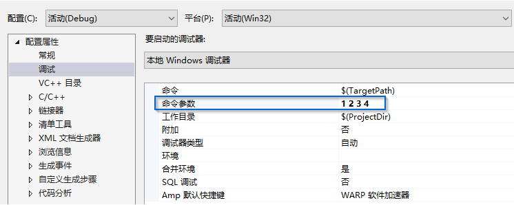

## 字符串 std::string


要想使用string，必须包含适当的头文件。并且可以进行如下的using声明。

```C++
#include <string>

using std::string;
```


### 1. 定义和初始化string对象

|        方式         |                             意义                             |
| :-----------------: | :----------------------------------------------------------: |
|      string s1      |                   默认初始化，s1是一个空串                   |
|   string s2 (s1)    |                         s2是s1的副本                         |
|   string s2 = s1    |                 等价于s2 (s1), s2是s1的副本                  |
| string s3 ("value") | s3是字面值”value"的副本， 除了字面值最后的那个空字符外 (拷贝初始化) |
| string s3 = "value" |   等价千s3("value"), s3是字面值”value"的副本 (直接初始化)    |
| string s4 (n, 'c')  |       把s4初始化为由连续n个字符c组成的串 (直接初始化)        |

`string s8 = string(lO, 'c');／／拷贝初始化． s8的内容是cccccccccc`

等价于：
`string temp (10, 'c');	// temp的内容是cccccccccc`
`string s8 = temp;	//将temp拷贝给s8`


### 2. string对象上的操作


##### 读取未知数量的string对象

```C++
while (std::cin >> word) {
    std::cout << word << std::endl;
}
/*
  在C++中，条件表达式可以是任何可以隐式转换为bool类型的表达式，
  但在Java中，条件表达式必须是一个布尔表达式。
  输入运算符>>返回一个std::istream对象，该对象可以隐式转换为bool类型。
  当输入运算符>>成功读取输入时，std::istream对象将被视为true，否则将被
  视为false。
  因此，当std::cin >> word成功读取输入时，while循环将继续执行，否则循环将终止。
*/
```


##### 使用getline读取一整行


```C++
void readFile() {
    std::ifstream fin;
    fin.open("file.txt", std::ios::in);
    if (!fin.is_open()) {
        std::cout << "无法找到这个文件！" << std::endl;
        return;
    }
    std::string line;
    while (getline(fin, line)) {	//每次读取一行，直到文件末尾
        std::cout << line << std::endl;
    }
    fin.close();
}
```


```C++
void readFile() {
    std::ifstream fin;
    fin.open("file.txt", std::ios::in);
    if (!fin.is_open()) {
        std::cout << "无法找到这个文件！" << std::endl;
        return;
    }
    char buff[1024] = {0};  // 用于存放每行数据
    while (fin.getline(buff, sizeof(buff))) {
        std::cout << buff << std::endl;
    }
    fin.close();
}
```


##### string的empty和size操作

empty函数会根据string对象是否为空返回一个对应的布尔值。empty是string的一个成员函数。

调用该函数的方法很简单，只要使用点操作符指明是哪个对象执行了empty函数就可以了。

```C++
	std::string line;
	while (getline(fin, line)) {	//每次读入一整行，遇到空行直接跳过
	    if (!line. empty())
	    	std::cout << line << std::endl;
	}
```

size函数返回string对象的长度（即string对象中字符的个数），可以使用size函数只输出长度超过80个字符的行：

```C++
  	std::string line;
    while (getline(fin, line)) {	//每次读入一整行，输出其中超过80个字符的行
        if (line.size() > 80)
        	std::cout << line << std::endl;
    }
```


##### string:: size_ type类型

对于size函数，返回的是一个string::size_type类型的值。它是一个无符号类型的值(unsigned)，而且能足够存放下任何 string对象的大小。所有用于存放string类的size函数返回值的变量，都应该是string::size_type类型的。

```C++
int main() {
    std::string str("hello world");
    auto len = str.length();	//IDE智能提示len的类型为size_t
    std::cout << len << std::endl;     //输出结果为 11
    return 0;
}
```

***注意：如果一个表达式中已经有了size()函数就不要再使用int了，这样可以避免混用int和unsigned可能带来的问题。***


##### 比较string对象

1. 相等性运算符(==和!=)分别检验两个string对象相等或不相等，string对象相等意味着它们的长度相同而且所包含的字符也全都相同。

2. 关系运算符<、<=、>、>=分别检验一个string对象是否小于、小于等于、大于、大于等于另外一个string对象。

上述这些运算符都依照（大小写敏感的）字典顺序：

- ①. 如果两个string对象的长度不同， 而且较短string对象的每个字符都与较长string对象对应位置上的字符相同，就说较短string 对象小于较长string

  对象。

- ②. 如果两个string对象在某些对应的位置上不一致， 则string对象比较的结果其实是string对象中第一对相异字符比较的结果。

下面是string对象比较的一个示例：

```c++
string str = "Hello";
string phrase = "Hello World";
string slang = "Hiya";
```

根据规则①可判断， 对象str小于对象phrase; 根据规则②可判断， 对象slang既大于str也大于phrase。


##### 为string对象赋值

对于string类而言， 允许把一个对象的值赋给另外一个对象

```c++
string st1(10, 'c'), st2;	// stl的内容是cccccccccc; st2是一个空宇符串
st1 = st2; 		//赋值： 用st2的副本替换st1的内容
		   		//此时st1和st2都是空字符串
```


##### 两个string对象相加

对string对象使用加法运算符（＋）的结果是一个新的string对象，它所包含的字符由两部分组成：前半部分是加号左侧string对象所含的字符、后半部分是加号右侧string对象所含的字符：

```C++
string s1 = "hello, ", s2 = "world\n";
string s3 = s1 + s2; 	// s3的内容是hello, world\n
s1 += s2; 				//等价于s1 = s1 + s2
```


##### 字面值和string 对象相加

标准库允许把字符字面值和字符串字面值转换成string对象， 所以在需要string对象的地方就可以使用这两种字面值来替代。

```C++
string s1= "hello", s2 = "world"; ／／在s1和s2中都没有标点符号
string s3 = s1 + ", " + s2 +'\n';
```

***注意：当把string对象和字符字面值及字符串字面值混在一条语句中使用时，必须确保每个加法运算符（＋）的两侧的运算对象至少有一个是string:***

```C++
string s4 = s1 + "," 	//正确：把一个string对象和个字面值相加
string s5 = "hello" + ", "; 	//错误： 两个运算对象都不是string
string s6 = s1 + ", " + "world";	//正确：每个加法运算符都有一个运算对象是string
string s7 = "hello" + ", " + s2; 	//错误：不能把宇面值直接相加
```

关于s6：它的工作机理和连续输入连续输出是一样的， 可以用如下的形式分组：`string s6 = (s1 + ", ") + "world";`

​				其中，子表达式s1 + "， "的结果是一个string对象，它同时作为第二个加法运算符的左侧运算对象，因此上述语句和下面的两个语句是等价的:

```C++
string tmp = s1 + ", "; //正确： 加法运算符有一个运算对象是string
s6 = tmp + "world";  //正确： 加法运算符有一个运算对象是string
```

关于s7:  s7的初始化是非法的， 根据其语义加上括号后就成了这样的形式：`string s7 = ("hello" + ", ") + s2;  //错误：不能把字面值直接相加`；括号内的			  子表达式试图把两个字符串字面值加在一起， 而编译器根本没法做到这一点， 所以这条语句是错误的。


### 3. 处理string对象中的字符


​	***关键问题是如何获取字符本身。***


##### 使用基于范围的for语句

范围for (range for) 语句。这种语句遍历给定序列中的每个元素并对序列中的每个值执行某种操作，其语法形式是:

```C++
	for (declaration : expression)
		statment
```

其中，*expression*部分是一个对象，用于表示一个序列。*declaration*部分负责定义一个变量，该变量将被用于访问序列中的基础元素。每次迭代，*declaration*部分的变量会被初始化为*expression*部分的下一个元素值。

一个string对象表示一个字符的序列，因此string对象可以作为范围for语句中的 expression部分。举一个简单的例子，我们可以使用范围for语句把string对象中的字符每行一个输出出来:

```C++
int main() {
    std::string str("hello world");
    // 每行输出str中的一个字符
    for (auto c : str) {             // 对于str中的每个字符
        std::cout << c << std::endl;      // 输出当前字符，后面紧跟一个换行符
    }
    return 0;
}
```

for循环把变量c和 str联系了起来，其中我们定义循环控制变量的方式与定义任意个普通变量是一样的。此例中，通过使用auto关键字让编译器来决定变量c的类型，这里c的类型是char。每次迭代，str的下一个字符被拷贝给c，因此该循环可以读作“对于字符串str中的每个字符c，”执行某某操作。此例中的“某某操作”即输出一个字符，然后换行。


例：使用范围for语句和ispunct函数来统计string对象中标点符号的个数

```C++
int main() {
    std::string str("hell=-o** world!!");
    decltype(str.size()) punct_cnt = 0;  // punct_cnt的类型和str.size()的返回类型一样
    for (auto item: str) {
        if (ispunct(item)) {
            ++punct_cnt;
        }
    }
    std::cout << punct_cnt << " punctuation characters in " << str << std::endl;
    // 6 punctuation characters in hell=-o** world!!
    return 0;
}
```

这里我们使用decltype关键字声明计数变量punct_cnt，它的类型是s.size函数返回值的类型，也就是string::size_type。

使用范围for语句处理string对象中的每个字符并检查其是否是标点符号。如果是，使用递增运算符给计数变量加1。最后，待范围for语句结束后输出统计结果。


##### 使用范围for语句改变字符串中的字符

如果想要改变string对象中字符的值，必须把循环变量定义成引用类型。

记住，所谓引用只是给定对象的一个别名，因此当使用引用作为循环控制变量时，这个变量实际上被依次绑定到了序列的每个元素上。使用这个引用，我们就能改变它绑定的字符。

例： 将整个string对象转化成大写

```c++
int main() {
    std::string str("hello world55");
    for (auto &item: str) {
        item = toupper(item);   // item是引用，所以改变item的值，str的值也会改变
    }
    std::cout << str << std::endl;   //输出结果为：HELLO WORLD55
}
```


##### 只处理一部分字符

访问string对象中的单个字符有两种方式:一种是使用下标，另外一种是使用迭代器。

*下标运算符*（[ ]）接收的输入参数是string ::size_type类型的值。这个参数表示要访问的字符的位置；返回值是该位置上字符的引用。

string对象的下标从0计起。如果string对象s至少包含两个字符，则s[0]是第1个字符、s[1]是第2个字符、s[s.size ()-1] 是最后一个字符。


> - string对象的下标必须大于等于0而小于s.size().
> - 在访问指定字符之前，首先检查s是否为空。
> - 不管什么时候只要对string对象使用了下标，都要确认在那个位置上确实有值。


只要字符串不是常量，就能为下标运算符返回的字符赋新值。使用下标运算符将string对象中的第一个字符修改为大写形式：

```C++
    std::string a = "hello";
    if (a.empty()) {
        std::cout << "string a is empty" << std::endl;
    } else {
        a[0] = toupper(str[0]);
    }
    std::cout << a << std::endl;    // 输出结果为Hello
```


##### 使用下标进行迭代

例： 将字符串s的第一个词改成大写形式：

```C++
int main() {
    std::string str = "Hello world!";
    int cnt = 0;
    for (decltype(str.size()) i = 0; i != str.size() && !isspace(str[i]); ++i) {
        // i的类型为string::size_type
        str[i] = toupper(str[i]);
        cnt++;
    }
    std::cout << "循环执行了 " << cnt << " 次" << std::endl;  //输出结果为：循环执行了 5 次
    std::cout << str << std::endl;  //输出结果为：HELLO world!
    return 0;
}
```


##### <a name="id1">使用下标进行随机访问</a>

通过计算得到某个下标值，然后直接获取对应位置的字符。

```C++
#include <iostream>
#include <vector>
#include <sstream>

int main() {
    const std::string hexdigits = "0123456789ABCDEF";
    std::string read_line;
    std::cout << "请输入一串0 - 15的数字，"
        << "以空格分隔，按回车结束： "
        << std::endl;
    std::getline(std::cin, read_line);

    std::stringstream ss(read_line);
    std::vector<char> result_vec;

    int num;
    while (ss >> num) {		// 非空字符
        if (num < 0 || num > 15) {
            std::cout << "输入的数字超出范围！" << std::endl;
            return 0;
        }
        result_vec.emplace_back(hexdigits[num]);
    }

    if (ss.fail() && !ss.eof()) {
        std::cout << "输入的不是数字！" << std::endl;
        return 0;
    }

    std::cout << "Your hex number is: ";
    for (const auto& item : result_vec) {
        std::cout << item;
    }
    return 0;
}
```


## 标准库类型vector std::vector

标准库类型vector表示对象的集合，其中所有对象的类型都相同。集合中的每个对象都有一个与之对应的索引，索引用于访问对象。因为vector“容纳着”其他对象，所以它也常被称作容器(container)。

要想使用vector，必须包含适当的头文件。并且可以进行如下的using声明。

```C++
#include <vector>

using std::vector;
```

vector是一个类模板

```c++
vector<int> ivec;				 // ivec保存int类型的对象
vector<Sales_item> sales_vec;	 // 保存sales item类型的对象
vector<vector<string>> file;	 // 该向量的元素是vector对象
```

*vector 是模板而非类型，由vector生成的类型必须包含vector中元素的类型，例如 vector<int>。*


### 1. 定义和初始化vector对象


允许把一个vector对象的元素拷贝给另外一个 vector对象。此时，新vector对象的元素就是原vector对象对应元素的副本。注意两个vector对象的类型必须相同:

例：

```C++
vector<int> ivec;			// 初始状态为空
// 在此处给 ivec添加一些值
vector<int> ivec2 (ivec);	// 把ivec的元素拷贝给ivec2
vector<int> ivec3 = ivec;	// 把ivec的元素拷贝给ivec3
vector<string> svec(ivec2);	//错误:svec的元素是string对象，不是int
```


##### 列表初始化vector对象

```C++
vector<string> articles = {"a", "an", "the"};	// 正确， vector对象中包含三个元素，第一个是字符串"a"，第二个是字符												// 串"an"，最后一个是字符串"the"。
vector<string> v2("a", "an", "the");  			//错误
```


##### 创建指定数量的元素

还可以用vector对象容纳的元素数量和所有元素的统一初始值来初始化vector对象:

```C++
vector<int> ivec (10，-1); 			// 10个int类型的元素，每个都被初始化为-1
vector<string> svec (10，"hi!");		//10个string类型的元素，//每个都被初始化为"hi!"
```


##### 值初始化

通常情况下，可以只提供vector对象容纳的元素数量而不用略去初始值。此时库会创建一个值初始化的(value-initialized）元素初值，并把它赋给容器中的所有元素。这个初值由vector对象中元素的类型决定。

如果vector对象的元素是内置类型，比如 int，则元素初始值自动设为0。如果元素是某种类类型，比如 string，则元素由类默认初始化:

```C++
vector<int> ivec(10);		// 10个元素，每个都初始化为0
vector<string> svec (10);	//10个元素，每个都是空string对象
```


这种初始化方式有两个特殊限制：

①.  有些类要求必须明确地提供初始值，如果vector对象中元素的类型不支持默认初始化，我们就必须提供初始的元素值。对这种类型的对象来说,只提供元素的数量而不设定初始值无法完成初始化工作。

②. 如果只提供了元素的数量而没有设定初始值，只能使用直接初始化。

```C++
vector<int> vi = 10;	//错误:必须使用直接初始化的形式指定向量大小
```

> 这里的10是用来说明如何初始化vector对象的，我们用它的本意是想创建含有10个值初始化了的元素的vector对象，而非把数字10“拷贝”到vector中。因此，此时不宜使用拷贝初始化。


##### 列表初始值还是元素数量？

- 要注意vector在进行初始化时，传递初值使用的是圆括号()，还是花括号{} ！

例如，用一个整数来初始化`vector<int>`时，整数的含义可能是vector对象的容量也可能是元素的值。

类似的，用两个整数来初始化`vector<int>`时，这两个整数可能一个是vector对象的容量，另一个是元素的初值，也可能它们是容量为2的vector对象中两个元素的初值。通过使用花括号或圆括号可以区分上述这些含义:

```C++
vector<int> v1(10);		// v1有10个元素，每个的值都是0
vector<int> v2{10};		// v2有1个元素，该元素的值是10

vector<int> v3(10, 1);	// v3有10个元素，每个的值都是1
vector<int> v4{10, 1};	// v4有2个元素，值分别是10和1
```

在上面的代码示例中：

> - 使用的是**圆括号**，表示提供的值是用来**构造**(construct) vector对象的。
>
>   在上例中，v1的初始值说明了vector对象的容量；v3的两个初始值则分别说明了vector对象的容量和元素的初值。
>
> - 使用的是**花括号**，表示**列表初始化**（list initialize）该vector对象。
>
>   也就是说，初始化过程会尽可能地把花括号内的值当成是元素初始值的列表来处理，只有在无法执行列表初始化时才会考虑其他初始化方式。
>
>   在上例中，给 v2和v4提供的初始值都能作为元素的值，所以它们都会执行列表初始化，vector对象v2包含一个元素而vector对象v4包含两个元素。

但是，在进行初始化一个含有string对象的vector对象时（如下例）：

```C++
#include <iostream>
#include <vector>

using namespace std;

int main() {
    vector<string> v5{"hi"};        // 列表初始化
    vector<string> v6("hi");        // 错误，不能使用字符串字面值初始化vector对象
    vector<string> v7(10);          // v7有10个默认初始化的元素
    vector<string> v8{10};          // v8有10个默认初始化的元素
    vector<string> v9{10, "hi"};    // v9有10个值为"hi"的元素
    vector<string> v10(10, "hi");   // v10有10个值为"hi"的元素
}
```

尽管在上面的例子中有很多语句在初始化vector时都使用了花括号，但其实只有v5是列表初始化。

要想列表初始化 vector对象，花括号里的值必须与元素类型相同。显然不能用int初始化 string对象，所以v8和v9提供的值不能作为元素的初始值。

确认无法执行列表初始化后，编译器会尝试用默认值初始化vector对象。


### 2. 向vector对象中添加元素

利用vector的成员函数push_back可以向vector对象中添加元素。

push_back负责把一个值当成vector对象的尾元素“压到(push)” vector对象的“尾端( back)”。例如:

```C++
	std::vector <int> v1;
    for (int i = 0; i != 10; ++i) {
        v1.push_back(i);
    }
```

> C++标准要求vector应该能在运行时高效快速地添加元素。
>
> 因此既然vector对象能高效地增长，那么在定义vector对象的时候设定其大小就没有什么必要了，只有一种例外，即当所有元素的值都一样。一旦元素的值有所不同，更有效的办法是先定义一个空的vector对象，再在运行时向其中添加具体值。


***注意：范围 for 语句体内不应改变其所遍历序列的大小！！***

原因：在范围for语句中，预存了end()的值。一旦在序列中添加（删除）元素，end函数的值就可能变得无效了。

```C++
#include <vector>

using namespace std;

int main() {
    vector<int> v{1, 2, 3, 4, 5};  // 列表初始化
    for (auto &item: v) {
        item *= 2;
    }
    //这个范围for语句等价于下面的传统for语句
    for (auto begin = v.begin(), end = v.end(); begin != end; ++begin) {
        auto &item = *begin;
        item *= 2;
    }
    return 0;
}

```


##### <a name="id2">如何修改vector对象的大小	</a>

- 删除vector对象中的元素：

```C++
	// 删除vector对象中的元素：
	std::vector<int> v{1, 2, 3, 4, 5};
    for (auto it = v.begin(); it != v.end(); ) {
        if (*it % 2 == 0) {
            it = v.erase(it);
        } else {
            ++it;
        }
    }
```

-  向vector对象中添加元素：

```C++
    // 添加vector对象中的元素：
    for (auto it = v.begin(); it != v.end(); ++it) {
        if (*it % 2 == 0) {		// 在满足*it % 2 == 0的元素前面插入本元素
            it = v.insert(it, *it);
            ++it;   // 跳过刚刚添加的元素
        }
    }
```


### 3. 其他vector操作

std::vector的其他操作与std::string相似。（下图中只是vector支持的操作中的一部分）


访问vector对象中元素的方法和访问string对象中字符的方法差不多，也是通过元素在vector对象中的位置。

例如，可以使用范围for语句处理vector对象中的所有元素:

```C++
#include <vector>
#include <iostream>

using namespace std;

int main() {
    vector<int> v{1, 2, 3, 4, 5, 6};  // 列表初始化
    for (auto &item: v) {
        item *= item;
    }
    for (auto item: v) {
        cout << item << " ";
    }
    cout << endl;   // 输出值为：1 4 9 16 25 36
    return 0;
}
```


vector的empty和size两个成员与string的同名成员功能完全一致: 

- empty检查vector对象是否包含元素然后返回一个布尔值; 
- size则返回vector对象中元素的个数,返回值的类型是由vector定义的size_type类型。

> 要使用size_type，需首先指定它是由哪种类型定义的。
>
> vector对象的类型总是包含着元素的类型：
>
> ```C++
> vector<int>::size_type		//正确
> vector::size_type			//错误
> ```


关于相等性运算符，与string的相等性运算符的功能一致。

1. 两个vector对象相等当且仅当它们所含的元素个数相同，而且对应位置的元素值也相同。

2. 关系运算符依照字典顺序进行比较:

   如果两个vector对象的容量不同，但是在相同位置上的元素值都一样，则元素较少的vector对象小于元素较多的vector对象；

   若元素的值有区别，则vector对象的大小关系由第一对相异的元素值的大小关系决定。


*只有当元素的值可比较时，vector对象才能被比较！*


##### 计算vector内对象的索引

例： 假设有一组成绩的集合，其中成绩的取值是从0到100。以10分为一个分数段，要求统计各个分数段各有多少个成绩。显然，从0到100总共有101种可能的成绩取值，这些成绩分布在11个分数段上:每10个分数构成一个分数段，这样的分数段有10个，额外还有一个分数段表示满分100分。这样第一个分数段将统计成绩在0到9之间的数量;第二个分数段将统计成绩在10到19之间的数量，以此类推。最后一个分数段统计满分100分的数量。

与string中<a href="#id1">使用下标进行随机访问</a>的代码类似：

```C++
#include <iostream>
#include <sstream>
#include <vector>

using namespace std;

int main() {
    string read_line;
    getline(cin, read_line);    // 输入值：42 65 95 100 39 67 95 76 88 76 83 92 76 93
    stringstream ss(read_line);

    vector<int> result_vec(11, 0);

    int num;
    while (ss >> num) {			// 非空字符
        if (num < 0 || num > 100) {
            cout << "Invalid score" << endl;
            return 0;
        }
        ++result_vec[num / 10];	// 将当前分数段的计数值加1
    }

    if (ss.fail() && !ss.eof()) {
        cout << "输入的不是数字！" << endl;
        return 0;
    }

    for (auto i : result_vec) {
        cout << i << " ";   // 输出为：0 0 0 1 1 0 2 3 2 4 1
    }

    return 0;
}
```

在上面的代码中：

```C++
	++result_vec[num / 10];

	// 本注释上面这一行代码，等价于本注释下面两行代码

	auto ind = num / 10;	//得到分数段索引
	result_vec[ind] = result_vec[ind] + 1	//将计数值加1
```


##### 不能用下标形式添加元素

正确：

```C++
	vector<int> ivec;
	for (int ix = 0; ix != 10; ++ix) {
	    ivec.push_back(ix);
	}
```

错误：

```C++
    vector<int> ivec;
    for (int ix = 0; ix != 10; ++ix) {
        ivec[ix] = ix;      // 会报错，因为ivec是空的，没有元素，不能用下标访问
    }
```


> vector对象(以及string对象)的下标运算符可用于访问已存在的元素，而不能用于添加元素。


## 迭代器

使用迭代器（iterator）是一种通用的访问容器中元素的方法。

类似于指针类型，迭代器也提供了对对象的间接访问。就迭代器而言，其对象是容器中的元素或者string对象中的字符。使用迭代器可以访问某个元素，迭代器也能从一个元素移动到另外一个元素。

迭代器有有效和无效之分。有效的迭代器指向某个元素，或指向尾元素的下一个位置，其它情况都属于无效。


> 在 C++ 中，迭代器是一种抽象的概念，它可以被看作是一种类似于指针的对象，用于遍历容器中的元素。迭代器可以被看作是一种指针，但并不是所有迭代器都是指针。
>
> C++ 中的迭代器可以分为五种类型：输入迭代器、输出迭代器、前向迭代器、双向迭代器和随机访问迭代器。其中，输入迭代器和输出迭代器是最基本的迭代器类型，它们只支持读取和写入操作，不支持算术运算。前向迭代器、双向迭代器和随机访问迭代器则支持不同程度的算术运算，例如前向迭代器只支持单向遍历，双向迭代器支持双向遍历，随机访问迭代器支持随机访问。
>
> 对于指针类型的容器，例如数组和指针，它们的迭代器就是指针。对于其他类型的容器，例如 vector、list、set 等，它们的迭代器并不一定是指针，而是一种类似于指针的对象，用于遍历容器中的元素。例如，vector 的迭代器是一种随机访问迭代器，它可以像指针一样进行算术运算，但并不是指针类型。


### 1. 使用迭代器

和指针不一样的是，获取迭代器不是使用取地址符，有迭代器的类型同时拥有返回迭代器的成员。比如，这些类型都拥有名为 begin和 end 的成员，

其中 begin 成员负责返回指向第一个元素(或第一个字符)的迭代器。如有下述语句:

```C++
	// 由编译器决定b和e的类型
	// b表示v的第一个元素，e表示v尾元素的下一位置
	auto b = v.begin(), e = v.end();	//b和e的类型相同
```

end 成员则负责返回指向容器(或string对象)“尾元素的下一位置(onc past the end)"的迭代器，也就是说，该迭代器指示的是容器的一个本不存在的“尾后(off the end)”元素。

这样的迭代器没什么实际含义，仅是个标记而已，表示我们已经处理完了容器中的所有元素。

end成员返回的迭代器常被称作尾后迭代器（off-the-end iterator）或者简称为尾迭代器(end iterator)。特殊情况下如果容器为空，则begin和 end返回的是同一个迭代器。


***一般情况下，我们不在乎迭代器准确的类型到底是什么。***


##### <a name="idde">迭代器运算符</a>


和指针类似，可以通过解引用迭代器来获取它所指示的元素。

执行解引用的迭代器必须合法并确实指示着某个元素。试图解引用一个非法迭代器或者尾后迭代器都是未被定义的行为(UB)。


例：利用迭代器将string对象的第一个字母改为大写形式：

```C++
    string str("some string");
    if (str.begin() != str.end()) {	
        auto it = str.begin();
        *it = toupper(*it);
    }
    cout << str << endl;		// 输出结果为：Some string
```


##### 将迭代器从一个元素移动到另外一个元素

迭代器使用递增（++）运算符来从一个元素移动到下一个元素。

从逻辑上来说，迭代器的递增和整数的递增类似，整数的递增是在整数值上“加1",迭代器的递增则是将迭代器“向前移动一个位置”。

> 因为 end 返回的迭代器并不实际指示某个元素,所以不能对其进行递增或角引用的操作。

例：将字符串对象中第一个单词改为大写：

```c++
    string str("some string");
    for (auto it = str.begin(); it != str.end() && !isspace(*it); ++it) {
        *it = toupper(*it);
    }
    cout << str << endl;    // 输出结果为：SOME string
```


##### 迭代器类型

就像不知道string 和 vector 的size_type 成员到底是什么类型一样，一般来说我们也不知道(其实是无须知道)迭代器的精确类型。

而实际上，那些拥有迭代器的标准库类型使用iterator和const_iterator来表示迭代器的类型:

```C++
vector<int>::iterator it;		// it能读写vector<int>的元素
string::iterator it2;			// it2能读写string对象中的字符

vector<int>::const_iterator it3;	// it3只能读元素，不能写元素
string::const_iterator it4;			// it4只能读字符，不能写字符
```

const_iterator和常量指针差不多，能读取但不能修改它所指的元素值。相反，iterator的对象可读可写。

- 如果vector对象或string对象是一个常量，只能使用const_iterator;
- 如果vector对象或string对象不是常量，那么既能使用iterator也能使用const_iterator。


##### begin 和 end 运算符

begin和end返回的具体类型由对象是否是常量决定，如果对象是常量，begin和end返回const_iterator; 如果对象不是常量，返回iterator:

```C++
	vector<int> v;
	const vector<int> cv;
	auto it1 = v.begin();	// it1的类型是vector<int>::iterator
	auto it2 = cv.begin();	// it2的类型是vector<int>::const_iterator
	auto it3 = v.cbegin();  // it3的类型是vector<int>::const_iterator
```

有时候这种默认的行为并非我们所要。如果对象只需读操作而无须写操作的话最好使用常量类型(比如 const_iterator)。为了便于专门得到const_iterator类型的返回值,C++11新标准引入了两个新函数,分别是cbegin和cend（见上例中it3）。


##### 结合解引用和成员访问操作

解引用迭代器可获得迭代器所指的对象，如果该对象的类型恰好是类，就有可能希望进一步访问它的成员。

例如，对于一个由字符串组成的vector对象来说，要想检查其元素是否为空，令it是该vector对象的迭代器，只需检查it所指字符串是否为空就可以了，其代码如下所示:

```C++
	(*it).empty
```

`(*it).empty ()`中的圆括号必不可少，该表达式的含义是先对it解引用，然后解引用的结果再执行点运算符。

如果不加圆括号，点运算符将由it来执行，而非it解引用的结果：

```C++
	(*it).empty		// 解引用it，然后调用结果对象的empty成员
    *it.empty		// 错误:试图访问it对象中的名为empty的成员，但it是个迭代器，没有empty成员
```


为了简化以上的表达式，**箭头运算符** (->) 把箭头运算符把解引用和成员访问两个操作结合在一起，也就是说，it->mem和(*it).mem表达的意思相同。


例：假设用一个名为text的字符串向量存放文本文件中的数据，其中的元素要么是一句话要么是一个用于表示段落分隔的空字符串。如果要输出text中第一段的内容，可以利用迭代器写一个循环令其遍历text，直到遇到空字符串的元素为止。完整代码如下：

```C++
#include <iostream>
#include <fstream>
#include <iostream>
#include <fstream>
#include <string>
#include <vector>

using namespace std;

void readFile(vector<string>* v) {
    ifstream fin;
    fin.open("file.txt", ios::in);
    if (!fin.is_open()) {
        cout << "无法找到这个文件！" << endl;
        return;
    }
    string line;
    while (getline(fin, line)) {    //每次读取一行，直到文件末尾
        v->push_back(line);
    }
    fin.close();
}

int main() {
    vector<string> text;
    readFile(&text);
    for (auto it = text.begin(); it != text.end() && !it->empty(); ++it) {
        cout << *it << endl;
    }

    return 0;
}
```

`file.txt`：

```
A
B

C
```

输出内容：

```
A
B
```


##### 某些对vector对象的操作会使迭代器失效

虽然vector对象可以动态地增长，但是也会有一些副作用。

已知的一个限制是不能在范围for循环中向vector对象添加元素。

另外一个限制是任何一种可能改变vector对象容量的操作，比如 push_back，都会使该vector对象的迭代器失效，我们应该更新迭代器，使其重新生效。

请见<a href="#id2">如何修改vector对象的大小</a>。


### 2. 迭代器运算

迭代器的递增运算令迭代器每次移动一个元素，所有的标准库容器都有支持递增运算的迭代器。

类似的，也能用==和!=对任意标准库类型的两个有效迭代器进行比较。


<a name="idq1">迭代器支持的运算</a>


##### 迭代器的算术运算

可以令迭代器和一个整数值相加（或相减），其返回值是向前（或向后）移动了若干个位置的迭代器。

执行这样的操作时，结果迭代器或者指示原vector对象（或string对象）内的一个元素，或者指示原vector对象（或string对象）尾元素的下一位置。

例：

```C++
#include <iostream>
#include <vector>

using namespace std;

int main()
{
	vector<int> v{1, 2, 3, 4};
    // 添加vector对象中的元素：
    for (auto it = v.begin(); it != v.end(); ++it) {
        // 将原vector偶数位置的元素的值变为原来的两倍，放到这个位置的后面
    	if (*it % 2 == 0) {
            it = v.insert(it + 1, (*it * 2));
        }
    }

    for (int i : v) {       // 输出内容：1 2 4 3 4 8 
        cout << i << " ";
    }
    cout << "\n";

    // 计算得到最接近vi中间位置的迭代器
    auto mid = v.begin() + v.size() / 2;
    cout << *mid << endl;   // 输出内容：3

    return 0;
}
```

如果vi有20个元素，vi.size() / 2得10，此例中即令mid等于vi.begin() +10。已知下标从0开始，则迭代器所指的元素是vi[10]，也就是从首元素开始向前相隔10个位置的那个元素。


对于string或vector的迭代器来说,除了判断是否相等,还能使用关系运算符(<、<=、>、>=)对其进行比较。

参与比较的两个迭代器必须合法而且指向的是同一个容器的元素（或者尾元素的下一位置)。

例如，假设it和mid是同一个vector对象的两个迭代器，可以用下面的代码来比较它们所指的位置孰前孰后:

```C++
	if (it < mid)
		// 处理vi前半部分的元素
```

只要两个迭代器指向的是同一个容器中的元素或者尾元素的下一位置，就能将其相减，所得结果是两个迭代器的距离。

所谓距离指的是右侧的迭代器向前移动多少位置就能追上左侧的迭代器，其类型是名为 **difference_type** 的带符号整型数。

string和vector都定义了 difference_type，因为这个距离可正可负，所以 difference_type 是带符号类型的。


##### 使用迭代器运算

使用迭代器进行二分查找（二分搜索）代码：

```C++
#include <iostream>
#include <vector>

using namespace std;

int binary_search(const vector<int> &nums, int target) {
    auto begin = nums.begin(), end = nums.end();
    while (true) {
        if (begin == end) {
            return -1;
        }
        auto mid = begin + (end - begin) / 2;
        if (target < *mid) {
            end = mid;
        } else if (target > *mid) {
            begin = mid + 1;
        } else {
            return mid - nums.begin();
        }
    }
}

int main() {
    vector<int> nums{1, 3, 5, 7, 9, 11, 13};

    int target = 1;
    int index = binary_search(nums, target);

    if (index != -1) {
        cout << "目标元素 " << target << " 的索引为 " << index << endl;
    } else {
        cout << "目标元素 " << target << " 不存在" << endl;
    }

    return 0;
}
```


问题：为什么在二分查找中，用的是`mid = begin + (end - begin) / 2;`，而不是 `mid = (begin + end) /2;` ?

> C++并没有定义两个迭代器的加法运算,实际上直接把两个迭代器加起来是没有意义的。
>
> 与之相反，C++定义了迭代器的减法运算，两个迭代器相减的结果是它们之间的距离，也就是说，将运算符右侧的迭代器向前移动多少个元素后可以得到左侧的迭代器，参与运算的两个迭代器必须指向同一个容器中的元素或尾后元素。
>
> 另外，C++还定义了迭代器与整数的加减法运算，用以控制迭代器在容器中左右移动。
>
> 在本题中，因为迭代器的加法不存在，所以`mid = (beg + end) / 2;`不合法`mid = beg + (end - beg) / 2`;的含义是，先计算end-beg的值得到容器中的元素个数，然后控制迭代器从开始处向右移动二分之一容器的长度，从而定位到容器正中间的元素。


## 数组

数组的大小确定不变，不能向数组中添加元素。

因为数组的大小固定，因此对某些特殊的应用来说程序的运行时候性能比较好，但也损失了一些灵活性。

如果不清楚元素的确切个数，请使用vector


### 1. 定义和初始化内置数组

编译时数组的维度（数组中的元素个数）应该是已知的。换句话说，维度必须是一个常量表达式：

```C++
	unsigned cnt = 42;              // 不是常量表达式
	constexpr unsigned sz = 42;     // 常量表达式
	int arr[10];                    // 含有10个整数的数组
	int *parr[sz];                  // 含有42个整型指针的数组
	string bad[cnt];                // 错误：cnt不是常量表达式
	string strs[get_size()];        // 当get_size是constexpr时正确
```

默认情况下，数组的元素被默认初始化。

定义数组的时候必须指定数组的类型，不允许用auto关键字由初始值的列表推断类型。另外和 vector一样，数组的元素应为对象，因此不存在引用的数组。


##### 显式初始化数组元素

可以对数组的元素进行列表初始化，此时允许忽略数组的维度。

如果在声明时没有指明维度，编译器会根据初始值的数量计算并推测出来；相反，如果指明了维度，那么初始值的总数量不应该超出指定的大小。

如果维度比提供的初始值数量大，则用提供的初始值初始化靠前的元素，剩下的元素被初始化成默认值：

```C++
    const unsigned sz = 3;
    int ial[sz] = {0, 1, 2};			// 含有3个元素的数组,元素值分别是0,1,2
    int a2[] = {0, 1, 2};				// 含有3个元素的数组,元素值分别是0,1,2
    int a3[5] = {0, 1, 2};				// 含有5个元素的数组,元素值分别是0,1,2,0,0
    string a4[3] = {"hi", "bye"};	    // 含有3个元素的数组,元素值分别是"hi","bye",""
    int a5[2] = {0, 1, 2};			    // 错误! 初始值过多
```


##### 字符数组的特殊性

字符数组有一种额外的初始化形式，我们可以用字符串字面值对此类数组初始化。

**当使用这种方式时，一定要注意字符串字面值的结尾处还有一个空字符，这个空字符也会像字符串的其他字符一样被拷贝到字符数组中去:**

```C++
    char a1[] = {'C', '+', '+'};   			// 列表初始化，没有空字符，维度为3
    char a2[] = {'C', '+', '+', '\0'}; 		// 列表初始化，有显式的空字符，维度为4
    char a3[] = "C++";  					// 自动添加空字符，维度为4
    char a4[3] = "C++"; 					// 错误，没有空间存放空字符
```


##### 不允许拷贝和赋值

不能将数组的内容拷贝给其他数组作为其初始值，也不能用数组为其他数组赋值。

```c++
    int a[] = {1, 2, 3};
    int a2 = a; 	// 错误：不允许使用一个数组初始化另一个数组
    a2 = a; 		// 错误：不允许把一个数组直接赋值给另一个数组
```


##### 理解数组的复杂声明

和vector一样，数组能存放大多数类型的对象。例如，可以定义一个存放指针的数组。又因为数组本身就是对象，所以允许定义数组的指针及数组的引用。在这几种情况中，定义存放指针的数组比较简单和直接，但是定义数组的指针或数组的引用就稍微复杂一点了:

```C++
    int arr[10];  				// arr是含有10个整数的数组
    int *ptrs[10];  			// ptrs是含有10个int*的数组
    int &refs = /* ? */;  		// 错误：不存在引用的数组
    int (*Parray)[10] = &arr;  	// Parray指向一个含有10个int*的数组
    int (&arrRef)[10] = arr;  	// arrRef引用一个含有10个int的数组
	int *(&arry)[10] = ptrs;	// arry是数组的引用，该数组中含有10个指针
```

对于ptrs：ptrs是一个大小为10的数组，数组中存放的是指向int的指针。

对于Parray：(*Parray)表示Parray是一个指针，它指向一个int数组，数组中包含10个元素。

对于arrRef：(&arrRef)表示arrRef是一个引用，它引用的对象是一个大小为10的数组，数组中元素的类型是int。

对于arry：arry是一个含有10个int型指针的数组的引用。

> 要想理解数组声明的含义,最好的办法是从数组的名字开始按照由内向外的顺序阅读。

```C++
    int arr[10] = {1, 2, 3, 4, 5, 6, 7, 8, 9, 10};
	int *ptrs[10] = {&arr[0], &arr[1], &arr[2], &arr[3], &arr[4], &arr[5], &arr[6], &arr[7], &arr[8], &arr[9]};

	cout << **Parray << endl;           // 输出结果为 1
    cout << *(*Parray + 1) << endl;     // 输出结果为 2

    cout << arrRef[0] << endl;          // 输出结果为 1
    cout << arrRef[1] << endl;          // 输出结果为 2

	cout << *arry[0] << endl;           // 输出结果为 1
    cout << *arry[1] << endl;           // 输出结果为 2
```


### 2. 访问数组元素

使用数组下标的时候，通常将其定义为size_t类型，这是一种机器相关的无符号类型。


可以使用范围for语句来遍历数组。

```c++
for (auto i : arr)
    cout << i << " ";
cout << endl;
```

使用数组重写vector中<a href="#id1">使用下标进行随机访问</a>的代码

```C++
#include <iostream>
#include <sstream>

using namespace std;

int main() {
    string read_line;
    getline(cin, read_line);    // 输入值：42 65 95 100 39 67 95 76 88 76 83 92 76 93
    stringstream ss(read_line);

    int result_arr[11] = {};

    int num;
    while (ss >> num) {       // while (ss >> num) 会一直读取，直到遇到空白符
        if (num < 0 || num > 100) {
            cout << "Invalid score" << endl;
            return 0;
        }
        ++result_arr[num / 10];
    }

    if (ss.fail() && !ss.eof()) {
        std::cout << "输入的不是数字！" << std::endl;
        return 0;
    }

    for (auto i : result_arr) {
        cout << i << " ";   // 输出为：0 0 0 1 1 0 2 3 2 4 1
    }

    return 0;
}

```


##### 检查下标的值

与string和vector一样，数组的下标是否在合理范围之内由程序员负责检查。


> 大多数常见的安全问题都源于缓冲区溢出错误。当数组或其他类似数据结构的下标越界并试图访问非法内存区域时，就会产生此类错误。


### 3. 指针和数组


在很多用到数组名字的地方，编译器都会自动地将其替换为一个**指向数组首元素的指针**。

```C++
    string strs[] = {"one", "two", "three"};
    string *p = strs;
    cout << *p << endl;     // 输出为：one
    string *p1 = &strs[0];		// 等价于 string *p = strs;
    cout << *p1 << endl;    // 输出为：one
```


**decltype**

下面得到一个含有10个整数的数组类型：

```c++
int a1[10] = {};
decltype(a1) a2 = {};
a2[2] = 5; 				// 将5复制给a2中下标为2的元素
```

**auto**

下面得到一个整型指针：

```c++
int a1[10] = {};
auto a2(a1);		// a2是一个整形指针，指向a1的第一个元素
a2 = 42; 			// 错误： ia2是一个指针，不能用int值给指针赋值
```


##### 指针也是迭代器

string和vector的迭代器支持的运算，指针都支持。

使用递增运算符既可以让指向数组元素的指针向前移动到下一个位置上。

这样可以获取数组尾元素的下一个位置的指针（其中N为数组长度）：

```c++
	int *end = &a[N];
```

利用这点，我们也可以写出一个循环来输出arr中的全部元素：

```C++
    int *end = &result_arr[11];
    for (int *i = result_arr; i != end; ++i) {
        cout << *i << " ";
    }
```


##### <a href="#idppp">标准库函数begin和end</a>

C++11提供了begin和end函数，可以获取数组首元素的指针和尾后指针：

```c++
	int ia[] = {1, 2, 3, 4, 5};
	int *beg_p = begin(a);		// 指向ia首元素的指针
	int *end_p = end(a);		// 指向ia尾元素的下一位置的指针
```

例：

```c++
    int ia[] = {1, 2, 3, -3, 4, 5};
    int *pbeg = begin(ia);
    int *pend = end(ia);
    while (*pbeg != *pend && *pbeg >= 0) {
        ++pbeg;
    }
    cout << "数组中第一个负数是" << *pbeg << endl;
```

尾后指针不能解引用和递增操作。

和迭代器一样，两个指针相减的结果是它们之间的距离。参与运算的两个指针必须指向同一个数组当中的元素。


##### 指针运算

指向数组元素的指针可以执行[表3.6](#idde) ，[表3.7](#idq1)中列出的所有迭代器运算。

这些运算，包括解引用、递增、比较、与整数相加、两个指针相减等，用在指针和用在迭代器上意义完全一致。


给（从）一个指针加上（减去）某整数值，结果仍是指针。新指针指向的元素与原来的指针相比前进了(后退了)该整数值个位置：

```C++
    constexpr size_t sz = 5;
    int arr[sz] = {1, 2, 3, 4, 5};
    int *ip = arr;          // equivalent to int *ip = &arr[0]
    int *ip2 = ip + 4;      // ip2 points to arr[4], the last element in arr
```

ip加上4所得的结果仍是一个指针，该指针所指的元素与ip原来所指的元素相比前进了4个位置。

给指针加上一个整数，得到的新指针仍需指向同一数组的其他元素，或者指向同一数组的尾元素的下一位置。但是计算所得的指针超出上述范围就会产生错误:

```C++
    int *pend = arr + sz;   // pend points just past the last element in arr
    int *p2 = arr + 10;     // error: there is no arr[10]
```


和迭代器类似，两个指针相减的结果就是它们之间的距离。参与运算的两个指针必须指向同一个数组当中的元素：

```C++
    constexpr size_t sz = 5;
    int arr[sz] = {1, 2, 3, 4, 5};
	auto n = end(arr) - begin(arr);  	// n = 5
```

两指针相减的结果是**ptrdiff_t**的标准库类型。由于差值可能为负值，所以ptrdiff_t是一种带符号的类型。


我们也可以通过这种方式来遍历数组中的元素：

```C++
int main() {
    constexpr size_t sz = 5;
    int arr[sz] = {1, 2, 3, 4, 5};
    int *p = arr;
    int *p2 = arr + sz;
    while (p != p2) {			//  括号内写成(p < p2)也可
        cout << *p << endl;
        ++p;
    }
    return 0;
}
```


但是，如果两个指针分别指向不相关的对象，则不能比较它们：

```C++
    int n = 0, m = 54;
    int *p3 = &n, *p4 = &m;
    while (p3 < p4)    	// p3和p4指向的是不同的对象，所以比较毫无意义！
```


上述指针运算同样适用于空指针和所指对象并非数组的指针。

在后一种情况下，两个指针必须指向同一个对象或该对象的下一位置。

如果p是空指针，允许给p加上或减去一个值为o的整型常量表达式(参见2.4.4节，第58页)。两个空指针也允许彼此相减，结果当然是0。


##### 解引用和指针运算的交互

给（从）一个指针加上（减去）某整数值，结果仍是指针。假设结果指针指向了一个元素，则允许解引用该结果指针:

```C++
    int arr[] = {1, 2, 3, 4, 5};
    auto last = *(arr + 4);       // 是arr[4]的值，等价于arr[4]
	
	auto cal = *arr + 4;        // 等价于arr[0] + 4
```


##### 下标和指针

对数组使用下标运算符时，编译器会自动将数组名解释为一个指向数组首元素的指针。

```C++
	int arr[5] = {1, 2, 3, 4, 5};
	int x = arr[2]; // 使用下标运算符访问数组元素

	int *p = arr;		// p指向arr的首元素
	int y = *(p + 2); 	// 等价于 int x = arr[2];
```


只要指针指向的是数组中的元素(或者数组中尾元素的下一位置)，都可以执行下标运算：


```C++
int main() {
    int ia[] = {1, 2, 3, 4, 5};
    int *p = &ia[2];    // 指向索引为2的元素
    int j = p[1];       // 指向索引为3的元素
    int k = p[-2];      // 指向索引为0的元素
    cout << "j是" << j << " " << "k是" << k << endl;

    vector<int> ivec = {1, 2, 3, 4, 5};
    int *p1 = &ivec[2]; // 指向索引为2的元素
    int l = p1[1];      // 指向索引为3的元素
    int m = p1[-2];     // 指向索引为0的元素
    cout << "l是" << l << " " << "m是" << m << endl;

    return 0;
}
```

虽然标准库类型string和 vector也能执行下标运算，但是数组与它们相比还是有所不同。标准库类型限定使用的下标必须是无符号类型，而内置的下标运算无此要求，上面的最后一个例子很好地说明了这一点。内置的下标运算符可以处理负值，当然，结果地址必须指向原来的指针所指同一数组中的元素（或是同一数组尾元素的下一位置)。


### 4. C风格字符串

> 尽管C++支持C风格字符串,但在C++程序中最好还是不要使用它们。这是因为C风格字符串不仅使用起来不太方便,而且极易引发程序漏洞,是诸多安全问题的根本原因。

C风格字符串是为了表达和使用字符串而形成的一种约定俗成的写法。

按此习惯书写的字符串存放在字符数组中并以空字符结束(null terminated)。以空字符结束的意思是在字符串最后一个字符后面跟着一个空字符('\0')。一般利用指针来操作这些字符串。


##### C标准库String函数


***传入此类函数的指针必须指向以空字符串作为结束的数组！！***

例：

```C++
int main() {
    char ca[] = {'C', '+', '+'};	// 应该写成：char ca[] = {'C', '+', '+', '\0'};，输出结果为3
    cout << strlen(ca) << endl;		// 严重错误：ca没有以空字符结束
    return 0;
}
```

此例中，ca虽然也是一个字符数组但它不是以空字符作为结束的，因此上述程序将产生未定义的结果。strlen函数将有可能沿着ca在内存中的位置不断向前寻找，直到遇到空字符才停下来。


##### 比较字符串

比较标准库string对象的时候，我们可以使用普通的关系运算符和相等性运算符：

```C++
    string s1 = "a string example";
    string s2 = "a different string";
    if (s1 < s2) {}    // false
```

但是如果把这些运算符用在两个C-Style字符串上，实际比较的是指向数组首元素的指针，而不是字符串本身：

```C++
    const char ca1[] = "A string example";
    const char ca2[] = "A different string";
    if (ca1 < ca2){}	// 未定义行为，试图比较两个无关地址
```

实际上，上面的if条件比较的是两个 `const char*` 的值。这两个指针的指向并不是同一个对象，所以这是未定义行为。


要想比较两个C风格字符串需要调用strcmp函数，此时比较的就不再是指针了。

如果两个字符串相等，strcmp返回0；

如果前面的字符串较大，返回正值；

如果后面的字符串较大，返回负值：

```C++
	if (strcmp(ca1, ca2) < 0)	// 和两个string对象的比较s1 < s2的效果一样
```


##### 目标字符串的大小由调用者指定

连接或拷贝C风格字符串也与标准库string对象的同类操作差别很大。例如，要想把刚刚定义的那两个string对象s1和 s2连接起来，可以直接写成下面的形式：

```C++
	// 将largeStr初始化成s1、一个空格和s2的连接
	string largeStr = s1 + " " + s2;
```

同样的操作如果放到ca1和ca2这两个数组身上就会产生错误了。表达式cal + ca2试图将两个指针相加，显然这样的操作没什么意义，也肯定是非法的。

正确的方法是使用strcat函数和 strcpy函数。不过要想使用这两个函数，还必须提供一个用于存放结果字符串的数组，该数组必须足够大以便容纳下结果字符串及末尾的空字符。下面的代码虽然很常见，但是充满了安全风险，极易引发严重错误：

```C++
	// 如果我们计算错了largestr的大小将引发严重错误
	strcpy(largeStr, ca1);		// 把ca1拷贝给largeStr
	strcat(largeStr, " ");		// 在largeStr的末尾加上一个空格
	strcat(largeStr, ca2);		// 把ca2连接到largeStr后面
```

一个潜在的问题是，我们在估算largeStr所需的空间时不容易估准，而且 largeStr所存的内容一旦改变，就必须重新检查其空间是否足够。


> 对大多数应用来说,使用标准库string要比使用C风格字符串更安全、更高效。


### 5. 与旧代码的接口

##### 混用string对象和C风格字符串

char[] 转化为 string:

任何出现字符串字面值的地方都可以用以空字符结束的字符数组来替代:

- 允许使用以空字符结束的字符串数组来初始化string对象或为string对象赋值。
- 在string 对象的加法运算中允许使用以空字符结束的字符数组作为其中一个运算对象（不能两个运算对象都是）；在string对象的复合赋值运算中允许使用以空字符结束的字符数组作为右侧的运算对象。


string 转化为 char[]:

```C++
	char *str = s;					// 错误：不能用string对象初始化char*
	const char *str = s.c_str();	// 正确
```

`c_str`函数的返回值是一个C风格的字符串。也就是说，函数的返回结果是一个指针，**该指针指向一个以空字符结束的字符数组**，而这个数组所存的数据恰好与那个string对象的一样。结果指针的类型是 `const char*`，从而确保我们不会改变字符数组的内容。

> 虽然`p`指向的是字符数组的首地址，但它本身并不是字符数组的数组名


##### 使用数组初始化vector对象

不允许使用一个数组为另一个内置类型的数组赋初值，也不允许使用vector对象初始化数组。

相反的，允许使用数组来初始化vector对象。要实现这一目的，只需指明要拷贝区域的首元素地址和尾后地址就可以了:

与此同时，用于初始化vector对象的值也可能仅是数组的一部分:

```C++
    int arr[] = {1, 2, 3, 4, 5};
    vector<int> vec(begin(arr), end(arr));    // 用arr的所有元素初始化vec
    vector<int> vec1(arr + 2, arr + 5);         // 用arr[2]~arr[4]初始化vec1  内容为：3 4 5
```


### 6. 多维数组


***严格地说，C++中并没有多维数组，通常所说的多维数组其实是数组的数组！！***


##### 多维数组的初始化

```c++
	int ia[3][4] =
	{   // 有三个元素，其中每个元素都是长度为4的int型数组
	    {0, 1, 2, 3},   // initializers for the row indexed by 0
	    {4, 5, 6, 7},   // initializers for the row indexed by 1
	    {8, 9, 10, 11}  // initializers for the row indexed by 2
	};
	// 等效初始化，每行不包含可选的嵌套大括号
	int ib[3][4] = {0, 1, 2, 3, 4, 5, 6, 7, 8, 9, 10, 11};
	// explicitly initialize only element 0 in each row
	int ic[3][4] = {{ 0 }, { 4 }, { 8 }};
	// explicitly initialize row 0; the remaining elements are value initialized
	int id[3][4] = {0, 3, 6, 9};
```

注意：在声明多维数组时，如果不显式指定数组的大小，则只能省略最后一维的大小，而其他维度的大小必须显式指定。

```C++
	int a[][2] = {
            {1, 2},
            {4, 5},
            {7, 8}
    };
    // 等价于
 	int a[3][2] = {
            {1, 2},
            {4, 5},
            {7, 8}
    };
	// 更多维度的数组也与此同理
	    int arr[][3][4] = {		// arr[2][3][4]
            {{1,  2,  3,  4},  {5,  6,  7,  8},  {9,  10, 11, 12}},
            {{13, 14, 15, 16}, {17, 18, 19, 20}, {21, 22, 23, 24}}
    };
```


##### 多维数组的下标引用

可以使用下标访问多维数组的元素，数组的每个维度对应一个下标运算符。如果表达式中下标运算符的数量和数组维度一样多，则表达式的结果是给定类型的元素。如果下标运算符数量比数组维度小，则表达式的结果是给定索引处的一个内层数组。

```c++
	// 用arr的首元素为ia的最后一行的最后一个元素赋值
	ia[2][3] = arr[0][0][0];
	int (&row)[4] = ia[1];  // 把row绑定到ia的第二个4元素数组上
```

多维数组寻址公式：


##### 使用范围`for`语句处理多维数组

使用范围`for`语句处理多维数组时，为了避免数组被自动转换成指针，语句中的外层循环控制变量必须声明成引用类型。

```c++
for (const auto &row : ia)  // for every element in the outer array
    for (auto col : row)    // for every element in the inner array
        cout << col << endl;
```

如果`row`不是引用类型，编译器初始化`row`时会自动将数组形式的元素转换成指向该数组内首元素的指针，这样得到的`row`就是`int*`类型，而之后的内层循环则试图在一个`int*`内遍历，程序将无法通过编译。

```c++
for (auto row : ia)
    for (auto col : row)
```

*使用范围`for`语句处理多维数组时，除了**最内层**的循环，其他所有外层循环的控制变量都应该定义成引用类型。*


##### 指针和多维数组

因为多维数组实际上是数组的数组，所以由多维数组名称转换得到的指针指向第一个内层数组。

```c++
int ia[3][4];       // array of size 3; each element is an array of ints of size 4
int (*p)[4] = ia;   // p指向含有4个整数的数组
p = &ia[2];         // p指向ia的尾元素
```

```C++
    int arr[3][4] = {
            {1, 2,  3,  4},
            {5, 6,  7,  8},
            {9, 10, 11, 12}
    };

    int (*p)[4] = arr;  		// p指向arr的第一行
    cout << p[1][2] << endl;  	// 输出值为7
    p = &arr[2];  				// p指向arr的第三行
    cout << p[0][1] << endl;  	// 输出值为10
```

声明指向数组类型的指针时，**必须**带有圆括号。

```c++
int *ip[4];     // array of pointers to int
int (*ip)[4];   // pointer to an array of four ints
```

```C++
	int arr[3][4] = {
            {1, 2,  3,  4},
            {5, 6,  7,  8},
            {9, 10, 11, 12}
    };
	for (int (*p)[4] = arr; p != arr + 3; ++p) {
        for (int *q = *p; q != *p + 4; ++q) {
            cout << *q << " ";
        }
        cout << endl;
    }
```

如果使用auto或者decltype就能尽可能避免在数组前面加上一个指针类型了（见下面的for）

auto：

```C++
    for (auto p = arr; p != arr + 3; ++p) {
        for (auto q = *p; q != *p + 4; ++q) {
            cout << *q << " ";
        }
        cout << endl;
    }
```


用begin和end函数也能实现相同的功能：

```c++
    for (auto p = begin(arr); p != end(arr); ++p) {
        for (auto q = begin(*p); q != end(*p); ++q) {
            cout << *q << " ";
        }
        cout << endl;
    }
```


##### 类型别名简化多维数组的指针

```C++
	using int_array = int[4];
    for (int_array *p = arr; p != arr + 3; ++p) {
        for (int *q = *p; q != *p + 4; ++q) {
            cout << *q << " ";
        }
        cout << endl;
    }
```


# 表达式

## 基础

表达式（expression）由一个或多个运算对象（operand）组成，对表达式求值将得到一个结果（result）。字面值和变量是最简单的表达式，其结果就是字面值和变量的值。


### 1. 基本概念

C++定义了一元运算符（unary operator）和二元运算符（binary operator）。作用于一个运算对象的运算符是一元运算符；作用于两个运算对象的运算符是二元运算符。函数调用是一种特殊的运算符，它对运算对象的数量没有限制。

除此之外，还有一个作用于三个运算对象的三元运算符。函数调用也是一种特殊的运算符，它对运算对象的数量没有限制。

一些符号既能作为一元运算符，也能作为二元运算符。对于这类符号来说它的两种用法互不相干，完全可以当成两个不同的符号。


##### 重载运算符

C++语言定义了运算符作用于内置类型和复合类型的运算对象时所执行的操作。当运算符作用于类类型的运算对象时，用户可以自行定义其含义，称之为**重载运算符**（overloaded operator）。

我们使用重载运算符时，其包括运算对象的类型和返回值的类型，都是由该运算符定义的；但是运算对象的个数、运算符的优先级和结合律都是无法改变的。


##### 左值和右值

C++的表达式要不然是**右值**（rvalue），要不然就是**左值**（lvalue）。当一个对象被用作右值的时候，用的是对象的值（内容）；当对象被用作左值的时候，用的是对象的身份（内存中的位置）。

一个重要的原则（有例外）：在需要右值的地方可以用左值来代替，但是不能把右值当成左值（也就是位置）使用。当一个左值被当成右值使用时，实际使用的是它的内容（值）。到目前为止，已经有几种我们熟悉的运算符是要用到左值的。

- 赋值运算符需要一个(非常量)左值作为其左侧运算对象，得到的结果也仍然是一个左值。
- 取地址符作用于一个左值运算对象，返回一个指向该运算对象的指针，这个指针是一个右值。
- 内置解引用运算符、下标运算符、迭代器解引用运算符、string和 vector的下标运算符的求值结果都是左值。
- 内置类型和迭代器的递增递减运算符*作用于*左值运算对象，其前置版本（本书之前章节所用的形式）所得的结果也是左值。


在 C++ 中，左值（lvalue）是可以标识的表达式，通常具有持久的内存地址，可以被引用、修改或取址。而右值（rvalue）是暂时的、临时的表达式，通常没有持久的内存地址，并且往往只能读取其值，不能修改或取址。


使用decltype时，左值右值也有所不同。如果表达式的求值结果是左值，decltype作用于该表达式（不是变量）得到一个引用类型；如果表达式的求值结果是右值，decltype作用于该表达式（不是变量）得到的就是该右值的类型（非引用类型）。

例：p的类型是`int*` ， 由于解引用运算符生成左值，所以`decltype(*p)`的结果是`int&`;

```C++
    int a = 10;
    int *p = &a;
    decltype(*p) b = a; // b是a的引用 (*p是左值)
    cout << "b is " << b << endl;   // 输出结果：b is 10
```

另一方面，由于取地址运算符生成右值，所以`decltype(&p)`的结果是`int**`，这是一个指向整形指针的指针。


### 2. 优先级与结合律

复合表达式（compound expression）指含有两个或多个运算符的表达式。优先级与结合律决定了运算对象的组合方式。

一般来说，表达式最终的值依赖于其子表达式的组合方式。高优先级运算符的运算对象要比低优先级运算符的运算对象更为紧密地组合在一起。如果优先级相同，则其组合规则由结合律确定。例如，乘法和除法的优先级相同且都高于加法的优先级。因此，乘法和除法的运算对象会首先组合在一起，然后才能轮到加法和减法的运算对象。算术运算符满足左结合律，意味着如果运算符的优先级相同，将按照从左向右的顺序组合运算对象：

```C++
	cout << 6 + 3 * 4 / 2 + 2 << endl;	// 12
```


##### 括号无视优先级与结合律

```C++
	cout << (6 + 3) * (4 / 2 + 2) << endl;	// 36
	cout << ((6 + 3) * 4) / 2 + 2 << endl;	// 20
	cout << 6 + 3 * 4 / (2 + 2) << endl;	// 9
```


##### 优先级与结合律有何影响

优先级会影响程序的正确性，例1：

```C++
	int arr[5] = {2, 4, 6, 8, 10};
	int x = arr[2]; // 使用下标运算符访问数组元素

	int *p = arr;		// p指向arr的首元素
	int y = *(p + 2); 	// 等价于 int x = arr[2]; 	y = 6
	int m = *p + 2;		// 等价于 int m = arr[0] + 2;  m = 4
```

例2：IO相关的运算符满足左结合律，我们可以把几个IO运算组合在一条表达式当中。

```C++
	cin >> v1 >> v2;	//先读入v1，再读入v2
```


### 3. 求值顺序

优先级规定了运算对象的组合方式，但是没有说明运算对象按照什么顺序求值。在大多数情况下，不会明确求值的顺序。如：

```
int i = f1() * f2();
```

f1和f2一定在乘法之前被调用，但是谁先调用无从得知。


对于那些没有指定执行顺序的运算符来说，如果表达式指向并修改了同一个对象，将会引发错误并产生未定义的行为。

```c++
int i = 0;
cout << i << " " << ++i << endl;    // undefined
```

编译器可能先求++i的值，再求i的值，所以结果无法预知。

有4种运算符明确规定了运算对象的求值顺序：逻辑与（&&）、逻辑或（||）、条件运算符（?:）和逗号运算符（,）。


##### 求值顺序、优先级、结合律

处理复合表达式时建议遵循以下两点：

- 不确定求值顺序时，使用括号来强制让表达式的组合关系符合程序逻辑的要求。

- 如果表达式改变了某个运算对象的值，则在表达式的其他位置不要再使用这个运算对象。

第二条有一个重要例外，当改变运算对象的子表达式本身就是另外一个子表达式的运算对象时该规则无效。例如，`*++iter`，递增运算符改变iter的值，iter（已经改变）的值又是解引用运算符的运算对象。此时，求值的顺序不会成为问题。


## 算数运算符


算术运算符中，一元运算符的优先级最高，然后是乘法和除法，优先级最低的是加法和减法。此表列出的算术运算符满足左结合律，意味着当优先级相同时，按照从左向右的顺序进行组合。

算术运算符的运算对象和求值结果都是右值。在表达式求值之前，小整数类型的运算对象被提升成较大的整数类型，所有的运算对象最终会转换成同一类型。


一元正号运算符、加法运算符和减法运算符都能作用于指针。已经介绍过二元加法和减法运算符作用于指针的情况。当一元正号运算符作用于一个指针或者算术值时，返回运算对象值的一个（提升后的）副本。

```C++
	int i = 1024;
	int k = -i;		// k是-1024
	bool b = true;
	bool b2 = -b;	// b2是true
```

布尔值不应该参与运算，-b就是一个很好的例子。

原因：对大多数运算符来说，布尔类型的运算对象将被提升为int 类型。如上所示，布尔变量b的值为真，参与运算时将被提升成整数值1，对它求负后的结果是-1。将 -1再转换回布尔值并将其作为b2的初始值,显然这个初始值不等于0,转换成布尔值后应该为1。所以，b2的值是真！


> 算术表达式有可能产生未定义的结果。一部分原因是数学性质本身：例如除数是0的情况；另外一部分则源于计算机的特点：例如溢出，当计算的结果超出该类型所能表示的范围时就会产生溢出。
>
> 假设某个机器的short类型占16位,则最大的short数值是32767。
>
> 在这样一台机器上,下面的复合赋值语句将产生溢出：
>
> ```C++
> short short_value = 32767;	// 如果short类型占16位,则能表示的最大值是32767
> short_value += 1;			// 该计算导致溢出
> cout << "short value:" << short_value << endl;
> ```
>
> 给short_value赋值的语句是未定义的,这是因为表示一个带符号数32768需要17位,但是short类型只有16位。很多系统在编译和运行时都不报溢出错误，像其他未定义的行为一样，溢出的结果是不可预知的。在我们的系统中，程序的输出结果是：
>
> `short value: -32768`
>
> 该值发生了“环绕（wrapped around）”,符号位本来是0,由于溢出被改成了1,于是结果变成一个负值。在别的系统中也许会有其他结果，程序的行为可能不同甚至直接崩溃。


整数相除结果仍为整数：

```C++
	int ival1 = 21/6;	// ival1是3，余数被抛弃掉了
	int ival2 = 21/7;	// ival2是3，没有余数，结果是整数值
```

"%"是取模，计算两个整数相除所得的余数，参与取余运算的运算对象必须是整数类型：

```C++
    int ival = 42;
    double dval = 3.14;
    ival % 12;      // 结果为6
    ival % dval;    // 错误，不能对浮点数取模
```

**在除法运算中，如果两个运算对象的符号相同则商为正（如果不为0的话)，否则商为负。C++11新标准则规定商一律向0取整（即直接切除小数部分)。**

见下例：

```C++
	21 % 6;	// 结果为3
	21 / 6;	// 结果为3
	21 % 7; // 结果为0
	21 / 7; // 结果为3
	-21 % -8;	// 结果为-5
	-21 / -8;	// 结果为2
	21 % -5;	// 结果为1
	21 / -5;	// 结果为-4
```


## 逻辑和关系运算符

关系运算符作用于算术类型和指针类型，逻辑运算符作用于任意能转换成布尔值的类型。逻辑运算符和关系运算符的返回值都是布尔类型。


逻辑与（logical AND）运算符`&&`和逻辑或（logical OR）运算符`||`都是先计算左侧运算对象的值再计算右侧运算对象的值，当且仅当左侧运算对象无法确定表达式的结果时才会去计算右侧运算对象的值。这种策略称为短路求值（short-circuit evaluation）。

- 对于逻辑与运算符来说，当且仅当左侧运算对象为真时才对右侧运算对象求值。

- 对于逻辑或运算符来说，当且仅当左侧运算对象为假时才对右侧运算对象求值。


```C++
    vector<int> v{1, 2, 3, 4, 5};
    for (const auto &item: v) {
		// 在这里处理每个元素
    }
```

上面这段代码中，将item声明为`const auto &item`的效果是：

> 1.  如果item对象可能会非常大，将item声明为引用类型可以避免对元素的拷贝；
> 2.  声明为`const`，这时候我们不能对item对象作写操作。


```C++
	if (i < j < k)			// 这是拿i < j的布尔值结果和k进行比较！ 当k > 1则为真
	// 正确写法
	if (i < j && j < k)		// 当i < j并且j < k时条件为真
```


进行比较运算时，除非比较的对象是布尔类型，否则不要使用布尔字面值`true`和`false`作为运算对象。


## 赋值运算符

1. 赋值运算符的左侧运算对象必须是一个可修改的左值。如果声明并初始化以下变量后：

```C++
	int i = 0, j = 0, k = 0;	// 初始化而非赋值
	const int ci = i;			// 初始化而非赋值
```

则以下的赋值语句都是非法的：

```C++
	1024 = k;		// 错误：字面值是右值
	i + j = k;		// 错误：算术表达式是右值
	ci = k;			// 错误： ci是常量（不可修改的）左值
```

C++11新标准允许使用花括号括起来的初始值列表作为赋值语句的右侧运算对象。

```c++
	vector<int> vi;     			// initially empty
	vi = {0,1,2,3,4,5,6,7,8,9};     // vi now has ten elements, values 0 through 9
```


2. 赋值运算符满足右结合律。

```c++
	int ival, jval;
	ival = jval = 0;    // ok: each assigned 0
```


3. 因为赋值运算符的优先级低于关系运算符的优先级，所以在条件语句中，赋值部分通常应该加上括号。

例如：

```C++
	int i = get_value();		// 得到第一个值
	while (i != 42) {
		// 其他处理
		i = get_value();
	}
```

等价于

```c++
	int i;
	while ((i = get_value()) != 42) {
		// 其他处理
	}
```


4. 不要混淆相等运算符`==`和赋值运算符`=`。


5. 复合赋值运算符包括`+=`、`-=`、`*=`、`/=`、`%=`、`<<=`、`>>=`、`&=`、`^=`和`|=`。

​	任意一种复合运算都完全等价于*a = a op b*。


## 递增和递减运算符

递增和递减运算符是为对象加1或减1的简洁书写形式。很多不支持算术运算的迭代器可以使用递增和递减运算符。

递增和递减运算符分为前置版本和后置版本：

- 前置版本首先将运算对象加1（或减1），然后将改变后的对象作为求值结果。

- 后置版本也会将运算对象加1（或减1），但求值结果是运算对象改变前的值的副本。

```c++
int i = 0, j;
j = ++i;    // j = 1, i = 1: 前置版本得到递增之后的值
j = i++;    // j = 1, i = 2: 后置版本得到递增之前的值
```

除非必须，否则不应该使用递增或递减运算符的后置版本。后置版本需要将原始值存储下来以便于返回修改前的内容，如果我们不需要这个值，那么后置版本的操作就是一种浪费。


##### 在一条语句中混用解引用和递增运算符

在某些语句中混用解引用和递增运算符可以使程序更简洁。

```c++
cout << *iter++ << endl;
```


`*iter++`后置递增运算符的优先级高于解引用运算符。`*iter++`等价于 `*(iter++)`。`iter++`把`iter`的值加1，然后返回的初始值的副本作为其求值结果，此时解引用运算符的运算对象是未增加之前的值。最终，这条语句输出`iter`开始时指向的那个元素，并将指针向前移动一个位置。

这种用法完全是基于一个事实，即后置递增运算符返回初始的未加1的值。如果返回的是加1之后的值，解引用该值将产生错误的结果。不但无法输出第一个元素，而且更糟糕的是如果序列中没有负值，程序将可能试图解引用一个根本不存在的元素。

示例如下：

```C++
	vector<int> v = {1, 2, 3};
	for (auto i = v.begin(); i != v.end(); ) {
		cout << *++i << endl;
	}
```

这段代码会报错，但是下面的可以正常运行：

```C++
	vector<int> v = {1, 2, 3};
	for (auto i = v.begin(); i != v.end(); ) {
		cout << *i++ << endl;
	}
```


##### 运算对象可按任意顺序求值

如果一条子表达式改变了某个运算对象的值，另一条子表达式又要使用该值的话，运算对象的求值顺序就很关键了。因为递增运算符和递减运算符会改变运算对象的值，所以要提防在复合表达式中错用这两个运算符。


重写使用for循环将字符串中的第一个单词改写为大写的程序：

下面是正确的代码：

```C++
#include <iostream>

using namespace std;

int main() {
	string test = "hello world";
    
	for (auto it = test.begin(); it != test.end() && !isspace(*it); ++it) {
		*it = toupper(*it);
	}

	cout << test << endl;

}
```

用while使用以下方式进行改写后，会产生未定义行为：

```C++
#include <iostream>

using namespace std;

int main() {
	string test = "hello world";

	auto beg = test.begin();
	while (beg != test.end() && !isspace(*beg)) {
		*beg = toupper(*beg++);		// 错误：该赋值语句未定义
	}
    
    // 下面这样写就行了！
//	auto beg = test.begin();
//	while (beg != test.end() && !isspace(*beg)) {
//		*beg = toupper(*beg);
//		++beg;
//	}
    
	cout << test << endl;

}
```


## 成员访问运算符

点运算符和箭头运算符都可以用于访问成员，其中，点运算符获取类对象的一个成员；箭头运算符与点运算符有关，表达式`ptr->mem`等价于`(*ptr).mem`。

因为解引用运算符的优先级低于点运算符，所以要向上面那样加上括号。

```C++
	string s1 = "a string", *p = &s1;
	auto n = s1.size();  // 运行string对象s1的size成员
	n = (*p).size();    // 运行p所指对象的size成员
	n = p->size();      // 等价于 (*p).size()
```


箭头运算符作用于一个指针类型的运算对象，结果是一个左值。点运算符分成两种情况：如果成员所属的对象是左值，那么结果就是左值；反之，如果成员所属的对象是右值，那么结果是右值。


## 条件运算符

条件运算符的使用形式如下：

```c++
cond ? expr1 : expr2;
```

其中`cond`是判断条件的表达式，如果`cond`为真则对`expr1`求值并返回该值，否则对`expr2`求值并返回该值。

例：

```C++
string finalgrade = (grade < 60) ? "fail" : "pass";
```

只有当条件运算符的两个表达式都是左值或者能转换成同一种左值类型时，运算的结果才是左值，否则运算的结果就是右值。

条件运算符可以嵌套，但是考虑到代码的可读性，运算的嵌套层数最好不要超过两到三层。

条件运算符的优先级非常低，因此当一个长表达式中嵌套了条件运算子表达式时，通常需要在它两端加上括号。


##### 嵌套条件运算符

```C++
	string final_grade = (grade > 90) ? "High pass" : (grade < 60) ? "Fail" : "pass";
```

条件运算符满足右结合律，意味着运算对象（一般）按照从右向左的顺序组合。因此在上面的代码中，靠右边的条件运算（比较成绩是否小于60）构成了靠左边的条件运算的:分支。


> 随着条件运算嵌套层数的增加,代码的可读性急剧下降。因此，条件运算的嵌套最好别超过两到三层。


##### 在输出表达式中使用条件运算符

**条件运算符的优先级非常低**，因此当一条长表达式中嵌套了条件运算子表达式时，通常需要在它两端加上括号。例如，有时需要根据条件值输出两个对象中的一个，如果写这条语句时没把括号写全就有可能产生意想不到的结果:

```C++
	int mark = 60;
	cout << ((mark < 60) ? "fail" : "pass");	// 输出 pass 或者 fail
	cout << (mark < 60) ? "fail" : "pass";		// 输出 1 或者 0 (如果此语句后边加上<< endl;，本语句就无法通过编译)
	cout << mark < 60 ? "fail" : "pass" << endl;	// 编译错误，试图比较 cout 和 60
```

第二条表达式等价于：

```C++
	cout << (mark < 60);	// 输出 1 或者 0
	cout ? "fail" : "pass";	//根据cout的值是true还是false产生对应的字面值
```

第三条表达式等价于：

```C++
	cout << mark;					// 小于运算符的优先级低于移位运算符，所以先输出mark
	cout < 60 ? "fail" : "pass";	// 比较cout和60
```


## 位运算符

位运算符作用于整数类型的运算对象，并把运算对象看成是二进制位的集合。


一般来说，如果运算对象是“小整型”，则它的值会被自动提升成较大的整数类型。

运算对象可以是带符号的，也可以是无符号的。

**如果运算对象是带符号的且它的值为负，那么位运算符如何处理运算对象的“符号位”依赖于机器。而且，此时的左移操作可能会改变符号位的值，因此是一种未定义的行为。**

**在位运算中符号位如何处理并没有明确的规定，所以强烈建议仅将位运算符用于无符号类型的处理。**


##### 移位运算符


**左移运算符**(<<)在右侧插入值为0的二进制位。**右移运算符**(>>)的行为则依赖于其左侧运算对象的类型: 如果该运算对象是无符号类型,在左侧插入值为0的二进制位;如果该运算对象是带符号类型，在左侧插入符号位的副本或值为0的二进制位，如何选择要视具体环境而定。


##### 位求反运算符

位求反运算符（~）将运算对象逐位求反后生成一个新值，将1置为0、将0置为1:


char类型的运算对象首先提升成int类型，提升时运算对象原来的位保持不变，往高位（high order position）添加0即可。因此在本例中，首先将bits提升成int类型，增加24个高位0，随后将提升后的值逐位求反。


##### 位与、位或、位异或运算符


注意：|=运算符的工作原理与+=非常相似：

```C++
quiz |= 1UL << 27;
// 等价于
quiz = quiz | 1UL << 27;
```


##### 移位运算符（也叫IO运算符）满足左结合律

例1：

```C++
	cout << "hi" << "there" << endl;
	// 等同于：
	((cout << "hi") << "there") << endl;
```

例2：

移位运算符的优先级比关系运算符、赋值运算符和条件运算符的优先级高。因此，在一次使用多个运算符时，有必要在适当的地方加上括号：

```C++
	cout << 42 + 10;		// 正确：+的优先级更高，因此输出求和结果
	cout << (10 < 42);		// 正确：括号使运算对象按照我们的期望组合到一起，输出1
	cout << 10 < 42;		// 错误：试图比较cout和42
```

最后一个的含义其实是`(cout >> 10) < 42;`，也就是把数字10写到cout，然后将结果（即cout）与42进行比较。


## `sizeof`运算符 （重要）

sizeof运算符返回一条表达式或一个类型名字所占的字节数。sizeof运算符满足右结合律，其所得的值是一个`size_t`类型的常量表达式（常量表达式在编译期间就得到计算）。它有两种形式：

- sizeof (type)
- sizeof expr

第二种形式中，sizeof返回的是表达式结果类型的大小。


`sizeof`运算符并不实际计算其运算对象的值。所以在`sizeof`的运算对象中解引用一个无效指针仍然是一种安全的行为，因为指针实际上并没有被真正使用。`sizeof`不需要真的解引用指针也能知道它所指对象的类型。


***sizeof运算符的结果部分地依赖于其作用的类型***：

- 对char或者类型为char的表达式执行sizeof运算，结果得1。

- 对引用类型执行sizeof运算得到被引用对象所占空间大小。

- 对指针执行sizeof运算得到指针本身所占空间的大小。

- 对解引用指针执行sizeof运算得到指针指向对象所占空间的大小，指针不需要有效。

- 对数组执行sizeof运算得到整个数组所占空间大小，等价于对数组中所有的元素各执行一次sizeof运算并将所得结果求和。***注意，sizeof运算不会把数组转换成指针来处理。***

- 对string对象或vector执行sizeof运算只返回该类型固定部分的大小，不会计算对象中的元素占用了多少空间。

```C++
int main() {
	int arr[] = {1,2,3,4,5,6,7,8,9,10};
	vector<int> int_vec0 = {1,2,3,4,5,6,7,8,9,10};
	vector<int> int_vec1 = {1,2,3,4,5,6,7,8};
	string str0 = "123456789";
	string str1 = "123456";

	cout << "arr的长度为：" << sizeof(arr) / sizeof(*arr) << endl;	// 可以得到数组的长度
	cout << "arr的长度为：" << size(arr) << endl;					// C++ 17 中的函数，可以得到数组的长度
	cout << "sizeof(int_vec0)：" << sizeof(int_vec0) << endl;	// 但是不能得到vector的长度，因为vector是一个类，sizeof只能得到类的大小
	cout << "sizeof(int_vec1)：" << sizeof(int_vec1) << endl;
	cout << "sizeof(str0)：" << sizeof(str0) << endl;			// string 同理，sizeof只能得到类的大小
	cout << "sizeof(str1)：" << sizeof(str1) << endl;
	return 0;
}
```

以上代码的输出结果如下：

```
arr的长度为：10
arr的长度为：10
sizeof(int_vec0)：32
sizeof(int_vec1)：32
sizeof(str0)：40
sizeof(str1)：40
```


因为执行sizeof运算能得到整个数组的大小，所以可以用数组的大小除以单个元素的大小得到数组中元素的个数(就像上面代码中第一个cout语句中的那样):

```c++
	constexpr = size_t sz = sizeof(ia) / sizeof(*ia);
	int arr2[sz];		// 正确：constexpr返回一个常量表达式，所以我们可以用sizeof的结果声明数组的维度
```

> New Feature:
>
> 在C++ 17中，增加了std::size(arr); 函数，这个函数可以返回数组的大小（维度）。


## 逗号运算符

逗号运算符`,`含有两个运算对象，按照从左向右的顺序依次求值，最后返回右侧表达式的值。逗号运算符经常用在`for`循环中。

```c++
	vector<int>::size_type cnt = ivec.size();
	// 将把从size到1的值赋给ivec的元素
	for(vector<int>::size_type ix = 0; ix != ivec.size(); ++ix, --cnt)
    	ivec[ix] = cnt;
```


## 类型转换

考虑下面这条表达式，它的目的是将ival初始化为6：

```C++
int ival = 3.541 + 3;
```

C++语言不会直接将两个不同类型的值相加，而是先根据类型转换规则设法将运算对象的类型统一后再求值。上述转换是自动进行的，它们被称作**隐式转换**（implicit conversion）。

很多时候，如果表达式中既有整数类型的运算对象也有浮点数类型的运算对象，整型会转换成浮点型。


##### 何时发生隐式转换

在下面这些情况下，编译器会自动地转换运算对象的类型：

- 在大多数表达式中，比int类型小的整型值首先提升为较大的整数类型。
- 在条件中，非布尔值转换成布尔类型。
- 初始化过程中，初始值转换成变量的类型；在赋值语句中，右侧运算对象转换成左侧运算对象的类型。
- 如果算术运算或关系运算对象有多种类型，需要转换成同一种类型。
- 函数调用时也会发生类型转换。


### 1. 算术转换

**算术转换**的含义是把一种算术类型转换成另外一种算术类型。

算术转换的规则定义了一套类型转换的层次，其中运算符的运算对象将转换成最宽的类型。例如，如果一个运算对象的类型是 `long double`，那么不论另外一个运算对象的类型是什么都会转换成`long double`。还有一种更普遍的情况，当表达式中既有浮点类型也有整数类型时，整数值将转换成相应的浮点类型。


##### 整型提升

整型提升负责把小整数转换成较大的整数类型。

对于bool、char、signed char、unsigned char、 short和unsigned short等类型来说，只要它们所有可能的值都能存在int里，它们就会提升成int类型；否则，提升成unsigned int类型。就如我们所熟知的，布尔值false提升成0、true提升成1。

较大的char类型( wchar_t、char16_t、char32_t)提升成int、unsigned int、long、unsigned long、long long和 unsigned long long中最小的一种类型，前提是转换后的类型要能容纳原类型所有可能的值。


##### 无符号类型的运算对象

1. 首先，要执行整型提升。

2. 1 之后，如果结果的类型匹配，无需进行进一步的转换。如果提升后的运算对象都是带符号的，或者都是无符号的，则小类型的运算对象转换成较大的类型。

2. 2 但是如果一个运算对象是无符号类型、另一个运算对象是带符号类型，而且其中的无符号类型不小于带符号类型，那么带符号的运算对象转换成无符号的。

​			举例：假设两个类型分别是`unsigned int`和`int`，则`int`类型会转换成`unsigned int`类型。但是，如果int型的值恰好为负值，其结果就会像下面这样转			化：

```C++
int main() {
    unsigned u = 10;
    int i = -42;
    cout << u + i << endl;      // 4294967264
    cout << i + i << endl;      // -84
    return 0;
}
```

2. 3 还有一种情况：带符号类型大于无符号类型时，此时转换的结果依赖于机器。

   - 如果无符号类型的所有值都能存在该带符号类型中，则无符号类型的运算对象转换成该带符号类型

   - 如果不能，则该带符号类型的运算对象转换成无符号类型。

     举例：如果两个运算对象的类型分别是`long`和`unsigned int`，并且`int`和`long`的大小相同，则`long`类型的运算对象转化成`unsigned int`；如果`long`类型占用的空间比int更多，则`unsigned int`类型的运算对象转换成`long`类型。

     

##### 理解算术转换

```C++
    // 理解算数转换
    bool flag;
    char cval;
    short sval;
    unsigned short usval;
    int ival;
    unsigned int uival;
    long lval;
    unsigned long ulval;
    float fval;
    double dval;

    3.14159L + 'a';     // 'a'提升为int，然后该int值转换为long double
    dval + ival;        // ival转换为double
    dval + fval;        // fval转换为double
    ival = dval;        // dval转换为（切除小数部分后）int
    flag = dval;        // 如果dval为0，flag为false；否则flag为true
    cval + fval;        // cval提升为int，然后该int值转换为float
    sval + cval;        // sval和cval都提升为int
    cval + lval;        // cval转换为long
    ival + ulval;       // ival转换为unsigned long
    usval + ival;       // 根据unsigned short和int的所占空间大小进行提升
    uival + lval;       // 根据unsigned int和long的所占空间大小进行转换
```


### 2. 其他隐式类型转换

除了算数转换之外还有几种隐式类型转换：

- **数组转换成指针**：在大多数用到数组的表达式中,数组自动转换成指向数组首元素的指针:

```C++
	int ia[10];
	int *ip = ia;
```

当数组被用作decltype关键字的参数，或者作为取地址符(&)、sizeof 及 typeid等运算符的运算对象时，上述转换不会发生。

同样的，如果用一个引用来初始化数组，上述转换也不会发生。当在表达式中使用函数类型时会发生类似的指针转换。

- **指针的转换**：
  1. 常量整数0或者字面值`nullptr`能转换成任意指针类型；
  2. 指向任意非常量的指针能转换成`void*；`；
  3. 指向任意对象的指针能转换成`const void*；`；
  4. 有继承关系的类型间还有另外一种指针转换的方式。

- **转换成布尔类型**：

  转换成布尔类型：存在一种从算术类型或指针类型向布尔类型自动转换的机制。如果指针或算术类型的值为0，转换结果是false；否则转换结果是true：

  ```C++
  	char *cp = get_string();
  	if (cp) /*...*/			// 如果指针cp不是0，条件为真
  	while (cp) /*...*/		// 如果*cp不是空字符，条件为真
  ```

- **转换成常量**：

  允许将指向非常量类型的指针转换成指向相应的常量类型的指针，对于引用也是这样。也就是说，如果T是一种类型，我们就能将指向T的指针或引用分别转换成指向const T的指针或引用：

  ```C++
  	int i;
  	const int &j = i;		// 非常量转换成const int的引用
  	const int *p = &i;		// 非常量的地址转换成const的地址（这是一个底层const）
  	int &r = j, *q = p;		// 错误：不允许const转换成非常量
  ```

  相反的转换并不存在，因为它试图删除掉底层const。

- **类类型定义的转换**

```C++
	string s, y = "a value";	// 字符串将字面值转换成string类型
	while (cin >> s)			// while的条件部分把cin转换成布尔值
```

条件`(cin >> s)`读入cin 的内容并将cin作为其求值结果。条件部分本来需要一个布尔类型的值，但是这里实际检查的是istream类型的值。IO库定义了从istream向布尔值转换的规则，根据这一规则，cin自动地转换成布尔值。


### 3. 显式转换

显式类型转换也叫做强制类型转换（cast）。虽然有时不得不使用强制类型转换，但这种方法本质上是非常危险的。建议尽量避免强制类型转换。


##### 命名的强制类型转换

命名的强制类型转换（named cast）形式如下：

```c++
cast-name<type>(expression);
```

其中`type`是转换的目标类型，`expression`是要转换的值。如果`type`是引用类型，则转换结果是左值。`cast-name`是`static_cast`、`dynamic_cast`、`const_cast`和`reinterpret_cast`中的一种，用来指定转换的方式（dynamic_cast支持运行时识别，直到19章（p730）才会讲解）。


##### static_cast

任何具有明确定义的类型转换，只要不包含底层const，都可以使用static_cast。

```c++
	// 进行强制类型转换以便执行浮点数除法
	double slope = static_cast<double>(j) / i;
```

当需要把一个较大的算术类型赋值给较小的类型时，static_cast非常有用。此时，强制类型转换表示，我们知道并且不在乎潜在的精度损失。

static_cast对于编译器无法自动执行的类型转换也非常有用。例如，我们可以使用static_cast找回存在于void\*的指针中的值：

```c++
	void *p = &d;    // 正确，任何非常量对象的地址都能存入void*
		
	// 正确，将void*转换回初始的指针类型
	double *dp = static_cast<double*>(p);
```

必须确保转换后所得的类型就是指针所指的类型。类型一旦不符，将产生未定义的后果。


##### const_cast

const_cast只能改变运算对象的底层const：

```c++
	const char *pc;
	char *p = const_cast<char*>(pc);    // 正确，但是通过p写值是未定义的行为
```

对于将常量对象转换成非常量对象的行为，我们一般称其为“去掉const性质”。一旦我们去掉了某个对象的const性质，编译器就不再阻止我们对该对象进行写操作了。如果对象本身是一个非常量，使用强制类型转换获得写权限是合法的行为。然而如果对象是一个常量，执行写操作就会产生未定义的后果。


只有const_cast能改变表达式的常量属性，使用其他形式的命名强制类型转换改变表达式的常量属性都将引发编译器错误。同样的，也不能用const_cast改变表达式的类型，*与此同时，`const_cast<const char *>(pc);`返回的是一个右值*：

```C++
    char c = 'x';
    char c1 = 'y';
    char *pc = &c;
    const char *p = const_cast<const char *>(pc);  // 正确：const_cast可以改变常量属性，改变的是底层const
    *p = 'y';  	// 错误：p指向的是常量，不能改变
    p = &c1;  	// 正确：pc本身不是常量
```

尽管通过 `const_cast` 可以修改指针的类型，但它并不会真正改变指针所指的内存区域的属性。如果在 `pc` 指向的内存上有写操作，或者将 `p` 用于修改 `pc` 所指向的内存，将触发未定义的行为。因此，在使用 `const_cast` 进行类型转换时，仍然需要遵守对指针指向的内容进行只读操作的规则，并确保其合法和安全。


const_cast常常用于有函数重载的上下文中，这将在第6章介绍（p208）。


##### reinterpret_cast

reinterpret_cast通常为运算对象的位模式提供较低层次上的重新解释。

```c++
	int *ip;
	char *pc = reinterpret_cast<char*>(ip);
```

我们必须牢记pc所指的真实对象是一个int而非字符。如果把pc当成普通的字符指针使用就可能在运行时发生错误。例如:

```C++
	string str(pc);
```

可能会导致异常的运行时行为。


> `reinterpret_cast`是C++中的一种类型转换运算符，它可以将一个指针或引用转换为另一种类型的指针或引用，而不进行类型检查或转换。这种转换通常用于将一个指针或引用转换为一个不同类型的指针或引用，例如将一个整数指针转换为一个字符指针，或将一个对象指针转换为一个void指针。


> 需要强调的是，`reinterpret_cast` 本质上依赖于机器，这是一种非常底层的类型转换，它直接对底层的二进制数据进行重新解释。因此，在使用 `reinterpret_cast` 进行类型转换时，必须确保转换是合理且安全的，并仔细考虑其潜在的风险和副作用。在大多数情况下，应该优先考虑其他更安全和可靠的类型转换操作符，如 `static_cast` 或 `const_cast`。
>
> `reinterpret_cast`不进行类型检查或转换，因此它非常危险，容易导致未定义的行为。在使用`reinterpret_cast`时，必须非常小心，确保自己知道自己在做什么，并且代码不会导致内存错误或其他问题。通常情况下，应该尽量避免使用`reinterpret_cast`，除非确实需要进行这种类型的转换，并且已经仔细考虑了所有可能的后果。


##### 旧式的强制类型转换

在早期版本的C++语言中，显式地进行强制类型转换包含两种形式：

```C++
	type(expr);   // 函数形式的强制类型转换
	(type)expr;   // C语言风格的强制类型转换
```

根据所涉及的类型不同，旧式的强制类型转换分别具有const_cast, static_cast或reinterpret_cast相似的行为。


## 运算符优先级表


# 语句

## 简单语句

C++语言中的大多数语句都以分号结束，一个表达式，比如ival+5，末尾加上分号就变成了**表达式语句**(expression statement)，表达式语句的作用是执行表达式并丢弃掉求值结果：

```c++
ival + 5;    // 无意义的表达式语句
cout << ival;// 有意义的表达式语句
```


##### 空语句

最简单的语句是**空语句**（null statement），它只有一个分号：

```c++
; // 空语句
```

如果在程序的某个地方，语法上需要一条语句但是逻辑上不需要，此时应该使用空语句。

例如，我们想读取流的内容直到一个特定的值为止，除此之外什么也不做：

```C++
	while(cin >> s && s != sought)	// 重复读入数据直到到达文件末尾或者某次输入的值等于sought
		;							// 空语句
```

> 使用空语句应当加上注释，让人知道这是有意省略的。


不要漏写分号，也不要多写分号。多余的空语句并非总是无害的。

```C++
	ival = v1 + v2;;	// 正确，第二个分号表示一条多余的空语句
```

```c++
// 额外的分号，此时循环体时那条空语句
while (iter != svec.end()) ;    // while循环体是那条空语句
    ++iter;     				// 递增运算不属于循环的一部分
```


##### 复合语句（块）

复合语句（compound statement）是指用花括号括起来的（可能为空）语句和声明的序列。复合语句也叫做**块**（block），一个块就是一个作用域。在块中引入的名字只能在块内部以及嵌套在块中的子块里访问。通常，名字在有限的区域内可见，该区域从名字定义处开始，到名字所在（最内层）块的结尾处为止。

语句块不以分号作为结束。

空块是指内部没有任何语句的一对花括号。空块的作用等价于空语句。

```C++
	while (cin >> s && s != sought) {
		// 空块
	}
```


## 语句作用域

可以在`if`、`switch`、`while`和`for`语句的控制结构内定义变量。定义在控制结构当中的变量只在相应语句的内部可见，一旦语句结束，变量也就超出其作用范围了：

```c++
	while (int i = get_num()) // 每次迭代时创建并初始化
	    cout << i << endl;
	i = 0;    // 错误，在循环外部无法访问
```

如果其他语句也要访问控制变量，则变量必须定义在语句的外面：

```C++
	// 寻找第一个负值元素
	auto beg = v.begin();
	while (beg != v.end && *beg >= 0)
		++beg;
	if (beg == v.end())
		// 此时我们知道v中所有元素都大于等于0
```


## 条件语句

### 1. `if`语句

`if`语句的形式：

```c++
if (condition)
    statement
```

`if-else`语句的形式：

```c++
if (condition)
    statement
else
    statement2
```

其中`condition`是判断条件，可以是一个表达式或者初始化了的变量声明。`condition`必须用圆括号括起来。

- 如果`condition`为真，则执行`statement`。执行完成后，程序继续执行`if`语句后面的其他语句。
- 如果`condition`为假，则跳过`statement`。对于简单`if`语句来说，程序直接执行`if`语句后面的其他语句；对于`if-else`语句来说，程序先执行`statement2`，再执行`if`语句后面的其他语句。

```C++
int main() {
    const vector<string> v = {"F", "D", "C", "B", "A", "A++"};
    int grade;
    string letter_grade;
    cin >> grade;
    if (grade < 60)
        letter_grade = v[0];
    else
        letter_grade = v[(grade - 50) / 10];
    cout << letter_grade << endl;
    return 0;
}
```


###### `if`语句可以嵌套

```C++
int main() {
    const vector<string> v = {"F", "D", "C", "B", "A", "A++"};
    int grade;
    string letter_grade;
    cin >> grade;
    if (grade < 60) {
        letter_grade = v[0];
    }
    else {
        letter_grade = v[(grade - 50) / 10];
        if (grade != 100) {
            if (grade % 10 > 7)
                letter_grade += "+";
            else if (grade % 10 < 3)
                letter_grade += "-";
        }
    }
    cout << letter_grade << endl;
    return 0;
}
```


###### 注意使用花括号

有些编码风格要求在if或else之后必须写上花括号(对whilel for语句的循环体两端也有同样的要求)。这么做的好处是可以避免代码混乱不清，以后修改代码时如果想添加别的语句，也可以很容易地找到正确位置。


###### 悬垂else

不明确某个给定的else是和哪个if匹配的问题在那些既有if语句又有if else语句的编程语言中是个普遍存在的。

不同语言解决该问题的思路也不同，就C++而言，它规定else与离它最近的尚未匹配的if匹配，从而消除了程序的二义性。

```C++
	// 错误：实际的执行过程并非像缩进格式现实的那样；else分支匹配的是内层if语句	
	if (grade % 10 >= 3)
        if (grade % 10 > 7)
            letter_grade += '+';	// 末尾是8或9的成绩添加一个加号
	else
		letter_grade += '-';		// 末尾是3、4、5、6、7的成绩添加一个减号
```

这段代码在实际执行的时候会等价于以下形式：

```C++
	if (grade % 10 >= 3)
    	if (grade % 10 > 7)
        	letter_grade += '+';	// 末尾是8或9的成绩添加一个加号
		else
			letter_grade += '-';	// 末尾是3、4、5、6、7的成绩添加一个减号
```


###### 使用花括号控制执行路径

```C++
	// 末尾是8、9的成绩添加一个加号，末尾是0、1、2的成绩添加一个减号
	if (grade % 10 >= 3) {
    	if (grade % 10 > 7)
        	letter_grade += '+';	// 末尾是8、9的成绩添加一个加号
    }else
		letter_grade += '-';	// 末尾是0、1、2的成绩添加一个减号
```


### 2. `switch`语句

形式：


`switch`语句先对括号里的表达式求值，值转换成整数类型后再与每个`case`标签（case label）的值进行比较。如果表达式的值和某个`case`标签匹配，程序从该标签之后的第一条语句开始执行，直到到达`switch`的结尾或者遇到`break`语句为止。***`case`标签必须是整型常量表达式***。


> C++的switch语句只支持整数常量类型（如整型、字符型）作为判断条件，而且C++的switch语句并不支持Lambda表达式。
>
> 这一点与Java不同，Java的switch语句可以用于判断和选择任意类型的数值，例如整数、字符、字符串甚至枚举类型，而且Java的switch语句支持Lambda表达式。


这是一个统计输入的内容中中元音字母数量的程序：

```C++
	unsigned aCnt = 0, eCnt = 0, iCnt = 0, oCnt = 0, uCnt = 0;
	char ch;
    string read_line;
    getline(cin, read_line);
    stringstream ss(read_line);
	while (cin >> ch) {		// 非空字符
		switch (ch) {
			case 'a':
				++aCnt;
				break;
			case 'e':
				++eCnt;
				break;
			case 'i':
				++iCnt;
				break;
			case 'o':
				++oCnt;
				break;
			case 'u':
				++uCnt;
				break;
		}
	}
```

在`switch`语句中，任意两个`case`标签的值不能相同，否则就会引发错误。


###### switch内部的控制流

如果某个`case`标签匹配成功，将从该标签开始往后顺序执行所有`case`分支，除非程序显式地中断了这一过程，否则直到`switch`的结尾处才会停下来。

要想避免执行后续`case`分支的代码，我们必须显式地告诉编译器终止执行过程。大多数情况下，在下一个`case`标签之前应该有一条 `break` 语句。


然而，也有一些时候默认的`switch`行为才是程序真正需要的。每个`case`标签只能对应一个值，但是有时候我们希望两个或更多个值共享同一组操作。此时，我们就故意省略掉`break`语句，使得程序能够连续执行若干个`case`标签。


例如，这段代码统计所有元音字母出现的总次数：

```C++
	unsigned cnt = 0;
	char ch;
    string read_line;
    getline(cin, read_line);
    stringstream ss(read_line);
	while (cin >> ch) {		// 非空字符
		switch (ch) {
			case 'a':
			case 'e':
			case 'i':
			case 'o':
			case 'u':
				++cnt;
				break;
		}
	}
```

下面这样写也没问题：

```C++
	unsigned cnt = 0;
	char ch;
    string read_line;
    getline(cin, read_line);
    stringstream ss(read_line);
	while (cin >> ch) {		// 非空字符
		switch (ch) {
			case 'a': case 'e': case 'i': case 'o': case 'u':
				++cnt;
				break;
		}
	}
```

> 通常情况下每个`case`分支后都有`break`语句。如果确实不应该出现`break`语句，最好写一段注释说明程序的逻辑。


###### 漏写break容易引发缺陷

以下是一段漏写break引发的统计结果错误：

```C++
	unsigned aCnt = 0, eCnt = 0, iCnt = 0, oCnt = 0, uCnt = 0;
	char ch;
	string read_line;
	getline(cin, read_line);
	stringstream ss(read_line);
	while (cin >> ch) {		// 非空字符
		switch (ch) {
			case 'a':
				++aCnt;
			case 'e':
				++eCnt;
			case 'i':
				++iCnt;
			case 'o':
				++oCnt;
			case 'u':
				++uCnt;
		}
	}
```

此时我们不妨假设`ch`的值是`'e'`。此时，程序直接执行`case 'e'`标签后面的代码，该代码把`eCnt`的值加1。接下来，程序将跨越`case`标签的边界，接着递增`iCnt`、`oCnt`和 `uCnt`.

> 尽管`switch`语句没有强制要求在最后一个`case`标签后写上`break`，但为了安全起见，最好添加`break`。这样即使以后增加了新的`case`分支，也不用再在前面补充`break`语句了。


###### default标签

如果没有任何一个`case`标签能匹配上`switch`表达式的值，程序将执行`default`标签后的语句。

例：这是一个统计非元音字母数量的程序：

```C++
	switch (ch) {
			case 'a': case 'e': case 'i': case 'o': case 'u':
				++vowel_cnt;
				break;
			default:
				++other_cnt;
				break;
	}
```


> 即使不准备在`default`标签下做任何操作，程序中也应该定义一个`default`标签。其目的在于告诉他人我们已经考虑到了默认情况，只是目前不需要实际操作。
>
> 与此同时，标签不应该孤零零地出现，它后面必须跟上一条语句或者另外一个case标签。如果switch结构以一个空的default标签作为结束,则该default标签后面必须跟上一条空语句或一个空块。


###### switch内部的变量定义

switch 的执行流程有可能会跨过某些case标签。如果程序跳转到了某个特定的case，则switch 结构中该case标签之前的部分会被忽略掉。这种忽略掉一部分代码的行为引出了一个问题：如果被略过的代码中含有变量的定义该怎么办?

答案是：如果在某处一个带有初值的变量位于作用域之外，在另一处该变量位于作用域之内，则从前一处跳转到后一处的行为是非法行为。

```C++
	case true:
		// 因为程序的执行刘晨俄国可能绕开下面的初始化语句，所以该switch语句不合法
		string file_name;
		int ival = 0;
		int jval;
		break;
	case false:
		// 正确： jval虽然在作用域内，但是它没有被初始化
		jval = next_num();	// 正确：给jval赋值
		if (file_name.empty())	// file_name在作用域内，但是没有被初始化
            // ...
```

在switch内部定义变量，一个好的办法是：在case分支下，通过使用块把变量定义在块内，从而确保后面所有case标签都在变量的作用域之外。

```c++
case true:
    {
        // 正确：声明语句位于语句块内部
        string file_name = get_file_name();
    }
    break;
```


在switch内部定义变量，一个好的办法是：在case分支下，通过使用块把变量定义在块内，从而确保后面所有case标签都在变量的作用域之外。

```c++
case true:
    {
        // 正确：声明语句位于语句块内部
        string file_name = get_file_name();
    }
    break;
case false:
	{
    	if (file_name.empty())	// 错误：file_name不在作用域中
	}
```

> 在这个`case`语句中，声明语句被放置在了一个语句块内部，这个语句块只包含了这个声明语句。这意味着这个变量的作用域被限制在了这个语句块内部，其他分支无法访问这个变量。如果您在其他分支中访问这个变量，编译器将会报错。
>
> 当然，如果在这个`case`语句中存在其他语句，而这些语句也需要访问这个变量，那么这个`case`语句就不再是正确的了。在这种情况下，您需要将声明语句放置在`switch`语句之前，或者将这个变量声明为`switch`语句外部的变量。


## 迭代语句

迭代语句通常称为循环，它重复执行操作直到满足某个条件才停止。`while`和`for`语句在执行循环体之前检查条件，`do-while`语句先执行循环体再检查条件。

### 1. `while`语句

`while`语句的形式：

```c++
	while (condition)
 	   statement
```

只要`condition`的求值结果为`true`，就一直执行`statement`（通常是一个块）。`condition`不能为空，如果`condition`第一次求值就是`false`，`statement`一次都不会执行。

定义在`while`条件部分或者循环体内的变量每次迭代都经历从创建到销毁的过程。

在不确定迭代次数，或者想在循环结束后访问循环控制变量时，使用`while`比较合适。


### 2. 传统的`for`语句

`for`语句的形式：

```c++
	for (initializer; condition; expression)
    	statement
```

一般情况下，`initializer`负责初始化一个值，这个值会随着循环的进行而改变。`condition`作为循环控制的条件，只要`condition`的求值结果为`true`，就执行一次`statement`。执行后再由`expression`负责修改`initializer`初始化的变量，这个变量就是`condition`检查的对象。如果`condition`第一次求值就是`false`，`statement`一次都不会执行。`initializer`中也可以定义多个对象，但是只能有一条声明语句，因此所有变量的基础类型必须相同。

`for`语句头中定义的对象只在`for`循环体内可见。


- 传统for语句的执行流程：

  1. 循环开始时，首先执行一次`initializer`；

  2. 接下来判断`condition`，如果条件成立，则执行`for`循环体中的内容；否则，循环终止。如果第一次迭代时条件就为假，`for`循环体一次也不会执行；

  3. 如果条件为真，执行循环体；

  4.  最后执行`expression`。

​		这是`for`循环执行一次的过程。其中第1步只在循环开始时执行一次，第2、3、4步重复执行直到条件为假时终止。

- `initializer ` 部分可以定义多个对象，但是`initializer`只能有一条声明语句，因此，所有变量的基础类型必须相同。

- `for`语句头能省略`initializer`、`condition`、`expression`中的任何一个。


### 3. 范围`for`语句

范围`for`语句的形式：

```c++
	for (declaration : expression)
    	statement
```

其中`expression`表示一个序列，拥有能返回迭代器的`begin`和`end`成员。`declaration`定义一个变量，序列中的每个元素都应该能转换成该变量的类型（可以使用`auto`）。如果需要对序列中的元素执行写操作，循环变量必须声明成引用类型。每次迭代都会重新定义循环控制变量，并将其初始化为序列中的下一个值，之后才会执行`statement`。

举例：把vector对象中每个元素都翻倍：

```C++
	vector<int> v = {1, 2, 3};
	for (auto &value : v) {
		value = value * 2;
	}
```

等价于以下的传统`for`语句（二者同理）：

```C++
    for (auto iter = v.begin(); iter != v.end(); ++iter) {
        *iter = *iter * 2;		// 直接通过迭代器进行修改
    }
```

```C++
    for (auto iter = v.begin(); iter != v.end(); ++iter) {
        auto &value = *iter;     		// value必须是引用类型，这样才能对容器中的元素进行修改
        value = value * 2;             // 这里修改的是value的值，而不是容器中的元素
    }
```


### 4. `do-while`语句

do while语句(do while statement) 和 while语句非常相似，唯一的区别是，do while语句先执行循环体后检查条件。不管条件的值如何，我们都至少执行一次循环。

`do-while`语句的形式：

```c++
	do
 	   statement
	while (condition);
```

计算`condition`的值之前会先执行一次`statement`，`condition`不能为空。如果`condition`的值为`false`，循环终止，否则重复执行`statement`。

**注意：**

- **如果一个变量作为循环的条件，那么这个变量不能定义在do的内部！！**

- **因为`do-while`语句先执行语句或块，再判断条件，所以不允许在`condition`部分定义变量。**

  （如果允许在条件部分定义变量，则变量的使用出现在定义之前，这显然是不合常理的！）


## 跳转语句

跳转语句中断当前的执行过程。C++提供了四种跳转语句，分别是`break`, `continue`,  `goto`, `return`


### 1. `break`语句

`break`语句只能出现在迭代语句或者`switch`语句的内部，负责终止离它最近的`while`、`do-while`、`for`或者`switch`语句，并从这些语句之后的第一条语句开始执行。

```c++
string buf;
while (cin >> buf && !buf.empty())
{
    switch(buf[0])
    {
        case '-':
            // 处理到第一个空白为止
            for (auto it = buf.begin()+1; it != buf.end(); ++it)
            {
                if (*it == ' ')
                break;  // #1, 离开for循环
                // . . .
            }
            // break #1 将控制权转移到这里
            // 剩余的 '-' 处理:
            break;  // #2, 离开switch语句
        case '+':
    // . . .
    } // 结束 switch
// switch 的结束: break #2 将控制权转移到这里
} // while 的结束
```


### 2. `continue`语句

`continue`语句只能出现在迭代语句的内部，负责终止离它最近的循环的当前一次迭代并立即开始下一次迭代。和`break`语句不同的是，只有当`switch`语句嵌套在迭代语句内部时，才能在`switch`中使用`continue`。

`continue`语句中断当前迭代后，具体操作视迭代语句类型而定：

- 对于`while`和`do-while`语句来说，继续判断条件的值。

- 对于传统的`for`语句来说，继续执行`for`语句头中的第三部分，之后判断条件的值。

- 对于范围`for`语句来说，是用序列中的下一个元素初始化循环变量。


### 3. `goto`语句

***不要在程序中使用`goto`语句，它使得程序既难理解又难修改。***

`goto`语句（labeled statement）是一种特殊的语句，在它之前有一个标识符和一个冒号。

```c++
end: return; // 带标签的语句，可以错位goto的目标
```

标签标识符独立于变量和其他标识符的名字，它们之间不会相互干扰。

`goto`语句的形式：

```c++
goto label;
```

`goto`语句使程序无条件跳转到标签为`label`的语句处执行，但两者必须位于同一个函数内，同时`goto`语句也不能将程序的控制权从变量的作用域之外转移到作用域之内。


## `try`语句块和异常处理

异常是指程序运行时的反常行为，这些行为超出了函数正常功能的范围。当程序的某一部分检测到一个它无法处理的问题时，需要使用异常处理。


异常处理机制包括`throw`表达式、`try`语句块和异常类。

- 异常检测部分使用`throw`表达式表示它遇到了无法处理的问题（`throw`引发了异常）。

- 异常处理部分使用`try`语句块处理异常。`try`语句块以关键字`try`开始，并以一个或多个`catch`子句结束。`try`语句块中代码抛出的异常通常会被某个`catch`子句处理，`catch`子句也被称作异常处理代码。

- 异常类用于在`throw`表达式和相关的`catch`子句之间传递异常的具体信息。


### 1. `throw`表达式

`throw`表达式包含关键字`throw`和紧随其后的一个表达式，其中表达式的类型就是抛出的异常类型。

```C++
int main() {
    int a = 0;
    cin >> a;
    if (a == 0) {
        throw runtime_error("throw a runtime error");
    } else {
        cout << "a = " << a << endl;
    }
    return 0;
}
```

输入0后输出结果为：

```
terminate called after throwing an instance of 'std::runtime_error'
  what():  throw a runtime error
```


### 2. `try`语句块

`try`语句块的通用形式：

```c++
try
{
    program-statements
}
catch (exception-declaration)
{
    handler-statements
}
catch (exception-declaration)
{
    handler-statements
} // . . .
```

`try`语句块中的`program-statements`组成程序的正常逻辑，其内部声明的变量在块外无法访问，即使在`catch`子句中也不行。`catch`子句包含关键字`catch`、括号内一个对象的声明（异常声明，exception declaration）和一个块。当选中了某个`catch`子句处理异常后，执行与之对应的块。`catch`一旦完成，程序会跳过剩余的所有`catch`子句，继续执行后面的语句。

如果最终没能找到与异常相匹配的`catch`子句，程序会执行名为`terminate`的标准库函数。该函数的行为与系统有关，一般情况下，执行该函数将导致程序非正常退出。类似的，如果一段程序没有`try`语句块且发生了异常，系统也会调用`terminate`函数并终止当前程序的执行。

例：

```C++
    int a = 0;
    while (true) {
        cin >> a;
        if (a == 0) {
            try {
                throw runtime_error("throw a runtime error");
            } catch (runtime_error &err) {
                cout << "The program " << err.what() << endl;
                cout << "Try again? Enter y / n" << endl;
                char c;
                cin >> c;
                if (!cin || c == 'n') {
                    throw runtime_error("throw a runtime error");
                } else {
                    continue;
                }
            }
        } else {
            cout << "a = " << a << endl;
            break;
        }
    }
```

输入/输出结果如下：

```
0
The program throw a runtime error
Try again? Enter y / n
y
0
The program throw a runtime error
Try again? Enter y / n
n
terminate called after throwing an instance of 'std::runtime_error'
  what():  throw a runtime error

Process finished with exit code 3

```


### 3. 标准异常

异常类分别定义在4个头文件中：

- 头文件`exception`定义了最通用的异常类`exception`。它只报告异常的发生，不提供任何额外信息。
- 头文件`stdexcept`定义了几种常用的异常类。


- 头文件`new`定义了`bad_alloc`异常类。
- 头文件`type_info`定义了`bad_cast`异常类。


只能以默认初始化的方式初始化`exception`、`bad_alloc`和`bad_cast`对象，不允许为这些对象提供初始值。

其他异常类的对象在初始化时必须提供一个`string`或一个C风格字符串，通常表示异常信息。`what` 函数返回的C风格字符串的内容与异常对象的类型有关。如果异常类型有一个字符串初始值，则`what`返回该字符串。对于其他无初始值的异常类型来说，`what`返回的内容由编译器决定。


标准库异常类的继承体系：


# 函数

函数是一个命名了的代码块，我们通过调用函数执行相应的代码。函数可以有0个或多个参数，而且（通常）会产生一个结果。

## 1. 函数基础

一个典型的函数定义包括以下部分：返回类型）、函数名字、由0个或多个形参组成的列表以及函数体。

我们通过调用运算符来执行函数。调用运算符的形式是一对圆括号，它作用于一个表达式，该表达式是函数或者指向函数的指针；圆括号内是一个用逗号隔开的实参列表，我们用实参初始化函数的形参。调用表达式的类型就是函数的返回类型。

##### 编写函数

求阶乘：

```C++
int fact(int n) {
    int res = 1;
    for (int i = 1; i <= n; i++) {
        res *= i;
    }
    return res;
}

```


##### 调用函数

```C++
int main() {
    int target = 0;
    cin >> target;
    int j = fact(target);
    cout << target << "! = " << j << "\n";
    return 0;
}
```

函数的调用完成两项工作：一是用实参初始化函数对应的形参，二是将控制权转移给被调用函数。

此时，**主调函数**的执行暂时被中断，**被调函数**开始执行。

执行函数的第一步是（隐式地）定义并初始化它的形参。因此，当调用fact函数时,首先创建一个名为val的int变量，然后将它初始化为调用时所用的实参5。

当遇到一条return语句时函数结束执行过程。`return`语句会返回`return`语句中的值，并将控制权从被调函数转移到主调函数。


##### 形参和实参

实参是形参的初始值，两者的顺序和类型必须一一对应。

实参的类型必须与对应的形参类型匹配。实参的数量也要和形参一一匹配。

例：

```C++
    fact("hello");		// 错误：实参类型不匹配
    fact();				// 错误：实参数量不足
    fact(42, 10, 0);	// 错误：实参数量过多
    fact(3.14);			// 正确：该实参可以转化为int类型
```


##### 函数的形参列表

1. 函数的形参列表可以为空，但是不能省略。

```C++
void f1() { /* ... */ }      // 隐式地定义空参列表
void f2(void) { /* ... */ }  // 显式地定义空参列表
```


2. 形参列表中的形参通常用逗号隔开，每个形参都是含有一个声明符的声明，即使两个形参类型一样，也必须把两个类型声明都写出来。

```c++
int f3(int v1, v2) { /* ... */ }      // error
int f4(int v1, int v2) { /* ... */ }  // ok
```


3. 函数的任意两个形参不能同名，函数最外层作用域中的局部变量也不能使用与函数形参一样的名字。

   

4. 形参的名字是可选的，但是无法使用未命名的形参，所以形参一般都应该有个名字。偶尔函数中有个别形参不会被用到，此类形参通常不命名表示函数体中不会被用到。但是，即使某个形参不被函数使用，也必须为它提供一个实参。


##### 函数的返回值类型

**函数的返回类型不能是数组类型或者函数类型，但可以是指向数组或函数的指针。**


#### 1.1 局部对象

在C++中，名字有**作用域**，对象有**生命周期**

- 名字的作用域时程序文本的一部分，名字在其中可见
- 对象的生命周期时程序执行过程中该对象存在的一段时间

函数形参和函数体内部定义的变量都叫做局部变量。他们对于函数而言是局部的，仅在函数的作用域内可见。而且，函数局部变量会”隐藏“在外层作用域中同名的其他所有声明中。

在所有函数体之外定义的对象存在于程序的整个执行过程中。此类对象在程序启动时被创建，直到程序结束才会销毁。局部变量的生命周期依赖于定义的方式。


##### 自动对象

对于普通局部变量对应的对象来说，当函数的控制路径经过变量定义语句时创建该对象，当到达定义所在的块末尾时销毁它。我们把只存在于块执行期间的对象称为**自动对象**。当块的执行结束后，块中创建的自动对象的值就变成未定义的了。

形参是一种自动对象。函数开始时为形参申请存储空间，因为形参定义在函数体作用域之内，所以一旦函数终止，形参也就被销毁。

对于局部变量对应的自动对象来说，如果变量定义本身含有初始值，就用这个初始值进行初始化；否则执行默认初始化（内置类型产生未定义的值）。


##### 局部静态变量

**局部静态对象**在程序的执行路径第一次经过对象定义语句时初始化，并且直到程序终止才被销毁。

这样使局部变量的生命周期贯穿函数调用及之后的时间，将局部变量定义成static类型即可。

```c++
size_t count_calls() {
    static size_t ctr = 0;
    return ++ctr;
}

int main() {
    for (int i = 0; i < 10; ++i) {
        cout << count_calls() << endl;
    }
    return 0;
}
//这段代码会输出1-10在内的10个数字。
```

如果局部静态对象没有显式的初始值，它将执行值初始化。


#### 1.2 函数声明

和变量类似，函数只能定义一次，但可以声明多次。如果一个函数永远不会被用到，那么它可以只有声明，没有定义。

函数的声明和定义唯一的区别是声明无须函数体，用一个分号替代即可。因为函数的声明不包含函数体，所以也就无须形参的名字（但是形参的类型还是得写）。尽管如此，最好还是要写上名字。

函数声明也叫做函数原型。


#### 1.3 分离式编译

**作用：**让代码结构更加清晰

函数分文件编写一般有4个步骤

1. 创建后缀名为.h的头文件  
2. 创建后缀名为.cpp的源文件
3. 在头文件中写函数的声明
4. 在源文件中写函数的定义

**示例：**

```C++
//swap.h文件
#include<iostream>
using namespace std;

//实现两个数字交换的函数声明
void swap(int a, int b);

```

```C++
//swap.cpp文件
#include "swap.h"

void swap(int a, int b)
{
	int temp = a;
	a = b;
	b = temp;

	cout << "a = " << a << endl;
	cout << "b = " << b << endl;
}
```

```C++
//main函数文件
#include "swap.h"
int main() {

	int a = 100;
	int b = 200;
	swap(a, b);


	return 0;
}

```


## 2. 参数传递

形参初始化的机理与变量初始化一样。

形参的类型决定了形参和实参交互的方式：

- 当形参是引用类型时，它对应的实参被引用传递（passed by reference），函数被传引用调用（called by reference）。引用形参是它对应实参的别名。

- 当形参不是引用类型时，形参和实参是两个相互独立的对象，实参的值会被拷贝给形参（值传递，passed by value），函数被传值调用（called by value）。


#### 2.1 传值参数

当初始化一个非引用类型的变量时，初始值被拷贝给变量，此时对变量的改动不会影响初始值。

传值函数对形参做的所有操作都不会影响实参。


##### 指针形参

指针的行为和其他非引用类型一样。当执行指针拷贝操作时，拷贝的是指针的值。拷贝之后，两个指针是不同的指针。因为指针使我们可以间接地访问它所指的对象，所以通过指针可以修改它所指对象的值：

见下面这段代码：

```C++
int main() {
    int n = 0, i = 42;
    int *p = &n, *q = &i;                       
    *p = 42;                                    
    p = q;                                      
    cout << "n的值为：" << n << endl;               //	n的值为：42
    cout << "i的值为：" << i << endl;               //	i的值为：42
    cout << "n所在的内存地址为：" << &n << endl;      //	n所在的内存地址为：0x61fe0c
    cout << "i所在的内存地址为：" << &i << endl;      //	i所在的内存地址为：0x61fe08
    cout << "p的值为：" << p << endl;               //	p的值为：0x61fe08
    cout << "q的值为：" << q << endl;               //	q的值为：0x61fe08
    return 0;
}
```

指针形参的行为与之类似：

```C++
void reset(int *ip) {
    *ip = 0;
    ip = 0;
}

int main() {
    int i = 42;
    cout << i << endl;        // 输出结果为：42
    cout << &i << endl;       // 输出结果为：0x61fe1c
    reset(&i);
    cout << i << endl;         // 输出结果为：0
    cout << &i << endl;        // 输出结果为：0x61fe1c
    return 0;
}
```


> 熟悉C的程序员常常使用指针类型的形参访问函数外部的对象。在C++语言中,建议使用引用类型的形参替代指针。


#### 2.2 传引用参数

对于引用的操作实际上是作用在引用所引的对象上.

```C++
int main() {
    int n = 0, i = 42;
    int &r = n;                       // r 绑定了 n（r 是 n 的别名）
    r = 42;                           // n 的值变成了 42
    r = i;                            // r 不是 i 的别名，r 仍然是 n 的别名
    i = r;                            // i 的值变成了 42
    cout << "n = " << n << endl;      // n = 42
    cout << "i = " << i << endl;      // i = 42
    cout << "r = " << r << endl;      // r = 42
    return 0;
}
```

改写2.1中的函数，使其接受的参数为引用类型而非指针

```C++
void reset(int &i) {
    i = 0;
}

int main() {
    int j = 42;
    reset(j);       // j is passed by reference; the value in j is changed
    cout << "j = " << j << endl;     // prints j = 0
}
```


##### 使用引用避免拷贝

使用引用形参可以避免拷贝操作，拷贝大的类类型对象或容器对象比较低效。另外有的类类型（如IO类型）根本就不支持拷贝操作，这时只能通过引用形参访问该类型的对象。

```c++
bool isShorter(const string &s1, const string &s2) {
    return s1.size() < s2.size();
}

int main() {
    string s1 = "hi";
    string s2 = "world";
    cout << isShorter(s1, s2) << endl;  // 1
    return 0;
}
```

> **如果函数无需改变引用形参的值，最好将其声明为常量引用。**


##### 使用引用形参返回额外信息

一个函数只能返回一个值，然而有时函数需要同时返回多个值，引用形参为我们一次返回多个结果提供了有效的途径。那就是通过引用形参并修改它（也就是修改了其引用的对象），从而作为结果传出。

```C++
string::size_type find_char(const string &s, char c, int &occurs) {
    auto ret = s.size();
    occurs = 0;
    for (decltype(ret) i = 0; i != s.size(); ++i) {
        if (s[i] == c) {
            if (ret == s.size()) {
                ret = i;
            }
            ++occurs;
        }
    }
    return ret;
}

int main() {
    int occurs = 0;
    auto index = find_char("Hello World!", 'Z', occurs);
    cout << index << " " << occurs << endl;
    return 0;
}
```

调用完成后，如果string对象中确实存在Z，那么occurs的值就是Z出现的次数，index指向Z第一次出现的位置；否则如果string对象中没有Z，index等于s.size ( )而occurs等于0。


#### 2.3 const形参和实参

当形参是const时，要注意，顶层const作用域对象本身：

```C++
	const int ci = 42;		// 不能改变ci，const是顶层的
	int i = ci;				// 正确：当拷贝ci时，忽略了它的顶层const
	int * const p = &i;		// const是顶层的，不能给p赋值
	*p = 0;					// 正确：通过p改变对象的内容是允许的，现在i变成了0
  	p = nullptr;			// 错误：p是一个顶层const，不能被赋值
```

和其他初始化过程一样，当用实参初始化形参时会**忽略**掉顶层const。

换句话说，形参的顶层const被忽略掉了。当形参有顶层const时，传给它常量对象或者非常量对象都是可以的：

```C++
	void fcn(const int i) { /*fcn能过读取i，但是不能向i写值*/ }
	void fcn(int i) { /*...*/ }		// 错误：重读定义了fcn(int)
```

在C++语言中，允许我们定义若干具有相同名字的函数，不过前提是不同函数的形参列表应该有明显的区别。

因为顶层const被忽略掉了，所以在上面的代码中传入两个fcn函数的参数可以完全一样。因此第二个 fcn是错误的，尽管形式上有差异，但实际上它的形参和第一个fcn的形参没什么不同。


##### 指针或引用形参与const

我们可以使用非常量初始化一个底层const，但是反过来不行（不能用一个常量初始化一个非底层const）；同时一个普通的引用必须用同类型的对象初始化。

例：

```C++
	int i = 42;
	const int *cp = &i;		// 正确：但是不能通过cp改变i的值
	const int &r = i;		// 正确：但是不能通过r改变i的值
	const int &r2 = 42;		// 正确：r2是一个常量引用，可以用一个字面值初始化一个常量引用
	int *p = cp;			// 错误：不能将const int*赋值给int*（p的类型和cp的类型不匹配）
	int &r3 = r;			// 错误：不能将const int&赋值给int&（r3的类型和r的类型不匹配）
	int &r4 = 42;			// 错误：不能用字面值初始化一个非常量引用（r4的类型和42的类型不匹配）
```

> 在C++中，字面值可以被认为是常量（const）。字面值是指在代码中直接使用的常量值，比如整数、浮点数、字符等。当你在代码中使用字面值时，编译器会将其视为常量，并对其进行优化和处理。
>
> 对于不同类型的字面值，它们有不同的常量属性：
>
> - 整型字面值（比如10、-5）默认被认为是const。
> - 浮点型字面值（比如3.14、-2.5）默认被认为是const。
> - 字符型字面值（比如'a'、'Z'）被认为是const char。
> - 字符串字面值（比如"Hello"、"World"）被认为是const char[]。

```C++
void reset(int &i) {
    i = 0;
}

void reset(int *i) {
    *i = 0;
}

int main() {
    int i = 0;
    const int ci = i;
    reset(&i);      // 调用形参类型是int *的函数
    reset(&ci);     // 错误：实参的类型是const int *（不能用指向const int对象的指针初始化int *形参）
    reset(i);  		// 正确：实参的类型是int，但是可以转换成int *（实参是一个左值），调用的是形参类型是int *的函数
    reset(ci);      // 错误：不能把普通引用绑定到const对象ci上
    reset(42);      // 错误：不能把普通引用绑定到字面值上
    return 0;
}
```

想要调用引用版本的`reset`，只能使用`int`类型的对象，而不能使用字面值、**求值结果为int的表达式**、需要转换的对象或者`const int`的对象。

类似，要想调用指针版本的`reset`，只能使用`int *`。


##### 尽量使用常量引用

把函数不会改变的形参定义成（普通的）引用是一种常见错误，这么做给函数的调用者一种误导，即函数可以修改它的实参的值。此外，使用引用而非常量引用也会极大地限制函数所能接受的实参类型（比如无法传入一个常量对象了）。

比如下面这个例子将导致**编译错误**：

```c++
// 不良设计，第一个形参的类型应该是const string&
string::size_type find_char(string &s, char c, string::size_type &occurs);
//...
find_char("Hello World", 'o', ctr); // 无法编译通过
```


#### 2.4 数组形参

数组的特殊性质：

- 不允许拷贝数组
- 使用数组时（通常）会将其转换成指针

因为不能拷贝数组，所以我们不能通过值传递的方式使用数组参数；

因为数组在（大部分情况下）会被转换成指针，所以当我们为函数传递一个数组时，实际上传递的是指向数组首元素的指针。


尽管我们无法以值传递的形式传递数组，但是我们依然可以把形参写成类似数组的形式：

```c++
	// 尽管形式不同，但是这三个print函数是等价的
	// 每个函数都有一个const int*类型的形参
	void print(const int*);
	void print(const int[]);    // 可以看出来，函数的意图是作用于一个数组
	void print(const int[10]);  // 这里的维度可以表示我们期望数组含有多少元素，实际不一定
```

当编译器处理对print函数的调用时，只检查传入的参数是否是`const int*`类型:

```C++
	int i = 0, j = [2] = {0, 1};
	print(&i);		// 正确：&i的类型是int*
	print(j);		// 正确：j自动转换成int*并指向j[0]
```


以数组作为形参的函数必须确保使用数组时不会越界。


因为数组是以指针的形式传递给函数的，所以一开始函数并不知道数组的确切尺寸，调用者应该为此提供一些额外的信息。管理指针形参有三种常用的技术。

##### ① 使用标记指定数组长度

要求数组本身包含一个结束标记，使用这种方法的典型示例是C风格字符串。C风格字符串存储在字符数组中，而且在最后一个字符后面跟着一个空字符。

```C++
	void print(const char *cp) {
		if (cp)						// 若cp不是一个空指针
			while (*cp)				// 只要指针所指的字符不是空字符
				cout << *cp++;		// 输出当前字符并将指针向前移动一个位置
	}
```

这种方法适用于那些有明显结束标记且该标记不会与普通数据混淆的情况，但是对于像int这样所有取值都是合法值的数据就不太有效了。

##### ② 使用标准库规范

传递指向数组首元素和尾后元素的指针。

```C++
	void print(const int *beg, const int *end) {
		// 输出beg到end之间（不含end）的所有元素
        while (beg != end)
            cout << *beg++ << endl;	// 输出当前元素并将指针向前移动一个位置
    }
```

该如何调用上方的函数？

```C++
	int j[2] = {0, 1};
	// j转化成指向它首元素的指针
	// 第二个实参是指向j元素尾后元素的指针
	print(begin(j), end(j));
```

见<a href="#idppp">标准库函数begin和end</a> 。

##### ③ 显式传递一个表示数组大小的形参

```C++
	// const int ia[] 等价于 const int* ia
	// size 表示数组的大小，将它显式地传给函数用于控制对ia元素的访问
	void print(const int ia[], size_t size) {
		for (size_t i = 0; i != size; i++) {
            cout << ia[i] << endl;
        }
	}
```

这个版本的程序通过形参size的值确定要输出多少个元素，调用print函数时必须传入这个表示数组大小的值：

```C++
	int j[] = {0, 1};	// 大小为2的整型数组
	print(j, end(j) - begin(j));
```


##### 数组形参和const

如果函数不需要对数组元素执行写操作，应该把数组形参定义成指向常量的指针。


##### 数组引用形参

形参可以是数组的引用，**但此时维度是形参类型的一部分，函数只能作用于指定大小的数组。**

```C++
void print_array(int (&arr)[5]) {
    for (int i : arr) {
        cout << i << " ";
    }
    cout << endl;
}

int main() {
    int arr[] = {0, 1, 2, 3, 4, 5, 6, 7, 8, 9};
    print_array(arr);
    return 0;
}
```


而且，`&arr`两端的括号必不可少：

```C++
	f(int &arr)			// 错误：将arr声明成了引用的数组
	f(int (&arr)[10])	// 正确：arr是具有10个整数的整型数组的引用
```


因为数组的大小是构成数组类型的一部分，所以只要不超过维度，在函数体内就可以放心地使用数组。

但是，这一用法也无形中限制了print函数的可用性，我们只能将函数作用于大小为10的数组:

```C++
	int i = 0, j[2] = {0, 1};
	int k[10] = {0, 1, 2, 3, 4, 5, 6, 7, 8, 9};
	print_array(&i);		// 错误：实参不是含有10个整数的数组
	print_array(j);			// 错误：实参不是含有10个整数的数组
	print_array(k);			// 正确：实参是含有10个整数的数组
```


##### 传递多维数组

和所有数组一样，当将多维数组传递给函数时，真正传递的是指向数组首元素的指针。因为我们处理的是数组的数组，所以首元素本身就是一个数组，指针就是一个指向数组的指针。数组第二维(以及后面所有维度)的大小都是数组类型的一部分，不能省略:

```C++
	void print(int (*matrix)[10], int rowSize) { /* ... */ }
	// 等价定义
	void print(int matrix[][10], int rowSize) { /* ... */ }
	// matrix指向数组的首元素，该元素是由10个整数构成的数组。
	// 上述语句将matrix声明成指向含有10个整形数组的指针
```

> ```C++
> 	int *matrix[10];		// 10个指针构成的数组
> 	int (*matrix)[10];		// 指向含有10个整型数组的指针
> ```


#### 2.5 main：处理命令行选项

可以在命令行中向`main`函数传递参数，形式如下：

```c++
int main(int argc, char *argv[]) { /*...*/ }
int main(int argc, char **argv) { /*...*/ }
```

第二个形参`argv`是一个数组，数组元素是指向C风格字符串的指针；第一个形参`argc`表示数组中字符串的数量。

当实参传递给`main`函数后，`argv`的第一个元素指向程序的名字或者一个空字符串，接下来的元素依次传递命令行提供的实参。最后一个指针之后的元素值保证为0。

argv[0]保存的是程序的名字，而非用户的输入。

> 值得注意的是：在 C++ 中，`main` 函数的形参可以命名为任何合法的标识符，包括 `argc` 和 `argv`。`argc` 和 `argv` 是 C++ 中常用的命名方式，它们分别表示命令行参数的数量和值。在大多数情况下，使用 `argc` 和 `argv` 作为 `main` 函数的形参名称是一个很好的习惯，因为这样可以使代码更易于阅读和理解。


- 在*Visual Studio*中设置`main`函数调试参数：



- 在*CLion*中设置`main`函数调试参数：


- 在Windows命令行中设置`main`函数调试参数

```
PS E:\Playground\Clearning\C++Learning\untitled21> g++ -o main main.cpp
PS E:\Playground\Clearning\C++Learning\untitled21> ./main A B C
argv[0] = E:\Playground\Clearning\C++Learning\untitled21\main.exe
argv[1] = A
argv[2] = B
argv[3] = C
```


#### 2.6 含有可变形参的函数

有时我们没法提前预知应该向函数传递几个实参。

C++11中提供了两种主要的方法：

- 如果实参类型相同，可以使用`initializer_list`标准库类型。
- 如果实参类型不同，可以定义可变参数模板。

C++还有一种特殊的形参类型(即省略符)，可以用它传递可变数量的实参。本节将简要介绍省略符形参，不过需要注意的是，这种功能一般只用于与C函数交互的接口程序。


##### initializer_list形参

initializer_list是一种标准库类型，用于表示某种特定类型的值的数组。


类似于vector，`initializer_list`也是一种模板类型，定义`initializer_list`：

```C++
	initializer_list<string> ls;  // initializer_list的元素类型是string
	initializer_list<int> li;	  // initializer_list的元素类型是int
```


但是`initializer_list`对象中的元素永远是**常量值**，我们无法改变`initializer_list`对象中元素的值。

```C++
void error_msg(initializer_list<string> il) {
	for (auto beg = il.begin(); beg != il.end(); ++beg)
		cout << *beg << " ";
	cout << endl;
}
```

作用于`initializer_list`对象的 `begin`和 `end`操作类似于`vector`对应的成员。`begin()`成员提供一个指向列表首元素的指针，`end()`成员提供一个指向列表尾后元素的指针。我们的函数首先初始化`beg`令其表示首元素，然后依次遍历列表中的每个元素。在循环体中，解引用`beg`以访问当前元素并输出它的值。


如果想向`initializer_list`形参中传递一个值的序列，则必须把序列放在一对花括号内：

```C++
	// 其中，expected和actual都是string对象
	if (expected != actual)
 	   error_msg({"functionX", expected, actual});
	else
    	error_msg({"functionX", "okay"});
```


含有`initializer_list`形参的函数依然也可以拥有其他形参：

```C++
void error_msg(ErrorCode e, initializer_list<string> il) {
	cout << e.msg() << ": ";
	for (const auto &elem : il)
		cout << elem << " ";
	cout << endl;
}
```

为了调用此时的`error_msg`函数：

```C++
	if (expected != actual)
 	   error_msg(ErrCode(42), {"functionX", expected, actual});
	else
    	error_msg(ErrCode(0), {"functionX", "okay"});
```


##### 省略符形参

***省略符形参应该仅仅用于C和C++通用的类型，大多数类类型的对象在传递给省略符形参时都无法正确拷贝。***

```C++
	void foo(parm_list, ...);	//　逗号可选，指定的部分形参类型会执行正常的类型检查。省略符形参所对应的实参无须类型检查。
	void foo(...);
```


## 3. 返回类型和return语句

return语句终止当前正在执行的函数并将控制权返回到调用该函数的地方。

return语句有两种形式：

```c++
return;
return expression;
```


#### 3.1 无返回值函数

没有返回值的`return`语句只能用在返回类型是`void`的函数中。返回`void`的函数不要求非得有`return`语句，因为在这类函数的最后一句后面会隐式地执行`return`。

`void`函数如果想在它的中间位置提前退出，可以使用`return`语句：

```C++
void swap (int &v1, int &v2) {
	// 如果两个值是相等的，则不需要交换，直接退出
	if (v1 == v2)
		return;
	int tmp = v2;
	v2 = v1;
	v1 = tmp;
	// 此处无需显式return
}
```

一个返回类型是`void`的函数也能使用`return`语句的第二种形式,不过此时`return`语句的`expression`必须是另一个返回`void`的函数。强行令`void`函数返回其他类型的表达式将产生编译错误。

```C++
void foo() {
    cout << "foo" << endl;
}

void bar() {
    return foo(); // 使用return语句的第二种形式，返回另一个返回void的函数
}

int main() {
    bar(); // 调用bar函数，输出结果为：foo
    return 0;
}
```


#### 3.2 有返回值函数

只要函数的返回类型不是`void`，则该函数内的每条`return`语句必须返回一个值。`return`语句返回值的类型必须与函数的返回类型相同，或者能隐式地转换成函数的返回类型。

尽管C++无法确保结果的正确性，但是可以保证每个return 语句的结果类型正确。也许无法顾及所有情况，但是编译器仍然尽量确保具有返回值的函数只能通过一条有效的return语句退出。例如:

```C++
// 因为含有不正确的返回值，这段代码无法通过编译！
bool str_subrage(const string &str1, const string &str2) {
    if (str1.size() == str2.size())
        return str1 == str2;		// 正确：==运算符返回布尔值
    
    //得到较短string对象大小
    auto size = (str1.size() < str2.size())
        ? str1.size() : str2.size();
    
    // 检查两个string对象的对应字符是否相等，以较短的字符串长度为限
    for (decltype(size) i = 0; i != size; ++i) {
        if (str1[i] != str2[i])
            return;		// 错误1：没有返回值，编译器将报告这个错误
    }
    // 错误2：控制流可能尚未返回任何值就结束了函数的执行
    // 编译器可能检查不出这一错误
}
```

for循环内的return语句是错误的，因为它没有返回值，编译器能检测到这个错误。

第二个错误是函数在for循环之后没有提供return语句。在上面的程序中，如果一个string 对象是另一个的子集，则函数在执行完for循环后还将继续其执行过程，显然应该有一条return语句专门处理这种情况。编译器也许能检测到这个错误，也许不能；如果编译器没有发现这个错误，则运行时的行为将是未定义的。

> 在含有return语句的循环后面应该也有一条return语句,如果没有的话该程序就是错误的。很多编译器都无法发现此类错误。


##### 值是如何被返回的

返回一个值的方式和初始化一个变量或形参的方式完全一样：返回的值用于初始化调用点的一个临时量，该临时量就是函数调用的结果。

例：

```C++
string make_plural (size_t str; const string &word, const string &ending) {
	return (ctr > 1) ? word + ending : word;
}
```

该函数的返回类型是string，意味着返回值将被**拷贝**到调用点。因此，该函数将返回word的副本或者一个未命名的临时string对象，该对象的内容是word和 ending 的和。


和其他引用类型一样，如果函数返回引用，则该引用只是它**所引对象的一个别名**，例：

```C++
// 挑出两个string对象中较短的那个，返回其引用
const string &shorter_string (const string &s1, const string &s2) {
    return s1.size() <= s2.size() ? s1 : s2;
}
```

其中形参和返回类型都是const string 的引用，不管是调用函数还是返回结果都不会真正拷贝string对象。


##### 不要返回局部对象的引用或指针

函数完成后，它所占用的存储空间也随之被释放掉。因此,函数终止意味着局部变量的引用将指向不再有效的内存区域:

例：

```C++
// 严重错误：这个函数试图返回局部对象的引用
const string &manip () {
	string ret;
	// 以某种方式改变一下ret
	if (!ret.empty())
		return ret;		// 错误：返回了局部对象的引用
	else
		return "Empty";	//  错误："Empty"是一个局部临时量
}
```

以上代码中两条返回语句返回的对象都是局部的。当函数结束时临时对象占用的空间也就随之释放掉了，所以两条return语句都指向了不再可用的内存空间。

如前所述，返回局部对象的引用是错误的;同样，返回局部对象的指针也是错误的。一旦函数完成，局部对象被释放，指针将指向一个不存在的对象。


##### 返回类类型的函数和调用运算符

调用运算符也有优先级和结合律。调用运算符的优先级和点运算符和箭头运算符相同，并且符合左结合律。

因此，如果函数返回指针、引用或类的对象，我们就能使用函数调用的结果访问结果对象的成员。

例：

```C++
	auto size = shorter_string(s1, s2).size();
```


##### 引用返回左值

函数的返回类型决定函数调用是否是左值。**调用一个返回引用的函数得到左值，其他返回类型得到右值**。可以像使用其他左值那样来使用返回引用的函数的调用，特别是，我们能为返回类型是非常量引用的函数的结果赋值:

```C++
char &get_val(string &str, string::size_type ix) {
    return str[ix];            // get_val假定索引是有效的
}

int main() {
    string s("a value");
    cout << s << endl;        // 输出a value
    get_val(s, 0) = 'A';    // 将s[0]的值改为A
    cout << s << endl;        // 输出A value
    return 0;
}
```

把函数调用放在赋值语句的左侧**看起来**有点奇怪，但是这是没啥特别的。返回值是引用，因此调用是个左值，和其他左值一样，它也能出现在赋值运算符的左侧。


当返回值类型是个常量引用时，我们不能给调用的结果赋值。

```C++
const string &shorter_string (const string &s1, const string &s2) {
    return s1.size() <= s2.size() ? s1 : s2;
}

int main() {
    shorter_string("hi", "bye") = "X";	// 这是错误的：返回值是个常量！！！
    return 0;
}
```


##### 列表初始化返回值

C++11新标准规定，函数可以返回花括号包围的值的列表。类似于其他返回结果，此处的列表也用来对表示函数返回的临时量进行初始化。如果列表为空，临时量执行值初始化；否则，返回的值由函数的返回类型决定。

例：

```C++
vector<string> process() {
	// ...
	// expected和actual是string对象
	if (expected.empty())
		return {};		// 返回一个空vector对象
	else if (expected == actual)
    	return {"functionX", "okay"};	// 返回列表初始化的vector对象
    else
    	return {"functionX", expected, actual};
}
```


##### 主函数`main`的返回值

我们允许`main`函数没有`return`语句直接结束。如果控制到达了`main`函数的结尾处而且没有`return`语句，编译器将隐式地插入一条返回0的`return`语句。

`main`函数的返回值可以看做是状态指示器。返回0表示执行成功，返回其他值表示执行失败，其中非0值的具体含义依机器而定。为了使返回值与机器无关，`cstdlib`头文件定义了两个预处理变量，我们可以使用这两个变量分别表示成功与失败:

```C++
int main() {
    if (some_failure)
        return EXIT_FAILURE; // defined in cstdlib
    else
        return EXIT_SUCCESS; // defined in cstdlib
}
```

建议使用预处理变量`EXIT_SUCCESS`和`EXIT_FAILURE`表示`main`函数的执行结果。因为它们是预处理变量，所以既不能在前面加上`std::`， 也不能在`using`声明中出现。


##### 递归

如果一个函数调用了它自身，不管这种调用是直接的还是间接的，都称该函数为递归函数。

例：

```C++
// 计算val的阶乘
int factorial(int val) {
	if (val > 1)
		return factorial(val - 1) * val;
	return 1;
}
```

在递归函数中，一定有某条路径是不包含递归调用的;否则，函数将“永远”递归下去，换句话说，函数将不断地调用它自身直到程序栈空间耗尽为止。我们有时候会说这种函数含有递归循环。在 factorial函数中，递归终止的条件是val等于1。


相对于循环迭代，递归的效率较低。但在某些情况下使用递归可以增加代码的可读性。循环迭代适合处理线性问题（如链表，每个节点有唯一前驱、唯一后继），而递归适合处理非线性问题（如树，每个节点的前驱、后继不唯一）。


> **`main`函数不能调用它自己。**


函数`factorial`的执行轨迹：


#### 3.3 <a name="4359">**返回数组指针**</a>

因为数组不能被拷贝，所以函数不能返回数组。不过，函数可以返回数组的指针或引用。虽然从语法上来说，要想定义一个返回数组的指针或引用的函数比较烦琐，但是有一些方法可以简化这一任务，其中最直接的方法是使用类型别名：

```C++
	typedef int arrT[10];	// arrT是一个类型别名，它表示的类型是含有10个整数的数组
	using arrT = int[10];	// arrT的等价声明
	arrT* func(int i);		// func返回一个指向含有10个整数数组的指针
```

其中 arrT是含有10个整数的数组的别名。因为我们无法返回数组，所以将返回类型定义成数组的指针。

因此，func函数接受一个int实参，返回一个指向包含10个整数的数组的指针。


##### 声明一个返回数组指针的函数

现在，声明func时不使用类型别名，我们要牢记被定义的名字后面数组的维度：

```C++
	int arr[10];		// arr是一个含有10个整数的数组
	int *p1[10];		// p1是一个含有10个指针的数组
	int (*p2)[10];		// p2是一个指针，它指向含有10个整数的数组
```

返回数组指针的函数形式如下：

```c++
	Type (*function(parameter_list))[dimension]
```

其中`Type`表示元素类型，`dimension`表示数组大小，`(*function(parameter_list))`两端的括号必须存在。

例：

下面这个func函数的声明没有使用类型别名：

```C++
	int (*func(int i))[10];
```

- `func(int i)`表明调用`func`函数时需要一个`int`类型的形参。
- `*func(int i)`表明我们可以对函数调用的结果执行解引用操作。
- `(*func(int i))[10]`表示解引用`func`的调用将得到一个大小是10的数组。
- `int (*func(int i))[10];`表示数组中的元素是`int`类型。

例：

```C++
int (*func(int i))[10] {
    static int a[10];
    for (int & j : a) {
        j = i;
        ++i;
    }
    // 返回的值是一个右值
    return &a;
}

int main() {
    // 输出的是从实参开始的10个数
    for (auto beg = *func(10); beg != *func(10) + 10; ++beg) {
        cout << *beg << " ";
    }
    return 0;
}
```


##### <a name="9870">使用尾置返回类型</a>

任何函数都能使用尾置返回，但是这种形式对于返回类型比较复杂的函数最有效，比如返回类型是数组的指针或者数组的引用。

尾置返回类型跟在形参列表后面并以一个->符号开头。为了表示函数真正的返回类型跟在形参列表之后，我们在本应该出现返回类型的地方放置一个auto:

```C++
	// func接受一个int类型的实参，返回一个指针，该指针指向含有10个整数的数组
	auto func(int i) -> int(*)[10];
```

我们把函数的返回值类型放在了形参列表之后，所以可以清楚的看到func函数返回的是一个指针，并且该指针指向一个含有10个整数的数组。


##### 使用decltype

还有一种情况，如果我们知道函数返回的指针将指向哪个数组，就可以使用decltype关键字声明返回类型。例如，下面的函数返回一个指针，该指针根据参数i的不同指向两个已知数组中的某一个:

```C++
int odd[] = {1, 3, 5, 7, 9};
int even[] = {0, 2, 4, 6, 8};

// 返回一个指针该指针指向含有5个int的数组
decltype(odd) *arrPtr(int i) {
    return (i % 2) ? &odd : &even;
}

int main() {
    for (const auto &item: *arrPtr(1)) {
        cout << item << " ";
    }
    cout << endl;
    for (const auto &item: *arrPtr(2)) {
        cout << item << " ";
    }
     /* 输出结果为：
     * 1 3 5 7 9 
     * 0 2 4 6 8 
     */
    return 0;
}
```

`arrPtr`这个函数使用`decltype`关键字表示它的返回值是个指针，并且指针所指的对象与odd的类型一致。因为odd是数组，所以arrPtr返回一个指向含有5个整数的数组的指针。`decltype`的结果是一个数组，要想表示arrPtr表示返回的是一个指针，必须要在函数声明时加一个*号。


## 4. 函数重载(Overload)

如果同一作用域内的几个函数名字相同但形参列表不同，我们称之为**重载函数**。

```C++
	void print(const char *cp);	
	void print(const int *beg, const int *end);
	void print(const int ia[], size_t size);
```

这些函数接受的形参类型不一样，但是它们执行的操作非常相似。编译器会根据传递的实参的类型推断想要的是哪个函数。

```c++
	int j[2] = {0, 1};
	print("Hello World");	// 调用print(const char *cp)
	print(j, end(j) - begin(j));	// 调用void print(const inr ia[], size_t size)
	print(begin(j), end(j));		// 调用void print(const int *beg, const int *end);
```

> **main函数不能重载**


##### 定义重载参数

重载函数的参数并不相同，但是它们都有一个相同的名字。编译器根据实参的类型去调用对应的函数。

例：

```C++
	Record lookup(const Account&);		// 根据Account查找记录
	Record lookup(const Phone&);		// 根据Phone查找记录
	Record lookup(const Name&);			// 根据Name查找记录
	Account acct;
	Phone phone;
	Record r1 = lookup(acct);			// 调用接受Account的版本
	Record r2 = lookup(phone);			// 调用接受Phone的版本
```

对于重载的函数来说，它们应该在形参数量或形参类型上有所不同。在上面的代码中，虽然每个函数都只接受一个参数，但是参数的类型不同。

**不允许两个函数除了返回类型外其他所有要素都相同！如果两个函数的形参列表相同但是返回类型不同，那么第二个函数的声明是错误的。**

例：

```C++
	Record lookup(const Account&);
	bool lookup(const Account&)
```


##### 判断两个函数的形参类型是否相异

例：

```C++
	// 每对声明的是同一个函数
	Record lookup(const Account &acct);
	Record lookup(const Account&);		// 省略了形参的名字
	
	typedef Phone Telno;
	Record lookup(const Phone&);
	Record lookup(const Telno&);		// Telno和Phone的类型相同，使用别名，本质上没有什么不同
```


##### 重载和const形参

顶层`const`不影响传入函数的对象。一个拥有**顶层const**的形参无法和另一个没有顶层const的形参区分开来:

```C++
	Record lookup(Phone);
	Record lookup(const Phone);		// 重复声明了Record lookup(Phone)
	
	Record lookup(Phone*);
	Record lookup(Phone* const);	// 重复声明了Record lookup(Phone*)
```


另一方面，如果形参是某种类型的指针或引用，则通过区分其指向的是**常量对象**还是**非常量对象**可以实现函数重载，此时的**const是底层**的:

例：

```C++
	// 对于接受引用或指针的函数来说，对象是常量还是非常量时对应的形参不同
	Record lookup(Account&);		// 函数作用与Account的引用
	Record lookup(const Account&);	// 新函数，作用于常量引用（底层const）

	Record lookup(Account*);		// 新函数，作用于指向Accoutn的指针
	Record lookup(const Account*);	// 新函数，作用于指向常量的指针（底层const）
```

在这个例子中，编译器可以通过实参是否是常量来推断应该调用哪个函数。

因为const不能转换成其他类型，所以我们只能把const对象（或指向const的指针）传递给const形参。

相反的，因为非常量可以转换成const，所以上面的4个函数都能作用于非常量对象或者指向非常量对象的指针。不过，**当我们传递一个非常量对象或者指向非常量对象的指针（或引用）时，编译器会优先选用非常量版本的函数。**

> 原因：
>
> 这样可以更好地利用已有的代码，提高代码的重用性和效率。
>
> 假设有两个函数`foo`，一个接受一个`const`对象，另一个接受一个非`const`对象：
>
> ```C++
> 	void foo(const string& s);
> 	void foo(string& s);
> ```
>
> 如果我们传递一个`const`对象给`foo`函数，编译器会选择第一个函数，因为它可以确保不会修改传递的对象。但是，如果我们传递一个非`const`对象给`foo`函数，编译器会选择第二个函数，因为它可以修改传递的对象，从而避免了不必要的复制操作。
>
> 如果编译器总是选择`const`版本的函数，那么在需要修改对象时，就需要进行复制操作，这会降低代码的效率。因此，编译器会优先选择非`const`版本的函数，以提高代码的效率和重用性。


<a name="idhh">例：</a>

```C++
void test(int *p) {
    cout << "test(int *p)" << endl;
}

void test(const int *p) {   // 重载 底层const
    cout << "test(const int *p)" << endl;
}

void foo(const string &s) {
    cout << "foo(const string& s)" << endl;
}

void foo(string &s) {
    cout << "foo(string& s)" << endl;
}

int main() {
    int a = 1;
    // 控制台中输出test(int *p)
    test(&a);   // 编译器会优先调用非常量版本的函数
    string s1 = "hello";
    // 控制台中输出foo(string& s)
    foo(s1);    // 编译器会优先调用非常量版本的函数
    return 0;
}
```


##### const_cast和重载

`const_cast`在函数重载的情境中最有用：

```C++
const string &shorterString(const string &s1, const string &s2) {
    // 返回一个指向const string对象的引用，而不是const string &对象
    return s1.size() <= s2.size() ? s1 : s2;
}

string &shorterString(string &s1, string &s2) {
    // 将string &类型的参数转换为const string &类型的参数
    auto &r = shorterString(const_cast<const string &>(s1), const_cast<const string &>(s2));
    // 将const string &类型的返回值转换为string &类型的返回值
    return const_cast<string &>(r);
}

int main() {
    string s1 = "hello";
    string s2 = "world!";
    // 传递的参数是字符串字面量，因此调用shorterString(const char*, const char*)函数
    shorterString("hello", "world!");
    // 传递的参数是string类型，因此调用shorterString(string&, string&)函数
    shorterString(s1, s2);
    return 0;
}
```

> 在这个版本的函数中，首先将它的实参强制转换成对const 的引用，然后调用了shorterString函数的const版本。const版本返回对const string的引用，这个引用事实上绑定在了某个初始的非常量实参上。因此，我们可以再将其转换回一个普通的string&，这显然是安全的。


##### 调用重载的函数

定义了一组重载函数后，我们需要以合理的实参调用它们。**函数匹配**是指一个过程，在这个过程中我们把函数调用与一组重载函数中的某一个关联起来，函数匹配也叫做重载确定。编译器首先将调用的实参与重载集合中每一个函数的形参进行比较，然后根据比较的结果决定到底调用哪个函数。

在很多(可能是大多数)情况下，程序员很容易判断某次调用是否合法，以及当调用合法时应该调用哪个函数。通常，重载集中的函数区别明显，它们要不然是参数的数量不同，要不就是参数类型毫无关系。

此时，确定调用哪个函数比较容易。但是在另外一些情况下要想选择函数就比较困难了，比如当两个重载函数参数数量相同且参数类型可以相互转换时。


调用重载函数时有三种可能的结果：

- 编译器找到与实参**最佳匹配**的函数，并生成调用该函数的代码。
- 编译器找不到任何一个函数与实参匹配，发出**无匹配**的错误信息。
- 有一个以上的函数与实参匹配，但每一个都不是明显的最佳选择，此时编译器发出**二义性调用**的错误信息。


### 4.1 重载与作用域

**一般来说，将函数声明置于局部作用域内不是一个明智的选择。**

如果我们在内层作用域中声明名字，它将隐藏外层作用域中声明的同名实体。在不同的作用域中无法重载函数名：

```c++
string read();
void print(const string &);
void print(double);     // 重载print函数
void fooBar(int ival)
{
    bool read = false;  // 新作用域: 隐藏了外层的read
    string s = read();  // 错误：read是一个布尔值，而非函数
    // 坏习惯：通常来说，在局部作用域中声明函数不是一个好的选择
    void print(int);    // 新的作用域！隐藏了之前的print
    print("Value: ");   // error: print(const string &) is hidden
    print(ival);    // ok: print(int) is visible
    print(3.14);    // ok: calls print(int); print(double) is hidden
}
```

编译器处理调用read的请求时，找到的是定义在局部作用域中的read。这个名字是个布尔变量，而我们显然无法调用一个布尔值，因此该语句非法。

调用print函数的过程非常相似。在fooBar内声明的`print(int)`隐藏了之前两个print函数，因此只有一个`print`函数是可用的：该函数以`int`值作为参数。

当我们调用print函数时，编译器首先寻找对该函数名的声明，找到的是接受int值的那个局部声明。**一旦在当前作用域中找到了所需的名字，编译器就会忽略掉外层作用域中的同名实体。剩下的工作就是检查函数调用是否有效了。**


> 在C++中，名字查找发生在类型检查之前。


如果，将`print(int)`和其他`print`函数声明放在同一个作用域中，它将成为另一种重载形式。此时编译器可以看到所有的三个函数：

```C++
void print(const string &);
void print(double);
void print(int);

void fooBar(int ival)
{
    print("Value: ");   // 调用void print(const string &);
    print(ival);    // 调用void print(int);
    print(3.14);    // 调用void print(double);
}
```


## 5.特殊用途语言特性

### 5.1 默认实参

某些函数有这样一种形参，在函数的很多次调用中它们都被赋予一个相同的值，此时，我们把这个反复出现的值称为函数的默认实参。

调用含有默认实参的函数时，可以包含该实参，也可以省略该实参。

例如，我们使用string对象表示窗口的内容。一般情况下，我们希望该窗口的高、宽和背景字符都使用默认值。但是同时我们也应该允许用户为这几个参数自由指定与默认值不同的数值。为了使得窗口函数既能接纳默认值，也能接受用户指定的值，我们把它定义成如下的形式:

```C++
	typedef string::size_type sz;
	string screen(sz ht = 24, sz wid = 80, char backgrnd = ' ');
```

其中我们为每一个形参都提供了默认实参，默认实参作为形参的初始值出现在形参列表中。我们可以为一个或多个形参定义默认值，不过需要注意的是，一旦某个形参被赋予了默认值，它后面的所有形参都必须有默认值。


##### 使用默认实参调用函数

> 例：
>
> ```C++
> int square(int width = 10, int height = 10) {
>     return width * height;
> }
> 
> int main() {
>     cout << square() << endl;       	// 100
>     cout << square(20) << endl;  		// 200
>     cout << square(20, 15) << endl;  	// 300
>     return 0;
> }
>  ```
>
> 如何声明一个使用默认实参的调用的函数？
>
> ```C++
> int square(int width = 10, int height = 10);
> 
> int main() {
>        cout << square() << endl;       // 100
>        cout << square(20) << endl;  // 200
>        cout << square(20, 15) << endl;  // 300
>        return 0;
> }
> 
> int square(int width, int height) {
>        return width * height;
> }
> ```
>


如果我们想使用默认实参，只要在调用函数的时候省略该实参就可以了。例如，screen函数为它的所有形参都提供了默认实参，所以我们可以使用0、1、2或3个实参调用该函数:

```C++
	typedef string::size_type sz;
	string screen(sz ht = 24, sz wid = 80, char backgrnd = ' ');
```

```C++
	string window;
	window = screen();					// 等价于screen(24, 80, ' ')
	window = screen(66);				// 等价于screen(66, 80, ' ')
	window = screen(66, 256);			// 等价于screen(66, 256, ' ')
	window = screen(66, 256, '#');		// 等价于screen(66, 256, '#')
```

在这个例子中，如果要想覆盖`backgrnd`的默认值，必须为ht和wid提供实参：

```C++
	window = screen( , , '?');			// 错误：只能省略尾部的实参
	window = screen('?');				// 调用screen('?', 80, " ")
```

需要注意，第二个调用传递一个字符值，是合法的调用。然而尽管如此，它的实际效果却与书写的意图不符。该调用之所以合法是因为'?'是个 char，而函数最左侧形参的类型`string::size_type`是一种无符号整数类型，所以char类型可以转换成函数最左侧形参的类型。当该调用发生时，char类型的实参隐式地转换成`string ::size_type`，然后作为height的值传递给函数。在我们的机器上，'?'对应的十六进制数是0x3F,也就是十进制数的63,所以该调用把值63传给了形参height。

当设计含有默认实参的函数时，其中一项任务是合理设置形参的顺序，尽量让不怎么使用默认值的形参出现在前面，而让那些经常使用默认值的形参出现在后面。


##### 默认实参声明

我们习惯将函数的声明放在头文件中，并且一个函数只证明一次，但是多次声明同一个函数也是合法的。但是，**在给定的作用域中，一个形参只能被赋予一次默认实参**，而且该**形参右侧的所有形参必须都有默认值**。

例：

```C++
	// 表示高度和宽度的形参没有默认值
	string screen(sz, sz, char = ' ');
	// 我们不能修改一个已经存在的默认值
	string screen(sz, sz, char = '*');		// 错误：重复声明
	// 但是可以按照如下形式添加默认实参
	string screen(sz = 24, sz = 80, char);	// 正确：添加默认实参
```


##### 默认形参初始值

局部变量不能作为默认实参。除此之外，只要表达式的类型能转换成形参所需的类型,该表达式就能作为默认实参：

```C++
// wd, def和ht的声明必须出现在函数之外
sz wd = 80;
char def = " ";
sz ht();
string screen(sz = ht(), sz = wd, char = def);
string window = screen();	// 调用screen(ht(), 80, " ")
```


**用作默认实参的名字在函数声明所在的作用域内解析**，**而这些名字的求值过程发生在函数调用时**：

```C++
void f2() {
	def = '*';	// 改变默认实参的值
	sz wd = 100;	// 隐藏了外层定义的wd，但是没有改变默认值
	window = screen();	// 调用 screen(ht(), 80, "*") 
}
```

我们在函数f2内部改变了def的值，所以对screen的调用将会传递这个更新过的值。

另一方面，虽然我们的函数还生命了一个局部变量用于隐藏外层的wd，但是该局部变量与传递给screen的默认实参没有任何关系。

例：

```C++
int a = 10;
int b = 10;

int square(int width = a, int height = b) {
    return width * height;
}

int fun() {
    a = 5;
    int b = 30;     // 作用域不同
    cout << square() << endl;
}

int main() {
    cout << square() << endl;       	// 100
    cout << square(20) << endl;  		// 200
    cout << square(20, 15) << endl;  	// 300
    cout << "------------\n";
    fun();          // 50
    return 0;
}
```


### 5.2 内联函数和`constexpr`函数

把规模较小的操作定义成函数有很多好处，例如：

- 便于阅读和理解；
- 使用函数可以保证行为的统一，每次相关操作都能保证按照同样的方式进行；
- 便于后续的修改和维护；
- 可以重复利用。

但是，调用函数一般比求等价表达式的值要慢一些，在大多数机器上，一次函数调用其实包含着一系列工作：调用前要先保存寄存器，并在返回时恢复；可能需要拷贝实参；程序转向一个新的位置继续执行。


##### 内联函数可避免函数调用的开销

假设我们把`shorterString`函数定义成内联函数：

在`shorterString`函数的返回类型前面加上关键字`inline`，这样就能把它声明成内联函数了。

```C++
inline const string & shorterString (const string &s1, const string &s2) {
	return s1.size() <= s2.size() ? s1 : s2;
}
```

内联函数在调用时：

```C++
	cout << shorterString(s1, s2) << endl;
```

在编译过程中展开成类似于下面的形式：

```C++
	cout << (s1.size() <= s2.size() ? s1 : s2) << endl;
```

从而消除了shorterString函数的运行时开销。


> 什么时候可以使用内联函数？
>
> 1. 函数体比较短，通常不超过10行代码。
> 2. 函数被频繁调用，例如在循环中。
> 3. 函数的参数和返回值都是基本类型，而不是复杂类型。
> 4. **内联函数不能被递归调用！**（很多编译器不支持内联递归函数）


##### constexpr函数

是指能用于**常量表达式**的函数。

函数的**返回类型**及**所有形参**都得是字面值类型，且**函数体内必须有且只有一条r**eturn语句。

例：

```C++
	constexpr int new_sz() { return 42; }
	constexpr int foo = new_sz();	// 正确：foo是一个常量表达式
```

`constexpr`函数被隐式地指定为**内联函数**。

`constexpr`函数体内也可以包含其他语句，只要这些语句在运行时不执行任何操作就行。例如，`constexpr`函数中可以有空语句、类型别名以及using声明。


我们允许`constexpr`函数的返回值并非一个常量：

```C++
	// 如果arg是常量表达式，则scale(arg)也是常量表达式
	constexpr size_t scale(size_t cnt) { return new_sz() * cnt; }
```


当scale的实参是常量表达式时，它的返回值也是常量表达式；反之则不然：

```C++
	int arr[scale(2)];		// 正确：scale(2)是常量表达式

	int i = 2;				// i不是常量表达式
	int a2[scale(i)];		// 错误：scale(i)不是常量表达式
```


> **`constexpr`函数不一定返回常量表达式**


##### 把内联函数和constexpr函数放在头文件内

和其他函数不同，内联函数和`constexpr`函数可以在程序中多次定义。因为在编译过程中，编译器需要函数的定义来随时展开函数。对于某个给定的内联函数或`constexpr`函数，它的多个定义必须完全一致。因此内联函数和`constexpr`函数通常定义在头文件中。


### 5.3 调试帮助

程序可以包含一些用于调试的代码，但是这些代码只在开发程序时使用。当应用程序编写完成准备发布时，要先屏蔽掉调试代码。这种方法用到两项预处理功能：assert和NDEBUG。

**assert预处理宏**

assert是一种**预处理宏（preprocessor macro）**。所谓预处理宏其实是一个预处理变量，它的行为有点类似于内联函数。assert宏使用一个表达式作为它的条件：

```c++
assert(expr);
```

首先对expr求值，如果表达式为假（即0），assert输出信息并终止程序的执行。如果表达式为真（即非0），assert什么也不做。

assert宏定义在cassert头文件中。

assert宏常用于检查“不能发生”的条件。（即确实不应该发生的事情，发生了就崩溃吧）


**NDEBUG预处理变量**

assert的行为依赖于一个名为NDEBUG的预处理变量的状态。如果定义了NDEBUG，则assert什么也不做。默认状态下没有定义NDEBUG，此时assert将执行运行时检查。

我们可以使用一个#define语句定义NDEBUG，从而关闭调试状态。或者使用编译器提供的命令行选项定义预处理变量：

```c++
$ CC -D NDEBUG main.c
```

这条命令的作用等价于在main.c文件的一开始写#define NDEBUG。

我们可以把assert当成调试程序的一种辅助手段，但是不能用它代替真正的运行时逻辑检查，也不能代替程序本身应该包含的错误检查。

除了用于assert，也可以使用NDEBUG编写自己的调试代码。

比如：

```c++
void print(const int ia[], size_t size)
{
#ifndef NDEBUG
    // __func__是编译器定义的一个局部静态变量，用于存放函数的名字
    cerr << __func__ << "": array size is: " << size << endl;
#endif

// ...
}
```

编译器为每个函数都定义了`__func__`，除此之外，预处理器还定义了4个对于调试程序很有用的名字：

- `__FILE__`, 存放文件名的字符串字面值。

- `__LINE__`, 存放当前行号的整型字面值。

- `__TIME__`, 存放文件编译时间的字符串字面值。

- `__DATA__`, 存放文件编译日期的字符串字面值。


## 6. 函数匹配

在大多数情况下，我们容易确定某次调用应该选用哪个重载函数。然而，当几个重载函数的形参数量相等以及某些形参的类型可以由其他类型转换得来时，这项工作就不那么容易了。以下面这组函数及其调用为例：

```C++
	void f();
	void f(int);
	void f(int, int);
	void f(double, double = 3.14);
	f(5.6);		// 调用void f(double, double = 3.14)
```


##### 确定候选函数和可行函数

以下的说明以上面的代码为例：

**①** 函数匹配的第一步是选定本次调用对应的重载函数集，集合中的函数称为候选函数。候选函数具备两个特征：一是与被调用的函数同名，二是其声明在调用点可见。在这个例子中,有4个名为f的候选函数。

**②** 第二步考察本次调用提供的实参，然后从候选函数中选出能被这组实参调用的函数，这些新选出的函数称为**可行函数**。可行函数也有两个特征:一是其形参数量与本次调用提供的实参数量相等，二是每个实参的类型与对应的形参类型相同，或者能转换成形参的类型。

我们能根据实参的数量从候选函数中排除掉两个。不使用形参的函数和使用两个int形参的函数显然都不适合本次调用，这是因为我们的调用只提供了一个实参，而它们分别有0个和两个形参。

使用一个 int形参的函数和使用两个double形参的函数是可行的，它们都能用一个实参调用。其中最后那个函数本应该接受两个double值，但是因为它含有一个默认实参，所以只用一个实参也能调用它。

- `f(int)`是可行的，因为实参类型`double`能转换成形参类型int
- `f(double, double)`是可行的，因为它的第二个形参提供了默认值，而第一个形参类型正好是double，与函数使用的形参类型完全一致。


> 如果没找到可行函数，编译器会报告无匹配函数的错误


##### 寻找最佳匹配（如果有的话）

**③** 函数匹配的第三步是从可行函数中选择与本次调用最匹配的函数。在这一过程中，逐一检查函数调用提供的实参，寻找形参类型与实参类型最匹配的那个可行函数。下一节将介绍“最匹配”的细节，它的基本思想是，实参类型与形参类型越接近，它们匹配得越好。

在我们的例子中，调用只提供了一个（显式的）实参，它的类型是double。如果调用f(int)，实参将不得不从double转换成int。另一个可行函数f(double, double)则与实参精确匹配。精确匹配比需要类型转换的匹配更好，因此，编译器把f(5.6)解析成对含有两个double形参的函数的调用，并使用默认值填补我们未提供的第二个实参。


##### 含有多个形参的函数匹配

当实参的数量有两个或者更多的时候，函数匹配就变得复杂了。

以以下的函数调用为例：

```C++
	f(42, 2.56);
```

选择可行函数的方法和只有一个实参时一样，编译器选择那些形参数量满足要求且实参类型和形参类型能够匹配的函数。

此例中，可行函数包括`f(int,int)`和 `f(double,double)`。

接下来，编译器依次检查每个实参以确定哪个函数是最佳匹配。如果有且只有一个函数满足下列条件，则匹配成功:

- 该函数每个实参的匹配都不劣于其他可行函数需要的匹配。
- 至少有一个实参的匹配优于其他可行函数提供的匹配。

如果在检查了所有实参之后没有任何一个函数脱颖而出，则该调用是错误的。编译器将报告二义性调用的信息。

> 在上面的调用中，**只考虑第一个实参时**我们发现函数`f(int, int)`能精确匹配；要想匹配第二个函数，int类型的实参必须转换成double类型。显然需要内置类型转换的匹配劣于精确匹配，因此仅就第一个实参来说，`f(int, int)`比 `f(double, double)`更好。
>
> 接着**考虑第二个实参**2.56，此时`f(double, double)`是精确匹配；要想调用`f(int, int)`必须将2.56从double类型转换成int类型。因此仅就第二个实参来说， `f(double,double)`更好。


编译器最终将因为这个调用具有二义性而拒绝其请求：因为每个可行函数各自在一个实参上实现了更好的匹配，从整体上无法判断孰优孰劣。看起来我们似乎可以通过强制类型转换其中的一个实参来实现函数的匹配，但是在设计良好的系统中，不应该对实参进行强制类型转换。


### 6.1 实参类型转换

为了确定最佳匹配，编译器将实参类型到形参类型的转换划分成了几个等级：

1. 精确匹配
   - 实参类型和形参类型相同。
   - 实参从数组类型或函数类型转换成对应的指针类型。
   - 向实参添加**顶层const**或者从实参中删除**顶层const**

2. 通过**const转换**实现的匹配。

3. 通过类型提升实现的匹配。
4. 通过**算数类型转换**或**指针转换**实现的匹配。
5. 通过**类类型转换**实现的匹配。


##### 需要类型提升和算术类型转换的匹配

小整形一般会提升至int类型或者更大的整数类型。

假设有两个函数，一个接受`int`，一个接受`short`，则只有调用提供的是`short`类型的值的时候才会选择`short`版本的函数。

有时，即使形参是一个很小的整数值，也会直接将它提升成`int`类型：此时使用`short`版本反而会导致类型转换：

```C++
	void ff(int);
	void ff(short);
	ff('a');			// char提升成了int；调用ff(int);
```

**所有的算术类型转换的级别都一样**，例如：

```C++
	void manip(long);
	void manip(float);
	manip(3.14);			// 错误：二义性调用
```

字面值3.14的类型是`double`，它即能转换成`long`，也能转换成float。所以该调用存在二义性。


##### 函数匹配和const实参

如果重载函数的区别在于它们的引用类型的形参是否引用了const,或者指针类型的形参是否指向const，则当调用发生时编译器通过实参是否是常量来决定选择哪个函数：

```C++
	Record lookup(Account&);		// 函数的参数是Account的引用
	Record lookup(const Account&);	// 函数的参数是Account的常量引用
	
	const Account a;
	Account b;
	lookup(a);  // 调用 lookup(const Account&)
	lookup(b);  // 调用 lookup(Account&)
```

指针类型的形参也类似。<a href="#idhh">上面的笔记中有提到</a>。


## 7. 函数指针

函数指针指向的是函数而非对象。

和其他指针一样，**函数指针指向某种特定类型**。函数的类型由它的返回类型和形参类型共同决定，与函数名无关。例如:

```C++
// 比较两个string对象的长度
bool lengthCompare(const string&, const string&);
```

该函数的类型是`bool(const string&, const string&)`。要想声明一个可以指向该函数的指针，只需要用指针替换函数名即可:

```C++
// pf指向一个函数，该函数的形参是两个const string的引用，返回值是bool类型
bool (*pf)(const string &, const string &); // 未初始化
```

pf是一个指向函数的指针，其中该函数的参数是两个const string的引用，返回值是bool类型。


> *pf两端的括号必不可少。如果不写这对括号，则pf是一个返回值为bool指针的函数:
>
> ```C++
> // 声明一个名为pf的函数,该函数返回bool*
> bool *pf(const string &, const string &);
> ```


##### 使用函数指针

将lengthCompare的地址赋给pf：

```C++
pf = lengthCompare; 		// pf指向名为lengthCompare的函数
pf = &lengthCompare; 		// 等价的赋值语句；&是可选的
```


可以直接使用指向函数的指针来调用函数，**无须**提前解引用指针。

```c++
bool b1 = pf("hello", "goodbye");       // 调用lengthCompare
bool b2 = (*pf)("hello", "goodbye");    // 等价的调用
bool b3 = lengthCompare("hello", "goodbye");    // 等价的调用
```


在指向不同函数类型的指针间不存在转换规则。但是和往常一样，我们可以为函数指针赋一个nullptr或者值为0的整型常量表达式，表示该指针没有指向任何一个函数：

```C++
string::size_type sumLength(const string &, const string &);
bool cstringCompare(const char*, const char*);

pf = 0;					// 正确：pf不指向任何函数
pf = sumLength;			// 错误：返回值类型不匹配
pf = cstringCompare;	// 错误：形参类型不匹配
pf = lengthCompare;		// 正确：函数和指针的类型精确匹配
```


##### 重载函数的指针

对于重载函数，编译器通过指针类型决定函数版本，指针类型必须与重载函数中的某一个**精确匹配**。

```c++
void ff(int*);
void ff(unsigned int);

void (*pf1)(unsigned int) = ff; // pf1指向ff(unsigned)
```

 


##### 函数指针形参

可以把函数的形参定义成指向函数的指针。调用时允许直接把函数名当作实参使用，它会自动转换成指针。

```c++
// 第三个形参是函数类型，他会自动地转换成指向函数的指针
void useBigger(const string &s1, const string &s2, bool pf(const string &, const string &));
// 等价的声明：显式地将形参定义成指向函数的指针
void useBigger(const string &s1, const string &s2, bool (*pf)(const string &, const string &));

// 直接把函数作为实参使用，自动将函数lengthCompare转化为指向该函数的指针
useBigger(s1, s2, lengthCompare);
```

使用类型别名和`decltype`简化使用函数指针的代码：

```C++
// Func和Func2是函数类型
typedef bool Func(const string&, const string&);
typedef decltype(lengthCompare) Func2;		// 等价的类型

// FuncP和FuncP2是指向函数的指针
typedef bool (*FuncP)(const string&, const string&);
typedef decltype(lengthCompare) *FuncP2;		// 等价的类型
```

此时，关键字`decltype`作用于函数时，返回的是函数类型，而不是函数指针类型。

重新声明`useBigger`函数：

```C++
void useBigger(const string &s1, const string &s2, Func);
void useBigger(const string &s1, const string &s2, FuncP2);
```

这两个声明语句声明的是同一个函数，在第一条语句中，编译器自动地将Func表示的函数类型转换成指针。


##### 返回指向函数的指针

和<a href="#4359">返回数组的指针</a>类似，虽然不能返回一个函数，但是可以返回指向函数类型的指针。

此时必须把返回类型写成指针形式，编译器不会自动地将函数返回类型当成对应的指针类型处理。

使用类型别名声明一个返回函数指针的函数：

```C++
	using F = int(int*, int*);		// F是函数类型，不是指针
	using PF = int(*)(int*, int*);	// PF是指针类型
```

和函数类型的形参不同，返回类型不会自动地转化成指针，我们必须显示地将返回类型指定为指针：

```C++
	PF f1(int);		// 正确：PF是指向函数的指针，f1返回指向函数的指针
	F f1(int);		// 错误：F是函数类型，f1不能返回一个函数
	F *f1(int);		// 正确：显式地指定返回类型是指向函数的指针
```


下面的形式直接声明f1：

```C++
	int (*f1(int))(int*, int*);
```


还可以使用<a href="#9870">尾置返回</a>的形式声明一个返回函数指针的函数：

```C++
	auto f1(int) -> int(*)(int*, int*);
```


##### 将auto和decltype用于函数指针类型

例如假定有两个函数，它们的返回类型都是 `string::size_type`，并且各有两个`const string&`类型的形参，此时我们可以编写第三个函数，它接受一个`string`类型的参数，返回一个指针，该指针指向前两个函数中的一个:

```C++
	string::size_type sumLength(const string &, const string &);
	string::size_type largerLength(const string &, const string &);
	// 根据其形参的取值，genFcn函数返回指向sumLength或largerLength的指针
	decltype(sumLength) *getFcn(const string &);
```

当我们将`decltype`作用于某个函数时，它返回函数类型而非指针类型。因此，我们显式地加上*以表明我们需要返回指针，而非函数本身。
